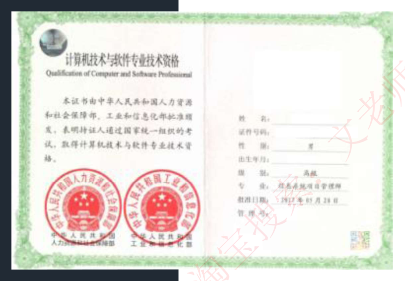
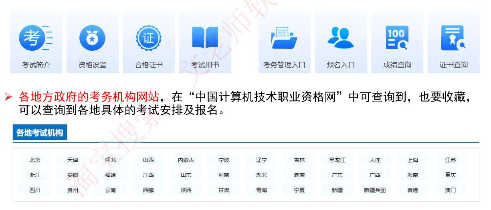
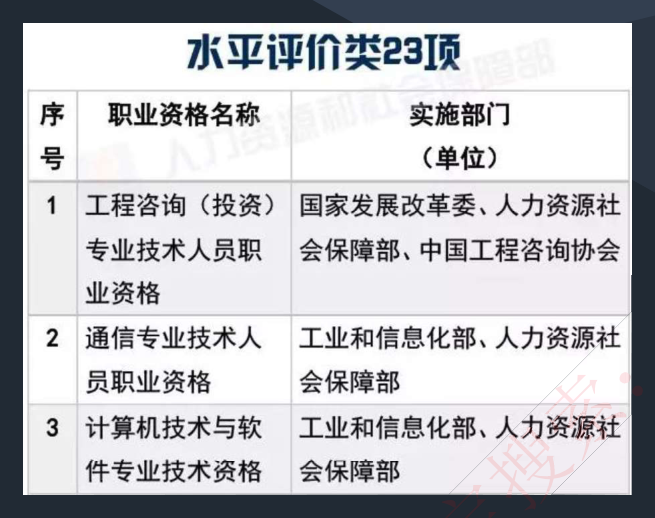

# 1. 软设考试介绍（新）

> 来源：`外部资源/1.软设考试介绍-新.pdf`（10 页 / 20 张幻灯片，文老师软考教育）
> 本文件为**逐页看图人工转录**，保留原讲义措辞与结论。原 PDF 中文字体缺 ToUnicode 映射，无法机器提取。
> 幻灯片顺序 = PDF 页序（每页上下 2 张）。图片/示意图以 `> [图]` 标注。

---

## 封面

**考试介绍、课程资料及复习方法**

- **考试介绍**：考试简介、考试报名、证书价值、实用网站、常见问题
- **考点分析**：考试总纲、科目一考点详解、科目二考点详解、通过率分析
- **备考复习**：配套学习资料、学习方法推荐

（文老师软件设计师）

---

## 1. 考试简介

### 1-1 软考全称与资格体系

◆◆◆ 软考全称是**计算机技术与软件专业技术资格（水平）考试**，是由国家**人力资源和社会保障部、工业和信息化部**领导下的国家级考试。

| | 计算机软件 | 计算机网络 | 计算机应用技术 | 信息系统 | 信息服务 |
|---|---|---|---|---|---|
| **高级资格** | 信息系统项目管理师　系统分析师　系统架构设计师　网络规划设计师　系统规划与管理师 ||||| 
| **中级资格** | 软件评测师 软件设计师 软件过程能力评估师 | 网络工程师 | 多媒体应用设计师 嵌入式系统设计师 计算机辅助设计师 电子商务设计师 | 系统集成项目管理工程师 信息系统监理师 信息安全工程师 数据库系统工程师 信息系统管理工程师 | 计算机硬件工程师 信息技术支持工程师 |
| **初级资格** | 程序员 | 网络管理员 | 多媒体应用制作技术员 电子商务技术员 | 信息系统运行管理员 | 网页制作员 信息处理技术员 |

### 1-2 软件设计师的定位

软件设计师考试属于全国计算机技术与软件专业技术资格考试（即软考）中的一个**中级考试**。

通过本考试的合格人员能根据软件开发项目管理和软件工程的要求，按照系统总体设计规格说明书进行软件设计；能够编写程序设计规格说明书等相应的文档；能够组织和指导程序员编写、调试程序，并对软件进行优化和集成测试，开发出符合系统总体设计要求的高质量软件；具有工程师的实际工作能力和业务水平；可聘任工程师职务。

简单的说，通过软件设计师考试，**代表你将拥有中级专业技术资格（工程师系列，中级）**，从级别上讲，它相当于中级会计、中级教师等，从专业技术资格来讲没有区别。

### 1-3 考试科目与合格标准

| 考试科目 | 考题形式 | 考试时长 | 合格标准 |
|---|---|---|---|
| 计算机与软件工程知识 | 75 道单选题（每题 1 分，总分 75 分） | 2023 年 11 月改革机试后，合并考试，总时间 240 分钟 | 45 分及以上 |
| 软件设计 | 6 道问答题，其中前 4 道必做，后两道题选做一题（每题 15 分，总分 75 分） | 同上 | 45 分及以上 |

**两门考试必须同时通过，才能拿到证书。否则下次重考两门。**

---

## 2. 考试报名

◆ **报名条件**：软件设计师考试**不设学历与资历条件，也不论年龄和专业**，考生可根据自己的技术水平选择合适的级别合适的资格，但**一次考试只能报考一种资格**。考试采用**机试形式**，考试实行全国**统一大纲、统一试题（人多可能会分批考试，不同试卷不同时间）、统一标准、统一证书**的考试办法。

◆ **报名时间和地址**：**基本都是网上报名**，一般在考试前 2 个月。各地报名时间不同。请关注：http://www.ruankao.org.cn/ ；同时关注考生所在地区考试中心网站通知。

◆ **考试安排**：一般都在 05 月的最后一周周六及 11 月第一周周六，一年安排 2 次考试。

> ⚠️ 备考注记（本项目补充，非原讲义内容）：2026 下半年上海考期为 **10/24–27**，与该页"11 月第一周周六"的旧口径不一致，以官方通知与准考证为准。

---

## 3. 证书价值

> [图]：计算机技术与软件专业技术资格证书样本（人力资源和社会保障部、工业和信息化部盖章）

- 以考代评
- 单位聘职称，升职加薪
- 找工作，提升职场竞争力
- 人才引进，人才补贴
- 直接落户或积分落户
- 入专家库，成为评标专家
- 招投标时加分项

---

## 4. 实用网站

➤ **中国计算机技术职业资格网**：http://www.ruankao.org.cn/ ；可以查询考试信息、考试成绩。另外，可以在该网站首页右下方"**各地考务机构**"栏目中查询到各地考试安排及报名通知等。**这是软考最重要的网站。**

> [图]：官网功能入口——考试简介／资格设置／合格证书／考试用书／考务管理入口／报名入口／成绩查询／证书查询

➤ **各地方政府的考务机构网站**，在"中国计算机技术职业资格网"中可查询到，也要收藏，可以查询到各地具体的考试安排及报名。

> [图]：各地考试机构列表——北京、天津、河北、山西、内蒙古、宁夏、辽宁、吉林、黑龙江、大连、上海、江苏、浙江、安徽、福建、江西、山东、河南、湖北、湖南、广东、广西、海南、重庆、四川、贵州、云南、西藏、陕西、甘肃、青海、宁夏、新疆、新疆兵团、香港、澳门

---

## 5. 常见问题

> [图]：《水平评价类 23 项》职业资格目录节选
>
> | 序号 | 职业资格名称 | 实施部门（单位） |
> |---|---|---|
> | 1 | 工程咨询（投资）专业技术人员职业资格 | 国家发展改革委、人力资源社会保障部、中国工程咨询协会 |
> | 2 | 通信专业技术人员职业资格 | 工业和信息化部、人力资源社会保障部 |
> | 3 | 计算机技术与软件专业技术资格 | 工业和信息化部、人力资源社会保障部 |

**Q：软考会取消吗？**
A：软考作为**计算机行业唯一的专业技术职称考试**，同会计等其他职称考试同等重要，不可能被取消。在 2016.12.16 日国务院最新公布的国家职业资格目录清单一样包括软考，可以说是更稳定了。在最新的 2017.09.17 也公布了国家职业资格目录，软考处于专业技术人员职业资格中，详见 http://www.gov.cn/xinwen/2017-09/17/content_5225705.htm 。

**Q：软考证书长期有效吗？**
A：多数省份已经**承认计算机资格证书长期有效并停止了证书登记的相关工作**。

---

## 考点分析 · 1. 考试总纲

**考试要求：**
1. 掌握计算机内的数据表示、算术和逻辑运算方法；
2. 掌握相关的应用数学及离散数学基础知识；
3. 掌握计算机体系结构以及各主要部件的性能和基本工作原理；
4. 掌握操作系统、程序设计语言的基础知识，了解编译程序的基本知识；
5. 熟练掌握常用数据结构和常用算法；
6. 熟悉数据库与网络基础知识；
7. 熟练掌握一种结构化程序设计语言（C 语言）和一种面向对象程序设计语言（C++ 或 Java）；
8. 熟悉软件工程、软件过程改进和软件开发项目管理的基础知识；
9. 掌握软件设计的方法和技术；
10. 了解信息化、常用信息技术标准、安全性，以及有关法律、法规的基础知识；
11. 正确阅读和理解计算机领域的英文资料。

---

## 考点分析 · 2. 上午考点详解（分值分布）

| 章节 | 考点分布 | 分数 |
|---|---|---|
| 0. 考试介绍 | 考试报名、考试科目、大纲及考点分析、证书价值、常见问题。视频课程规划、推荐资料、学习方法。 | 0 |
| 1. 计算机系统知识 | 数据的表示：进制转换、编码表示、逻辑运算、浮点数。 校验码：奇偶校验码、循环冗余校验码、海明校验码。 计算机硬件：硬件组成、CPU、寄存器等。 计算机指令：寻址方式、指令流水线计算。 计算机体系结构：体系结构分类、指令系统 CISC 和 RISC。 计算机存储系统：分级存储、cache、存储体系、虚拟存储器。 输入输出技术、总线。 系统可靠性分析。 | 6 |
| 2. 操作系统知识 | 进程管理：进程状态、前趋图、同步与互斥、调度、死锁、线程。 存储管理：分区、页式、段式、段页式、页面置换算法。 文件管理：索引文件结构、文件目录、文件存储空间管理。 设备管理：I/O 软件、虚拟设备和 SPOOLING 技术、磁盘调度。 作业管理：作业状态、调度算法、周转时间。 | 6 |
| 3. 数据库技术基础 | 数据库设计：三级模式-两级映像、需求分析、逻辑、物理设计。 E-R 模型：实体-联系图、关系模式转换。 关系代数：并、交、差、笛卡尔积、投影、选择、连接。 关系数据库的规范化：函数依赖、键和约束、范式、模式分解。 数据库的并发控制、并发控制、事务管理、封锁协议。 数据故障、数据恢复、数据备份。 数据仓库组成、数据挖掘算法。 反规范化技术、大数据。 SQL 语言：语法基础。 | 6 |
| 4. 计算机网络 | 网络体系结构：OSI/RM 七层模型、TCP/IP 模型。 网络技术标准和协议：局域网、广域网、TCP/IP 协议族、路由协议。 层次化局域网模型、综合布线系统。 IP 地址：分类编码、子网划分、路由聚合、无分类编制、IPv6。 其他重要概念：NAT、网关、VLAN、VPN、PPP、冲突域和广播域等。 | 5 |
| 5. 信息安全和网络安全 | 网络安全概述：五大基本要素、网络攻击、各种安全威胁分类。 网络安全技术：对称和非对称加密、信息摘要、数字签名。 密钥管理技术：数字证书、PKI 密钥管理体系。 计算机病毒和木马分类、常见考点。 防火墙技术、入侵检测技术。 | 4 |
| 6. 软件工程基础知识 | 软件工程概述、基本原理、生命周期、软件过程。 软件过程模型：瀑布、原型、增量、V 模型、喷泉模型、CBSD。 需求分析：需求分析方法、需求工程、需求管理。 系统设计：内聚、耦合、系统结构设计、模块设计、生命周期。 测试基础知识：测试原则、测试类型、测试策略。 测试阶段：单元、集成、确认、系统、回归测试。 测试用例设计：黑盒测试、边界值、边界值分析、白盒各种路径覆盖。 系统运行与维护：系统转换、系统维护、可维护性、系统评价。 软件质量、软件度量。 软件工具、软件开发环境。 | 8 |
| 7. 项目管理 | 软件项目管理：项目估算方法、进度管理、项目组织、质量管理、配置管理、风险管理。 | 3 |
| 8. 结构化开发方法 | 结构化分析与设计、内聚、耦合等，系统文档 结构化开发方法：结构化分析、数据流图设计原则、数据字典 结构化设计、WebApp 分析与设计、用户界面设计 | 3 |
| 9. 面向对象技术 | 面向对象基础：基本概念、分析与设计、测试。 面向对象的程序设计：JAVA、C++ 语法，见下午视频讲解。 UML：事物、关系、图，各种考点详细总结。 设计模式：各设计模式、常考关键字总结。 | 10 |
| 10. 程序语言基础知识 | 程序设计语言基本概念、基本组成、传值与传址。 编译程序基本原理：词法、语法、语义、中间代码、后缀表达式。 文法定义、正规式、有限自动机、语法分析方法。 | 6 |
| 11. 数据结构 | 线性结构：线性表、栈和队列、串。 数组、矩阵、广义表。 树与二叉树：二叉树的存储结构、遍历、线索二叉树、哈夫曼树、查找二叉树、平衡二叉树。 图：图的存储、遍历、最小生成树、拓扑序列、关键路径。 查找算法：顺序查找、折半查找、哈希表。 排序算法：直接插入、希尔、简单选择、堆、冒泡、快速、归并、基数排序算法、排序算法考点总结。 | 7 |
| 12. 算法分析与设计 | 算法分析：特性、时间、空间复杂度分析、经典算法。 算法设计：分治法、回溯法、贪心法、动态规划法、分支限界法。 概率算法、近似算法。 数据挖掘算法：分类、频繁模式和关联规则、聚类。 智能优化算法：ANN、遗传算法、SA、TS、蚁群算法、PSO。 | 3 |
| 13. 多媒体基础（**已经不考**） | 多媒体基础知识、声音、图像、视频 | 0 |
| 14. 标准化和软件知识产权 | 知识产权基础知识：保护期限、产权人、侵权判定、专利、商标、商业秘密。 标准化基础知识：标准的分类、标准的编号。 | 3 |
| 专业英语 | 专业英语词汇 | 5 |

---

## 考点分析 · 3. 下午考点详解

| 题号 | 试题类型 | 学科知识点 | 考察内容 |
|---|---|---|---|
| 试题 1 | 必答题 | 数据流图 DFD | 补充数据流图外部实体；补充数据流图数据存储；补充数据流（名称、起点、终点）；数据流图相关概念简答。 |
| 试题 2 | 必答题 | 数据库设计 | 补充 E-R 图；E-R 图转换为关系模式；主键和外键、新增联系判断。 |
| 试题 3 | 必答题 | UML 建模 | 用例图（联系类型，参与者）；类图和对象图（多重度，联系类型）；顺序图（补充对象名和消息名）；活动图（补充活动名，分岔线用途）；状态图（补充状态、状态转换条件）；通信图（补充对象名，消息名） |
| 试题 4 | 必答题 | C 算法设计 | C 语言代码填空。算法类型（动态规划法、分治法、回溯法、递归法、贪心法）；时间、空间复杂度；给定输入求输出。 |
| 试题 5 | 选答题 | C++ 语言程序设计 | 不推荐选做；C++ 语法（只考简单语法，不考算法）+ 设计模式。 |
| 试题 6 | 选答题 | Java 语言程序设计 | 推荐选做：Java 语法（只考简单语法，不考算法）+ 设计模式。 |

---

## 考点分析 · 4. 通过率分析

据参考资料统计，全国平均通过率 **15%-20%** 左右。

整体看来，通过率不算高，但要注意以下原因：
1. 每个考场约有 **1/3** 的考生缺考；
2. 少数考生未能进行全面有效的复习；

去除以上原因，据文老师对多数学员的回访来看，如果有切实可行的复习计划并且认真准备的考生，考试通过率是还可以的。

文老师软考中级：综合通过率高达 **80% 以上**。

软件设计师的考试主要是知识面广，但是并不难，学员只需要考到 **45 分**即可合格，跟着文老师的视频课程及复习资料学习，肯定有可能一次通过。

---

## 备考复习 · 1. 配套学习资料

| 课程配套 | 详细介绍 |
|---|---|
| 1. 直播重点串讲（独家） | 老师定期直播，串讲重难点并在线答疑，见后面直播课表 |
| 2. 全套录播精讲 | 最新版教材精讲以及历年真题讲解，并补充考点重点，见后面录播课表 |
| 3. 配套课件 | 录播、直播视频配套老师上课用的课件 pdf 版本，与视频章节一致，便于学员听课以及复习 |
| 4. 课后习题（独家） | 老师独家整理的章节分类习题，由历年真题和模拟题分类汇总而成，与视频章节一致，便于学员在听完课后直接练习，**包含选择题+案例** |
| 5. 历年真题 | 不少于近十套真题试卷版，便于学员打印练习，并有详细答案解析 |
| 6. 精华知识点（独家） | 老师独家整理的精华知识点汇总，与课程目录一致，直击考点重点，**包含选择题+案例考点重点汇总** |
| 7. 其他增值资料 | 包括学员经验、官方教材等其他共享资料。 |
| 8. 助教在线答疑（独家） | 每个群里都有助教答疑，答疑时间 09:00-23:00，并通知报名、考试、领证关键信息 |
| 9. 制定学习计划（独家） | 群公告定期发布详细学习计划，引导学员学习 |

---

## 备考复习 · 2. 学习方法推荐

### 第一阶段学习计划

1. **复习目标**：整体学习一遍视频课程，掌握整个知识体系结构。
2. **复习时间**：约 **100 个小时**，个人自己规划。
3. **要完成的事情（重要）**：
   - 3.1 学习完所有录播视频课程，如果期间有直播，按时来听直播课。
   - 3.2 **课后重点理解记忆视频配套课件。**
   - 3.3 **做完视频配套课后习题。**
4. **怎么完成这些事**：结合课件，学习视频课程，每看完一个章节课程，就立即回顾课件重点内容，而后做对应章节课后习题，视频资料都是配套的，千万不要全部看完视频再做习题。

**Tips**：遇到做错的题目，可以直接截图或者拍照保存下来，便于后面回顾错题。

### 第二阶段学习计划

1. **学习目标**：融汇贯通，达到可以通过考试的水准。
2. **学习时间**：约 **70 个小时**，个人自己规划。
3. **要完成的事情（重要）**：
   - 3.1 做真题：从最新真题开始，向前做，完成 **8-10 套真题（上午+下午）**。
   - 3.2 听直播：重难点串讲及历年真题解析。
   - 3.3 自己形成错题本，把做错的真题和知识点都截图形成自己的错题本，便于最后冲刺。
4. **怎么完成这些事**：
   - 4.1 必须严格按照试卷形式来做，最好严格控制时间，每次考试上午+下午一起做，不要分开偏科。
   - 4.2 建议每周练习 2 套真题，认真搞懂，形成错题本，不要只图速度。

### 第三阶段学习计划

1. **学习目标**：查缺补漏，不断优化，无论什么题型，都能稳过。
2. **学习时间**：约 **30 个小时**，个人自己规划。
3. **要完成的事情（重要）**：
   - 3.1 看视频：开始看冲刺视频课程。
   - 3.2 上午测试不合格学员：一定要背内部精华讲义，掌握精华知识点上午无忧。
   - 3.3 下午测试不合格学员：前三题阅读理解，无技巧，细心多做；算法题要求能拿到除代码填空以外的分数；JAVA 题必拿满分，有困难的可以快速浏览一遍网上教程，然后针对性的刷历年真题。
4. **怎么完成这些事**：
   - 4.1 明确自己的不足，重点专项突破，查缺补漏。
   - 4.2 一定要多回顾错题本和重点知识。
