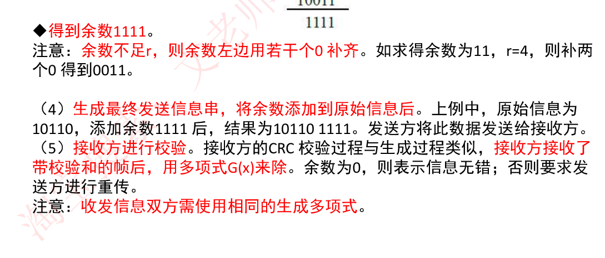
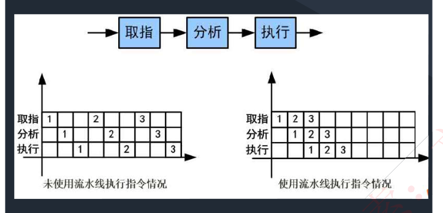
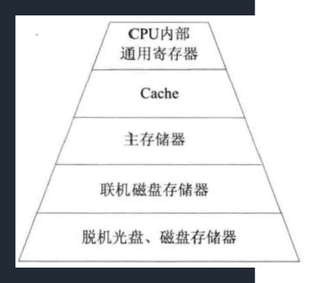
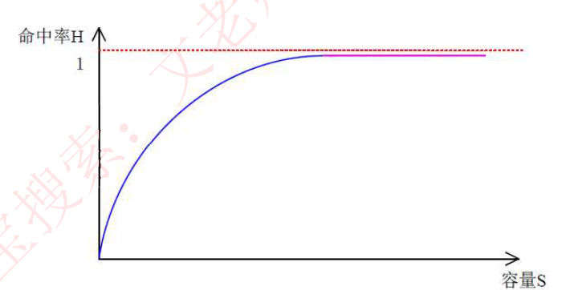
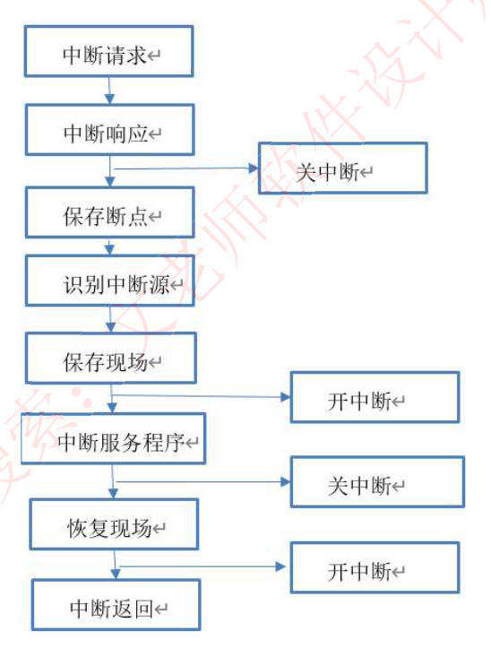
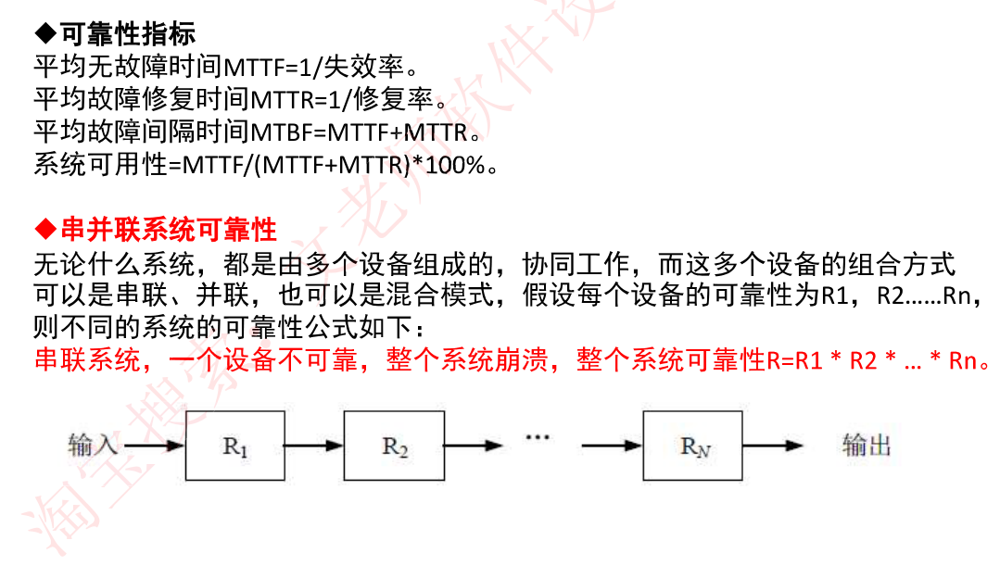
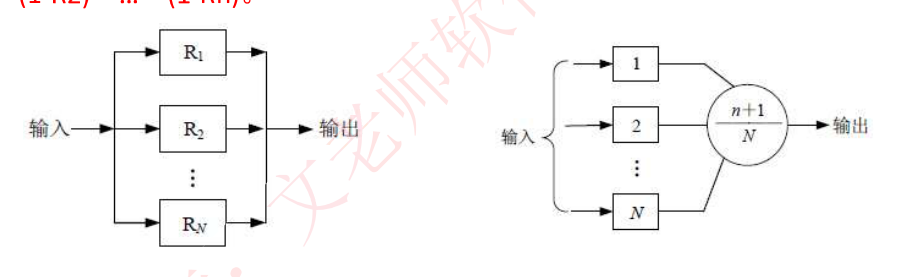
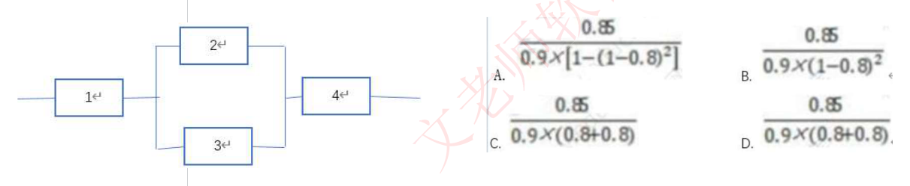

# 2. 计算机组成与结构

> 来源：`外部资源/2.计算机组成与结构.pdf`（26 页 / 52 张幻灯片，文老师软考教育）
> 逐页看图人工转录。幻灯片顺序 = PDF 页序。`> [图]` 表示原件为图示。

---

## 封面 · 本章目录

- **计算机系统基础知识**：计算机硬件组成、中央处理单元、数据表示、校验码
- **计算机体系结构**：体系结构分类、指令系统、存储系统、输入/输出技术、总线结构
- **可靠性**：计算机可靠性计算

---

## 1. 计算机硬件组成

◆ **计算机的基本硬件系统**由运算器、控制器、存储器、输入设备和输出设备 **5 大部件**组成。

◆ **运算器、控制器等部件被集成在一起统称为中央处理单元（Central Processing Unit，CPU）**。CPU 是硬件系统的核心，用于**数据的加工处理，能完成各种算术、逻辑运算及控制功能**。

◆ 存储器是计算机系统中的**记忆设备**，分为**内部存储器和外部存储器**。前者速度高、容量小，一般用于临时存放程序、数据及中间结果。而后者容量大、速度慢，可以长期保存程序和数据。

◆ **输入设备和输出设备合称为外部设备（简称外设）**，输入设备用于输入原始数据及各种命令，而输出设备则用于输出计算机运行的结果。

---

## 2. 中央处理单元

### 2-1 CPU 的功能

1. **程序控制**。CPU 通过执行指令来控制程序的执行顺序，这是 CPU 的重要功能。
2. **操作控制**。一条指令功能的实现需要若干操作信号配合来完成，CPU 产生每条指令的操作信号并将操作信号送往对应的部件，控制相应的部件按指令的功能要求进行操作。
3. **时间控制**。CPU 对各种操作进行时间上的控制，即操作执行过程中操作信号的出现时间、持续时间及出现的时间顺序都需要进行严格控制。
4. **数据处理**。CPU 通过对数据进行算术运算及逻辑运算等方式进行加工处理，数据加工处理的结果被人们所利用。所以，对数据的加工处理也是 CPU 最根本的任务。

此外，CPU 还需要**对系统内部和外部的中断（异常）做出响应**，进行相应的处理。

### 2-2 CPU 的组成

◆ CPU 主要由**运算器、控制器、寄存器组和内部总线**等部件组成。

◆ **运算器**：由**算术逻辑单元 ALU**（实现对数据的算术和逻辑运算）、**累加寄存器 AC**（运算结果或源操作数的存放区）、**数据缓冲寄存器 DR**（暂时存放内存的指令或数据）、和**状态条件寄存器 PSW**（保存指令运行结果的条件码内容，如溢出标志等）组成。执行所有的算术运算，如加减乘除等；执行所有的逻辑运算并进行逻辑测试，如与、或、非、比较等。

◆ **控制器**：由**指令寄存器 IR**（暂存 CPU 执行指令）、**程序计数器 PC**（存放指令执行地址）、**地址寄存器 AR**（保存当前 CPU 所访问的内存地址）、**指令译码器 ID**（分析指令操作码）等组成。**控制整个 CPU 的工作，最为重要。**

◆ CPU 依据**指令周期的不同阶段**来**区分二进制的指令和数据**，因为在指令周期的不同阶段，指令会命令 CPU 分别去取指令或者数据。

### 【考试真题】

**1.** CPU 执行算术运算或者逻辑运算时，常将源操作数和结果暂存在（ ）中。
A. 程序计数器 (PC)　B. 累加器 (AC)　C. 指令寄存器 (IR)　D. 地址寄存器 (AR)
**【答案】B**

**2.** 执行 CPU 指令时，在一个指令周期的过程中，首先需从内存读取要执行的指令，此时先要将指令的地址即（ ）的内容送到地址总线上。
A. 指令寄存器 (IR)　B. 通用寄存器 (GR)　C. 程序计数器 (PC)　D. 状态寄存器 (PSW)
**答案：C**

---

## 3. 数据表示

### 3-1 进制的表示与转换

◆ **进制的表示**：二进制、十六进制，一般在题目中会给出中文说明，如果没给出，注意**二进制符号为 0b，一般表示为 0b0011**，**十六进制符号为 0x 或 H，可表示为 0x18F 或 18FH**。（十六进制可表示 0-15，其中 10-15 用 A-F 来表示）

◆ **R 进制整数转十进制**：位权展开法，用 R 进制数的每一位乘以 R 的 n 次方，n 是变量，从 R 进制数的整数最低位开始，依次为 0,1,2,3…累加。

例如有 6 进制数 5043，此时 R=6，用 6 进制数的每一位乘以 6 的 n 次方，n 是变量，从 6 进制数的整数最低位开始（5043 从低位到高位排列：3,4,0,5），n 依次为 0,1,2,3，那么最终 5043 = 3\*6^0 + 4\*6^1 + 0\*6^2 + 5\*6^3 = **1107**。

◆ **十进制转 R 进制**：十进制整数（除以 R 倒取余数），用十进制整数除以 R，记录每次所得余数，若商不为 0，则继续除以 R，直至商为 0，而后将所有余数从下至上记录，排列成从左至右顺序，即为转换后的 R 进制数；

例：有十进制数 200，转换为 6 进制，此时 R=6，将 200/6，得商为 33，余数为 2；因为商不等于 0，因此再将 33/6，得商为 5，余数为 3；再将 5/6，得商为 0，余数为 5；此时商为 0，将所有余数从下到上记录，得 **532**。

◆ **m 进制转 n 进制**：先将 m 进制转化为十进制，再将十进制数转化为 n 进制数，中间需要通过十进制中转，但**下面两种进制间可以直接转化**：

◆ **二进制转八进制**：每**三位**二进制数转换为一位八进制数，二进制数位个数不是三的倍数，则**在前面补 0**（原则是数值不变），如二进制数 01101 有五位，前面补一个 0 就有六位，为 001 101，每三位转换为一位八进制数，001=1,101=1+4=5，也即 01101=15。

◆ **二进制转十六进制**：每**四位**二进制数转换为一位十六进制数，二进制数位个数不是四的倍数，则**在前面补 0**，如二进制数 101101 有六位，前面补两个 0 就有八位，为 0010 1101，每四位转换为一位十六进制数，0010=2,1101=13=D，也即 101101=2D。

### 3-2 机器数与码制

◆ **机器数**：各种**数值在计算机中表示的形式**，其特点是**使用二进制计数制**，数的**符号用 0 和 1 表示，小数点则隐含，不占位置**。机器数有无符号数和带符号数之分。**无符号数表示正数，没有符号位**。带符号数最高位为符号位，**正数符号位为 0，负数符号位为 1**。

◆ **定点表示法**分为**纯小数和纯整数**两种，其中小数点不占存储位，而是按照以下约定：
- 纯小数：约定小数点的位置在机器数的最高数值位之前。
- 纯整数：约定小数点的位置在机器数的最低数值位之后。

◆ **真值**：机器数对应的实际数值。

◆ 带符号数有下列编码方式，当真值为 -45 时：
- **原码**：一个数的**正常二进制表示**，最高位表示符号，数值 0 的源码有两种形式：+0（0 0000000）和 -0（1 0000000）。-45 对应原码为 **10101101**
- **反码**：**正数的反码即原码**；负数的反码是在原码的基础上，**除符号位外，其他各位按位取反**。数值 0 的反码也有两种形式：+0（0 0000000），-0（1 1111111）。-45 对应反码为 **11010010**
- **补码**：**正数的补码即原码**；负数的补码是在原码的基础上，**除符号位外，其他各位按位取反，而后末位 +1，若有进位则产生进位**。因此数值 0 的补码只有一种形式 +0 = -0 = 0 0000000。-45 对应补码为 **11010011**
- **移码**：用作浮点运算的阶码，**无论正数负数，都是将该原码的补码的首位（符号位）取反得到移码**。-45 对应移码为 **01010011**

### 3-3 各种码制的取值范围

◆ 机器字长为 n 时各种码制表示的带符号数的取值范围（差别在于 0 的表示，原码和反码分 +0 和 -0，补码只有一个 0，因此可以多表示一个。）：

| 码制 | 定点整数 | 定点小数 |
|---|---|---|
| 原码 | −(2^(n−1)−1) ～ +(2^(n−1)−1) | −(1−2^−(n−1)) ～ +(1−2^−(n−1)) |
| 反码 | −(2^(n−1)−1) ～ +(2^(n−1)−1) | −(1−2^−(n−1)) ～ +(1−2^−(n−1)) |
| 补码 | −2^(n−1) ～ +(2^(n−1)−1) | −1 ～ +(1−2^−(n−1)) |
| 移码 | −2^(n−1) ～ +(2^(n−1)−1) | −1 ～ +(1−2^−(n−1)) |

例：若机器字长为 8，请给出 45 和 -45 的原码、反码、补码和移码。

| 真值 | 原码 | 反码 | 补码 | 移码 |
|---|---|---|---|---|
| 45 | 00101101 | 00101101 | 00101101 | 10101101 |
| -45 | 10101101 | 11010010 | 11010011 | 01010011 |

### 3-4 浮点数

◆ **浮点数**：表示方法为 **N = F × 2^E**，其中 E 称为**阶码**，F 称为**尾数**；类似于十进制的科学计数法，如 85.125 = 0.85125×10^2，二进制如 101.011 = 0.101011×2^3。

在浮点数的表示中，**阶码为带符号的纯整数，尾数为带符号的纯小数**，要注意符号占最高位（正数 0 负数 1），其表示格式如下：

| 阶符 | 阶码 | 数符 | 尾数 |
|---|---|---|---|

很明显，与科学计数法类似，一个浮点数的表示方法不是唯一的，浮点数所能表示的**数值范围由阶码确定**，所表示的**数值精度由尾数确定**。

◆ **尾数的表示采用规格化方法**，也即带符号尾数的补码必须为 **1.0xxxx（负数）**或者 **0.1xxxx（正数）**，其中 x 可为 0 或 1。

◆ **浮点数的运算**：
1. **对阶**（使两个数的阶码相同，**小阶向大阶看齐**，较小阶码增加几位，尾数就右移几位）
2. **尾数计算**（相加，若是减法运算，则加负数）
3. **结果规格化**（即尾数表示规格化，带符号尾数转换为 1.0xxxx 或 0.1xxxx）

⚠️ 备考注记：本资料的浮点运算只列了三步，**漏了教材（《软件设计师教程》第 5 版）的后两步「舍入」与「判溢出」**——规格化右移会丢掉低位需要舍入，阶码调整后可能超出阶码位数的表示范围（超上界为上溢、超下界为下溢）需要判断。考试若问「浮点加减的步骤」，按 **对阶 → 尾数运算 → 结果规格化 → 舍入 → 判溢出** 的教材口径答。

### 【考试真题】

**1.** 如果 "2X" 的补码是 "90H"，那么 X 的真值是（ ）。
A. 72　B. -56　C. 56　D. 111
**答案：B**
解析：这里主要是考察补码的表示，补码中无正负之分，符号位作为数值参与计数。2X 的补码 90H 转换为二进制为 1001 0000，可知最高位符号位为 1，也就是负数，按照负数转化为补码规则（先取反后加 1），求真值应该逆向转化即对补码先 -1 再取反，得出 2X 的源码为 1111 0000，在真值中区分正负，最高位作为符号独立显示，不参与计数（与补码的区别），因此为 -1110000=-112，X 就是 -56。

**2.** 设 16 位浮点数，其中阶符 1 位、阶码值 6 位、数符 1 位、尾数 8 位。若阶码用移码表示，尾数用补码表示，则该浮点数所能表示的数值范围是（ ）
A: -2^64 ～ (1-2^-8) 2^64
B: -2^63 ～ (1-2^-8) 2^63
C: -2^64 ～ (1-2^-(1-2^-8)) 2^64 ～ (1-2^-8) 2^64
D: -(1-2^-8) 2^63 ～ (1-2^-8) 2^63
**答案：B**
解析：阶码用移码表示，共 8 位，则有 2^8=64 位来表示阶码，取 n=64 计算出移码可表示最大 2^63，而尾数用补码表示，因为尾数是小数，因此代入补码小数范围的公式，可表示 -1-(1-2^-8)，然后首尾分别与 2 的 63 次方相乘得出答案是 B

⚠️ 备考注记：**答案 B 正确，但这段解析的推导过程有多处错误，不要照抄**。① 阶码是「阶符 1 位 + 阶码值 6 位 = 共 7 位」，不是 8 位；② 「2^8=64 位来表示阶码」一句里错了两处——2^8 是 256 不是 64，而且 2ⁿ 算出来的是编码个数、不是位数；③ 「取 n=64」无出处。正确推导：7 位移码表示的定点整数范围为 −2^6 ～ 2^6−1 即 −64～63，**最大阶码 63**；尾数是「数符 1 位 + 尾数 8 位 = 共 9 位」的补码定点小数，范围 −1 ～ 1−2^−8。两端相乘：最大值 = (1−2^−8)×2^63，最小值 = (−1)×2^63 = −2^63，故选 B。另：选项 C 在原幻灯片上印的就是一串不成区间的乱码（幻灯片原样为 `-2^64 ～（1-2-（1-2^-8）2^64 ～（1-2^-8）2^64`，2026-09-07 已对照 `外部资源/2.计算机组成与结构.pdf` 第 7 页复核），属原件排版讹误，本转录按原样保留，做题时忽略该项即可。

---

## 4. 校验码

### 4-1 码距与奇偶校验码

◆ **码距**：就单个编码 A：00 而言，其码距为 1，因为其只需要改变一位就变成另一个编码。**在两个编码中，从 A 码到 B 码转换所需要改变的位数称为码距**，如 A：00 要转换为 B：11，码距为 2。一般来说，**码距越大，越利于纠错和检错**。

◆ **奇偶校验码**：在编码中**增加 1 位校验位来使编码中 1 的个数为奇数（奇校验）或者偶数（偶校验），从而使码距变为 2**。例如：

**奇校验**：编码中，**含有奇数个 1**，发送给接收方，接收方收到后，会计算收到的编码中有多少个 1，如果是奇数个，则无误，是偶数个，则有误。

**偶校验**同理，只是编码中**有偶数个 1**，由上述，奇偶校验**只能检 1 位错，并且无法纠错**。

### 4-2 CRC 循环冗余校验码

◆ CRC **只能检错，不能纠错**。使用 CRC 编码，需要**先约定一个生成多项式 G(x)**。生成多项式的最高位和最低位必须是 1。假设原始信息有 m 位，则对应多项式 M(x)。生成校验码思想就是**在原始信息位后追加若干校验位，使得追加的信息能被 G(x) 整除**。**接收方接收到带校验位的信息，然后用 G(x) 整除。余数为 0，则没有错误；反之则发生错误。**

例：假设原始信息串为 10110，CRC 的生成多项式为 G(x)=x^4+x+1，求 CRC 校验码。
1. **在原始信息位后面添 0**，假设生成多项式的阶为 r，则在原始信息位后添加 r 个 0。本题中，G(x) 阶为 4，则在原始信息串后加 4 个 0，得到的新串为 101100000，作为被除数。
2. **由多项式得到除数**，多项中 x 的幂指数存在的位置 1，不存在的位置 0。本题中，x 的幂指数为 0,1,4 的变量都存在，而幂指数为 2,3 的不存在，因此得到串 10011。
3. **生成 CRC 校验码**，将前两步得出的被除数和除数进行模 2 除法运算（即不进位也不借位的除法运算）。除法过程如下图所示。

> [图] 竖式除法：10011 ) 101100000 → 逐步异或 10011 → 10100 → 10011 → 11100 → 10011 → 1111



◆ **得到余数 1111**。
注意：**余数不足 r，则余数左边补若干个 0 补齐**。如求得余数为 11，r=4，则补两个 0 得到 0011。

4. **生成最终发送信息串，将余数添加到原始信息后**。上例中，原始信息为 10110，添加余数 1111 后，结果为 **10110 1111**。发送方将此数据发送给接收方。
5. **接收方进行校验**。接收方的 CRC 校验过程与生成过程类似，**接收方接收了带校验和的帧后，用多项式 G(x) 来除**。余数为 0，则表示信息无错；否则要求发送方进行重传。

注意：**收发信息双方需使用相同的生成多项式。**

### 【考试真题】

循环冗余校验码（Cyclic Redundancy Check，CRC）是数据通信领域中最常用的一种差错校验码，该校验方法中，使用多项式除法（模 2 除法）运算后的余数为校验字段。若数据信息为 n 位，则将其左移 k 位后，被长度为 k+1 位的生成多项式相除，所得的 k 位余数即构成 k 个校验位，构成 n+k 位编码。若数据信息为 1100，生成多项式为 X3+X+1（即 1011），则 CRC 编码是（ ）。
A.1100010　B.1011010　C.1100011　D.1011110
**答案：A**
解析：CRC 循环校验码的编码流程为：
1. 在原始信息位后加 k 个 000，即 1100000。
2. 将 1100000 与生成多项式 1011 做模 2 除法，得到余数为 010。
3. 将原始信息位与余数连接起来得到：1100010。

### 4-3 海明码

◆ **海明码**：本质也是**利用奇偶性**来检错和纠错的检验方法，构成方法是在**数据位之间的确定位置上插入 k 个校验位**，通过**扩大码距实现检错和纠错**。设**数据位是 n 位，校验位是 k 位，则 n 和 k 必须满足以下关系：2^k − 1 >= n + k**。

例：求信息 1011 的海明码

**1. 校验位的位数和具体的数据位的位数之间的关系**
所有位都编号，从最低位编号，从 1 开始递增，**校验位处于 2 的 n（n=0 1 2……）次方内，即处于第 1,2,4,8,16,32,……位上**，其余位才能填充真正的数据位，若信息数据为 1011，则可知，第 1,2,4 位为校验位，第 3,5,6,7 位为数据位，用来从低位开始存放 1011，得出信息位和校验位分布如下：

| 位数 | 7 | 6 | 5 | 4 | 3 | 2 | 1 |
|---|---|---|---|---|---|---|---|
| 信息位 | I₄ | I₃ | I₂ | | I₁ | | |
| 校验位 | | | | r₂ | | r₁ | r₀ |

**2. 计算校验码**
将所有信息位的编号都拆分成二进制表示，如下图所示：
```
7 = 2² + 2¹ + 2⁰,  6 = 2² + 2¹,  5 = 2² + 2⁰,  3 = 2¹ + 2⁰
r₂ = I₄ ⊕ I₃ ⊕ I₂
r₁ = I₄ ⊕ I₃ ⊕ I₁
r₀ = I₄ ⊕ I₂ ⊕ I₁
```

| 位数 | 7 | 6 | 5 | 4 | 3 | 2 | 1 |
|---|---|---|---|---|---|---|---|
| 信息位 | 1 | 0 | 1 | | 1 | | |
| 校验位 | | | | 0 | | 0 | 1 |

上图中，7=4+2+1，表示 7 由第 4 位校验位 (r2) 和第 2 位校验位 (r1) 和第 1 位校验位 (r0) 共同校验，同理，第 6 位数据 6=4+2，第 5 位数据 5=4+1，第 3 位数据 3=2+1，前面知道，这些 2 的 n 次方都是校验位，可知，第 4 位校验位校验第 7、6、5 三位数据位，因此，第 4 位校验位 r2 等于这三位数据位的值异或，第 2 位和第 1 位校验位计算原理同上。

计算出三个校验位后，可知最终要发送的海明校验码为 **1010101**。

**3. 检错和纠错原理**
接收方接收到海明码之后，会将每一位校验位与其校验的位数分别异或，即做如下三组运算：
```
r₂ ⊕ I₄ ⊕ I₃ ⊕ I₂
r₁ ⊕ I₄ ⊕ I₃ ⊕ I₁
r₀ ⊕ I₄ ⊕ I₂ ⊕ I₁
```
如果是偶校验，那么**运算得到的结果应该全为 0**，如果是奇校验，应该全为 1，才是正确。假设是偶校验，且**接收到的数据为 1011101（第四位出错）**，此时，运算的结果为：
```
r₂ ⊕ I₄ ⊕ I₃ ⊕ I₂ = 1 ⊕ 1 ⊕ 0 ⊕ 1 = 1
r₁ ⊕ I₄ ⊕ I₃ ⊕ I₁ = 0 ⊕ 1 ⊕ 0 ⊕ 1 = 0
r₀ ⊕ I₄ ⊕ I₂ ⊕ I₁ = 1 ⊕ 1 ⊕ 1 ⊕ 1 = 0
```
这里不全为 0，表明传输过程有误，并且按照 r2r1r0 排列为二进制 100，这里指出的就是错误的位数，表示第 100，即第 4 位出错，找到了出错位，**纠错方法就是将该位逆转**。

### 【考试真题】

海明码是一种纠错码，其方法是为需要校验的数据位增加若干校验位，使得校验位的值决定于某些被校验位的数据，当被校验位出错时，可根据校验位的值的变化找出出错位，从而纠正错误。对于 32 位的数据，至少需要加（ ）个校验位才能构成海明码。
以 10 位数据为例，其海明码表示为 D9D8D7D6D5D4P4D3D2D1P3D0P2P1 中，其中 Di（0≤i≤9）表示数据位，Pj（1≤j≤4）表示校验位，数据位 D9 由 P4、P3 和 P2 进行校验（从右至左 D9 的位序为 14，即等于 8+4+2，因此用第 8 位的 P4、第 4 位的 P3 和第 2 位的 P2 校验），数据位 D5 由（ ）进行校验
A.3　B.4　C.5　D.6
A.P4P1　B. P4P2　C.P4P3P1　D. P3P2P1
**答案：D　B**

---

## 计算机体系结构 · 1. 体系结构分类

◆ **按处理机的数量**进行分类：单处理系统（一个处理单元和其他设备集成）、并行处理系统（两个以上的处理机互联）、分布式处理系统（物理上远距离且松耦合的多计算机系统）。

◆ **Flynn 分类法**：分类有两个因素，即**指令流和数据流**，指令流由控制部分处理，每一个控制部分处理一条指令流，多指令流就有多个控制部分；数据流由处理器来处理，每一个处理器处理一条数据流，多数据流就有多个处理器；至于**主存模块，是用来存储的，存储指令流或者数据流**，因此，无论是多指令流还是多数据流，都需要多个主存模块来存储，对于主存模块，指令和数据都一样。

| 体系结构类型 | 结构 | 关键特性 | 代表 |
|---|---|---|---|
| 单指令流单数据流 SISD | 控制部分：一个<br>处理器：一个<br>主存模块：一个 | — | 单处理器系统 |
| 单指令流多数据流 SIMD | 控制部分：一个<br>处理器：多个<br>主存模块：多个 | 各处理器以异步的形式执行同一条指令 | 并行处理机<br>阵列处理机<br>超级向量处理机 |
| 多指令流单数据流 MISD | 控制部分：多个<br>处理器：一个<br>主存模块：多个 | 被证明不可能，至少是不实际 | 目前没有，有文献称流水线计算机为此类 |
| 多指令流多数据流 MIMD | 控制部分：多个<br>处理器：多个<br>主存模块：多个 | 能够实现作业、任务、指令等各级全面并行 | 多处理机系统<br>多计算机 |

◆ 依据计算机特性，是**由指令来控制数据的传输**，因此，一条指令可以控制一条或多条数据流，但**一条数据流不能被多条指令控制，否则会出错**，就如同上级命令太多还互相冲突，不知道该执行哪个，因此**多指令单数据 MISD 不可能**。

---

## 计算机体系结构 · 2. 指令系统

### 2-1 指令的组成与执行过程

◆ **计算机指令的组成**：一条指令由**操作码和操作数**两部分组成，操作码**决定要完成的操作**，操作数指**参加运算的数据及其所在的单元地址**。在计算机中，操作要求和操作数地址都由二进制数码表示，分别称作操作码和地址码，整条指令以二进制编码的形式存放在存储器中。

◆ **计算机指令执行过程**：**取指令——分析指令——执行指令**三个步骤，首先将程序计数器 PC 中的指令地址取出，送入地址总线，CPU 依据指令地址去内存中取出指令内容存入指令寄存器 IR；而后由指令译码器进行分析，分析指令操作码；最后执行指令，取出指令执行所需的源操作数。

### 2-2 寻址方式

◆ **指令寻址方式**
- **顺序寻址方式**：当执行一段程序时，是一条指令接着一条指令地顺序执行。
- **跳跃寻址方式**：指下一条指令的地址码**不是由程序计数器给出，而是由本条指令直接给出**。程序跳跃后，按新的指令地址开始顺序执行。因此，程序计数器的内容也必须相应改变，以便及时跟踪新的指令地址。

◆ **指令操作数的寻址方式**
- **立即寻址方式**：指令的地址码字段指出的不是地址，而是操作数本身。
- **直接寻址方式**：在指令的地址字段中直接指出操作数在主存中的地址。
- **间接寻址方式**：指令地址码字段所指向的存储单元中存储的是操作数的地址。
- **寄存器寻址方式**：指令中的地址码是寄存器的编号。
- **基址寻址方式**：将基址寄存器的内容加上指令中的形式地址而形成操作数的有效地址，其优点是可以扩大寻址能力。
- **变址寻址方式**：变址寻址方式计算操作数有效地址的方法与基址寻址方式很相似，它是将变址寄存器的内容加上指令中的形式地址而形成操作数的有效地址。

### 2-3 CISC 与 RISC

CISC 是**复杂指令系统**，兼容性强，指令繁多、长度可变，由微程序实现；
RISC 是**精简指令系统**，指令少，使用频率接近，主要依靠硬件实现（通用寄存器、硬布线逻辑控制）。

具体区别如下：

| 指令系统类型 | 指令 | 寻址方式 | 实现方式 | 其它 |
|---|---|---|---|---|
| CISC（复杂） | 数量多，使用频率差别大，可变长格式 | 支持多种 | 微程序控制技术（微码） | 研制周期长 |
| RISC（精简） | 数量少，使用频率接近，定长格式，大部分为单周期指令，操作寄存器，只有 Load/Store 操作内存 | 支持方式少 | 增加了通用寄存器；硬布线逻辑控制为主；适合采用流水线 | 优化编译，有效支持高级语言 |

### 2-4 流水线

◆ **指令流水线原理**：将**指令分成不同段，每段由不同的部分去处理**，因此可以产生叠加的效果，所有的部件去处理指令的不同段

> [图] 取指 → 分析 → 执行；未使用流水线执行指令 vs 使用流水线执行指令 的时空对比图



◆ **RISC 中的流水线技术**：
1. **超流水线（Super Pipe Line）技术**。它通过细化流水、增加级数和提高主频，使得在每个机器周期内能完成一个甚至两个浮点操作。其实质是**以时间换取空间**。
2. **超标量（Super Scalar）技术**。它通过内装多条流水线来同时执行多个处理，其时钟频率虽然与一般流水线接近，却有更小的 CPI。其实质是**以空间换取时间**。
3. **超长指令字（Very Long Instruction Word，VLIW）技术**。VLIW 和超标量都是 20 世纪 80 年代出现的概念，其共同点是要同时执行多条指令，其不同在于超标量依靠硬件来实现并行处理的调度，VLIW 则充分发挥**软件的作用**，而使硬件简化，性能提高。

### 2-5 流水线时间计算

◆ **流水线时间计算**
- **流水线周期**：指令分成不同执行段，其中执行时间最长的段为流水线周期。
- **流水线执行时间**：1 条指令总执行时间 +（总指令条数 −1）\* 流水线周期。
- **流水线吞吐率计算**：吞吐率即单位时间内执行的指令条数。**公式：指令条数 / 流水线执行时间。**
- **流水线的加速比计算**：加速比即使用流水线后的效率提升度，即比不使用流水线快了多少倍，越高表明流水线效率越高。**公式：不使用流水线执行时间 / 使用流水线执行时间。**

### 【考试真题】

**1.** 流水线技术是通过并行硬件来提高系统性能的常用方法。对于一个 k 段流水线，假设其各段的执行时间均相等（设为 t），输入到流水线中的任务是连续的理想情况下，完成 n 个连续任务需要的总时间为（ ）。若某流水线浮点加法运算器分为 5 段，所需要的时间分别是 6ns、7ns、8ns、9ns 和 6ns，则其最大加速比为（ ）。
A.nkt　B.(k+n-1)t　C.(n-k)kt　D.(k+n+1)t
A.4　B.5　C.6　D.7
**答案：B　A**
解析：当流水线各段执行时间相等时，公式化简后，完成 n 个连续任务需要的总时间为 (k+n-1)\*t。加速比定义为顺序执行时间与流水线执行时间的比值，根据题干假设，假设一共有 n 条指令，则顺序执行时间为 (6+7+8+9+6)\*n=36n，该流水线周期为最长的 9ns，则在流水线中的执行时间为 36+9\*(n-1)=9n+27，因此加速比为 36n/(9n+27)，题目问的是最大加速比，由这个公式可以知道，当 n 越大时，该公式值越大，因此最大的时候就是 n 趋向于无穷大的时候，此时可忽略分母的 27，也就是 36n/9n=4.

**2.** 流水线的吞吐率是指流水线在单位时间里所完成的任务数或输出的结果数。设某流水线有 5 段，有 1 段的时间为 2ns，另外 4 段的每段时间为 1ns，利用此流水线完成 100 个任务的吞吐率约为（ ）个/s。
A.500×10^6　B.490×10^6　C.250×10^6　D.167×10^6
解析：流水线执行 100 个任务所需要的时间为：(2+1+1+1+1) + (100 - 1) \*2=204ns。所以每秒吞吐率为：(100/204)\*10^9=490\*10^6。注意：1 秒 =10^9 纳秒。
**答案：B**

**3.** 假设磁盘块与缓冲区大小相同，每个盘块读入缓冲区的时间为 15us，由缓冲区送至用户区的时间是 5us，在用户区内系统对每块数据的处理时间为 1us，若用户需要将大小为 10 个磁盘块的 Docl 文件逐块从磁盘读入缓冲区，并送至用户区进行处理，那么采用单缓冲区需要花费的时间为（ ）us；采用双缓冲区需要花费的时间为（ ）us。
A.150　B.151　C.156　D.201
A.150　B.151　C.156　D.201
**答案：D　C**
单缓冲区：前两段要合并，是两段流水线，21+20\*(10-1)=201
双缓冲区：标准三段流水线，21+15\*(10-1)=156

---

## 计算机体系结构 · 3. 存储系统

### 3-1 分级存储体系与局部性原理

◆ 计算机采用分级存储体系的主要目的是为了解决**存储容量、成本和速度之间的矛盾**问题。

◆ **两级存储**：Cache-主存、主存-辅存（虚拟存储体系）。

> [图] 存储金字塔：CPU 内部通用寄存器 → Cache → 主存储器 → 联机磁盘存储器 → 脱机光盘、磁盘存储器



◆ **局部性原理**：总的来说，在 CPU 运行时，所访问的数据会趋向于一个较小的局部空间地址内，包括下面两个方面：
- **时间局部性原理**：如果一个数据项正在被访问，那么在近期它很可能会被再次访问，即在**相邻的时间里会访问同一个数据项**。
- **空间局部性原理**：在最近的将来会用到的数据的地址和现在正在访问的数据地址很可能是相邻的，即**相邻的空间地址会被连续访问**。

### 3-2 Cache 与地址映像

◆ 高速缓存 Cache 用来存储当前**最活跃的程序和数据**，**直接与 CPU 交互**，位于 **CPU 和主存之间**，容量小，速度为内存的 5-10 倍，由半导体材料构成。其内容是主存内存的副本拷贝，对于程序员来说是透明的。

◆ Cache 由**控制部分和存储器**组成，存储器存储数据，控制部分判断 CPU 要访问的数据是否在 Cache 中，在则命中，不在则依据一定的算法从主存中替换。

◆ **地址映射**：在 CPU 工作时，**送出的是主存单元的地址，而应从 Cache 存储器中读/写信息**。这就需要**将主存地址转换为 Cache 存储器地址**，这种地址的转换称为地址映像，**由硬件自动完成映射**，分为下列三种方法：

- **直接映像**：将 **Cache 存储器等分成块，主存也等分成块并编号**。主存中的块与 Cache 中的块的对应关系是固定的，也即**二者块号相同才能命中**。地址变换简单但不灵活，容易造成资源浪费。
- **全相联映像**：同样都等分成块并编号。**主存中任意一块都与 Cache 中任意一块对应**。因此**可以随意调入 Cache 任意位置**，但地址变换复杂，速度较慢。因为主存可以随意调入 Cache 任意块，只有当 Cache 满了才会发生块冲突，**是最不容易发生块冲突的映像方式**。
- **组组相连映像**（按原件表述，即组相联映像）：前面两种方式的结合，将 Cache 存储器先分块再分组，主存也同样先分块再分组，**组间采用直接映像，即主存中组号与 Cache 中组号相同的组才能命中，但是组内全相联映像**，也即组号相同的两个组内的所有块可以任意调换。

### 3-3 替换算法

◆ **替换算法的目标就是使 Cache 获得尽可能高的命中率**。常用算法有如下几种。
1. **随机替换算法**。就是用随机数发生器产生一个要替换的块号，将该块替换出去。
2. **先进先出算法**。就是将最先进入 Cache 的信息块替换出去。
3. **近期最少使用算法**。这种方法是将近期最少使用的 Cache 中的信息块替换出去。
4. **优化替换算法**。这种方法必须先执行一次程序，统计 Cache 的替换情况。有了这样的先验信息，在第二次执行该程序时便可以用最有效的方式来替换。

### 3-4 命中率及平均时间

Cache 有一个命中率的概念，即当 **CPU 所访问的数据在 Cache 中时，命中，直接从 Cache 中读取数据**，设读取一次 Cache 时间为 1ns，若 CPU 访问的数据**不在 Cache 中，则需要从内存中读取**，设读取一次内存的时间为 1000ns，若在 CPU 多次读取数据过程中，有 90% 命中 Cache，则 CPU 读取一次的平均时间为 (90%\*1 + 10%\*1000)ns

> [图] 命中率 H 随容量 S 增大而趋近于 1 的曲线



### 3-5 存储容量与地址计算

**基本概念**：K、M、G 是数量单位，在存储器里相差 1024 倍。b，B 是存储单位，1B = 8b

**真题**：地址编号从 80000H 到 BFFFFH 且按字节编址的内存容量为 (5) KB，若用 16K\*4bit 的存储器芯片构成该内存，共需（ ）片
A.128　B.256　C.512　D.1024
A.8　B.16　C.32　D.64
**答案：B　C**
解析：首先计算出地址段包含的存储空间数，为 BFFFFH-80000H+1=40000H，按字节编制，即一个存储空间占一个字节，共 40000H 个字节，转换为十进制即 256KB；该存储芯片总容量为 16K\*0.5B=8KB，因此共需 256/8=32 片该芯片才够存储。

**特别提醒：不要硬算，要化简为 2 的幂指数来算。**

### 【考试真题】

**1.** 按照 Cache 地址映像的块冲突概率，从高到低排列的是（ ）。
A. 全相联映像→直接映像→组相联映像
B. 直接映像→组相联映像→全相联映像
C. 组相联映像→全相联映像→直接映像
D. 直接映像→全相联映像→组相联映像
**答案：B**

**2.** 以下关于 Cache 与主存间地址映射的叙述中，正确的是（ ）。
A. 操作系统负责管理 Cache 与主存之间的地址映射
B. 程序员需要通过编程来处理 Cache 与主存之间的地址映射
C. 应用软件对 Cache 与主存之间的地址映射进行调度
D. 由硬件自动完成 Cache 与主存之间的地址映射
**答案：D**

### 3-6 磁盘结构和参数

◆ **磁盘结构和参数**
磁盘有正反两个盘面，每个盘面有多个同心圆，每个同心圆是一个磁道，每个同心圆又被划分为多个扇区，数据就被存放在一个个扇区中。

**磁头首先要寻找到对应的磁道，然后等待磁盘进行周期旋转，旋转到指定的扇区，才能读取到对应的数据，因此，会产生寻道时间和等待时间。公式为：存取时间=寻道时间+等待时间（平均定位时间+转动延迟）。**

⚠️ 备考注记（2026-09-07 讲义 07 复核，2026-09-07 审核复核）：括号**注解位置放错**。「平均定位时间 + 转动延迟」本是对整个「寻道时间 + 等待时间」的对照注解（平均定位时间↔寻道时间，转动延迟↔等待时间），现在贴在「等待时间」后面，读起来像「等待时间 = 平均定位时间 + 转动延迟」，会把寻道算两遍——这与紧接的下一句「等待时间为等待读写的扇区转到磁头下方所用的时间」自相矛盾，以下一句为准。按教材口径：等待时间＝转动延迟（旋转等待）；题目若给出「每磁道容量 + 数据块大小」，还要再单列一段**传输时间**。本课统一按「存取时间 = 寻道时间 + 旋转延迟 + 传输时间」记。

注意：**寻道时间是指磁头移动到磁道所需的时间；等待时间为等待读写的扇区转到磁头下方所用的时间。**

### 3-7 磁盘调度算法

◆ **磁盘调度算法**
之前已经说过，磁盘数据的读取时间分为寻道时间+旋转时间，也即先找到对应的磁道，而后再旋转到对应的扇区才能读取数据，其中**寻道时间耗时最长**，需要重点调度，有如下调度算法：

- **先来先服务 FCFS**：根据进程请求访问磁盘的先后顺序进行调度。
- **最短寻道时间优先 SSTF**：请求访问的磁道与当前磁道最近的进程优先调度，使得每次的寻道时间最短。会产生"**饥饿**"现象，即远处进程可能永远无法访问。
- **扫描算法 SCAN**：又称"**电梯算法**"，磁头在磁盘上双向移动，其会选择离磁头当前所在磁道最近的请求访问的磁道，并且与磁头移动方向一致，磁头永远都是从里向外或者从外向里一直移动完才掉头，与电梯类似。
- **单向扫描调度算法 CSCAN**：与 SCAN 不同的是，其只做单向移动，即只能从里向外或者从外向里。

### 【考试真题】

**1.** 在磁盘调度管理中，应先进行移臂调度，再进行旋转调度。假设磁盘移动臂位于 21 号柱面上，进程的请求序列如下表所示。如果采用最短移臂调度算法，那么系统的响应序列应为（ ）。

| 请求序列 | 柱面号 | 磁头号 | 扇区号 |
|---|---|---|---|
| ① | 17 | 8 | 9 |
| ② | 23 | 6 | 3 |
| ③ | 23 | 9 | 6 |
| ④ | 32 | 10 | 5 |
| ⑤ | 17 | 8 | 4 |
| ⑥ | 32 | 3 | 10 |
| ⑦ | 17 | 7 | 9 |
| ⑧ | 23 | 10 | 4 |
| ⑨ | 38 | 10 | 8 |

A.②⑧③④⑤①⑦⑥⑨
B.②③⑧④⑥⑨①⑤⑦
C.①②③④⑤⑥⑦⑧⑨
D.②⑧③⑤⑦①④⑥⑨
**答案：D**

**2.** 假设某磁盘的每个磁道划分成 11 个物理块，每块存放 1 个逻辑记录。逻辑记录 R0，R1，...，R9，R10 存放在同一个磁道上，记录的存放顺序如下表所示：

| 物理块 | 1 | 2 | 3 | 4 | 5 | 6 | 7 | 8 | 9 | 10 | 11 |
|---|---|---|---|---|---|---|---|---|---|---|---|
| 逻辑记录 | R0 | R1 | R2 | R3 | R4 | R5 | R6 | R7 | R8 | R9 | R10 |

如果磁盘的旋转周期为 33ms，磁头当前处在 R0 的开始处。若系统使用单缓冲区顺序处理这些记录，每个记录处理时间为 3ms，则处理这 11 个记录的最长时间为（ ）；若对信息存储进行优化分布后，处理 11 个记录的最少时间为（ ）。
A.33ms　B.336ms　C.366ms　D.376ms
A.33ms　B.66ms　C.86ms　D.93ms
**答案：C　B**
第二种情况优化如下：

| 物理块 | 1 | 2 | 3 | 4 | 5 | 6 | 7 | 8 | 9 | 10 | 11 |
|---|---|---|---|---|---|---|---|---|---|---|---|
| 逻辑记录 | R0 | R6 | R1 | R7 | R2 | R8 | R3 | R9 | R4 | R10 | R5 |

---

## 计算机体系结构 · 4. 输入输出技术

### 4-1 编址方法

◆ 计算机系统中存在多种**内存与接口地址的编址方法**，常见的是下面两种：

**1）内存与接口地址独立编址方法**
内存地址和接口地址是**完全独立的两个地址空间**。访问数据时所使用的指令也完全不同，用于接口的指令只用于接口的读/写，其余的指令全都是用于内存的。因此，在编程序或读程序时很易使用和辨认。这种编址方法的**缺点是用于接口的指令太少、功能太弱**。

**2）内存与接口地址统一编址方法**
内存地址和接口地址**统一在一个公共的地址空间里**，即内存单元和接口**共用地址空间**。**优点是原则上用于内存的指令全都可以用于接口**，这就大大地增强了对接口的操作功能，而且在指令上也不再区分内存或接口指令。该编址方法的**缺点就在于整个地址空间被分成两部分**，其中一部分分配给接口使用，剩余的为内存所用，这经常会导致内存地址不连续。

### 4-2 数据交互方式

计算机和外设间的数据交互方式：

◆ **程序控制（查询）方式**：CPU **主动查询外设是否完成数据传输，效率极低**。

◆ **程序中断方式**：外设完成数据传输后，**向 CPU 发中断**，等待 CPU 处理数据，效率相对较高。**中断响应时间**指的是从发出中断请求到开始进入中断处理程序；**中断处理时间**指的是从中断处理开始到中断处理结束。**中断向量**提供中断服务程序的入口地址。多级中断嵌套，使用堆栈来保护断点和现场。

◆ **DMA 方式（直接主存存取）**：CPU **只需完成必要的初始化等操作，数据传输的整个过程都由 DMA 控制器来完成**，在**主存和外设之间建立直接的数据通路**，效率很高。

◆ **在一个总线周期结束后，CPU 会响应 DMA 请求开始读取数据；CPU 响应程序中断方式请求是在一条指令执行结束时。**

> [图] 中断处理流程：中断请求 → 中断响应 →（关中断）→ 保存断点 → 识别中断源 → 保存现场 →（开中断）→ 中断服务程序 →（关中断）→ 恢复现场 →（开中断）→ 中断返回



---

## 计算机体系结构 · 5. 总线结构

◆ **总线（Bus）**，是指**计算机设备和设备之间传输信息的公共数据通道**。总线是连接计算机硬件系统内多种设备的通信线路，它的一个重要特征是**由总线上的所有设备共享**，因此可以将计算机系统内的多种设备连接到总线上。

◆ 从广义上讲，任何连接两个以上电子元器件的导线都可以称为总线，通常分为以下三类：

- **内部总线**：内部芯片级别的总线，芯片与处理器之间通信的总线。
- **系统总线**：是板级总线，用于计算机内各部分之间的连接，具体分为**数据总线（并行数据传输位数）、地址总线（系统可管理的内存空间的大小）、控制总线（传送控制命令）**。代表的有 ISA 总线、EISA 总线、PCI 总线。
- **外部总线**：设备一级的总线，微机和外部设备的总线。代表的有 RS232（串行总线）、SCSI（并行总线）、USB（通用串行总线，即插即用，支持热插拔）。

### 【考试真题】

**1.** 计算机系统中常用的输入/输出控制方式有无条件传送、中断、程序查询和 DMA 方式等。当采用（ ）方式时，不需要 CPU 执行程序指令来传送数据。
A. 中断　B. 程序查询　C. 无条件传送　D.DMA
**答案：D**

**2.** 以下关于总线的说法中，正确的是（ ）。
A. 串行总线适合近距离高速数据传输，但线间干扰会导致速率受限
B. 并行总线适合长距离数据传输，易提高通信时钟频率来实现高速数据传输
C. 单总线结构在一个总线上适应不同种类的设备，设计复杂导致性能降低
D. 半双工总线只能在一个方向上传输信息
**答案：C**

---

## 可靠性 · 计算机可靠性

### 可靠性指标

- **平均无故障时间 MTTF = 1/失效率**。
- **平均故障修复时间 MTTR = 1/修复率**。
- **平均故障间隔时间 MTBF = MTTF + MTTR**。
- **系统可用性 = MTTF/(MTTF+MTTR)\*100%**。

### 串并联系统可靠性

无论什么系统，都是由多个设备组成的，协同工作，而这多个设备的组合方式可以是串联、并联，也可以是混合模式，假设每个设备的可靠性为 R1, R2……Rn，则不同的系统的可靠性公式如下：

◆ **串联系统，一个设备不可靠，整个系统崩溃，整个系统可靠性 R = R1 \* R2 \* … \* Rn。**

> [图] 输入 → R₁ → R₂ → … → R_N → 输出



◆ **并联系统，所有设备都不可靠，整个系统才崩溃，整个系统可靠性 R = 1-(1-R1) \* (1-R2) \* … \* (1-Rn)。**

> [图] 输入 →（R₁ / R₂ / … / R_N 并列）→ 输出



◆ **N 模冗余系统**：N 模冗余系统由 **N 个（N=2n+1）相同的子系统和一个表决器**组成，表决器把 N 个子系统中占多数相同结果的输出作为输出系统的输出，如图所示。在 N 个子系统中，只要有 **n+1 个或 n+1 个以上子系统能正常工作**，系统就能正常工作，输出正确的结果。

### 【考试真题】

某系统的可靠性结构框图如下图所示，假设部件 1、2、3 的可靠度分别为 0.90；0.80；0.80（部件 2、3 为冗余系统）若要求该系统的可靠度不小于 0.85，则进行系统设计时，部件 4 的可靠度至少应为（ ）。

> [图] 部件 1 串联（部件 2 // 部件 3 并联）再串联 部件 4



A. 0.85 / (0.9 × [1-(1-0.8)²])
B. 0.85 / (0.9 × (1-0.8)²)
C. 0.85 / (0.9 × (0.8+0.8))
D. 0.85 / (0.9 × (0.8+0.8))

⚠️ 备考注记（2026-09-07 讲义 07 复核，2026-09-07 审核复核并联网补全）：D 项与 C 项完全相同。核对 `images/fig_d02_s051.png` 可见**培训资料的幻灯片本身就把 D 印成了 C**，不是本次转录出的错。经查原题（2019 年下半年**软件设计师**上午第 2 题），真实的 **D 项为 `0.85 / (0.9 × 2 × (1-0.8))`**（把并联误算成「不可靠度翻倍」，值 2.36 > 1）。答案 A 不受影响。
**答案：A**
解析：混合系统可靠性的公式变换，设部件 4 可靠性为 x，则有方程 0.9\*(1-(1-0.8)\*(1-0.8))\*x >= 0.85，由此可解出 x 为 A。
