# 3. 操作系统知识

> 来源：`外部资源/3.操作系统知识.pdf`（23 页 / 约 45 张幻灯片，文老师软考教育）
> 逐页看图人工转录。`> [图]` 表示原件为图示。

---

## 封面 · 本章目录

- **进程管理**：操作系统概述、进程组成和状态、前趋图、进程同步与互斥、进程调度、死锁、线程
- **存储管理**：分区存储管理、分页存储管理、分段存储管理、段页式存储管理
- **设备管理**：设备管理概述、I/O 软件、设备管理技术
- **文件管理**：文件管理概述、索引文件结构、文件目录、文件存储空间管理

---

## 1. 操作系统概述

### 1-1 定义、作用与特征

◆ **操作系统定义**：能有效地组织和管理系统中的各种软/硬件资源，合理地组织计算机系统工作流程，控制程序的执行，并且向用户提供一个良好的工作环境和友好的接口。

◆ 操作系统有两个重要的作用：第一，**通过资源管理提高计算机系统的效率**；第二，**改善人机界面向用户提供友好的工作环境**。

◆ 操作系统的 **4 个特征是并发性、共享性、虚拟性和不确定性**。

### 1-2 操作系统的功能

1. **进程管理**。实质上是对处理机的执行"时间"进行管理，采用多道程序等技术将 CPU 的时间合理地分配给每个任务，主要包括进程控制、进程同步、进程通信和进程调度。
2. **文件管理**。主要包括文件存储空间管理、目录管理、文件的读/写管理和存取控制。
3. **存储管理**。存储管理是对主存储器"空间"进行管理，主要包括存储分配与回收、存储保护、地址映射（变换）和主存扩充。
4. **设备管理**。实质是对硬件设备的管理，包括对输入/输出设备的分配、启动、完成和回收。
5. **作业管理**。包括任务、界面管理、人机交互、图形界面、语音控制和虚拟现实等。

### 1-3 操作系统的分类

- **批处理操作系统**：单道批处理和多道批处理（主机与外设可并行）。
- **分时操作系统**：一个计算机系统与多个终端设备连接。将 CPU 的工作时间划分为许多很短的时间片，轮流为各个终端的用户服务。
- **实时操作系统**：实时是指计算机对于外来信息能够以足够快的速度进行处理，并在被控对象允许的时间范围内做出快速反应。实时系统对交互能力要求不高，但要求可靠性有保障。
- **网络操作系统**：是使联网计算机能方便而有效地共享网络资源，为网络用户提供各种服务的软件和有关协议的集合。三种模式：集中模式、客户端/服务器模式、对等模式。
- **分布式操作系统**：分布式计算机系统是由多个分散的计算机经过连接而成的计算机系统，系统中的计算机无主、次之分，任意两台计算机可以通过通信交换信息。
- **微型计算机操作系统**：简称微机操作系统，常用的有 Windows、Mac OS、Linux。

### 1-4 嵌入式操作系统

◆ 嵌入式操作系统主要特点：
1. **微型化**。从性能和成本角度考虑，希望占用的资源和系统代码量少，如内存少、字长短、运行速度有限、能源少（用微小型电池）。
2. **可定制**。从减少成本和缩短研发周期考虑，要求嵌入式操作系统能运行在不同的微处理器平台上，能针对硬件变化进行结构与功能上的配置，以满足不同应用需要。
3. **实时性**。嵌入式操作系统主要应用于过程控制、数据采集、传输通信、多媒体信息及关键要害领域需要迅速响应的场合，所以对实时性要求较高。
4. **可靠性**。系统构件、模块和体系结构必须达到应有的可靠性，对关键要害应用还要提供容错和防故障措施。
5. **易移植性**。为了提高系统的易移植性，通常采用硬件抽象层和板级支撑包的底层设计技术。

◆ 嵌入式系统**初始化过程**按照自底向上、从硬件到软件的次序依次为：**片级初始化 → 板级初始化 → 系统初始化**。

---

## 2. 进程组成和状态

◆ **进程的组成**：进程控制块 PCB（唯一标志）、程序（描述进程要做什么）、数据（存放进程执行时所需数据）。

◆ 进程基础的状态是三态图。需要**熟练掌握进程三态之间的转换**。

> [图] 三态图：运行 --时间片到--> 就绪；运行 --等待某事件--> 阻塞；阻塞 --等待的事件发生--> 就绪；就绪 --被调度--> 运行
> 五态图：新建 → 就绪 → 运行 → 终止；运行 --等待某事件--> 阻塞；阻塞 --等待的事件发生--> 就绪

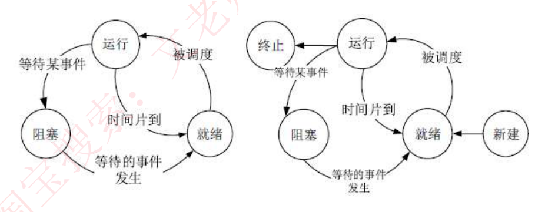

### 【考试真题】

在单处理机系统中，采用先来先服务调度算法。系统中有 4 个进程 P1、P2、P3、P4（假设进程按此顺序到达），其中 P1 为运行状态，P2 为就绪状态，P3 和 P4 为等待状态，且 P3 等待打印机，P4 等待扫描仪。若 P1（ ），则 P1、P2、P3 和 P4 的状态应分别为（ ）。
A. 时间片到　B. 释放了扫描仪　C. 释放了打印机　D. 已完成
A. 等待、就绪、等待和等待　B. 运行、就绪、运行和等待
C. 就绪、运行、等待和等待　D. 就绪、就绪、等待和运行
**答案：A　C**
解析：P1 处于运行状态，那么对应于它的操作就是时间片到，P1 进入就绪状态。而此时，P3 和 P4 都处于等待状态，都在等待除了 CPU 之外的其他事物，它们等待的事物并没有到，所以还是处于等待状态，或阻塞状态。P2 此时是就绪状态，获得了 P1 释放的 CPU，进入运行状态。

---

## 3. 前趋图

◆ 用来表示哪些任务可以并行执行，哪些任务之间有顺序关系，具体如下图：可知，A B C 可以并行执行，但是必须 A B C 都执行完后，才能执行 D，这就确定了两点：**任务间的并行、任务间的先后顺序**。

> [图] 线性 A→B→C→D→E 变换为：A、B、C 三者并行 → D → E

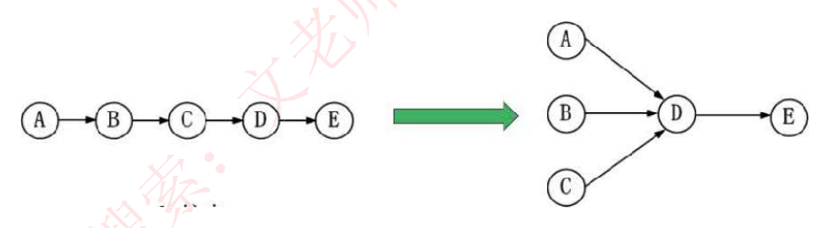

---

## 3'（同编号）进程资源图

◆ 用来表示**进程和资源之间的分配和请求关系**，如下图所示：

> [图] R1、R2 资源框（框中圆球表示资源实例）与 P1、P2、P3 进程圆之间的分配/请求箭头

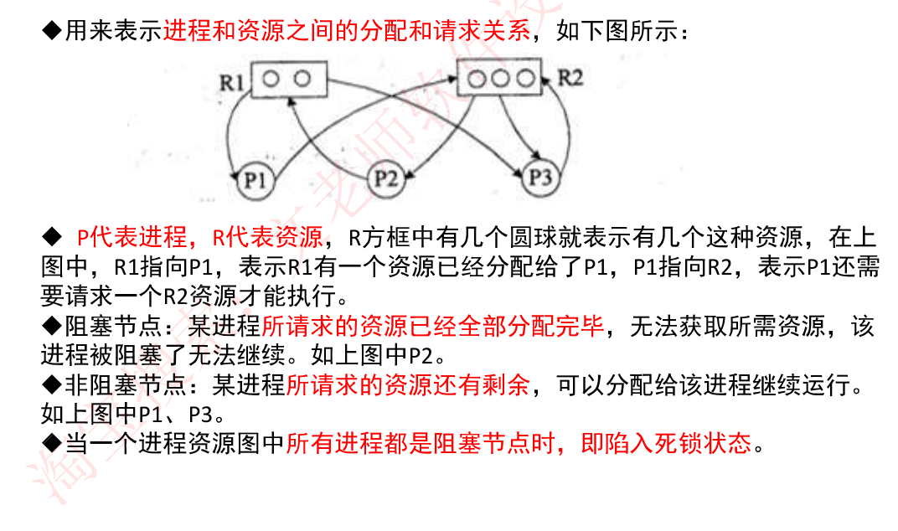

◆ **P 代表进程，R 代表资源**，R 方框中有几个圆球就表示有几个这种资源，在上图中，R1 指向 P1，表示 R1 有一个资源已经分配给了 P1，P1 指向 R2，表示 P1 还需要请求一个 R2 资源才能执行。

◆ **阻塞节点**：某进程**所请求的资源已经全部分配完毕**，无法获取所需资源，该进程被阻塞了无法继续。如上图中 P2。

◆ **非阻塞节点**：某进程**所请求的资源还有剩余**，可以分配给该进程继续运行。如上图中 P1、P3。

◆ **当一个进程资源图中所有进程都是阻塞节点时，即陷入死锁状态。**

### 【考试真题】

在如下所示的进程资源图中，（ ）；该进程资源图是（ ）。
A. P1、P2、P3 都是阻塞节点
B. P1 是阻塞节点、P2、P3 是非阻塞节点
C. P1、P2 是阻塞节点、P3 是非阻塞节点
D. P1、P2 是非阻塞节点、P3 是阻塞节点

A. 可以化简的，其化简顺序为 P1→P2→P3
B. 可以化简的，其化简顺序为 P3→P1→P2
C. 可以化简的，其化简顺序为 P2→P1→P3
D. 不可以化简的，因为 P1、P2、P3 申请的资源都不能得到满足
**答案：C　B**

**进程资源图化简的方法是**：先看系统还剩下多少资源没分配，再看有哪些进程是不阻塞的，接着**把不阻塞的进程的所有边都去掉，形成一个孤立的点，再把系统分配给这个进程的资源回收回来**，这样，系统剩余的空闲资源便多了起来，接着又去看看有哪些进程是不阻塞的，然后又把它们逐个变成孤立的点。**最后，所有的资源和进程都变成孤立的点。** 图中 P3 是不阻塞的，故 P3 为化简图的开始，把 P3 孤立，再回收分配给他的资源，可以看到 P1 也变为不阻塞节点了，故 P3、P1、P2 是可以的。

---

## 4. 进程同步与互斥

### 4-1 基本概念

◆ **临界资源**：各进程间需要以互斥方式对其进行访问的资源。
◆ **临界区**：指进程中**对临界资源实施操作的那段程序**。本质是一段程序代码。

◆ **互斥**：某资源（即临界资源）在**同一时间内只能由一个任务单独使用**，使用时需要加锁，使用完后解锁才能被其他任务使用；如打印机。
◆ **同步**：**多个任务可以并发执行，只不过有速度上的差异**，在一定情况下停下等待，不存在资源是否单独或共享的问题；如自行车和汽车。

◆ **互斥信号量**：对临界资源采用互斥访问，使用互斥信号量后其他进程无法访问，**初值为 1**。
◆ **同步信号量**：对共享资源的访问控制，**初值一般是共享资源的数量**。

### 4-2 PV 操作

◆ **P 操作：申请资源，S=S-1**，若 S>=0，则执行 P 操作的进程继续执行；若 S<0，则置该进程为阻塞状态（因为无可用资源），并将其插入阻塞队列。

◆ **V 操作：释放资源，S=S+1**，若 S>0，则执行 V 操作的进程继续执行；若 S<=0，则从阻塞状态唤醒一个进程，并将其插入就绪队列（此时因为缺少资源被 P 操作阻塞的进程们可以继续执行），然后执行 V 操作的进程继续。

> [图] P 操作流程（S=S-1 → 判断 S<0 → T 入进程队列 / F 继续）与 V 操作流程（S=S+1 → 判断 S<=0 → T 唤醒 / F 继续）

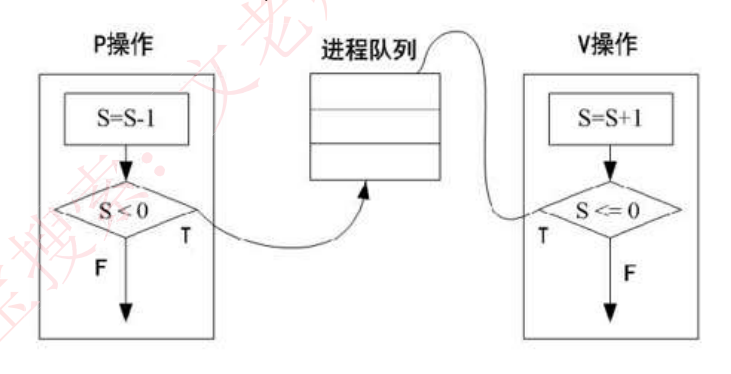

### 4-3 经典问题：生产者和消费者的问题

三个信号量：**互斥信号量 S0（仓库独立使用权），同步信号量 S1（仓库空闲个数），同步信号量 S2（仓库商品个数）**。

| 生产者流程 | 消费者流程 |
|---|---|
| 生产一个商品 S | P(S0) |
| P(S0) | P(S2) |
| P(S1) | 取出一个商品 |
| 将商品放入仓库中 | V(S1) |
| V(S2) | V(S0) |
| V(S0) | |

### 【考试真题】

**1.** 进程 P1、P2、P3、P4 和 P5 的前趋图如下图所示：

> [图] P1 → P2、P3；P2 → P4；P3 → P5（对应 5 条连线 S1~S5）

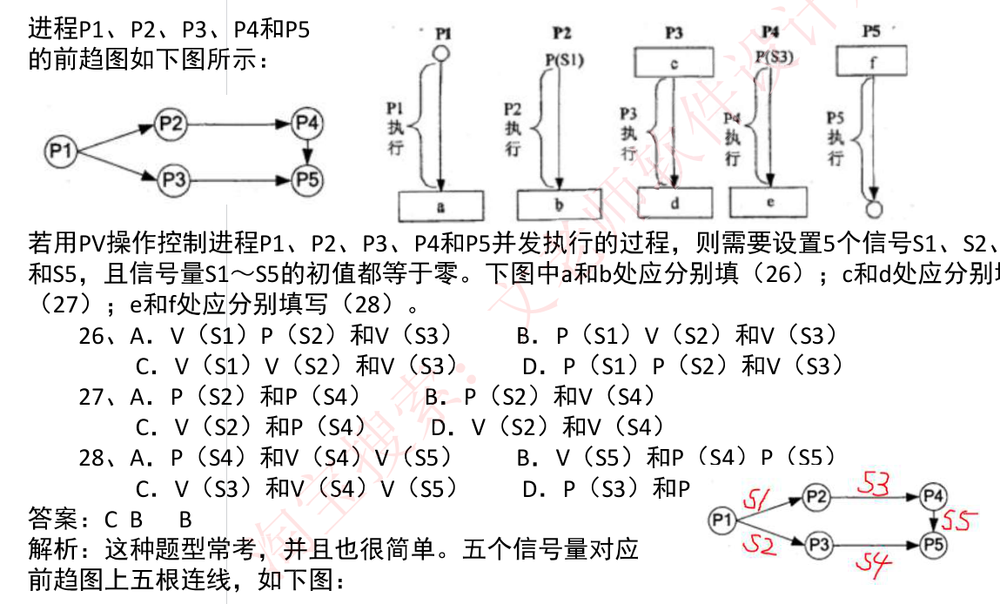

若用 PV 操作控制进程 P1、P2、P3、P4 和 P5 并发执行的过程，则需要设置 5 个信号量 S1、S2、S3、S4 和 S5，且信号量 S1~S5 的初值都等于零。下图中 a 和 b 处应分别填（26）；c 和 d 处应分别填写（27）；e 和 f 处应分别填写（28）。
26、A. P(S1) P(S2) 和 V(S3)　B. P(S1) V(S2) 和 V(S3)
　　C. V(S1) V(S2) 和 V(S3)　D. P(S1) P(S2) 和 V(S3)
27、A. P(S2) 和 P(S4)　B. V(S2) 和 V(S4)
　　C. V(S2) 和 P(S4)　D. V(S2) 和 V(S4)
28、A. P(S4) 和 V(S4) V(S5)　B. V(S5) 和 P(S4) P(S5)
　　C. V(S3) 和 P(S4) P(S5)　D. P(S5) 和 V(S4)
**答案：C　B　B**
解析：这种题型常考，并且也很简单。五个信号量对应前趋图上五根连线。

> ⚠️ **备考注记（2026-09-06 回原始扫描件 `images/fig_d03_s014.png` 逐字校对后补，非原文）**：本题转录有三处 OCR 错漏，**答案 C／B／B 无误，但按上面抄错的选项对不上**。① 前趋图漏抄一条边：扫描件上是 **P1→P2、P1→P3、P2→P4、P3→P5、P4→P5 共五条边**（原件手写标注 S1:P1→P2、S2:P1→P3、S3:P2→P4、S4:P3→P5、S5:P4→P5），这里只抄了四条，与"5 个信号量"自相矛盾。② 26 题 A 抄成了和 D 一样的文字，原件 **A 是 `V(S1) P(S2) 和 V(S3)`**。③ 27 题 B 抄成了和 D 一样的文字，原件 **B 是 `P(S2) 和 V(S4)`**。另 28 题原件 **C 是 `V(S3) 和 V(S4) V(S5)`**（这里抄成 `V(S3) 和 P(S4) P(S5)`），**D 项被页边裁切，只能辨出开头 `P(S3) 和 P……`**，后半无法还原。按订正后的选项验算：a=P1 的 2 条出边→`V(S1) V(S2)`、b=P2 的出边 S3→`V(S3)` 得 **C**；c=P3 的入边 S2→`P(S2)`、d=P3 的出边 S4→`V(S4)` 得 **B**；e=P4 的出边 S5→`V(S5)`、f=P5 的两条入边 S4/S5→`P(S4) P(S5)` 得 **B**——与所给答案完全吻合，五条边对 5 个 P、5 个 V 配平。

**2.** 进程 P1、P2、P3、P4、P5 和 P6 的前趋图如下所示，若用 PV 操作控制这 6 个进程的同步与互斥的程序如下，那么程序中的空①和空②处应分别为（ ）；空③和空④处应分别为（ ）；空⑤和空⑥处应分别为（ ）。

> [图] 前趋图 P1 → P2、P3；P2 → P4；P3 → P5；P4、P5 → P6
> 程序：begin S1,S2,S3,S4,S5,S6,S7,S8:semaphore; //定义信号量
> S1:=0; S2:=0; S3:=0; S4:=0; S5:=0; S6:=0; S7:=0; S8:=0;
> Cobegin Process P1 … P6，各含 ①～⑥ 空位 … Coend end.

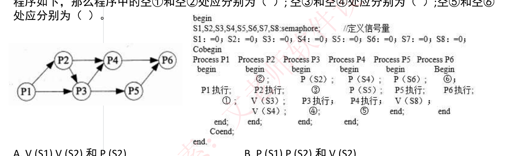

A. V (S1) V (S2) 和 P (S2)　B. P (S1) P (S2) 和 V (S2)
C. V (S1) V (S2) 和 P (S1)　D. P (S1) P (S2) 和 V (S1)
A. V (S3) 和 V (S5) V (S6)　B. P (S3) 和 P (S5) V (S6)
C. V (S3) 和 P (S5) P (S6)　D. P (S3) 和 P (S5) P (S6)
A. P (S6) 和 P (S7) V (S8)　B. V (S6) 和 V (S7) V (S8)
C. P (S6) 和 P (S7) P (S8)　D. V (S7) 和 P (S7) P (S8)
**答案：C　B　D**

---

## 5. 进程调度

### 5-1 三级调度

◆ **进程调度方式**是指**当有更高优先级的进程到来时如何分配 CPU**。分为**可剥夺和不可剥夺两种**，可剥夺指当有更高优先级进程到来时，强行将正在运行进程的 CPU 分配给高优先级进程；不可剥夺是指高优先级进程必须等待当前进程自动释放 CPU。

◆ **在某些操作系统中，一个作业从提交到完成需要经历高、中、低三级调度。**
1. **高级调度**。高级调度又称"长调度""作业调度"或"接纳调度"，它决定**处于输入池中的哪个后备作业可以调入主系统做好运行的准备**，成为一个或一组就绪进程。在系统中一个作业只需经过一次高级调度。
2. **中级调度**。中级调度又称"中程调度"或"对换调度"，它决定**处于交换区中的哪个就绪进程可以调入内存**，以便直接参与对 CPU 的竞争。
3. **低级调度**。低级调度又称"短程调度"或"进程调度"，它决定**处于内存中的哪个就绪进程可以占用 CPU**。低级调度是操作系统中最活跃、最重要的调度程序，对系统的影响很大。

### 5-2 调度算法

- **先来先服务 FCFS**：先到达的进程优先分配 CPU。用于宏观调度。
- **时间片轮转**：分配给每个进程 CPU 时间片，轮流使用 CPU，每个进程时间片大小相同，很公平，用于微观调度。
- **优先级调度**：每个进程都拥有一个优先级，优先级大的先分配 CPU。
- **多级反馈调度**：时间片轮转和优先级调度结合而成，设置多个就绪队列 1,2,3…n，每个队列分别赋予不同的优先级，分配不同的时间片长度；新进程先进入队列 1 的末尾，按 FCFS 原则，执行队列 1 的时间片；若未能执行完进程，则转入队列 2 的末尾，如此重复。

> [图] 多级反馈队列示意：最高优先级队列 / 次高优先级队列 / … / 低优先级队列 → CPU → 运行结束撤销进程；降低优先级回流

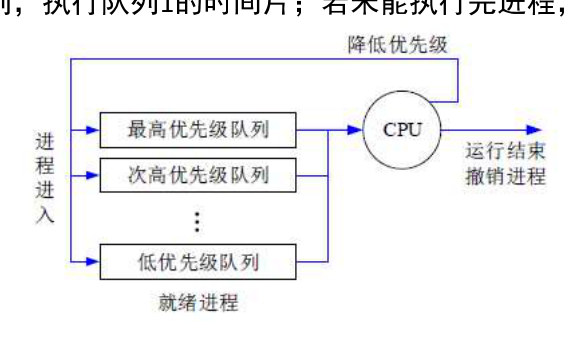

### 【考试真题】

**1.** 某系统中有 3 个并发进程竞争资源 R，每个进程都需要 5 个 R，那么至少有 ( ) 个 R，才能保证系统不会发生死锁。
A.12　B.13　C.14　D.15
**答案：B**
解析：每个进程需要 5 个 R 才能执行，则当每个进程都只有 4 个 R 时是死锁最坏的情况，即 3\*4=12 个资源是死锁发生的最大资源数，再加 1 就能保证不发生死锁，因此是 13。

**2.** 假设系统中有 n 个进程共享 3 台打印机，任一进程在任一时刻最多只能使用 1 台打印机。若用 PV 操作控制 n 个进程使用打印机，则相应信号量 S 的取值范围为（ ）；若信号量 S 的值为 -3，则系统中有（ ）个进程等待使用打印机。
A. 0, -1, …, - (n-1)　B.3, 2, 1, 0, -1, …, - (n-3)
C.1, 0, -1, …, - (n-1)　D.2, 1, 0, -1, …, - (n-2)
A. 0　B.1　C.2　D.3
**答案：B　D**

---

## 6. 死锁

◆ 当一个进程在等待永远不可能发生的事件时，就会产生死锁，若系统中有多个进程处于死锁状态，就会造成系统死锁。

◆ **死锁产生的四个必要条件：资源互斥、每个进程占有资源并等待其他资源、系统不能剥夺进程资源、进程资源图是一个环路。**

死锁产生后，**解决措施是打破四大条件**，有下列方法：
- **死锁预防**：采用某种策略限制并发进程对于资源的请求，破坏死锁产生的四个条件之一，使系统任何时刻都不满足死锁的条件。
- **死锁避免**：一般采用银行家算法来避免，银行家算法，就是提前计算出一条不会死锁的资源分配方法，才分配资源，否则不分配资源，相当于借贷，考虑对方还得起才借钱，提前考虑好以后，就可以避免死锁。
- **死锁检测**：允许死锁产生，但系统定时运行一个检测死锁的程序，若检测到系统中发生死锁，则设法加以解除。
- **死锁解除**：即死锁发生后的解除方法，如强制剥夺资源，撤销进程等。

◆ **死锁资源计算**：系统内有 n 个进程，每个进程都需要 R 个资源，那么其**发生死锁的最大资源数为 n\*(R-1)。其不发生死锁的最小资源数为 n\*(R-1)+1。**

### 【考试真题】银行家算法

假设系统中有三类互斥资源 R1、R2 和 R3，可用资源数分别为 10、5 和 3。在 T0 时刻系统中有 P1、P2、P3、P4 和 P5 五个进程，这些进程对资源的最大需求和已分配资源数如下表所示，此时系统剩余的可用资源数分别为 (27)。如果进程按 (28) 序列执行，那么系统状态是安全的。

| 资源\进程 | 最大需求量 R1 | R2 | R3 | 已分配资源数 R1 | R2 | R3 |
|---|---|---|---|---|---|---|
| P1 | 5 | 5 | 3 | 1 | 1 | 1 |
| P2 | 3 | 2 | 0 | 2 | 1 | 0 |
| P3 | 6 | 1 | 1 | 3 | 1 | 0 |
| P4 | 3 | 3 | 2 | 1 | 1 | 1 |
| P5 | 2 | 1 | 1 | 1 | 1 | 0 |

(27) A. 1、1 和 0　B. 1、1 和 1　C. 2、1 和 0　D. 2、0 和 1
(28) A. P1→P2→P4→P5→P3　B. P5→P2→P4→P1→P3
　　 C. P4→P2→P1→P5→P3　D. P5→P1→P4→P2→P3
**答案：D　B**

> ⚠️ **备考注记（2026-09-06 穷举复算后补，非原文）**：(27) 答案 D 无误——已分配合计 (8,5,2)，剩余 (2,0,1)。但 (28) 的四个选项按上表数据**没有一个是安全序列**。穷举 120 种排列，安全序列只有 4 条，全部以 P5 开头、P1 结尾：P5→P2→P3→P4→P1、P5→P2→P4→P3→P1、P5→P3→P2→P4→P1、P5→P3→P4→P2→P1。把选项 B 的后两个进程对调，即 **P5→P2→P4→P3→P1**，正是其中一条，与所给答案 B 吻合。据此判断转录时把 B 的末两位抄反了。原因是 P1 的 Need 为 (4,4,2)，R2 只有 5 个且被五个进程各占 1 个，必须等到 P2、P3、P4、P5 中至少四个释放后 P1 才能跑，所以 P1 只能排在最后。

---

## 7. 线程

◆ 传统的进程有两个属性：**可拥有资源的独立单位；可独立调度和分配的基本单位。**

◆ 引入线程的原因是进程在创建、撤销和切换中，系统必须为之付出较大的时空开销，故在系统中设置的**进程数目不宜过多**，进程切换的频率不宜太高，这就限制了并发程度的提高。引入线程后，将传统进程的两个基本属性分开，**线程作为调度和分配的基本单位，进程作为独立分配资源的单位**。用户可以通过创建线程来完成任务，以减少程序并发执行时付出的时空开销。

◆ 线程是进程中的一个实体，是被系统独立分配和调度的基本单位。**线程基本上不拥有资源，只拥有一点运行中必不可少的资源（如程序计数器、一组寄存器和栈）**，它可与同属一个进程的其他线程共享进程所拥有的全部资源，例如进程的公共数据、全局变量、代码、文件等资源，但**不能共享线程独有的资源**，如线程的栈指针等标识数据。

---

## 存储管理 · 1. 分区存储管理

◆ 所谓分区存储组织，就是**整存，将某进程运行所需的内存整体一起分配给它**，然后再执行。有三种分区方式：

- **固定分区**：静态分区方法，将主存分为若干个固定的分区，将要运行的作业装配进去，由于分区固定，大小和作业需要的大小不同，会产生**内部碎片**。
- **可变分区**：动态分区方法，主存空间的分区是在作业转入时划分，正好划分为作业需要的大小，这样就不存在内部碎片，但容易将整片主存空间切割成许多小块，会产生**外部碎片**。
- **可重定位分区**：可以解决碎片问题，移动所有已经分配好的区域，使其成为一个连续的区域，这样其他外部细小的分区碎片可以合并为大的分区，满足作业要求。只在外部作业请求空间得不到满足时进行。

◆ **系统分配内存的算法有很多**，根据分配前的内存情况，还需要分配 9K 空间，对不同算法的结果介绍如下：

- **首次适应法**：按内存地址顺序从头查找，找到第一个 >=9K 空间的空闲块，即切割 9K 空间分配给进程。
- **最佳适应法**：将内存中所有空闲内存块按从小到大排序，找到第一个 >=9K 空间的空闲块，切割分配，这个将会找到与 9K 空间大小最相近的空闲块。
- **最差适应法**：和最佳适应法相反，将内存中空闲块空间最大的，切割 9K 空间分配给进程，这是为了预防系统中产生过多的细小空闲块。
- **循环首次适应法**：按内存地址顺序查找，找到第一个 >=9K 空间的空闲块，而后若还需分配，则接着往下一个，不用每次都从头查找，这是与首次适应法不同的地方。

> [图] 分配前 / 首次适应法 / 最佳适应法 / 最差适应法 / 循环首次适应法 五列内存布局对比图

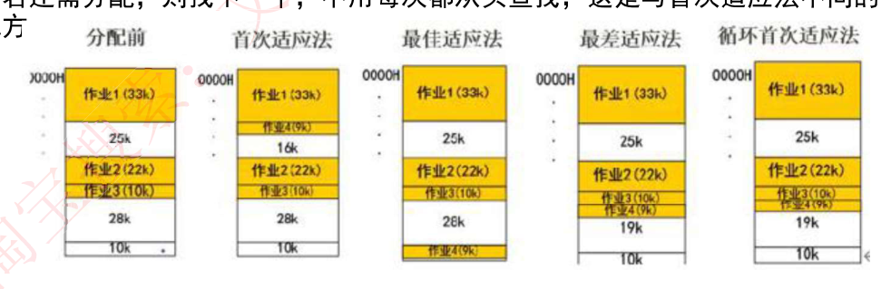

---

## 存储管理 · 2. 分页存储管理

◆ **逻辑页分为页号和页内地址**，页内地址就是物理偏移地址，而页号与物理块号并非按序对应的，需要查询页表，才能得知页号对应的物理块号，再用物理块号加上偏移地址才得出了真正运行时的物理地址。

**优点**：利用率高，碎片小，分配及管理简单。
**缺点**：增加了系统开销，可能产生抖动现象。

> [图] 逻辑地址（页号 + 页内地址）→ 页表寄存器（B 页表始址 / L 页表长度）→ 越界判断（若 L ≤ 页号，则地址越界）→ 页表（页号→物理块号：0→6, 1→9, 2→11, 3→15, 4→7, 5→18）→ 物理地址（15 | 256）

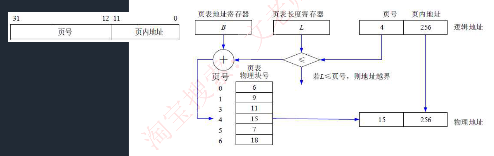

### 2-1 页面置换算法

- **最优算法**：OPT，理论上的算法，无法实现，是在进程执行完后进行的最佳效率计算，用来让其他算法比较差距。原理是选择未来最长时间内不被访问的页面置换，这样可以保证未来执行的都是马上要访问的。
- **先进先出算法**：FIFO，先调入内存的页先被置换淘汰，会产生**抖动现象**，即分配的页数越多，缺页率可能越多（即效率越低）。
- **最近最少使用**：LRU，在最近的过去，进程执行过程中，过去最少使用的页面被置换淘汰，根据局部性原理，这种方式效率高，且不会产生抖动现象，使用大量计数器，但是没有 LFU 多。

> ⚠️ **备考注记（2026-09-06 复核后补，非原文）**：上面两条把两个不同概念混在了一起。
> ① FIFO"分配的页数越多、缺页率反而越多"这个现象，标准名称是 **Belady 异常**，不叫抖动。答题时写 Belady 异常。经复算：访问串 1,2,3,4,1,2,5,1,2,3,4,5 在 FIFO 下，3 个页框缺页 9 次，4 个页框反而 10 次，正是此例。
> ② **抖动**（thrashing）指的是另一回事：驻留集太小，刚换出的页立刻又要用，系统忙于换页几乎不干正事。它是分配页框太少的后果，**任何置换算法都可能发生**，说"LRU 不会产生抖动"不成立。LRU 真正的性质是**不会出现 Belady 异常**（OPT 也不会，FIFO 才会）。
- **淘汰原则**：优先淘汰最近未访问的，而后淘汰最近未被修改的页面。

### 2-2 快表

◆ 是一块**小容量的相联存储器**，由快速存储器组成，**按内容访问，速度快**，并且可以从硬件上保证按内容并行查找，一般用来**存放当前访问最频繁的少数活动页面的页号**。

◆ 快表是将页表**存于 Cache 中**；慢表是将页表存于内存上。慢表需要访问两次内存才能取出页，而快表是访问一次 Cache 和一次内存，因此更快。

### 【考试真题】

**1.** 某计算机系统页面大小为 4K，若进程的页面变换表如下所示，逻辑地址为十六进制 1D16H。该地址经过变换后，其物理地址应为十六进制 ( )。

| 页号 | 物理块号 |
|---|---|
| 0 | 1 |
| 1 | 3 |
| 2 | 4 |
| 3 | 6 |

A.1024H　B.3D16H　C.4D16H　D.6D16H
**答案：B**
解析：页面大小为 4K，则页内偏移地址为 12 位，才能表示 4K 大小空间；由此，可知逻辑地址 1D16H 的低 12 位 D16H 为偏移地址，高 4 位 1 为逻辑页号，在页表中对应物理块号 3，因此物理地址为 3D16H。

**2.** 某进程有 4 个页面，页号为 0~3，页面变换表及状态位、访问位和修改位的含义如下图所示，若系统给该进程分配了 3 个存储块，当访问的页面 1 不在内存时，淘汰表中页号为 ( ) 的页面代价最小。

| 页号 | 页帧号 | 状态位 | 访问位 | 修改位 |
|---|---|---|---|---|
| 0 | 6 | 1 | 1 | 1 |
| 1 | — | 0 | 0 | 0 |
| 2 | 3 | 1 | 1 | 0 |
| 3 | 2 | 1 | 1 | 0 |

> 状态位含义：=0 不在内存，=1 在内存；访问位含义：=0 未访问过，=1 访问过；修改位含义：=0 未修改过，=1 修改过

A.0　B.1　C.2　D.3
**答案：D**
解析：根据局部性原理，应该优先淘汰最近未被访问过的，而后淘汰最近未被修改过的，由页表可知，023 最近都被访问过，而只有 3 最近未被修改过，应该淘汰 3。
然而其实这种题目，就算不知道上述原理，也能做出，答案只有一个，肯定是与其他不同的，具有唯一性的一个，在 023 中，02 的访问位和修改位一样，只有 3 不同，答案就是 3.

---

## 存储管理 · 3. 分段存储管理

◆ 将进程空间分为一个个段，**每段也有段号和段内地址**，与页式存储不同的是，**每段物理大小不同，分段是根据逻辑整体分段的**，因此，段表也与页表的内容不同，页表中直接是逻辑页号对应物理块号，而下图所示，**段表有段长和基址两个属性**，才能确定一个逻辑段在物理段中的位置。

◆ **优点**：多道程序共享内存，各段程序修改互不影响。
◆ **缺点**：内存利用率低，内存碎片浪费大。

> [图] 逻辑地址（31…16 段号 s | 15…0 段内地址 d）→ 段表寄存器（段表起始地址 / 段表长度 L）→ 地址越界判断 → 段表（段号 S 段长 L 基址）→ 物理地址（S' | d）

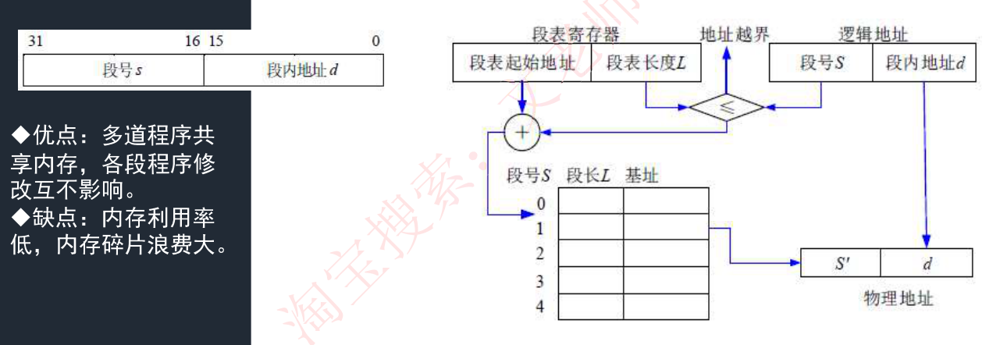

### 【考试真题】

设某进程的段表如下所示，逻辑地址（ ）可以转换为对应的物理地址。

| 段号 | 基地址 | 段长 |
|---|---|---|
| 0 | 1598 | 600 |
| 1 | 486 | 50 |
| 2 | 90 | 100 |
| 3 | 1327 | 2988 |
| 4 | 1952 | 960 |

A.（0，1597）、（1，30）和（3，1390）
B.（0，128）、（1，30）和（3，1390）
C.（0，1597）、（2，98）和（3，1390）
D.（0，128）、（2，98）和（4，1066）
**答案：B**
解析：试题（46）的正确选项为 B。因为 0 段的段长只有 600，而逻辑地址（0，1597）中的 1597 已经越界，不能转换成逻辑地址，而选项 A 和选项 C 中都包含逻辑地址（0，597）所以是错误的。又因为 4 段的段长有 960，而逻辑地址（4，1066）中的 1066 已经越界，也不能转换成逻辑地址，而选项 D 中包含逻辑地址（4，1066）所以是错误的。

---

## 存储管理 · 4. 段页式存储管理

◆ 对进程空间**先分段，后分页**，具体原理图和优缺点如下：

**优点**：空间浪费小、存储共享容易、存储保护容易、能动态链接。
**缺点**：由于管理软件的增加，复杂性和开销也随之增加，需要的硬件以及占用的内容也有所增加，使得执行速度大大下降。

> [图] 逻辑地址（段号 s | 段内页号 p | 页内地址 w）→ 段表寄存器（段表起始地址 / 段表长度 TL）→ 越界判断 → 段表 → 页表 → 物理地址（b | W）

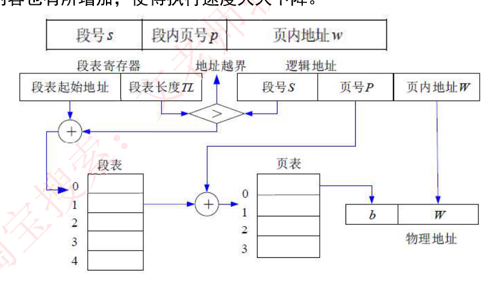

---

## 设备管理 · 1. 设备管理概述

◆ 设备是**计算机系统与外界交互的工具**，具体负责**计算机与外部的输入/输出工作，所以常称为外部设备（简称外设）**。在计算机系统中，将负责管理设备和输入/输出的机构称为 I/O 系统。因此，I/O 系统由设备、控制器、通道（具有通道的计算机系统）、总线和 I/O 软件组成。

◆ **设备的分类**：
- 按数据组织分类：块设备、字符设备。
- 按照设备功能分类：输入设备、输出设备、存储设备、网络联网设备、供电设备。
- 资源分配角度分类：独占设备、共享设备和虚拟设备。
- 数据传输速率分类：低速设备、中速设备、高速设备。

◆ 设备管理的任务是保证在多道程序环境下，当**多个进程竞争使用设备**时，按一定的策略**分配和管理各种设备**，控制设备的各种操作，完成 I/O 设备与主存之间的数据交换。

◆ 设备管理的主要功能是**动态地掌握并记录设备的状态**、设备分配和释放、缓冲区管理、实现物理 I/O 设备的操作、提供设备使用的用户接口及设备的访问和控制。

---

## 设备管理 · 2. I/O 软件

◆ I/O 设备管理软件的所有层次及每一层功能如下图。

◆ **实例**：当用户程序试图读一个硬盘文件时，需要通过操作系统实现这一操作。**与设备无关软件检查高速缓存中有无要读的数据块，若没有，则调用设备驱动程序，向 I/O 硬件发出一个请求**。然后，用户进程阻塞并等待磁盘操作的完成。当**磁盘操作完成时，硬件产生一个中断，转入中断处理程序**。中断处理程序检查中断的原因，认识到**这时磁盘读取操作已经完成，于是唤醒用户进程取回从磁盘读取的信息，从而结束此次 I/O 请求**。用户进程在得到了所需的硬盘文件内容之后，后继续运行。

> [图] 层次 / I/O 应答 / I/O 功能：
> 用户进程 → 进行 I/O 调用、格式化 I/O、Spooling
> 设备无关软件 → 命名、保护、阻塞、缓冲、分配
> 设备驱动程序 → 置设备寄存器；检查状态
> 中断处理程序 → 当 I/O 结束时唤醒驱动程序
> 硬件 → 执行 I/O 操作

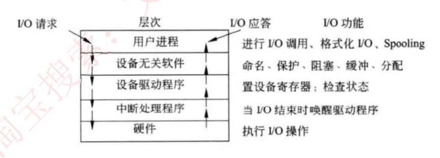

### 【考试真题】

以下关于 I/O 软件的叙述中，正确的是（ ）
A. I/O 软件开放了 I/O 操作实现的细节，方便用户使用 I/O 设备
B. I/O 软件隐藏了 I/O 操作实现的细节，向用户提供物理接口
C. I/O 软件隐藏了 I/O 操作实现的细节，方便用户使用 I/O 设备
D. I/O 软件开放了 I/O 操作实现的细节，用户可以使用逻辑地址访问 I/O 设备
**答案：C**
解析：I/O 软件隐藏了底层复杂的实现细节，只提供接口供用户方便的使用。

---

## 设备管理 · 3. 设备管理技术

◆ 一台独占设备，在同一时间只能由一个进程使用，其他进程只能等待，且不知道什么时候打印机空闲，此时，极大的浪费了外设的工作效率。

◆ 引入 **SPOOLING（外围设备联机操作）技术**，就是在外设上建立两个数据缓冲区，分别称为输入井和输出井，这样，无论多少进程，都可以共用这一台打印机，只需要将打印命令发出，数据就会排队存储在缓冲区中，打印机会自动按顺序打印，实现了物理外设的共享，使得**每个进程都感觉在使用一个打印机，这就是物理设备的虚拟化**。如下图所示：

> [图] 作业 1/作业 2/…→输入设备→预输入程序→输入井（作业信息）→作业调度程序→当前运行的作业→井管理程序→输出井（作业结果）→缓输出程序→输出设备→作业结果

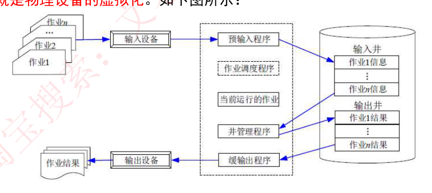

---

## 文件管理 · 1. 文件管理概述

◆ 文件是**具有符号名的、在逻辑上具有完整意义的**一组相关信息项的集合。

◆ 信息项是**构成文件内容的基本单位**，可以是一个字符，也可以是一个记录，记录可以等长，也可以不等长。一个文件包括**文件体和文件说明**。文件体是文件真实的内容。文件说明是操作系统为了管理文件所用到的信息，包括文件名、文件内部标识、文件的类型、文件存储地址、文件的长度、访问权限、建立时间和访问时间等。

◆ **文件管理系统**，就是**操作系统中实现文件统一管理的一组软件和相关数据的集合，专门负责管理和存取文件信息的软件机构**，简称文件系统。文件系统的功能包括按名存取；统一的用户接口；并发访问和控制；安全性控制；优化性能；差错恢复。

◆ **文件的类型**：
1. 按文件性质和用途可将文件分为系统文件、库文件和用户文件。
2. 按信息保存期限分类可将文件分为临时文件、档案文件和永久文件。
3. 按文件的保护方式分类可将文件分为只读文件、读/写文件、可执行文件和不保护文件。
4. UNIX 系统将文件分为普通文件、目录文件和设备文件（特殊文件）。

◆ 文件的**逻辑结构**可分为两大类：**有结构的记录式文件；无结构的流式文件**。

◆ 文件的**物理结构**是指**文件在物理存储设备上的存放方法**，包括：
1. **连续结构**。连续结构也称顺序结构，它**将逻辑上连续的文件信息（如记录）依次存放在连续编号的物理块上**。
2. **链接结构**。链接结构也称串联结构，它是**将逻辑上连续的文件信息（如记录）存放在不连续的物理块上**，每个物理块**设有一个指针指向下一个物理块**。
3. **索引结构**。将**逻辑上连续的文件信息（如记录）存放在不连续的物理块中**，系统为每个文件建立一张索引表，**索引表记录了文件信息所在的逻辑块号对应的物理块号**，并将索引表的起始地址放在与文件对应的文件目录项中。
4. 多个物理块的索引表。索引表是**在文件创建时由系统自动建立的**，并与文件一起存放在同一文件卷上。根据一个文件大小的不同，其索引表占用物理块的个数不等，一般占一个或几个物理块。

---

## 文件管理 · 2. 索引文件结构

◆ 如图所示，系统中有 13 个索引节点，0-9 为**直接索引，即每个索引节点存放的是内容**，假设每个物理盘大小为 4KB，共可存 4KB\*10=10KB 数据；

◆ **10 号索引节点为一级间接索引节点，大小为 4KB，存放的并非直接数据，而是链接到直接物理盘块的地址**，假设每个地址占 4B，则共有 1024 个地址，对应 1024 个物理盘，可存 1024\*4KB=4098KB 数据。

◆ **二级索引节点类似，直接盘存放一级地址，一级地址再存放物理盘块地址，而后链接到存放数据的物理盘块**，容量又扩大了一个数量级，为 1024\*1024\*4KB 数据。

> ⚠️ **备考注记（2026-09-06 复算后补，非原文）**：上面两处乘法**算错了**，但两处的乘式本身是对的，错在写出的结果。
> ① 直接索引：`4KB × 10 = 40KB`，资料写成 10KB。
> ② 一级间接：`1024 × 4KB = 4096KB`，资料写成 4098KB。
> ③ 另外"每个地址占 4B 则共有 1024 个地址"这句成立的前提是**索引块大小 4KB**（4096 ÷ 4 = 1024）。真题里索引块是 1KB、地址 4B，一个间接块只能装 **256** 个地址，**不能把 1024 这个数背下来直接套**——每道题都要用"块大小 ÷ 地址长度"现算。
> 下面那道真题（8 个地址项、5 直接 2 一级 1 二级、块 1KB）复算无误：m = 256，逻辑块 5 落在一级间接（直接只管 0–4）、518 落在二级间接（一级管到 516），最大长度 5 + 2×256 + 256² = **66053 KB**，与答案 D 一致。

> [图] 索引结点 0-12 →（直接索引 / 一级间接索引 / 二级间接索引 / 三次间接索引）→ 物理盘块

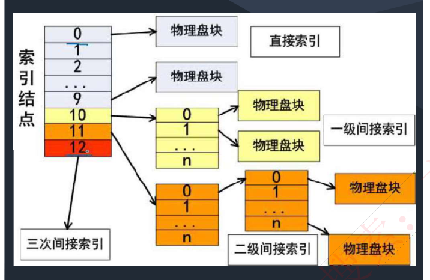

### 【考试真题】

设文件索引节点中有 8 个地址项，每个地址项大小为 4 字节，其中 5 个地址项为直接地址索引，2 个地址项是一级间接地址索引，1 个地址项是二级间接地址索引，磁盘索引块和磁盘数据块大小均为 1KB，若要访问文件的逻辑块号分别为 5 和 518，则系统应分别采用 \_27\_\_，而且可表示的单个文件最大长度是\_\_28\_\_\_KB。
(27) A. 直接地址索引和一级间接地址索引
　　 B. 直接地址索引和二级间接地址索引
　　 C. 一级间接地址索引和二级间接地址索引
　　 D. 一级间接地址索引和一级间接地址索引
(28) A. 517　B. 1029　C. 16513　D. 66053
**答案：C　D**
解析：依题意，有 5 个地址项为直接地址索引，所以直接地址索引涉及到的逻辑块号为：0-4。2 个地址项为一级间接索引，每个一级间接索引结点对应的逻辑块个数为：1KB/4B=256 个。所以一级间接索引涉及到的逻辑块号为：5-516。二级间接索引所对应的逻辑块号即为：517 以上。可表示的单个文件长度，首先计算直接地址索引，就是 5 个数据块，为 5KB，而后一级间接地址索引，可表示 256 个数据块，即 256KB，二级间接地址索引可存储 1KB/4B=256 个一级间接索引，每个一级间接地址索引又可存储 256KB，因此是 256\*256KB，全部加起来共 5+256\*2+256\*256=66053。

---

## 文件管理 · 3. 文件目录

◆ 文件控制块中包含以下三类信息：基本信息类、存取控制信息类和使用信息类。
1. **基本信息类**。例如文件名、文件的物理地址、文件长度和文件块数等。
2. **存取控制信息类**。文件的存取权限，像 UNIX 用户分成文件主、同组用户和一般用户三类，这三类用户的读/写执行 RWX 权限。
3. **使用信息类**。文件建立日期、最后一次修改日期、最后一次访问的日期、当前使用的信息（如打开文件的进程数、在文件上的等待队列）等。

◆ **文件控制块的有序集合称为文件目录。**

◆ **相对路径**：是**从当前路径开始**的路径。
◆ **绝对路径**：是**从根目录开始**的路径。
◆ **全文件名 = 绝对路径 + 文件名**。要注意，绝对路径和相对路径是不加最后的文件名的，只是单纯的路径序列。

> [图] 目录树：D:\ → Program（C-prog / Java-prog）、Document（Wang → txt → my1.doc my2.doc）；com2.dll、f1.c、f1.c、f1.java f2.java

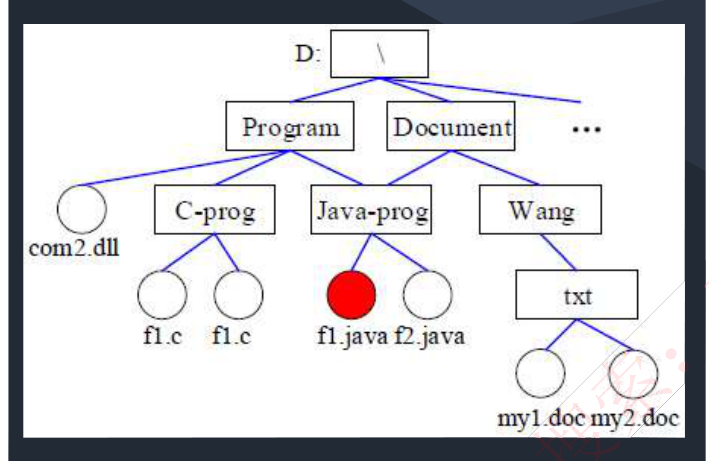

### 【考试真题】

若某文件系统的目录结构如下图所示，假设用户要访问文件 Fault.swf，且当前工作目录为 swshare，则该文件的全文件名为 ( )，相对路径和绝对路径分别为 ( ) 。

> [图] 目录树：\ → swshare（iebook / flash / Skey）、Swtools、iebk.dll；flash 下有 reader.exe、rw.dll、Setup.exe、Fault.swf、mlink.vbs

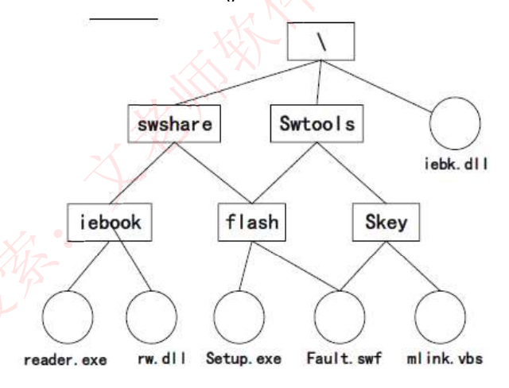

A.fault.swf
B.flash\fault.swf
C.swshare\flash\fault.swf
D.\swshare\flash\fault.swf

A.swshare\flash\和\flash\
B.flash 和\swshare\flash\
C.\swshare\flash\和 flash\
D.\flash\和\swshare\flash\
**答案：D　B**

---

## 文件管理 · 4. 文件存储空间管理

◆ 文件的存取方法是**指读/写文件存储器上的一个物理块的方法**。通常有**顺序存取和随机存取**两种方法。顺序存取方法是指对文件中的信息按顺序依次进行读/写；随机存取方法是指对文件中的信息可以按任意的次序随机地读/写。

◆ **文件存储空间的管理**：

**（1）空闲区表**。将外存空间上的一个连续的未分配区域称为"空闲区"。操作系统为磁盘外存上的所有空闲区建立一张空闲表，每个表项对应一个空闲区，适用于连续文件结构。

| 序号 | 第一个空闲块号 | 空闲块数 | 状态 |
|---|---|---|---|
| 1 | 18 | 5 | 可用 |
| 2 | 29 | 8 | 可用 |
| 3 | 105 | 19 | 可用 |
| 4 | — | — | 未用 |

**（2）位示图**。这种方法是在外存上建立一张位示图（Bitmap），记录文件存储器的使用情况。**每一位对应文件存储器上的一个物理块，取值 0 和 1 分别表示空闲和占用。**

> [图] 位示图表格：第 0 字节 1 0 1 0 0 1 … 0 1；第 1 字节 0 1 1 1 0 0 … 1 1；第 2 字节 0 1 1 1 1 0 … 1 0；第 3 字节 1 1 1 1 0 0 … 0 1；…；第 n-1 字节 0 1 0 1 0 1 … 1 1

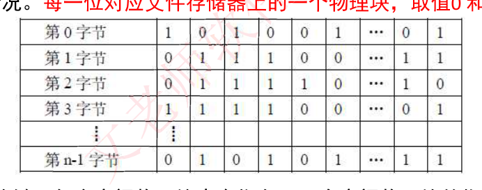

**（3）空闲块链**。每个空闲物理块中有指向下一个空闲物理块的指针，所有空闲物理块构成一个链表，链表的头指针放在文件存储器的特定位置上（如管理块中），不需要磁盘分配表，节省空间。

**（4）成组链接法**。例如，在实现时系统将空闲块分成若干组，每 100 个空闲块为一组，每组的第一个空闲块登记了下一组空闲块的物理盘块号和空闲块总数。假如某个组的第一个空闲块号等于 0，意味着该组是最后一组，无下一组空闲块。

### 【考试真题】

某文件管理系统采用位示图 (bitmap) 记录磁盘的使用情况。如果系统的字长为 32 位，磁盘物理块的大小为 4MB，物理块依次编号为：0、1、2、…，位示图字依次编号为：0、1、2、…，那么 16385 号物理块的使用情况在位示图中的第 (25) 个字中描述；如果磁盘的容量为 1000GB，那么位示图需要 (26) 个字来表示。
(25)A. -128　B. 256　C. 512　D. 1024
(26)A. 1200　B. 3200　C. 6400　D. 8000
**答案：C　D**
解析：在位示图中，一个物理块占 1 个字中的 1 位，第 16385 占到 16386 位（从 0 编号），16386/32=512 余数 2，可知，其在第 513 个字中描述，但因为从 0 开始编号，是第 512 个字；磁盘容量 1000GB，共 1000GB/4MB=250\*1024 个物理块，需要 250Kb 表示，即 250\*1024bit/32bit=8000 个字。
