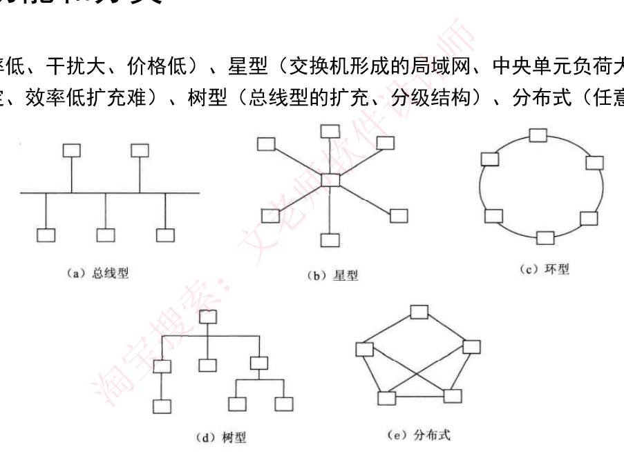
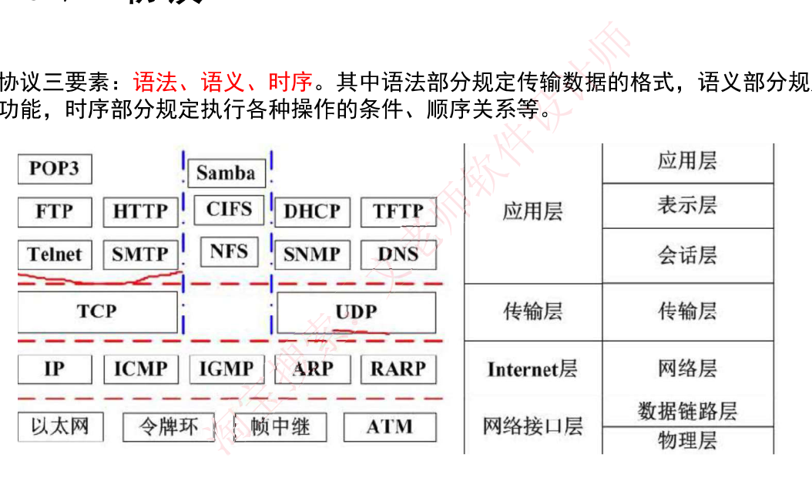
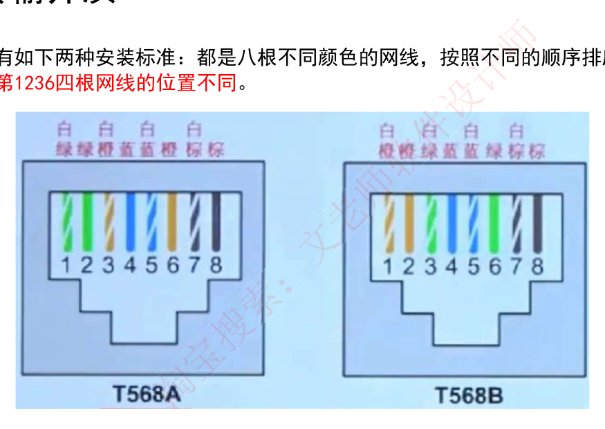
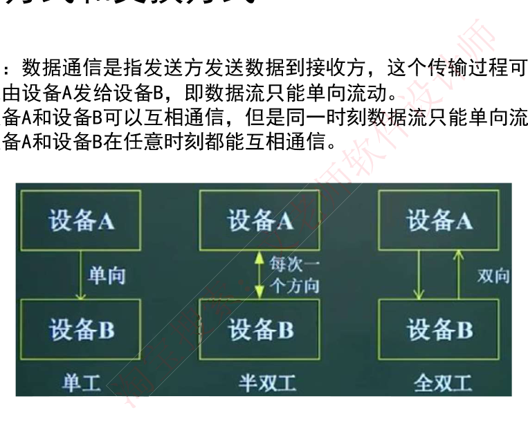

# 5. 计算机网络

> 来源：`外部资源/5.计算机网络.pdf`（18 页 / 36 张幻灯片，文老师软考教育）
> 逐页看图人工转录。`> [图]` 表示原件为图示。

---

## 封面 · 本章目录

网络功能和分类 / OSI 七层模型 / TCP/IP 协议 / 传输介质 / 通信方式和交换方式 / IP 地址 / IPv6 / 网络规划和设计 / 网络存储技术 / 其他考点补充

---

## 1. 网络功能和分类

计算机网络是计算机技术与通信技术相结合的产物，它实现了远程通信、远程信息处理和资源共享。

计算机网络的功能：**数据通信、资源共享、负载均衡、高可靠性**。

计算机网络按**分布范围和拓扑结构**划分如下：

| 网络分类 | 缩写 | 分布距离 | 计算机分布范围 | 传输速率范围 |
|---|---|---|---|---|
| 局域网 | LAN | 10m 左右 | 房间 | 4Mbps～1Gbps |
| | | 100m 左右 | 楼宇 | |
| | | 1000m 左右 | 校园 | |
| 城域网 | MAN | 10km | 城市 | 50Kbps～100Mbps |
| 广域网 | WAN | 100km 以上 | 国家或全球 | 9.6Kbps～45Mbps |

**拓扑结构**：
- **总线型**（利用率低、干扰大、价格低）
- **星型**（交换机形成的局域网、中央单元负荷大）
- **环型**（流动方向固定、效率低扩充难）
- **树型**（总线型的扩充、分级结构）
- **分布式**（任意节点连接、管理难成本高）

> [图] (a) 总线型 (b) 星型 (c) 环型 (d) 树型 (e) 分布式 五种拓扑示意



---

## 2. OSI 七层模型

| 层 | 功能 | 单位 | 协议 | 设备 |
|---|---|---|---|---|
| 1. 物理层 | **在链路上透明地传输位**。需要完成的工作包括线路配置、确定数据传输模式、确定信号形式、对信号进行编码、连接传输介质。为此定义了建立、维护和拆除物理链路所具备的机械特性、电气特性、功能特性以及规程特性。 | 比特 | EIA/TIA RS-232、RS-449、V.35、RJ-45、FDDI | 中继器、集线器 |
| 2. 数据链路层 | **把不可靠的信道变为可靠的信道**。为此将比特组成帧，在链路上提供点到点的帧传输，并进行差错控制、流量控制等。 | 帧 | SDLC、HDLC、LAPB、PPP、STP、帧中继等、IEEE802。 | 交换机、网桥 |
| 3. 网络层 | 在**源节点-目的节点之间进行路由选择、拥塞控制、顺序控制、传送包、保证报文的正确性**。网络层控制着通信子网的运行，因而它又称为通信子网层。 | IP 分组 | IP、ICMP、IGMP、ARP、RARP | 路由器 |
| 4. 传输层 | 提供**端-端间可靠的、透明的数据传输**，保证报文顺序的正确性、数据的完整性。 | 报文段 | TCP、UDP | 网关 |
| 5. 会话层 | 建立通信进程的逻辑名字与物理名字之间的联系，提供**进程之间建立、管理和终止会话的方法，处理同步与恢复**问题。 | | RPC、SQL、NFS | 网关 |
| 6. 表示层 | 实现**数据转换**（包括格式转换、压缩、加密等），提供标准的应用接口、公用的通信服务、公共数据表示方法。 | | JPEG、ASCII、GIF、MPEG、DES | 网关 |
| 7. 应用层 | 对用户不透明的**提供各种服务**，如 E-mail。 | 数据 | Telnet、FTP、HTTP、SMTP、POP3、DNS、DHCP 等 | 网关 |

---

## 3. 局域网和广域网协议

以太网规范 IEEE 802.3 是重要的局域网协议，包括：

| 标准 | 名称 | 速率 | 传输介质 |
|---|---|---|---|
| IEEE 802.3 | 标准以太网 | 10Mb/s | 传输介质为细同轴电缆 |
| IEEE 802.3u | 快速以太网 | 100Mb/s | 双绞线 |
| IEEE 802.3z | 千兆以太网 | 1000Mb/s | 光纤或双绞线 |
| IEEE 802.3ae | 万兆以太网 | 10Gb/s | 光纤 |

**无线局域网 WLAN 技术标准：IEEE 802.11**

**广域网协议**包括：PPP 点对点协议、ISDN 综合业务数字网、xDSL（DSL 数字用户线路的统称：HDSL、SDSL、MVL、ADSL）、DDN 数字专线、x.25、FR 帧中继、ATM 异步传输模式。

---

## 4. TCP/IP 协议

网络协议三要素：**语法、语义、时序**。其中语法部分规定传输数据的格式，语义部分规定所要完成的功能，时序部分规定执行各种操作的条件、顺序关系等。

> [图] TCP/IP 分层与 OSI 对应：
> 应用层（POP3、Samba、FTP、HTTP、CIFS、DHCP、TFTP、Telnet、SMTP、NFS、SNMP、DNS）对应 OSI 应用层/表示层/会话层
> 传输层（TCP、UDP）对应 OSI 传输层
> Internet 层（IP、ICMP、IGMP、ARP、RARP）对应 OSI 网络层
> 网络接口层（以太网、令牌环、帧中继、ATM）对应 OSI 数据链路层/物理层



### 4-1 网络层协议

◆ **IP**：网络层最重要的核心协议，在源地址和目的地址之间传送数据报，**无连接、不可靠**。
◆ **ICMP**：因特网控制报文协议，用于在 IP 主机、路由器之间传递控制消息。控制消息是指网络通不通、主机是否可达、路由是否可用等网络本身的消息。
◆ **ARP 和 RARP**：地址解析协议，**ARP 是将 IP 地址转换为物理地址，RARP 是将物理地址转换为 IP 地址**。
◆ **IGMP**：网络组管理协议，允许因特网中的计算机参加多播，是计算机用做向相邻多目路由器报告多目组成员的协议，支持组播。

### 4-2 传输层协议

◆ **TCP**：整个 TCP/IP 协议族中最重要的协议之一，在 IP 协议提供的不可靠数据基础上，采用了重发技术，为应用程序提供了一个**可靠的、面向连接的、全双工**的数据传输服务。一般用于传输数据量比较少，且对可靠性要求高的场合。
◆ **UDP**：是一种**不可靠、无连接**的协议，有助于提高传输速率，一般用于传输数据量大，对可靠性要求不高，但要求速度快的场合。

### 4-3 应用层协议

基于 TCP 的 FTP、HTTP 等都是可靠传输。基于 UDP 的 DHCP、DNS 等都是不可靠传输。

◆ **FTP**：可靠的文件传输协议，用于因特网上的控制文件的双向传输。
◆ **HTTP**：超文本传输协议，用于从 WWW 服务器传输超文本到本地浏览器的传输协议。使用 SSL 加密后的安全网页协议为 HTTPS。
◆ **SMTP 和 POP3**：简单邮件传输协议，是一组用于由源地址到目的地址传送邮件的规则，邮件报文采用 ASCII 格式表示。
◆ **Telnet**：远程连接协议，是因特网远程登录服务的标准协议和主要方式。
◆ **TFTP**：不可靠的、开销不大的小文件传输协议。
◆ **SNMP**：简单网络管理协议，由一组网络管理的标准协议，包含一个应用层协议、数据库模型和一组资源对象。该协议能够支持网络管理系统，用以监测连接到网络上的设备是否有任何引起管理师行关注的情况。
◆ **DHCP**：动态主机配置协议，基于 UDP，基于 C/S 模型，为主机动态分配 IP 地址，有三种方式：固定分配、动态分配、自动分配。
◆ **DNS**：域名解析协议，通过域名解析出 IP 地址。

### 4-4 协议端口号对照表

| 端口 | 服务 | 端口 | 服务 |
|---|---|---|---|
| 20 | 文件传输协议（数据） | 80 | 超文本传输协议（HTTP） |
| 21 | 文件传输协议（控制） | 110 | POP3 服务器（邮箱接收服务器） |
| 23 | Telnet 终端仿真协议 | 69 | 简单文件传输协议（TFTP） |
| 67 | DHCP（服务端） | 68 | DHCP（客户端） |
| 25 | SMTP 简单邮件发送协议 | 161 | SNMP（轮询） |
| 53 | 域名服务器（DNS） | 162 | SNMP（陷阱） |

### 【考试真题】

**1.** 在 OSI 参考模型中能实现路由选择、拥塞控制与互连功能的层是（ ）。
A. 传输层　B. 应用层　C. 网络层　D. 物理层
**答案：C**

**2.** 在 TCP/IP 体系结构中，将 IP 地址转化为 MAC 地址的协议是（ ）。
A. RARP　B. ARP　C. ICMP　D. TCP
**答案：B**
解析：网络层协议 ARP，地址转换协议，将网络层的 IP 地址转换为物理 MAC 地址。

**3.** 下列网络互连设备中，属于物理层的是（ ）。
A. 交换机　B. 中继器　C. 路由器　D. 网桥
**答案：B**

---

## 5. 传输介质

### 5-1 双绞线

◆ **双绞线**：将多根铜线按规则缠绕在一起，能够减少干扰；分为**无屏蔽双绞线 UTP 和屏蔽双绞线 STP**，都是由一对铜线簇组成。也即我们常说的**网线**；双绞线的**传输距离在 100m 以内**。

◆ **无屏蔽双绞线 UTP**：价格低，安装简单，但可靠性相对较低，分为 CAT3（3 类 UTP，速率为 10Mbps）、CAT4（4 类 UTP，与 3 类差不多，无应用）、CAT5（5 类 UTP，速率为 100Mbps，用于快速以太网）、CAT5E（超 5 类 UTP，速率为 1000Mbps）、CAT6（6 类 UTP，用来替代 CAT5E，速率也是 1000Mbps）。
◆ **屏蔽双绞线 STP**：比之 UTP 增加了一层屏蔽层，可以有效的提高可靠性，但对应的价格高，安装麻烦，一般用于对传输可靠性要求很高的场合。

◆ 网线有如下两种安装标准：都是八根不同颜色的网线，按照不同的顺序排序，插入水晶头中，**区分在第 1236 四根网线的位置不同**。

> [图] T568A 与 T568B 线序对照（白绿/绿/白橙/蓝/白蓝/橙/白棕/棕 vs 白橙/橙/白绿/蓝/白蓝/绿/白棕/棕）



### 5-2 光纤

◆ **光纤**：由纤芯和包层组成，传输的光信号在纤芯中传输，然而从 PC 端出来的信号都是电信号，要经过光纤传输的话，就必须将电信号转换为光信号。

◆ **多模光纤 MMF**：纤芯半径较大，因此**可以同时传输多种不同的信号**，光信号在光纤中以全反射的形式传输，采用**发光二极管 LED 为光源，成本低，但是传输的效率和可靠性都较低，适合于短距离传输**，其传输距离与传输速率相关，速率为 100Mbps 时为 2KM，速率为 1000Mbps 时为 550m。

◆ **单模光纤 SMF**：纤芯半径很小，**一般只能传输一种信号，采用激光二极管 LD 作为光源，并且只支持激光信号的传播**，同样是全反射形式传播，只不过反射角很大，看起来像一条直线，**成本高，但是传输距离远，可靠性高**。传输距离可达 5KM。

### 5-3 无线信道

◆ **无线信道**：分为无线电波和红外光波

| 无线电波 | | 红外光波 |
|---|---|---|
| 长波 | | 近红外线 |
| 中波 | | |
| 短波 | | 中红外线 |
| 超短波 | | |
| 微波 | 地面微波 / 卫星微波 | 远红外线 |

### 【考试真题】

以下关于光纤的说法中，错误的是（ ）
A. 单模光纤的纤芯直径更细
B. 单模光纤采用 LED 作为光源
C. 多模光纤比单模光纤的传输距离近
D. 多模光纤中光波在光导纤维中以多种模式传播
**【答案】B**

---

## 6. 通信方式和交换方式

### 6-1 通信方向

数据通信是指发送方发送数据到接收方，这个传输过程可以分类如下：
- **单工**：只能由设备 A 发给设备 B，即数据流只能单向流动。
- **半双工**：设备 A 和设备 B 可以互相通信，但是同一时刻数据流只能单向流动。
- **全双工**：设备 A 和设备 B 在任意时刻都能互相通信。

> [图] 单工（单向）/ 半双工（每次一个方向）/ 全双工（双向）三种示意



### 6-2 同步方式

◆ **异步传输**：发送方每发送一个字符，需要约定一个起始位和停止位插入到字符的起始和结尾处，这样当接收方接收到该字符时能够识别，但是这样会造成资源浪费，传输效率降低。
◆ **同步传输**：以数据块为单位进行传输，当发送方要发送数据时，**先发送一个同步帧**，接收方收到后做好接收准备，开始接收数据块，**结束后又会有结束帧确认**，这样一次传输一个数据块，效率高。

◆ **串行传输**：只有**一根数据线**，数据只能 1bit 挨个排队传送，适合低速设备、远距离的传送，一般用于广域网中。
◆ **并行传输**：有**多根数据线**，可以同时传输多个 bit 数据，适合高速设备的传送，常用语计算机内部各硬件模块之间。

### 6-3 交换方式

◆ **电路交换**：通信一方进行呼叫，另一方接收后，在二者之间会**建立一个专用电路**，特点为**面向连接、实时性高、链路利用率低**，一般用于语音视频通信。
◆ **报文交换**：**以报文为单位，存储转发模式**，接收到数据后先存储，进行差错校验，没有错误则转发，有错误则丢弃，因此**会有延迟，但可靠性高，是面向无连接的**。
◆ **分组交换**：**以分组为单位，也是存储转发模式**，因为分组的长度比较小，所以时延小于报文交换，又可分为三种方式：
- **数据报**：是现在主流的交换方式，**各个分组携带地址信息，自由的选择不同的路由路径传送到接收方**，接收方接收到分组后再根据地址信息重组装成原数据，是面向无连接的，但是不可靠的。
- **虚电路**：发送方发送一个分组，接收方收到后**二者之间就建立了一个虚拟的通信线路**，二者之间的分组数据交互都通过这条线路传送，在空闲的时候这条线路也可以传输其他数据，是面向连接的，可靠的。
- **信元交换**：**异步传输模式 ATM 采用的交换方式**，本质是按照虚电路方式进行转发，只不过**信元是固定长度的分组**，共 53B，其中 5B 为头部，48B 为数据域，也是面向连接的，可靠的。

### 【考试真题】

数据通信模型按照数据信息在传输链路上的传送方向，可以分为三类。下列选项中，（ ）不属于这三类传输方式。
A、单工通信：信号只能向一个方向传送
B、半双工通信：信息的传递可以是双向的
C、全双工通信：通信的双方可以同时发送和接收信息
D、全单工通信：信号同时向两个方向传输
**答案：D**
解析：根据数据信息在传输线上的传送方向，数据通信方式分为单工通信、半双工通信和全双工通信 3 种。

---

## 7. IP 地址

### 7-1 IP 地址表示

◆ 机器中存放的 **IP 地址是 32 位的二进制代码，每隔 8 位插入一个空格**，可提高可读性，为了便于理解和设置，一般会采用**点分十进制**方法来表示：将 32 位二进制代码**每 8 位二进制转换成十进制，就变成了 4 个十进制数**，而后在每个十进制数间隔中插入 . ，如下所示，最终为 128.11.3.31：

```
10000000  00001011  00000011  00011111
   128       11         3         31
```

◆ 因为每个十进制数都是由 8 个二进制数转换而来，因此**每个十进制数的取值范围为 0~255**（掌握二进制转十进制的快速计算方法，牢记 2 的幂指数值，实现快速转换）。

### 7-2 分类 IP 地址

IP 地址分四段，每段八位，共 32 位二进制数组成。在逻辑上，这 32 位 IP 地址分为**网络号和主机号**，依据网络号位数的不同，可以将 IP 地址分为以下几类：

| 类别 | 点分十进制 | | 二进制 |
|---|---|---|---|
| A 类 | 0.0.0.0 | 偏低 | 00000000 00000000 00000000 00000000 |
| | 127.255.255.255 | 最高 | 01111111 11111111 11111111 11111111 |
| B 类 | 128.0.0.0 | 最低 | 10000000 00000000 00000000 00000000 |
| | 191.255.255.255 | 最高 | 10111111 11111111 11111111 11111111 |
| C 类 | 192.0.0.0 | 最低 | 11000000 00000000 00000000 00000000 |
| | 223.255.255.255 | 最高 | 11011111 11111111 11111111 11111111 |
| D 类 组播 | 224.0.0.0 | 最低 | 11100000 00000000 00000000 00000000 |
| | 239.255.255.255 | 最高 | 11101111 11111111 11111111 11111111 |
| E 类 保留 | 240.0.0.0 | 最低 | 11110000 00000000 00000000 00000000 |
| | 255.255.255.255 | 最高 | 11111111 11111111 11111111 11111111 |

### 7-3 无分类编址与特殊 IP 地址

◆ **无分类编址**：即不按照 A B C 类规则，自动规定网络号，无分类编址格式为：IP 地址/网络号，示例：128.168.0.11/20 表示的 IP 地址为 128.168.0.11，其网络号占 20 位，因此主机号占 32-20=12 位，也可以划分子网。

◆ **特殊 IP 地址**
- **公有地址**：**通过它直接访问因特网。是全网唯一的 IP 地址。**
- **私有地址**：属于**非注册地址，专门为组织机构内部使用**，不能直接访问因特网，下表所示为私有地址范围：

| 类别 | IP 地址范围 | 网络号 | 网络数 |
|---|---|---|---|
| A | 10.0.0.0～10.255.255.255 | 10 | 1 |
| B | 172.16.0.0～172.31.255.255 | 172.16～172.31 | 16 |
| C | 192.168.0.0～192.168.255.255 | 192.168～192.168.255 | 256 |

其他特殊地址如下表所示：

| 网络号 | 主机号 | 源地址使用 | 目的地址使用 | 代表的意思 |
|---|---|---|---|---|
| 0 | 0 | 可以 | 不可 | 在本网络上的本主机 |
| 全 1 | 全 1 | 不可 | 可以 | 在本网络上进行广播 |
| Net-ID | 全 1 | 不可 | 可以 | 对 net-ID 上的所有主机进行广播 |
| 127 | 非全 0 或全 1 的数 | 可以 | 可以 | 用作本地软件环回测试之用 |
| 169.254 | 非全 0 或全 1 的数 | 可以 | 可以 | Windows 主机 DHCP 服务器故障分配 |

### 7-4 子网划分

◆ **子网划分**：一般公司在申请网络时，会直接获得一个范围很大的网络，如一个 B 类地址，因为**主机数之间相差的太大了，不利于分配**，我们一般采用**子网划分的方法来划分网络，即自定义网络号位数**，就能自定义主机号位数，就能**根据主机个数来划分出最适合的方案，不会造成资源的浪费**。

◆ 因此就有了子网的概念，一般的 IP 地址按标准划分为 A B C 三类，可以进行再一步的划分，将**主机号拿出几位作为子网号**，就可以划分出多个子网，此时 IP 地址组成为：**网络号+子网号+主机号**。

◆ **网络号和子网号都为 1，主机号都为 0，这样的地址为子网掩码。**

◆ **要注意的是**：子网号可以为全 0 和全 1，**主机号不能为全 0 或全 1，因此，主机数需要 -2**，而子网数不用。

◆ 还可以**聚合网络为超网**，就是划分子网的逆过程，将**网络号取出几位作为主机号**，此时，这个网络内的主机数量就变多了，成为一个更大的网络。

### 【考试真题】

**1.** 把网络 117.15.32.0/23 划分为 117.15.32.0/27，得到的子网是（ ）个，每个子网中可使用的主机地址是（ ）个
A. 4　B.8　C. 16　D. 32
A. 30　B. 31　C. 32　D. 34
**答案：C　A**
解析：可知网络号从 23 变为 27，说明拿出了 4 位作为子网号，可以划分出 2^4=16 个子网，此时，主机号是 32-27=5 位，共 2^5-2=30 个主机地址（主机地址不能为全 0 和全 1）。

**2.** 分配给某公司网络的地址块是 220.17.192.0/20，该网络被划分为\_\_\_\_\_个 C 类子网，不属于该公司网络的子网地址是\_\_\_\_\_\_。
A. 4　B. 8　C. 16　D. 32
A. 220.17.203.0　B. 220.17.205.0
C. 220.17.207.0　D. 220.17.213.0
**答案：C　D**
解析：共 20 位网络号，C 类子网有 24 位网络号，因此可以从主机中取 4 位出来划分 C 类子网，共 2^4=16 个 C 类子网，不属于该公司网络子网，也即看前 20 位网络号是否相同，将选项一一转化为二进制即可。

---

## 8. IPv6

◆ 主要是为了解决 IPv4 地址数不够用的情况而提出的设计方案，IPv6 具有以下特性：
◆ **IPv6 地址长度为 128 位，地址空间增大了 2^96 倍**；
◆ 灵活的 IP 报文头部格式，使用一系列固定格式的扩展头部取代了 IPv4 中可变长度的选项字段。IPv6 中选项部分的出现方式也有所变化，使路由器可以简单跳过选项而不做任何处理，加快了报文处理速度；
◆ IPv6 简化了报文头部格式，加快报文转发，提高了吞吐量；
◆ 提高安全性，**身份认证和隐私权是 IPv6 的关键特性**；
◆ 支持更多的服务类型；
◆ 允许协议继续演变，增加新的功能，使之适应未来技术的发展。

◆ **IPv4 和 IPv6 的过渡期间**，主要采用**三种基本技术**：
1. **双协议栈**：主机同时运行 IPv4 和 IPv6 两套协议栈，同时支持两套协议，一般来说 IPv4 和 IPv6 地址之间存在某种转换关系，如 IPv6 的低 32 位可以直接转换为 IPv4 地址，实现互相通信。
2. **隧道技术**：这种机制用来在 IPv4 网络之上建立一条能够传输 IPv6 数据报的隧道，例如可以将 IPv6 数据报当做 IPv4 数据报的数据部分加以封装，只需要加一个 IPv4 的首部，就能在 IPv4 网络中传输 IPv6 报文。
3. **翻译技术**：利用一台专门的翻译设备（如转换网关），在纯 IPv4 和纯 IPv6 网络之间转换 IP 报头的地址，同时根据协议不同对分组做相应的语义翻译，从而使纯 IPv4 和纯 IPv6 站点之间能够透明通信。

---

## 9. 网络规划与设计

### 9-1 层次化网络模型（三层模型）

◆ **三层模型将网络划分为核心层、汇聚层和接入层**，每一层都有着特定的作用。
◆ **核心层**提供不同区域之间的**最佳路由和高速数据传送**；
◆ **汇聚层**将网络业务连接到接入层，并且实施与**安全、流量、负载和路由**相关的策略；
◆ **接入层**为用户提供了在本地网段访问应用系统的能力，还要解决相邻用户之间的互访需要，接入层要负责一些用户信息（例如用户 IP 地址、MAC 地址和访问日志等）的收集工作和用户管理功能（包括认证和计费等）。

> [图] Internet → 防火墙 → 核心交换机 → 汇聚交换机 ×2 → 接入交换机 ×4


### 9-2 建筑物综合布线系统 PDS

1. **工作区子系统**：实现工作区终端设备到水平子系统的信息插座之间的互联。
2. **水平布线子系统**：实现信息插座和管理子系统之间的连接。
3. **设备间子系统**：实现中央主配线架与各种不同设备之间的连接。
4. **垂直干线子系统**：实现各楼层设备间子系统之间的互连。
5. **管理子系统**：连接各楼层水平布线子系统和垂直干缆线，负责连接控制其他子系统为连接其他子系统提供连接手段。
6. **建筑群子系统**：各个建筑物通信系统之间的互联。

> [图] 结构化布线示意图：工作区子系统 / 管理子系统 / 干线子系统 / 水平布线子系统 / 建筑群子系统 / 设备间子系统


### 【考试真题】

**1.** 以下关于层次化局域网模型中核心层的叙述，正确的是（ ）。
A. 为了保障安全性，对分组要进行有效性检查
B. 将分组从一个区域高速地转发到另一个区域
C. 由多台二、三层交换机组成
D. 提供多条路径来缓解通信瓶颈
**答案：B**

**2.** 结构化布线系统分为六个子系统，其中水平子系统（ ）。
A. 由各种交叉连接设备以及集线器和交换机等设备组成
B. 连接了干线子系统和工作区子系统
C. 由终端设备到信息插座的整个区域组成
D. 实现各楼层设备间子系统之间的互连
**答案：B**
解析：水平子系统是指的，从楼层管理间到信息插口这一段，它连接了垂直干线子系统与工作区子系统。

---

## 10. 网络存储技术

### 10-1 廉价磁盘冗余阵列 RAID

◆ **RAID 即磁盘冗余阵列技术**，将数据分散存储在不同磁盘中，可并行读取，可冗余存储，提高磁盘访问速度，保障数据安全性。
◆ **RAID0** 将数据分散的存储在不同磁盘中，**磁盘利用率 100%，访问速度最快，但是没有提供冗余和错误修复技术**；
◆ **RAID1** 在成对的独立磁盘上产生互为备份的数据，增加存储可靠性，可以纠错，但**磁盘利用率只有 50%**；
◆ **RAID2** 将数据条块化的分布于不同硬盘上，并使用**海明码校验**；
◆ **RAID3** 使用**奇偶校验**，并用**单块磁盘**存储奇偶校验信息（可靠性低于 RAID5）；
◆ **RAID5** 在所有磁盘上交叉的存储数据及奇偶校验信息（所有校验信息存储总量为一个磁盘容量，但分布式存储在不同的磁盘上），读/写指针可同时操作；
◆ **RAID0+1**（是两个 RAID0，若一个磁盘损坏，则当前 RAID0 无法工作，即有一半的磁盘无法工作）；
◆ **RAID1+0**（是两个 RAID1，不允许同一组中的两个磁盘同时损坏）与 RAID1 原理类似，磁盘利用率都只有 50%，但安全性更高。

> [图] RAID 0 / RAID 1 / RAID 5 / RAID 1+0 / RAID 0+1 的磁盘条带与镜像示意图


### 10-2 DAS / NAS / SAN

**1. 直接附加存储（DAS）**：是指将存储设备通过 SCSI 接口直接连接到一台服务器上使用，其本身是硬件的堆叠，存储操作依赖于服务器，不带有任何存储操作系统。
◆ **存在问题**：在传递距离、连接数量、传输速率等方面都受到限制。容量难以扩展升级；数据处理和传输能力降低；服务器异常会波及存储器。

**2. 网络附加存储（NAS）**：通过网络接口与网络直接相连，由用户通过网络访问，有独立的存储系统。NAS 存储设备类似于一个专用的文件服务器，去掉了通用服务器大多数计算功能，而仅仅提供文件系统功能。以数据为中心，将存储设备与服务器分离，其存储设备在功能上完全独立于网络中的主服务器。客户机与存储设备之间的数据访问不再需要文件服务器的干预，同时它允许客户机与存储设备之间进行直接的数据访问，所以不仅响应速度快，而且数据传输速率也很高。
◆ **NAS 的性能特点是进行小文件级的共享存取；支持即插即用；可以很经济的解决存储容量不足的问题，但难以获得满意的性能。**

**3. 存储区域网（SAN）**：SAN 是通过专用交换机将磁盘阵列与服务器连接起来的高速专用子网。它没有采用文件共享存取方式，而是采用**块（block）级别存储**。SAN 是通过专用高速网将一个或多个网络存储设备和服务器连接起来的专用存储系统，其最大特点是将存储设备从传统的以太网中分离了出来，成为独立的存储区域网络 SAN 的系统结构。根据数据传输过程采用的协议，其技术划分为 **FC SAN（光纤通道）、IP SAN（IP 网络）和 IB SAN（无线带宽）**技术。

> [图] NAS 存储系统的结构（NAS 头：处理器/内存/网络接口/硬盘接口 + 磁盘子系统，经 TCP/IP 网络连服务器）与 SAN 存储系统的结构（客户机 → 服务器 → FC 交换机 → 磁盘阵列/磁带库）


---

## 11. 其他考点

◆ **网络地址翻译 NAT**：公司内有很多电脑，在公司局域网内可以互联通信，但是要访问外部因特网时，只提供固定的少量 IP 地址能够访问因特网，将公司所有电脑这个大的地址集合映射到能够访问因特网的少量 IP 地址集合的过程就称为 NAT。
很明显，使用了 NAT 后，一个公司只有少量固定 IP 地址可以上网，大大减少了 IP 地址的使用量。

◆ **默认网关**：一台主机可以有多个网关。默认网关的意思是一台主机如果找不到可用的网关，就把数据包发给默认指定的网关，由这个网关来处理数据包。现在主机使用的网关，一般指的是默认网关。默认网关的 IP 地址必须与本机 IP 地址在同一个网段内，即同网络号。

◆ **虚拟局域网 VLAN**：是一组逻辑上的设备和用户，这些设备和用户并不受物理位置的限制，可以根据功能、部门及应用等因素将它们组织起来，相互之间的通信就好像它们在同一个网段中一样。
◆ **VLAN 工作在 OSI 参考模型的第 2 层和第 3 层，一个 VLAN 就是一个广播域，VLAN 之间的通信是通过第 3 层的路由器完成的。**
◆ 与传统的局域网技术相比较，VLAN 技术更加灵活，它具有以下优点：网络设备的移动、添加和修改的管理开销减少；可以控制广播活动；可提高网络的安全性。

◆ **虚拟专用网 VPN**：是在公用网络上建立专用网络的技术。其之所以称为虚拟网，主要是因为整个 VPN 网络的任意两个节点之间的连接并没有传统专网所需的端到端的物理链路，而是架构在公用网络服务商所提供的网络平台，如 Internet、ATM（异步传输模式）、Frame Relay（帧中继）等之上的逻辑网络，用户数据在逻辑链路中传输。

◆ **PPP**：安全认证介绍：PPP 的 NCP 可以承载多种协议的三层数据包。PPP 使用 LCP 控制多种链路的参数（建立、认证、压缩、回拨）。
◆ **PPP 的认证类型**：pap 认证是通过二次握手建立认证（明文不加密），chap 挑战握手认证协议，通过三次握手建立认证（密文采用 MD5 加密）。PPP 的双向验证，采用的是 chap 的主验证风格。PPP 的加固验证，采用的是两种（pap,chap）验证同时使用

◆ **冲突域和广播域**：**路由器可以阻断广播域和冲突域，交换机只能阻断冲突域**，因此一个路由器下可以划分多个广播域和多个冲突域；**一个交换机下整体是一个广播域，但可以划分多个冲突域**；而**物理层设备集线器下整体作为一个冲突域和一个广播域**。

### 【考试真题】

**1.** 一个虚拟局域网是一个（ ）。
A. 广播域　B. 冲突域　C. 组播域　D. 物理上隔离的区域
**答案：A**
解析：局域网是二层网络，无法隔离广播域，因此局域网整体是一个广播域。

**2.** 以下关于 URL 的说法中，错误的是\_\_\_\_
A. 使用 www.abC.com 和 abC.com 打开的是同一个页面
B. 在地址栏中输入 www.abC.com 默认使用 http 协议
C. www.abC.com 中的 "www" 是主机名
D. www.abC.com 中的 "abC.com" 是域名
试题分析：URL：协议://域名：端口号/路径
题中域名部分为：www.abc.com，其顶级域名为 com，abc.com 为域名，www 为主机名。
当 URL 地址中没有明确协议时，默认使用 http 协议。
abc.com 一个个域名，当使用 abc.com 时解析到 IP 地址时，可能解析出多个 IP 地址，但不一定是网站服务器的 IP 地址（www.abc.com 所对应的 IP 地址）。
**试题答案：A**
