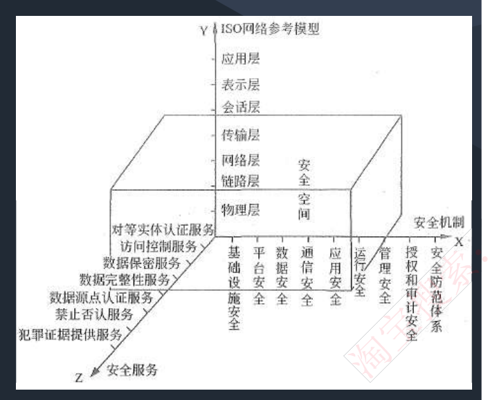
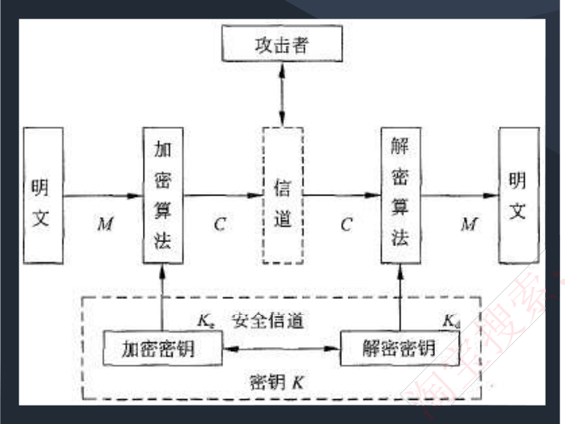
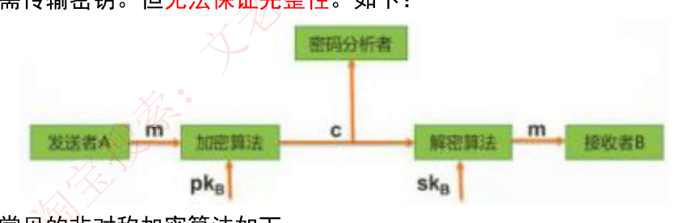
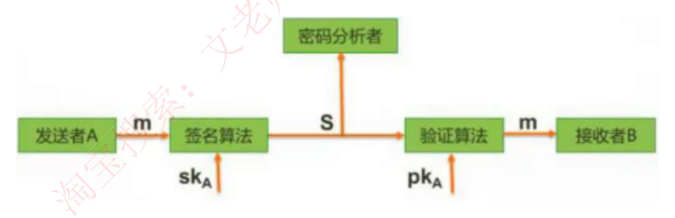
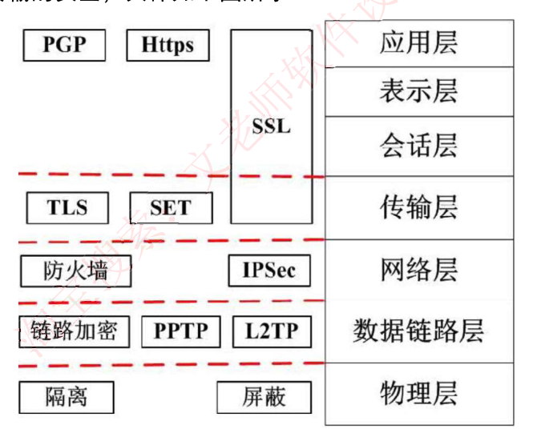
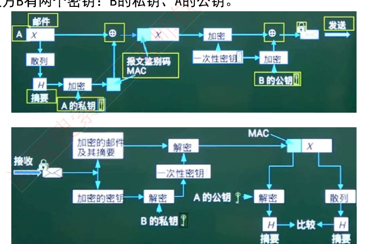

# 6. 安全性知识

> 来源：`外部资源/6.安全性知识.pdf`（13 页 / 25 张幻灯片，文老师软考教育）
> 逐页看图人工转录。`> [图]` 表示原件为图示。

---

## 封面 · 本章目录

信息安全和信息系统安全 / 信息安全技术 / 网络安全技术 / 网络安全协议

---

## 1. 信息安全和信息系统安全

### 1-1 信息安全含义及属性

保护信息的**保密性、完整性、可用性**，另外也包括其他属性，如：真实性、可核查性、不可抵赖性和可靠性。

◆ **保密性**：信息**不被泄漏给未授权的个人、实体和过程或不被其使用的特性**。包括：（1）最小授权原则（2）防暴露（3）信息加密（4）物理保密

◆ **完整性**：信息**未经授权不能改变的特性**。影响完整性的主要因素有设备故障、误码、人为攻击和计算机病毒等。保证完整性的方法包括：
1. **协议**：通过安全协议检测出被删除、失效、被修改的字段。
2. **纠错编码方法**：利用校验码完成检错和纠错功能。
3. **密码校验和方法**。
4. **数字签名**：能识别出发送方来源。
5. **公证**：请求系统管理或中介机构证明信息的真实性。

◆ **可用性**：**需要时，授权实体可以访问和使用的特性**。一般用系统正常使用时间和整个工作时间之比来度量。

### 1-2 其他属性

◆ **真实性**：指对**信息的来源进行判断**，能对伪造来源的信息予以鉴别。
◆ **可核查性**：系统实体的行为可以**被独一无二的追溯到该实体的特性**，这个特性就是要求该实体对其行为负责，为探测和调查安全违规事件提供了可能性。
◆ **不可抵赖性**：是指建立有效的责任机制，**防止用户否认其行为**，这一点在电子商务中是极其重要的。
◆ **可靠性**：系统在规定的时间和给定的条件下，**无故障地完成规定功能的概率**。

### 1-3 信息安全系统的体系架构

◆ **X 轴是"安全机制"**，为提供某些安全服务，利用各种安全技术和技巧，所形成的一个较为完善的机构体系。
◆ **Y 轴是"OSI 网络参考模型"**。
◆ **Z 轴是"安全服务"**。就是从网络中的各个层次提供给信息应用系统所需要的安全服务支持。

由 X、Y、Z 三个轴形成的信息安全系统三维空间就是**信息系统的"安全空间"**。

◆ 随着网络逐层扩展，这个空间不仅范围逐渐加大，安全的内涵也就更丰富，达到具有**认证、权限、完整、加密和不可否认五大要素**，也叫作"安全空间"的五大属性。

> [图] 三维立方体：Y 轴 ISO 网络参考模型（应用层/表示层/会话层/传输层/网络层/链路层/物理层）；X 轴安全机制（基础设施安全/平台安全/数据安全/通信安全/应用安全/管理安全/授权和审计安全/安全防范体系）；Z 轴安全服务（对等实体认证服务/访问控制服务/数据保密服务/数据完整性服务/数据源点认证服务/禁止否认服务/犯罪证据提供服务）

### 1-4 安全需求

◆ 可划分为**物理线路安全、网络安全、系统安全和应用安全**；从各级安全需求字面上也可以理解：
- 物理线路就是**物理设备、物理环境**；
- 网络安全指**网络上的攻击、入侵**；
- 系统安全指的是**操作系统漏洞、补丁**等；
- 应用安全就是**上层的应用软件，包括数据库软件**。

### 【考试真题】

**1.** 在网络安全管理中，加强内防内控可采取的策略有（ ）。
①控制终端接入数量
②终端访问授权，防止合法终端越权访问
③加强终端的安全检查与策略管理
④加强员工上网行为管理与违规审计
A.②③　B.②④　C.①②③④　D.②③④
**答案：C**

**2.** 在网络设计和实施过程中要采取多种安全措施，其中（ ）是针对系统安全需求的措施。
A. 设备防雷击　B. 入侵检测
C. 漏洞发现与补丁管理　D. 流量控制
**答案：C**

---

## 2. 信息安全技术

### 2-1 加密技术

一个密码系统，通常简称为密码体制 (Cryptosystem)，由五部分组成：
1. **明文空间 M**，它是全体明文的集合。
2. **密文空间 C**，它是全体密文的集合。
3. **密钥空间 K**，它是全体密钥的集合。其中每一个密钥 K 均由加密密钥 Ke 和解密密钥 Kd 组成，即 K=<Ke, Kd>。
4. **加密算法 E**，它是一组由 M 至 C 的加密变换。
5. **解密算法 D**，它是一组由 C 到 M 的解密变换。

◆ 对于明文空间 M 中的每一个明文 M，加密算法 E 在密钥 Ke 的控制下**将明文 M 加密成密文 C：C=E (M, Ke)**
◆ 而解密算法 D 在密钥 Kd 的控制下**将密文 C 解密出同一明文 M：M=D (C, Kd) =D (E (M, Ke),Kd)**

> [图] 明文 M → 加密算法 → C → 信道（攻击者）→ C → 解密算法 → 明文 M；下方加密密钥 Ke ← 安全信道 ← 解密密钥 Kd，密钥 K

### 2-2 对称加密技术

**数据的加密和解密的密钥（密码）是相同的**，属于**不公开密钥加密算法**。其**缺点是加密强度不高**（因为密钥位数少），**且密钥分发困难**（因为密钥还需要传输给接收方，也要考虑保密性等问题）。**优点是加密速度快，适合加密大数据**。

◆ 常见的对称密钥加密算法如下：
- **DES**：替换+移位、56 位密钥、64 位数据块、速度快，密钥易产生。
- **3DES**：三重 DES，两个 56 位密钥 K1、K2。
  - 加密：K1 加密->K2 解密->K1 加密。
  - 解密：K1 解密->K2 加密->K1 解密
- **AES**：是美国联邦政府采用的一种区块加密标准，这个标准用来替代原先的 DES。对其的要求是"**至少像 3DES 一样安全**"。
- **RC-5**：RSA 数据安全公司的很多产品都使用了 RC-5。
- **IDEA**：128 位密钥，64 位数据块，比 DES 的加密性好，对计算机功能要求相对低。

### 2-3 非对称加密技术

**数据的加密和解密的密钥是不同的**，分为公钥和私钥。是**公开密钥加密算法**。其**缺点是加密速度慢。优点是安全性高，不容易破解**。

◆ 非对称技术的原理是：发送者**发送数据时，使用接收者的公钥作加密密钥，私钥作解密密钥**，这样只有接收者才能解密密文得到明文。安全性更高，因为无需传输密钥。但**无法保证完整性**。

◆ 常见的非对称加密算法如下：
- **RSA**：512 位（或 1024 位）密钥，计算机量极大，难破解。
- **Elgamal、ECC（椭圆曲线算法）、背包算法、Rabin、D-H** 等。

> [图] 发送者 A → m → 加密算法（pk_B）→ c → 解密算法（sk_B）→ m → 接收者 B；上方密码分析者

### 2-4 信息摘要

所谓信息摘要，**就是一段数据的特征信息，当数据发生了改变，信息摘要也会发生改变**，发送方会将数据和信息摘要一起传给接收方，接收方会根据接收到的数据重新生成一个信息摘要，若此摘要和接收到的摘要相同，则说明数据正确。**信息摘要是由哈希函数生成的。**

◆ 信息摘要的特点：不算数据多长，都会产生**固定长度的信息摘要**；**任何不同的输入数据，都会产生不同的信息摘要**；单向性，即**只能由数据生成信息摘要，不能由信息摘要还原数据**。

◆ **信息摘要算法**：**MD5**（产生 128 位的输出）、**SHA-1**（安全散列算法，产生 160 位的输出，安全性更高）。

### 2-5 数字信封

◆ 相比较可知，对称加密算法密钥一般只有 56 位，因此**加密过程简单，适合加密大数据，也因此加密强度不高**；而非对称加密算法密钥有 1024 位，相应的**解密计算量庞大，难以破解，却不适合加密大数据**，一般用来加密对称算法的密钥，这样，就**将两个技术组合使用了，这也是数字信封的原理**：

◆ **数字信封原理**：**信是对称加密的密钥，数字信封就是对此密钥进行非对称加密**，具体过程：发送方将数据用对称密钥加密传输，而将对称密钥用接收方公钥加密发送给对方。接收方收到数字信封，用自己的私钥解密信封，取出对称密钥解密得原文。

◆ 数字信封运用了对称加密技术和非对称加密技术，**本质是使用对称密钥加密数据，非对称密钥加密对称密钥，解决了对称密钥的传输问题**。

### 2-6 数字签名

◆ **数字签名：唯一标识一个发送方。**
发送方发送数据时，使用**发送者的私钥进行加密**，接收者收到数据后，只能**使用发送者的公钥进行解密**，这样就能**唯一确定发送方**，这也是数字签名的过程。但**无法保证机密性**。如下：

> [图] 发送者 A → m → 签名算法（sk_A）→ S → 验证算法（pk_A）→ m → 接收者 B；上方密码分析者

### 2-7 公钥基础设施 PKI

◆ **公钥基础设施 PKI**：是**以不对称密钥加密技术为基础**，以数据机密性、完整性、身份认证和行为不可抵赖性为安全目的，来实施和提供安全服务的具有普适性的**安全基础设施**。

**（1）数字证书**：一个数据结构，是一种由**可信任的权威机构签署的信息集合**。在不同的应用中有不同的证书。如 X.509 证书必须包含下列信息：（1）版本号（2）序列号（3）签名算法标识符（4）认证机构（5）有效期限（6）主题信息（7）认证机构的数字签名（8）公钥信息。
**公钥证书主要用于确保公钥及其与用户绑定关系的安全。这个公钥就是证书所标识的那个主体的合法的公钥。** 任何一个用户只要知道签证机构的公钥，就能检查对证书的签名的合法性。如果检查正确，那么用户就可以相信那个证书所携带的公钥是真实的，而且这个公钥就是证书所标识的那个主体的合法的公钥。**例如驾照。**

**（2）签证机构 CA**：负责**签发证书、管理和撤销证书**。是所有注册用户所信赖的权威机构，CA 在给用户签发证书时**要加上自己的数字签名，以保证证书信息的真实性。任何机构可以用 CA 的公钥来验证该证书的合法性。**

### 【考试真题】

**1.** 假设 A 和 B 之间要进行加密通信，则正确的非对称加密流程是（ ）。
①A 和 B 都要产生一对用于加密和解密的加密密钥和解密密钥
②A 将公钥传送给 B，将私钥自己保存，B 将公钥传送给 A，将私钥自己保存
③A 发送消息给 B 时，先用 B 的公钥对信息进行加密，再将密文发送给 B
④B 收到 A 发来的消息时，用自己的私钥解密
A.①②③④　B.①③④②　C.③①②④　D.②③①④
**【答案】A**

**2.** 甲向乙发送其数据签名，要验证该签名，乙可使用（ ）对该签名进行解密。
A. 甲的私钥　B. 甲的公钥　C. 乙的私钥　D. 乙的公钥
**【答案】B**

**3.** 数字签名技术属于信息系统安全管理中保证信息（ ）的技术。
A、保密性　B、可用性　C、完整性　D、可靠性
**【答案】C**
**【解析】** 数字签名是保证信息传输的完整性、发送者的身份认证、防止交易中的抵赖发生。

**4.** 为保障数据的存储和运输安全，防止信息泄露，需要对一些数据进行加密。由于对称密码算法（ ），所以特别适合对大量的数据进行加密。
A、比非对称密码算法更安全　B、比非对称密码算法密钥更长
C、比非对称密码算法效率更高　D、还能同时用于身份认证
**【答案】C**

---

## 3. 网络安全技术

### 3-1 防火墙

◆ **防火墙**是在**内部网络和外部因特网之间增加的一道安全防护措施**，分为网络级防火墙和应用级防火墙。

◆ **网络级防火墙层次低，但是效率高**，因为其使用**包过滤和状态监测**手段，一般只检验网络包外在（起始地址、状态）属性是否异常，若异常，则过滤掉，不与内网通信，因此对应用和用户是透明的。

◆ 但是这样的问题是，如果遇到伪装的危险数据包就没办法过滤，此时，就要依靠**应用级防火墙，层次高，效率低**，因为应用级防火墙会将网络包拆开，具体检查里面的数据是否有问题，会消耗大量时间，造成效率低下，但是安全强度高。

### 3-2 入侵检测系统 IDS

防火墙技术主要是分隔来自外网的威胁，却**对来自内网的直接攻击无能为力**，此时就要用到入侵检测 IDS 技术，位于防火墙之后的第二道屏障，作为防火墙技术的补充。

◆ **原理：监控当前系统/用户行为**，使用入侵检测分析引擎进行分析，这里包含一个知识库系统，囊括了历史行为、特定行为模式等操作，将当前行为和知识库进行匹配，就能检测出当前行为是否是入侵行为，如果是入侵，则记录证据并上报给系统和防火墙，交由它们处理。

◆ 不同于防火墙，**IDS 入侵检测系统是一个监听设备，没有跨接在任何链路上，无须网络流量流经它便可以工作**。因此，对 IDS 的部署，唯一的要求是：IDS 应当挂接在**所有所关注流量都必须流经的链路上**。因此，IDS 在交换式网络中的位置一般选择在：（1）尽可能靠近攻击源（2）尽可能靠近受保护资源

### 3-3 入侵防御系统 IPS

IDS 和防火墙技术都是在入侵行为已经发生后所做的检测和分析，而 **IPS 是能够提前发现入侵行为，在其还没有进入安全网络之前就防御**。
**在安全网络之前的链路上挂载入侵防御系统 IPS，可以实时检测入侵行为，并直接进行阻断**，这是与 IDS 的区别，要注意。

### 3-4 杀毒软件与蜜罐系统

◆ **杀毒软件**：用于**检测和解决计算机病毒**，与防火墙和 IDS 要区分，计算机病毒要靠杀毒软件，防火墙是处理网络上的非法攻击。

◆ **蜜罐系统**：**伪造一个蜜罐网络引诱黑客攻击**，蜜罐网络被攻击不影响安全网络，并且可以借此了解黑客攻击的手段和原理，从而对安全系统进行升级和优化。

### 3-5 网络攻击和威胁

| 攻击类型 | 攻击名称 | 描述 |
|---|---|---|
| **被动攻击** | 窃听（网络监听） | 用各种可能的合法或非法的手段窃取系统中的信息资源和敏感信息。 |
| | 业务流分析 | 通过对系统进行长期监听，利用统计分析方法对诸如通信频度、通信的信息流向、通信总量的变化等参数进行研究，从而发现有价值的信息和规律。 |
| | 非法登录 | 有些资料将这种方式归为被动攻击方式。 |
| **主动攻击** | 假冒身份 | 通过欺骗通信系统（或用户）达到非法用户冒充成为合法用户，或者特权小的用户冒充成为特权大的用户的目的。黑客大多是采用假冒进行攻击。 |
| | 抵赖 | 这是一种来自用户的攻击，比如：否认自己曾经发布过的某条消息、伪造一份对方来信等。 |
| | 旁路控制 | 攻击者利用系统的安全缺陷或安全性上的脆弱之处获得非授权的权利或特权。 |
| | 重放攻击 | 所截获的某次合法的通信数据拷贝，出于非法的目的而被重新发送。 |
| | 拒绝服务（DOS） | 对信息或其它资源的合法访问被无条件地阻止。 |

### 3-6 计算机病毒和木马

◆ **病毒**：编制或者在计算机程序中插入的**破坏计算机功能或者破坏数据，影响计算机使用并且能够自我复制**的一组计算机指令或者程序代码。

◆ **木马**：是一种**后门程序**，常被黑客用作控制远程计算机的工具，隐藏在被控制电脑上的一个小程序监控电脑一切操作并盗取信息。

◆ **代表性病毒实例**：
- **蠕虫病毒**（感染 EXE 文件）：熊猫烧香，罗密欧与朱丽叶，恶鹰，尼姆达，冲击波，欢乐时光。
- **木马**：QQ 消息尾巴木马，特洛伊木马，X 卧底。
- **宏病毒**（感染 word、excel 等文件中的宏变量）：美丽沙，台湾 1 号。
- **CIH 病毒**：史上唯一破坏硬件的病毒。
- **红色代码**：蠕虫病毒+木马。

### 【考试真题】

**1.** 随着互联网的发展，网络安全越来越受到人们的重视，其中能够鉴别什么样的数据包可以进出组织内部网络的安全技术称为（ ）
A、入侵检测　B、防病毒软件　C、安全审计系统　D、防火墙
**【答案】D**

**2.** 计算机病毒的特征不包括（ ）。
A. 传染性　B. 触发性　C. 隐蔽性　D. 自毁性
**答案：D**

**3.** 攻击者通过发送一个目的主机已经接收过的报文来达到攻击目的，这种攻击方式属于（11）攻击。
A. 重放　B. 拒绝服务　C. 数据截获　D. 数据流分析
**答案：A**

**4.** 下列攻击方式中，流量分析属于（ ）方式。
A. 被动攻击　B. 主动攻击　C. 物理攻击　D. 分发攻击
**答案：A**

---

## 4. 网络安全协议

### 4-1 各层安全协议

◆ **物理层**主要使用物理手段，隔离、屏蔽物理设备等，其它层都是靠协议来保证传输的安全，具体如下图所示：

> [图] 应用层：PGP、Https；表示层/会话层：SSL 跨层；传输层：TLS、SET；网络层：防火墙、IPSec；数据链路层：链路加密、PPTP、L2TP；物理层：隔离、屏蔽

### 4-2 主要协议

◆ **SSL 协议**：安全套接字协议，被设计为**加强 Web 安全传输 (HTTP/HTTPS/) 的协议**，安全性高，和 HTTP 结合之后，形成 **HTTPS 安全协议，端口号为 443**。

◆ **SSH 协议**：安全外壳协议，被设计为**加强 Telnet/FTP 安全的传输协议**。

◆ **SET 协议**：**安全电子交易协议**主要应用于 **B2C 模式（电子商务）中保障支付信息的安全性**。SET 协议本身比较复杂，设计比较严格，安全性高，它能保证信息传输的机密性、真实性、完整性和不可否认性。SET 协议是 PKI 框架下的一个典型实现，同时也在不断升级和完善，如 SET 2.0 将支持借记卡电子交易。

◆ **Kerberos 协议**：是一种**网络身份认证协议**，该协议的基础是**基于信任第三方，它提供了在开放型网络中进行身份认证的方法**，认证实体可以是用户也可以是用户服务。这种认证不依赖宿主机的操作系统或计算机的 IP 地址，不需要保证网络上所有计算机的物理安全性，并且假定数据包在传输中可被随机窃取和篡改。

◆ **PGP 协议**：使用 **RSA 公钥证书**进行身份认证，使用 **IDEA（128 位密钥）**进行数据加密，使用 **MD5** 进行数据完整性验证。
发送方 A 有三个密钥：A 的私钥、B 的公钥、A 生成的一次性对称密钥；
接收方 B 有两个密钥：B 的私钥、A 的公钥。

> [图] PGP 发送流程：邮件 → 散列 → 摘要（A 的私钥加密）→ 报文鉴别码 MAC → 一次性密钥加密 → B 的公钥加密 → 发送；接收流程：加密的邮件及其摘要 → 解密 → 一次性密钥 → 加密的密钥 →（B 的私钥解密）→ A 的公钥解密 → 散列 → 摘要比较

### 【考试真题】

**1.** 下面可提供安全电子邮件服务的是（ ）。
A. RSA　B. SSL　C. SET　D. S/MIME
**答案：D**
解析：MIME(Multipurpose Internet Mail Extensions) 中文名为：多用途互联网邮件扩展类型。S/MIME (Secure Multipurpose Internet Mail Extensions) 是对 MIME 在安全方面的扩展。

**2.** 以下关于第三方认证服务的叙述中，正确的是（ ）。
A. Kerberos 认证服务中保存数字证书的服务器叫 CA
B. 第三方认证服务的两种体制分别是 Kerberos 和 PKI
C. PKI 体制中保存数字证书的服务器叫 KDC
D. Kerberos 的中文全称是"公钥基础设施"
**答案：B**

**3.** 网络管理员通过命令行方式对路由器进行管理，要确保 ID，口令和会话内存的保密性，应采取的访问方式是（ ）。
A. 控制台　B. AUX　C. TELNET　D. SSH
**答案：D**
