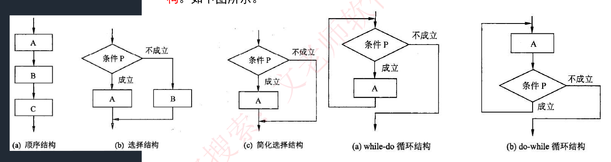
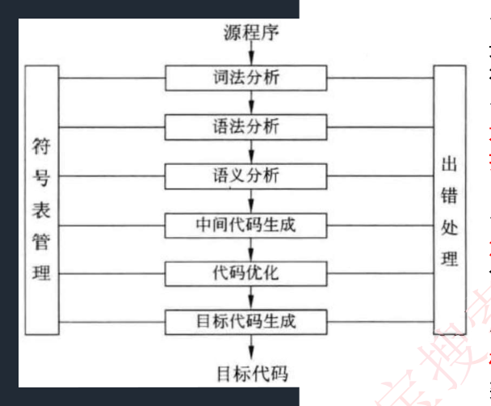
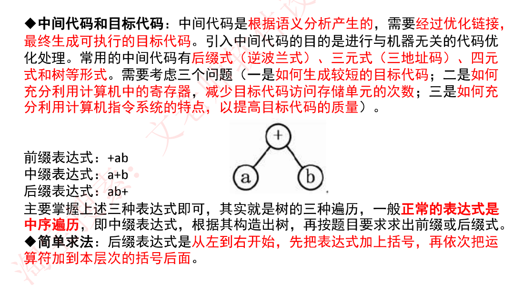
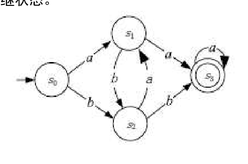
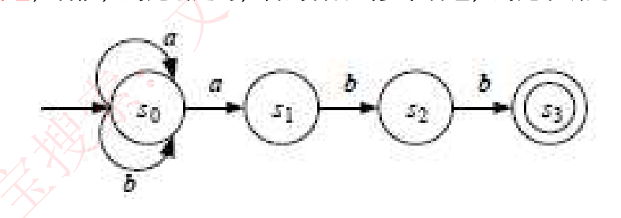
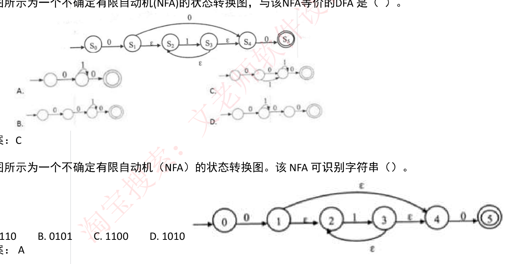

# 8. 程序设计语言基础知识

> 来源：`外部资源/8.程序设计语言基础知识.pdf`（12 页 / 23 张幻灯片，文老师软考教育）
> 逐页看图人工转录。`> [图]` 表示原件为图示。

---

## 封面 · 本章目录

- **程序设计语言基础**：程序设计语言概述、程序设计语言的基本概念、程序设计语言的基本成分
- **语言处理程序基础**：编译程序基本原理、文法定义、正规式、有限自动机、语法分析方法

---

## 1. 程序设计语言的基本概念

### 1-1 汇编、解释与编译

◆ **汇编**：将**汇编语言翻译成目标程序**执行。
◆ **解释和编译**：将高级语言翻译成目标程序执行。不同之处在于**编译程序生成独立的可执行文件，直接运行，运行时无法控制源程序，效率高。而解释程序不生成可执行文件，可以逐条解释执行，用于调试模式，可以控制源程序**，因为还需要控制程序，因此**执行速度慢，效率低**。

### 1-2 程序设计语言定义三要素：语法、语义、语用

◆ **语法**是指由程序设计语言的基本符号组成程序中的**各个语法成分（包括程序）的一组规则**，其中**由基本字符构成的符号（单词）书写规则称为词法规则，由符号构成语法成分的规则称为语法规则**。
◆ **语义**是程序设计语言中**按语法规则构成的各个语法成分的含义**，可分为静态语义和动态语义。**静态语义指编译时可以确定的语法成分的含义，而运行时刻才能确定的含义是动态语义**。一个程序的执行效果说明了该程序的语义，它取决于构成程序的各个组成部分的语义。
◆ **语用**表示了**构成语言的各个记号和使用者的关系**，涉及符号的来源、使用和影响。

### 1-3 语言的分类

◆ 程序设计语言是为了书写计算机程序而人为设计的符号语言，用于对计算过程进行描述、组织和推导。

◆ **低级语言**：**机器语言（计算机硬件只能识别 0 和 1 的指令序列），汇编语言**。
◆ **高级语言**：功能更强，抽象级别更高，**与人们使用的自然语言比较接近**。

◆ **各程序设计语言特点**：
- **Fortran 语言**：科学计算，执行效率高。
- **Pascal 语言**：为教学开发，表达能力强。
- **C 语言**：指针操作能力强，可以开发系统级软件，高效。
- **C++ 语言**：面向对象，高效。
- **Java 语言**：面向对象，中间代码，跨平台。
- **C# 语言**：面向对象，中间代码，.Net 框架。
- **Python** 是一种面向对象、解释型计算机程序设计语言。
- **Prolog** 是逻辑型程序设计语言。

◆ **语言的实现则有个语境问题**。语境是指理解和实现程序设计语言的环境，包括编译环境和运行环境。

◆ **程序设计语言的分类**：
1. **命令式和结构化程序设计语言**，包括 Fortran、PASCAL 和 C 语言。
2. **面向对象程序设计语言**，包括 C++、JAVA 和 Smalltalk 语言。
3. **函数式程序设计语言**，包括 LISP、Haskell、Scala、Scheme、APL 等。
4. **逻辑型程序设计语言**，包括 PROLOG。

---

## 2. 程序设计语言的基本成分

### 2-1 数据成分

指一种程序设计语言的**数据和数据类型**。数据分为**常量**（程序运行时不可改变）、**变量**（程序运行时可以改变）、**全局量**（存储空间在静态数据区分配）、**局部量**（存储空间在堆栈区分配）。数据类型有整型、字符型、双精度、单精度浮点型、布尔型等。

### 2-2 运算成分

指明**允许使用的运算符号及运算规则**。包括算术运算、逻辑运算、关系运算、位运算等。

### 2-3 控制成分

指明**语言允许表述的控制结构**。包括**顺序结构、选择结构、循环结构**。

> [图] (a) 顺序结构 (b) 选择结构 (c) 简化选择结构 (d) while-do 循环结构 (e) do-while 循环结构 五种流程图



### 2-4 传输成分

指明**语言允许的数据传输方式**。如赋值处理、数据的输入输出等。

### 2-5 函数调用与参数传递

◆ **函数调用的一般形式为**：函数名（实参表）；

◆ 函数调用时**实参与形参间交换信息的方法**有值调用和引用调用两种。

**（1）值调用（Call by Value）**。若实现函数调用时将实参的值传递给相应的形参，则称为是传值调用。在这种方式下形参不能向实参传递信息。
在 C 语言中，**要实现被调用函数对实参的修改，必须用指针作为参数**。即调用时需要先对实参进行**取地址运算**，然后将实参的地址传递给指针形参。**其本质上仍属于值调用。这种方式实现了间接内存访问。**

**（2）引用调用（Call by Reference）**。引用是 **C++ 中引入的概念**，当形式参数为引用类型时，形参名是实参的别名，函数中对形参的访问和修改实际上就是针对相应实参所做的访问和改变。

### 2-6 函数

C 程序由一个或多个函数组成，每个函数都有一个名字，其中**有且仅有一个名字为 main 的函数作为程序运行时的起点**。函数的使用涉及 3 个概念：**函数定义、函数声明和函数调用**。

◆ 函数的定义包括两部分：**函数首部和函数体**。函数的定义描述了函数做什么和怎么做。**函数定义的一般形式为**：
```
返回值的类型 函数名(形式参数表) //函数首部
{
函数体;
}
```
◆ 函数首部说明了函数返回值的数据类型、函数的名字和函数运行时所需的参数及类型。函数所实现的功能在函数体部分进行描述。

◆ 函数应该**先声明后引用**。如果程序中对一个函数的调用在该函数的定义之前进行，则应该在调用前对被调用函数进行声明。**函数原型用于声明函数。函数声明的一般形式为**：
```
返回值类型 函数名(参数类型表);
```

### 【考试真题】

**1.** 将高级语言源程序翻译为可在计算机上执行的形式有多种不同的方式，其中（ ）。
A. 编译方式和解释方式都生成逻辑上与源程序等价的目标程序
B. 编译方式和解释方式都不生成逻辑上与源程序等价的目标程序
C. 编译方式生成逻辑上与源程序等价的目标程序，解释方式不生成
D. 解释方式生成逻辑上与源程序等价的目标程序，编译方式不生成
**答案：C**

**2.** 以下关于程序设计语言的叙述中，不正确的是（ ）。
A. 脚本语言中不使用变量和函数
B. 标记语言常用于描述格式化和链接
C. 脚本语言采用解释方式实现
D. 编译型语言的执行效率更高
**答案：A**

**3.** 函数 f、g 的定义如下，执行表达式 "y = f(2)" 的运算时，函数调用 g(la) 分别采用引用调用 (call by reference) 方式和值调用 (call by value) 方式，则该表达式求值结束后 y 的值分别为（ ）。

```
f(int x)                g(int x)
{                       {
  int la = x+1;           x=x*x+1;
  g(la);                  return;
  return la*x;          }
}
```

A.9、6　B.20、6　C.20、9　D.30、9
**答案：B**

**4.** 通用的高级程序设计语言一般都会提供描述数据、运算、控制和数据传输的语言成分，其中，控制包括顺序、（ ）和循环结构。
A. 选择　B. 递归　C. 递推　D. 函数
**答案：A**

---

## 3. 编译程序基本原理

### 3-1 编译过程

◆ 编译程序对高级语言源程序进行编译的过程中，要不断收集、记录和使用源程序中一些相关符号的类型和特征等信息，并将其存入符号表中，编译过程如下：

> [图] 源程序 → 词法分析 → 语法分析 → 语义分析 → 中间代码生成 → 代码优化 → 目标代码生成 → 目标代码；左侧贯穿"符号表管理"，右侧贯穿"出错处理"



◆ **词法分析**：是编译过程的第一个阶段。这个阶段的任务是**从左到右一个字符一个字符地读入源程序**，即对构成源程序的**字符流进行扫描然后根据构词规则识别单词**（也称单词符号或符号）。

◆ **语法分析**：是编译过程的一个逻辑阶段。语法分析的任务是**在词法分析的基础上将单词序列组合成各类语法短语**，如"程序"，"语句"，"表达式"等等。语法分析程序判断源程序在结构上是否正确。

◆ **语义分析**：是编译过程的一个逻辑阶段。语义分析的任务是**对结构上正确的源程序进行上下文有关性质的审查**，进行类型审查。如类型匹配、除法除数不为 0 等。又分为**静态语义错误（在编译阶段能够查找出来）和动态语义错误（只能在运行时发现）**。

### 3-2 中间代码和目标代码

◆ **中间代码**是**根据语义分析产生的**，需要**经过优化链接，最终生成可执行的目标代码**。引入中间代码的目的是进行与机器无关的代码优化处理。常用的中间代码有**后缀式（逆波兰式）、三元式（三地址码）、四元式和树等形式**。需要考虑三个问题（一是如何生成较短的目标代码；二是如何充分利用计算机中的寄存器，减少目标代码访问存储单元的次数；三是如何充分利用计算机指令系统的特点，以提高目标代码的质量）。

```
前缀表达式：+ab
中缀表达式：a+b
后缀表达式：ab+
```
> [图] 表达式树：根 + ，左子 a，右子 b



主要掌握上述三种表达式即可，其实就是**树的三种遍历**，一般**正常的表达式是中序遍历**，即中缀表达式，根据其构造出树，再按题目要求求出前缀或后缀式。

◆ **简单求法**：后缀表达式是**从左到右开始，先把表达式加上括号，再依次把运算符加到本层次的括号后面**。

### 【考试真题】

**1.** 将编译器的工作过程划分为词法分析，语法分析，语义分析，中间代码生成，代码优化和目标代码生成时，语法分析阶段的输入是（ ）若程序中的括号不配对，则会在（ ）阶段检查出错误。
A、记号流　B、字符流　C、源程序　D、分析树
A、词法分析　B、语法分析　C、语义分析　D、目标代码生成
**答案：A　B**

**2.** 以编译方式翻译 C/C++ 源程序的过程中，（ ）阶段的主要任务是对各条语句的结构进行合法性分析。
A. 词法分析　B. 语义分析　C. 语法分析　D. 目标代码生成
**答案：C**

**3.** 表达式（a-b）\*（c+d）的后缀式（逆波兰式）是（ ）
A、abcd-+\*　B、ab-cd+\*　C、abc-d/-\*　D、ab-cd+\*
**答案：D**
解析：使用快速解法，先将表达式加上括号为((a-b)\*(c+d))，再将符号移动到本表达式括号外面得 ((ab)-(cd)+)+\*，最后去掉括号得 ab-cd+\*。

---

## 4. 文法定义

### 4-1 字母表、字符串、字符串集合及运算

- **字母表 Σ 和字符**：字母表是字符的非空有穷集合，字符是字母表 Σ 中的元素。例如 Σ={a,b}，a 或 b 是字符。
- **字符串**：Σ 中的**字符组成的有穷序列**。例如 a，ab，aaa 都是 Σ 上的字符串。
- **字符串的长度**：指字符串中的**字符个数**。如 |aba|=3。
- **空串 ε**：由零个字符组成的序列，|ε|=0。
- **连接**：字符串 S 和 T 的连接是指将串 T 接续在串 S 之后，表示为 S·T，连接符号 "·" 可省略。显然，对于字符串 Σ 的任意字符串 S，S·ε=ε·S=S。
- **Σ\***：是指包括**空串 ε 在内的 Σ 上所有字符串的集合**。例如：Σ={a,b}，Σ\*={ε,a,b,aa,bb,ab,ba,aaa,…}。
- **字符串的方幂**：把字符串 α 自身连接 n 次得到的串，称为字符串 α 的 n 次方幂，记为 α^n。α₀=ε，α^n=α^(n-1)·α（n>0）。
- **字符串集合的运算**：设 A，B 代表字母表 Σ 上的两个字符串集合。
  - 或（合并）：A∪B={α|α∈A 或 α∈B}。
  - 积（连接）：AB={αβ|α∈A 且 β∈B}。
  - 幂：A^n=A·A^(n-1)（n>0），并规定 A^0={ε}。
  - 正则闭包+：A+=A^1∪A^2∪…∪A^n…。
  - 闭包\*：A\*=A^0∪A^+。显然，Σ\*=Σ^0∪Σ^1∪Σ^2∪…∪Σ^n∪…。

### 4-2 文法 G

◆ **文法 G 是一个四元组，可表示为 G=（V, T, P, S）**，其中：
- **V**：非终结符，不是语言组成部分，不是最终结果，可以推导出其他元素。
- **T**：终结符，是语言的组成部分，是最终结果，不能再推导其他元素。
- **S**：起始符，是语言的开始符号。
- **P**：产生式，用终结符代替非终结符的规则，例如 a->b。

### 4-3 乔姆斯基（Chomsky）文法分类

把文法分成 **4 种类型，即 0 型、1 型、2 型和 3 型**。

◆ **0 型文法**也称为**短语文法**，其功能相当于图灵机，任何 0 型语言都是递归可枚举的；反之，递归可枚举集也必定是一个 0 型语言。
◆ **1 型文法**也称为**上下文有关文法**，这种文法意味着**对非终结符的替换必须考虑上下文**，并且一般不允许替换成 ε 串。例如，若 αAβ→αγβ 是 1 型文法的产生式，α 和 β 不全为空，则非终结符 A 只有在左边是 α，右边是 β 的上下文中才能替换成 γ。
◆ **2 型文法**就是**上下文无关文法，非终结符的替换无须考虑上下文**。程序设计语言中的大部分语法都是上下文无关文法，当然语义上是相关的，要注意区分语法和语义。
◆ **3 型文法等价于正规式**，因此也被称为正规文法或线性文法。

---

## 5. 正规式

◆ 语言中具有独立含义的最小语法单位是符号（单词），如标识符、无符号常数与界限符等。词法分析的任务是把构成源程序的字符串转换成单词符号序列。
◆ **词法规则可用 3 型文法（正规文法）或正规表达式描述，它产生的集合是语言规定的基本字符集 Σ(字母表) 上的字符串的一个子集，称为正规集。**

◆ **正规式和正规集**：对于字母表 Σ，其上的正规式及其表示的正规集可以递归定义如下。
1. **ε 是一个正规式**，它表示集合 L(ε)= {ε}。
2. 若 a 是 Σ 上的字符，则 **a 是一个正规式**，它所表示的正规集为 {a}。
3. 若正规式 r 和 s 分别表示正规集 L(r) 和 L(s)，则：
   - ① **r|s 是正规式**，表示集合 L(r)∪L(s)。
   - ② **r·s 是正规式**，表示集合 L(r)L(s)。
   - ③ **r\* 是正规式**，表示集合 (L(r))\*。
   - ④ **(r) 是正规式**，表示集合 L(r)。

◆ **仅通过有限次地使用上述 3 个步骤定义的表达式才是 Σ 上的正规式**，其中，运算符 "|" "·" "\*" 分别称为 "或" "连接" 和 "闭包"。在正规式的书写中，连接运算符 "·" 可省略，运算的优先级从高到低顺序排列为 "\*" "·" "|"。

设 Σ={a, b}，下表列出了 Σ 上的一些正规式和相应的正规集。

| 正规式 | 正规集 |
|---|---|
| ab | 字符串 ab 构成的集合 |
| a\|b | 字符串 a、b 构成的集合 |
| a\* | 由 0 个或多个 a 构成的字符串集合 |
| (a\|b)\* | 所有字符 a 和 b 构成的串的集合 |
| a(a\|b)\* | 以 a 为首字符的 a、b 字符串的集合 |
| (a\|b)\*abb | 以 abb 结尾的 a、b 字符串的集合 |

### 【考试真题】

**1.** 在仅由字符 a、b 构成的所有字符串中，其中以 b 结尾的字符串集合可用正规式表示为（ ）
A.(b|ab)\*b　B.(ab\*)\*b　C.a\*b\*b　D.(a|b)\*b
**答案：D**
解析：符号 \* 表示闭包，a\* 表示可以有 0 个或 n 个 a 的字符串集合；符号 | 即或，a|b 即字符串 a 或者字符串 b；因此 (a|b)\* 必然为 a 或 b 的字符串集合，最后再加 b，就是以 b 为结尾。BC 中都有单独字符的闭包，即 b\*，表示可以有 0 个 b，有可能不是字符串集合。

**2.** 由字符 a、b 构成的字符串中，若每个 a 后至少跟一个 b，则该字符串集合可用正规式表示为（ ）。
A.（b|ab）\*　B.（ab）\*　C.（ab\*）\*　D.（a|b）\*
**答案：A**
解析：符号 \* 为闭包，表示可以有 0 个或 n 个字符的集合，单独的 b\* 表示可以有 0 个或者 n 个字符 b 的集合，当为 0 个时，BC 都不符合，D 只是 a 或 b 的闭包，可能全 a 或全 b，不符合。

**3.** 简单算术表达式的结构可以用下面的上下文无关文法进行描述（E 为开始符号），（ ）是符合该文法的句子。
```
E→T|E+T
T→F|T*F
F→-F|N
N→0|1|2|3|4|5|6|7|8|9
```
A.2--3\*4　B.2+-3\*4　C.(2+3)\*4　D.2\*4-3
**答案：B**
解析：了解 | 是或的意思，可以将题目给出的公式重新拆解：
```
E->T 或者 E->E+T
T->F 或者 T->T*F
F->-F 或者 F->N
N->0-9 任意一个数
```
由此，可以得出推导树：化简到这里，就无需再化简，因为 E,T,F 都可以直接推导出 N，那么直接将 N 的数据拿进去代入就可以了，看看符号顺序是否满足。

---

## 6. 有限自动机

◆ 有限自动机是一种**识别装置的抽象概念**，它能**准确地识别正规集**。有限自动机分为确定的有限自动机和不确定的有限自动机两类。

**（1）确定的有限自动机（DFA）**。一个确定的有限自动机是个五元组 (S, Σ, f, s0, Z)，其中：
- **S** 是一个有限集，其每个元素称为一个状态。
- **Σ** 是一个有穷字母表，其每个元素称为一个输入字符。
- **f** 是 S×Σ→S 上的单值部分映像。f(A, a)=Q 表示当前状态为 A、输入为 a 时，将转换到下一状态 Q。称 Q 为 A 的一个后继状态。
- **s0∈S**，是唯一的一个开始状态。
- **Z** 是非空的终止状态集合，Z ⊆ S。

> [图] 状态转换图实例：s0 --a--> s1 --b--> s3(终态)，含 a、b 多条转移边



**（2）不确定的有限自动机（NFA）**。一个不确定的有限自动机也是一个五元组，它与确定有限自动机的区别如下。
- ① **f 是 S×Σ→2^S 上的映像**。对于 S 中的一个给定状态及输入符号，返回一个状态的集合。即当前状态的**后继状态不一定是唯一的**。
- ② 有**向弧上的标记可以是 ε**。

◆ **确定的有限自动机和不确定的有限自动机：输入一个字符，看是否能得出唯一的后继**，若能，则是确定的，否则若得出多个后继，则是不确定的。

> [图] NFA 状态转换图实例：s0 自环 a、b，s0 --a--> s1 --b--> s2 --b--> s3(终态)



### 【考试真题】

**1.** 下图所示为一个不确定有限自动机 (NFA) 的状态转换图，与该 NFA 等价的 DFA 是（ ）。
> [图] 题干 NFA 与 A/B/C/D 四个候选 DFA 状态图


**答案：C**

**2.** 下图所示为一个不确定有限自动机（NFA）的状态转换图。该 NFA 可识别字符串（ ）。
> [图] 状态 0 --0--> 1 --ε--> 2 --1--> 3 --ε--> 4 --0--> 5(终态)，含 ε 回边


A. 0110　B. 0101　C. 1100　D. 1010
**答案：A**

---

## 7. 语法分析方法

◆ **自上而下语法分析**：**最左推导，从左至右**。给定文法 G 和源程序串 r。从 G 的开始符号 S 出发，通过反复使用产生式对句型中的非终结符进行替换（推导），逐步推导出 r。

◆ **递归下降思想**：原理是利用函数之间的**递归调用模拟语法树自上而下的构造**过程，是一种自上而下的语法分析方法。

◆ **自下而上语法分析**：**最右推导，从右至左**。从给定的输入串 r 开始，不断寻找子串与文法 G 中某个产生式 P 的候选式进行匹配，并用 P 的左部代替（归约）之，逐步归约到开始符号 S。

◆ **移进-规约思想**：设置一个**栈**，将输入符号逐个移进栈中，栈顶形成某产生式的右部时，就用左部去代替，称为归约。很明显，这个思想是通过右部来推导出左部，因此是自下而上语法分析的核心思想。
