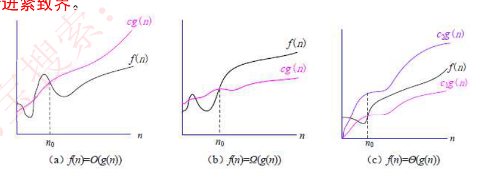

# 10. 算法分析与设计

> 来源：`外部资源/10.算法分析与设计.pdf`（14 页 / 27 张幻灯片，文老师软考教育）
> 逐页看图人工转录。`> [图]` 表示原件为图示。

---

## 封面 · 本章目录

- **算法分析**：算法的特性、算法的复杂度、递归
- **算法设计**：分治法、动态规划法、贪心法、回溯法、分支限界法、概率算法、近似算法
- **其他算法**：数据挖掘算法、智能优化算法

---

## 1. 算法的特性

◆ **算法（Algorithm）**是**对特定问题求解步骤的一种描述**，它是指令的有限序列，其中**每一条指令表示一个或多个操作**。此外，一个算法还具有下列 5 个重要特性。

1. **有穷性**。一个算法必须总是（对任何合法的输入值）在执行有穷步之后结束，且每一步都可在有穷时间内完成。
2. **确定性**。算法中的每一条指令必须有确切的含义，理解时不会产生二义性。并且在任何条件下，算法只有唯一的一条执行路径，即对于相同的输入只能得出相同的输出。
3. **可行性**。一个算法是可行的，即算法中描述的操作都可以通过已经实现的基本运算执行有限次来实现。
4. **输入**。一个算法有零个或多个输入，这些输入取自于某个特定的对象的集合。
5. **输出**。一个算法有一个或多个输出，这些输出是同输入有着某些特定关系的量。

---

## 2. 算法的复杂度

### 2-1 时间复杂度分析

◆ **算法的时间复杂度分析**：主要是**分析算法的运行时间**，即算法执行所需要的**基本操作数**。不同规模的输入所需要的基本操作数是不相同。在算法分析中，**可以建立以输入规模 n 为自变量的函数 T(n) 来表示算法的时间复杂度**。

◆ 即使对于**相同的输入规模，数据分布不相同也影响了算法执行路径的不同**，因此所需要的执行时间也不同。根据不同的输入，将算法的时间复杂度分析分为 3 种情况：**最佳情况、最坏情况、平均情况**。

### 2-2 渐进符号

◆ **渐进符号**：以输入规模 n 为自变量建立的时间复杂度实际上还是较复杂的，例如 an²+bn+c，不仅与输入规模有关，还与系数 a、b 和 c 有关。此时可以**对该函数做进一步的抽象，仅考虑运行时间的增长率或称为增长的量级**，如忽略上式中的低阶项和高阶项的系数，仅考虑 n^2。**当输入规模大到只有与运行时间的增长量级有关时，就是在研究算法的渐进效率**。也就是说，**从极限角度看，只关心算法运行时间如何随着输入规模的无限增长而增长**。下面简单介绍 3 种常用的标准方法来简化算法的渐进分析。

（1）**O 记号**。定义为：给定一个函数 g(n)，O(g(n))={f(n): 存在正常数 c 和 n0，使得对所有的 n≥n0，有 0≤f(n)≤cg(n)}，如图（a）所示。**O(g(n)) 表示一个函数集合，往往用该记号给出一个算法运行时间的渐进上界。考试中一般只涉及到 O 符号。**

（2）**Ω 记号**。定义为：给定一个函数 g(n)，Ω(g(n))={f(n): 存在正常数 c 和 n0，使得对所有的 n≥n0，有 0≤cg(n)≤f(n)}，如图（b）所示。**Ω(g(n)) 表示一个函数集合，往往用该记号给出一个算法运行时间的渐进下界。**

（3）**Θ 记号**。定义为：给定一个函数 g(n)，Θ(g(n))={f(n): 存在正常数 c1、c2 和 n0，使得对所有的 n≥n0，有 0≤c1g(n)≤f(n)≤c2g(n)}，如图（c）所示。**Θ(g(n)) 表示一个函数集合，往往用该记号给出一个算法运行时间的渐进上界和渐进下界，即渐进紧界。**

> [图] (a) f(n)=O(g(n))　(b) f(n)=Ω(g(n))　(c) f(n)=Θ(g(n)) 三张函数增长对比图



### 2-3 复杂度示例代码

```c
// 常数级：
int sum = 0, n = 100;
sum = (1 + n) * n / 2;
printf("%d",sum);

// 线性级：
int i;
for(i = 0; i < n; i++){
  ......
}

// 对数级：
int count = 1;
while (count < n){
  count = count * 2;
  ......
}

// 平方级：
int i, j;
for(i = 0; i < n; i++){
  for(j = 0; j < n; j++){
    ......
  }
}

// 以下代码时间复杂度？
int i, j;
for(i = 0; i < n; i++){
  for(j = i; j < n; j++){
    ......
  }
}
```

---

## 3. 递归

◆ **递归是指子程序（或函数）直接调用自己或通过一系列调用语句间接调用自己**，是一种描述问题和解决问题的常用方法。递归有两个基本要素：**边界条件，即确定递归到何时终止，也称为递归出口；递归模式，即大问题是如何分解为小问题的，也称为递归体**。

◆ **阶乘函数可递归地定义为**：
```
n! = 1           , n = 0
   = n(n−1)!     , n > 0
```
◆ 阶乘函数的自变量 n 的定义域是非负整数。递归式的**第一式给出了这个函数的一个初始值**，是**递归的边界条件**。递归式的**第二式是用较小自变量的函数值来表示较大自变量的函数值的方式来定义 n 的阶乘**，是**递归体**。n! 可以递归地计算如下：
```c
int Factorial(int num){
  if(num==0)
    return 1;
  if(num>0)
    return num * Factorial(num - 1);
}
```

◆ **递归算法的时间复杂度分析方法**：将递归式中**等式右边的项根据递归式进行替换，称为展开**。展开后的项被再次展开，如此下去，直到得到一个求和表达式，得到结果。

【例 8.2】求 T(n) = 1（n=1）; T(n−1)+n（n>1）的解。
```
解：T(n) = T(n − 1) + n
        = T(n − 2) + (n − 1) + n
        = ⋮
        = 1 + 2 + ⋯ + (n − 1) + n
        = n(n + 1)/2
        = O(n²)
```

### 【考试真题】

已知算法 A 的运行时间函数为 T(n)=8T(n/2)+n^2，其中 n 表示问题的规模，则该算法的时间复杂度为（ ）另已知算法 B 的运行时间函数为 T(n)=XT(n/4)+n^2，其中 n 表示问题的规模。对充分大的 n，若要算法 B 比算法 A 快，则 X 的最大值为（ ）。
(62) A. Θ(n)　B. Θ(nlgn)　C. Θ(n²)　D. Θ(n³)
A. 15　B.17　C. 63　D. 65
**答案：D C**
解析：T(n) 公式中本就有 n^2，而且还是一个递推公式，递归公式中也有 n/2，可知实际有 n^3 个数量级；算法 B 比 A 快，可令 XT(n/4)+n^2<8T(n/2)+n^2，推导出 X<8T(n/2) / T(n/4)，将括号内分母取出，因为是 n^3 级别，取出后上述公式可转化为 X<8\*(1/2)^3\*T(n) / (1/4)^3\*T(n)，进一步简化消除可得 X<1/(1/64)，即 X<64，X 最大值为 63.

---

## 算法设计 · 1. 分治法

◆ 分治法的设计思想是**将一个难以直接解决的大问题分解成一些规模较小的相同问题，以便各个击破，分而治之**。如果规模为 n 的问题可分解成 k 个子问题，1<k≤n，这些子问题互相独立且与原问题相同。分治法产生的子问题往往是原问题的较小模式，这就为递归技术提供了方便。

◆ 一般来说，分治算法在**每一层递归上都有 3 个步骤**。
1. **分解**。将原问题分解成一系列子问题。
2. **求解**。递归地求解各子问题。若子问题足够小则直接求解。
3. **合并**。将子问题的解合并成原问题的解。

◆ **凡是涉及到分组解决的都是分治法**，例如归并排序算法完全依照上述分治算法的 3 个步骤进行：
1. 分解。将 n 个元素分成各含 n/2 个元素的子序列。
2. 求解。用归并排序对两个子序列递归地排序。
3. 合并。合并两个已经排好序的子序列以得到排序结果。

---

## 算法设计 · 2. 动态规划法

（1）**找出最优解的性质**，并刻画其结构特征。
（2）**递归地定义最优解的值**。
（3）以**自底向上的方式计算出最优值**。
（4）根据计算最优值时得到的信息，**构造一个最优解**。

◆ 步骤（1）～（3）是动态规划算法的基本步骤。在只需要求出最优值的情形下，步骤（4）可以省略。若需要求出问题的一个最优解，则必须执行步骤（4）。

◆ 对于一个给定的问题，若其**具有以下两个性质**，可以考虑用动态规划法来求解。
（1）**最优子结构**。如果**一个问题的最优解中包含了其子问题的最优解**，也就是说该问题具有最优子结构。当一个问题具有最优子结构时，提示我们动态规划法可能会适用，**但是此时贪心策略可能也是适用的**。
（2）**重叠子问题**。重叠子问题指**用来解原问题的递归算法可反复地解同样的子问题，而不是总在产生新的子问题**。即当一个递归算法不断地调用同一个问题时，就说该问题包含重叠子问题。

◆ 动态规划算法与分治法类似，其**基本思想也是将待求解问题分解成若干个子问题，先求解子问题，然后从这些子问题的解得到原问题的解**。与分治法不同的是，适合用动态规划法求解的问题，**经分解得到的子问题往往不是独立的**。若用分治法来解这类问题，则相同的子问题会被求解多次，以至于最后解决原问题需要耗费指数级时间。

◆ 然而，不同子问题的数目通常只有多项式量级。如果**能够保存已解决的子问题的答案，在需要时再找出已求得的答案**，这样就可以避免大量的重复计算，从而得到多项式时间的解法。为了达到这个目的，可以**用一个表来记录所有已解决的子问题的答案**。不管该子问题以后是否被用到，**只要它被计算过，就将其结果填入表中**。这就是动态规划法的基本思路。

◆ 动态规划算法**通常用于求解具有某种最优性质的问题**。在这类问题中，可能会有许多可行解，每个解都对应于一个值，我们希望找到**具有最优值（最大值或最小值）的那个解**。当然，最优解可能会有多个，动态规划法能找出其中的一个最优解。

### 2-1 典型应用：0-1 背包问题

◆ 有 n 个物品，第 i 个物品**价值为 vi，重量为 wi**，其中 vi 和 wi 均为非负数，背包的**容量为 W**，W 为非负数。现需要考虑如何选择装入背包的物品，使装入背包的物品总价值最大。

◆ 满足约束条件的任一集合 (x1, x2, …, xn) 是问题的一个可行解，问题的目标是要求出问题的一个最优解。考虑一个实例，假设 n=5，W=17，每个物品的价值和重量如表所示，可将物品 1、2 和 5 装入背包，背包未满，获得价值 22，此时问题解为 (1, 1, 0, 0, 1)；也可以将物品 4 和 5 装入背包，背包装满，获得价值 24，此时解为 (0, 0, 0, 1, 1)。

| 物品编号 | 1 | 2 | 3 | 4 | 5 |
|---|---|---|---|---|---|
| 价值 v | 4 | 5 | 10 | 11 | 13 |
| 重量 w | 3 | 4 | 7 | 8 | 9 |

（1）**刻画 0-1 背包问题的最优解的结构。**
可以将背包问题的求解过程看作是进行一系列的决策过程，即**决定哪些物品应该放入背包，哪些物品不放入背包**。如果一个问题的**最优解包含了物品 n，即 xn=1，那么其余 x1, x2, …, xn-1 一定构成子问题 1, 2, …, n-1 在容量为 W-wn 时的最优解**。如果这个**最优解不包含物品 n，则 xn=0，那么其余 x1，x2，…，xn-1 一定构成子问题 1, 2, …, n-1 在容量为 W 时的最优解**。

（2）**递归定义最优解的值。**
根据上述分析的最优解的结构递归地定义问题最优解。设 **c[i, w] 表示背包容量为 w 时 i 个物品导致的最优解的总价值**，得到下式。显然，问题要求 c[n, W]。
```
c[i,w] = 0                                             , i = 0 或 w = 0
       = c[i − 1, w]                                   , wi > w
       = max{c[i − 1, w − wi] + vi, c[i − 1, w]}       , i > 0 且 wi ≤ w
```

---

## 算法设计 · 3. 贪心法

◆ 和动态规划法一样，贪心法也**经常用于解决最优化问题**。与动态规划法不同的是，贪心法在解决问题的策略上是**仅根据当前已有的信息做出选择，而且一旦做出了选择，不管将来有什么结果，这个选择都不会改变**。换而言之，贪心法**并不是从整体最优考虑，它所做出的选择只是在某种意义上的局部最优**。这种局部最优选择**并不能保证总能获得全局最优解，但通常能得到较好的近似最优解**。

◆ 贪心法问题一般具有**两个重要的性质**。
（1）**最优子结构**。当一个问题的最优解包含其子问题的最优解时，称此问题具有最优子结构。问题具有最优子结构是该问题可以采用动态规划法或者贪心法求解的关键性质。
（2）**贪心选择性质**。指问题的整体最优解可以通过一系列局部最优的选择，即贪心选择来得到。这是贪心法和动态规划法的主要区别。证明一个问题具有贪心选择性质也是贪心法的一个难点。

### 3-1 典型应用：背包问题

◆ 背包问题的定义与 0-1 背包问题类似，但是**每个物品可以部分装入背包**，即在 0-1 背包问题中，xi=0 或者 xi=1；而在背包问题中，0≤xi≤1。

◆ 为了更好地分析该问题，考虑一个例子：n=5，W=100，下表给出了各个物品的重量、价值和单位重量的价值。假设物品已经按其单位重量的价值从大到小排好序。

| 物品 i | 1 | 2 | 3 | 4 | 5 |
|---|---|---|---|---|---|
| wi | 30 | 10 | 20 | 50 | 40 |
| vi | 65 | 20 | 30 | 60 | 60 |
| vi/wi | 2.1 | 2 | 1.5 | 1.2 | 1 |

◆ 为了得到最优解，**必须把背包放满**。现在用贪心策略求解，首先要选出**度量的标准**。
（1）按**最大价值**先放背包的原则。
（2）按**最小重量**先放背包的原则。
（3）按**最大单位重量价值**先放背包的原则。

⚠️ 备考注记（2026-09-08 讲义 14 写手+审核复核）：①**本节到此戛然而止，从未回答"哪种度量才对"**。结论是：**部分背包**（可切分）按「最大单位重量价值」装**可证最优**；**0-1 背包**（不可切分）三种度量**都不保证最优**。用上方那个实例实算：按最大价值先放得 24（碰巧就是最优）、按最小重量先放只有 19、按最大单位重量价值得 23——**三种度量三个答案，而贪心自己并不知道哪种对**。②上方例表的 `vi/wi` 一行有两处印错：第 1 列 65/30≈**2.167** 印作 2.1，第 5 列 60/40=**1.5** 印作 1；后者还与紧邻那句"假设物品已按其单位重量的价值从大到小排好序"直接矛盾（1.5 排在 1.2 之后就乱序了）。做题不要用这张表的数字。

---

## 算法设计 · 4. 回溯法

◆ **概念**：有"**通用的解题法**"之称，可以**系统地搜索一个问题的所有解或任一解**。在包含问题的所有解的解空间树中，按照**深度优先的策略**，从根节点出发搜索解空间树。搜索至任一结点时，总是**先判断该结点是否肯定不包含问题的解**，如果不包含，则跳过对以该结点为根的子树的搜索，**逐层向其祖先结点回溯**；否则，进入该子树，继续按深度优先的策略进行搜索。

◆ 可以理解为先进行深度优先先搜索，一直向下探测，当此路不通时，返回上一层探索另外的分支，重复此步骤，这就是回溯，意为先一直探测，当不成功时再返回上一层。

◆ 一般用于**解决迷宫类**的问题。

---

## 算法设计 · 5. 分支限界法

◆ **原理**：在分支限界法中，**每一个活结点只有一次机会成为扩展结点**。活结点一旦成为扩展结点，就**一次性产生其所有儿子结点**。在这些儿子结点中，导致**不可行解或导致非最优解的儿子结点被舍弃，其余儿子结点被加入活结点表中**。此后，**从活结点表中取下一结点成为当前扩展结点，并重复上述结点扩展过程**。这个过程一直持续到找到所需的解或活结点表为空时为止。

◆ **与回溯法的区别**：
1. 求解目标是找出满足约束条件的一个解，或是在满足约束条件的解中找出使某一目标函数值达到**极大或极小的解，即在某种意义下的最优解**。
2. 以**广度优先或以最小耗费（最大收益）优先**的方式搜索解空间树。

◆ **从活节点表中选择下一个扩展节点的类型**：
- **队列式 (FIFO) 分支限界法**：按照**队列先进先出（FIFO）原则**选取下一个节点为扩展节点。
- **优先队列式分支限界法**：按照**优先队列中规定的优先级**选取优先级最高的节点成为当前扩展节点。

---

## 算法设计 · 6. 概率算法

◆ **原理**：在算法执行某些步骤时，**可以随机地选择下一步该如何进行，同时允许结果以较小的概率出现错误，并以此为代价，获得算法运行时间的大幅度减少（降低算法复杂度）**。

◆ **基本特征**是对所求解问题的**同一实例用同一概率算法求解两次，可能得到完全不同的效果**。

◆ 如果一个问题没有有效的确定性算法可以在一个合理的时间内给出解答，但是该问题能接受小概率错误，那么采用概率算法就可以快速找到这个问题的解。

◆ **四类概率算法**：**数值概率算法**（数值问题的求解）、**蒙特卡洛算法**（求问题的精确解）、**拉斯维加斯算法**（不会得到不正确的解）、**舍伍德算法**（总能求得问题的一个正确解）。

◆ **概率算法的特征**：
（1）概率算法的输入包括两部分，一部分是原问题的输入，另一部分是一个供算法进行随机选择的随机数序列。
（2）概率算法在运行过程中，包括一处或多处随机选择，根据随机值来决定算法的运行路径。
（3）概率算法的结果不能保证一定是正确的，但能限制其出错概率。
（4）概率算法在不同的运行过程中，对于相同的输入实例可以有不同的结果，因此，对于相同的输入实例，概率算法的执行时间可能不同。

---

## 算法设计 · 7. 近似算法

◆ **原理**：解决**难解问题的一种有效策略**，其基本思想是**放弃求最优解，而用近似最优解代替最优解**，以换取算法设计上的简化和时间复杂度的降低。
◆ 虽然它可能找不到一个最优解，但它**总会给待求解的问题提供一个解**。
◆ 为了具有实用性，近似算法必须能够给出**算法所产生的解与最优解之间的差别或者比例的一个界限**，它保证任意一个实例的近似最优解与最优解之间的相差程度。显然，这个差别越小，近似算法越具有实用性。

◆ **衡量近似算法性能两个标准**：
（1）**算法的时间复杂度**。近似算法的时间复杂度必须是多项式阶的，这是近似算法的基本目标。
（2）**解的近似程度**。近似最优解的近似程度也是设计近似算法的重要目标。近似程度与近似算法本身、问题规模，乃至不同的输入实例有关。

### 【考试真题】

**1.** 考虑一个背包问题，共有 n=5 个物品，背包容量为 W=10，物品的重量和价值分别为：w={2, 2, 6, 5, 4}，v={6,3, 5, 4, 6}，求背包问题的最大装包价值。若此为 0-1 背包问题，分析该问题具有最优子结构，定义递归式为
其中 c（i，j）表示 i 个物品、容量为 j 的 0-1 背包问题的最大装包价值，最终要求解 c（n,W）。
采用自底向上的动态规划方法求解，得到最大装包价值为（62），算法的时间复杂度为（63）。
若此为部分背包问题，首先采用归并排序算法，根据物品的单位重量价值从大到小排序，然后依次将物品放入背包直至所有物品放入背包中或者背包再无容量，则得到的最大装包价值为（64），算法的时间复杂度（65）。
（62）A. 11　B. 14　C. 15　D. 16.67
（63）A. Θ(nW)　B. Θ(nlgn)　C. Θ(n)　D. Θ(nlgnW)
（64）A. 11　B. 14　C. 15　D. 16.67
（65）A. Θ(nW)　B. Θ(nlgn)　C. Θ(n)　D. Θ(nlgnW)
**答案：C A　D B**
解析：前两个问，可以求出每个物品的单位重量价值为 {3,1.5,0.83,0.8,1.5}，由此可知，第 1、2 个单位重量价值最高，其总重量为 8<10，总价值为 15，再尝试其他方法装包，可知 15 是最高价值，动态规划法时间复杂度为 Θ(nW)。
后两个问考察的是部分背包问题，也即可以部分装入，那么毫无疑问从单位重量价值最高的开始装，直至装不下为止，可知选第 1、2 全部，背包还剩余 2，再选 3 的 1/3，背包满，总价值为 15+5\*1/3=16.67，归并排序算法时间复杂度为 Θ(nlgn)。

**2.** 在一条笔直公路的一边有许多房子，现要安装消防栓，每个消防栓的覆盖范围远大于房子的面积，如下图所示。现要求解能覆盖所有房子的最少消防栓数和安装方案（问题求解过程中，可将房子和消防栓视为直线上的点）。
该问题求解算法的基本思路为：从左端的第一栋房子开始，在其右侧 m 米处安装一个消防栓，去掉被该消防栓覆盖的所有房子。在剩余的房子中重复上述操作，直到所有房子被覆盖。算法采用的设计策略为（ ）；对应的时间复杂度为（ ）。假设公路起点 A 的坐标为 0，消防栓的覆盖范围（半径）为 20 米，10 栋房子的坐标为（10，20，，30，35，60，80，160，210，260，300），单位为米。根据上述算法，共需要安装（ ）个消防栓。以下关于该求解算法的叙述中，正确的是（ ）。
（62）A. 分治　B. 动态规划　C. 贪心　D. 回溯
（63）A. O(lgn)　B. O(n)　C. O(nlgn)　D. O(n2)
（64）A. 4　B. 5　C. 6　D. 7
（65）A. 肯定可以求得问题的一个最优解
　　　B. 可以求得问题的所有最优解
　　　C. 对有些实例，可能得不到最优解
　　　D. 只能得到近似最优解
**答案：C B B C**

---

## 其他算法 · 1. 数据挖掘算法

◆ 分析**爆炸式增长的各类数据的技术**，以发现**隐含在这些数据中的有价值的信息和知识**。数据挖掘利用机器学习方法对多种数据进行分析和挖掘。其核心是算法，主要功能包括**分类、回归、关联规则和聚类**等。

### 1-1 分类

◆ 是一种有**监督的学习过程**，根据**历史数据**预测未来数据的模型。
◆ 分类的数据对象属性：一般属性、分类属性或目标属性。
◆ 分类设计的数据：训练数据集、测试数据集、未知数据。
◆ 数据分类的两个步骤：**学习模型**（基于训练数据集采用分类算法建立学习模型）、**应用模型**（应用测试数据集的数据到学习模型中，根据输出来评估模型的好坏以及将未知数据输入到学习模型中，预测数据的类型）。
◆ 分类算法：决策树归纳（自顶向下的递归树算法）、朴素贝叶斯算法、后向传播 BP、支持向量机 SVM。

### 1-2 频繁模式和关联规则挖掘

◆ 挖掘**海量数据中的频繁模式和关联规则**可以有效地指导企业发现交叉销售机会、进行**决策分析和商务管理**等。（沃尔玛-啤酒尿布故事）
◆ 首先要求出**数据集中的频繁模式，然后由频繁模式产生关联规则**。
◆ 关联规则挖掘算法：类 Apriori 算法、基于频繁模式增长的方法如 FP-growthh，使用垂直数据格式的算法，如 ECLAT。

### 1-3 聚类

◆ 是一种**无监督学习过程**。**根据数据的特征，将相似的数据对象归为一类**，不相similar的数据对象归到不同的类中。物以类聚，人以群分。
◆ 典型算法：基于划分的方法、基于层次的方法、基于密度的方法、基于网格的方法、基于统计模型的方法。

◆ **数据挖掘的应用**：数据挖掘在多个领域已有成功的应用。在银行和金融领域，可以进行贷款偿还预测和顾客信用政策分析、针对定向促销的顾客分类与聚类、洗黑钱和其他金融犯罪侦破等；在零售和电信业，可以进行促销活动的效果分析、顾客忠诚度分析、交叉销售分析、商品推荐、欺骗分析等。

---

## 其他算法 · 2. 智能优化算法

◆ 优化技术是一种**以数学为基础**，用于**求解各种工程问题优化解**的应用技术。

◆ **人工神经网络 ANN**：一个**以有向图为拓扑结构的动态系统，通过对连续或断续的输入作状态响应而进行信息处理**。从信息处理角度对**人脑神经元网络进行抽象**，建立某种简单模型，按不同的连接方式组成不同的网络。

◆ **遗传算法**：源于模拟达尔文的"优胜劣汰、适者生存"的进化论和孟德尔·摩根的遗传变异理论，**在迭代过程中保持已有的结构，同时找更好的结构**。其本意是**在人工适应系统中设计一种基于自然的演化机制**。

◆ **模拟退火算法 SA**：求解**全局优化算法**。基本思想来源于物理退火过程，包括三个阶段：**加温阶段、等温阶段、冷却阶段**。将固体加温至充分高，再让其徐徐冷却，加温时，固体内部粒子随温升变为无序状，内能增大，而徐徐冷却时粒子渐趋有序，在每个温度都达到平衡态，最后在常温时达到基态，内能减为最小。

◆ **禁忌搜索算法 TS**：模拟**人类智力过程的一种全局搜索算法**，是对局部邻域搜索的一种扩展。从一个初始可行解出发，选择一系列的特定搜索方向（移动）作为试探，选择实现让特定的目标函数值变化最多的移动。为了避免陷入局部最优解，TS 搜索中采用了一种**灵活的"记忆"技术，对已经进行的优化过程进行记录和选择，指导下一步的搜索方向**，这就是 Tabu 表的建立。

◆ **蚁群算法**：是一种用来寻找优化路径的概率型算法。单个蚂蚁的行为比较简单，但是蚁群整体却可以体现一些智能的行为。例如**蚁群可以在不同的环境下，寻找最短到达食物源的路径**。这是因为蚁群内的蚂蚁可以通过某种信息机制实现信息的传递。后又经进一步研究发现，蚂蚁会在其经过的路径上释放一种可以称之为"**信息素**"的物质，蚁群内的蚂蚁对"信息素"具有感知能力，它们**会沿着"信息素"浓度较高路径行走**，而每只路过的蚂蚁都会在路上留下"信息素"，这就形成一种类似正反馈的机制，这样经过一段时间后，整个蚁群就会沿着最短路径到达食物源了。
◆ 用**蚂蚁的行走路径表示待优化问题的可行解，整个蚂蚁群体的所有路径构成待优化问题的解空间**。路径较短的蚂蚁释放的信息素量较多，随着时间的推进，较短的路径上累积的信息素浓度逐渐增高，选择该路径的蚂蚁个数也愈来愈多。最终，整个蚂蚁会在正反馈的作用下集中到最佳的路径上，此时对应的便是待优化问题的最优解。

◆ **粒子群优化算法 PSO**：设想这样一个场景：一群鸟在随机搜索食物。在这个区域里只有一块食物。所有的鸟都不知道食物在那里。但是**他们知道当前的位置离食物还有多远**。那么找到食物的最优策略是什么呢。**最简单有效的就是搜寻目前离食物最近的鸟的周围区域**。
◆ PSO 从这种模型中得到启示并用于解决优化问题。PSO 中，**每个优化问题的解都是搜索空间中的一只鸟**。我们称之为"**粒子**"。所有的粒子都有一个由**被优化的函数决定的适应值 (fitness value)**，每个粒子还有一个**速度决定他们飞翔的方向和距离**。然后粒子们就追随当前的最优粒子在解空间中搜索。
◆ PSO **初始化为一群随机粒子(随机解)**。然后通过迭代找到最优解。在每一次迭代中，粒子通过跟踪两个"极值"来更新自己。第一个就是**粒子本身所找到的最优解，这个解叫做个体极值 pBest**。另一个极值是**整个种群目前找到的最优解，这个极值是全局极值 gBest**。另外也可以不用整个种群而只是用其中一部分作为粒子的邻居，那么在所有邻居中的极值就是局部极值。
