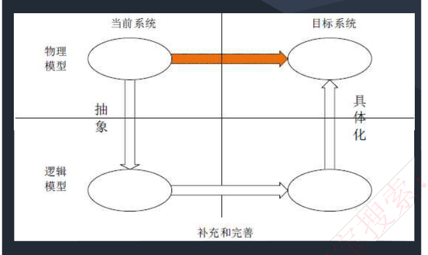
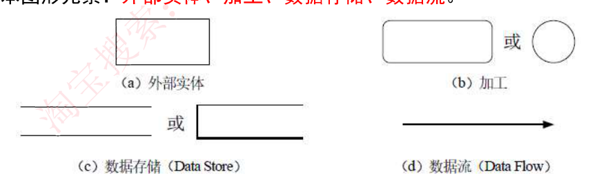
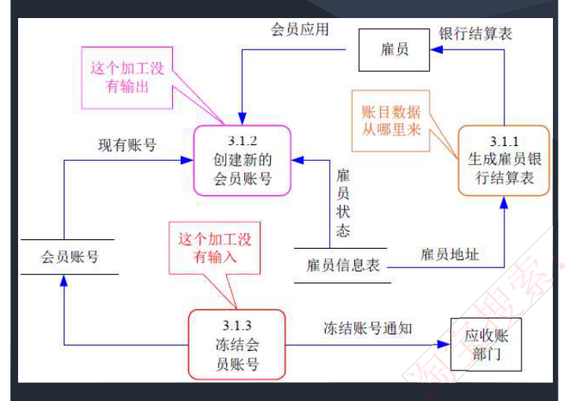
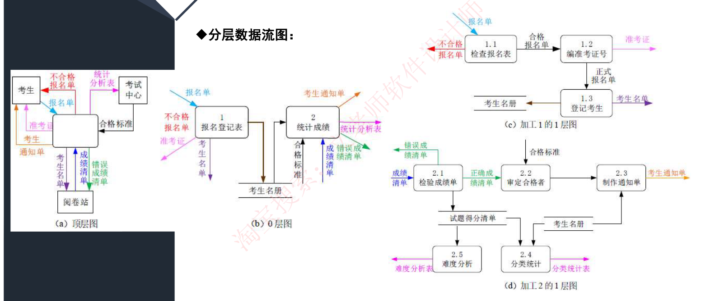
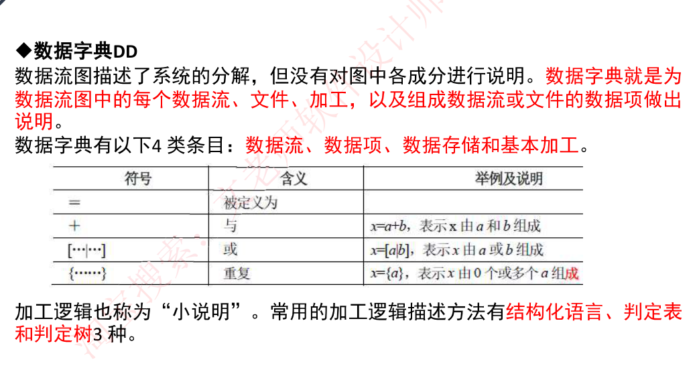

# 13. 结构化开发方法

> 来源：`外部资源/13.结构化开发方法.pdf`（10 页 / 20 张幻灯片，文老师软考教育）
> 逐页看图人工转录。`> [图]` 表示原件为图示。
> **说明**：本章是下午题 1（数据流图 DFD）的直接对应章节，务必重点掌握。

---

## 封面 · 本章目录

系统分析与设计概述 / 结构化开发方法 / 结构化设计方法 / WebApp 分析与设计

---

## 1. 系统分析与设计概述

### 1-1 系统分析的逻辑

◆ 系统分析过程一般按如图所示的逻辑进行：
（1）认识、理解当前的现实环境，**获得当前系统的"物理模型"**。
（2）从当前系统的"物理模型"**抽象出当前系统的"逻辑模型"**。
（3）对当前系统的"逻辑模型"进行分析和优化，**建立目标系统的"逻辑模型"**。
（4）对目标系统的逻辑模型具体化（物理化），**建立目标系统的物理模型**。

◆ **系统开发的目的是把现有系统的物理模型转化为目标系统的物理模型**，即图中所描述的路径，而**系统分析阶段的结果是得到目标系统的逻辑模型**。逻辑模型反映了系统的功能和性质，而物理模型反映的是系统的某一种具体实现方案。

> [图] 四象限：当前系统物理模型 →（抽象）→ 当前系统逻辑模型 →（补充和完善）→ 目标系统逻辑模型 →（具体化）→ 目标系统物理模型

### 1-2 内聚与耦合

◆ **系统设计基本原理**：抽象、模块化、信息隐蔽、模块独立。
衡量模块独立程度的标准有两个：**耦合性和内聚性**。

**内聚程度从低到高**如下表所示：

| 内聚分类 | 定义 | 记忆关键字 |
|---|---|---|
| **偶然内聚** | 一个模块内的各处理元素之间没有任何联系。 | 无直接关系 |
| **逻辑内聚** | 模块内执行若干个逻辑上相似的功能，通过参数确定该模块完成哪一个功能。 | 逻辑相似、参数决定 |
| **时间内聚** | 把需要同时执行的动作组合在一起形成的模块。 | 同时执行 |
| **过程内聚** | 一个模块完成多个任务，这些任务必须按指定的过程执行。 | 指定的过程顺序 |
| **通信内聚** | 模块内的所有处理元素都在同一个数据结构上操作，或者各处理使用相同的输入数据或者产生相同的输出数据。 | 相同数据结构、相同输入输出 |
| **顺序内聚** | 一个模块中的各个处理元素都密切相关于同一功能且必须顺序执行，前一个功能元素的输出就是下一个功能元素的输入。 | 顺序执行、输入为输出 |
| **功能内聚** | 最强的内聚，模块内的所有元素共同作用完成一个功能，缺一不可。 | 共同作用、缺一不可 |

**耦合程度从低到高**如下表所示：

| 耦合分类 | 定义 | 记忆关键字 |
|---|---|---|
| **无直接耦合** | 两个模块之间没有直接的关系，它们分别从属于不同模块的控制与调用，不传递任何信息。 | 无直接关系 |
| **数据耦合** | 两个模块之间有调用关系，传递的是简单的数据值，相当于高级语言中的值传递。 | 传递数据值调用 |
| **标记耦合** | 两个模块之间传递的是数据结构。 | 传递数据结构 |
| **控制耦合** | 一个模块调用另一个模块时，传递的是控制变量，被调用模块通过该控制变量的值有选择的执行模块内的某一功能。 | 控制变量、选择执行某一功能 |
| **外部耦合** | 模块间通过软件之外的环境联合（如 I/O 将模块耦合到特定的设备、格式、通信协议上）时。 | 软件外部环境 |
| **公共耦合** | 通过一个公共数据环境相互作用的那些模块的耦合。 | 公共数据结构 |
| **内容耦合** | 当一个模块直接使用另一个模块的内部数据，或通过非正常入口转入另一个模块内部时。 | 模块内部关联 |

### 1-3 子系统划分与结构设计

◆ **子系统划分的原则**：
（1）子系统要具有相对独立性。
（2）子系统之间数据的依赖性尽量小。
（3）子系统划分的结果应使数据冗余较小。
（4）子系统的设置应考虑今后管理发展的需要。
（5）子系统的划分应便于系统分阶段实现。
（6）子系统的划分应考虑到各类资源的充分利用。

◆ **子系统结构设计**的任务是确定划分后的子系统模块结构，并**画出模块结构图**。在这个过程中必须考虑以下几个问题。
（1）每个子系统如何划分成多个模块。
（2）如何确定子系统之间、模块之间传送的数据及其调用关系。
（3）如何评价并改进模块结构的质量。
（4）如何从数据流图导出模块结构图。

◆ **系统总体结构设计**是要根据系统分析的要求和组织的实际情况**对新系统的总体结构形式和可利用的资源进行大致设计**，这是一种宏观、总体上的设计和规划。

◆ **系统结构设计原则**：
（1）分解-协调原则。
（2）自顶向下的原则。
（3）信息隐蔽、抽象的原则。
（4）一致性原则。
（5）明确性原则。
（6）模块之间的耦合尽可能小，模块的内聚度尽可能高。
（7）模块的扇入系数和扇出系数要合理。
（8）模块的规模适当。

◆ **系统模块结构设计**
模块是组成系统的基本单位，它的特点是可以**组合、分解和更换**。系统中的**任何一个处理功能都可以看成是一个模块**。根据功能具体化程度的不同，模块可以分为**逻辑模块和物理模块**。
一个模块应具备以下 **4 个要素**：
（1）输入和输出。
（2）处理功能。指模块把输入转换成输出所做的工作。
（3）内部数据。指仅供该模块本身引用的数据。
（4）程序代码。指用来实现模块功能的程序。
前两个要素是**模块外部特性**，反映了模块的外貌。后两个要素是模块的**内部特性**。

◆ **模块结构图**为了保证系统设计工作的顺利进行，结构设计应遵循以下原则。
（1）所划分的模块其内部的凝聚性要强，模块之间的联系要少，即模块具有较强的独立性。
（2）模块之间的连接只能存在上下级之间的调用关系，不能有同级之间的横向联系。
（3）整个系统呈树状结构，不允许网状结构或交叉调用关系出现。
（4）所有模块（包括后继 IPO 图）都必须严格地分类编码并建立归档文件。
**模块结构图主要关心的是模块的外部属性**，即上下级模块、同级模块之间的数据传递和调用关系，并不关心模块的内部。

### 【考试真题】

**1.** 某模块中各个处理元素都密切相关于同一功能且必须顺序执行，前一处理元素的输出就是下一处理元素的输入，则该模块的内聚类型为（ ）内聚
A、过程　B、时间　C、顺序　D、逻辑
**答案：C**

**2.** 已知模块 A 给模块 B 传递数据结构 X，则这两个模块的耦合类型为（ ）。
A. 数据耦合　B. 公共耦合　C. 外部耦合　D. 标记耦合
**答案：D**
**解析**：特别说明是数据结构，不是数据，数据结构是标记耦合。

**3.** 以下关于软件设计原则的叙述中，不正确的是（ ）
A、系统需要划分多个模块，模块的规模越小越好
B、考虑信息隐蔽，模块内部的数据不能让其他模块直接访问模块独立性要好
C、尽可能高内聚和低耦合
D、采用过程抽象和数据抽象设计
**答案：A**

**4.** 在进行子系统结构设计时，需要确定划分后的子系统模块结构，并画出模块结构图。该过程不需要考虑()。
A. 每个子系统如何划分成多个模块
B. 每个子系统采用何种数据结构和核心算法
C. 如何确定子系统之间、模块之间传送的数据及其调用关系
D. 如何评价并改进模块结构的质量
**答案：B**

---

## 2. 结构化开发方法

### 2-1 结构化分析

◆ **结构化分析与设计方法是一种面向数据流的传统软件开发方法**，它以数据流为中心构建软件的分析模型和设计模型。结构化分析（Structured Analysis，SA）、结构化设计（Structured Design，SD）和结构化程序设计（Structured Programming Design，SPD）构成了完整的结构化方法。

◆ 结构化方法的分析结果由以下几部分组成：**一套分层的数据流图、一本数据词典、一组小说明（也称加工逻辑说明）、补充材料**。

### 2-2 数据流图 DFD

◆ **数据流图 DFD 基本图形元素**：**外部实体、加工、数据存储、数据流**。

> [图] (a) 外部实体（方框）　(b) 加工（圆角矩形 或 圆）　(c) 数据存储（Data Store，双横线）　(d) 数据流（Data Flow，箭头）

**1) 数据流**：由一组固定成分的数据组成，表示数据的流向。在 DFD 中，**数据流的流向必须经过加工**。

**2) 加工**：描述了输入数据流到输出数据流之间的变换，数据流图中**常见的三种错误**如图所示：
- 加工 **有输入但是没有输出，称之为"黑洞"**。
- 加工 **有输出但是没有输入，称之为"奇迹"**。
- 加工中**输入不足以产生输出，我们称之为"灰洞"**。

**3) 数据存储**：用来存储数据。

**4) 外部实体（外部主体）**：是指存在于**软件系统之外的人员或组织**，它指出系统所需数据的**发源地（源）**和系统所产生的数据的**归宿地（宿）**。

> [图] 一张"会员应用"DFD 示例，标注了"这个加工没有输出"（3.1.2 创建新的会员账号）与"这个加工没有输入"（3.1.3 冻结会员账号）两处错误；涉及外部实体 雇员、银行结算表、应收账部门，数据存储 雇员信息表、雇员地址

### 2-3 分层数据流图

> [图] (a) 顶层图（考生、考试分析中心、阅卷站 与 系统的交互）；(b) 0 层图（1 报名登记表 → 2 统计成绩，含考生名册、合格标准等数据流）；(c) 加工 1 的 1 层图（1.1 检查报名表 → 1.2 编准考证号 → 1.3 登记考生）；(d) 加工 2 的 1 层图（2.1 检验成绩单 → 2.2 审定合格者 → 2.3 制作通知单；2.4 分类统计）

### 2-4 数据字典 DD

◆ **数据字典 DD**
数据流图描述了系统的分解，但没有对图中各成分进行说明。**数据字典就是为数据流图中的每个数据流、文件、加工，以及组成数据流或文件的数据项做出说明**。

数据字典有以下 **4 类条目：数据流、数据项、数据存储和基本加工**。

| 符号 | 含义 | 举例及说明 |
|---|---|---|
| **=** | 被定义为 | |
| **+** | 与 | x=a+b，表示 x 由 a 和 b 组成 |
| **[…\|…]** | 或 | x=[a\|b]，表示 x 由 a 或 b 组成 |
| **{……}** | 重复 | x={a}，表示 x 由 0 个或多个 a 组成 |

**加工逻辑**也称为"**小说明**"。常用的加工逻辑描述方法有**结构化语言、判定表和判定树** 3 种。

---

## 3. 结构化设计方法

◆ **结构化设计（Structured Design，SD）方法是一种面向数据流的设计方法**，它可以与 SA 方法衔接。结构化设计方法的基本思想是**将系统设计成由相对独立、功能单一的模块组成的结构**。

◆ 结构化设计方法中用**结构图（Structure Chart）来描述软件系统的体系结构**，指出一个软件系统由哪些模块组成，以及模块之间的调用关系。模块结构图是结构化设计的工具，由**模块、调用、数据、控制和转接**五种基本符号组成。

◆ **结构化设计主要包括**
① **体系结构设计**：定义软件的主要结构元素及其关系。
② **数据设计**：基于实体联系图确定软件涉及的文件系统的结构及数据库的表结构。
③ **接口设计**：描述用户界面，软件和其他硬件设备、其他软件系统及使用人员的外部接口，以及各种构件之间的内部接口。
④ **过程设计**：确定软件各个组成部分内的算法及内部数据结构，并选定某种过程的表达形式来描述各种算法。

### 【考试真题】

**1.** 在结构化分析中，用数据流图描述（ ）。当采用数据流图对一个图书馆管理系统进行分析时，（ ）是一个外部实体。
A. 数据对象之间的关系，用于对数据建模
B. 数据在系统中如何被传送或变换，以及如何对数据流进行变换的功能或子功能，用于对功能建模
C. 系统对外部事件如何响应，如何动作，用于对行为建模
D. 数据流图中的各个组成部分
A. 读者　B. 图书　C. 借书证　D. 借阅
**答案：B　A**

**2.** 在采用结构化开发方法进行软件开发时，设计阶段接口设计主要依据需求分析阶段的()。接口设计的任务主要是()。
A. 数据流图　B. E-R 图　C. 状态-迁移图　D. 加工规格说明
A. 定义软件的主要结构元素及其之间的关系
B. 确定软件涉及的文件系统的结构及数据库的表结构
C. 描述软件与外部环境之间的交互关系，软件内模块之间的调用关系
D. 确定软件各个模块内部的算法和数据结构
**答案：A　C**

---

## 4. WebApp 分析与设计

### 4-1 WebApp 的特性

◆ **WebApp 是基于 web 的系统和应用**。大多数 WebApp 采用**敏捷开发过程模型**进行开发。

◆ **WebApp 的特性**：
（1）**网络密集性**。WebApp 驻留在网络上，服务于不同客户全体的需求。网络提供开放的访问和通信（如 Internet）或者受限的访问和通信（如企业内联网）。
（2）**并发性**。大量用户可能同时访问 WebApp。很多情况下最终用户的使用模式存在很大的差异。
（3）**无法预知的负载量**。WebApp 的用户数量每天都可能有数量级的变化。例如，周一显示有 100 个用户使用系统，周四就有可能会有 10000 个用户。
（4）**性能**。如果一位 WebApp 用户必须等待很长时间（访问、服务器端处理、客户端格式化显示），该用户就可能转向其他地方。
（5）**可用性**。尽管期望百分之百的可用性是不切实际的，但是对于热门的 WebApp，用户通常要求能够 **24/7/365（全天候）**访问。
（6）**数据驱动**。许多 WebApp 的主要功能是使用超媒体向最终用户提供文本、图片、音频及视频内容。除此之外，WebApp 还常被用来访问那些存储在 Web 应用环境之外的数据库中的信息。

### 4-2 WebApp 五种需求模型

**1、内容模型**：给出由 WebApp 提供的全部系列内容，包括文字、图形、图像、音频和视频。包含结构元素，为 WebApp 的内容需求提供了一个重要的视图。这些结构元素包含内容对象和所有分析类，在用户与 WebApp 交互时生成并操作用户可见的实体。
**2、交互模型**：描述了用户与 WebApp 采用了哪种交互方式。由一种或多种元素构成，包括用例、顺序图、状态图、用户界面原型等。
**3、功能模型**：许多 WebApp 提供大量的计算和操作功能，这些功能与内容直接相关（既能使用又能生成内容，如统计报表）。这些功能常常以用户的交互活动为主要目标。功能模型定义了将用于 WebApp 内容并描述其他处理功能的操作，这些处理功能不依赖于内容却是最终用户所必需的。
**4、导航模型**：为 WebApp 定义所有导航策略。考虑了每一类用户如何从一个 WebApp 元素（如内容对象）导航到另一个元素。
**5、配置模型**：描述 WebApp 所在的环境和基础设施。在必需考虑复杂配置体系结构的情况下，可以使用 **UML 部署图**。

### 4-3 WebApp 设计

**1、架构设计**：描述将以什么方式来管理用户交互、操作内部处理任务、实现导航及展示内容。**MVC（模型-视图-控制器）结构是 WebApp 基础结构模型之一**，将 WebApp 功能及信息内容分离。

**2、构件设计**：
- WebApp 构件：定义良好的聚合功能，为最终用户处理内容或提供计算或处理数据；内容和功能的聚合包，提供最终用户所需要的功能。因此，WebApp 构件设计通常包括**内容设计元素和功能设计元素**。
- **构件级内容设计**：关注内容对象，以及包装后展示给最终用户的方式，应该适合创建的 WebApp 特性。
- **构件级功能设计**：将 WebApp 作为一系列构件加以交付，这些构件与信息体系结构并行开发，以确保一致性。

**3、内容设计**：着重于内容对象的表现和导航的组织，通常采用**线性结构、网格结构、层次结构、网络结构四种结构**及其组合。

**4、导航设计**：定义导航路径，使用户可以访问 WebApp 的内容和功能。
