# 14. 面向对象技术

> 来源：`外部资源/14.面向对象技术.pdf`（18 页 / 35 张幻灯片，文老师软考教育）
> 逐页看图人工转录。图例为对应幻灯片原图。

---

## 封面 · 本章目录

面向对象开发 / 统一建模语言 UML / 设计模式

---

## 1. 面向对象开发

### 1-1 基本概念

（1）**对象**：由**数据及其操作所构成的封装体**，是系统中用来**描述客观事物的一个实体**，是构成系统的一个基本单位。一个对象通常可以由**对象名、属性和方法** 3 个部分组成。

（2）**类**：现实世界中**实体的形式化描述**，类将该实体的属性（数据）和操作（函数）封装在一起。**对象是类的实例，类是对象的模板。**

◆ 类可以分为三种：**实体类、接口类（边界类）和控制类**。实体类的对象表示**现实世界中真实的实体**，如人、物等。接口类（边界类）的对象**为用户提供一种与系统合作交互的方式**，分为人和系统两大类，其中人的接口可以是显示屏、窗口、Web 窗体、对话框、菜单、列表框、其他显示控制、条形码、二维码或者用户与系统交互的其他方法。系统接口涉及到把数据发送到其他系统，或者从其他系统接收数据。控制类的对象用来**控制活动流，充当协调者**。

（3）**抽象**：通过**特定的实例抽取共同特征以后形成概念的过程**。它强调主要特征，**忽略次要特征**。一个对象是现实世界中一个实体的抽象，一个类是一组对象的抽象，抽象是一种单一化的描述，它强调给出与应用相关的特性，抛弃不相关的特性。

（4）**封装**：是一种**信息隐蔽技术**，将相关的概念组成一个单元模块，并通过一个名称来引用。面向对象封装是将数据和基于数据的操作封装成一个整体对象，对数据的访问或修改只能通过对象对外提供的接口进行。

（5）**继承**：表示**类之间的层次关系（父类与子类）**，这种关系使得某类对象可以继承另外一类对象的特征，又可分为单继承和多继承。

（6）**多态**：**不同的对象收到同一个消息时产生完全不同的结果**。包括**参数多态**（不同类型参数多种结构类型）、**包含多态**（父子类关系）、**过载多态**（类似于重载，一个名字不同含义）、**强制多态**（强制类型转换）四种类型。多态由继承机制支持，将通用消息放在抽象层，具体不同的功能实现放在低层。

（7）**接口**：描述对操作规范的说明，其**只说明操作应该做什么**，并没有定义操作如何做。

（8）**消息**：体现**对象间的交互**，通过它向目标对象发送操作请求。

（9）**覆盖**：子类在原有父类接口的基础上，用**适合于自己要求的实现去置换父类中的相应实现**。即在子类中重定义一个与父类同名同参的方法。

（10）**函数重载**：与覆盖要区分开，函数重载与子类父类无关，且函数是**同名不同参数**。

（11）**绑定**是一个把**过程调用和响应调用所需要执行的代码加以结合**的过程。在一般的程序设计语言中，绑定是在**编译时进行的，叫作静态绑定**。动态绑定则是**在运行时进行的**，因此，一个给定的过程调用和代码的结合直到调用发生时才进行。

### 【考试真题】

**1.** 一个类中可以拥有多个名称相同而参数表（参数类型或参数个数或参数类型顺序）不同的方法，称为（ ）。
A. 方法标记　B. 方法调用　C. 方法重载　D. 方法覆盖
**答案：C**

**2.** 在某销售系统中，客户采用扫描二维码进行支付。若采用面向对象方法开发该销售系统，则客户类属于（ ）类，二维码类属于（ ）类。
A. 接口　B. 实体　C. 控制　D. 状态
**答案：B A**

### 1-2 面向对象的分析（OOA）

◆ **面向对象的分析**：是为了**确定问题域，理解问题**。包含五个活动：**认定对象、组织对象、描述对象间的相互作用、确定对象的操作、定义对象的内部信息**。

◆ 面向对象需求建模：

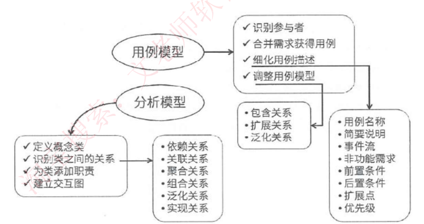

### 1-3 面向对象的设计（OOD）

◆ **面向对象的设计**：是**设计分析模型和实现相应源代码**，设计问题域的解决方案，与技术相关。OOD 同样应遵循**抽象、信息隐蔽、功能独立、模块化**等设计准则。

◆ 面向对象的**分析模型**主要由**顶层架构图、用例与用例图、领域概念模型**构成；**设计模型**则包含以**包图表示的软件体系结构图、以交互图表示的用例实现图、完整精确的类图、针对复杂对象的状态图和用以描述流程化处理过程的活动图**等。

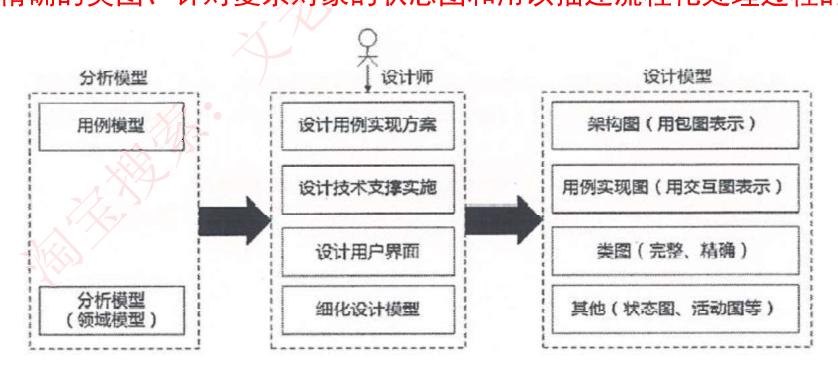

### 1-4 面向对象的设计原则（SOLID 等）

（1）**单一责任原则**。就一个类而言，应该**仅有一个引起它变化的原因**。即，当需要修改某个类的时候原因有且只有一个，让一个类只做一种类型责任。

（2）**开放—封闭原则**。软件实体（类、模块、函数等）应该是**可以扩展的，即开放的；但是不可修改的，即封闭的**。

（3）**里氏替换原则**。**子类必须能够替换掉他们的基类型**。即，在任何父类可以出现的地方，都可以用子类的实例来赋值给父类型的引用。

（4）**依赖倒置原则**。**抽象不应该依赖于细节，细节应该依赖于抽象**。即，高层模块不应该依赖于低层模块，二者都应该依赖于抽象。

（5）**接口分离原则**。不应该强迫客户依赖于它们不用的方法。接口属于客户，不属于它所在的类层次结构。即：**依赖于抽象，不要依赖于具体**，同时在抽象级别不应该有对于细节的依赖。这样做的好处就在于可以最大限度地应对可能的变化。

### 1-5 面向对象的测试

◆ 一般来说，对面向对象软件的测试可分为下列 **4 个层次**进行。
（1）**算法层**。测试**类中定义的每个方法**，基本上相当于传统软件测试中的单元测试。
（2）**类层**。测试封装在**同一个类中的所有方法与属性之间的相互作用**。在面向对象软件中类是基本模块，因此可以认为这是面向对象测试中所特有的模块测试。
（3）**模板层**。测试**一组协同工作的类之间的相互作用**，大体上相当于传统软件测试中的集成测试，但是也有面向对象软件的特点（例如，对象之间通过发送消息相互作用）。
（4）**系统层**。把**各个子系统组装成完整的面向对象软件系统**，在组装过程中同时进行测试。

### 【考试真题】

**1.** 面向对象的分析模型主要由顶层架构图、用例与用例图和（ ）构成；设计模型则包含以（ ）表示的软件体系结构图、以交互图表示的用例实现图、完整精确的类图、描述复杂对象的（ ）和用以描述流程化处理过程的活动图等。
A. 数据流模型　B. 领域概念模型　C. 功能分解图　D. 功能需求模型
A. 模型视图控制器　B. 组件图　C. 包图　D.2 层、3 层或 N 层
A. 序列图　B. 协作图　C. 流程图　D. 状态图
**答案：B　C　D**

**2.** 在面向对象设计的原则中，（ ）原则是指抽象不应该依赖于细节，细节应该依赖于抽象，即应针对接口编程，而不是针对实现编程。
A. 开闭　B. 里氏替换　C. 最少知识　D. 依赖倒置
**答案：D**

---

## 2. 统一建模语言 UML

### 2-1 UML 概述与构造块

◆ **UML（统一建模语言）**：是一种**可视化的建模语言，而非程序设计语言**，支持从需求分析开始的软件开发的全过程。

◆ 从总体上来看，UML 的结构包括**构造块、规则和公共机制**三个部分。
（1）**构造块**。UML 有三种基本的构造块，分别是**事物（thing）、关系（relationship）和图（diagram）**。事物是 UML 的重要组成部分，关系把事物紧密联系在一起，图是多个相互关联的事物的集合。
（2）**公共机制**。公共机制是指达到特定目标的公共 UML 方法。
（3）**规则**。规则是构造块如何放在一起的规定。

### 2-2 UML 中的事物

◆ **结构事物**：模型的**静态部分**，如类、接口、用例、构件等。
◆ **行为事物**：模型的**动态部分**，如交互、活动、状态机。
◆ **分组事物**：模型的**组织部分**，如包。
◆ **注释事物**：模型的**解释部分**，依附于一个元素或一组元素之上对其进行约束或解释的简单符号。

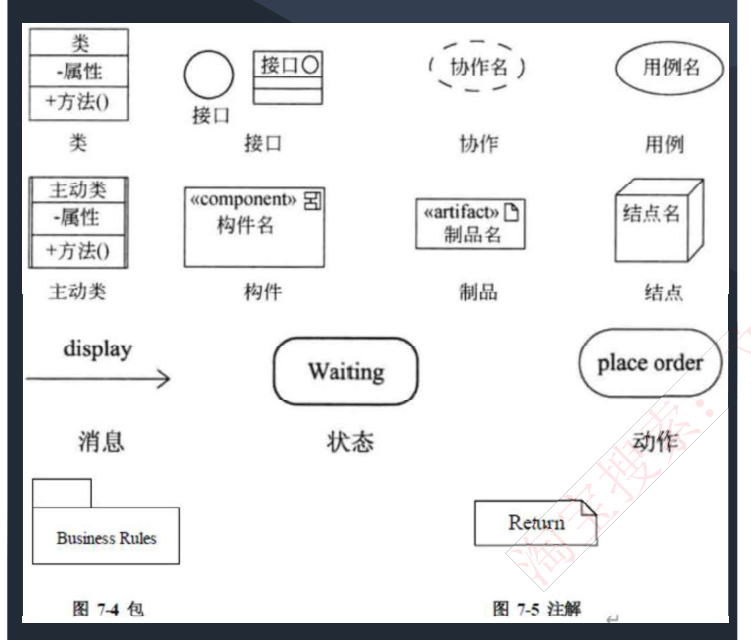

### 2-3 UML 中的关系

◆ **依赖**：**一个事物的语义依赖于另一个事物的语义的变化而变化**。
◆ **关联**：是一种结构关系，描述了一组链，链是对象之间的连接。分为**组合和聚合**，都是**部分和整体的关系**，其中**组合事物之间关系更强**。两个类之间的关联，实际上是两个类所扮演角色的关联，因此，两个类之间可以有多个由不同角色标识的关联。
◆ **泛化**：**一般/特殊的关系**，子类和父类之间的关系。
◆ **实现**：**一个类元指定了另一个类元保证执行的契约**。

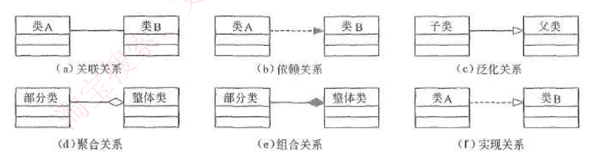

### 2-4 UML 图的分类

⚠️ 备考注记（2026-09-09 讲义 25 写手+审核复核）：①**本节正文说「总分类如下：」后面挂的 `fig_d14_s014.png` 并不是分类表**——那张图实际是紧随其后**两道【考试真题】的截图**（上半汽车题、下半 Shop/Magazine/Page 带类图）。真正的 UML 图分类表**既没有转录、也没有对应扫描图**。②本节【考试真题】1（汽车与哪一项是组成关系）**印的答案 B 有误**：信管网两处独立页面（单题页与 2019 上全卷页）都给 **D**（汽车和音乐系统）——四个选项里只有音乐系统是可拆的独立件，符合「整体没了部分还在不在」的判据。③本节【考试真题】2 **漏抄了一行选项**：三个空只印了两行，核 `s014` 下半可见原件确有三组。

◆ UML 2.0 图，书上是 13 种，有的说法还包含制品图，一共 14 种，了解即可，总分类如下：

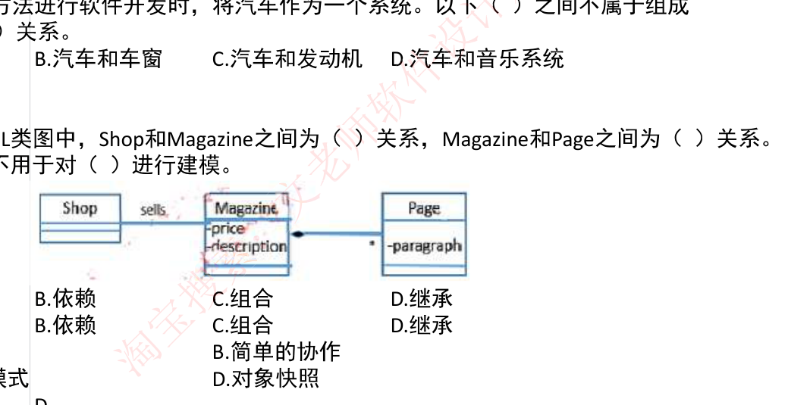

### 【考试真题】

**1.** 采用面向对象方法进行软件开发时，将汽车作为一个系统。以下（ ）之间不属于组成（Composition）关系。
A. 汽车和座位　B. 汽车和车窗　C. 汽车和发动机　D. 汽车和音乐系统
**答案：B**

**2.** 如图所示的 UML 类图中，Shop 和 Magazine 之间为（ ）关系，Magazine 和 Page 之间为（ ）关系。UML 类图通常不用于对（ ）进行建模。
A. 关联　B. 依赖　C. 组合　D. 继承
A. 系统的词汇　B. 简单的协作　C. 逻辑数据库模式　D. 对象快照
**答案：A C　D**

### 2-5 类图

◆ **类图**：静态图，为系统的**静态设计视图**，展现一组**对象、接口、协作和它们之间的关系**。

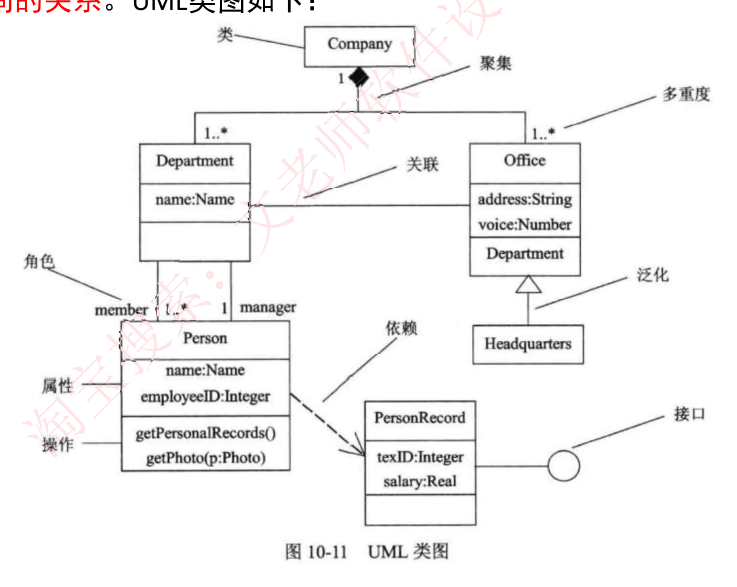

### 2-6 对象图

◆ **对象图**：静态图，展现**某一时刻一组对象及它们之间的关系**，为类图的某一快照。在没有类图的前提下，对象图就是静态设计视图。

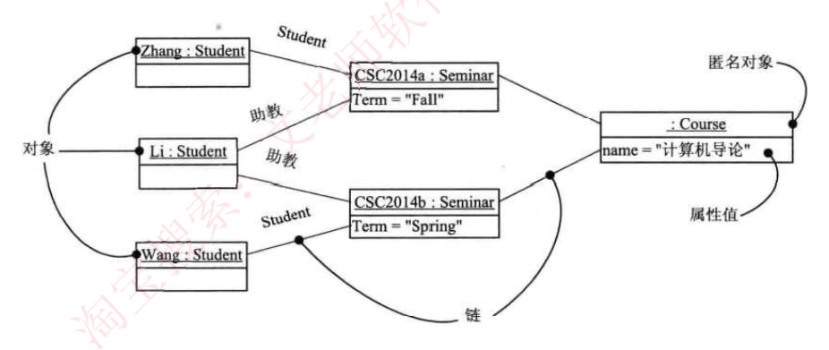

### 2-7 用例图

◆ **用例图**：静态图，展现了一组**用例、参与者以及它们之间的关系**。用例图中的参与者是人、硬件或其他系统可以扮演的角色；用例是参与者完成的一系列操作，用例之间的关系有**扩展、包含、泛化**。

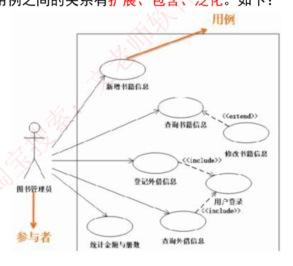

### 2-8 序列图（顺序图）

⚠️ 备考注记（2026-09-09 讲义 26 写手+审核复核）：①「返回消息（由**从右到左**的虚线箭头表示）」——「从右到左」只是本节配图的偶然属性（图上调用方画在最左），不是规则；返回消息的规矩是**回到调用方**，调用方画在右边时就是从左往右。**认虚线，不认方向。**②「异步消息……由**空心箭头**表示」——扫描图上实为**未填充的线状箭头**（`>` 形），不是类图泛化那种空心三角，别混。③**本节与 2-9 完全没有「组合片段」**：对全部 15 份转录本逐词统计，`组合片段`/`loop`/`opt`/`par`/`激活期`/`守卫` 命中数全为 0，而 **2023 上半年 41–42 直接考 loop 片段的执行序列**，讲义 26 已按教材第 5 版补齐。④图上「对象/对象生命线/调用消息/返回消息/异步消息/对象销毁」六个标注**正文一字未转录**；生命线上那根细长竖条（**激活期**）正文与图注都没给过名字。

◆ **序列图**：即顺序图，动态图，是场景的图形化表示，描述了**以时间顺序组织的对象之间的交互活动**。有**同步消息**（进行阻塞调用，调用者中止执行，等待控制权返回，需要等待返回消息，用实心三角箭头表示）、**异步消息**（发出消息后继续执行，不引起调用者阻塞，也不等待返回消息，由空心箭头表示）、**返回消息**（由从右到左的虚线箭头表示）三种。

### 2-9 通信图（协作图）

⚠️ 备考注记（2026-09-09 讲义 26 写手+审核复核）：**本节正文去掉空白后只有 35 个字符**（去 markdown 标记后 26 个纯文字），图上「链/对象/消息/序号」四个标注一字未转录——**而下午题 3 明确要考通信图补对象名和消息名**。另：本节配图与 2-8 序列图配图是**同一场景的两种画法，但印刷对不齐**——序列图作 `setAction (a,d,o)`、`setValues (3,4)`，通信图作 `setActions (a,d,o)`、`setValues (d,3.4)`（注意是**句点**不是逗号，1400% 放大可辨）；序列图的返回消息印作 `commited`（少一个 t）。

◆ **通信图**：动态图，即**协作图，强调参加交互的对象的组织**。

### 2-10 状态图

⚠️ 备考注记（2026-09-09 讲义 27 写手+审核复核）：**本节正文只有 196 个字符**，知识点大量只在配图里。全章零命中的有：**泳道／swimlane、对象流、初态／终态、entry／exit／do、守卫条件**（本资料用「监护条件」）、时间事件、同步线——这几块讲义 27 已按教材第 5 版补。另：**配图 `fig_d14_s021.png` 上并没有 entry/do/exit**，状态框里只有状态名；图上把 `Transmitting` 印成 `Transmiting`（少一个 t），属原件讹字。

◆ **状态图**：动态图，展现了一个状态机，描述**单个对象在多个用例中的行为**，包括简单状态和组合状态。转换可以通过**事件触发器触发**，事件触发后相应的**监护条件**会进行检查。状态图中转换和状态是两个独立的概念。图中方框代表状态，箭头上的代表触发事件，实心圆点为起点和终点。

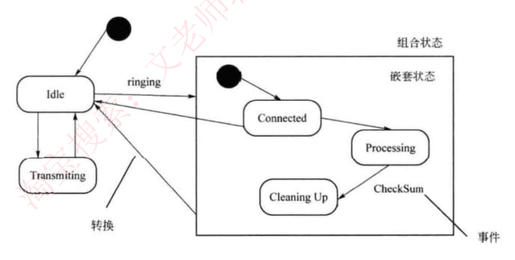

### 2-11 活动图

⚠️ 备考注记（2026-09-09 讲义 27 写手+审核复核）：**本节正文只有 207 个字符**，且**未收泳道与对象流**（全章零命中）——而下午题 3 的活动图补空可能要认泳道，讲义 27 已按教材第 5 版补。分岔／汇合本资料有覆盖（并发分岔、并发汇合、水平粗线）。

◆ **活动图**：动态图，是一种**特殊的状态图**，展现了**在系统内从一个活动到另一个活动的流程**。活动的分岔和汇合线是一条水平粗线。牢记下图中**并发分岔、并发汇合、监护表达式、分支、流**等名词及含义。每个分岔的分支代表了可同时运行的线程数。活动图中能够并行执行的是在一个分岔粗线下的分支上的活动。

### 2-12 构件图（组件图）

⚠️ 备考注记（2026-09-09 讲义 25 审核复核，已用纯 Python 解码 PNG 追踪引线坐标）：**本节配图 `fig_d14_s023.png` 上的「供接口」「需接口」两个中文标注引线指反了**——「供接口」的引线落在**半圆插座**上，「需接口」的引线落在**圆圈**上。按 UML ball-and-socket 约定应为 **圆圈＝供接口、半圆＝需接口**，依赖箭头由需指向供。**认符号不认标签。**

◆ **构件图（组件图）**：静态图，为系统**静态实现视图，展现了一组构件之间的组织和依赖**。

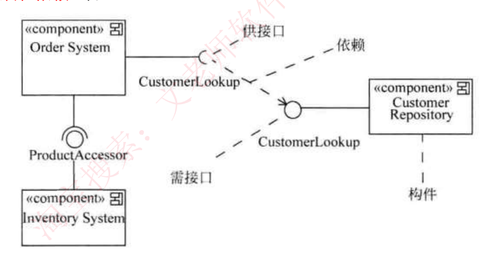

### 2-13 部署图

◆ **部署图**：静态图，为系统**静态部署视图**，部署图**物理模块**的节点分布。它与构件图相关，通常一个结点包含一个或多个构件。其依赖关系类似于包依赖，因此部署组件之间的依赖是单向的类似于包含关系。

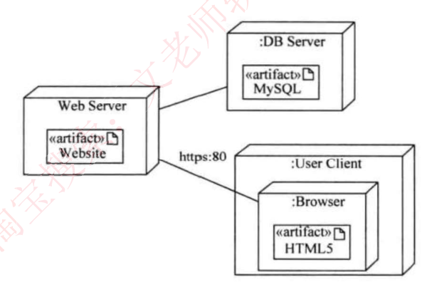

### 2-14 UML 4+1 视图

（1）**逻辑视图**。逻辑视图也称为**设计视图**，它表示了设计模型中在架构方面具有重要意义的部分，即**类、子系统、包和用例实现的子集**。
（2）**进程视图**。进程视图是**可执行线程和进程作为活动类的建模**，它是**逻辑视图的一次执行实例，描述了并发与同步结构**。
（3）**实现视图**。实现视图对组成基于系统的**物理代码的文件和构件**进行建模。
（4）**部署视图**。部署视图把**构件部署到一组物理节点上**，表示软件到硬件的映射和分布结构。
（5）**用例视图**。用例视图是**最基本的需求分析模型**。

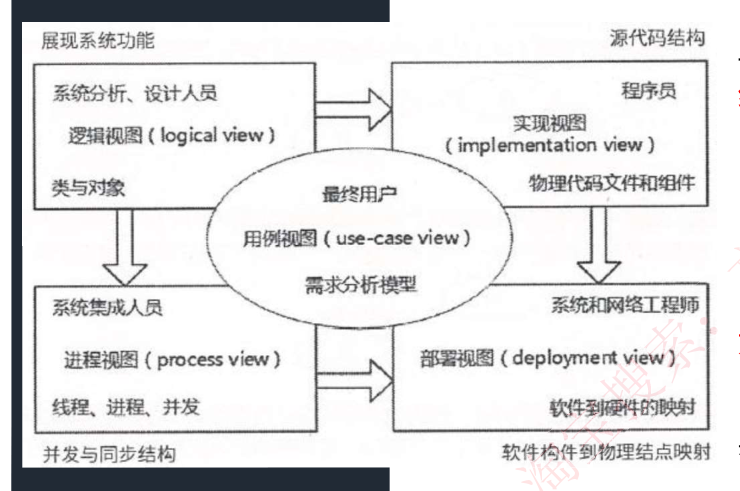

### 【考试真题】

**1.** 在 UML 提供的系统视图中，（ ）是逻辑视图的一次执行实例，描述了并发与同步结构；（ ）是最基本的需求分析模型。
A. 进程视图　B. 实现视图　C. 部署视图　D. 用例视图
**答案：A　D**

**2.** 如下所示的 UML 图是（ ），图中（Ⅰ）表示（ ），（Ⅱ）表示（ ）。
A. 序列图　B. 状态图　C. 通信图　D. 活动图
A. 合并分叉　B. 分支　C. 合并汇合　D. 流
A. 分支条件　B. 监护表达式　C. 动作名　D. 流名称
**答案：D A　B**

**3.** 用例（use case）用来描述系统对事件做出响应时所采取的行动。用例之间是具有相关性的。在一个会员管理系统中，会员注册时可以采用电话和邮件两种方式。用例"会员注册"和"电话注册"、"邮件注册"之间是（ ）关系。
A. 包含（include）　B. 扩展（extend）　C. 泛化（generalize）　D. 依赖（depends on）
**答案：C**

**4.** 以下关于 UML 状态图的叙述中，不正确的是（ ）
A、活动可以在状态内执行，也可以在迁移时执行
B、若事件触发一个没有特定监护条件的迁移，则对象离开当前状态
C、迁移可以包含事件触发器，监护条件和状态
D、事件触发迁移
**答案：B**

⚠️ 备考注记（2026-09-09 讲义 27 写手+审核复核）：**本题印的答案有误，正确应为 C。**题干问的是「**不正确**的是」，而 B（若事件触发一个没有特定监护条件的迁移，则对象离开当前状态）是标准**正确**表述、不可能是答案；C 错在「**一个**状态」——**转换必须连接源、目标两个状态**。希赛题库两个独立页面（tiku/906897、tiku/89868）参考答案均为 C，解析为「转换至少有两个状态」。本资料自己在 2-10 也写着「状态图中转换和状态是两个独立的概念」，可作旁证。

---

## 3. 设计模式

### 3-1 架构模式、设计模式与惯用法

◆ **架构模式**：软件设计中的**高层决策**，例如 C/S 结构就属于架构模式，架构模式反映了开发软件系统过程中所作的基本设计决策。

◆ **设计模式**：每一个设计模式描述了一个在我们周围**不断重复发生的问题，以及该问题的解决方案的核心**。这样，你就能一次又一次地使用该方案而不必做重复劳动。设计模式的核心在于提供了相关问题的解决方案，使得人们可以更加简单方便的复用成功的设计和体系结构。四个基本要素：**模式名称、问题（应该在何时使用模式）、解决方案（设计的内容）、效果（模式应用的效果）**。

◆ **惯用法**：是最低层的模式，关注**软件系统的设计与实现，实现时通过某种特定的程序设计语言**来描述构件与构件之间的关系。每种编程语言都有它自己特定的模式，即语言的惯用法。例如引用—计数就是 C++ 语言中的一种惯用法。

### 3-2 创建型设计模式

| 创建型设计模式 | 定义 | 记忆关键字 |
|---|---|---|
| **Abstract Factory 抽象工厂模式** | 提供一个接口，可以创建一系列相关或相互依赖的对象，而无需指定它们具体工作的类 | 抽象接口 |
| **Builder 构建器模式** | 将一个复杂类的表示与其构造相分离，使得相同的构建过程能够得出不同的表示 | 类和构造分离 |
| **Factory Method 工厂方法模式** | 定义一个创建对象的接口，但由子类决定需要实例化哪一个类。使得子类实例化过程推迟 | 子类决定实例化 |
| **Prototype 原型模式** | 用原型实例指定创建对象的类型，并且通过拷贝这个原型来创建新的对象 | 原型实例，拷贝 |
| **Singleton 单例模式** | 保证一个类只有一个实例，并提供一个访问它的全局访问点 | 唯一实例 |

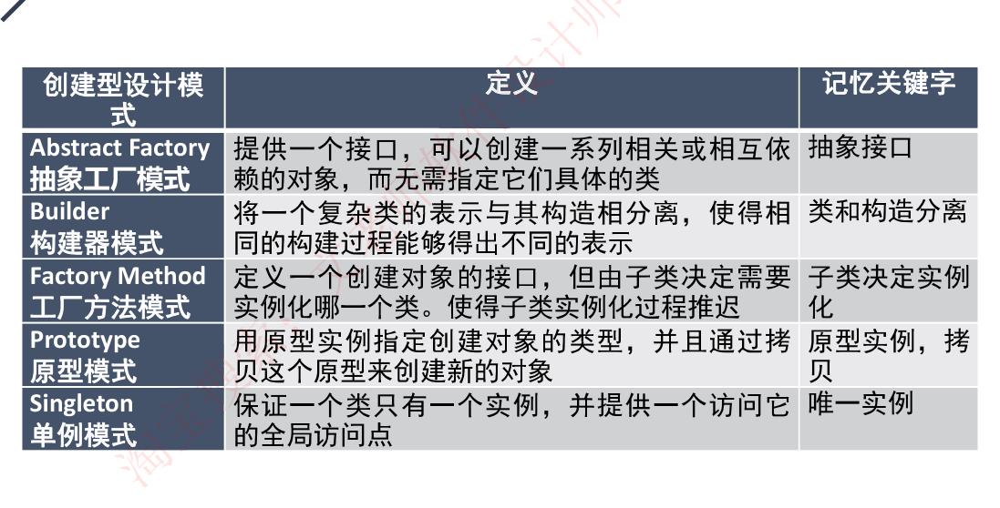

### 3-3 结构型设计模式

| 结构型设计模式 | 定义 | 记忆关键字 |
|---|---|---|
| **Adapter 适配器模式** | 将一个类的接口转换成用户希望得到的另一种接口。它使原本不相容的接口得以协同工作 | 转换，兼容接口 |
| **Bridge 桥接模式** | 将类的抽象部分和它的实现部分分离开来，使它们可以独立地变化 | 抽象和实现分离 |
| **Composite 组合模式** | 将对象组合成树型结构以表示"整体-部分"的层次结构，使得用户对单个对象和组合对象的使用具有一致性 | 整体-部分，树形结构 |
| **Decorator 装饰模式** | 动态的给对象添加一些额外的职责。它提供了用子类扩展功能的一个灵活的替代，比派生一个子类更加灵活 | 附加职责 |
| **Façade 外观模式** | 定义一个高层接口，为子系统中的一组接口提供一个一致的外观，从而简化了该子系统的使用 | 对外统一接口 |
| **Flyweight 享元模式** | 提供支持大量细粒度对象共享的有效方法 | 细粒度，共享 |
| **Proxy 代理模式** | 为其他对象提供一种代理以控制这个对象的访问 | 代理控制 |

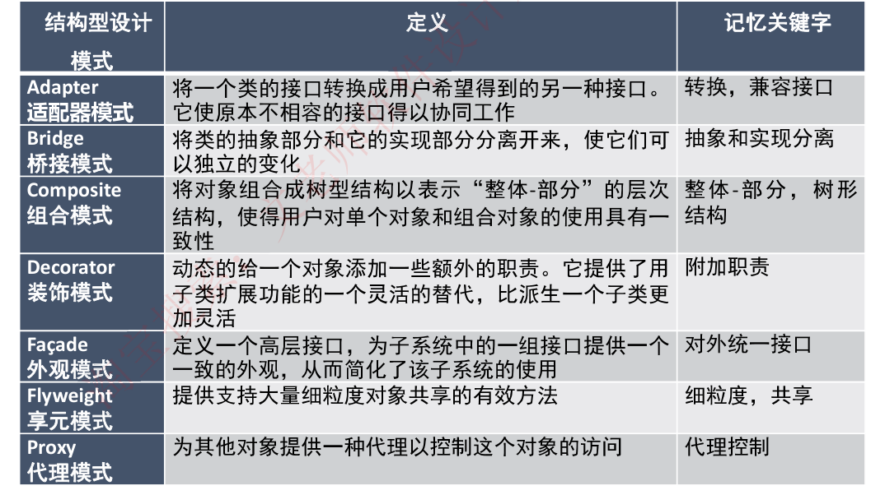

### 3-4 行为型设计模式

| 行为型设计模式 | 定义 | 记忆关键字 |
|---|---|---|
| **Chain of Responsibility 职责链模式** | 通过给多个对象处理请求的机会，减少请求的发送者与接收者之间的耦合。将接收对象链接起来，在链中传递请求，直到有一个对象处理这个请求 | 传递请求、职责、链接 |
| **Command 命令模式** | 将一个请求封装为一个对象，从而可用不同的请求对客户进行参数化，将请求排队或记录请求日志，支持可撤销的操作 | 日志记录、可撤销 |
| **Interpreter 解释器模式** | 给定一种语言，定义它的文法表示，并定义一个解释器，该解释器用来根据文法表示来解释语言中的句子 | 解释器，虚拟机 |
| **Iterator 迭代器模式** | 提供一种方法来顺序访问一个聚合对象中的各个元素而不需要暴露该对象的内部表示 | 顺序访问，不暴露内部 |
| **Mediator 中介者模式** | 用一个中介对象来封装一系列的对象交互。它使各对象不需要显式地相互调用，从而达到低耦合，还可以独立的改变对象间的交互 | 不直接引用 |
| **Memento 备忘录模式** | 在不破坏封装性的前提下，捕获一个对象的内部状态，并在该对象之外保存这个状态，从而可以在以后将该对象恢复到原先保存的状态 | 保存，恢复 |
| **Observer 观察者模式** | 定义对象间的一种一对多的依赖关系，当一个对象的状态发生改变时，所有依赖于它的对象都得到通知并自动更新 | 通知、自动更新 |
| **State 状态模式** | 允许一个对象在其内部状态改变时改变它的行为 | 状态变成类 |
| **Strategy 策略模式** | 定义一系列算法，把它们一个个封装起来，并且使它们之间可相互替换，从而让算法可以独立于使用它的用户而变化 | 算法替换 |
| **Template Method 模板方法模式** | 定义一个操作中的算法骨架，而将一些步骤延迟到子类中，使得子类可以不改变一个算法的结构即可重新定义算法的某些特定步骤 | |
| **Visitor 访问者模式** | 表示一个作用于某对象结构中的各元素的操作，使得在不改变各元素的类的前提下定义作用于这些元素的新操作 | 数据和操作分离 |

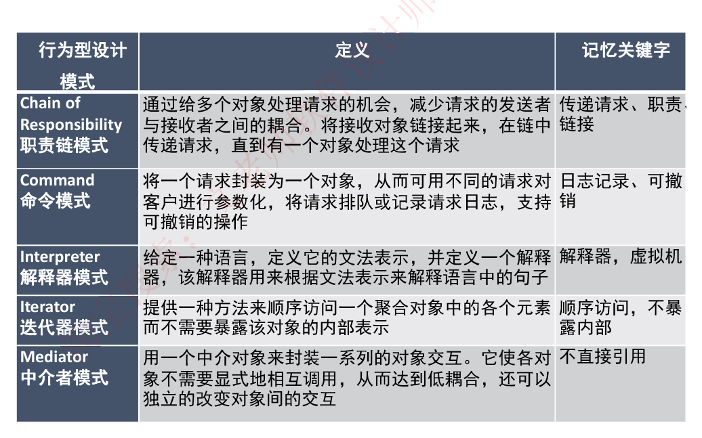

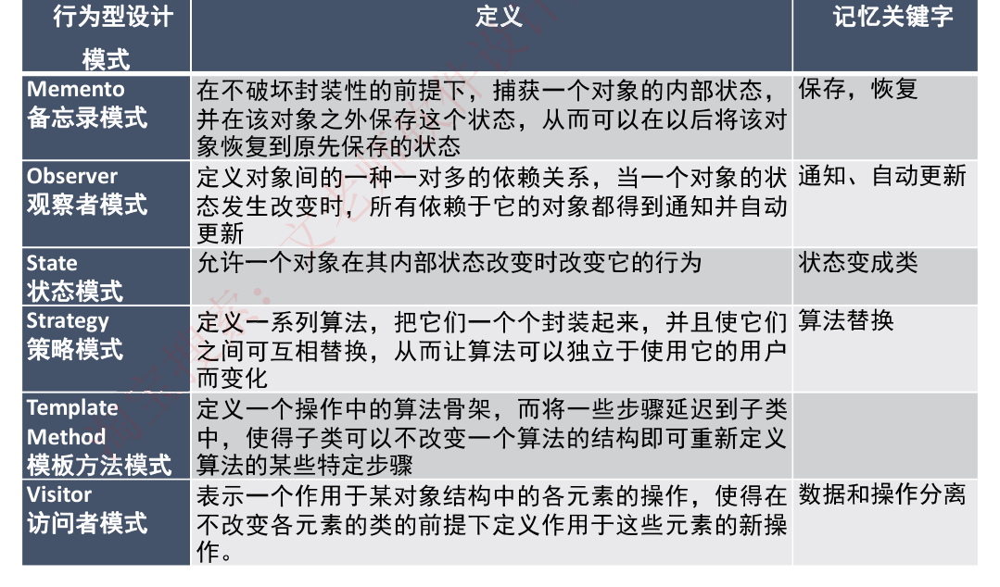

### 【考试真题】

**1.** 设计模式描述了一个出现在特定设计语境中的设计再现问题，并为它的解决方案提供了一个经过充分验证的通用方案，不同的设计模式关注解决不同的问题。例如，抽象工厂模式提供一个接口，可以创建一系列相关或相互依赖的对象，而无需指定它们具体的类，它是一种（54）模式；（55）模式将类的抽象部分和它的实现部分分离出来，使它们可以独立变化，它属于（56）模式；（57）模式将一个请求封装为一个对象，从而可用不同的请求对客户进行参数化，将请求排队或记录请求日志，支持可撤销的操作。
（54）A. 组合型　B. 结构型　C. 行为型　D. 创建型
（55）A. Bridge　B. Proxy　C. Prototype　D. Adapter
（56）A. 组合型　B. 结构型　C. 行为型　D. 创建型
（57）A. Command　B. Facade　C. Memento　D. Visitor
**答案：（54）D，（55）A，（56）B，（57）A**

**2.** 欲开发一个绘图软件，要求使用不同的绘图程序绘制不同的图形，该绘图软件的扩展性要求将不断扩充新的图形和新的绘图程序，以绘制直线和图形为例，得到下图所示的类图，该设计采用（ ）模式将抽象部分与其实现部分分离，使它们都可以独立的变化。其中（ ）定义了实现类接口，该模式适用于（ ）的情况，该模式属于（ ）模式。
A. 适配器（adapter）　B. 装饰（Decorator）　C. 桥接（Bridge）　D. 组合（composite）
A. Shape　B. Circle 和 Rectangle　C. V1Drawing 和 V2Drawing　D. Drawing
A. 不希望在抽象和它的实现部分之间有一个固定判定关系
B. 想表示对象的部分-整体层次结构
C. 想使用一个已经存在的类，而它的接口不符合要求
D. 在不影响其他对象的情况下，以动态透明的方式给单个对象添加职责
A. 创建型对象　B. 结构型对象　C. 行为型对象　D. 结构型类
**答案：C A　A　B**

