# 15. 软件设计师 · 案例分析专题（下午题）

> 来源：`外部资源/15.软件设计师-案例分析专题.pdf`（51 页 / 101 张幻灯片，文老师软考教育）
> 逐页看图人工转录。图例为从原 PDF 精确裁剪的图形区域。
> **这是下午题（应用技术）唯一的专题材料，本项目讲义体系目前完全空缺，优先级最高。**

---

## 封面 · 本册结构

- **第一章 案例分析概述**：备考复习、考试大纲、题型分析
- **第二章 考点及解题技巧**：结构化分析设计、数据库分析设计、面向对象分析设计、算法分析设计、面向对象程序设计
- **第三章 历年真题**（分六大类，对应试题一到试题六）
- **第四章 真题答案解析**

---

## 1. 备考复习

**下午软件设计学习说明：**

1、**首先必须认真学习下午专题视频课程**，视频里的讲解是最详细的，包括考试题型分析、解题技巧以及历年典型真题详解，**是最重要的**。

2、**其次认真学习本资料**，本资料共分为四章，其中：
- 第一章是案例分析概述，阅读一遍即可；
- 第二章是考点及解题技巧，其中考点大部分都是基础知识里讲到的，**解题技巧则更为重要**，从历年真题角度分析给出了做题的建议。
- 第三章是历年真题，分成六大类，**每年固定如此**，对应试题一到试题六，其中后面两个建议选做 JAVA 即可，C++ 的不用管，**一定要自己先独立做真题，每个题目时间控制在 15 分钟以内**。
- 第四章是真题答案解析，供参考。

3、本课程会补充 C 语言语法和 JAVA 语法基础，如果有未尽事宜，大家也可以百度自行补充。

---

## 2. 考试大纲

**1. 结构化分析与设计**
- 1.1 需求分析
- **数据流图（DFD）**
- **数据字典与加工逻辑**
- **1.2 数据流图变换**

**2. 面向对象分析与设计**
- **2.1 统一建模语言（UML）**
- 2.2 基于用例的需求描述
- 2.3 软件建模
- **2.4 设计模式应用**

**3. 数据库应用分析与设计**
- **3.1 E-R 模型**
- **3.2 设计关系模式**
- 3.3 数据库语言（SQL）
- 3.4 数据库访问

**4. 软件实现**
- 4.1 算法设计与分析 / **算法设计策略** / **算法分析**
- 4.2 程序设计 / **选择合适的程序设计语言** / **C 语言程序设计** / **面向对象程序设计（C++ 或 Java）**

**5. 软件测试**：单元测试、集成测试、系统测试、测试方法和测试用例

**6. 软件评审**：6.1 软件设计评审、6.2 程序设计评审

---

## 3. 题型分析

| 题号 | 试题类型 | 学科知识点 | 考察内容 |
|---|---|---|---|
| **试题 1** | 必答题 | **数据流图 DFD** | 补充数据流图外部实体；补充数据流图数据存储；补充数据流（名称、起点、终点）；数据流图的改错（较少考察，包括数据流错误、删除多余数据流）；数据流图相关概念简答。 |
| **试题 2** | 必答题 | **数据库设计** | 补充 E-R 图；E-R 图转换为关系模式；主键和外键、新增联系判断。 |
| **试题 3** | 必答题 | **UML 建模** | 用例图（联系类型，参与者）；类图和对象图（多重度，联系类型）；顺序图（补充对象名和消息名）；活动图（补充活动名，分岔线用途）；状态图（补充状态、状态转换条件）；通信图（补充对象名，消息名） |
| **试题 4** | 必答题 | **C 算法设计** | 各种经典算法设计和数据结构，如链表、栈、二叉树操作算法、KMP 算法等；算法类型（动态规划法、分治法、回溯法、递归法、贪心法）；时间、空间复杂度；给定输入求输出。 |
| **试题 5** | 选答题 | C++ 语言程序设计 | **不推荐选做**：C++ 语法（只考简单语法，不考算法）+设计模式。 |
| **试题 6** | 选答题 | Java 语言程序设计 | **推荐选做**：Java 语法（只考简单语法，不考算法）+设计模式。 |

---

# 第一部分 · 结构化分析设计（试题 1：数据流图 DFD）

## 1. 考点串讲

### 1-1 DFD 基本元素与三种常见错误

数据流图描述**数据在系统中如何被传送或变换，以及如何对数据流进行变换的功能或子功能**，用于对功能建模。

1) **数据流**：由一组固定成分的数据组成，表示数据的流向。在 DFD 中，**数据流的流向必须经过加工**。
2) **加工**：描述了输入数据流到输出数据流之间的变换，数据流图中**常见的三种错误**如图所示：
   - 加工 3.1.2 **有输入但是没有输出**，称之为"**黑洞**"。
   - 加工 3.1.3 **有输出但没有输入**，称之为"**奇迹**"。
   - 加工 3.1.1 中**输入不足以产生输出**，我们称之为"**灰洞**"。
3) **数据存储**：用来存储数据。
4) **外部实体（外部主体）**：是指存在于**软件系统之外**的人员或组织，它指出系统所需数据的**发源地（源）**和系统所产生的数据的**归宿地（宿）**。

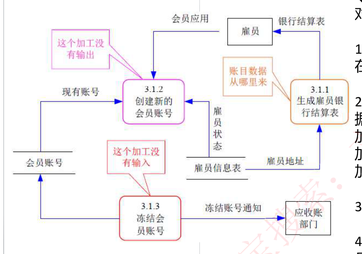

### 1-2 分层数据流图

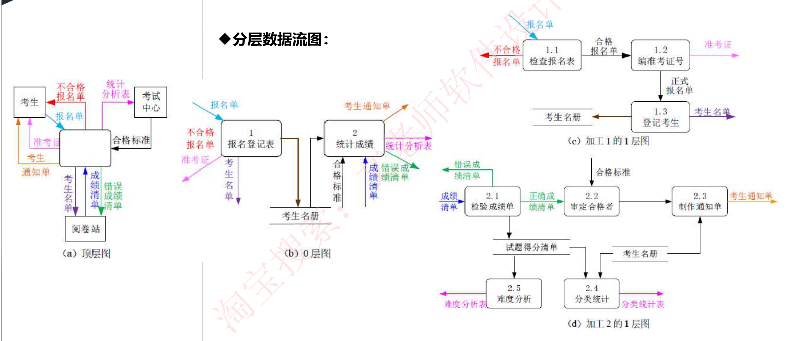

### 1-3 数据流图的设计原则（判题依据，务必背熟）

(1) **数据守恒原则**：对任何一个加工来说，其**所有输出数据流中的数据必须能从该加工的输入数据流中直接获得**，或者说是通过该加工能产生的数据。
(2) **守恒加工原则**：对同一个加工来说，**输入与输出的名字必须不相同，即使它们的组成成分相同**。
(3) 对于每个加工，必须**既有输入数据流，又有输出数据流**。
(4) **外部实体与外部实体之间不存在数据流**。
(5) **外部实体与数据存储之间不存在数据流**。
(6) **数据存储与数据存储之间不存在数据流**。
(7) **父图与子图的平衡原则**：**子图的输入输出数据流同父图相应加工的输入输出数据流必须一致**，此即父图与子图的平衡。父图与子图之间的平衡原则不存在于单张图。
(8) **数据流与加工有关，且必须经过加工**。

### 1-4 数据字典 DD

数据流图描述了系统的分解，但没有对图中各成分进行说明。**数据字典就是为数据流图中的每个数据流、文件、加工，以及组成数据流或文件的数据项做出说明**。

数据字典有以下 4 类条目：**数据流、数据项、数据存储和基本加工**。

| 符号 | 含义 | 举例及说明 |
|---|---|---|
| **=** | 被定义为 | |
| **+** | 与 | x=a+b，表示 x 由 a 和 b 组成 |
| **[…\|…]** | 或 | x=[a\|b]，表示 x 由 a 或 b 组成 |
| **{……}** | 重复 | x={a}，表示 x 由 0 个或多个 a 组成 |

**加工逻辑**也称为"**小说明**"。常用的加工逻辑描述方法有**结构化语言、判定表和判定树** 3 种。

## 2. 解题技巧（重要）

◆ 数据流图的**考试形式非常固定**：**第一小题补充外部实体，第二小题补充数据存储，第三小题补充缺失数据流**，第四小题考察简单概念。都不算难，以题目描述和数据流图为主，**答案都在题目描述里，更像是阅读理解解题**，技巧如下：

**1、补充外部实体**：外部实体就是与系统进行交互的其他实体，可以是大型系统、公司部门、相关人员等，**外部实体会与系统进行交互**，反应在数据流图中就是一个个**事件流**，**依据事件的名称结合题目描述可以轻易得出答案**。

**2、补充数据存储**：数据存储出现在 **0 层数据流图**中，**反应系统内部数据的存储**，可以直接根据数据流图中**数据存储的输入数据流和输出数据流判断该数据存储的信息**得出答案，但注意**要使用题目说明的数据存储名词**作为答案。

**3、补充缺失数据流**：**详细阅读题目描述**，依据题目描述**对涉及的数据流图进行一一核对**，这是**最为简单直接的方法**，因为即使开始就去考虑数据守恒、父图子图平衡等原则，最终还是要根据题目描述核对，不如一开始就直接核对。

**4、简单概念**：题型不固定，一般只有 2-3 分，都是比较简单的判断。

### 常见问题 Q&A

**Q：补充数据存储时，题目中没有具体存储名称怎么办？**
A：此时可依据数据流图中数据存储的输入输出数据流自行起名。

**Q：补充数据流时，该写多少条？**
A：**一般按分写，几分就写几条。**

**Q：觉得要补充的数据流很多，比分数更多怎么办？**
A：**可以多写**，这个是按点给分的，多写不会扣分，但要注意不能太过分。

**Q：总觉得数据流把握不准，跟答案有出入怎么办？**
A：首先要注意，**软考下午题答案官方不公布标准答案，所有答案都是老师校对的，可能会不全面**；其次，部分真题本身也不太严谨，有二义性。因此**不用太纠结，掌握解题方法，多刷题即可**。

**Q：这种题该怎么学习，学习到哪种程度呢？**
A：**要求能拿到 12 分以上**；看完视频对应专题课程后，立即去做后面的历年真题。

## 3. 历年典型真题 1（二手车物流系统）

### 【说明】

某公司欲开发一款二手车物流系统，以有效提升物流成交效率。该系统的主要功能是：
1. **订单管理**：系统抓取线索，将车辆交易系统的交易信息抓取为线索。帮买顾问看到有买车线索后，会打电话询问买家是否需要物流，若需要，帮买顾问就将这个线索发起为订单并在系统中存储，然后系统帮助买家寻找物流商进行承运。
2. **路线管理**：帮买顾问对物流商的路线进行管理，存储的路线信息包括路线类型、物流商、起止地点。路线分为三种，即固定路线、包车路线、竞拍体系，其中固定路线和包车路线是合约制。包车路线的发车时间由公司自行管理，是订单的首选途径。
3. **合约管理**：帮买顾问根据公司与物流商确定的合约，对合约内容进行设置，合约信息包括物流商信息、路线起止城市、价格、有效期等。
4. **寻找物流商**：系统根据订单的类型（保卖车、全国购和普通二手车）、起止城市，需要的服务模式（买家接、送到买家等）进行自动派发或以竞拍体系方式选择合适的物流商。即：有新订单时，若为保卖车或全国购，则直接分配到竞拍体系中；否则，若符合固定路线和/或包车路线，系统自动分配给合约物流商，若不符合固定路线和包车路线，系统将订单信息分配到竞拍体系中。竞拍体系接收到订单后，将订单信息推送给有相关路线的物流商，物流商对订单进行竞拍出价，最优报价的物流商中标。最后，给承运的物流商发送物流消息，更新订单的物流信息，给车辆交易系统发送物流信息。
5. **物流商注册**：物流商账号的注册开通。

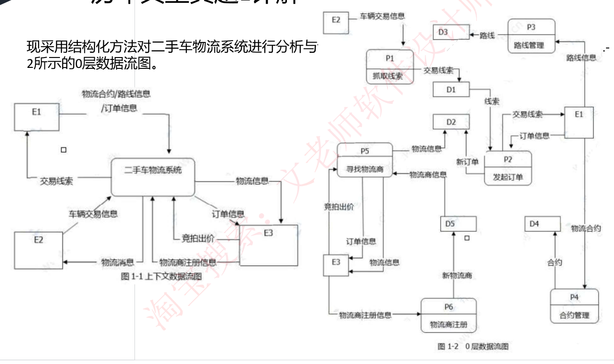

### 【问题】

- **【问题 1】（3 分）** 使用说明中的词语，给出图 1-1 中的实体 E1~E3 的名称。
- **【问题 2】（5 分）** 使用说明中的词语，给出图 1-2 中的数据存储 D1~D5 的名称。
- **【问题 3】（4 分）** 根据说明和图中术语，补充图 1-2 中缺失的数据流及其起点和终点。
- **【问题 4】（3 分）** 根据说明，采用结构化语言对"P5：寻找物流商"的加工逻辑进行描述。

### 【答案】

**问题 1**：E1：帮买顾问　E2：车辆交易系统　E3：物流商

**问题 2**：D1：交易线索信息表　D2：订单信息表　D3：路线信息表　D4：合约信息表　D5：物流商信息表

**问题 3**：缺失数据流如下

| 序号 | 起点 | 终点 | 名称 |
|---|---|---|---|
| 1 | P5 | E2 | 物流信息 |
| 2 | D2 | P5 | 新订单信息 |
| 3 | D3 | P5 | 路线信息 |
| 4 | D4 | P5 | 合约信息 |

**问题 4**：
```
while (有新订单) {
    if (订单类型 == "保卖车或全国购")
        分配到竞拍体系;
    else
    {
        if (订单路线 == "固定路线和/或包车路线")
            分配给合约物流商;
        else   //不符合固定路线和包车路线
            分配到竞拍体系;
    }
    给承运的物流商发送物流消息;
    更新订单的物流信息;
    给车辆交易系统发送物流信息;
}

竞拍体系:
while (收到订单)
{
    订单信息推送给有相关路线的物流商;
    物流商对订单进行竞拍出价;
    最优报价的物流商中标;
}
```

## 4. 历年典型真题 2（房屋中介信息系统）

### 【说明】

某房产中介连锁企业欲开发一个基于 Web 的房屋中介信息系统，以有效管理房源和客户，提高成交率。该系统的主要功能是：
1. **房源采集与管理**：系统自动采集外部网站的潜在房源信息，保存为潜在房源。由经纪人联系确认的潜在房源变为房源，并添加出售/出租房源的客户。由经纪人或客户登记的出售/出租房源，系统将其保存为房源。房源信息包括基本情况、配套设施、交易类型、委托方式、业主等。经纪人可以对房源进行更新等管理操作。
2. **客户管理**：求租/求购客户进行注册、更新，推送客户需求给经纪人，或由经纪人对求租/求购客户进行登记、更新。客户信息包括身份证号、姓名、手机号、需求情况、委托方式等。
3. **房源推荐**：根据客户的需求情况（求购/求租需求情况以及出售/出租房源信息），向已登录的客户推荐房源。
4. **交易管理**：经纪人对租售客户双方进行交易信息管理，包括订单提交和取消，设置收取中介费比例。财务人员收取中介费之后，表示该订单已完成，系统更新订单状态和房源状态，向客户和经纪人发送交易反馈。
5. **信息查询**：客户根据自身查询需求查询房屋供需信息。

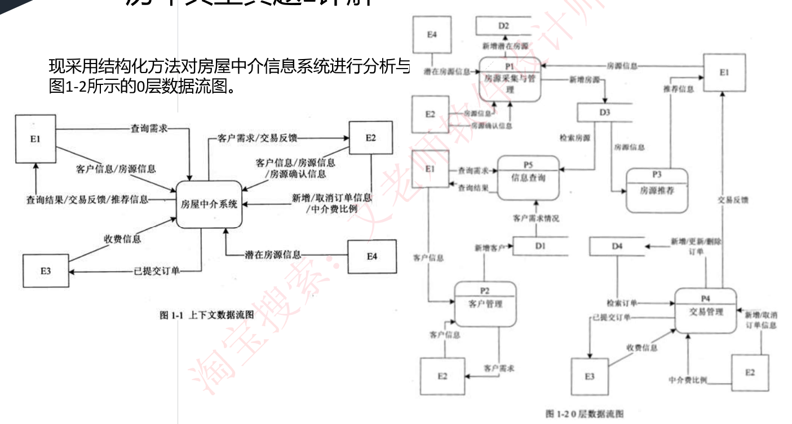

### 【问题】

- **【问题 1.1】（4 分）** 使用说明中的词语，给出图 1-1 中的实体 E1-E4 的名称。
- **【问题 1.2】（4 分）** 使用说明中的词语，给出图 1-2 中的数据存储 D1-D4 的名称。
- **【问题 1.3】（3 分）** 根据说明和图中术语，补充图 1-2 中缺失的数据流及其起点和终点。
- **【问题 1.4】（4 分）** 根据说明中术语，给出图 1-1 中数据流"客户信息"、"房源信息"的组成。

### 【答案】

**问题 1**：E1：客户　E2：经纪人　E3：财务人员　E4：外部网站

**问题 2**：D1：客户信息表　D2：潜在房源信息表　D3：房源信息表　D4：订单表

**问题 3**：如下表所示

| 数据流名称 | 起点 | 终点 |
|---|---|---|
| 交易反馈 | P4 | E2 |
| 客户需求 | D1 | P3 |
| 房源状态 | P4 | D3 |

**问题 4**：
- 客户信息：身份证号，姓名，手机号，需求情况，委托方式。
- 房源信息：基本情况，配套设施，交易类型，委托方式，业主。

---

# 第二部分 · 数据库分析设计（试题 2：E-R 模型与关系模式）

## 1. 考点串讲

### 1-1 E-R 图

◆ **E-R 图**：即**实体-联系图**，使用**椭圆表示属性、长方形表示实体、菱形表示联系，联系两端要标注联系类型**。

◆ **联系类型**：**一对一 1:1、一对多 1:N、多对多 M:N**。

1、**实体和弱实体**（之间**直接用直线连接**，是从属关系，**无联系类型**）；
2、**多个实体一个类型**（一般是**三个实体连接到一个类型上**，根据题目说明，**若有三个实体相关，则是此种情况**）；
3、**主键和外键**（**主键是本关系内唯一，外键是其他关系的主键，外键可以有多个**）。

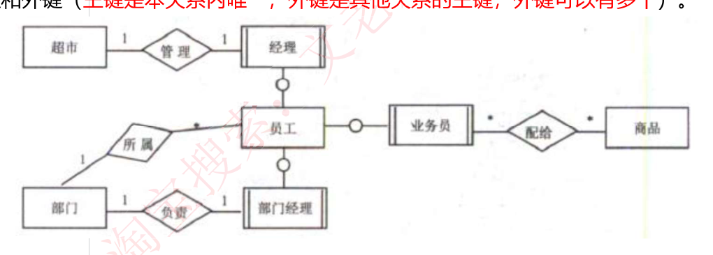

### 1-2 关系模式

◆ **关系模式就是以名称和属性名表示一个联系**，如下：
```
客户(客户ID、姓名、身份证号、电话、住址、账户余额)
员工(工号、姓名、性别、岗位、身份证号、电话、住址)
家电(家电条码、家电名称、价格、出厂日期、(1))
家电厂商(厂商ID、厂商名称、电话、法人代表信息、厂址、(2))
购买(订购单号、(3)、金额)
```
◆ **主键**：不能为空，能唯一标识当前关系的属性。
◆ **外键**：其他关系模式的主键或者为空。

### 1-3 E-R 图转换为关系模式（核心考点）

E-R 图中，有实体和联系两个概念，实体和实体之间的联系分为三种，即 **1:1、1:N、M:N**，这三种情况，转换为关系模式的方法也不同。

◆ 首先，**每个实体都要转换为一个关系模式**，对于联系：
- **一对一**：**联系作为一个属性随便加入哪个实体中**；
- **一对多**：联系可以**单独转换为一个关系模式**，也可以**作为一个属性加入到 N 端中（N 端实体包含 1 端的主键）**；
- **多对多**：联系**必须单独转换为一个关系模式**（且此关系模式应该包含两端实体的主键）。

◆ 转换之后要注意：**原来的两个实体之间的联系必须还存在**，能够通过查询方式查到对方。

## 2. 解题技巧

◆ 数据库设计的**考法也非常固定**，**第一小题补充 E-R 图，第二小题补充关系模式，第三小题是简单的情景问答题**。同样也都不难，结合题目描述和 E-R 图的一些特点可以轻易得出答案，技巧如下：

**1、补充 E-R 图**：这是**重中之重**，E-R 图如果弄错了，后续题目都有影响，主要是**根据题目描述确认哪些实体之间有联系，联系类型是哪一种**，而后进行连线即可，并不难。

**2、补充关系模式**：实际考察的是**将 E-R 图转换为关系模式，补充缺失的属性**，分成两步：首先要**审题**，题目会给出每个关系模式的属性信息，**先将题目中的属性信息和问题对应，将缺少的属性全部补充**；而后**再按照规则转换**，即前面所说的规则，**按联系的三种对应方式决定要添加哪些字段**。

**3、情景问答**：一般都是给出一段新的描述，要求新增一种实体-联系类型和关系模式，本质也是考察联系类型和 E-R 图转换为关系模式。

◆ **注意审题，常识以及 E-R 图转换为关系模式的原则**（主要是联系的归属）。

### 常见问题 Q&A

**Q：E-R 图转换为关系模式时，总觉得不对怎么办？**
A：学员在这种类型题目里**唯一的模糊点**就是这里，转换为关系模式，遵循**两步法**，首先以题目描述为主，然后再根据不同类型的转换原则去判断是否有遗漏。

**Q：这种题目该怎么学习，学习到哪种程度呢？**
A：**要求能拿到 12 分以上**；看完视频对应专题课程后，立即去做历年真题，掌握技巧。

## 3. 历年典型真题 1（创业孵化基地）

### 【说明】

某创业孵化基地管理若干孵化公司和创业公司，为规范管理创业项目投资业务，需要开发一个信息系统。请根据下述需求描述完成该系统的数据库设计。

### 【需求描述】

（1）记录孵化公司和创业公司的信息。孵化公司信息包括公司代码、公司名称、法人代表名称、注册地址和一个电话；创业公司信息包括公司代码、公司名称和一个电话。孵化公司和创业公司的公司代码编码不同。
（2）统一管理孵化公司和创业公司的员工。员工信息包括工号、身份证号、姓名、所属公司代码和一个手机号，工号唯一标识每位员工。
（3）记录投资方信息。投资方信息包括投资方编号、投资方名称和一个电话。
（4）投资方和创业公司之间依靠孵化公司牵线建立创业项目合作关系。具体实施由孵化公司的一位员工负责协调投资方和创业公司的一个创业项目。一个创业项目只属于一个创业公司，但可以接受若干投资方的投资。创业项目信息包括项目编号、创业公司代码、投资方编号和孵化公司员工工号。


### 【逻辑结构设计】

根据概念模型设计阶段完成的实体联系图，得出如下关系模式（不完整）：
```
孵化公司 (公司代码，公司名称，法人代表名称，注册地址，电话)
创业公司 (公司代码，公司名称，电话)
员工     (工号，身份证号，姓名，性别，__(a)__，手机号)
投资方   (投资方编号，投资方名称，电话)
项目     (项目编号，创业公司代码 __(b)__，孵化公司员工工号)
```

### 【问题】

- **【问题 1】（5 分）** 根据问题描述，补充图 2-1 的实体联系图。
- **【问题 2】（4 分）** 补充逻辑结构设计结果中的 (a)、(b) 两处空缺及完整性约束关系。
- **【问题 3】（6 分）** 若创业项目的信息还需要包括投资额和投资时间，那么：
  （1）是否需要增加新的实体来存储投资额和投资时间？
  （2）如果增加新的实体，请给出新实体的关系模式，并对图 2-1 进行补充。如果不需要增加新的实体，请将"投资额"和"投资时间"两个属性补充连线到图 2-1 合适的对象上，并对变化的关系模式进行修改。

### 【答案】

**问题 1**：（补充后的实体联系图）

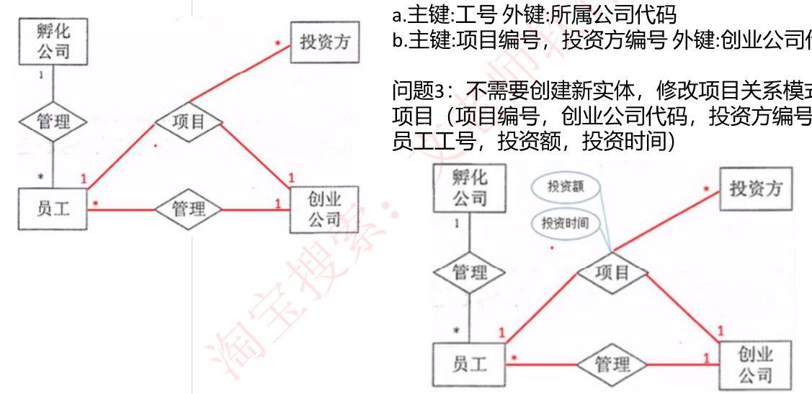

**问题 2**：
- (a)：所属公司代码
- (b)：投资方编号
- **完整性约束**：
  - a. 主键：工号　外键：所属公司代码
  - b. 主键：项目编号　外键：创业公司代码、投资方编号、**员工工号**

**问题 3**：**不需要创建新实体**，修改项目关系模式为：
```
项目 (项目编号，创业公司代码，投资方编号，孵化公司员工工号，投资额，投资时间)
```

## 4. 历年典型真题 2（海外代购公司）

### 【说明】

某海外代购公司为扩展公司业务，需要开发一个信息化管理系统。请根据公司现有业务及需求描述完成系统的数据库设计。

### 【需求描述】

（1）记录公司员工信息。员工信息包括工号、身份证号、姓名、性别和一个手机号，工号唯一标识每位员工，员工分为代购员和配送员。
（2）记录采购的商品信息。商品信息包括商品名称、所在超市名称、采购价格、销售价格和商品介绍，系统内部用商品条码唯一标识每种商品。一种商品只在一家超市代购。
（3）记录顾客信息。顾客信息包括顾客真实姓名、身份证号（清关缴税用）、一个手机号和一个收货地址，系统自动生成唯一的顾客编号。
（4）记录托运公司信息。托运公司信息包括托运公司名称、电话和地址，系统自动生成唯一的托运公司编号。
（5）顾客登录系统之后，可以下订单购买商品。订单支付成功后，系统记录唯一的支付凭证编号，顾客需要在订单里指定运送方式：空运或海运。
（6）代购员根据顾客的订单在超市采购对应商品，一份订单所含的多个商品可能由多名代购员从不同超市采购。
（7）采购完的商品交由配送员根据顾客订单组合装箱，然后交给托运公司运送。托运公司按顾客订单核对商品名称和数量，然后按顾客的地址进行运送。


### 【逻辑结构设计】

根据概念模型设计阶段完成的实体联系图，得出如下关系模式（不完整）：
```
员工     (工号，身份证号，姓名，性别，手机号)
商品     (条码，商品名称，所在超市名称，采购价格，销售价格，商品介绍)
顾客     (编号，姓名，身份证号，手机号，收货地址)
托运公司 (托运公司编号，托运公司名称，电话，地址)
订单     (订单ID，__(a)__，商品数量，运送方式，支付凭证编号)
代购     (代购ID，代购员工号，__(b)__)
运送     (运送ID，配送员工号，托运公司编号，订单ID，发运时间)
```

### 【问题】

- **【问题 1】（3 分）** 根据问题描述，补充图 2-1 的实体联系图。
- **【问题 2】（6 分）** 补充逻辑结构设计结果中的 (a)、(b) 两处空缺。
- **【问题 3】（6 分）** 为方便顾客，允许顾客在系统中保存多组收货地址。请根据此需求，增加"顾客地址"弱实体，对图 2-1 进行补充，并修改"运送"关系模式。

### 【答案】

**问题 2**：(a) 商品条码，顾客编号　(b) 订单ID，商品条码

**问题 3**：运送关系增加顾客地址字段，所以运送不需要再关联订单信息。

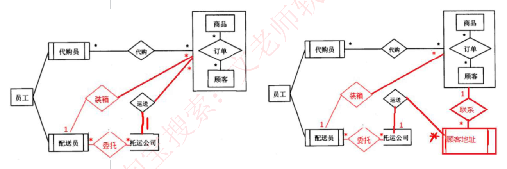

---

# 第三部分 · 面向对象分析设计（试题 3：UML 建模）

## 1. 考点串讲

### 1-1 用例图

◆ **用例图**：主要考察**参与者和用例的识别、用例之间的关系**（包含 include、扩展 extend、泛化）。


### 1-2 类图

◆ **类图**：主要考察填**类名、多重度、类之间的联系**。

◆ **多重度**（有点类似于 E-R 图中的联系类型）含义如下：
- **1**：表示一个集合中的一个对象对应另一个集合中 1 个对象。
- **0..\***：表示一个集合中的一个对象对应另一个集合中的 0 个或多个对象。
- **1..\***：表示一个集合中的一个对象对应另一个集合中的一个或多个对象。
- **\***：表示一个集合中的一个对象对应另一个集合中的多个对象。


### 1-3 序列图

◆ **序列图**：即顺序图，动态图，是场景的图形化表示，描述了以时间顺序组织的对象之间的交互活动。
◆ 主要考察**填对象名、消息名**，消息就是一个个箭头上传递的，**对象作为实体在最上端**。


### 1-4 状态图

◆ **状态图**主要描述状态之间的转换，主要考察的就是**填状态名、填状态转换的条件**。
◆ 转换可以通过事件触发器触发，事件触发后相应的监护条件会进行检查。状态图中转换和状态是两个独立的概念：**图中方框代表状态，箭头上的代表触发事件**，实心圆点为起点和终点。


### 1-5 通信图

◆ **通信图**：是**顺序图的另一种表示方法**，也是由对象和消息组成的图，只不过**不强调时间顺序，只强调事件之间的通信**，而且也没有固定的画法规则，和顺序图统称为**交互图**。
◆ 主要考察**填对象名、填消息**。


### 1-6 活动图

◆ **活动图**：动态图，是一种特殊的状态图，展现了在系统内从一个活动到另一个活动的流程。活动的分岔和汇合线是一条水平粗线。
◆ 主要考察**填活动名称**。


## 2. 解题技巧

◆ 由前面的介绍可知，考察 UML 建模就是考察多种图形，**对这些图形的考察一般都是缺失一些关键点，而后要求考生补图**。

◆ 要求认真审题，根据题干说明补齐类名或者对象名或者消息名等等，记住**类图和对象图中的多重度**（互相独立的分析，掌握表示方法）、**类之间的联系标识**（多边形端为整体，直线端为个体）。

◆ 认真**审题**，根据说明查缺补漏，一般来说有以下几种题型：
**1、补充用例图**：主要考察补充**用例名称、参与者、用例之间的关系**，只要认真审题，根据题中描述核对，都可以轻易得出答案。
**2、补充类图**：主要考察补充**类名称**，需要根据**类之间的关系以及多重度**来判断，需要**牢记类之间关系的图形符号**，尤其是组合、聚合和泛化的符号，并且观察符号上的多重度数字，与题目描述对应。
**3、补充状态图**：主要补充**状态名称**，根据题目描述可以轻易得出答案。

### 常见问题 Q&A

**Q：看到一张类图都是空的，就懵了，该怎么办？**
A：**类和类之间的联系，尤其是泛化联系**是非常重要的，也是解题的关键，要记住泛化联系的符号，而后去题目描述里找到**具有父子关系的实体**，基本上题目就一步步解出来了。其他如**组合、聚合联系的符号也是解题关键**。

**Q：这种题目该怎么学习，学习到哪种程度呢？**
A：**要求能拿到 12 分以上**；看完视频对应专题课程后，立即去做历年真题，掌握技巧。

## 3. 历年典型真题 1（牙科诊所信息系统）

### 【说明】

某牙科诊所拟开发一套信息系统，用于管理病人的基本信息和就诊信息。诊所工作人员包括：医护人员 (DentalStaff)、接待员 (Receptionist) 和办公人员 (OfficeStaff)。系统主要功能需求描述如下：

1. **记录病人基本信息** (Maintain patient info)。初次就诊的病人，由接待员将病人基本信息录入系统。病人基本信息包括病人姓名、身份证号、出生日期、性别、首次就诊时间和最后一次就诊时间等。每位病人与其医保信息 (MedicalInsurance) 关联。
2. **记录就诊信息** (Record office visit info)。病人在诊所的每一次就诊，由接待员将就诊信息 (OfficeVisit) 录入系统。就诊信息包括就诊时间、就诊费用、支付代码、病人支付费用和医保支付费用等。
3. **记录治疗信息** (Record dental procedure)。病人在就诊时，可能需要接受多项治疗，每项治疗 (Procedure) 可能由多位医护人员为其服务。治疗信息包括：治疗项目名称、治疗项目描述、治疗的牙齿和费用等。治疗信息由每位参与治疗的医护人员分别向系统中录入。
4. **打印发票** (Print invoices)。发票 (Invoice) 由办公人员打印。发票分为两种：给医保机构的发票 (InsuranceInvoice) 和给病人的发票 (PatientInvoice)。两种发票内容相同，只是支付的费用不同。当收到治疗费用时，办公人员在系统中更新支付状态 (Enterpayment)。
5. **记录医护人员信息** (Maintain dental staff info)。办公人员将医护人员信息录入系统。医护人员信息包括姓名、职位、身份证号、家庭住址和联系电话等。
6. 医护人员可以查询并打印其参与的治疗项目相关信息 (Search and print procedureinfo)。


### 【问题】

- **【问题 1】（6 分）** 根据说明中的描述，给出图 3-1 中 A1~A3 所对应的参与者名称和 U1~U3 所对应的用例名称。
- **【问题 2】（5 分）** 根据说明中的描述，给出图 3-2 中 C1~C5 所对应的类名。
- **【问题 3】（4 分）** 根据说明中的描述，给出图 3-2 中类 C4、C5、Patient 和 DentalStaff 的必要属性。

### 【答案】

**问题 1**：
- A1：接待员 (Receptionist)　A2：医护人员 (DentalStaff)　A3：办公人员 (OfficeStaff)
- U1：记录病人基本信息 (Maintain patient info)
- U2：记录就诊信息 (Record office visit info)
- U3：打印发票 (Print invoices)

**问题 2**：
- C1：给病人的发票 (PatientInvoice)
- C2：给医保机构的发票 (InsuranceInvoice)
- C3：发票 (Invoice)　C4：治疗 (Procedure)　C5：就诊信息 (Office Visit)

**问题 3**：
- C4：治疗项目名称、治疗项目描述、治疗的牙齿和费用、参与治疗的医护人员；
- C5：就诊时间、就诊费用、支付代码、病人支付费用和医保支付费用、病人身份证号；
- Patient 属性：病人姓名、身份证号、出生日期、性别、首次就诊时间和最后一次就诊时间、医保信息；
- DentalStaff 属性：姓名、职位、身份证号、家庭住址和联系电话

## 4. 历年典型真题 2（电动玩具在线销售系统）

### 【说明】

某玩具公司正在开发一套电动玩具在线销售系统，用于向注册会员提供端对端的玩具定制和销售服务。在系统设计阶段，"创建新订单 (New Order)"的设计用例详细描述如表 3-1 所示，候选设计类分类如表 3-2 所示，并根据该用例设计出部分类图如图 3-1 所示。


### 【用例描述表】

| 用例名称 | 创建新订单 New Order |
|---|---|
| **用例编号** | ETM-R002 |
| **参与者** | 会员 |
| **前提条件** | 会员已经注册并成功登录系统 |
| **典型事件流** | 1. 会员（C1）点击"新的订单"按钮；<br>2. 系统列出所有正在销售的电动玩具清单及价格（C2）；<br>3. 会员点击复选框选择所需电动玩具并输入对应数量，点击"结算"按钮；<br>4. 系统自动计算总价（C3），显示销售清单和会员预先设置个人资料的收货地址和支付方式（C4）；<br>5. 会员点击"确认支付"按钮；<br>6. 系统自动调用支付系统（C5）接口支付该笔账单；<br>7. 若支付系统返回成功标识，系统生成完整订单信息并持久存储到数据库订单表（C6）中；<br>8. 系统将以表格形式显示完整订单信息（C7），同时自动发送完整订单信息（C8）至会员预先配置的邮箱地址（C9）。 |
| **候选事件流 3a** | (1) 会员点击"定制"按钮；<br>(2) 系统以列表形式显示所有可以定制的电动玩具清单和定制属性（如尺寸、颜色等）(C10)；<br>(3) 会员点击单选按钮选择所需要定制的电动玩具并填写所需要定制的属性要求，点击"结算"按钮；<br>(4) 回到步骤 4. |
| **候选事件流 7a** | (1) 若支付系统返回失败标识，系统显示会员当前默认支付方式 (C11) 让会员确认；<br>(2) 若会员点击"修改付款"按钮，调用"修改付款"用例，可以新增并存储为默认支付方式 (C12)，回到步骤 4；<br>(3) 若会员点击"取消订单"，则该用例终止执行。 |

### 【表 3-2 候选设计类分类】

| 类型 | 编号 |
|---|---|
| **接口类**（Interface，负责系统与用户之间的交互） | (a) |
| **控制类**（Control，负责业务逻辑的处理） | (b) |
| **实体类**（Entity，负责持久化数据的存储） | (c) |

### 【订单状态说明】

在订单处理的过程中，会员可以点击"取消订单"取消该订单。如果支付失败，该订单将被标记为挂起状态，可后续重新支付，如果挂起超时 30 分钟未支付，系统将自动取消该订单。订单支付成功后，系统判断订单类型：
(1) 对于常规订单，标记为备货状态，订单信息发送到发货部，完成打包后交付快递发货；
(2) 对于定制订单，会自动进入定制状态，定制完成后交付快递发货。会员在系统中点击"收货"按钮变为收货状态，结束整个订单的处理流程。


### 【问题】

- **【问题 1】（6 分）** 根据表 3-1 中所标记的候选设计类，请按照其类别将编号 C1~C12 分别填入表 3-2 中的 (a)、(b) 和 (c) 处。
- **【问题 2】（4 分）** 根据创建新订单的用例描述，请给出图 3-1 中 X1~X4 处对应类的名称。
- **【问题 3】（5 分）** 根据订单处理过程的描述，在图 3-2 中 S1~S5 处分别填入对应的状态名称。

### 【答案】

**问题 1**：
- (a)：C3、C8
- (b)：C5、C7、C10、C11
- (c)：C1、C2、C4、C6、C9、C12

**问题 2**：X1：收货地址　X2：支付方式　X3：邮箱地址　X4：电动玩具定制属性

**问题 3**：S1：订单挂起　S2：订单备货　S3：订单定制　S4：订单发货　S5：订单收货

---

# 第四部分 · 算法分析设计（试题 4：C 语言算法填空）

## 1. C 语言基础串讲

### 1-1 第一个 C 程序

```c
#include <stdio.h>
int main()
{
    /* 我的第一个 C 程序 */
    printf("Hello, World! \n");
    return 0;
}
```
- 程序的第一行 `#include <stdio.h>` 是**预处理器指令**，告诉 C 编译器在实际编译之前要包含 stdio.h 文件。
- 下一行 `int main()` 是主函数，程序从这里开始执行，**C 语言程序都是从 main 函数开始执行**。
- 下一行 `/*...*/` 将会被编译器忽略，这里放置程序的注释内容。它们被称为程序的注释。
- 下一行 `printf(...)` 是 C 中另一个可用的函数，会在屏幕上显示消息 "Hello, World!"。
- 下一行 `return 0;` 终止 main() 函数，并返回值 0。

### 1-2 语法基础

◆ **英文分号 ;**：在 C 程序中，**分号是语句结束符**，**每个语句必须以分号结束**。

◆ **C 语言有两种注释方式**：
- 以 `//` 开始的**单行注释**，这种注释可以单独占一行。
- `/* */` 这种格式的注释**可以单行或多行**。
- 不能在注释内嵌套注释，注释也不能出现在字符串或字符值中。

◆ **C 标识符**是用来标识变量、函数，或任何其他用户自定义项目的名称。
- 一个标识符以字母 A-Z 或 a-z 或**下划线 _ 开始**，**不能以数字开头**，后跟零个或多个字母、下划线和数字（0-9）。
- C 标识符内**不允许出现标点字符**，比如 @、$ 和 %。
- C 是**区分大小写**的编程语言。

◆ **C 语言自己保留的关键字**，编写程序时不能与之重复，如变量定义 int/char/double 等保留字。

◆ **C 中的空格**：只包含空格的行，被称为空白行，可能带有注释，C 编译器会完全忽略它。在 C 中，空格用于描述空白符、制表符、换行符和注释。空格分隔语句的各个部分，**让编译器能识别语句中的某个元素（比如 int）在哪里结束，下一个元素在哪里开始**。

◆ **sizeof 获取存储字节**：为了得到某个类型或某个变量在特定平台上的准确大小，可以使用 sizeof 运算符。表达式 **sizeof(type) 得到对象或类型的存储字节大小**。

### 1-3 void 类型

**void 类型指定没有可用的值**。它通常用于以下三种情况下：

| 序号 | 说明 |
|---|---|
| 1 | **函数返回为空**。C 中有各种函数都不返回值，或者您可以说它们返回空。不返回值的函数的返回类型为空。例如 `void exit(int status);` |
| 2 | **函数参数为空**。C 中有各种函数不接受任何参数。不带参数的函数可以接受一个 void。例如 `int rand(void);` |
| 3 | **指针指向 void**。类型为 `void *` 的指针代表对象的地址，而不是类型。例如，内存分配函数 `void *malloc(size_t size);` 返回指向 void 的指针，可以转换为任何数据类型。 |

### 1-4 变量

◆ **变量其实只不过是程序可操作的存储区的名称**。C 中每个变量都有特定的类型，**类型决定了变量存储的大小和布局**，该范围内的值都可以存储在内存中，运算符可应用于变量上。

◆ 变量的名称可以由字母、数字和下划线字符组成。它必须以字母或下划线开头。大写字母和小写字母是不同的，因为 C 是大小写敏感的。

◆ **变量定义**：指定一个数据类型，并包含了该类型的一个或多个变量的列表，如下所示：
```c
type variable_list;
int i, j, k;
```
◆ 变量可以在声明的时候被初始化（指定一个初始值）：
```c
type variable_name = value;
int d = 3, f = 5;    // 定义并初始化 整型变量 d 和 f
char x = 'x';        // 字符型变量 x 的值为 'x'
```

### 1-5 C 常量与宏定义

◆ **C 常量**：整数常量可以是十进制、八进制或十六进制的常量。前缀指定基数：**0x 或 0X 表示十六进制，0 表示八进制**，不带前缀则默认表示十进制。

◆ **浮点常量由整数部分、小数点、小数部分和指数部分组成**。您可以使用小数形式或者指数形式来表示浮点常量，如：
```
3.14159      /* 合法的 */
314159E-5    /* 合法的 */
```

◆ **字符常量是括在单引号中**，可以是一个普通的字符（例如 'x'）、一个转义序列（例如 '\t'）。
在 C 中，有一些特定的字符，当它们前面有反斜杠时，它们就具有特殊的含义，被用来表示如换行符（\n）或制表符（\t）等。

◆ **字符串字面值或常量是括在双引号 "" 中的**。一个字符串包含类似于字符常量的字符：普通的字符、转义序列和通用的字符。

◆ **宏定义 #define**：用来**定义一个可以代替值的宏**，语法格式如下：
```c
#define 宏名称 值
#define LENGTH 10   //后续使用时可用 LENGTH 代替 10 这个常量
```

### 1-6 数组、枚举与左值右值

◆ **定义一维数组**：`type arrayName[arraySize];`

◆ **枚举元素 1 默认认为 0，可以赋其他值**；枚举元素的值**默认在前一个元素基础上加 1**；定义枚举变量：
```c
enum DAY
{
    MON = 1, TUE, WED, THU, FRI, SAT, SUN
};
```

◆ C 中有两种类型的表达式：
- **左值（lvalue）**：**指向内存位置的表达式**被称为左值表达式。左值可以出现在**赋值号的左边或右边**。
- **右值（rvalue）**：术语右值指的是**存储在内存中某些地址的数值**。右值是**不能对其进行赋值的表达式**，也就是说，右值可以出现在赋值号的右边，但不能出现在赋值号的左边。
- 下面这个不是一个有效的语句，会生成编译时错误：`10 = 20;`

### 1-7 const / static / extern / typedef

◆ **const 关键字**定义一个**只读的变量**，本质是修改了变量的存储方式为只读。
```c
const int LENGTH = 10;  //定义变量 LENGTH=10，且只读，即无法修改 LENGTH 值。
```
◆ 使用 **static 修饰局部变量可以在函数调用之间保持局部变量的值**。
◆ static 修饰符**也可以应用于全局变量或函数**。当 static 修饰全局变量或函数时，会使变量或函数的**作用域限制在声明它的文件内**。
◆ **extern** 关键字用于**提供一个全局变量的引用**，全局变量对所有的程序文件都是可见的。可以这么理解，extern 是**用来在另一个文件中声明一个全局变量或函数**。extern 修饰符通常用于当**两个或多个文件共享相同的全局变量或函数的时候**。
◆ **typedef 关键字**为**类型取一个新的名字**。下面的实例为单字节数字定义了一个术语 BYTE：
```c
typedef unsigned char BYTE;
BYTE b1, b2;
```

### 1-8 运算符

**算术运算符**（假设变量 A 的值为 10，变量 B 的值为 20）：

| 运算符 | 描述 | 实例 |
|---|---|---|
| + | 把两个操作数相加 | A + B 将得到 30 |
| - | 从第一个操作数中减去第二个操作数 | A - B 将得到 -10 |
| * | 把两个操作数相乘 | A * B 将得到 200 |
| / | 分子除以分母 | B / A 将得到 2 |
| % | 取模运算符，整除后的余数 | B % A 将得到 0 |
| ++ | 自增运算符，整数值增加 1 | A++ 将得到 11 |
| -- | 自减运算符，整数值减少 1 | A-- 将得到 9 |

**关系运算符**（A=10，B=20）：

| 运算符 | 描述 | 实例 |
|---|---|---|
| == | 检查两个操作数的值是否相等，如果相等则条件为真。 | (A == B) 不为真。 |
| != | 检查两个操作数的值是否相等，如果不相等则条件为真。 | (A != B) 为真。 |
| > | 检查左操作数的值是否大于右操作数的值，如果是则条件为真。 | (A > B) 不为真。 |
| < | 检查左操作数的值是否小于右操作数的值，如果是则条件为真。 | (A < B) 为真。 |
| >= | 检查左操作数的值是否大于或等于右操作数的值，如果是则条件为真。 | (A >= B) 不为真。 |
| <= | 检查左操作数的值是否小于或等于右操作数的值，如果是则条件为真。 | (A <= B) 为真。 |

**逻辑运算符**（A=1，B=0）：

| 运算符 | 描述 | 实例 |
|---|---|---|
| && | 称为逻辑与运算符。如果两个操作数都非零，则条件为真。 | (A && B) 为假。 |
| \|\| | 称为逻辑或运算符。如果两个操作数中有任意一个非零，则条件为真。 | (A \|\| B) 为真。 |
| ! | 称为逻辑非运算符。用来逆转操作数的逻辑状态。如果条件为真则逻辑非运算符将使其为假。 | !(A && B) 为真。 |

**杂项运算符 sizeof & 三元**：

| 运算符 | 描述 | 实例 |
|---|---|---|
| sizeof() | 返回变量的大小。 | sizeof(a) 将返回 4，其中 a 是整数。 |
| & | 返回变量的地址。 | &a; 将给出变量的实际地址。 |
| * | 指向一个变量。 | *a; 将指向一个变量。 |
| ? : | 条件表达式 | 如果条件为真 ? 则值为 X : 否则值为 Y |

### 1-9 判断与循环

◆ **C 判断**：C 语言把**任何非零和非空的值假定为 true，把零或 null 假定为 false**。
```c
(1) if 语句
if (boolean_expression)
{ /* 如果布尔表达式为真将执行的语句 */ }

(2) if else 语句（扩展 if elseif else）
if (boolean_expression)
{ /* 如果布尔表达式为真将执行的语句 */ }
else
{ /* 如果布尔表达式为假将执行的语句 */ }

(3) switch case 语句
switch (expression) {
  case constant-expression:
      statement(s);
      break;   /* 可选的 */
  case constant-expression:
      statement(s);
      break;   /* 可选的 */
  /* 您可以有任意数量的 case 语句 */
  default:     /* 可选的 */
      statement(s);
}
```

◆ **C 循环**：
```c
(1) while 语句
while (condition)
{ statement(s); }

(2) for 语句
for (init; condition; increment)
{ statement(s); }

(3) do while 语句（至少保证执行一次循环体）
do
{ statement(s); } while (condition);
```

◆ **循环控制语句**：
- **(1) break 语句**：当 break 语句出现在**一个循环内时，循环会立即终止**，且程序流将继续执行紧接着循环的下一条语句。它可用于**终止 switch 语句中的一个 case**。如果使用的是嵌套循环（即一个循环内嵌套另一个循环），break 语句会停止执行最内层的循环，然后开始执行该块之后的下一行代码。
- **(2) continue 语句**：C 语言中的 continue 语句会**跳过当前循环中的代码，强迫开始下一次循环**。对于 for 循环，**continue 语句执行后自增语句仍然会执行**。对于 while 和 do…while 循环，continue 语句重新执行条件判断语句。
- **(3) goto 语句**：C 语言中的 goto 语句允许**把控制无条件转移到同一函数内的被标记的语句**。

### 1-10 作用域与内存管理

◆ **C 作用域**
- **局部变量**：在**某个函数或块的内部声明的变量**称为局部变量。它们只能**被该函数或该代码块内部的语句使用**。局部变量在函数外部是不可知的。
- **全局变量**：是**定义在函数外部，通常是在程序的顶部**。全局变量在**整个程序生命周期内都是有效的**，在任意的函数内部能访问全局变量。全局变量可以被任何函数访问。
- 在程序中，局部变量和全局变量的名称可以相同，但是**在函数内，如果两个名字相同，会使用局部变量值**，全局变量不会被使用。

◆ **C 内存管理**
- 定义一个指针，必须**使其指向某个存在的内存空间的地址，才能使用**，否则使用野指针会造成段错误，内存分配与释放函数如下：
- `void free(void *addr);` //该函数释放 addr 所指向的内存块，释放的是动态分配的内存空间。
- `void *malloc(int size);` //在堆区分配一块指定大小为 size 的内存空间，用来存放数据，不会被初始化。

### 1-11 string.h 常用函数

- `void *memcpy(void *dest, const void *src, size_t n)`：从 src 复制 n 个字符到 dest。
- `void *memset(void *str, int c, size_t n)`：复制字符 c（一个无符号字符）到参数 str 所指向的字符串的前 n 个字符。
- `char *strcat(char *dest, const char *src)`：把 src 所指向的字符串追加到 dest 所指向的字符串的结尾。
- `char *strncat(char *dest, const char *src, size_t n)`：把 src 所指向的字符串追加到 dest 所指向的字符串的结尾，直到 n 字符长度为止。
- `char *strchr(const char *str, int c)`：在参数 str 所指向的字符串中搜索第一次出现字符 c（一个无符号字符）的位置。
- **`int strcmp(const char *str1, const char *str2)`：把 str1 所指向的字符串和 str2 所指向的字符串进行比较。**
- `int strncmp(const char *str1, const char *str2, size_t n)`：把 str1 和 str2 进行比较，最多比较前 n 个字节。
- **`char *strcpy(char *dest, const char *src)`：把 src 所指向的字符串复制到 dest。**
- `char *strncpy(char *dest, const char *src, size_t n)`：把 src 所指向的字符串复制到 dest，最多复制 n 个字符。
- **`size_t strlen(const char *str)`：计算字符串 str 的长度，直到空结束字符，但不包括空结束字符。**
- `char *strrchr(const char *str, int c)`：在参数 str 所指向的字符串中搜索最后一次出现字符 c（一个无符号字符）的位置。
- `char *strstr(const char *haystack, const char *needle)`：在字符串 haystack 中查找第一次出现字符串 needle（不包含空结束字符）的位置。

## 2. 时间复杂度：看历年真题代码循环


**O(n³)：三重循环猜测。**


**O(m²·n)：看循环界限。**

## 3. 算法类型判断关键字（历年真题归纳）

| 真题场景 | 判断关键字 → 算法类型 |
|---|---|
| **0-1 背包问题**（最优子结构性质、递归式） | **动态规划法**：最优子结构、递归、公式 |
| **RNA 二级结构最优配对**（C(i,j) 递归定义） | **动态规划法**：最优配对方案、递归式、公式 |
| **n 皇后问题**（尝试摆放、有冲突则考虑下一列、回溯到上一个皇后） | **回溯法**：回溯 |
| **钢条切割**（rn = max{1≤i≤n}(pi + rn-i) 递归式，自顶向下和自底向上） | **动态规划法**：最优、递归式、公式 |
| **假币问题**（n 枚硬币分成相等的两部分，用天平称） | **分治法**：分成两部分、分而治之 |
| **集装箱装载**（最先适宜策略 firstfit / 最优适宜策略 bestfit） | **贪心法**：求最优，但没有最优子结构、递归等 |

## 4. 解题技巧（重要）

◆ 算法设计是**下午软件设计中最难的题型，主要难在 C 代码填空上**，因此文老师的建议是**先不解决代码填空题（因为最难），先解决其他外围问题**（如时间复杂度、算法技巧、取特殊值计算结果），最后解决代码填空，有助于理解整个题目，技巧如下：

**1、代码填空：第一小题，最后解决**，并不影响解决其他题目，要理解题目算法原理，才能得出答案。另外**近几年的算法设计真题有很大的技巧，即便不理解算法原理也可以推导出答案**，要**结合算法描述中的公式，以及算法代码中类似的分支**，能够发现填空的答案在代码中其他地方已经给出，因为算法原理的相似可行之处，尤其是分治法算法。

**2、算法、时间复杂度：第二小题，先做**，**考察何种算法很好分辨**，涉及到分组就是分治法，局部最优就是贪心法，整体规划最优就是动态规划法，迷宫类的问题是回溯法，记住关键字很好区分；**时间复杂度就是看 C 代码中的 for 循环环层数和每一层的循环次数**，涉及到二分必然有 O(logn)。

**3、特殊值计算：第三小题，一般应该先做**，不需要根据 C 代码，**直接根据题目给出的算法原理，一步步推导即可得出答案**，耐心推导并不难。但要注意，**如果遇到算法原理十分复杂的，建议放弃，掌握问题 1 和 2 的技巧即可**。

### 常见问题 Q&A

**Q：文老师说这一题最难，我也没基础，能不能干脆放弃？**
A：这种思想是错误的，这一题共 15 分，放弃就难通过了，要**尽可能的拿分**，至少关于时间复杂度、算法判断是很简单的了；而算法填空，平时做练习也要认真对待每一题，坚持下来，时间长了即使零基础也能填对几个。

**Q：完全没有 C 语言代码基础，看不懂怎么办？**
A：文老师在讲解真题和技巧时已经充分考虑到这一点，对于零基础学员，**先认真听语法讲解**，然后听真题里对代码的分析，从英语的角度去联想其含义。不放弃就有收获。

**Q：算法判断不准确，不能辨别贪心法和动态规划法怎么办？**
A：算法判断是很简单的了，题目中都有关键词暗示的，**分而治之是分治法；迷宫问题回溯法；当题目中给出"考虑当前情况下"等词，是局部最优；当题目给出"最优子结构"、递归、最优公式等，是动态规划法**。

**Q：时间复杂度不知道如何求？**
A：**看代码循环重数，注意是嵌套的重数**，不是个数。

**Q：这种题目该怎么学习，学习到哪种程度呢？**
A：**要求能拿到 8 分以上**；看完视频对应专题课程后，立即去做历年真题，掌握技巧。

## 5. 历年典型真题 1（0-1 背包问题）

### 【说明】

0-1 背包问题定义为：给定 i 个物品的价值 v[1…i]、重量 w[1…i] 和背包容量 T，每个物品装到背包里或者不装到背包里。求最优的装包方案，使得所得到的价值最大。

0-1 背包问题具有最优子结构性质。定义 c[i][T] 为最优装包方案所获得的最大价值，则可得到如下所示的递归式：

```
c[i][T] = 0                                          若 i=0 或 T=0
        = c[i-1][T]                                  若 T < w[i]
        = max(c[i-1][T-w[i]] + v[i], c[i-1][T])      若 i>0 且 T ≥ w[i]
```

### 【C 代码】

下面是算法的 C 语言实现。
- (1) 常量和变量说明
  - T：背包容量
  - v[]：价值数组
  - w[]：重量数组
  - c[][]：c[i][j] 表示前 i 个物品在背包容量为 j 的情况下最优装包方案所能获得的最大价值


### 【问题】

- **【问题 1】（8 分）** 根据说明和 C 代码，填充 C 代码中的空 (1) ~ (4)。
- **【问题 2】（4 分）** 根据说明和 C 代码，算法采用了 (5) 设计策略。在求解过程中，采用了 (6)（自底向上或者自顶向下）的方式。
- **【问题 3】（3 分）** 若 5 项物品的价值数组和重量数组分别为 v[]= {0,1,6,18,22,28} 和 w[]= {0,1,2,5,6,7}，背包容量为 T= 11，则获得的最大价值为 (7)。

### 【答案】

**问题 1**：
- (1) `c[i][j]`
- (2) `j>=w[i]&&i>0`
- (3) `Calculate_Max_Value(v,w,i-1,j-w[i])+v[i]`
- (4) `c[i][j]=temp`

**问题 2**：(5) 动态规划法　(6) 自底向上

**问题 3**：40

## 6. 历年典型真题 2（n 皇后问题）

### 【说明】

n 皇后问题描述为：在一个 n×n 的棋盘上摆放 n 个皇后，要求任意两个皇后不能冲突，即任意两个皇后不在同一行、同一列或者同一斜线上。

算法的基本思想如下：
将第 i 个皇后摆放在第 i 行，i 从 1 开始，每个皇后都从第 1 列开始尝试。尝试时判断在该列摆放皇后是否与前面的皇后有冲突，如果没有冲突，则在该列摆放皇后，并考虑摆放下一个皇后；如果有冲突，则考虑下一列。如果该行没有合适的位置，回溯到上一个皇后考虑在原来位置的下一个位置上继续尝试摆放皇后，……，直到找到所有合理摆放方案。

（1）常量和变量说明
- n：皇后数，棋盘规模为 n×n
- queen[]：皇后的摆放位置数组，queen[i] 表示第 i 个皇后的位置，1 ≤ queen[i] ≤ n


### 【问题】

- **【问题 1】（8 分）** 根据题干说明，填充 C 代码中的空 (1) ~ (4)。
- **【问题 2】（3 分）** 根据题干说明和 C 代码，算法采用的设计策略为 (5)。
- **【问题 3】（4 分）** 当 n=4 时，有 (6) 种摆放方式，分别为 (7)。

### 【答案】

**问题 1**：
- (1) `queen[i]==queen[j]`
- (2) `1`
- (3) `Place(i)&&j<=n`
- (4) `Nqueen(j+1)`

**问题 2**：(5) 回溯法

**问题 3**：有 2 种摆法，分别为 **2413、3142**

---

# 第五部分 · 面向对象程序设计（试题 6：Java + 设计模式，推荐选做）

## 1. Java 语法考点串讲

◆ **建议都选 JAVA 题**，C++ 语法不再做介绍。

### 1-1 Java 中的类

```java
public class Dog{
    String breed;
    int age;
    String color;
    void barking(){ }
    void hungry(){ }
    void sleeping(){ }
}
```
- **一个类可以包含变量和方法**。
- **每个类都有构造方法**。如果没有显式地为类定义构造方法，Java 编译器将会为该类提供一个默认构造方法。**在创建一个对象的时候，至少要调用一个构造方法。构造方法的名称必须与类同名**，一个类可以有多个构造方法。

```java
public class Puppy{
    public Puppy(){ }
    public Puppy(String name){
        // 这个构造器仅有一个参数：name
    }
}
```

### 1-2 创建对象

◆ 对象是根据类创建的。在 Java 中，使用**关键字 new 来创建一个新的对象**。创建对象需要以下三步：
- **声明**：声明一个对象，包括对象名称和对象类型。
- **实例化**：使用关键字 new 来创建一个对象。
- **初始化**：使用 new 创建对象时，会调用构造方法初始化对象。

```java
public class Puppy{
    public Puppy(String name){
        //这个构造器仅有一个参数：name
        System.out.println("小狗的名字是 : " + name );
    }
    public static void main(String[] args){
        // 下面的语句将创建一个 Puppy 对象
        Puppy myPuppy = new Puppy( "tommy" );
    }
}
```
运行后会输出：`小狗的名字是 :tommy`

### 1-3 访问实例变量和方法

```java
public class Puppy{
    int puppyAge;
    public Puppy(String name){
        // 这个构造器仅有一个参数：name
        System.out.println("小狗的名字是 : " + name );
    }
    public void setAge( int age ){
        puppyAge = age;
    }
    public int getAge( ){
        System.out.println("小狗的年龄为 : " + puppyAge );
        return puppyAge;
    }
    public static void main(String[] args){
        /* 创建对象 */
        Puppy myPuppy = new Puppy( "tommy" );
        /* 通过方法来设定age */
        myPuppy.setAge( 2 );
        /* 调用另一个方法获取age */
        myPuppy.getAge( );
        /*你也可以像下面这样访问成员变量 */
        System.out.println("变量值 : " + myPuppy.puppyAge );
    }
}
```
编译并运行上面的程序，产生如下结果：
```
小狗的名字是 : tommy
小狗的年龄为 : 2
变量值 : 2
```

### 1-4 访问控制修饰符

◆ Java 中，可以使用访问控制符来保护对类、变量、方法和构造方法的访问。Java 支持以下访问权限：
- **private：在同一类内可见**。使用对象：变量、方法。注意：**不能修饰类（外部类）**
- **public：对所有类可见**。使用对象：类、接口、变量、方法
- **protected：对同一包内的类和所有子类可见**。使用对象：变量、方法。注意：**不能修饰类（外部类）**。

◆ 请注意以下方法继承的规则：
- 父类中声明为 **public 的方法在子类中也必须为 public**。
- 父类中声明为 **protected 的方法在子类中要么声明为 protected，要么声明为 public，不能声明为 private**。
- 父类中声明为 **private 的方法，不能够被继承**。

### 1-5 abstract 修饰符

◆ **抽象类不能用来实例化对象，声明抽象类的唯一目的是为了将来对该类进行扩充**。
◆ **如果一个类包含抽象方法，那么该类一定要声明为抽象类**，否则将出现编译错误。
◆ 抽象类可以包含抽象方法和非抽象方法。

```java
abstract class Caravan{
    private double price;
    private String model;
    private String year;
    public abstract void goFast();     //抽象方法
    public abstract void changeColor();
}

public abstract class SuperClass{
    abstract void m();  //抽象方法
}
class SubClass extends SuperClass{
    //实现抽象方法
    void m(){ ......... }
}
```
◆ 抽象方法是一种**没有任何实现的方法**，该方法的具体实现由子类提供。
◆ **任何继承抽象类的子类必须实现父类的所有抽象方法，除非该子类也是抽象类**。
◆ 如果一个类包含若干个抽象方法，那么该类必须声明为抽象类。**抽象类可以不包含抽象方法**。抽象方法的声明以分号结尾，例如：`public abstract sample();`

### 1-6 Java 继承的特性

◆ 子类拥有父类非 private 的属性、方法。
◆ 子类可以拥有自己的属性和方法，即子类可以对父类进行扩展。
◆ 子类可以用自己的方式实现父类的方法。
◆ 继承可以使用 **extends 和 implements** 这两个关键字来实现继承。

◆ **extends 关键字**：在 Java 中，类的继承是**单一继承**，也就是说，一个子类只能拥有一个父类，**所以 extends 只能继承一个类**。

◆ **使用 implements 关键字可以变相的使 java 具有多继承的特性**，使用范围为**类继承接口的情况，可以同时继承多个接口**（接口跟接口之间采用逗号分隔）。

```java
public class C implements A,B { }
```

## 2. 解题技巧

◆ 下午考试的第 5、6 题为**二选一作答，都是程序填空，原理一模一样**，只不过一个用 C++ 语言，一个用 JAVA 语言编写的程序，并且这个填空**只是考基本语法，不涉及算法**，比之第 4 题算法设计的填空简单很多，**完全可以拿满分**。

◆ 文老师建议，如果是**初学者，或者对于两种语言都不太精通，就专攻 JAVA 程序题**，因为 JAVA 的语法比之 C++ 要简单并且容易理解记忆，容易拿到满分。

◆ 面向对象的程序填空分为两类，**一个是考察纯定义**，如接口类，抽象类，接口类中的函数定义等，这些根据程序代码可以快速判断出。

◆ 另一类，就是**关于设计的，填写函数体，但是这个函数体并不是要写一段真正的程序实现代码，而是调用形式的**，都有调用函数的，这些调用函数一般在程序中，或者在说明和类图中可以找到，考察的是调用形式。

### 常见问题 Q&A

**Q：零基础完全不懂 JAVA 语言怎么办？**
A：这一题**完全可以从英语角度去理解，根据关键词去联系代码上下文**，都能得出答案，毫无难度，**每个人都能拿满分，要先树立信心**。

**Q：视频里为什么没有对于 JAVA 语言的详细讲解？**
A：**语言之间都是相通的**，结合文老师前面对 C 语言的讲解，学员再去分析 C 语言或者 JAVA 语言，其关键语法都是类似的，这个考试又不需要大家去关注细节，因此完全够用了。如果想了解具体 JAVA 语法可在百度搜索 "java 教程"，找一个简短的页面整体浏览一遍即可，没有必要去看相关 java 代码视频。关键还在于多做真题，多听视频讲解，自己多总结。

**Q：这种题目该怎么学习，学习到哪种程度呢？**
A：**要求能拿到 12 分以上**；看完视频对应专题课程后，立即去做历年真题，掌握技巧。

## 3. 历年典型真题 1（观察者模式）

### 【说明】

某文件管理系统中定义了类 OfficeDoc 和 DocExplorer。当类 OfficeDoc 发生变化时，类 DocExplorer 的所有对象都要更新其自身的状态。现采用**观察者 (Observer) 设计模式**来实现该需求，所设计的类图如图 6-1 所示。

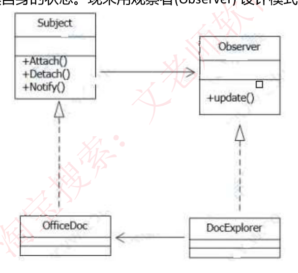

### 【Java 代码】

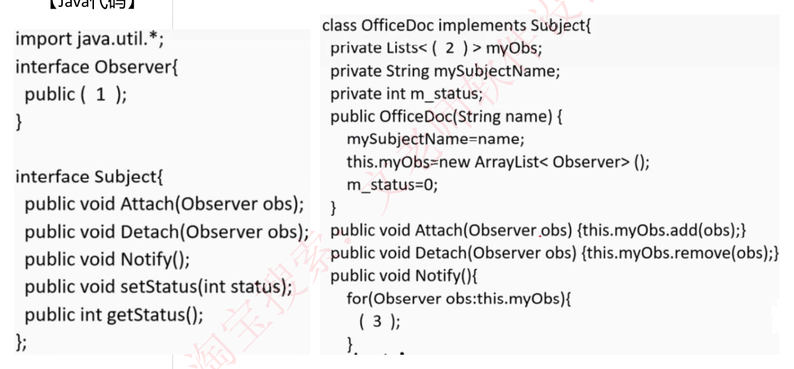

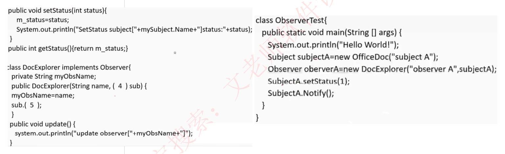

### 【答案】

- (1) `void update();`
- (2) `Observer`
- (3) `obs.update();`
- (4) `Subject`
- (5) `Attach(this);`

## 4. 历年典型真题 2（生成器模式）

### 【说明】

某快餐厅主要制作并出售儿童套餐，一般包括主餐（各类比萨）、饮料和玩具，其餐品种类可能不同，但其制作过程相同。前台服务员 (Waiter) 调度厨师制作套餐。现采用**生成器 (Builder) 模式**实现制作过程，得到如图 6-1 所示的类图。

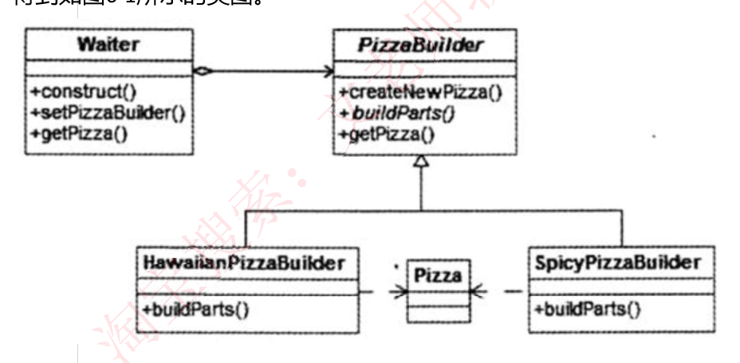

### 【Java 代码】

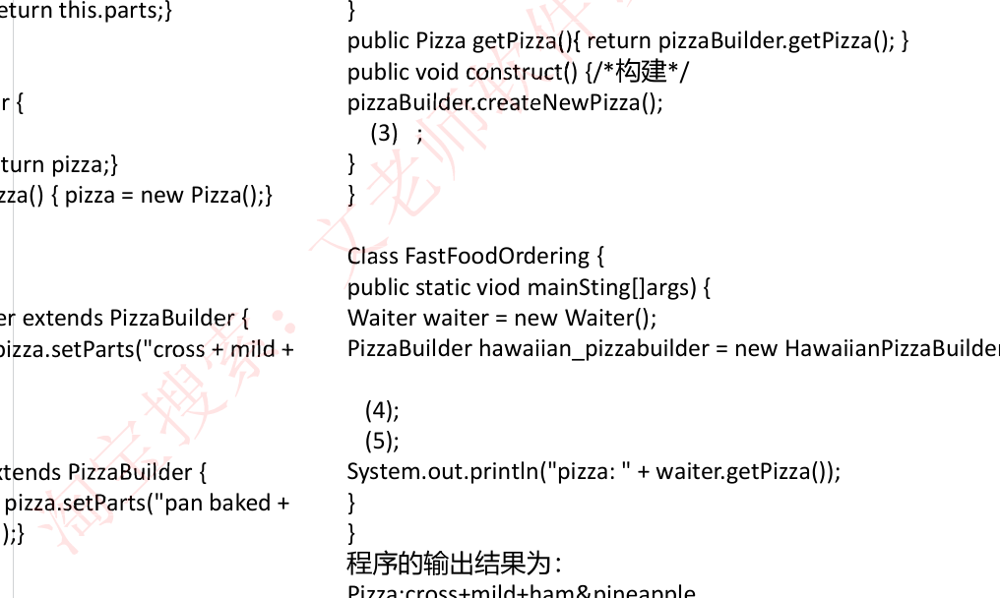

程序的输出结果为：`Pizza:cross+mild+ham&pineapple`

### 【答案】

- (1) `abstract void buildParts();`
- (2) `this.pizzaBuilder=pizzaBuilder`
- (3) `pizzaBuilder.buildParts()`
- (4) `waiter.setPizzaBuilder(hawaiian_pizzabuilder)`
- (5) `waiter.construct()`
