<!-- p1 -->
# 计算机网络概述

## 1．计算机系统基础知识

### 1.1．计算机系统硬件基本组成

- 硬件
    - 中央处理器（CPU）硬件系统的核心
        - 运算器
        - 控制器
    - 存储器（记忆设备）
        - **内**部**存**储器（**速度高，容量小**）： **临时存放**程序、数据及中间结果
        - **外**部**存**储器（**速度慢，容量大**）： **长期保存**程序和数据
    - 外设（外部设备）
        - 输入设备：输入原始数据及各种命令
        - 输出设备：输出计算机运行结果
- 软件

### 1.2．CPU的功能与组成

中央处理单元(CPU)：计算机系统的核心部件，它**负责获取程序指令，对指令进行译码并加以执行**

#### 1.2.1．CPU的功能

- **程序控制**：通过执行指令来**控制**程序的**执行顺序**
- **操作控制**：一条指令功能的实现需要若干个操作信号配合来完成，CPU产生每条指令的操作信号并将操作信号送往对应的部件，控制相应的部件按指令的功能要求进行操作
- **时间控制**：CPU对各种操作进行时间上的控制，即在指令执行过程中操作信号的出现时间，持续时间及出现的时间顺序都需要进行严格的控制
- **数据处理**：CPU通过对数据进行算术运算及逻辑运算等方式进行加工处理，数据加工处理的结果被人们所利用。所以，对数据的加工处理也是CPU最根本的任务
- CPU还需**对**系统**内部和外部的中断（异常）**做出**响应**，进行相应的**处理**

#### 1.2.2．CPU的组成

(1) **运算器**（是数据加工处理部件，用于完成计算机的各种算术和逻辑运算）：运算器所进行的全部操作都是由控制器发出的控制信号来指挥的，所以它是执行部件

- 功能
    - 执行所有算术运算，如加、减、乘、除等基本运算及附加运算。
    - 执行所有的逻辑运算并进行逻辑测试，如与、或、非、零值测试或两个值的比较等。
- 组成

<!-- p2 -->
    - **算术逻辑单元(ALU)**：负责**处理数据**，实现对数据的**算术运算和逻辑运算**。
    - **累加寄存器(AC)**：简称累加器，是一个通用寄存器。**暂存算术运算或逻辑运算的中间运算结果**。
- **数据缓冲寄存器(DR)**： **暂存指令或数据字或操作数**。
- **状态条件寄存器(PSW)**： **保存指令执行后的状态**。

(2) **控制器**

- 功能
    - 用于控制整个CPU的工作，决定了计算机运行过程的自动化。它**不仅要保证程序的正确执行，而且能够处理异常事件**
- 组成
    - 指令控制逻辑：要完成取指令、分析指令和执行指令的操作，其过程分为**取指令，指令译码按指令操作码执行，形成下一条指令地址**等步骤。
        - **指令寄存器(IR)**： **存放的是从内存中取得指令，就像个中间站一样，不过是存放指令的中间站**
        - **程序计数器(PC)**：存放的是**指令的地址**，还有**计数**的功能
        - **地址寄存器(AR)**：存放的是**cpu访问内存单元的地址**
        - **指令译码器(ID)**：是把**操作码解析成**对应的**指令操作**
    - 时序控制逻辑：要为每条指令按时间顺序提供应有的控制信号
    - 总线控制逻辑：是为多个功能部件服务的信息通路的控制电路
    - 中断控制逻辑：用于控制各种中断请求，并根据优先级的高低对中断请求进行排队，逐个交给CPU

(3) 寄存器组

- 分类：专用寄存器（运算器和控制器中的寄存器是专用寄存器）、通用寄存器

### 1.3．数据表示

#### 1.3.1．计算机基本单位

| 单位 | 符号 | 备注 |
| --- | --- | --- |
| 位(比特) | bit (b) | 计算机最小的存储单位 |
| 字节 | byte (B) | 数据表示的最小单位：1B = 8bit |
| 千字节 | KB | 1KB = 1024B |
| 兆字节 | MB | 1MB = 1024KB |
| 吉字节 | GB | 1GB = 1024 MB |
| 太字节 | TB | 1TB = 1024GB |

<!-- p3 -->
#### 1.3.2．进制转换

a．常用进制

| 进制 | 运算规则 | 标识符 |
| --- | --- | --- |
| 二进制 | 逢二进一： 基数为2，数值部分用两个不同的数字0、1来表示 | B |
| 八进制 | 逢八进一 ：基数为8，数值部分用0、1、2、3、4、5、6、7来表示 | O |
| 十进制 | 逢十进一：基数为10，数值部分用0、1、2、3、4、5、6、7、8、9来表示 | D |
| 十六进制 | 逢十六进一：基数为16，有十六种数字符号，除了在十进制中的0至9外，还另外用6个英文字母A、B、C、D、E、F来表示十进制数的10至15 | H |

注：当没有下标或后缀时默认为十进制数

b．非十进制数转为十进制数

$$\sum(每位上的数码 \times 基数的位次方)$$

- 二进制转换为十进制

$$(101.1101)_2 = 1\times2^2 + 0\times2^1 + 1\times2^0 + 1\times2^{-1} + 1\times2^{-2} + 0\times2^{-3} + 1\times2^{-4} = (5.8125)_{10}$$

- 八进制转换为十进制

$$(105.236)_8 = 1\times8^2 + 0\times8^1 + 5\times8^0 + 2\times8^{-1} + 3\times8^{-2} + 6\times8^{-3} = (69.30859375)_{10}$$

- 十六进制转换为十进制

$$(A27.5C)_{16} = 10\times16^2 + 2\times16^1 + 7\times16^0 + 5\times16^{-1} + 12\times16^{-2} = (2599.359375)_{10}$$

c．十进制数转换为非十进制数

整数部分：除N取余，商为0时，将**余数倒序输出**
小数部分：乘N取整数,直至积为0(或满足精度)， **整数部分正序输出**

- **十进制转换为二进制**

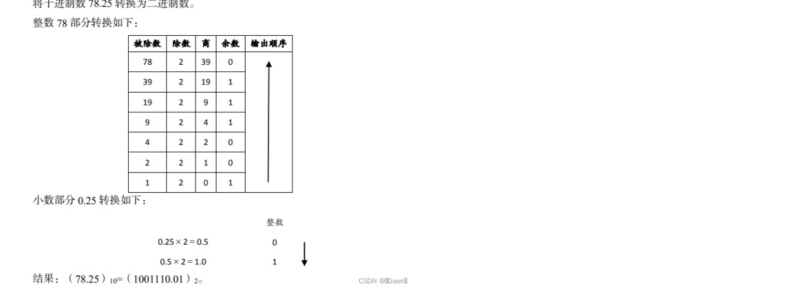

<!-- p4 -->
- **十进制转换为八进制**

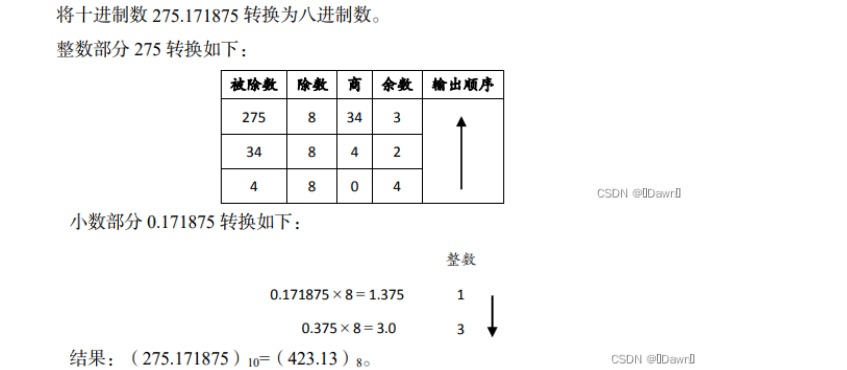

- **十进制转换为十六进制**

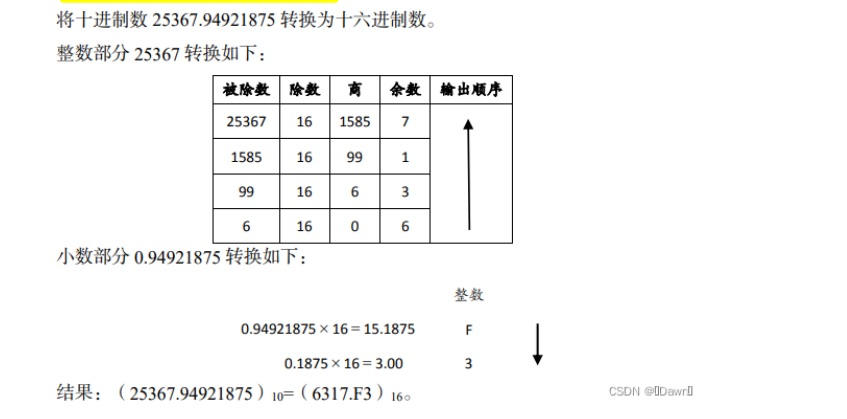

d．二进制与八进制、十六进制的相互转换

- 二进制转为八进制（**三位一组**）
  将二进制数从**小数点开始**分别**向左（整数部分）**和**向右（小数部分）**每3位二进制位组成**一组**，将每一组内的3位二进制数转换成八进制数码中的一个数字，按顺序连接起来即得八进制表示。不足3位时，对原数值用0来补足3位。
  例如：$(001\ 011\ 111\ .\ 001)_2 = (137.1)_8$
- 二进制转为十六进制（**四位一组**）
  将二进制数从**小数点开始**分别**向左（整数部分）**和**向右(小数部分)**每4位二进制位组成**一组**，将每一组内的4位二进制数转换成十六进制数码中的一个数字，按顺序连接起来即得十六进制表示。如果总的位数不是4的倍数，那么最左面的一组可以少于4位，前面用0来补足4位。
  例如：$(1111\ 1111\ 0100\ 1011)_2 = (FF4B)_{16}$

### 1.3.3．原码，反码，补码，移码

符号位：如果机器字长为n，则最高位（或最左边的第一位是符号位：**0表示正号，1表示负号**）。
**原码：原码就是符号位加上真值的绝对值，** 即用第一位表示符号，其余位表示数值绝对值．如果机器字长n=8

| 数值 | 原码 | 数值 | 原码 |
| --- | --- | --- | --- |
| +0 | 00000000 | -0 | 10000000 |
| +1 | 00000001 | -1 | 10000001 |
| +127 | 01111111 | -127 | 11111111 |
| +45 | 00101101 | -45 | 10101101 |
| +0.5 | 0<>1000000 | -0.5 | 1<>1000000 |

<!-- p5 -->
反码：正数的反码与原码相同，负数的反码则是其绝对值按位取反。

| 数值 | 反码 | 数值 | 反码 |
| --- | --- | --- | --- |
| +0 | 00000000 | -0 | 11111111 |
| +1 | 00000001 | -1 | 11111110 |
| +127 | 01111111 | -127 | 10000000 |
| +45 | 00101101 | -45 | 11010010 |
| +0.5 | 0<>1000000 | -0.5 | 1<>01111111 |

补码：正数的补码与其原码相同，负数的的补码则等于其反码的末尾加1。

| 数值 | 补码 | 数值 | 补码 |
| --- | --- | --- | --- |
| +0 | 00000000（唯一） | -0 | 00000000 |
| +1 | 00000001 | -1 | 11111111 |
| +127 | 01111111 | -127 | 10000001 |
| +45 | 00101101 | -45 | 11010011 |
| +0.5 | 0<>1000000 | -0.5 | 1<>1000000 |

移码：只要将补码的符号位取反便可获得相应的移码表示。

| 数值 | 移码 | 数值 | 移码 |
| --- | --- | --- | --- |
| +1 | 10000001 | -1 | 01111111 |
| +127 | 11111111 | -127 | 00000001 |
| +45 | 10101101 | -45 | 01010011 |
| +0 | 10000000 | -0 | 10000000 |

### 1.3.4．数值表示范围

机器字长为n时各种码制表示的带符号数的范围

| 码制 | 定点整数 | 定点小数 |
| --- | --- | --- |
| 原码 | $-(2^{n-1}-1) \sim +(2^{n-1}-1)$ | $-(1-2^{-(n-1)}) \sim +(1-2^{-(n-1)})$ |
| 反码 | $-(2^{n-1}-1) \sim +(2^{n-1}-1)$ | $-(1-2^{-(n-1)}) \sim +(1-2^{-(n-1)})$ |
| 补码 | $-2^{n-1} \sim +(2^{n-1}-1)$ | $-1 \sim +(1-2^{-(n-1)})$ |
| 移码 | $-2^{n-1} \sim +(2^{n-1}-1)$ | $-1 \sim +(1-2^{-(n-1)})$ |

<!-- p6 -->
#### 1.3.5．浮点数表示

$N = 尾数\times基数^{指数}$

例如 $3.14\ X\ 10^3$

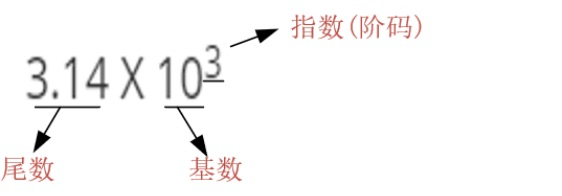

a．**运算**过程： **对阶** > **尾数计算** > **结果格式化**
b．特点

- 一般**尾数用补码**，**阶码用移码**。
- **阶码**的位数**决定**数的表示**范围**，位数越多范围越大。
- **尾数**的位数**决定**数的有效**精度**，位数越多精度越高。
- **对阶**时，**小数向大数看齐**。
- **对阶**是通过**较小数的尾数算术右移**实现的。

c．存储格式

| 阶符 | 阶码 | 数符 | 尾数 |
| --- | --- | --- | --- |

## 1.4．校验码

### 1.4.1．奇偶校验码

**可以检错，不能纠错**
通过在编码中增加一位校验位来使编码中1的个数为奇数（奇校验）或者为偶数（偶校验），从而使码距变为2。

### 1.4.2．海明码

**可以检错和纠错**
在数据位之间的特定位置上插入k个校验位，通过扩大码距来实现检错和纠错。
设**数据位**是**n**位，**校验位**是**k**位，则n和k必须满足： **2^k^- 1 ≥ n + k** 。

### 1.4.3．循环冗余校验码(CRC)

**码距为2，可以检错，不能纠错**

广泛应用于数据通信领域和磁介质存储系统中。它利用生成多项式为k个数据位产生r个校验位进行编码，其编码长度为k+r。

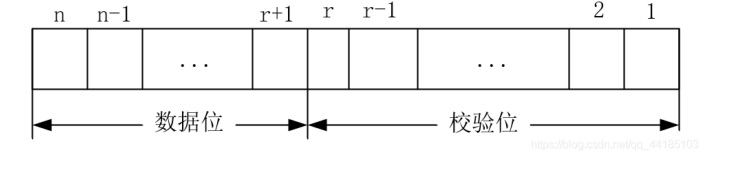

循环冗余校验码是由**两部分组**成的，左边为**信息码（数据）**，右边为**校验码**。若**信息码占k位，则校验码就占n-k位**。其中，n为CRC码的字长，所以又称为（n，k）码。校验码是由信息码产生的，校验码位数越多，该代码的校验能力就越强。在**求CRC编码**时，**采用**的是**模2运算**。

<!-- p7 -->
## 2．计算机体系结构

### 2.1．计算机体系结构的发展

#### 2.1.1．计算机体系结构的分类

- 按处理机数量（宏观上）：
    - 单处理系统：利用一个处理单元与其他外部设备结合起来
    - 并行处理与多处理系统：将两个以上的处理机互连起来，彼此进行通信协调，以便共同求解一个大问题的计算机系统
    - 分布式处理系统：指物理上远距离而松耦合的多计算机系统
- 按并行程度（微观上）：
    - Flynn分类法：按指令流和数据流的多少进行分类
    - 冯泽云分类法：按并行度对各种计算机系统进行结构分类
    - Handle分类法：在系统中三个层次上按并行程度及流水线处理程度分类
    - Kuck分类法：用指令流和执行流及其多重性来描述计算及系统控制结构的特征

#### 2.1.2．Flynn分类法

| 体系结构类型 | 结构 | 关键特性 | 代表 |
| --- | --- | --- | --- |
| 单指令流单数据流 SISD | 控制部分：一个<br>处理器：一个<br>主存模块：一个 |  | 单处理器系统 |
| 单指令流多数据流 SIMD | 控制部分：一个<br>处理器：多个<br>主存模块：多个 | 各处理器以异步的形式执行同一条指令 | 并行处理机<br>阵列处理机<br>超级向量处理机 |
| 多指令流单数据流 MISD | 控制部分：多个<br>处理器：一个<br>主存模块：多个 | 被证明不可能，至少是不实际 | 目前没有，有文献称流水线计算机为此类 |
| 多指令流多数据流 MIMD | 控制部分：多个<br>处理器：多个<br>主存模块：多个 | 能够实现作业、任务、指令等各级全面并行 | 多处理机系统<br>多计算机 |

#### 2.1.3．指令系统

a．指令集体系结构(ISA)：一个处理器支持的指令和指令的字节级编码称为其指令集体系结构。

- 从体系结构的观点:
    - 操作数在CPU中的存储方式，即操作数从主存中取出后保存在什么地方
    - 显示操作数的数量，即在典型的指令中有多少个显示命名的操作数
    - 操作数的位置，即任一个ALU指令的操作数能否放在主存中，以及如何定位
    - 指令的操作，即在指令集中提供哪些操作
    - 操作数的类型与大小
- 按暂存机制：堆栈、累加器、寄存器组

<!-- p8 -->
b．CISC和RISC
CISC和RISC是指令集发展的两种途径。

| | RISC<br>精简指令集计算机 | CISC<br>复杂指令集计算机 |
| --- | --- | --- |
| 指令种类 | 少、精简 | 多、丰富 |
| 指令复杂度 | 低（简单） | 高（复杂） |
| 指令长度 | 固定 | 变化 |
| 寻址方式 | 少 | 复杂多样 |
| 实现（译码）方式 | 硬布线控制逻辑<br>（组合逻辑控制器） | 微程序控制技术 |
| 通用寄存器数量 | 多、大量 | 一般 |
| 流水线技术 | 支持 | 不支持 |

c．指令的流水控制

- 流水线的种类
    - 从流水级别：部件级流水、处理级流水、系统级流水
    - 从流水功能：单功能流水线、多功能流水线
    - 从流水连接：静态流水线、动态流水线
    - 从流水是否有反馈回路：线性流水线、非线性流水线
    - 从流水流动顺序：同步流水线、异步流水线
    - 从流水的数据表示：标量流水线、向量流水线
- 指令控制的方式：顺序方式、重叠方式、流水方式

RISC采用的流水技术有：超流水线，超标量和超长指令字。

#### d．吞吐率和流水建立时间

吞吐率是指单位时间内流水线处理机流出的结果数。对指令而言，就是单位时间内执行的指令数。

$$吞吐率 = \dfrac{指令条数}{一条完整指令的时间 + (n-1)*流水线周期}$$

$$流水线的总共时间 = 一条完整指令的时间 + (n-1) * 流水线周期$$

其中：n代表**指令数**，流水线周期代表**最长的操作时间**。

## 2.2．存储系统

### 2.2.1．存储器的分类

- 按访问方式:
    - 按地址访问的存储器、按内容访问的存储器
- 按储存器所处位置
    - 内存：也称主存，用来存放机器当前运行所需的程序和数据
    - 外存：也称辅存，用来存放当前不参加运行的大量信息，而在需要时调入内存
- 按存储器的构成材料

<!-- p9 -->
    - 磁存储器：用磁介质做成
    - 半导体存储器:
        - 根据所用元件：双极型、MOS型
        - 根据数据：静态、动态
    - 光存储器：利用光学方法读/写数据的存储器
- 按存储器的工作方式:
    - **读**/**写**存储器（**RAM**）：既**能读**取数据也**能存**入数据
    - 只读存储器
        - 固定**只读**存储器（**ROM**）：内容只能读出，不能改变
        - **可编程**的**只读**存储器（**PROM**）：其中的内容可以由用户一次性地写入，写入后不能改变
        - 可擦除可编程的只读存储器(**EPROM**)：其中的内容既可以读出，也可以由用户写入，写入后还可以修改
        - 电擦除可编程的只读存储器（**EEPROM**）：与EPROM相似，既可以读出，也可以写入，只不过这种存储器**采用电擦除的方式**进行数据的**改写**
        - 闪速存储器（FM）：简称闪存，其特性介于EPROM和EEPROM之间，类似于EEPROM
- 按寻址方式:
    - **立即**寻址： **操作数**就包含**在指令中**
    - **直接**寻址： **操作数**存放**在内存单元中**，**指令中**直接**给出操作数**所在存储单元的**地址**
    - **寄存器**寻址： **操作数**存放**在**某一**寄存器中**，**指令**中给出存放操作数的**寄存器名**
    - **寄存器间接**寻址： **操作数**存放**在内存单元中**，**操作数**所在存储单元**的地址在**某个**寄存器中**
    - **间接**寻址： **指令**中**给出操作数地址的地址**
    - **相对**寻址： **指令地址码给出**的是一个**偏移量** （可正可负），**操作数地址等于本条指令的地址加上该偏移量**
    - **变址**寻址： 操作数地址等于**变址寄存器**的内容**加偏移量**
    - ***寻址速度：立即寻址 > 寄存器寻址 > 直接寻址 > 寄存器间接寻址 > 间接寻址***

### 2.2.2．相联存储器

相联存储器是一种**按内容访问**的存储器。

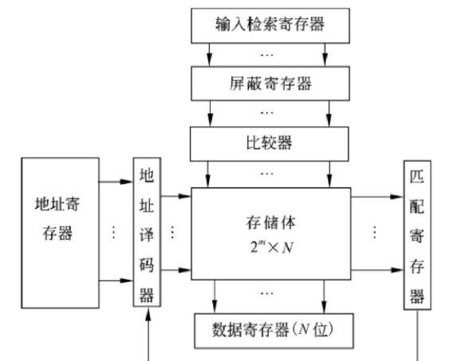

<!-- p10 -->
#### 2.2.3．高速缓存

- 高速缓存的组成部分:
    - 控制部分、存储部分
- 高速缓存中的地址映像方法
    - **直接映像**： 指**主存的块与Cache块的对应关系**是**固定**的。优点是地址变换简单，缺点是灵活性差、Cache块冲突率高。
    - **全相联映像**： **允许主存的任一块可以调入Cache存储器的任何一个块的空间中** 。优点是Cache块冲突率低、灵活性好，缺点是访问速度慢、地址变换较复杂、成本太高。
    - **组相联映像**： 是前两种方式的折中方案，即组采用直接映像方式、块采用全相联映像方式。
    - **发生块冲突从少到多的顺序：全相联映射-->组相联映射-->直接映射**
- 替换算法:
    - 随机替换算法、先进先出算法、近期最少使用算法、优化替换算法
- 性能分析
    - 命中率是Cache的一个重要指标，但不是最主要的指标
    - Cache的命中率与Cache容量的关系是：容量越大，命中率越高
- 多级Cache
    - 在多级Cache计算机中分为一级(L1Cache)，二级(L2Cache)等

### 2.2.4．虚拟存储器

虚拟存储器技术是把很大的程序(数据)分成许多较小的块，全部存储在辅存中。运行时把要用到的程序(数据)块先调入主存，并且马上就要用到的程序块从主存调入高速缓存。这样就可以一边运行程序，一边进行所需程序(数据)块的调进或调出。

- 虚拟存储器管理方式：段式虚拟存储器、页式虚拟存储器、段页式虚拟存储器

### 2.2.5．外存储器

- 磁表面存储器
    - 磁盘存取速度较快，具有较大的存储容量，是目前广泛使用的外存储器。硬盘就是最常见的外存储器
- 光盘存储器
    - 是一种采用聚焦激光束在盘式介质上非接触地记录高密度信息的新型存储装置
    - 根据性能和用途分为:
        - 只读型光盘(CD-ROM)、只写一次型光盘(WORM)、可擦除光盘
- 固态硬盘
    - 存储介质
        - 闪存(FLASH芯片)
        - DRAM
    - 具有传统机械硬盘不具备的读写快速，质量轻，能耗抵以及体积小等特点，但其价格仍较昂贵，容量较地，一旦硬件损坏，数据较难恢复

<!-- p11 -->
#### 2.2.6．磁盘阵列技术

磁盘阵列是由多台磁盘存储器组成的一个快速，大容量，高可靠的外村子系统，常见的盘阵列称为廉价冗余磁盘阵列(RAID)。

## 2.3．输入输出技术

### 2.3.1．直接程序控制

直接程序控制是指外设数据的**输入**/**输出过程**是**在CPU执行程序的控制下完成**的。直接程序控制的两种情况:

- **程序查询方式**
    - 在此情况下，利用查询方式进行输入/输出，就是通过CPU执行程序来查询外设的状态，判断外设是否准备好接受数据或准备好向CPU输入数据
    - 两大缺点
        - 降低了CPU的效率
        - 对外部的突发事件无法做出实时响应
- **无条件传送**
    - 在此情况下，外设总是准备好的，它可以无条件地随时接受CPU发来的输出数据，也能够无条件地随时向CPU提供需要的输入数据

### 2.3.2．中断方式

中断方式即由程序控制I/O的方法，缺点在于CPU必须等待I/O系统完成数据的传输任务，而且要定期查询I/O系统的状态，确认传输是否完成。因此大大降低了整个系统的性能。

a．中断处理方法：多中断信号线法、中断软件查询法、菊花链法、总线仲裁法、中断向量表法

b．中断优先级控制:

- 当不同优先级的多个中断源同时提出中断请求时，CPU应优先响应优先级最高的中断源
- 当CPU在对某一个中断源服务时，有比它优先级更高的中断源提出中断请求，CPU应暂时中断正在执行的中断服务程序而转去对优先级更高的中断源服务，结束后再回到之前被中断的优先级较低的中断源服务程序继续执行，这种情况称为中断嵌套，即一个中断服务程序中嵌套着另一个中断服务程序

### 2.3.3．直接存储器存储方式

直接内存存取（DMA）是指数据在内存与I/O设备间的直接成块传送，即在内存与IO设备间传送一个数据块的过程中，**不需要CPU的任何干涉**，只需要CPU在过程开始启动（即向设备发出"传送一块数据"的命令）与过程结束（CPU通过轮询或中断得知过程是否结束和下次操作是否准备就绪）时的处理，实际操作由DMA硬件直接执行完成，CPU在此传送过程中可做别的事情。

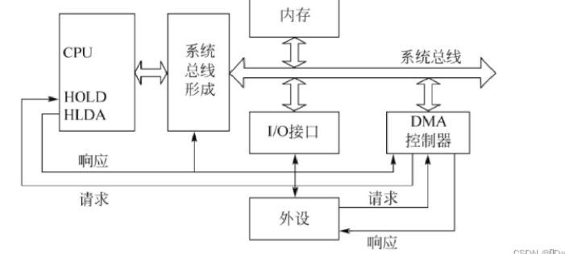

<!-- p12 -->
### 2.4．总线结构

一般来说，任何连接两个以上电子元器件的导线都可以称为总线。微机中的总线分为**数据总线**、**地址总线**、**控制总线**。

- **数据总线（DB）**： 用来**传送数据信息**，是**双向**的。CPU既可以通过DB从内存或输入设备读入数据，也可以通过DB将内部数据送至内存或输出设备。DB的宽度决定了CPU和计算机其他设备之间每次交换数据的位数。
- **地址总线（AB）**： 用于**传送CPU发出的地址信息**，是单向的。传送地址总线的目的是指明与CPU交换信息的内存单元或I/O设备，地址总线的宽度决定了CPU的最大寻址能力。
- **控制总线（CB）**： 用来**传送控制信号、时序信号和状态信息等**，**双向线表示**。其中有的信号是CPU向内存或外部设备发出的信息，有的信号是内存或外部设备向CPU发出的信息。CB中的每一条线的信息传送方向是单方向且确定的，但CB作为一个整体则是双向的。

## 3．计算机安全

计算安全指的是计算机资产安全，是要保证这些计算机资产不受自然和人为的有害因素的威胁和危害。

### 3.1．安全威胁

| 威胁 | 说明 |
| --- | --- |
| 授权侵犯 | 为某一特权使用一个系统，却将该系统用作其他未授权的目的 |
| 拒绝服务 | 对信息或其他资源的合法访问被无条件地拒绝，或者推迟与时间密切相关的操作 |
| 窃听 | 信息从被监视的通信过程中泄露出去 |
| 信息泄露 | 信息被泄露或暴露给某个未授权的实体 |
| 截获/修改 | 某一通信数据项在传输过程中被改变、删除或替代 |
| 假冒 | 一个实体（人或系统）假装成另一个实体 |
| 否认 | 参与某次通信交换的一方否认曾发生过此次交换 |
| 非法使用 | 资源被某个未授权的人或未授权的方式使用 |
| 人员疏忽 | 一个授权的人为了 金钱或利益，或者由于粗心将信息泄露给未授权的人 |
| 完整性破坏 | 通过对数据进行未授权的创建、修改或破坏，使数据的一致性受到损坏 |
| 媒体清理 | 从废弃的或打印过的媒体中获得信息 |
| 物理入侵 | 一个入侵者通过物理控制而获得对系统的访问 |
| 资源耗尽 | 某一资源（如访问端口）被故意超负荷使用，导致其他用户的服务被中断 |

<!-- p13 -->
### 3.2．加密技术和认证技术

#### 3.2.1．加密技术

对称加密(私有密钥加密)、非对称加密(公开密钥加密)

a．**对称加密（私钥/私有密钥）** 算法： **DES、3DES、RC-5、IDEA、AES、RC4**

- 数据加密标准(DES)：主要采用替换和移位的方法加密
- 三重DES(DES,又称TDEA)：在DES的基础上采用三重DES，效果相当于将密钥的长度加倍
- RC-5：RC-5是在RCF2040中定义的，RSA数据安全公司的很多产品都在使用RC-5
- 国际数据加密算法(IDEA)：在DES算法的基础上发展起来的，类似于3重DES
- 高级加密标准(AES)：基于排列和置换运算。排列是对数据重新进行安排，置换是将一个数据单元替换为另一个数据单元

b．**非对称加密（公钥/公开密钥）** 算法： **RSA、ECC、DSA**
与对称加密算法不同，非对称加密算法需要两个密钥：公开密钥和私有密钥。两者是一对，如果用公开密钥对数据进行加密，只有用对应的私有密钥才能解密；如果用私有密钥对数据进行加密，只有用对应的公开密钥才能解密。

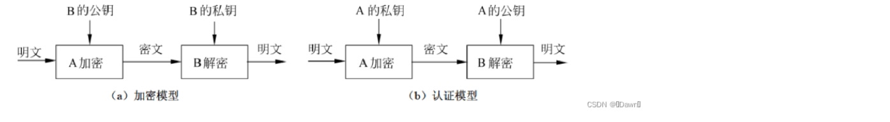

#### 3.2.2．认证技术

**摘要**：将发送的明文进行Hash算法后得到摘要放在密文后一起发送过去，与接收方解密后的明文进行相同的Hash算法得到的摘要进行对比如果一致，则没有篡改，否则有篡改

**数字签名**：发送方用自己的私钥对摘要进行签名（加密）得到数字签名放在密文后一起发送过去，接收方用发送方的公钥对数字签名进行验证（解密）如果验证成功则该消息没有被假冒且不能否认否则该消息的真实性为假冒发送

- **数字签名**是用**私钥签名**， **公钥验证**，一般是对**信息摘要**进行**签名**
- 数字签名是**非对称加密算法**的一种方法来**保证信息不**会**被篡改**

数字证书：

- CA：权威机构
- 用户向CA机构申请数字证书将个人信息和公钥发给CA机构，CA机构颁给用户数字证书， **数字证书**用**CA的私钥**进行签名 （加密），用**CA的公钥验证** （解密）数字证书**得到用户的公钥**
- **数字证书**主要是用来对用户**身份进行认证**，而**数字签名**主要用于**确保消息不可被否认**

<!-- p14 -->
### 3.3．计算机可靠性

#### 3.3.1．串联系统可靠性（R）与失效率（λ）

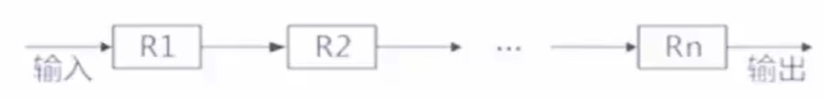

$$R = R_1 \times R_2 \times ... \times R_n$$

$$\lambda = \lambda_1 + \lambda_2 + ... + \lambda_n$$

#### 3.3.2．并联系统可靠性（R）与失效率（μ）

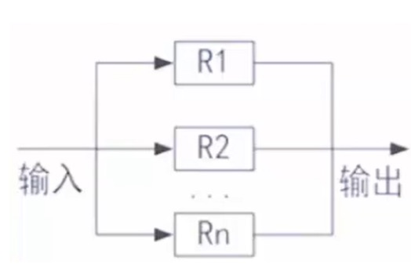

$$R = 1-(1-R_1)\times(1-R_2)\times...\times(1-R_n)$$

$$\mu = \dfrac{1}{\dfrac{1}{\lambda}\sum_{j=1}^{n}\dfrac{1}{j}}$$

### 3.4．计算机系统的性能评价

常用方法：时钟频率、指令执行速度、等效指令速度法、数据处理速率

<!-- p15 -->
# 程序设计语言基础

## 1．程序设计语言概述

程序设计语言是为了书写计算机程序而人为设计的符号语言，用于对计算过程进行描述、组织和推导

### 1.1．程序设计语言的基本概念

- 低级语言与高级语言
    - 低级语言：机器语言（计算机硬件只能识别0和1的指令序列），如汇编语言
- 高级语言：功能更强，抽象级别更高，与人们使用的自然语言比较接近，常见的有Java, C, C++, PHP, Python, Delphi等
- 各程序设计语言特点:
    - Fortran语言（**科学计算**，执行效率高）
    - Pascal语言（为**教学**而开发的，表达能力强，Delphi）
    - C语言（**指针操作**能力强，高效）
    - Lisp语言（**函数式程序**语言，符号处理，人工智能）
    - C++语言（**面向对象**，高效）
    - Java语言（**面向对象**，中间代码， **跨平台**）
    - C#语言（**面向对象**，中间代码， **.Net**）
    - Prolog语言（逻辑推理，简洁性，表达能力， **数据库和专家系统**）
- 解释与编译：都是将高级语言翻译成计算机硬件认可的机器语言加以执行。不同之处在于:
    - **编译**程序**生成**独立的**可执行文件**，直接运行，运行时无法控制源程序，效率高。
    - **解释**程序**不生成**可执行文件，可以遂条解释执行，用于调试模式，可以控制源程序，因为还需要控制程序，因此执行速度慢，效率低。
- 程序设计语言的定义：语法（一组规则）、语义（语法成分的含义）、语用（构成语言的各个记号和使用者的关系）

### 1.2．程序设计语言的基本成分

- 数据：常量和变量、全局量和局部量、数据类型
- 运算：算式运算、关系运算、逻辑运算
- 控制：顺序结构、选择结构、循环结构
- 传输：赋值、输入、输出
- 函数：定义、声明、调用： **传值(值调用)** 、**传地址(引用调用)**
    - **传值**调用：将实参的值传递给形参，实参可以是变量、常量和表达式。**不可以实现形参和实参间双向传递数据**的效果。
    - **传引用（地址）**调用：将实参的地址传递给形参，形参必须有地址，实参不能是常量（值）、表达式。可以实现形参和实参间双向传递数据的效果，即**改变形参的值同时也改变了实参的值**。

<!-- p16 -->
## 2．语言处理程序基础

语言处理程序式一类系统软件的总称，其主要作用是将高级语言或汇编语言编写的程序翻译成某种机器语言程序，使程序能在计算机上运行。

### 2.1．编译程序基本原理

#### 2.1.1．编译方式与解释方式

编译方式：词法分析、语法分析、语义分析、中间代码生成、代码优化、目标代码生成。

解释方式：词法分析、语法分析、语义分析。

编译器和解释器都不可省略词法分析、语法分析、语义分析且顺序不可交换。

编译方式中中间代码生成和代码优化不是必要的， **可省略**。

- 词法分析：
    - 输入：源程序
    - 输出：记号流
    - 词法分析阶段的主要作用是分析构成程序的字符及由字符按照构造规则构成的符号是否符合程序语言的规定
- 语法分析：
    - 输入：记号流
    - 输出：语法树(分析树)
    - 语法分析阶段的主要作用是对各条语句的结构进行合法性分析分析程序中的句子结构是否正确
    - **语法分析阶段可以发现程序中所有的语法错误**
- 语义分析：
    - 输入：语法树(分析树)
    - 语义分析阶段的主要作用是进行类型分析和检查语义分析阶段不能发现程序中所有的语义错误
    - 语义分析阶段可以发现静态语义错误
    - 不能发现动态语义错误，动态语义错误运行时才能发现
        - **有语义错误是可以编译成功的**，例如a/0；这是符合语法的，也符合静态语义，编译器检验不出来这个是错的，只有运行才会报错，也就是动态语义，动态语义错误常见的有死循环

目标代码生成阶段的工作与具体的机器密切相关寄存器的分配处于目标代码生成阶段

#### 2.1.2．后缀式

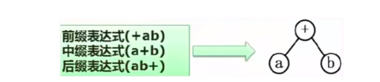

主要掌握上述三种表达式即可，其实就是树的三种遍历，一般正常的表达式是中序遍历，即中缀表达式，根据其构造出树，再按题目要求求出前缀或后缀式

简单求法：后缀表达式是从左到右开始，先把表达式加上括号，再依次把运算符加到本层次的括号后面

<!-- p17 -->
#### 2.1.3．文法定义

$$G=\{V_t,V_n,S,P\}$$

- $V_t$：非空有限集合的符号，它的每个元素称为终结符号
- $V_n$：非空有限集合的符号，它的每个元素称为非终结符号
- S：文法G的开始符号
- P：非空有限集合，它的元素称为产生式
  正则闭包：$A^+ = A^1 \cup A^2 \cup A^3 \cup ... \cup A^n \cup ...$ (也就是所有幂的组合)
  闭包：$A^* = A^0 \cup A^+$(在正则闭包的基础上，加上$A^0 = \{\varepsilon\}$)
  例如：$ab^* = \{ab,abab,ababab,...,\varepsilon\}$

| 类型 | 别称 | 说明 | 对应自动机 |
| --- | --- | --- | --- |
| 0型 | 短语文法 | G的每一条产生式$\alpha \longrightarrow \beta$满足$\alpha$属于V的正则闭包且至少含有一个非终结符，而$\beta$属于V的闭包 | 图灵机 |
| 1型 | 上下文有关文法 | G的任何产生式$\alpha \longrightarrow \beta$满足$\vert\alpha\vert<=\vert\beta\vert$，仅仅$S \longrightarrow \varepsilon$例外，但S不得出现在任何产生式右部 | 线性界限自动机 |
| 2型 | **上下文无关文法** | G的任何产生式$A \longrightarrow \beta$，A为非终结符，$\beta$为V的闭包 | 非确定的下推自动机 |
| 3型 | 正规文法 | G的任何产生式$A \longrightarrow \alpha B$或$A \longrightarrow \alpha$，$\alpha$属于非终结符的闭包，A,B都属于非终结符 | 有限自动机 |

#### 2.1.4．有限自动机

计算机控制系统的控制程序具有有限状态(FA)的特征，可以用有限状态机理论来描述。$M = \{S,\Sigma, \delta,s0,Z\}$

- S：是一个有限集，每个元素为一个状态
- $\Sigma$：是一个有穷字母表，每个元素为一个输入字符
- $\delta$：是转换函数：是一个单值对照
- s0：属于S，是其唯一的初态
- Z：是一个终态集(可空)

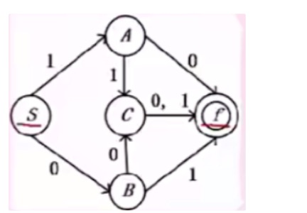

- 主要有五个符号集，由上图示例，可知用状态来表示十分清晰，由s输入一个0，可得出B，依次类推，一般考试，给出一个状态图，问能否构造出001这样的字符串，解决方法就是从起始s到终点f之间是否有一条路，权值为001。本质就是有向图从起点到终点的遍历。

<!-- p18 -->
- 确定的有限自动机和不确定的有限自动机：**输入一个字符，看是否能得出唯一的后继**，若**能**，则是**确定的**，否则若**得出多个后继**，则是**不确定的**。

### 2.1.5．正规表达式

对于字母表$\Sigma$，其上的正规式及其表示的正规集可以递归定义如下:

1. $\varepsilon$是一个正规式，它表示的集合$L(\varepsilon)=\{\varepsilon\}$
2. 若a是$\Sigma$上的字符，则a，是一个正规式，它所表示的正规集为$\{a\}$
3. 若正规式a和s分别表示正规集L(a)和L(s)，则：

- a|s是正规式，表示集合$L(a)\cup L(s)$
- a●s是正规式，表示集合$L(a)L(s)$
- $a^*$是正规式，表示集合$(L(a))^*$
- (a)是正规式，表示集合L(a)

在正规式的书写中，连接运算符"●"可以省略。运算符的优先级从高到低为"*","●","|"。

### 2.1.6．语法分析方法

- 自上而下语法分析：最左推导，从左至右。给定文法G和源程序串r。从G的开始符号s出发，通过反复使用产生式对句型中的非终结符进行替换(推导)，逐步推导出r。
- **递归下降**思想：原理是利用函数之间的递归调用模拟语法树自上而下的构造过程，是一种**自上而下的语法分析方法**
- 自下而上语法分析：最右推导，从右至左。从给定的输入串r开始，不断寻找子串与文法G中某个产生式P的候选式进行匹配，并用P的左部代替(归约)之，逐步归约到开始符号S
- **移进-规约**思想：设置一个栈，将输入符号逐个移进栈中，栈顶形成某产生式的右部时，就用左部去代替，称为归约。很明显，这个思想是通过右部来推导出左部，因此是**自下而上语法分析**的核心思想

<!-- p19 -->
# 标准化和知识产权

## 1．标准化基础知识

### 1.1．标准的分类

- 国际标准：ISO、IEC等国际标准化组织
- 国家标准：GB-中国、ANSI-美国、BS-英国、JIS-日本
- 区域标准：又称为地区标准，如PASC-太平洋地区标准会议、CEN-欧洲标准委员会、ASAC-亚洲标准咨询委员会、ARSO-非洲地区标准化组织
- 行业标准：GJB-中国军用标准、MIT-S-美国军用标准、IEEE-美国电气电子工程师协会
- 地方标准：国家的地方一级行政机构制订的标准
- 企业标准
- 项目规范

### 1.2．标准的编号

- 国际：标准代号 + 专业类号 + 顺序号 + 年代号
- 我国标准代号及编号：强制性国家标准代号为GB，推荐性国家标准代号为GB/T，指导性国家标准代号为GB/Z，国家实物标准代号GSB
- 行业标准代号一般由汉语拼音大写字母组成，如汽车QC等
- 地方标准代号由大写汉语拼音DB加上省级行政区划代码的前两位组成
- 企业标准代号由"Q/"加上企业代号组成

<!-- p20 -->
## 2．知识产权基础知识

### 2.1．知识产权的基本概念

#### 2.1.1．保护期限

| 客体类型 | 权力类型 | 保护期限 |
| --- | --- | --- |
| 公民作品 | 署名权、修改权、保护作品完整权 | 没有限制 |
| 公民作品 | 发表权、使用权和获得报酬权 | 作者终生及其死亡后的50年（第50年的12月31日） |
| 单位作品 | 发表权、使用权和获得报酬权 | 50年（首次发表后的第50年的12月31日），若其间未发表，不保护。 |
| 公民软件产品 | 署名权、修改权 | 没有限制 |
| 公民软件产品 | 发表权、复制权、发行权、出租权、信息网络传播权、翻译权、使用许可权、获得报酬权、转让权 | 作者终生及死后50年（第50年12月31日）。合作开发，以最后死亡作者为准。 |
| 单位软件产品 | 发表权、复制权、发行权、出租权、信息网络传播权、翻译权、使用许可权、获得报酬权、转让权 | 50年（首次发表后的第50年的12月31日），若其间未发表，不保护 |
| 注册商标 |  | 有效期10年（若注册人死亡或倒闭1年后，未转移则可注销，期满后6个月内必须续注） |
| 发明专利权 |  | 保护期为20年（从申请日开始） |
| 实用新型和外观设计专利权 |  | 保护期为10年（从申请日开始） |
| 商业秘密 |  | 不确定，公开后公众可用 |

#### 2.1.2．知识产权人的确定

##### 2.1.2.1．单位开发

单位和个人的著作权归属情况如下:

| 情况说明 |  | 判断说明 | 归属 |
| --- | --- | --- | --- |
| 作品 | 职务作品 | 利用单位的物质技术条件进行创作，并由单位承担责任的 | 除署名权外其他著作权归单位 |
| 作品 | 职务作品 | 有合同约定，其著作权属于单位 | 除署名权外其他著作权归单位 |
| 作品 | 职务作品 | 其他 | 作者拥有著作权，单位有权在业务范围内优先使用 |
| 软件 | 职务作品 | 属于本职工作中明确规定的开发目标 | 单位享有著作权 |
| 软件 | 职务作品 | 属于从事本职工作活动的结果 | 单位享有著作权 |
| 软件 | 职务作品 | 使用了单位资金、专用设备、未公开的信息等物质、技术条件，并由单位或组织承担责任的软件 | 单位享有著作权 |
| 专利权 | 职务作品 | 本职工作中作出的发明创造 | 单位享有专利 |
| 专利权 | 职务作品 | 履行本单位交付的本职工作之外的任务所作出的发明创造 | 单位享有专利 |
| 专利权 | 职务作品 | 离职、退休或调动工作后1年内，与原单位工作相关 | 单位享有专利 |

##### 2.1.2.2．委托开发

单位和委托的区别在于，当合同中未规定著作权的归属时，著作权默认归于单位，而委托创作中，著作权默认归属于创作方个人，具体如下:

<!-- p21 -->
| 情况说明 |  | 判断说明 | 归属 |
| --- | --- | --- | --- |
| 作品软件 | 委托创作 | 有合同约定，著作权归委托方 | 委托方 |
| 作品软件 | 委托创作 | 合同中未约定著作权归属 | 创作方 |
| 作品软件 | 合作开发 | 只进行组织、提供咨询意见、物质条件或者进行其他辅助工作 | 不享有著作权 |
| 作品软件 | 合作开发 | 共同创作的 | 共同享有，按人头比例。成果可分割的，可分开申请。 |
| 商标 |  | 谁先申请谁拥有（除知名商标的非法抢注）<br>同时申请，则根据谁先使用（需提供证据）<br>无法提供证据，协商归属，无效时使用抽签（但不可不确定） |  |
| 专利 |  | 谁先申请谁拥有<br>同时申请则协商归属，但不能够同时驳回双方的专利申请 |  |

#### 2.1.3．侵权判定

中国公民、法人或者其他组织的作品，不论是否发表，都享有著作权。开发软件所用的思想、处理过程、操作方法或者数学概念不受保护。

- 著作权法不适用于下列情形:
    - 法律、法规、国家机关的决议、决定、命令和其他具有立法、行政、司法性质的文件，及其官方正式译文
    - 时事新闻
    - 历法、通用数表、通用表格和公式

| 不侵权 | 侵权 |
| --- | --- |
| ✓ 个人学习、研究或者欣赏； | ✓ 未经许可，发表他人作品； |
| ✓ 适当引用； | ✓ 未经合作作者许可，将与他人合作创作的作品当作自己单独创作的作品发表的； |
| ✓ 公开演讲内容 | ✓ 未参加创作，在他人作品署名； |
| ✓ 用于教学或科学研究 | ✓ 歪曲、篡改他人作品的； |
| ✓ 复制馆藏作品； | ✓ 剽窃他人作品的； |
| ✓ 免费表演他人作品； | ✓ 使用他人作品，未付报酬； |
| ✓ 室外公共场所艺术品临摹、绘画、摄影、录像； | ✓ 未经出版者许可，使用其出版的图书、期刊的版式设计的。 |
| ✓ 将汉语作品译成少数民族语言作品或盲文出版。 |  |

#### 2.1.4．其他法律细则

- 商业秘密
    - 构成条件：未公开、能为权利人带来利益、保密性
    - 商业秘密无固定的保护时间，一般由企业自行规定。且不能延长
- 专利权
    - 期限：发明专利权保护期限为自申请日起20年；实用新型专利权和外观设计专利权保护期限为自申请日起10年
    - 专利权谁先申请就归谁，若同一天申请，则双方协商或者以抽签方式决定
- 商标权
    - 必须使用注册商标的商品范围包括：国家规定并由国家工商行政管理局公布的人用药品和烟草制品、国家规定并由国家工商行政管理局公布的其他商品
    - 商标权认定方式与专利权类似，也是谁先申请就归谁，如果同一天申请，则谁先使用该商标就归谁，若都未使用或同时使用，则由双方协商或者以抽签方式决定（比专利权多一个使用判断）
    - "近似商标"是指文字、数字、图形、三维标志或颜色组合等商标的构成要素的发音、视觉、含义或排列顺序及整体结构上虽有一定区别，但又使人难以区分，容易产生混淆的商标。会产生商标侵权，故不能同时注册。由双方协商决定，协商未果后采用抽签方式决定

<!-- p22 -->
- 引用资料
    - 只能引用发表的作品，不能引用未发表的作品;只能限于介绍、评论作品；只要不构成自己作品的主要部分，可适当引用资料；不必征得原作者的同意，不需要向他支付报酬

<!-- p23 -->
# 数据库技术基础

## 1．基本概念

### 1.1．数据库与数据库管理系统

- 数据库系统（DBS）： 从广义上讲是由数据库、硬件、软件和人员组成的，其中管理的对象是数据
    - 数据库（DB）： 是指长期存储在计算机内的、有组织的、可共享的数据集合
    - 硬件：是指构成计算机系统的各种物理设备，包括存储数据所需的外部设备
    - 软件：包括操作系统、数据库管理系统及应用程序
    - 人员：系统分析员和数据库设计人员、应用程序员、最终用户、数据库管理员（DBA）

### 1.2．DBMS 的功能

- 主要功能：数据定义，数据库操作，数据库运行管理，数据组织、存储和管理，数据库的建立和维护
- 其他功能：如DBMS在网络中与其他软件系统的通信功能，一个DBMS 与另一个DBMS或文件系统的数据转换功能等

### 1.3．DBMS 的特征与分类

- DBMS 的特征：数据结构化且统一管理、有较高的数据独立性、数据控制功能
- DBMS 的分类：关系数据库系统（RDBS）、面向对象的数据库系统（OOBS） 、对象关系数据库系统（ORDBS）

### 1.4．数据库的三级模式结构

#### 1.4.1．模式结构

数据库系统采用三级模式结构，这是数据库管理系统内部的系统结构

- **概念模式**。也称**模式**，是**数据库中全体数据的逻辑结构和特征的描述**，它由若干个概念记录类型组成，只涉及行的描述，不涉及具体的值
- **外模式**。也称**用户模式或子模式**，是**用户与数据库系统的接口**，是用户用到的那部分数据的描述，由若干个外部记录类型组成
- **内模式**。也称**存储模式**，是**数据物理结构和存储方式的描述**，是数据在数据库内部的表示方式，定义所有的内部记录类型、索引和文件的组织方式以及数据控制方面的细节

#### 1.4.2．两级映像

数据库系统在三级模式之间提供了两级映像，即模式/内模式映像和外模式/模式映像

- **模式/内模式映像**。该映像存在于**概念级和内部级**之间，实现了**概念模式到内模式**之间的相互转换。（**物理独立性**）
- **外模式/模式映像**。该映像存在于**外部级和概念级**之间，实现了**外模式到概念模式**之间的相互转换。（**逻辑独立性**）

<!-- p24 -->
## 2．数据模型

### 2.1．数据模型的基本概念

- 概念数据模型。也称信息模型，是按用户的观点对数据和信息建模，是现实世界到信息世界的第一层抽象，强调其语义表达功能，易于用户理解，是用户和数据库设计人员交流的语言，主要用于数据库设计。这类模型中最著名的是实体联系模型，简称E-R模型
- 基本数据模型。它是按计算机系统的观点对数据建模，是现实世界数据特征的抽象，用于DBMS的实现。基本的数据模型有层次模型、网状模型、关系模型和面向对象模型(OOM)

### 2.2．数据模型的三要素

数据模型是用来描述数据的一组概念和定义。**数据模型的三要素**是**数据结构、数据操作、数据的约束条件**。

- **数据结构**：是所**研究的对象类型的集合**，是对系统静态特性的描述。
- **数据操作**：是对数据库中各种对象(型)的实例(值)允许执行的**操作集合**，包括操作及操作规则。数据操作是对系统动态特性的描述。
- **数据的约束条件**：是一组**完整性规则的集合**。也就是说，对于具体的应用数据必须遵循特定的语义约束条件，以保证数据的正确、有效、相容。

### 2.3．E-R 模型

实体-联系模型简称E-R模型，所采用的3个主要概念是实体、联系和属性。E-R模型是软件工程设计中的一个重要方法，因为它接近于人的思维方式，容易理解并且与计算机无关，所以用户容易接受。一般遇到实际问题，应先设计一个E-R模型，然后再把它转换成计算机能接受的数据模型

- **实体**：是**现实世界中可以区别于其他对象的"事件"或"物体"**。每个实体由一组特性（属性）来表示，其中的某一部分属性可以唯一表示实体。实体集是具有相同属性的实体集合
- **联系**： **实体集之间的对应关系**称为联系。实体的联系分为实体内部的联系和实体与实体之间的联系。实体集内部的联系反映数据在同一记录内部各字段间的联系。而实体集之间的联系类型有:
    - **一对一联系**：如果对于实体集A中的每一个实体，实体集B中至多有一个实体与之联系；反之亦然，则称实体集A与实体集B具有一对一联系。记为1：1
    - **一对多联系**：如果对于实体集A中的每一个实体，实体集B中有n个实体(n≥0)与之联系；反之，对于实体集B中的每一个实体，实体集A中至多只有一个实体与之联系，则称实体集A与实体集B有一对多联系。记为1：n
    - **多对多联系**：如果对于实体集A中的每一个实体，实体集B中有n个实体(n≥0)与之联系；反之，对于实体集B中的每一个实体，实体集A中也有m个实体(m≥0)与之联系，则称实体集A与实体集B具有多对多联系。记为m ：n
- **属性**：是**实体某方面的特性**。在同一实体集中，每个实体的属性及其域是相同的，但可能取不同的值。E-R模型中的属性有以下分类:
    - 简单属性和复合属性
        - 简单属性是原子的、不可再分的
        - 复合属性可以细分为更小的部分(即划分为别的属性)
    - 单值属性和多值属性
        - 若定义的属性对于一个特定的实体只有一个值，这样的属性叫做单值属性

<!-- p25 -->
        - 若定义的属性对应一组值，则称为多值属性
    - NULL属性：当实体在某个属性上没有值或属性值未知时，使用NULL值，表示无意义或不知道
    - 派生属性：可以从其他属性得来
- **E-R 方法**：概念模型中最常用的方法是实体-模型方法，简称E-R方法。该方法直接从现实世界中抽象出实体和实体间的联系，然后用非常直观的E-R图来表示数据模型。在E-R图中主要构件如下:

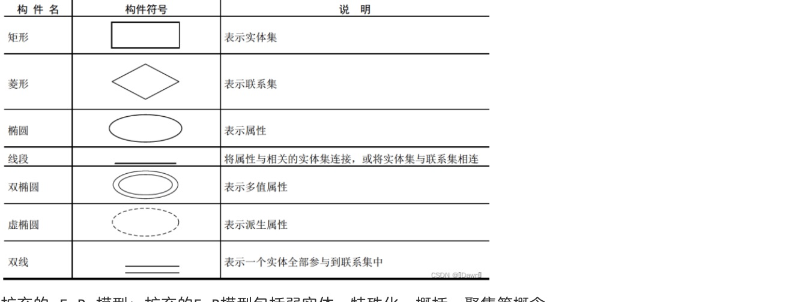

- 扩充的 E-R 模型：扩充的E-R模型包括弱实体、特殊化、概括、聚集等概念

## 3．关系代数

### 3.1．关系数据库的基本概念

- 属性和域：在现实世界中，要描述一个事物，常常取其若干特征来表示。这些**特征称为属性**。每个**属性**的**取值范围的集合**，称**为该属性的域**。一般在关系数据库模型中，对域还加了一个限制，所有的域都应是原子数据的集合。关系数据模型的这种限制称为第一范式(1NF)条件。如果关系数据模型突破了1NF的限制，则称为非1NF的。
- 笛卡儿积和关系

  【定义9-1】 设$D_1, D_2, \cdots, D_n$为任意集合，定义$D_1, D_2, \cdots, D_n$的笛卡儿积为
  $$D_1 \times D_2 \times \cdots \times D_n = \{(d_1,d_2,\cdots,d_n) \mid d_i \in D_i, i=1,2,\cdots,n\}$$
  其中，每一个元素$(d_1，d_2，\cdots，d_n)$叫做一个 $n$ 元组，元组的每一个值 $d_i$ 叫做元组的一个分量，若 $D_i(i=1, 2, \cdots, n)$为有限集，其基数为 $m_i(i=1, 2, \cdots, n)$，则 $D_1\times D_2\times\cdots\times D_n$的基数 $M$ 为
  $$M = \prod_{i=1}^{n}m_i$$
  笛卡儿积可以用二维表来表示。
  【定义9-2】 $D_1\times D_2\times\cdots\times D_n$的子集叫做在域 $D_1, D_2, \cdots, D_n$上的关系，记为
  $$R(D_1,D_2,\cdots,D_n)$$
  称关系 $R$ 为 $n$ 元关系。

    - 一个关系可以用二维表来表示。关系中属性个数称为元数，元组的个数称为基数
- 关系的相关名词:
    - 目或度：常用R表示关系的名字，n表示关系的目或度
    - **候选码**：若关系中的某一**属性或属性组**的值能**唯一标识**一个元组，则称该属性或属性组为候选码
    - **主码**：若一个关系有**多个候选码**，则**选定其中一个**为主码
    - **主属性**：所有候选码都是主属性，其他都是非主属性
    - **外码**：如果关系模式R中的属性或属性组非该关系的码，但它是其他关系的码，那么该属性集对关系模式R而言是外码
<!-- p26 -->
  - 全码：关系模式的 **所有属性组是这个关系模式的候选码**，称为全码
- 关系的三种类型：
  - 基本关系(通常又称为基本表、基表)：这是实际存在的表，它是实际存储数据的逻辑表示
  - 查询表：查询结果对应的表
  - 视图表：这是由基本表或其他视图表导出的表。由于它本身不独立存储在数据库中，数据库中只存放它的定义，所以常称为虚表
- **关系数据库模式**

【定义9-3】 关系的描述称为关系模式。可以形式化地表示为

$$R(U,D,dom,F)$$

式中：R为关系名；U为组成该关系的属性名集合；D为属性的域；dom为属性向域的映射集合；F为属性间数据的依赖关系集合。

通常将关系模式简记为

$$R(U)或R(A_1,A_2,\cdots,A_n)$$

式中：R为关系名；$A_1,A_2,\cdots,A_n$为属性名或域名，属性向域的映像常常直接说明属性的类型、长度。通常在关系模式主属性上加下划线表示该属性为主码性质。

- **完整性约束**：
  - **实体完整性**： 规定基本关系R的主属性A不能取空值
  - **参照完整性**： 参照完整性规定，若F是基本关系R的外码，它与基本关系S的主码相对应(基本关系R和S不一定是不同的关系)，则对于R中每个元组在F上的值必须为：或者取空值(F的每个属性值均为空值)，或者等于S中某个元组的主码值
  - **用户自定义完整性**： 就是针对某一具体的关系数据库的约束条件，反映某一具体应用所涉及的数据必须满足的语义要求，由应用的环境决定
- **关系运算**

| 类别 | 运算符 | 含义 |
|---|---|---|
| 集合运算符 | ∪ | 并 |
| 集合运算符 | − | 差 |
| 集合运算符 | ∩ | 交 |
| 集合运算符 | × | 笛卡儿积 |
| 专门的关系运算符 | σ | 选择 |
| 专门的关系运算符 | π | 投影 |
| 专门的关系运算符 | ⋈ | 连接 |
| 专门的关系运算符 | ÷ | 除 |

| 类别 | 运算符 | 含义 |
|---|---|---|
| 比较运算符 | > | 大于 |
| 比较运算符 | ≥ | 大于等于 |
| 比较运算符 | < | 小于 |
| 比较运算符 | ≤ | 小于等于 |
| 比较运算符 | = | 等于 |
| 比较运算符 | ≠ | 不等于 |
| 逻辑运算符 | ¬ | 非 |
| 逻辑运算符 | ∧ | 与 |
| 逻辑运算符 | ∨ | 或 |

## 3.2．5种基本的关系代数运算

- 并：关系R与S具有相同的关系模式，即R与S的元数相同(结构相同)。关系R和关系S的并由 **属于R或属于S** 的元组构成的集合组成，记作 $R \cup S = \{t \mid t \in R \vee t \in S\}$，式中，t为元组变量
- 差：关系R与S具有相同的关系模式。关系R与S的差由属于R但不属于S的元组构成的集合组成，记作 $R - S = \{t \mid t \in R \wedge t \notin S\}$，式中，t为元组变量
- 广义笛卡尔积：两个元数分别为n目和m目的关系R和S的广义笛卡儿积是一个 n+m 列的元组的集合。元组的前 n 列是关系R的一个元组，后 m 列是关系S的一个元组。若R有k₁个元组，S有k₂个元组，则关系R和S的广义笛卡儿积有 k₁ × k₂ 个元组。记作 $R \times S = \{t \mid t = <t^n,t^m> \wedge t^n \in R \wedge t^m \in S\}$
- 投影：从关系的 **垂直方向** 进行运算，在 **关系R中选择出若干属性列A组成新的关系**。记作 $\prod_A(R) = \{t[A] \mid t \in R\}$

<!-- p27 -->
- 选择：从关系的 **水平方向** 进行运算，是从关系R中选择满足给定条件的诸元素，记作 $\sigma_F(R) = \{t \mid t \in R \wedge F(t) = true\}$，式中，F中的运算对象是属性名(或列的序号)或常数，运算符是算术比较符和逻辑运算符

【例9.4】 设有关系R、S如下所示，请求出 $R\cup S$、$R-S$、$R\times S$、$\pi_{A,C}(R)$、$\sigma_{A>B}(R)$ 和 $\sigma_{3<4}(R\times S)$。

关系R：

| A | B | C |
|---|---|---|
| a | b | c |
| b | a | d |
| c | d | e |
| d | f | g |

关系S：

| A | B | C |
|---|---|---|
| b | a | d |
| d | f | g |
| f | h | k |

解：$R\cup S$、$R-S$、$R\times S$、$\pi_{A,C}(R)$、$\sigma_{A>B}(R)$ 和 $\sigma_{3<4}(R\times S)$ 的结果如图9-15所示。

$R\cup S$：

| A | B | C |
|---|---|---|
| a | b | c |
| b | a | d |
| c | d | e |
| d | f | g |
| f | h | k |

$R-S$：

| A | B | C |
|---|---|---|
| a | b | c |
| c | d | e |

$\pi_{A,C}(R)$：

| A | C |
|---|---|
| a | c |
| b | d |
| c | e |
| d | g |

$\sigma_{A>B}(R)$：

| A | B | C |
|---|---|---|
| b | a | D |

$R\times S$：

| R.A | R.B | R.C | S.A | S.B | S.C |
|---|---|---|---|---|---|
| a | b | c | b | a | d |
| a | b | c | d | f | g |
| a | b | c | f | h | k |
| b | a | d | b | a | d |
| b | a | d | d | f | g |
| b | a | d | f | h | k |
| c | d | e | b | a | d |
| c | d | e | d | f | g |
| c | d | e | f | h | k |
| d | f | g | b | a | d |
| d | f | g | d | f | g |
| d | f | g | f | h | k |

$\sigma_{3<4}(R\times S)$：

| R.A | R.B | R.C | S.A | S.B | S.C |
|---|---|---|---|---|---|
| a | b | c | d | f | g |
| a | b | c | f | h | k |
| b | a | d | f | h | k |
| c | d | e | f | h | k |

图9-15 运算结果

## 3.3．扩展的关系代数运算

- 交

  关系R与S具有相同的关系模式。关系R和S的交由属于R同时又属于S的元组构成的集合组成。关系R和S的交记作

  $$R \cap S = \{t \mid t \in R \wedge t \in S\}$$

  显然，$R\cap S=R-(R-S)$或者$R\cap S=S-(S-R)$。

- 连接

  连接(Join)分为θ连接、等值连接和自然连接3种。连接运算是从两个关系的笛卡儿积中选取满足条件的元组。

  (1) θ连接。从关系R和S的笛卡儿积中选取属性间满足一定条件的元组。记作

  $$R\underset{X\theta Y}{\Join}S=\{t \mid t=<t_n,t_m> \wedge t_n \in R \wedge t_m \in S \wedge t_n[X]\theta t_m[Y]\}$$

  (2) 等值连接。当θ为"="时称为等值连接。可以表示为

  $$R\underset{X=Y}{\Join}S=\{t \mid t=<t_n,t_m> \wedge t_n \in R \wedge t_m \in S \wedge t_n[X]=t_m[Y]\}$$

  (3) 自然连接。是一种比较特殊的等值连接，它要求两个关系中进行比较的分量必须是相同的属性组，并且在结果集中把重复属性列去掉。

<!-- p28 -->
- 除

  除(Division)运算是同时从关系的水平方向和垂直方向进行运算。给定关系 $R(X,Y)$和$S(Y,Z)$，X、Y、Z为属性组。$R÷S$应当满足元组在X上的分量值x的象集$Y_x$包含关系S在属性组Y上投影的集合。其形式定义为

  $$R \div S = \{t_u[X] \mid t_u \in R \wedge \pi_Y(S) \subseteq Y_x\}$$

  式中，$Y_x$为x在R中的象集，$x=t_u[X]$，且$R÷S$的结果集的属性组为X。

【例9.7】 设有关系R、S如图9-19所示，求$R÷S$。

R：

| A | B | C | D |
|---|---|---|---|
| a | b | c | d |
| a | b | e | f |
| a | b | h | k |
| b | d | e | f |
| b | d | d | l |
| c | k | c | d |
| c | k | e | f |

S：

| C | D |
|---|---|
| c | d |
| e | f |

$R÷S$：

| A | B |
|---|---|
| a | b |
| c | k |

图9-19 $R÷S$

- 广义投影：允许在投影列表中使用算术运算，实现了对投影运算的扩充

  若有关系R，条件$F_1,F_2,\cdots,F_n$中的每一个都是涉及R中常量和属性的算术表达式，那么广义投影运算的形式定义为

  $$\pi_{F_1,F_2,\cdots,F_n}(R)$$

- 外连接：外连接运算是连接运算的扩展，可以 **处理缺失的信息**。外连接运算有3种，即左外连接、右外连接和全外连接
  - **左外连接**： 取出左侧关系中所有与右侧关系中任一元组都不匹配的元组，用空值NULL来填充所有来自右侧关系的属性，构成新的元组，将其加入自然连接的结果中
  - **右外连接**： 取出右侧关系中所有与左侧关系中任一元组都不匹配的元组，用空值NULL来填充所有来自左侧关系的属性，构成新的元组，将其加入自然连接的结果中
  - **全外连接**： 完成左外连接和右外连接的操作。即填充左侧关系中所有与右侧关系中任一元组都不匹配的元组，填充右侧关系中所有与左侧关系中任一元组都不匹配的元组，将产生的新元组加入自然连接的结果中

# 4．关系数据库SQL 简介

## 4.1．SQL 数据库体系结构

- SQL 的特点
  - 综合统一
  - 高度非过程化
  - 面向集合的操作方式
  - 两种使用方式
    - 用户可以在终端键盘上输入SQL命令，对数据库进行操作，故称之为自含式语言
    - 将SQL嵌入到高级语言程序中，所以又是嵌入式语言
  - 语言简洁，易学易用
- SQL支持三级模式结构：**视图** 对应 **外模式**、**基本表** 对应 **模式**、**存储文件** 对应 **内模式**

<!-- p29 -->
## 4.2．SQL 的基本组成

- 数据定义语言(DDL)：SQL DDL提供定义关系模式和视图、删除关系和视图、修改关系模式的命令
- 交互式数据操纵语言(DML)：SQL DML提供查询、插入、删除和修改的命令
- 事务控制：SQL提供的定义事务开始和结束的命令
- 嵌入式SQL和动态SQL：用于嵌入到某种通用的高级语言(C、C++、Java、PL/I、Cobol、VB等)中混合编程。其中SQL负责操纵数据库，高级语言负责控制程序流程
- 完整性：SQL DDL包括定义数据库中的数据必须满足的完整性约束条件的命令，对于破坏完整性约束条件的更新将被禁止
- 权限管理：SQL DDL中包括说明对关系和视图的访问权限的命令

## 4.3．SQL 数据定义

### 4.3.1．创建表

```sql
CREATE TABLE <表名>(<列名><数据类型>[列级完整性约束条件]
        [,<列名><数据类型>[列级完整性约束条件]]...
        [,<表级完整性约束条件>]);
```

- **列级完整性约束条件** 有 `NULL`、`UNIQUE`，如`NOT NULL UNIQUE`表示取值唯一，不能取空值

### 4.3.2．修改表和删除表

- 修改表

```sql
ALTER TABLE <表名>[ADD<新列名><数据类型>[列级完整性约束条件]]
    [DROP <完整性约束名>]
    [MODIFY <列名><数据类型>];
```

- 删除表

```sql
DROP TABLE <表名>
```

### 4.3.3．定义和删除索引

- 建立索引

```sql
CREATE [UNIQUE] [CLUSTER] INDEX <索引名>
ON <表名>(<列名>[<次序>][,<列名>[<次序>]]...);
```

- `<次序>`： 可选 **升序(ASC)** 或 **降序(DSC)**，默认值为ASC
- `UNIQUE`： 表明此索引的 **每一个索引值只对应唯一的数据** 记录
- `CLUSTER`： 表示要建立的索引是 **聚集索引**，意为索引项的顺序与表中记录的物理顺序一致。
- 删除索引

```sql
DROP INDEX <索引名>;
```

<!-- p30 -->
### 4.3.4．视图创建和删除

**视图是从一个或多个表或视图中导出的表**，其结构和数据是建立在对表的查询基础上的。视图不是真实存在的基础表而是一个虚拟表，视图所对应的数据并不实际地以视图结构存储在数据库中，而是存储在视图所引用的表中

- 视图的创建

```sql
CREATE VIEW 视图名 (列表名)
AS SELECT 查询子句
  [WITH CHECK OPTION];
```

- 子查询可以是任意复杂的 `SELECT` 语句，但通常不允许含有 `ORDER BY` 子句和 `DISTINCT` 短语
- `WITH CHECK OPTION` 表示对 `UPDATE`、`INSERT`、`DELETE` 操作时要保证更新、插入或删除的行满足视图定义中的谓词条件(即子查询中的条件表达式)
- 组成视图的属性列名或者全部省略或者全部指定。如果省略属性列名，则隐含该视图由 `SELECT` 子查询目标列的主属性组成
- 视图的删除

```sql
DROP VIEW 视图名；
```

## 4.4．SQL 数据查询

### 4.4.1．SELECT 基本结构

```sql
SELECT [ALL|DISTINCT]<目标列表达式>[,<目标列表达式> ]...
FROM<表名或视图名>[,<表名或视图名>]
  [WHERE<条件表达式>]
  [GROUP BY <列名1>[HAVING<条件表达式>]]
  [ORDER BY <列名2>[ASC|DESC]];
```

- SQL查询中的子句顺序：SELECT、FROM、WHERE、GROUP BY、HAVING和ORDER BY
- **SELECT、FROM是必需的**
- **HAVING 子句只能与 GROUP BY 搭配使用**

### 4.4.2．简单查询与连接查询

- 简单查询：简单查询只需要使用3个保留字，即SELECT、FROM和WHERE
- 连接查询：若查询涉及两个以上的表，则称为连接查询

### 4.4.3．子查询与聚集查询

- **子查询**： 子查询也称为嵌套查询，是指 **一个 SELECT-FROM-WHERE 查询可以嵌入另一个查询块之中**。在SQL中允许多重嵌套。
- **聚集函数**：聚集函数是 **以一个值的集合为输入，返回单个值的函数**。SQL提供了5个预定义集合函数，即 **平均值AVG、最小值MIN、最大值MAX、求和SUM 及 计数COUNT**

<!-- p31 -->
### 4.4.4．分组查询

- **GROUP BY 子句**： 在WHERE子句后面加上GROUP BY子句可以 **对元组进行分组，保留字GROUP BY后面跟着一个分组属性列表**。最简单的情况是，FROM子句后面只有一个关系，根据分组属性对其元组进行分组。SELECT子句中使用的聚集操作符仅用在每个分组上。
- **HAVING 子句**： 假如元组在分组前按照某种方式加上限制，使得不需要的分组为空，则在GROUP BY子句后面跟一个HAVING子句即可。当元组含有空值时，应注意以下两点：
  - 空值在任何聚集操作中都被忽略。它对求和、求平均值和计数都没有影响，也不能是某列的最大值或最小值
  - NULL 值可以在分组属性中看作一个一般的值。

### 4.4.5．更名运算

- SQL提供可为关系和属性重新命名的机制，这是通过使用具有以下形式的AS子句来实现的。

```sql
old-name AS new-name
```

- **AS子句既可出现在SELECT子句中，也可以出现在FROM子句中**

### 4.4.6．字符串操作

- 对于字符串进行的最通常的操作是使用 `LIKE` 操作符的 **模式匹配**。使用两个特殊的字符来描述模式，即 **"%" 匹配任意字符串、"-" 匹配任意一个字符**

### 4.4.7．视图查询

- 查询视图表时，系统先从数据字典中取出该视图的定义，然后将定义中的查询语句和对该视图的查询语句结合起来，形成一个修正的查询语句

## 4.5．SQL 数据更新

### 4.5.1．插入

```sql
INSERT INTO基本表名[(字段名[,字段名>]...)]
VALUE(常量[，常量]...)；查询语句
INSERT INTO 基本表名 (列表名)
SELECT 查询语句
```

### 4.5.2．删除

```sql
DELETE FROM 基本表名
  [WHERE 条件表达式]
```

### 4.5.3．修改

```sql
UPDATE 基本表名
SET 列名=值表达式[,列名=值表达式...]
  [WHERE条件表达式];
```

<!-- p32 -->
## 4.6．SQL 的访问控制

数据控制是控制用户的数据存储权利，是由DBA来决定的。DBMS 数据控制应具有以下功能：

- 通过 `GRANT` 和 `REVOKE` 将授权通知系统，并存入数据词典
- 当用户提出请求时，根据授权情况检查是否执行操作请求
- SQL标准包括 `DELETE`、`INSERT`、`SELECT` 和 `UPDATE` 权限

### 4.6.1．授权语句

```sql
GRANT<权限>[,<权限>]...
  [ON<对象类型><对象名>]
  To<用户>[,<用户>]...
  [WITH GRANT OPTION];
```

- 不同类型的操作对象有不同的操作权限：

| 对象 | 对象类型 | 操作权限 |
|---|---|---|
| 属性列 | TABLE | SELECT、INSERT、UPDATE、DELETE、ALL PRIVILEGES(4种权限总和) |
| 视图 | TABLE | SELECT、INSERT、UPDATE、DELETE、ALL PRIVILEGES(4种权限总和) |
| 基本表 | TABLE | SELECT、INSERT、UPDATE、DELETE、ALTER、INDEX、ALL PRIVILEGES(6种权限总和) |
| 数据库 | DATABASE | CREATETAB 建立表的权限，可由DBA授予普通用户 |

- `PUBLIC`：接受权限的用户可以是单个或多个具体的用户，`PUBLIC` 参数可将权限赋予全体用户
- `WITH GRANT OPTION`：若指定了此子句，获得权限的用户还可以将权限赋予其他用户

### 4.6.2．收回权限语句

```sql
REVOKE<权限>[ ,<权限>]...[ ON<对象类型><对象名>]...
FROM<用户>[,<用户>]...,
```

# 5．关系数据库规范化

## 5.1．函数依赖

数据依赖是通过一个关系中属性间值的相等与否体现出来的数据间的相互关系，是现实世界属性相互联系和约束的抽象，是数据内在的性质，是语义的体现。函数依赖则是一种最重要、最基本的数据依赖

- **函数依赖**：设R(U)是一个属性集U上的关系模式，X和Y是U的子集。若对R(U)的任何一个可能的关系r，r中不可能存在两个元组在X上的属性值相等，而在Y上的属性值不等，则称X函数决定Y或Y函数依赖于X，记作X→Y
- **非平凡** 的函数依赖：如果X→Y，但Y⊄X，则称X→Y是非平凡的函数依赖
- **平凡** 的函数依赖：如果X→Y，但Y⊆X，则称X→Y是平凡的函数依赖
- **完全** 函数依赖：在R(U)中，如果X→Y，并且对于X的任何一个真子集X'，都有X'不能决定Y，则称Y对X完全函数依赖，记作X$\xrightarrow{f}$Y
- **部分** 函数依赖：如果X→Y，但Y不完全函数依赖于X，则称Y对X部分函数依赖，记作X$\xrightarrow{p}$Y。部分函数依赖也称局部函数依赖
- **传递** 依赖：在R(U,F)中，如果X→Y，Y⊄X，Y不能函数决定X，Y→Z，则称Z对X传递依赖

<!-- p33 -->
- 码：设K为R(U,F)中的属性的组合，若K→U，且对于K的任何一个真子集K'，都有K'不能决定U，则K为R的候选码，若有多个候选码，则选一个作为主码。候选码通常也称为候选关键字
- **主属性和非主属性**：包含在任何一个 **候选码中** 的属性叫做 **主属性**，否则叫做 **非主属性**
- **外码**：若R(U)中的属性或属性组X非R的码，但X是另一个关系的码，则称X为外码
- **函数依赖的公理系统**(Armstrong公理系统)。设关系模式R(U,F)中，U为属性集，F是U上的一组函数依赖，那么有以下的推理规则：
  - A1 自反律(Reflexivity)：若$Y\subseteq X\subseteq U$，则$X\to Y$为F所蕴含。
  - A2 增广律(Augmentation)：若$X\to Y$为F所蕴含，且$Z\subseteq U$，则$XZ\to YZ$为F所蕴含。
  - A3 传递律(Transitivity)：若$X\to Y$，$Y\to Z$为F所蕴含，则$X\to Z$为F所蕴含。

  根据以上3条推理规则，可以推出下面3条推理规则。
  - 合并规则：若$X\to Y$，$X\to Z$，则$X\to YZ$为F所蕴含。
  - 伪传递率：若$X\to Y$，$WY\to Z$，则$XW\to Z$为F所蕴含。
  - 分解规则：若$X\to Y$及$Z\subseteq Y$，则$X\to Z$为F所蕴含。

  引理 $X\to A_1A_2\cdots A_k$成立的充分必要条件是$X\to A_i (i=1,2,\cdots,k)$成立。

## 5.2．规范化

### 5.2.1．1NF

- 若关系模式R的 **每一个分量是不可再分的数据项**，则关系模式R属于第一范式(1NF)
- 存在 **问题**： **冗余度大、引起修改操作的不一致性、插入异常、删除异常**

### 5.2.2．2NF

- 若关系模式R∈1NF，且每一个非主属性完全依赖于码，则关系模式R∈2NF（即当 **1NF消除了非主属性对码的部分函数依赖，则称为2NF**）

### 5.2.3．3NF

- 若关系模式R(U,F)中不存在这样的码X、属性组Y及非主属性Z(Z不属于y)，使得X→Y，Y→X，Y→Z成立，则称关系模式R∈3NF（即当 **2NF消除了非主属性对码的传递函数依赖，则称为3NF**）
- 3NF的模式必是2NF的模式。产生冗余和异常的两个重要原因是部分依赖和传递依赖。因为3NF模式中不存在非主属性对码的部分依赖和传递函数依赖，所以具有较好的性能。对于非3NF的1NF、2NF，因其性能弱，一般不宜作为数据库模式，通常要将它们变换成为3NF或更高级别的范式，这种变换过程称为"关系模式的规范化处理"。

### 5.2.4．BCNF（巴克斯范式）

- 若关系模式R∈1NF，若X→Y，且Y属于X，X必含有码，则关系模式RBCNF（即当 **3NF消除了主属性对码的部分和传递函数依赖，则称为BCNF**）
- 一个满足BCNF的关系模式，应具有以下性质
  - 所有非主属性对每一个码都是完全函数依赖
  - 所有非主属性对每一个不包含它的码，也是完全函数依赖
  - 没有任何属性完全函数依赖于非码的任何一组属性

<!-- p34 -->
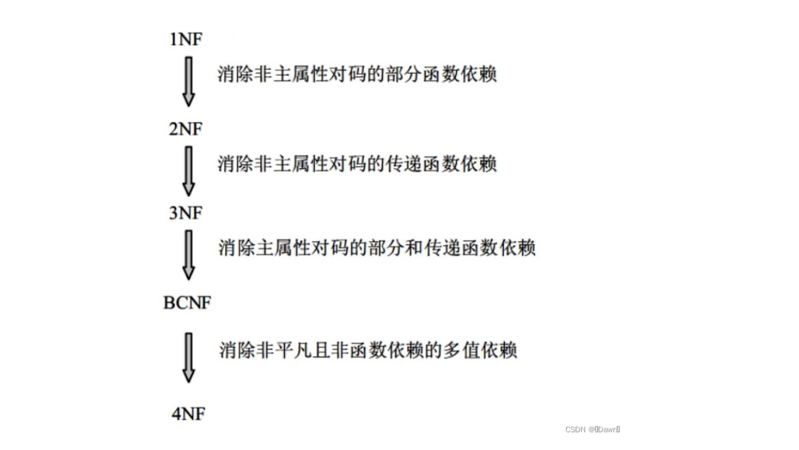

## 5.3．模式分解及分解应具有的特性

- 分解：关系模式R(U,F)的一个分解是指$\rho=\{R_1(U_1,F_1),R_2(U_2,F_2)\ldots,R_n(U_n,F_n)\}$，其中，$U=\bigcup_{i=1}^n U_i$，并且没有$U_i\subseteq U_j$，$1\le i,j\le n$；$F_i$是F在$U_i$上的投影，$F_i=\{X\to Y \mid X\to Y\in F^+ \wedge XY\subseteq U_i\}$
- 对一个给定的模式进行分解，使得分解后的模式是否与原来的模式等价有3种情况：
  - 分解具有 **无损连接性**
  - 分解要 **保持函数依赖**
  - 分解 **既要无损连接性，又要保持函数依赖**
- 无损连接

  定理：关系模式$R(U,F)$的一个分解$\rho=\{R_1(U_1,F_1),R_2(U_2,F_2)\}$具有无损连接的充分必要的条件是$U_1\cap U_2\to U_1-U_2\in F^+$或$U_1\cap U_2\to U_2-U_1\in F^+$，证明略。

- 保持函数依赖

  定义：设关系模式$R(U,F)$的一个分解$\rho=\{R_1(U_1,F_1),R_2(U_2,F_2),\cdots,R_k(U_k,F_k)\}$，如果$F^+=(\bigcup_{i=1}^k \pi_{R_i}(F^+))$，则称分解$\rho$保持函数依赖。

# 6．数据库的控制功能

## 6.1．事务管理

事务是一个操作序列，是数据库环境中不可分割的逻辑工作单位。事务的4个特性是原子性、一致性、隔离性和持久性

- **原子性**：事务的所有操作在数据库中 **要么全做，要么全都不做**
- **一致性**：一个事务独立执行的结果，将保持数据的一致性，即 **数据不会因为事务的执行而被破坏**
- **隔离性**：一个事务的 **执行不能被** 其他事务 **干扰**
- **持久性**：一个事务 **一旦提交**，它对数据库中数据的 **改变必须是永久** 的，即便系统出现故障时也是如此

<!-- p35 -->
## 6.2．数据库的备份与恢复

### 6.2.1．故障类型

- **事务内部故障**：事务内部的故障有的可以通过事务程序本身发现
- **系统故障**：通常称为 **软故障**，是指造成系统停止运行的任何事件，使得系统要重新启动
- **介质故障**：通常称为 **硬故障**，如磁盘损坏、磁头碰撞和瞬时强磁干扰。此类故障发生的几率小，但破坏性最大
- **计算机病毒**：是一种 **人为的故障和破坏**，是在计算机程序中插入的破坏，计算机功能或者数据可以繁殖和传播的一组计算机指令或程序代码

### 6.2.2．备份方法

**恢复的基本原理是"建立数据冗余"(重复存储)**。建立冗余数据的方法是进行 **数据转储** 和 **登记日志文件**。数据的转储分为静态转储和动态转储、海量转储和增量转储

- **静态转储和动态转储**：
  - 静态转储是指在转储期间不允许对数据库进行任何存取、修改操作
  - 动态转储是指在转储期间允许对数据库进行存取、修改操作
- **海量转储和增量转储**：
  - 海量转储是指每次转储全部数据
  - 增量转储是指每次只转储上次转储后更新过的数据。
- **日志文件**： 在事务处理的过程中，DBMS把事务开始、事务结束以及对数据库的插入、删除和修改的每一次操作写入日志文件。一旦发生故障，DBMS的恢复子系统利用日志文件撤销事务对数据库的改变，回退到事务的初始状态。因此，DBMS 利用日志文件来进行事务故障恢复和系统故障恢复，并可协助后备副本进行介质故障恢复

### 6.2.3．恢复

- **事务恢复的3个步骤**：
  - 反向扫描文件日志，查找该事务的更新操作
  - 对事务的更新操作执行逆操作
  - 继续反向扫描日志文件，查找该事务的其他更新操作，并做同样的处理，直到事务的开始标志

## 6.3．并发控制

并发操作是指在多用户共享的系统中，许多用户可能同时对同一数据进行操作。并发操作带来问题的原因是事务的并发操作破坏了事务的隔离性。DBMS的并发控制子系统负责协调并发事务的执行，保证数据库的完整性不被破坏，避免用户得到不正确的数据

- 并发操作 **带来的问题**：并发操作带来的数据不一致性有3类，即 **丢失修改、不可重复读** 和 **读"脏"数据**

### 6.3.1．并发控制技术

- 封锁：并发控制的主要技术
  - **排他锁(X锁)**：若事务T对数据对象A加上X锁，则只允许T读取和修改A，其他事务都不能再对A加任何类型的锁，直到T释放A上的锁

<!-- p36 -->
  - **共享锁(S锁)**：若事务T对数据对象A加上S锁，则只允许T读取A，但不能修改A，其他事务只能再对A加S锁，直到T释放A上的S锁
- 三级封锁协议
  - **一级封锁协议**：事务在修改数据R之前必须先对其加X锁，直到事务结束才释放。一级封锁协议可以 **解决丢失更新问题**
  - **二级封锁协议**：在一级封锁协议的基础上，加上事务T在读取数据R前必须先对其加S锁，读完后即可释放S锁。二级封锁协议可以 **解决读"脏"数据的问题**，但是由于二级封锁协议读完数据后即可释放S锁，所以它不能保证可重复读
  - **三级封锁协议**：在一级封锁协议的基础上，加上事务T在读取数据R之前必须先对其加S锁，直到事务结束才释放。三级封锁协议可以 **防止丢失修改、读"脏"数据和不可重复读**

# 7．分布式数据库

**分片** 透明：指用户或应用程序 **不需要知道逻辑上访问的表具体是怎么分块存储的**
**复制** 透明：指采用复制技术的分布方法，用户 **不需要知道数据是复制到哪些节点，如何复制的**。
**位置** 透明：指用户 **无须知道数据存放的物理位置**
**逻辑** 透明：指用户或应用程序 **无需知道局部场地使用的是哪种数据模型**

**共享** 性：指数据存储在 **不同的结点数据共享**
**自治** 性：指 **每结点对本地数据都能独立管理**
**可用** 性：指 **当某一场地故障时，系统可以使用其他场地上的副本而不至于使整个系统瘫痪**
**分布** 性：指 **数据在不同场地上的存储**

<!-- p37 -->
# 面向对象技术

## 1．面向对象基础

### 1.1．面向对象基本概念

- **对象**：基本的运行实体，为类的实例，封装了数据和行为的整体，如学生、汽车等 **真实存在的实体**。对象具有清晰的边界、良好定义的行为和可扩展性
- **消息**： **对象** 之间进行 **通信** 的一种构造称为消息
- **类**：是 **对象的抽象**，定义了一组大体相似的对象结构，定义了 **数据** 和 **行为**。包括：
  - **实体类** （用于对 **必须存储的信息和相关行为建模** 的类，是需要 **长久保存且一直存在的类**）
  - **边界类** （**系统内部与系统外部** 的业务主角之间进行 **交互建模** 的类）
  - **控制类** （用于对一个或几个用例所特有的 **控制行为进行建模**，在用例执行过程中被动出现的特定行为的类）
- **继承**： **父类** 和 **子类** 之间 **共享数据和方法** 的机制。是类之间的一种关系
- **多态**：不同的对象收到 **同一个消息时产生完全不同的反应**。包括：
  - 参数多态（不同类型参数多种结构类型）
  - 包含多态（父子类型关系）
  - 过载多态（类似于重载，一个名字不同含义）
  - 强制多态（强制类型转换）
  - **多态由继承机制支持**
- **覆盖**：子类在原有父类接口的基础上，用适合于自己要求的实现去置换父类中的相应实现。即 **在子类中重定义一个与父类同名同参的方法**
- **函数重载**： 与覆盖要区分开，函数重载与子类父类无关，且 **函数是同名不同参数**
- **封装**：一种 **信息隐蔽技术**，其目的是 **使对象的使用者和生产者分离**，也就是使其他开发人员 **无需了解所要使用的软件组件内部的工作机制，只需知道如何使用组件**
- **静态类型** 是指一个对象的类型 **在编译时** 就 **确定**
- **动态类型** 指对象类型在 **运行时** 才能 **确定**
- **静态绑定**（静态分配）是基于静态类型的，在程序 **执行前方法已经被绑定**
- **动态绑定** 是基于动态类型的， **运行时** 根据变量实际引用的对象类型 **决定调用哪个方法**， **动态绑定支持多态**

### 1.2．面向对象分析、设计与测试

- 面向对象 **分析**：是为了 **确定问题域，理解问题**。包含五个活动：
  - **认定对象** （按自然存在的实体 **确定对象**）
  - **组织对象** （分析对象关系， **抽象成类**）
  - **对象间的相互作用** （描述各对象 **在** 应用 **系统中的关系**）
  - **确定对象的操作** （操作，如创建增加删除等）

<!-- p38 -->
  - 定义对象的内部信息 （属性）
- 面向对象 **设计**：是设计分析模型和实现相应源代码在目标代码环境中这种源代码可被执行。**设计问题域的解决方案**
- 面向对象 **程序设计**：用面向对象 **程序** 设计 **语言实现设计方案**
- 面向对象 **测试**：与普通测试步骤并无不同。可分为四个层次：
  - **算法层** （**测试** 类中定义的 **每个方法**，类似 **单元测试**）
  - **类层**（测试同一个类中所有方法与属性的 **相互作用**，特有的模块测试）
  - **模板层**（测试一组 **协同工作的类** 之间的 **相互作用**，类似集成测试）
  - **系统层**（类似 **系统测试**）

## 2．UML

- `UML` 是 **统一建模语言**，和程序设计语言并无关系
- UML三个要素：
  - UML的 **基本构造块**
  - 支配这些构造块 **如何放置** 在一起 **的规则和运用**
  - 整个语言的一些 **公共机制**
- UML的 **基本构造块包括**：
  - **事物** （对模型中最具有代表性的成分的抽象）
  - **关系** （把事务结合在一起）
  - **图** （聚集了相关的事物）

### 2.1．事物

UML中有4种事物：结构事物、行为事物、分租事物和注释事物

- **结构事物**：模型的 **静态部分**，如类、接口、用例、构件等

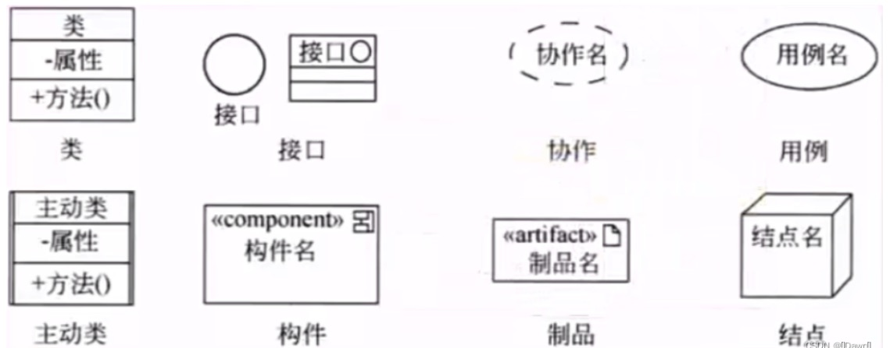

<!-- p39 -->
- **行为事物**：模型的 **动态部分**，如交互、活动、状态机


- **分组事物**：模型的 **组织部分**，如包

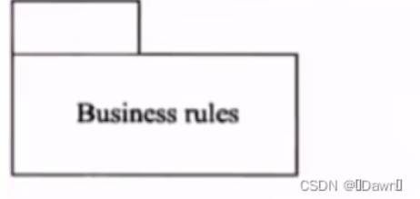

- **注释事物**：模型的 **解释部分**，依附于一个元素或一组元素之上对其进行约束或解释的简单符号

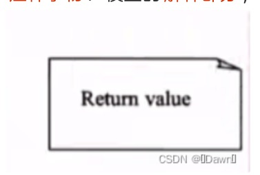

## 2.2．关系

UML中有4种关系：依赖、关联、泛化和实现

- **依赖**：一个事物的语义依赖于另一个事物的语义的变化而变化
- **关联**：是一种 **结构关系**，描述了一组链，链是对象之间的连接。**分** 为 **组合** 和 **聚合**，都是 **部分和整体的关系**，其中 **组合事物** 之间 **关系更强**。两个类之间的关联，实际上是两个类所扮演角色的关联，因此，两个类之间可以有多个由不同角色标识的关联

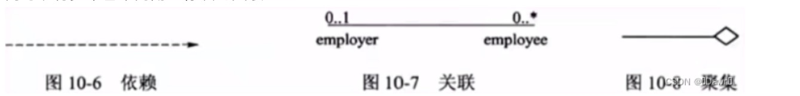

- **泛化**： **一般 / 特殊** 的关系， **子类和父类** 之间的 **关系**
- **实现**：一个类元指定了另一个类元保证执行的契约


<!-- p40 -->
## 2.3．UML中的图

### 2.3.1．类图

**类图**： **静态图**，为系统的 **静态设计视图**，展现一组对象、接口、协作和它们之间的关系

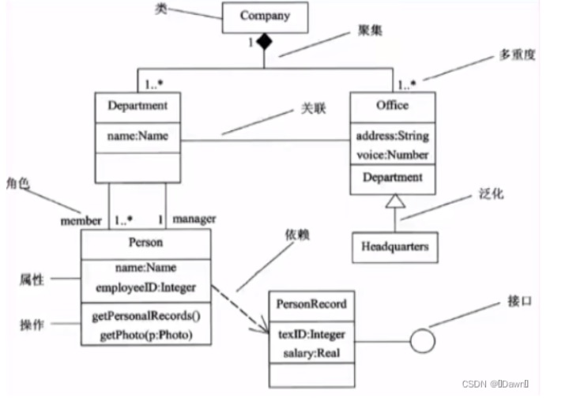

### 2.3.2．对象图

**对象图**： **静态图**，展现某一时刻一组对象及它们之间的关系，为类图的某一快照。**在没有类图的前提下，对象图就是静态设计视图**

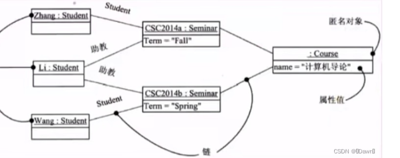

### 2.3.3．用例图

**用例图**： **静态图**，展现了一组用例、参与者以及它们之间的关系

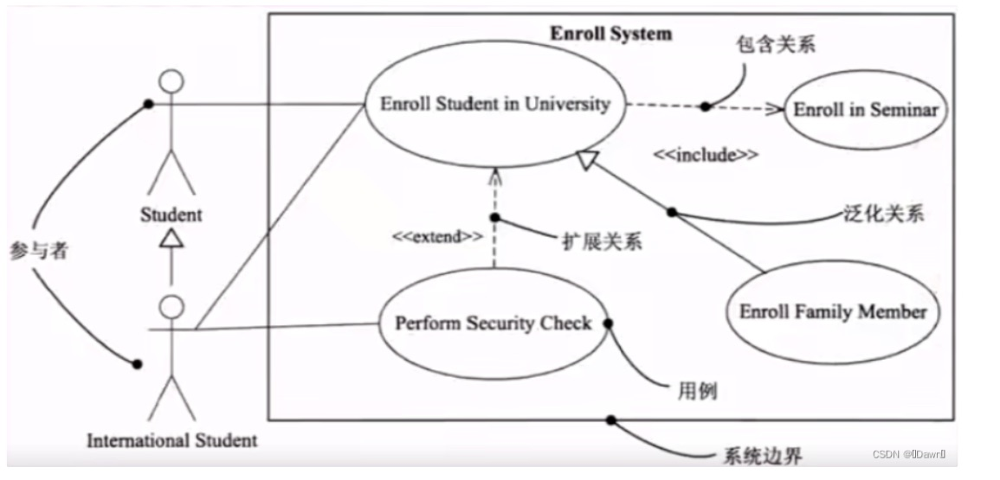

- **参与者**：是人、硬件或其他系统可以扮演的 **角色**
- **用例**：是参与者完成的一系列 **操作**

<!-- p41 -->
- 用例之间的 **关系**： **包含**（**必须要做**）、扩展（**可做可不做**）、泛化

### 2.3.4．序列图

**序列图**： 即顺序图， **动态图**，是场景的图形化表示，描述了以时间顺序组织的对象之间的交互活动

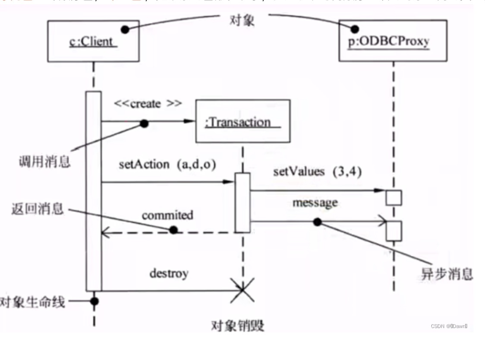

- **同步消息**：进行阻塞调用，调用者中止执行，等待控制权返回。需要等待返回消息，用 **实心三角箭头** 表示
- **异步消息**：发出消息后继续执行，不引起调用者阻塞，也不等待返回消息，由 **空心箭头** 表示
- **返回消息**：由 **从右到左** 的 **虚线箭头** 表示

### 2.3.5．通信图

**通信图**： **动态图**，即协作图，是顺序图的另一种表示方法，也是由对象和消息组成的图，只不过不强调时间顺序，**只强调事件之间的通信**，而且也没有固定的画法规则，**和顺序图统称为交互图**

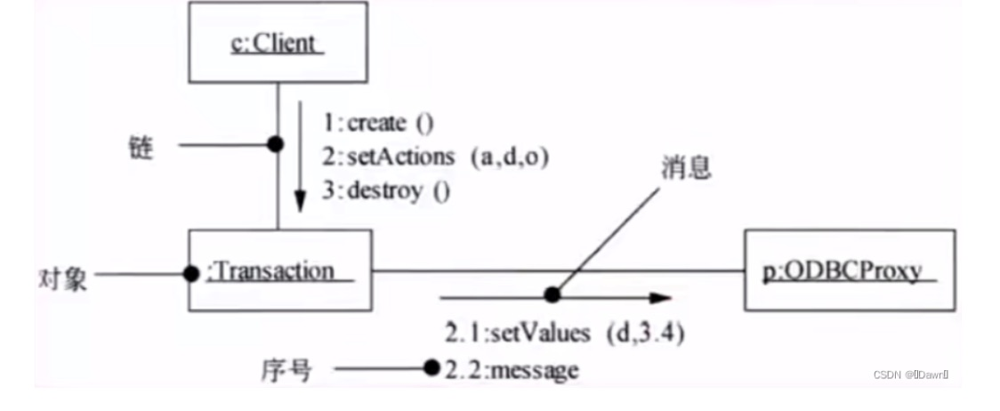

<!-- p42 -->
### 2.3.6．状态图

**状态图**： **动态图**，展现了一个状态机，描述单个对象在多个用例中的行为，包括简单状态和组合状态

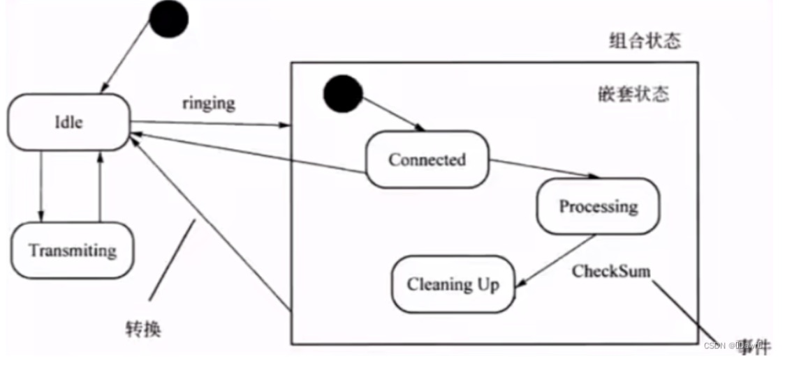

- 转换可以通过事件触发器触发，事件触发后相应的监护条件会进行检查。状态图中转换和状态是两个独立的概念，如图中 **方框代表状态**， **箭头上的代表触发事件**， **实心圆点为起点和终点**

### 2.3.7．活动图

**活动图**： **动态图**，是一种特殊的状态图，展现了在系统内从一个活动到另一个活动的流程

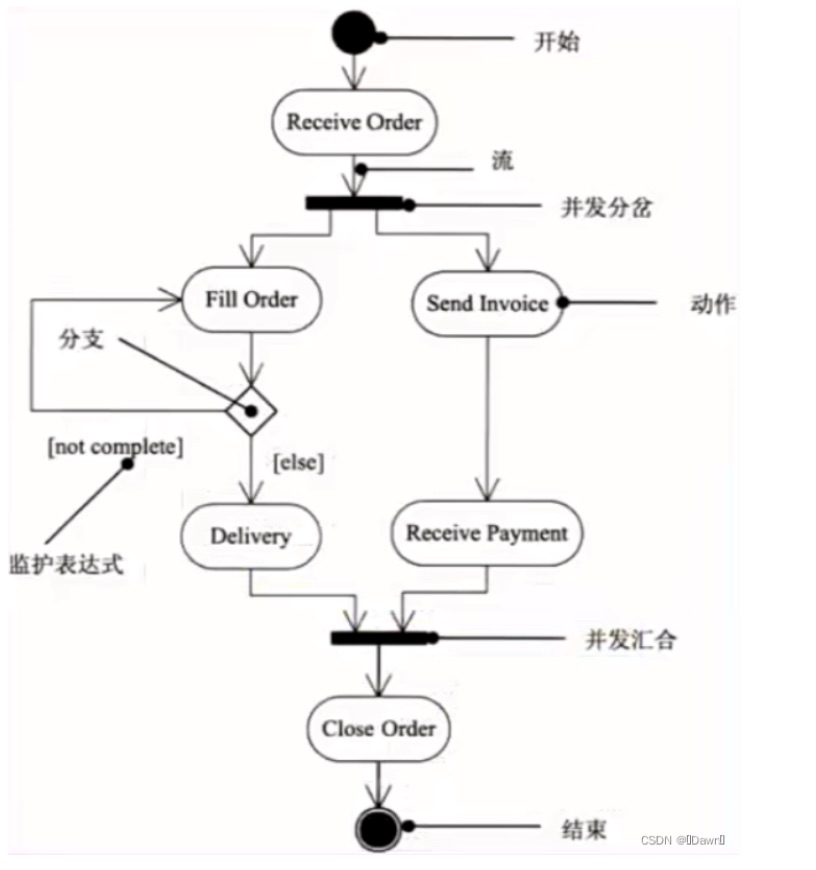

- 活动的分岔和汇合线是一条水平粗线
- 每个分岔的分支数代表了可同时运行的线程数。活动图中能够并行执行的是在一个分岔粗线下的分支上的活动

<!-- p43 -->
### 2.3.8．构件图

**构件图**（组件图）： **静态图**，为系统 **静态实现视图**，展现了一组构件之间的组织和依赖

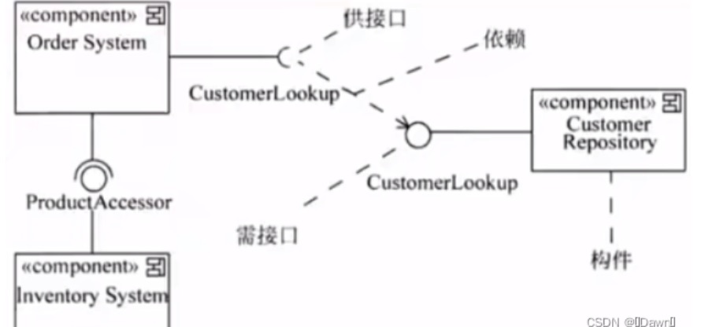

### 2.3.9．部署图

**部署图**： **静态图**，为系统 **静态部署视图**， **部署图物理模块的节点分布**。它与构件图相关，通常一个结点包含一个或多个构件。其依赖关系类似于包依赖，因此部署组件之间的依赖是单向的类似于包含关系

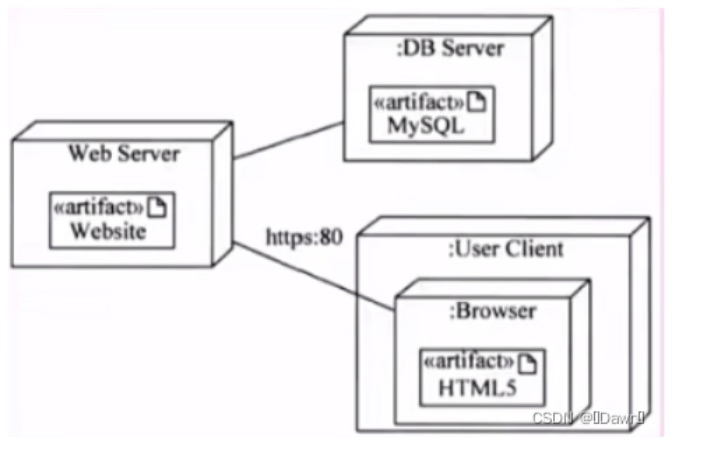

## 3．设计模式

每一个设计模式描述了一个在我们周围不断重复发生的问题，以及该问题的解决方案的核心。这样，你就能一次又一次地使用该方案而不必做重复劳动。**设计模式的核心在于提供了相关问题的解决方案，使得人们可以更加简单方便的复用成功的设计和体系结构**

- 设计模式的四个 **基本要素**：
  - **模式名称**
  - **问题**：应该在何时使用模式
  - **解决方案**：设计的内容
  - **效果**：模式应用的效果
- 设计模式的 **类别**：
  - **创建型模式**：主要 **处理创建对象**
  - **结构型模式**：主要 **处理类和对象的组合**
  - **行为型模式**：主要是 **描述类或者对象的交互行为**

<!-- p44 -->
## 3.1．创建型设计模式

### 3.1.1．工厂模式

意图：定义一个用于创建对象的接口，让 **子类决定实例** 化哪一个类。`Factory Method` **使** 一个 **类的实例化延迟到其子类**。

题目选项描述：

- 1、当一个类希望 **由它的子类** 来 **指定** 它所 **创建的对象** 的时候

### 3.1.2．抽象工厂模式

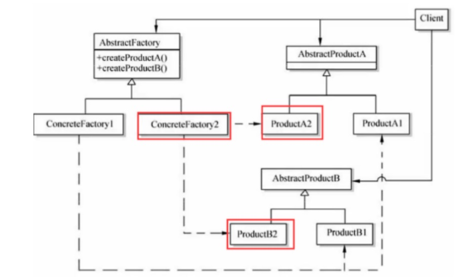

意图：提供一个创建 **一系列** 相关或相互依赖对象的 **接口**，而 **无需指定** 它们 **具体的类**。

题目选项描述：

- 1、提供创建 **一系列** 相关或相互依赖的对象的 **接口**，而 **无需指定** 这些对象 **所属的具体类**
- 2、当一个 **系统** 应该独立于它的 **产品创建、构成和表示** 时
- 3、当要强调 **一系列** 相关的产品 **对象** 的设计以便进行 **联合使用** 时
- 4、**一个系统** 要 **由多个产品** 系列中的一个来 **配置** 时
- 5、为 **图形用户界面（GUI）** 组件定义不同平台的并行类层次结构

### 3.1.3．生成器模式

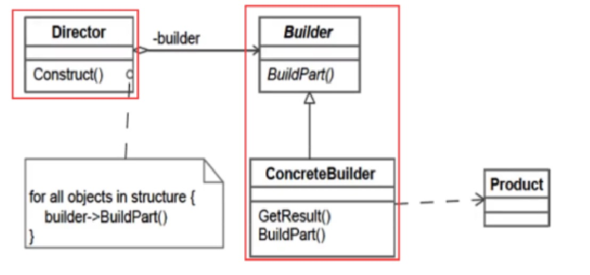

<!-- p45 -->
意图：将一个 **复杂对象** 的 **构建与** 它的 **表示分离**，使得同样的构建过程可以创建不同的表示。

题目选项描述：

- 1、当创建 **复杂对象** 的 **算法** 应该 **独立于** 该对象的 **组成部分及其装配方式** 时
- 2、当构造过程必须允许被 **构造的对象有不同** 的 **表示** 时
- 3、将一个 **复杂对象** 的 **构建** 与其 **表示分离**，使得同样的构建过程可以创建 **不同的表示**
- 4、适用于抽象 **复杂对象** 的构建步骤和基于构建过程的具体实现构建复杂对象的 **不同表示**
- **判断关键词**： **复杂对象**、**不同的表示**

### 3.1.4．原型模式

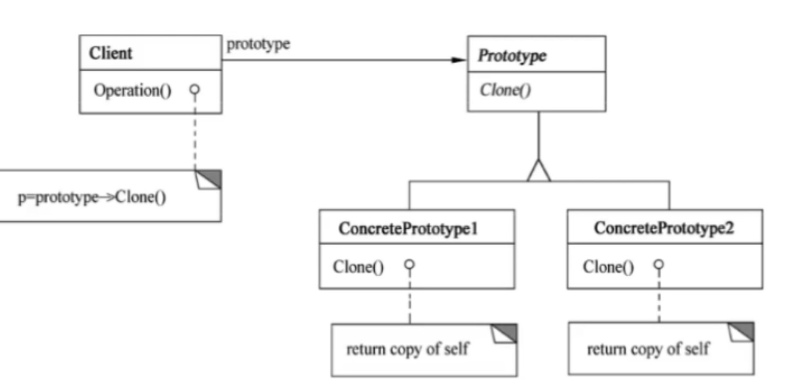

意图：用 **原型实例指定创建** 对象的 **种类**，并且 **通过复制** 这些原型 **创建新的对象**。

题目选项描述：

- 一个类的实例只能有几个不同状态组合中的一种

适用性：

- 1、当 **一个系统** 应该 **独立于** 它的 **产品创建、构成和表示** 时。
- 2、当要 **实例化的类** 是 **在运行时刻指定** 时，例如，通过动态装载。
- 3、为了 **避免创建一个与产品类层次平行的工厂类层次** 时。
- 4、当一个 **类的实例只能有几个不同状态组合中的一种** 时。建立相应数目的原型并克隆它们，可能比每次用合适的状态手工实例化该类更方便一些。

<!-- p46 -->
### 3.1.5．单例模式

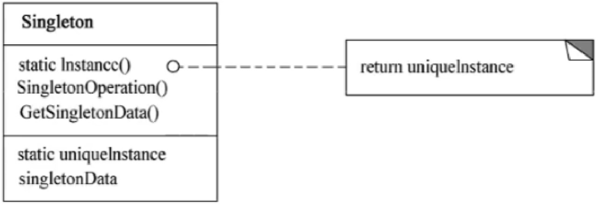

意图：保证 **一个类仅有一个实例**，并提供一个访问它的全局访问点。

题目选项描述：

- 1、它能够保证一个类只产生 **唯一** 的一个 **实例**
- 2、一个类 **仅有一个实例**

适用性：

- 1、当类 **只能有一个实例** 而且客户可以从一个众所周知的访问点访问它时。
- 2、当这个 **唯一实例** 应该是通过子类化可扩展的，并且客户无须更改代码就能使用一个扩展的实例时。

### 3.1.6．创建型设计模式总结

| 创建型设计模式 | 定义 | 记忆关键字 |
|---|---|---|
| Abstract Factory 抽象工厂模式 | 提供一个接口，可以创建一系列相关或相互依赖的对象，而无需指定它们具体的类 | 抽象接口 |
| Builder 构建器模式 | 将一个复杂类的表示与其构造相分离，使得相同的构建过程能够得出不同的表示 | 类和构造分离 |
| Factory Method 工厂方法模式 | 定义一个创建对象的接口，但由子类决定需要实例化哪一个类。使得子类实例化过程推迟 | 子类决定实例化 |
| Prototype 原型模式 | 用原型实例指定创建对象的类型，并且通过拷贝这个原型来创建新的对象 | 原型实例，拷贝 |
| Singleton 单例模式 | 保证一个类只有一个实例，并提供一个访问它的全局访问点 | 唯一实例 |

<!-- p47 -->
## 3.2．结构型设计模式

### 3.2.1．适配器模式

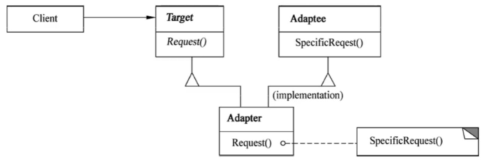

意图：将一个类的接口转换成客户希望的另外一个接口。Adapter模式使得原本由于 **接口不兼容** 而 **不能一起工作** 的那些 **类** 可以 **一起工作**。

题目选项描述：

- 1、将一个对象加以包装以给客户 **提供** 其 **希望的另外一个接口**
- 2、想使用一个已经存在的类，而其 **接口不符合** 要求
- 3、使所有 **接口不兼容类** 可以 **一起工作**
- 4、将一个类的接口 **转换成客户希望** 的 **另一个接口**

适用性：

- 1、想使用一个 **已经存在的类**，而它的 **接口不符合** 要求。
- 2、创建一个可以服用的类，该类可以与其他不相关的类或不可预见的类（即那些 **接口可能不一定兼容** 的类） **协同工作**。
- 3、（仅适用于对象Adapter）想使用一个已经存在的子类，但是不可能对每一个都进行子类化以匹配它们的接口。**对象适配器可以适配它的父类接口**。

<!-- p48 -->
### 3.2.2．桥接模式

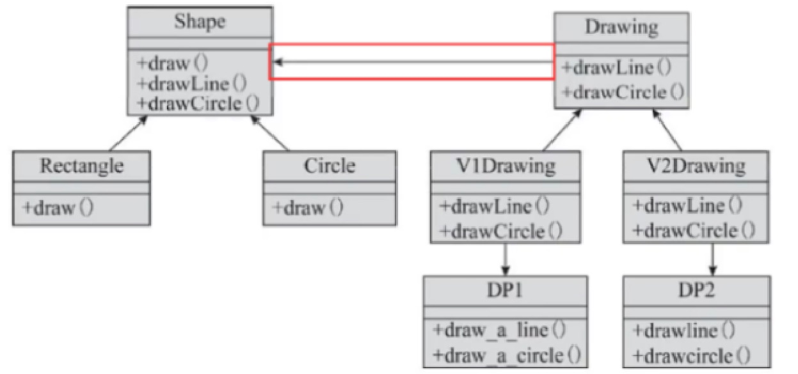

意图：将 **抽象** 部分 **与** 其 **实现** 部分 **分离**，使它们都可以独立地变化。

题目选项描述：

- 1、类的 **抽象** 和其 **实现** 之 **间不希望有** 一个 **固定的绑定关系**
- 2、**不希望** 在抽象和它的实现部分之间 **有** 一个 **固定的绑定关系**
- 3、都给另一个对象提供了一定程度上的间接性， **都涉及从自身以外的一个接口向这个对象转发请求**。（这是桥接和适配器共同的特征）

适用性：

- 1、**不希望** 在 **抽象** 和它的 **实现** 部分之间 **有** 一个 **固定的绑定关系**。例如，这种情况可能是B为，在程序运行时刻实现部分应可以被选择或者切换。
- 2、类的 **抽象** 以及它的 **实现都** 应该 **可以通过生成子类的方法加以扩充**。这是 `Bridge`模式传得开发者可以对不同的抽象接口和实现部分进行组合，并分别对它们进行扩充。
- 3、对一个 **抽象的实现部分的修改** 应 **对客户不产生影响**，即客户代码不必重新编译。
- 4、（C++）想对客户 **完全隐藏抽象的实现部分**。
- 5、**有许多类要生成的类层次结构**。
- 6、想在 **多个对象间共享实现**（可能使用引用计数），但同时要求 **客户并不知道** 这一点。

<!-- p49 -->
### 3.2.3．组合模式

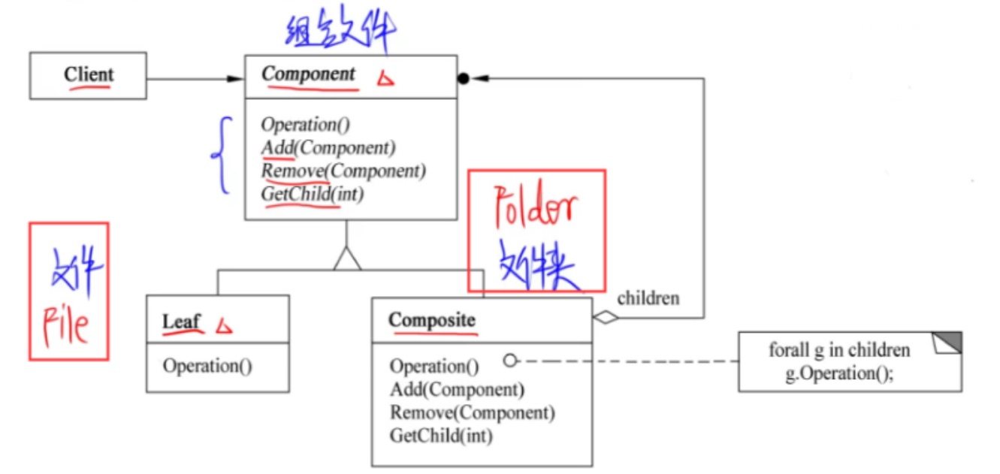

意图：将对象组合成树型结构以表示"**部分-整体**"的 **层次结构**。Composite使得用户对单个对象和组合对象的使用具有一致性。

题目选项描述

- 表示对象的 **部分-整体** 层次结构

### 3.2.4．装饰器模式

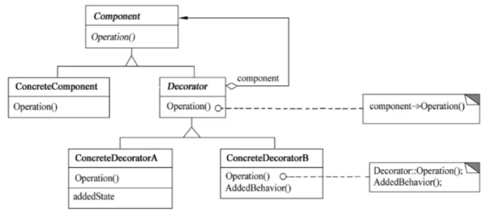

意图：动态地给一个对象 **添加** 一些 **额外** 的 **职责**。就增加功能而言，Decorator模式比生成子类更加灵活。

题目选项描述：

- 1、将一个 **对象加以包装以提供** 一些 **额外** 的 **行为**
- 2、在不影响其他对象的情况下，以 **动态、透明** 的方式给单个对象 **添加职责**
- 3、**动态地** 给一个对象 **添加** 一些 **额外** 的 **职责**

适用性：

<!-- p50 -->
- 1、在不影响其他对象的情况下，以动态、透明的方式 **给单个对象添加职责**。
- 2、**处理** 那些 **可以撤销的职责**。
- 3、当 **不能采用生成子类的方式进行扩充** 时。一种情况是，可能有大量独立的扩展，为支持每一种组合将产生大量的子类，使得子类数目呈爆炸性增长。另一种情况可能是，由于类定义被隐藏，或类定义不能用于生成子类。

### 3.2.5．外观模式

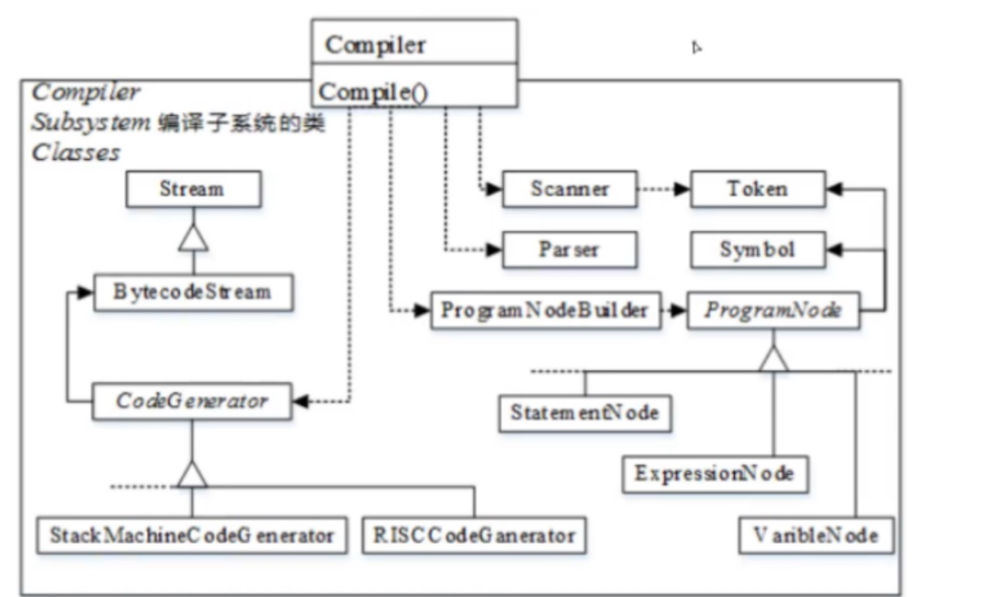

意图：为子系统中的 **一组接口提供一个一致** 的 **界面**，Facade模式定义了一个高层接口，这个接口使得这一子系统更加容易使用。

题目选项描述：

- 1、将 **一系列对象加以包装** 以 **简化** 其 **接口**
- 2、需要为一个 **复杂子系统提供一个简单接口**

适用性：

- 1、要为一个 **复杂子系统提供一个简单接口** 时，子系统往往因为不断演化而变得越来越复杂。大多数模式使用时都会产生更多更小的类，这使得子系统更具有可重用性，也更容易对子系统进行定制，但也给那些不需要定制子系统的用户带来一些使用上的困难。Facade可以提供一个简单的默认视图，这一视图对大多数用户来说已经足够，而那些需要更多的可定制性的用户可以越过Facade层。
- 2、**客户程序** 与 **抽象类的实现部分** 之间 **存在** 着很大的 **依赖性**。引入Facade将这个子系统与客户以及其他的子系统分离，可以提高子系统的独立性和可移植性。
- 3、当需要 **构建一个层次结构的子系统** 时，使用Facade模式定义子系统中每层的入口点。如果子系统之间是相互依赖的，则可以让它们仅通过Facade进行通信，从而简化了它们之间的依赖关系。
<!-- p51 -->
### 3.2.6．享元模式

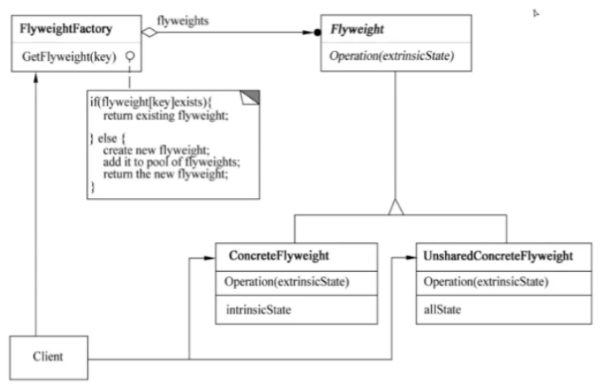

意图：运用 **共享** 技术有效地 **支持** 大量 **细粒度** 的 **对象** 。

题目选项描述：

- 因 **使用大量的对象** 而 **造成** 很大的存储 **开销** 时，进行对象 **共享** ，以减少对象数量从而达到较少的内存占用并提升性能。

适用性：

- 1、一个 **应用程序使用了大量的对象** 。
- 2、完全由于使用 **大量的对象** ， **造成** 很大的 **存储开销** 。
- 3、 **对象** 的 **大多数状态** 都 **可变为外部状态** 。
- 4、如果 **删除对象** 的 **外部状态** ，那么可以用 **相对较少** 的 **共享对象** 取代很多组对象。

### 3.2.7．代理模式

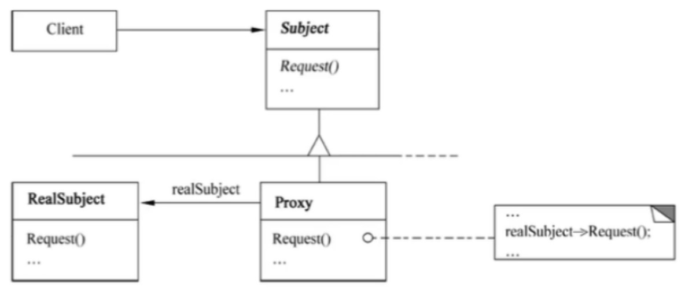

意图：为其他对象提供一种 **代理** 以 **控制** 对这个对象的访问。

<!-- p52 -->
题目选项描述：

- 1、将一个 **对象加以包装以控制** 对这个对象的 **访问**
- 2、在需要 **比较通用和复杂的对象指针代替简单的指针** 时
- 3、为其他对象提供一种 **代理** 以 **控制** 对这个对象的访问

适用性：

- Proxy模式适用于在 **需要比较通用和复杂的对象指针代替简单的指针** 的时候，常见情况有：
  - 1、远程代理(Remote Proxy)为一个对象在不同地址空间提供局部代表。
  - 2、虚代理(Virtual Proxy) 根据需要创建开销很大的对象。
  - 3、保护代理(Protection Proxy)控制对原始对象的访问，用于对象应该有不同的访问权限的时候。
  - 4、智能引用(Smart Reference)取代了简单的指针，它在访问对象时执行一些附加操作。典型用途包括：对指向实际对象的引用计数，这样当该对象没有引用时，可以被自动释放；当第一次引用一个持久对象时，将它装入内存；在访问一个实际对象前，检查是否已经锁定了它，以确保其他对象不能改变它。

### 3.2.8．结构型设计模式总结

| 结构型设计模式 | 定义 | 记忆关键字 |
| --- | --- | --- |
| Adapter 适配器模式 | 将一个类的接口转换成用户希望得到的另一种接口。它使原本不相容的接口得以协同工作 | **转换，兼容接口** |
| Bridge 桥接模式 | 将类的抽象部分和它的实现部分分离开来，使它们可以独立的变化 | **抽象和实现分离** |
| Composite 组合模式 | 将对象组合成树型结构以表示"整体-部分"的层次结构，使得用户对单个对象和组合对象的使用具有一致性 | **整体-部分，树形结构** |
| Decorator 装饰模式 | 动态的给一个对象添加一些额外的职责。它提供了用子类扩展功能的一个灵活的替代，比派生一个子类更加灵活 | **附加职责** |
| Facade 外观模式 | 定义一个高层接口，为子系统中的一组接口提供一个一致的外观，从而简化了该子系统的使用 | **对外统一接口** |
| Flyweight 享元模式 | 提供支持大量细粒度对象共享的有效方法 | **细粒度，共享** |
| Proxy 代理模式 | 为其他对象提供一种代理以控制这个对象的访问 | 代理控制 |

<!-- p53 -->
## 3.3．行为型设计模式

### 3.3.1．责任链模式

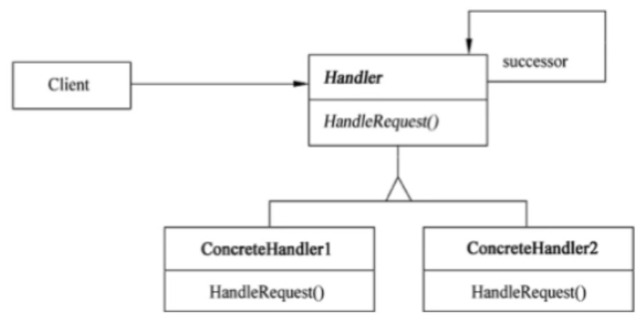

意图：使多个对象都有机会处理请求，从而避免请求的发送者和接收者之间的耦合关系。将这些 **对象连成一条链** ，并沿着这条链 **传递** 该请求`，直到有一个对象处理它为止。

题目选项描述：

- 1、有 **多个对象** 可以 **处理一个请求** ，在运行时刻 **自动确定由哪个对象处理**
- 2、一个 **客户需要使用一组相关对象**
- 3、想在不明确指定接收者的情况下 **向多个对象中的一个提交一个请求**

适用性：

- 1、有 **多个的对象** 可以 **处理一个请求** ，哪个对象处理该请求运行时刻自动确定。
- 2、想在不明确指定接收者的情况下 **向多个对象中的一个提交一个请求** 。
- 3、可处理一个请求的 **对象集合** 应 **被动态指定** 。

### 3.3.2．命令模式

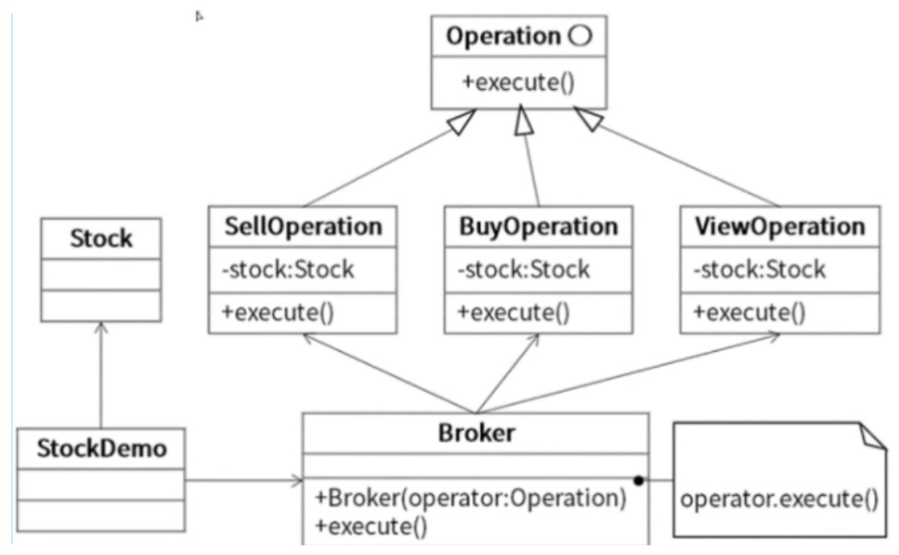

<!-- p54 -->
意图：将一个请求 **封装** 为一个对象，从而使得可以用不同的请求对客户进行 **参数化** ；对请求排队或 **记录** 请求 **日志** ，以及支持可撤销的操作。

题目选项描述：

- 1、抽象出执行的动作以 **参数化某对象**
- 2、将请求封装为对象从而可以使用不同的请求对客户进行 **参数化**
- 3、在 **不同的时刻指定、排列和执行请求**

适用性：

- 1、抽象出待执行的动作以 **参数化** 某对象（。Command模式是过程语言中的回调(Callback机制的一个面向对象的替代品。
- 2、在 **不同的时刻指定、排列和执行** 请求一个Command对象可以有一个与初始请求无关的生存期。如果一个请求的接收者可用一种与地址空间无关的方式表达，那么就可以将负责该请求的命令对象传递给另一个不同的进程并在那儿实现该请求。
- 3、支持取消操作Command的Execute操作可在实施操作前将状态存储起来，在取消探作时这个状态用来消除该操作的影响。Command接口必须添加一个Unexecute操作，该操作取消上一次Execute 调用的效果。执行的命令被存储在一个历史列表中。可通过向后和向前遍历这一列表并分别调用Unexecute和Execute来实现重数不限的"取消和"重做"。
- 4、 **支持修改日志** 这样当系统崩溃时，这些修改可以被重做一遍。在 Command 接口中添加装载操作和存储操作，可以用来保持变动的一个一致的修改日志。从崩溃中恢复的过程包括从磁盘中重新读入记录下来的命令并用Execute操作重新执行它们。
- 5、用构建在原语操作上的高层操作构造一个系统)这样一种结构在支持事务(Transaction) 的信息系统中很常见。Command模式提供了对事务进行建模的方法。Command有一个公共接口，使得可以用同一种方式调用所有的事务，同时使用该模式也易于添加新事务以扩展系统。

### 3.3.3．解释器模式

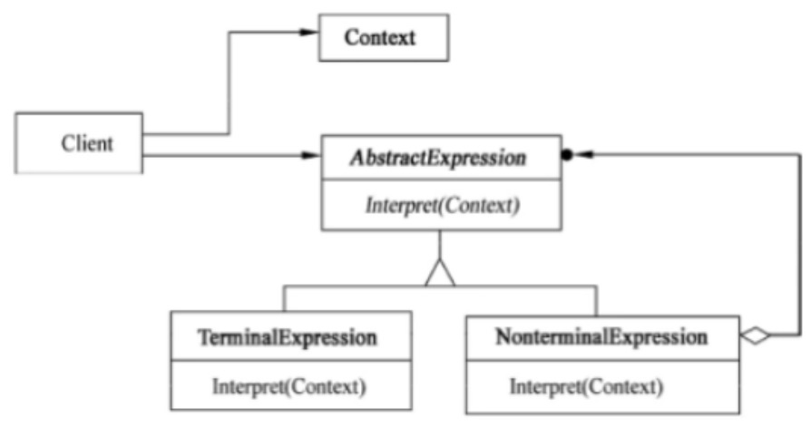

意图：给定一个语言，定义它的 **文法** 的一种表示，并定义一个 **解释器** ，这个解释器使用该表示来 **解释语言中的句子** 。

题目选项描述：

- 有一个语言需要解释执行，并且 **可将句子表示为** 一个 **抽象语法树**

适用性：

<!-- p55 -->
- Interpreter模式适用于当有一个 **语言需要解释执行** ，并且可 **将该语言中的句子表示为** 一个抽象 **语法树** 时，以下情况效果最好：
  - 1、该文法简单。对于复杂的发文，文法的类层次变得庞大而无法管理。此时语法分析程序生成器这样的工具是更好的选择。它们无须构建抽象语法树即可解释表达式，这样可以节省空间还可能节省时间。
  - 2、效率不是一个关键问题。最高效的解释器通常不是通过直接解释语法分析树实现的，而是首先将它们转换成另一种形式。不过，即使在这种情况下，转换器仍然可用该模式实现。

### 3.3.4．迭代器模式

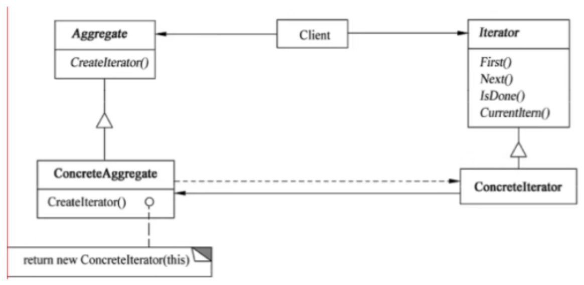

意图：提供一种方法 **顺序访问** 一个聚合对象中的各个元素，且 **不需要暴露该对象的内部** 表示。

题目选项描述：

- **访问** 一个 **聚合对象** 的内容而 **无须暴露它的内部** 表示

适用性：

- 1、 **访问** 一个 **聚合对象** 的内容而 **无须暴露它的内部** 表示。
- 2、 **支持** 对 **聚合对象** 的 **多种遍历** 。
- 3、为 **遍历** 不同的 **聚合结构提供** 一个 **统一** 的 **接口** 。

### 3.3.5．中介者模式

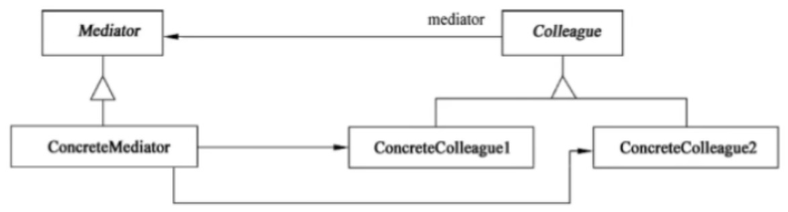

意图：用一个中介对象来封装一系列的对象交互。中介者使各对象 **不需要显式地相互引用** ，从而 **使其耦合松散** ，而且可以独立地改变它们之间的交互。

题目选项描述：

- 1、一个对象 **引用** 其他 **很多对象** 并且 **直接** 与这些对象 **通信** ， **导致难以复用该对象**

<!-- p56 -->
- 2、一组对象以定义 **良好但是复杂** 的方式进行 **通信** ，产生的相互依赖关系结构混乱且难以理解。
- 3、减少多个对象或类之间的 **通信复杂性**
- 4、中介模式和观察者模式是相互竞争的模式，主要差别是：前者的 **中介对象封装了** 其他对象间的 **通信** ，而后者通过引入其他对象来分布通信。
- 5、欲使一个 **后端数据模型** 能够 **被多个前端用户界面连接**

适用性：

- 一组对象以 **定义良好但是复杂的方式进行通信** ，产生的相互依赖关系结构混乱且难以理解。

### 3.3.6．备忘录模式

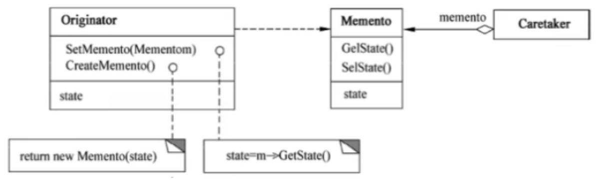

意图：在不破坏封装性的前提下捕获一个对象的内部状态，并在对象之外保存这个状态。这样以后就可以将对象 **恢复** 到原先保存的状态。

题目选项描述：

- 1、将对象的 **状态恢复到先前的状态**
- 2、在不破坏封装性的前提下， **捕获对象的内部状态并在对象之外保存**
- 3、必须 **保存** 一个 **对象** 在 **某一个时刻的（部分）** 状态

适用性：

- 1、必须 **保存** 一个 **对象** 在 **某一个时刻** 的（ **部分** ） **状态** ，这样以后需要时它才能恢复到先前的状态。
- 2、如果一个用 **接口** 来让其他对象 **直接得到这些状态** ，将会暴露对象的实现细节并 **破坏** 对象的 **封装性** 。

### 3.3.7．观察者模式

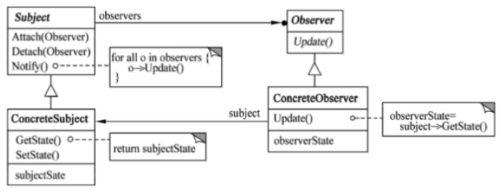

意图：定义对象间的一种一对多的依赖关系，当一个对象的状态发生改变时，所有 **依赖于它的对象都得到通知** 并 **被自动更新** 。

<!-- p57 -->
题目选项描述：

- 1、当 **一个对象必须通知其它对象** ，而它又不能假定其它对象是谁时
- 2、在 **发布-订阅** (Publish-Subscribe）消息模型中，订阅者订阅一个主题后，当该主题有新消息到达时，所有订阅者都会收到通知
- 3、使所要 **交互的对象尽量松耦合**
- 4、当一个对象状态改变时所有依赖它的对象 **得到通知** 并 **自动更新**
- 5、 **一个对象的改变需要改变其它对象**

适用性：

- 1、当一个抽象模型有两个方面，其中一个方面依赖于另一个方面，将这两者封装在独立的对象中以使它们可以各自独立地改变和复用。
- 2、当对 **一个对象的改变需要同时改变其他对象** ，而不知道具体有多少对象有待改变时。
- 3、当 **一个对象必须通知其他对象** ，而它又不能假定其他对象是谁，即不希望这些对象是紧耦合的。

### 3.3.8．状态模式

意图：允许一个 **对象在其内部状态改变时改变它的行为** 。对象看起来似乎修改了它的类。

题目选项描述：

- 1、一个对象的 **行为决定于** 其 **状态** 且必须在运行时刻根据状态改变行为
- 2、一个对象在其 **内部状态改变** 时 **改变其行为**

适用性：

- 1、一个对象的 **行为决定于它的状态** ，并且它必须在运行时刻根据状态改变它的行为。
- 2、一个 **操作中含有庞大的多分支的条件语句** ，且这些分支依赖于该对象的状态。这个状态常用一个或多个枚举常量表示。通常，有多个操作包含这一相同的条件结构。State模式将每一个条件分支放入一个独立的类中。这使得开发者可以根据对象自身的情况将对象的状态作为一个对象，这一对象可以不依赖于其他对象独立变化。

### 3.3.9．策略模式

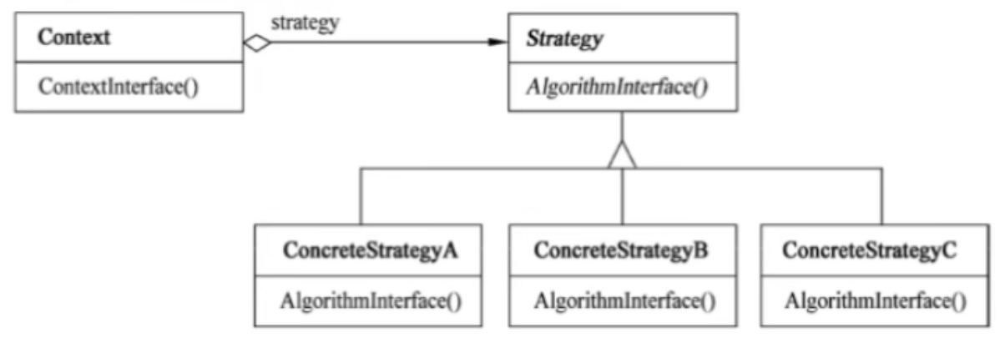

意图：定义一系列的 **算法** ，把它们一个个封装起来，并且使它们可以相互替换。此模式使得算法可以独立于使用它们的客户而变化。

题目选项描述：

- 1、需要使用一个 **算法** 地不同变体

<!-- p58 -->
- 2、许多 **相关的类** 仅 **仅是行为有异**
- 3、在设计某购物中心的 **收银软件系统** 时，要求能够 **支持** 在 **不同时期推出打折、返利、满减等** 不同 **促销活动**

适用性：

- 1、许多 **相关的类** 仅 **仅是行为有异** 。"策略"提供了一种用多个行为中的一个行为来配置一个类的方法。
- 2、需要使用一个 **算法** 的不同变体。例如，定义一些反映不同空间的空间/时间权衡的算法。当这些变体实现为一个算法的类层次时，可以使厨策略模式。
- 3、 **算法** 使用客户不应该知道的数据。可使用策略模式以避免暴露复杂的、与算法相关的数据结构。
- 4、 **一个类定义了多种行为** ，并且这些行为在这个类的 **操作中以多个条件语句的形式出现** ，将相关的条件分支移入它们各自的Strategy类中，以代替这些条件语句

### 3.3.10．访问者模式

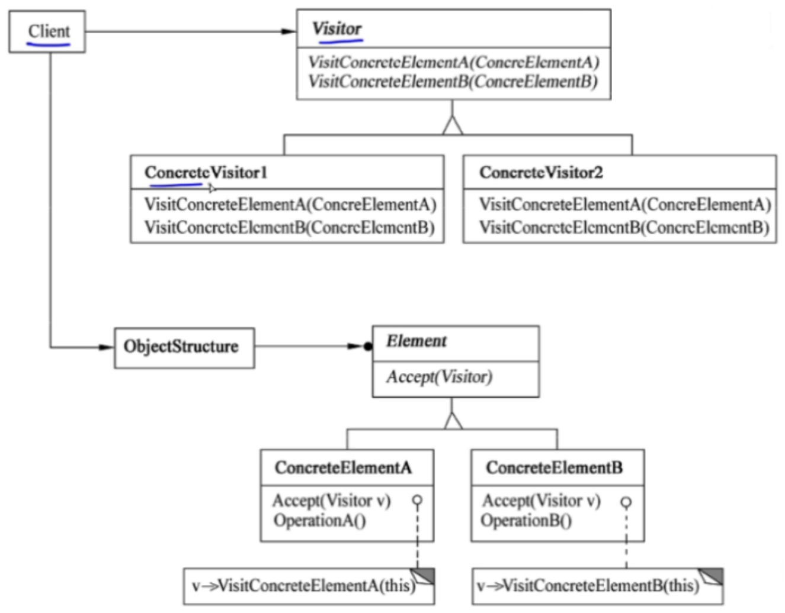

意图：表示一个作用于某对象结构中的各元素的操作。它允许在不改变各元素的类的前提下定义作用于这些元素的 **新操作** 。

题目选项描述：

- 需要对一个对象结构中的对象 **进行很多不同** 的并 **且不相关的操作**

适用性：

- 1、一个对象结构包含很多类对象，它们有不同的接口，而用户想对这些对象 **实施** 一些 **依赖于其具体类的操作** 。

<!-- p59 -->
- 2、需要对一个对象结构中的 **对象进行很多不同** 的并 **且不相关的操作** ，而又想要避免这些操作"污染"这些对象的类。Visitor 使得用户可以将相关的操作集中起来定义在一个类中。当该对象结构被很多应用共享时，用Visitor模式让每个应用仅包含需要用到的操作。
- 3、定义 **对象结构的类很少改变** ， **但经常** 需要在此结构上 **定义新的操作** 。改变对象结构类需要重定义对所有访问者的接口，这可能需要很大的代价。如果对象结构类经常改变，那么可能还是在这些类中定义这些操作较好。

### 3.3.11．模板方法模式

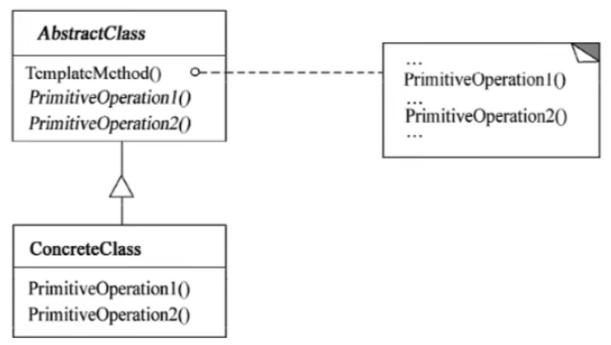

意图：定义一个操作中的算法骨架，而将一些 **步骤延迟到子类** 中。Template Method使得子类可以不改变一个算法的结构即 **可重定义该算法的某些特定步骤** 。

适用性：

- 1、一次性实现一个 **算法** 的不变的部分，并将可变的行为 **留给子类来实现** 。
- 2、各子类中 **公共的行为** 应被 **提取出来** 并 **集中到** 一个 **公共父类** 中，以避免代码重复。
- 3、 **控制子类扩展** 。模板方法旨在特定点调用"hook"操作（默认的行为，子类可以在必要时进行重定义扩展），这就只允许在这些点进行扩展。

<!-- p60 -->
### 3.3.12．行为型设计模式总结

| 行为型设计模式 | 定义 | 记忆关键字 |
| --- | --- | --- |
| Chain of Responsibility 职责链模式 | 通过给多个对象处理请求的机会，减少请求的发送者与接收者之间的耦合。将接收对象链接起来，在链中传递请求，直到有一个对象处理这个请求 | **传递请求、职责、链接** |
| Command 命令模式 | 将一个请求封装为一个对象，从而可用不同的请求对客户进行参数化，将请求排队或记录请求日志，支持可撤销的操作 | **参数化、日志记录** |
| Interpreter 解释器模式 | 给定一种语言，定义它的文法表示，并定义一个解释器，该解释器用来根据文法表示来解释语言中的句子 | 文法、解释 |
| Iterator 迭代器模式 | 提供一种方法来顺序访问一个聚合对象中的各个元素而不需要暴露该对象的内部表示 | 顺序访问 |
| Mediator 中介者模式 | 用一个中介对象来封装一系列的对象交互。它使各对象不需要显式地相互调用，从而达到低耦合，还可以独立的改变对象间的交互 | **不直接引用** |
| Memento 备忘录模式 | 在不破坏封装性的前提下，捕获一个对象的内部状态，并在该对象之外保存这个状态，从而可以在以后将该对象恢复到原先保存的状态 | 保存，恢复 |
| Observe 观察者模式 | 定义对象间的一种一对多的依赖关系，当一个对象的状态发生改变时，所有依赖于它的对象都得到通知并自动更新 | **通知、自动更新** |
| State 状态模式 | 允许一个对象在其内部状态改变时改变它的行为 | **状态变成类** |
| Strategy 策略模式 | 定义一系列算法，把它们一个个封装起来，并且使它们之间可互相替换，从而让算法可以独立于使用它的用户而变化 | **算法替换** |
| Template Method 模板方法模式 | 定义一个操作中的算法骨架，而将一些步骤延迟到子类中，使得子类可以不改变一个算法的结构即可重新定义算法的某些特定步骤 | |
| Visitor 访问者模式 | 表示一个作用于某对象结构中的各元素的操作，使得在不改变各元素的类的前提下定义作用于这些元素的新操作 | 新操作 |

<!-- p61 -->
# 操作系统

## 1．操作系统概述

- 操作系统的 **作用** ：
  - **通过资源管理提高** 计算机系统的 **效率**
  - 改善人机界面 **向用户提供友好的工作环境**
- 操作系统的 **特征** ： **并发性、共享性、虚拟性、不确定性**
- 操作系统的 **功能** ： **进程管理、存储管理、文件管理、设备管理、作业管理**
- 操作系统的分类:
  - 批处理操作系统
  - 分时操作系统（轮流使用CPU工作片）
  - 实时操作系统（快速响应）
  - 网络操作系统
  - 分布式操作系统（物理分散的计算机互联系统）
  - 微机操作系统（Windows）
  - 嵌入式操作系统
- **计算机启动** 的 **基本流程** 为： **BIOS—>主引导记录—>操作系统**

## 2．进程管理

### 2.1．进程的组成和状态

- 进程的 **组成** ：
  - 进程控制块 **PCB** （唯一标志）
  - **程序** （描述进程要做什么）
  - **数据** （存放进程执行时所需数据）
- 进程 **基础的状态** 是下左图中的 **三态** 图，这是 **系统自动控制** 时只有三种状态，而下右图中的五态，是多了两种状态：静止就绪和静止阻塞，需要 **人为的操作** 才会进入对应状态，活跃就绪即就绪，活跃阻塞即等待

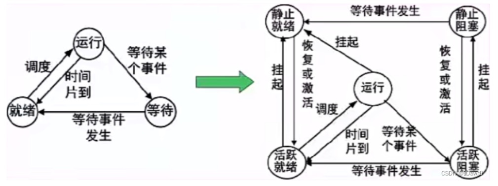

<!-- p62 -->
- 当人为干预后，进程将被挂起，进入静止状态，此时，需要人为激活，才能恢复到活跃状态，之后的本质还是三态图

### 2.2．前趋图

- 前趋图：用来表示哪些任务可以并行执行，哪些任务之间有顺序关系

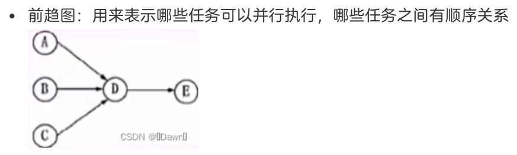

- 由图可知 A B C 可以并行执行，但是必须 A B C 都执行完后，才能执行 D，这就确定了两点： **任务间的并行** 、 **任务间的先后顺序**

### 2.3．进程资源图

- 进程资源图：用来表示进程和资源之间的分配和请求关系

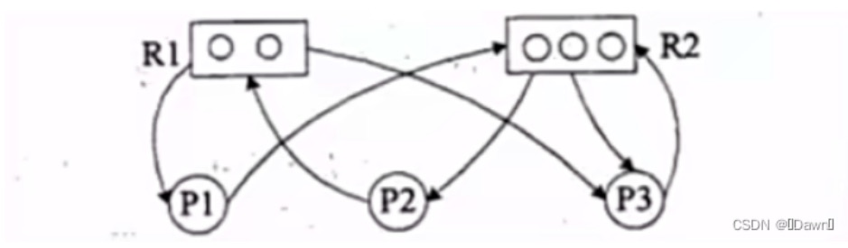

- **P** 代表 **进程** ， **R** 代表 **资源** ， **R方框中有几个圆球就表示有几个这种资源** ，在图中，R1指向P1，表示R1有一个资源已经分配给了P1，P1指向R2，表示P1还需要请求一个R2资源才能执行
- **阻塞节点** ：某进程所请求的资源已经全部分配完毕，无法获取所需资源，该进程被阻塞了无法继续。如上图中P2
- **非阻塞节点** ：某进程所请求的资源还有剩余，可以分配给该进程继续运行。如上图中P1、P3
- 当一个进程资源图中 **所有进程都是阻塞节点** 时，即 **陷入死锁** 状态

### 2.4．进程间的通信

#### 2.4.1．同步与互斥

- **互斥** ：某资源（即临界资源）在 **同一时间内** 只能由一个任务单独使用，使用时需要加锁，使用完后解锁才能被其他任务使用；如打印机
- **同步** ：多个 **任务** 可以 **并发执行** ，只不过有速度上的差异，在一定情况下停下等待， **不存在** 资源是否单独或共享的问题；如自行车和汽车
- **临界资源** ：各进程间需要 **以互斥方式** 对其进行 **访问** 的资源
- **临界区** ：指进程中对临界资源实施操作的那段程序。 **本质是一段程序代码**
- **互斥信号量** ：对 **临界资源** 采用互斥访问，使用互斥信号量后其他进程无法访问， **初值为1**
- **同步信号量** ：对 **共享资源** 的访问控制， **初值** 一般是 **共享资源的数量**

<!-- p63 -->
#### 2.4.2．信号量操作

- P操作： **申请资源** ，S=S-1
  - 若 S >= 0 ，则执行P操作的进程继续执行
  - 若 S < 0 ，则置该进程为阻塞状态(因为无可用资源)，并将其插入阻塞队列
- V操作： **释放资源** ，S=S+1
  - 若S > 0 ，则执行V操作的进程继续执行
  - 若S <= 0 ，则从阻塞状态唤醒一个进程，并将其插入就绪队列(此时因为缺少资源被P操作阻塞的进程可以继续执行)，然后执行v操作的进程继续

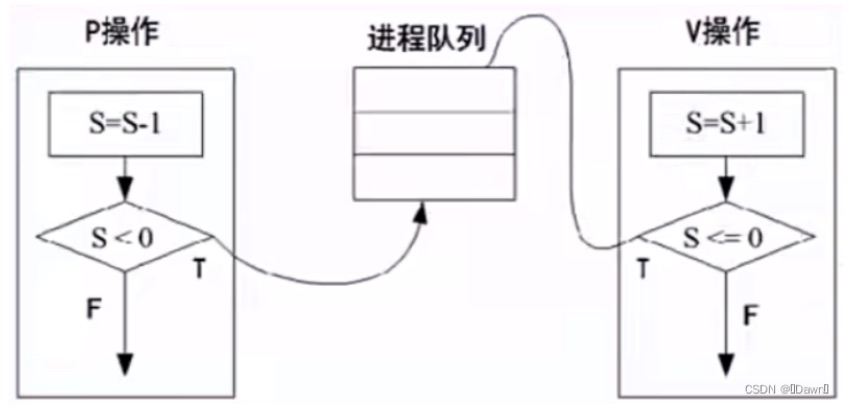

#### 2.4.3．生产者和消费者问题

- 三个信号量：
  - 互斥信号量S0(仓库独立使用权)
  - 同步信号量S1(仓库空闲个数)
  - 同步信号量S2(仓库商品个数)

| 生产者流程 | 消费者流程 |
| --- | --- |
| 生产一个商品S | P(S0) |
| P(S0) | P(S2) |
| P(S1) | 取出一个商品 |
| 将商品放入仓库中 | V(S1) |
| V(S2) | V(S0) |

### 2.5．死锁

当一个进程在等待永远不可能发生的事件时，就会产生死锁，若系统中有多个进程处于死锁状态，就会造成系统死锁

- **死锁产生** 的四个必要 **条件** ：
  - 资源互斥
  - 每个进程占有资源并等待其他资源
  - 系统不能剥夺进程资源
  - 进程资源图是一个环路

<!-- p64 -->
- 死锁产生后， **解决措施** 是打破四大条件，有下列方法:
  - 死锁 **预防** ：采用某种策略限制并发进程对于资源的请求，破坏死锁产生的四个条件之一，使系统任何时刻都不满足死锁的条件。
  - 死锁 **避免** ：一般采用 **银行家算法** 来避免，银行家算法，就是提前计算出一条不会死锁的资源分配方法，才分配资源，否则不分配资源，相当于借贷，考虑对方还得起才借钱，提前考虑好以后，就可以避免死锁
  - 死锁 **检测** ：允许死锁产生，但系统定时运行一个检测死锁的程序，若检测到系统中发生死锁，则设法加以解除。
  - 死锁 **解除** ：即死锁发生后的解除方法，如强制剥夺资源，撤销进程等
- 死锁计算问题： **系统内有n个进程，每个进程都需要R个资源** ，那么其 **发生死锁** 的 **最大资源数** 为 $n*(R-1)$ 。其 **不发生死锁** 的 **最小资源数** 为 $n*(R-1)+1$

### 2.6．线程

- 传统的进程有两个属性
  - 可拥有资源的独立单位
  - 可独立调度和分配的基本单位
- 引入线程后， **线程是独立调度的最小单位** ， **进程是拥有资源的最小单位** ，线程可以共享进程的公共数据、全局变量、代码、文件等资源，但不能共享线程独有的资源，如线程的栈指针等标识数据

## 3．存储管理

### 3.1．页式存储管理

将 **进程空间分为一个个页** ，假设每个页大小为4K，同样的将系统的物理空间也分为一个个4K大小的物理块(页帧号)，这样，每次将需要运行的逻辑页装入物理块中，运行完再装入其他需要运行的页，就可以分批次运行完进程，而无需将整块逻辑空间全部装入物理内存中

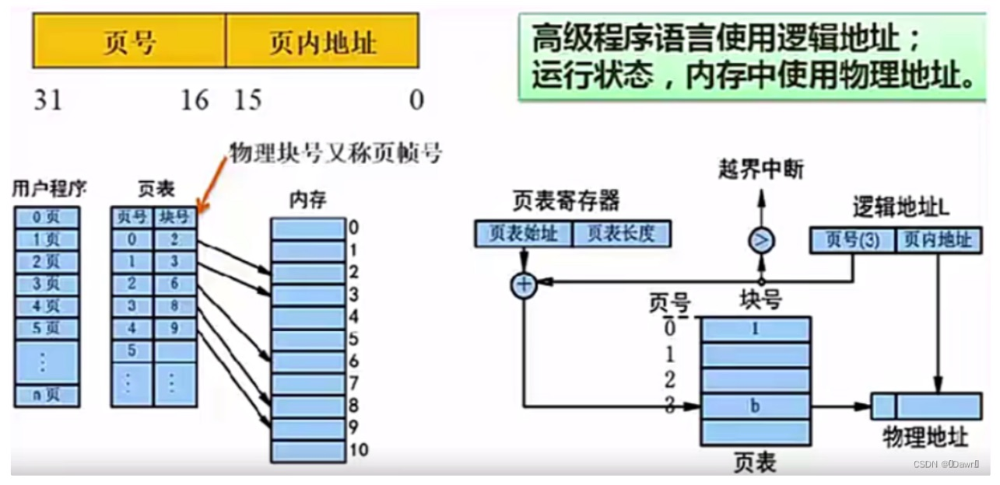

- 优点：利用率高、碎片小(只在最后一个页中有)、分配及管理简单
- 缺点：增加了系统开销，可能产生抖动现象

<!-- p65 -->
#### 3.1.1．页面置换算法

有时候，进程空间分为100个页面，而系统内存只有10个物理块，无法全部满足分配，就需要将马上要执行的页面先分配进去，而后根据算法进行淘汰，使100个页面能够按执行顺序调入物理块中执行完

- 缺页表示需要执行的页不在内存物理块中，需要从外部调入内存，会增加执行时间，因此，缺页数越多，系统效率越低
- **最优算法** ： `OPT` ， **理论** 上的 **算法** ， **无法实现** ，是在进程执行完后进行的最佳效率计算，用来 **让其他算法比较差距** 。原理是选择未来最长时间内不被访问的页面置换，这样可以保证未来执行的都是马上要访问的
- **先进先出算法** ： `FIFO` ，先调入内存的页先被置换淘汰， **会产生抖动现象** ，即分配的页数越多，缺页率可能越多(即效率越低)
- **最近最少使用** ： `LRU` ，在 **最近的过去** ，进程执行过程中， **过去最少使用的页面被置换淘汰** ，根据局部性原理，这种方式效率高，且 **不会产生抖动现象**

#### 3.1.2．快表

- 块表是一块小容量的相联存储器，由快速存储器组成，按内容访问，速度快，并且可以从硬件上保证按内容并行查找，一般用来存放当前访问最频繁的少数活动页面的页号
- 快表是将页表存于cache中；慢表示将页表存于内存上。因此慢表需要访问两次内存才能取出页，而快表是访问一次Cache和一次内存，因此更快

### 3.2．段式存储管理

将进程空间分为一个个段，每段也有段号和段内地址，与页式存储不同的是，每段物理大小不同，分段是根据逻辑整体分段的
地址表示：（段号，段内偏移）：其中 **段内偏移不能超过该段号对应的段长** ，否则越界错误，而此地址对应的真正内存地址应该是： **段号对应的基地址 + 段内偏移**

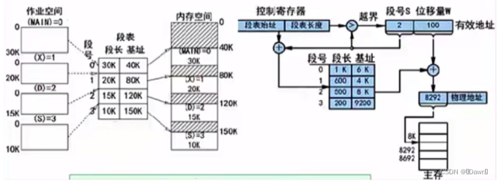

- 优点：程序逻辑完整，修改互不影响
- 缺点：内存利用率低，内存碎片浪费大

<!-- p66 -->
### 3.3．段页式存储管理

对进程空间先分段，后分页

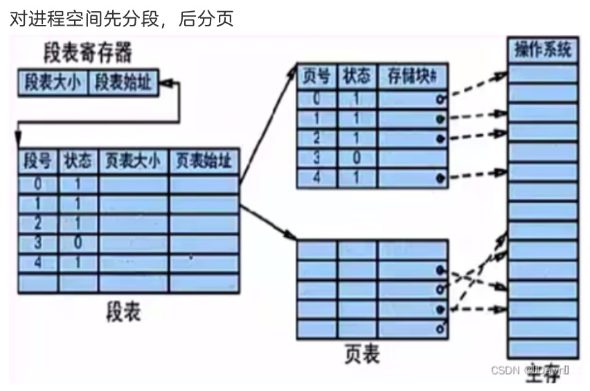

- 优点：空间浪费小、存储共享容易、能动态连接
- 缺点：由于管理软件的增加，复杂性和开销也增加，执行速度下降

## 4．文件管理

### 4.1．文件结构

计算机系统中采用的索引文件结构如图所示：

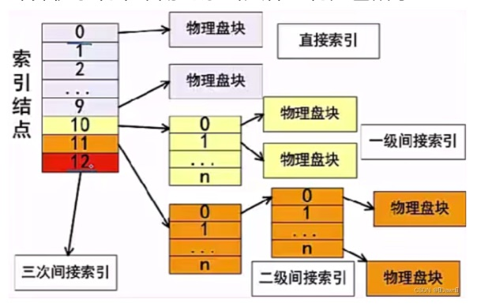

- 系统中有13个索引节点， **0-9为直接索引** ，即每个索引节点存放的内容，假设每个物理盘大小为4KB，共可存 $4KB \times 10 = 40KB$ 数据
- **10号索引节点为一级间接索引节点** ，大小为4KB， **存放** 的并非直接数据，而是 **链接到直接物理盘块的地址** ，假设每个地址占4B，则共有1024个地址，对应1024个物理盘，可存 $1024 \times 4KB = 4098KB$ 数据
- 二级索引节点类似，直接盘存放一级地址，一级地址再存放物理盘快地址，而后链接到存放数据的物理盘块，容量又扩大了一个数量级，为 $1024 \times 1024 \times 4KB$ 数据

### 4.2．树形文件目录

- **相对路径** ：是从 **当前路径开始** 的路径
- **绝对路径** ：是从 **根目录开始** 的路径
- **全文件名 = 绝对路径 + 文件名** 。要注意， **绝对路径和相对路径是不加最后的文件名的，只是单纯的路径序列**

<!-- p67 -->
- 树形结构主要是区分相对路径和绝对路径，如图所示:

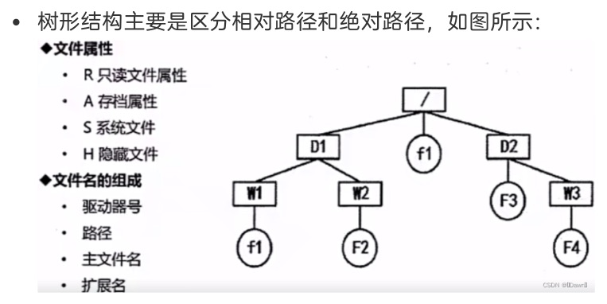

### 4.3．空闲存储空间管理

- 空闲区表法：将所有空闲空间整合成一张表，即空闲文件目录
- 空闲链表法：将所有空闲空间链接成一个链表，根据需要分配
- 成组链接法：既分组，每组内又链接成链表，是上述两种方法的综合
- **位示图法** ：对每个物理空间用一位标识，为1则使用，为o则空闲，形成一张位示图

## 5．设备管理

- 设备的分类方式：
  - 按数据组织分类：：块设备、字符设备
  - 资源分配角度分类：独占设备、共享设备和虚拟设备
  - 数据传输速率分类：低速设备、中速设备、高速设备
- **I／O 软件层次结构** ：

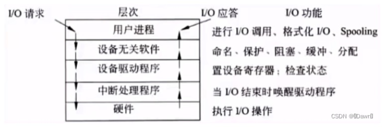

### 5.1．输入输出技术

- **程序控制（查询）方式** ：CPU主动 **查询外设** 是否完成数据传输， **效率极低**
- **程序中断方式** ： **外设完成数据传输** 后，向CPU发送中断，等待CPU处理数据， **效率相对较高** 。适用于键盘等实时性较高的场景
  - **中断响应时间** 指的是 **从发出中断请求到开始进入中断** 处理程序
  - **中断处理时间** 指的是 **从中断处理开始到中断处理结束**
  - **中断向量提供** 中断服务程序的 **入口地址**
  - **多级中断嵌套** ， **使用堆栈** 来保护断点和现场
- **DMA方式（直接主存存取）** ：CPU只需完成必要的初始化等操作，数据传输的整个过程都由DMA控制器来完成， **在主存和外设之间建立直接的数据通路** ， **效率很高** 。适用于硬盘等高速设备
- 在一个总线周期结束后，CPU会响应DMA请求开始读取数据；CPU响应程序中断方式请求是在一条指令执行结束时；区分指令执行结束和总线周期结束

<!-- p68 -->
### 5.2．虚设备和SPOOLING技术

一台实际的物理设备，例如打印机，在同一时间只能由一个进程使用，其他进程只能等待，且不知道什么时候打印机空闲，此时，极大的浪费了外设的工作效率
引入SPOOLING技术，就是在外设上建立两个数据缓冲区，分别称为输入井和输出井，这样，无论多少进程，都可以共用这一台打印机，只需要将打印命令发出，数据就会排队存储在缓冲区中，打印机会自动按顺序打印，实现了物理外设的共享，使得每个进程都感觉在使用一个打印机，这就是物理设备的虚拟化。如下图所示：

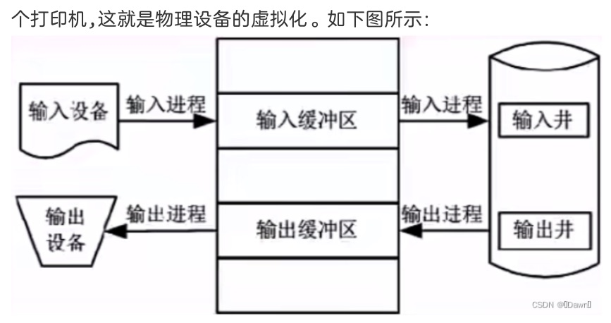

### 5.3．磁盘结构

- 磁盘有正反两个盘面，每个盘面有多个同心圆，每个同心圆是一个磁道，每个同心圆又被划分为多个扇区，数据就被存放在一个个扇区中
- 读取数据时，磁头首先要寻找到对应的磁道，然后等待磁盘进行周期旋转，旋转到指定的扇区，才能读取到对应的数据，因此，会产生 **寻道时间** 和 **等待时间** ，就是磁头移动到磁道所需的时间和等待读写的扇区转到磁头的下方所用的时间。其中 **寻道时间耗时最长** ，寻道时间的调度算法如下：
  - **先来先服务FCFS** ：根据 **进程** 请求访问磁盘的 **先后顺序** 进行调度
  - **最短寻道时间优先SSTF** ：请求访问的磁道 **与当前磁道最近的进程优先** 调度，使得每次的寻道时间最短。会产生"饥饿"现象，即 **远处进程可能永远无法访问**
  - **扫描算法SCAN** ：又称" **电梯算法** "，磁头在磁盘上 **双向移动** ，其会选择离磁头当前所在磁道最近的请求访问的磁道，并且与磁头移动方向一致，磁头永远都是 **从里向外或者从外向里一直移动完才掉头** ，与电梯类似
  - **单向扫描调度算法CSCAN** ：与SCAN不同的是，其只做单向移动，即 **只能从里向外或者从外向里**

<!-- p69 -->
## 6．特殊的操作系统

### 6.1．微内核操作系统

微内核，顾名思义，就是尽可能的将内核做的很小，只将最为核心必要的东西放入内核中，其他能独立的东西都放入用户进程中，这样，系统就被分为了用户态和内核态

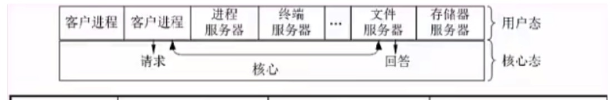

| | 实质 | 优点 | 缺点 |
| --- | --- | --- | --- |
| **单体内核** | 将图形、设备驱动及文件系统等功能全部在内核中实现，运行在内核状态和同一地址空间。 | 减少进程间通信和状态切换的系统开销，获得较高的运行效率。 | 内核庞大，占用资源较多且不易剪裁。系统的稳定性和安全性不好。 |
| **微内核** | 只实现基本功能，将图形系统、文件系统、设备驱动及通信功能放在内核之外。 | 内核精练，便于剪裁和移植。系统服务程序运行在用户地址空间，系统的可靠性、稳定性和安全性较高。可用于分布式系统 | 用户状态和内核状态需要频繁切换，从而导致系统效率不如单体内核。 |

### 6.2．嵌入式操作系统

- 嵌入式操作系统特点：微型化、代码质量高、专业化、实时性强、可裁剪可配置
- 实时嵌入式操作系统的内核服务：异常和中断、计时器、I／O管理
- 常见的嵌入式RTOS(实时操作系统)：VxWorks、RT-Linux、QNX、pSOS
- **嵌入式系统初始化过程** 按照 **自底向上、从硬件到软件** 的次序依次为： **片级初始化—>板级初始化—>系统初始化**
- 芯片级是微处理器的初始化，板卡级是其他硬件设备初始化，系统级初始化就是软件及操作系统初始化

<!-- p70 -->
# 结构化开发与方法

## 1．系统分析与设计

### 1.1．系统分析概述

- 系统分析是一种问题求解技术，它将一个系统分解成各个组成部分，目的是研究各个部分如何工作、交互，以实现其系统目标
- 目的和任务：系统分析的主要任务是对现行系统进一步详细调查，将调查中所得到的文档资料集中， **对组织内部整体管理状况和信息处理过程进行分析** ，为系统开发提供所需的资料，并提交 **系统方案说明书**
- 系统分析的主要步骤：
  - 认识、理解当前的现实环境，获得当前系统的"物理模型"
  - 从当前系统的"物理模型"抽象出当前系统的"逻辑模型"
  - 对当前系统的"逻辑模型"进行分析和优化，建立目标系统的"逻辑模型"
  - 对目标系统的逻辑模型具体化（物理化），建立目标系统的物理模型
- **系统开发的目的是将现有系统的物理模型转换为目标系统的物理模型**

### 1.2．系统设计

#### 1.2.1．系统设计的基本原理

- 系统设计基本原理：
  - **抽象** （重点说明本质方面，忽略非本质方面）
  - **模块化** （可组合、分解和更换的单元）
  - **信息隐蔽** （将每个程序的成分隐蔽或封装在一个单一的设计模块中）
  - **模块独立** （每个模块完成一个相对独立的特定子功能，且与其他模块之间的联系简单）
- 模块的设计要求独立性高，就必须 **高内聚，低耦合**
  - **内聚** 是指一个模块 **内部功能** 之间的 **相关性**
  - **耦合** 是指多个 **模块之间** 的联系

<!-- p71 -->
#### 1.2.2．内聚

**内聚程度从低到高如下表所示** ：

| 内聚分类 | 定义 | 记忆关键字 |
| --- | --- | --- |
| 偶然内聚 | 一个模块内的各处理元素之间没有任何联系 | 无直接关系 |
| 逻辑内聚 | 模块内执行若干个逻辑上相似的功能，通过参数确定该模块完成哪一个功能 | 逻辑相似、参数决定 |
| 时间内聚 | 把需要同时执行的动作组合在一起形成的模块 | 同时执行 |
| 过程内聚 | 一个模块完成多个任务，这些任务必须按指定的过程执行 | 指定的过程顺序 |
| 通信内聚 | 模块内的所有处理元素都在同一个数据结构上操作，或者各处理使用相同的输入数据或者产生相同的输出数据 | 相同数据结构、相同输入输出 |
| 顺序内聚 | 一个模块中的各个处理元素都密切相关于同一功能且必须顺序执行，前一个功能元素的输出就是下一个功能元素的输入 | 顺序执行、输入为输出 |
| 功能内聚 | 最强的内聚，模块内的所有元素共同作用完成一个功能，缺一不可 | 共同作用、缺一不可 |

<!-- p72 -->
#### 1.2.3．耦合

**耦合程度从低到高如下表所示** ：

| 耦合分类 | 定义 | 记忆关键字 |
| --- | --- | --- |
| 无直接耦合 | 两个模块之间没有直接的关系，它们分别从属于不同模块的控制与调用，不传递任何信息 | 无直接关系 |
| 数据耦合 | 两个模块之间有调用关系，传递的是简单的数据值，相当于高级语言中的值传递 | 传递数据值调用 |
| 标记耦合 | 两个模块之间传递的是数据结构 | 传递数据结构 |
| 控制耦合 | 一个模块调用另一个模块时，传递的是控制变量，被调用模块通过该控制变量的值有选择的执行模块内的某一功能 | 控制变量、选择执行某一功能 |
| 外部耦合 | 模块间通过软件之外的环境联合（如I/O将模块耦合到特定的设备、格式、通信协议上）时 | 软件外部环境 |
| 公共耦合 | 通过一个公共数据环境相互作用的那些模块间的耦合 | 公共数据结构 |
| 内容耦合 | 当一个模块直接使用另一个模块的内部数据，或通过非正常入口转入另一个模块内部时 | 模块内部关联 |

#### 1.2.4．系统设计

- 在系统分析阶段，我们已经搞清楚了软件"做什么"的问题，并把这些需求通过规格说明书描述了出来，这也是目标系统的逻辑模型。进入设计阶段，要把软件"做什么"的逻辑模型转换成"怎么做"的物理模型
- 系统设计的主要目的是为系统制定蓝图，在各种技术和实施方法中权衡利弊，精心设计，合理地使用各种资源，得出新系统的详细设计方案
- **步骤** ： **概要设计** 和 **详细设计**
  - **概要设计** 基本任务：设计软件系统 **总体结构** 、数据结构及数据库设计、 **编写概要设计文档** 、评审
  - **详细设计** 的基本任务： **模块内** 详细算法设计、模块内数据结构设计、数据库的物理设计、其他设计（代码、输入/输出格式、用户界面）、编写 **详细设计说明书** 、评审

### 1.3．系统总体结构设计

- **系统结构设计** 原则:
  - **分解—协调** 原则
  - **自顶向下** 原则
  - **信息隐蔽和抽象** 原则
  - **一致性** 原则
  - **明确性** 原则

<!-- p73 -->
  - **模块** 间 **高内聚低耦合**
  - **模块** 的 **扇入系数和扇出系数合理**
  - **模块规模适当**
- **子系统划分** 的原则:
  - 子系统要具有 **相对独立** 性
  - 子系统之间数据的 **依赖性尽量小**
  - 子系统划分的结果应使 **数据冗余较小**
  - 子系统的设置应 **考虑今后管理发展** 的需要
  - 子系统的划分应 **便于系统分阶段实现**
  - 子系统的划分应 **考虑到各类资源的充分利用**

## 2．WebApp 分析与设计

### 2.1．WebApp 分析

- WebApp是基于web的系统和应用。大多数WebApp采用 **敏捷开发过程模型** 进行开发
- WebApp 的 **特性** ：
  - **网络密集性** （服务于不同客户全体的需求）
  - **并发性** （大量用户同时访问）
  - **无法预知** 的 **负载量** （用户数量）
  - **性能** （响应时间过长导致用户流失）
  - **可用性** （最好7×24×365可用）
  - **数据驱动** （和用户的数据交互）
- WebApp 五种需求模型:
  - **内容模型** ：给出由WebApp提供的全部系列内容，包括文字、图形、图像、音频和视频。包含结构元素，为WebApp的内容需求提供了一个重要的视图。这些结构元素包含内容对象和所有分析类，在用户与WebApp交互时生成并操作用户可见的实体
    - **内容的开发** 可能发生在WebApp实现之前、构建之中、或者投入运行以后（ **全过程** ）
    - 内容对象：产品的文本描述、新闻文章、照片、视频等
    - 数据树：由多项内容对象和数据项组成的任何内容都可以生成数据树，是内容设计的基础，定义一种层级关系，并提供一种审核内容的方法
      以便在开始设计前发现遗漏和不一致内容
  - **交互模型** ：描述了用户与WebApp采用了哪种交互方式。由一种或多种元素构成，包括用例、顺序图、状态图、用户界面原型等
    - 用例是交互分析的主要工具，方便客户理解系统的功能
    - 顺序图是交互分析中描述用户与系统进行交互的方式。用户按照已定顺序使用系统，完成相应的功能，如登录流程
    - 状态图是交互分析中对系统进行动态的描述。如状态的变化

<!-- p74 -->
    - 用户界面原型展现用户界面布局、内容、主要导航链接、实施的交互机制及用户WebApp的整体美观度
  - **功能模型** ：许多WebApp提供大量的计算和操作功能，这些功能与内容直接相关（既能使用又能生成内容，如统计报表）。这些功能常常以用户的交互活动为主要目标
    - 功能模型定义了将用于webApp内容并描述其他处理功能的操作，这些处理功能不依赖于内容却是最终用户所必需的
  - **导航模型** ：为WebApp定义所有导航策略。考虑了每一类用户如何从一个WebApp元素（如内容对象）导航到另一个元素
  - **配置模型** ：描述WebApp所在的环境和基础设施。在必需考虑复杂配置体系结构的情况下， **可以使用UML部署图**

### 2.2．WebApp 设计

- **架构设计** ：使用多层架构来构造，包括用户界面或展示层、基于一组业务规则来指导与客户端浏览器进行信息交互的控制器，以及可以包含WebApp的业务规则的内容或模型层，描述将以什么方式来管理用户交互、操作内部处理任务、实现导航及展示内容
  - **MVC（模型-视图-控制器）结构是WebApp基础结构模型之一，将WebApp功能及信息内容分离**
- **构件设计** ：
  - WebApp构件：定义良好的聚合功能，为最终用户处理内容或提供计算或处理数据；内容和功能的聚合包，提供最终用户所需要的功能。因此，WebApp构件设计通常包括内容设计元素和功能设计元素
  - 构件级 **内容设计** ：关注内容对象，以及包装后展示给最终用户的方式，应该适合创建的WebApp特性
  - 构件级 **功能设计** ：将WebApp作为一系列构件加以交付，这些构件与信息体系结构并行开发，以确保一致性
- **内容设计** ：着重于内容对象的表现和导航的组织，通常采用线性结构、网格结构、层次结构、网络结构四种结构及其组合
- **导航设计** ：定义导航路径，使用户可以访问WebApp的内容和功能

## 3．软件需求

- 按需求内容分类:
  - 业务需求：由客户提出的宏观的一个功能需求
  - 用户需求：设计员去调查需求中涉及到的每个用户的具体需求
  - 系统需求：经过整合，形成最终的系统需求，包括功能、性能、设计约束三个方面的需求
- 从客户角度分类:
  - 基本需求：需求明确规定的功能
  - 期望需求：除了基本需求外，客户认为理所应当包含在内的其他功能
  - 兴奋需求：客户未要求的其他功能需求，会浪费项目开发时间和成本。
- 软件需求分类:
  - 功能需求：软件必须完成的基本动作
  - 性能需求：说明软件或人与软件交互的静态或动态数值需求，如系统响应速度、处理速度等

<!-- p75 -->
  - 设计约束：受其他标准硬件限制等方面的影响
  - 属性：可用性、安全性、可维护性、可转移/转移性
  - 外部接口需求：用户接口、硬件接口、软件接口、通信接口。

### 3.1．需求工程

- 需求工程 **六个阶段** ：
  - **需求获取** ：获取需求，方法有收集资料、联合讨论会JRP、用户访谈、书面调查、现场观摩、参加业务实践、阅读历史文档、抽样调查
  - **需求分析与协商** ：分析不同人提出的所有需求之间的关系并判断
  - **系统建模** ：建立系统的抽象模型
  - **需求规约** ：也即需求定义，目的是为了编写需求规约(即需求规格说明书)，在双方之间达成一个共识
  - **需求验证** ：需求开发阶段的复查手段，需求验证通过后，要请用户签字确认，作为验收标准之一，此时，这个需求规格说明书就是需求基线
  - **需求管理** ：对需求工程涉及的所有过程进行规划和控制

### 3.2．需求管理

- **定义需求基线** ：通过了评审的需求说明书就是需求基线，下次如果需要变更需求，就需要 **按照流程来一步步进行**
- **处理需求变更** ：主要关心需求变更过程中的 **需求风险管理** ，带有风险的做法有： **无足够用户参与** 、 **忽略了用户分类** 、 **用户需求的不断增加** 、 **模棱两可的需求** 、 **不必要的特性** 、 **过于精简的SRS** 、 **不准确的估算**
- **需求跟踪** ： **双向跟踪** ，两个层次，正向跟踪表示用户原始需求是否都实现了，反向跟踪表示软件实现的是否都是用户要求的， **不多不少** 。如下图所示：

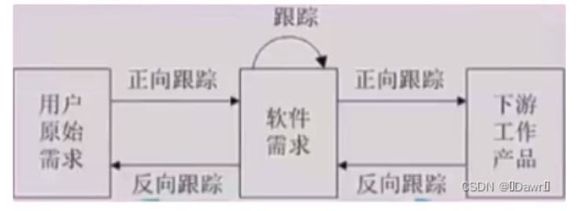

## 4．结构化分析

- 结构化的分析方法SA， **自顶向下** ， **逐步分解** ，是 **面向数据** 的，强调分析对象的数据流， **需要建立** ： **功能模型** （数据流图）、 **行为模型** （状态转换图）、 **数据模型** （E-R图）以及 **数据字典** （数据元素、数据结构、数据流、数据存储、加工逻辑、外部实体）
<!-- p76 -->
### 4.1．数据流图

- 数据流图描述数据在系统中如何被传送或变换，以及如何对数据流进行变换的功能或子功能，用于对功能建模，数据流图相关概念如图：

| 元素 | 说明 | 图元 |
| --- | --- | --- |
| 数据流 | 由一组固定成分的数据组成，表示数据的流向。每个数据流通常有一个合适的名词，反映数据流的含义 | → |
| 加工 | 加工描述了输入数据流到输出数据流之间的变换，也就是输入数据流做了什么处理后变成了输出数据流 | ○ / ▭ |
| 数据存储（文件） | 用来表示暂时存储的数据，每个文件都有名字。流向文件的数据流表示写文件，流出的表示读文件 | = / ⊏ |
| 外部实体 | 指存在于软件系统外的人员或组织 | □ |

- 数据流图是可以分层的，从顶层（即上下文无关数据流）到0层、1层等，顶层数据流图只含有一个加工处理表示整个管理信息系统，描述了系统的输入和输出，以及和外部实体的数据交互。数据流图示例如下：

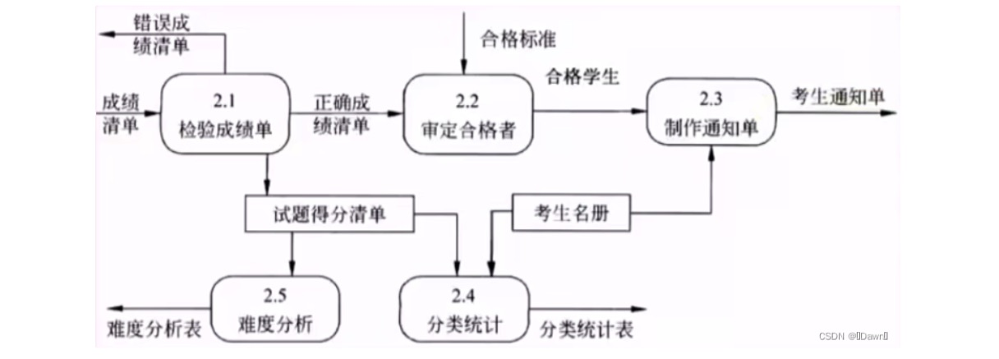

- 数据流图 **基本设计原则**：
  - **数据守恒** 原则：对任何一个加工来说，其所有输出数据流中的数据必须能从该加工的输入数据流中直接获得，或者说是通过该加工能产生的数据
  - **守恒加工** 原则：对同一个加工来说，输入与输出的名字必须不相同，即使它们的组成成分相同
  - 对于每个 **加工**，**必须既有输入** 数据流，**又有输出** 数据流
  - **外部实体与外部实体之间不存在数据流**
  - **外部实体与数据存储之间不存在数据流**
  - **数据存储与数据存储之间不存在数据流**
  - **父图与子图的平衡** 原则：子图的输入输出数据流同父图相应加工的输入输出数据流必须一致，此即父图与子图的平衡。**父图与子图之间的平衡原则不存在于单张图**
  - **数据流与加工有关，且必须经过加工**

<!-- p77 -->
### 4.2．数据字典

- 数据字典是用来定义在数据流图中出现的符号或者名称的含义，在数据流图中，每个存储、加工、实体的含义都必须定义在数据字典中，并且父图和子图之间这些名称要相同。示例如下：

| 符号 | 含义 | 举例说明 |
| --- | --- | --- |
| `=` | 被定义为 |  |
| `+` | 与 | `x=a+b`，表示x由a和b组成 |
| `[...,...]`或`[...\|...]` | 或 | `x=[a,b]`，`x=[a\|b]`，表示x由a或b组成 |
| `{...}` | 重复 | `x={a}`，表示x由0个或多个a组成 |
| `(...)` | 可选 | `x=(a)`，表示a可在x中出现，也可以不出现 |

## 5．测试基础知识

- 系统 **测试** 是 **为了发现错误而执行程序的过程**，成功的测试是发现了至今尚未发现的错误的测试
- 测试 **原则**：
  - 应尽早并 **不断的进行测试**
  - 测试工作应该 **避免由原开发软件的人或小组承担**
  - 在设计测试方案时，不仅要确定 **输入数据**，而且要根据系统功能确定 **预期的输出结果**
  - **既包含有效、合理的测试用例，也包含不合理、失效的用例**
  - 检验程序是否做了该做的事，且是否做了不该做的事
  - 严格按照测试计划进行
  - 妥善保存测试计划和测试用例
  - 测试用例可以重复使用或追加测试

### 5.1．测试阶段

- **单元测试**：对 **单个模块进行测试**，由程序员自己测试模块内部的接口、信息、功能，**测试依据** 是 **软件详细说明书**。在单元测试中，驱动模块（上层）用来调用被测模块，自顶向下的单元测试中不需要另外编写驱动模块。桩模块（底层）用来模拟被测模块所调用的子模块
- **集成测试**：**将模块组合起来进行测试**，分为 **一次性组装**（简单，节约时间，发现错误少，**只适合于小项目**）和 **增量式组装**（能够发现更多错误，耗时长，又可分为：自顶向下、自底向上、混合式）
- **确认测试**：对已完成的软件进行功能上的测试，分为 **内部确认测试**（**无用户** 情况）`Alpha` **测试**（用户在开发环境下进行测试）、`Beta` **测试**（用户在实际使用时进行的测试）、验收测试（用户根据SRS对项目进行验收）
- **系统测试**：对软件进行性能测试，主要测试三个方面，即 **负载测试**（在 **极限情况下**，系统各项性能指标）、**强度测试**（系统 **资源特别低** 的情况下）、**容量测试**（并发测试，系统可以处理的 **同时在线的最大用户数量**）。其他还有可靠性等性能测试，**系统测试采用的是黑盒测试方法**
- **回归测试**：**软件修改错误或变更后**，进行回归测试以验证之前正确的代码是否引入

<!-- p78 -->
### 5.2．测试方法

- **动态测试**：**程序运行时** 测试，分为：
  - **黑盒测试法**：**功能性** 测试，不了解软件代码结构，根据功能设计用例，测试软件功能
  - **白盒测试法**：**结构性** 测试，明确代码流程，根据代码逻辑设计用例，进行用例覆盖
  - **灰盒测试法**：即既有黑盒，也有白盒
- **静态测试**：**程序静止时**，即对代码进行人工审查，分为：
  - **桌前检查**：程序员检查自己编写的程序，在程序编译后，单元测试前
  - **代码审查**：由若干个程序员和测试人员组成 **评审小组**，通过召开程序评审会来进行审查
  - **代码走查**：也是采用开会来对代码进行审查，但并非简单的检查代码，而是由测试人员提供测试用例，让程序员扮演计算机的角色，**手动运行测试用例，检查代码逻辑**

### 5.3．测试策略

- **自底向上**：**从最底层模块开始测试**，需要编写驱动程序，而后开始 **逐一合并模块**，最终完成整个系统的测试。优点是较早的验证了底层模块
- **自顶向下**：**先测试整个系统**，需要编写桩程序，而后 **逐步向下** 直至最后测试最底层模块。优点是较早的验证了系统的主要控制和判断点
- **三明治**：**既有自底向上也有自顶向下** 的测试方法，二者都包括。兼有二者的优点，缺点是测试工作量大

### 5.4．测试用例设计

- **黑盒测试** 用例：将 **程序看做一个黑盒子**，只知道输入输出，不知道内部代码，由此 **设计出测试用例**，分为下面几类：
  - **等价类划分**：把所有的数据按照 **某种特性进行归类**，而后在 **每类的数据里选取一个** 即可。等价类测试用例的设计原则：设计一个新的测试用例，使其尽可能多地覆盖尚未被覆盖的有效等价类，重复这一步，直到所有的有效等价类都被覆盖为止；计一个新的测试用例，使其仅覆盖一个尚未被覆盖的无效等价类，重复这一步，直到所有的无效等价类都被覆盖为止
  - **边界值划分**：将每类的边界值作为测试用例，**边界值一般为范围的两端值以及在此范围之外的与此范围间隔最小的两个值**，如年龄范围为0-150，边界值为 `0, 150, -1, 151` 四个。
  - **错误推测**：没有固定的方法，凭经验而言，来推测有可能产生问题的地方作为测试用例进行测试
  - **因果图**：由一个结果来反推原因的方法，具体结果具体分析，没有固定方法
- **白盒测试** 用例：知道程序的代码逻辑，按照程序的代码语句，来设计覆盖代码分支的测试用例，**覆盖级别从低至高** 分为下面六种：
  - **语句覆盖**：逻辑代码中的 **所有语句** 都要被执行一遍，覆盖层级最低，因为执行了所有的语句，不代表执行了所有的条件判断
  - **判定覆盖**：逻辑代码中的 **所有判断语句的条件的真假分支** 都要覆盖一次
  - **条件覆盖**：对于代码中的 **一个条件，可能是组合的**，如 `a>0 && b<0`，判断覆盖只针对此组合条件的真假分支做两个测试用例，而条件覆盖是 **对每个独立的条件都要做真假分支的测试用例**，共可有4个测试用例，层级更高，注意区别，条件覆盖，针对每个条件都要真假覆盖，判定覆盖，只针对一个条件判断语句
  - **判定/条件覆盖**：使判定中 **每个条件的所有可能取值（真/假）至少出现一次**，并且每个判定本身的判定结果（真/假）也至少出现一次，即两种覆盖的综合

<!-- p79 -->
  - **条件组合覆盖**：每个判定条件中条件的各种可能值的组合都至少出现一次
  - **路径覆盖**：逻辑代码中的 **所有可行路径都覆盖** 了，覆盖层级最高

### 5.5．调试

- 测试是发现错误，**调试** 是 **找出错误的代码和原因**
- 调试需要确定错误的准确位置；确定问题的原因并设法改正；改正后要进行回归测试
- 调试的 **方法** 有：
  - **蛮力法**
  - **回溯法**（从出错的地方开始，向回找）
  - **原因排除法**（找出所有可能的原因，逐一进行排除，具体包括演绎法、归纳法、二分法）

## 6．系统转换

- 系统转换是指新系统开发完毕，投入运行，取代现有系统的过程，需要考虑多方面的问题，以实现与老系统的交接，有以下三种转换计划：
  - 直接转换：现有系统被新系统直接取代了，风险很大，适用于新系统不复杂，或者现有系统已经不能使用的情况。优点是节省成本。
  - 并行转换：新系统和老系统并行工作一段时间，新系统经过试运行后再取代，若新系统在试运行过程中有问题，也不影响现有系统的运行，风险极小，在试运行过程中还可以比较新老系统的性能，适用于大型系统。缺点是耗费人力和时间资源，难以控制两个系统间的数据转换。
  - 分段转换：分期分批逐步转换，是直接和并行转换的集合，将大型系统分为多个子系统，依次试运行每个子系统，成熟一个子系统，就转换一个子系统。同样适用于大型项目，只是更耗时，而且现有系统和新系统间混合使用，需要协调好接口等问题
- 数据转换与迁移：将数据从旧数据库迁移到新数据库中。要在新系统中尽可能的保存归系统中合理的数据结构，才能降低迁移的难度。也有三种方法：
  - 系统切换前通过工具迁移
  - 系统切换前采用手工录入
  - 系统切换后通过新系统生成
- 转换的过程称为ETL，有三个步骤：
  - 抽取（旧数据库数据）
  - 转换（三种转换方法）
  - 装载（装入新数据库，并校验数据）

## 7．系统维护

- 软件维护是软件生命周期中的最后一个阶段，不属于系统开发过程。是在软件已经交付使用之后为了改正错误或满足新的需求而修改软件的过程，即软件在交付使用后对软件所做的一切改动
- 系统的 **可维护性** 可以定义为维护人员理解、改正、改动和改进这个软件的难易程度，其 **评价指标** 如下：

<!-- p80 -->
  - **易测试性**：指为确认经修改软件所需努力有关的软件属性
  - **易分析性**：指为诊断缺陷或失效原因，或为判定待修改的部分所需努力有关的软件属性
  - **易改变性**：指与进行修改、排错或适应环境变换所需努力有关的软件属性
  - **稳定性**：指与修改造成未预料效果的风险有关的软件属性
- 系统维护包括硬件维护、软件维护和数据维护，其中 **软件维护类型** 如下：
  - **正确性维护**：**发现了`bug`而进行的修改**
  - **适应性维护**：由于 **外部环境发生了改变**，被动进行的对软件的修改和升级
  - **完善性维护**：基于用户主动对软件提出更多的需求，修改软件，**增加更多的功能**，使其比之前的软件功能、性能更高，更加完善
  - **预防性维护**：对未来可能发生的`bug`进行预防性的修改

## 8．系统评价

- 系统评价 **分类**：
  - **立项评价**：系统开发前的预评价，分析是否立项开发，做可行性评价
  - **中期评价**：项目开发中期每个阶段的阶段评审。或者项目在开发中途遇到重大变故，评价是否还要继续
  - **结项评价**：系统投入正式运行后，了解系统是否达到预期的目的和要求而对系统进行的综合评价
- 系统评价指标：
  - 从信息系统的组成部分出发，信息系统是一个由人机共同组成的系统，所以可以按照运行效果和用户需求（人）、系统质量和技术条件（机）这两条线索构造指标
  - 从信息系统的评价对象出发，对于开发方来说，他们所关心的是系统质量和技术水平；对于用户方而言，关心的是用户需求和运行质量；系统外部环境则主要通过社会效益指标来反映
  - 从经济学角度出发，分别按系统成本、系统效益和财务指标3条线索建立指标

<!-- p81 -->
# 软件工程

## 1．软件工程概述

- 软件工程基本原理：用分阶段的生命周期计划严格管理、坚持进行阶段评审、实现严格的产品控制、采用现代程序设计技术、结果应能清楚的审查、开发小组的人员应少而精、承认不断改进软件工程实践的必要性
- 软件工程的 **基本要素**：**方法**、**工具**、**过程**
- **软件生存周期**：可行性分析与项目开发计划、需求分析、概要设计（选择系统解决方案，规划子系统）、详细设计（设计子系统内部具体实现）、编码、测试、维护

## 2．软件过程

### 2.1．能力成熟度模型CMM

- 能力成熟度模型 `CMM`：对软件组织化阶段的描述，随着软件组织定义、实施、测量、控制和改进其软件过程，软件组织的能力经过这些阶段逐步提高

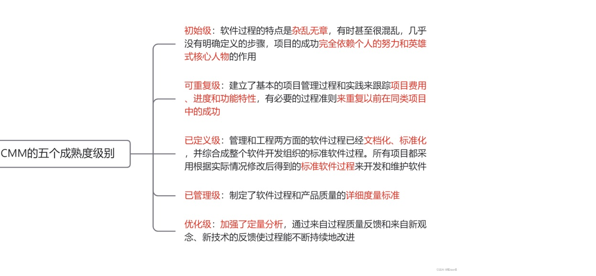

### 2.2．能力成熟度模型CMMI

- 能力成熟度模型 `CMMI`：**将已有的几个CMM模型结合** 在一起，使之构造成为"集成模型"。支持多个工程学科和领域的、系统的、一致的过程改进框架，能适应现代工程的特点和需要，能提高过程的质量和工作效率
- CMMI两种表示方法：
  - 阶段式模型：类似于CMM，它关注组织的成熟度，五个成熟度模型如下：
    - 初始的：过程不可预测且缺乏控制
    - 已管理的：过程为项目服务
    - 已定义的：过程为组织服务
    - 定量管理的：过程已度量和控制
    - 优化的：集中于过程改进

<!-- p82 -->
  - 连续式模型：关注每个过程域的能力，一个组织对不同的过程域可以达到不同的过程域能力等级

### 2.3．统一过程UP

- 统一过程模型：是一种开发过程，特性如下：
  - 三大 **特点**：**用例和风险驱动**、**以架构为中心**、**迭代并且增量**
  - **开发的四个阶段**：
    - **起始**（项目的初始活动，如确认需求和风险评估等）
    - **精化**（需求分析和架构设计等）
    - **构建**（系统的构建，产生实现模型等）
    - **移交**（软件提交方面的工作，产生软件增量，进行β测试，交付系统等）
  - UP的每一次迭代都是一次完整的软件开发过程，包括整个软件开发生命周期，有五个核心工作流（需求、分析、设计、实现、测试）

## 3．软件过程模型

软件过程模型：即软件开发模型，是软件开发全部过程、活动和任务的结构框架

### 3.1．瀑布模型

- **瀑布模型(SDLC)**：结构化方法中的模型，是结构化的开发，开发流程如同瀑布一般，一步一步的走下去，直到最后完成项目开发，**只适用于需求明确或者二次开发(需求稳定)**，当需求不明确时，最终开发的项目会错误，有很大的缺陷

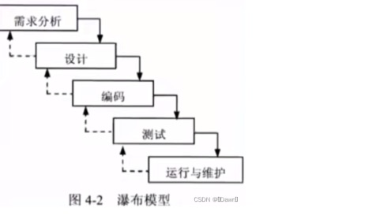

### 3.2．V模型

- **V模型**：是瀑布模型的一个变体。特点是 **增加了很多轮测试**，并且这些 **测试贯穿于软件开发的各个阶段**，不像其他模型都是软件开发完再测试，很大程度上保证了项目的准确性。V模型开发和测试级别对应如图：

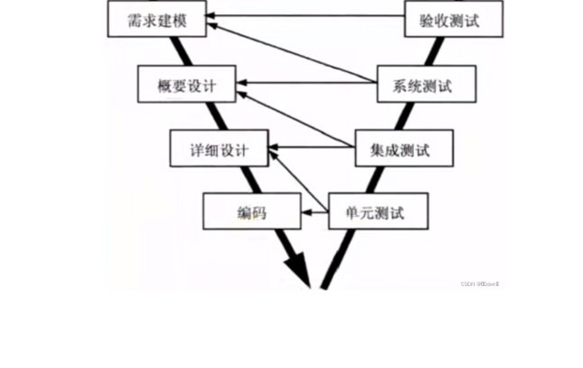

<!-- p83 -->
### 3.3．演化模型

#### 3.3.1．原型模型

- **原型模型**：即快速原型开发，与瀑布模型相反，原型针对的就是 **需求不明确** 的情况，首先快速构造一个功能模型，演示给用户看，并按用户要求及时修改，中间再通过不断的演示与用户沟通，最终设计出项目，就不会出现与用户要求不符合的情况，采用的是迭代的思想

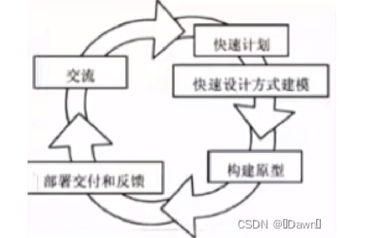

#### 3.3.2．螺旋模型

- **螺旋模型**：是多种模型的混合，针对需求不明确的项目，与原型类似，但是增加了 **风险分析**，这也是其最大的特点
- 四步：制定计划—风险分析—实施工程—用户评估

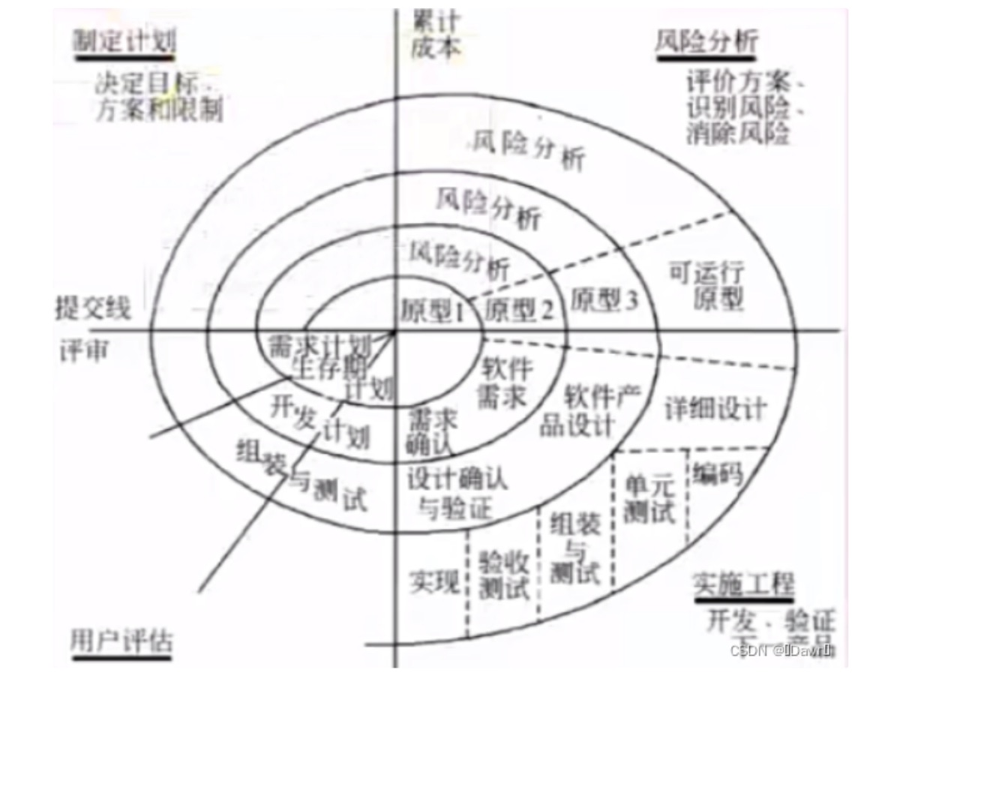

<!-- p84 -->
### 3.4．增量模型

- **增量模型**：首先开发核心模块功能，而后与用户确认，之后再开发次核心模块的功能，即每次开发一部分功能，并与用户需求确认，最终完成项目开发，**优先级最高的服务最先交付**
- **特点**：但由于并不是从系统整体角度规划各个模块，因此不利于模块划分。难点在于如何将客户需求划分为多个增量。与原型不用的是 **增量模型的每一次增量版本都可作为独立可操作的作品**，而原型的构造一般是为了演示

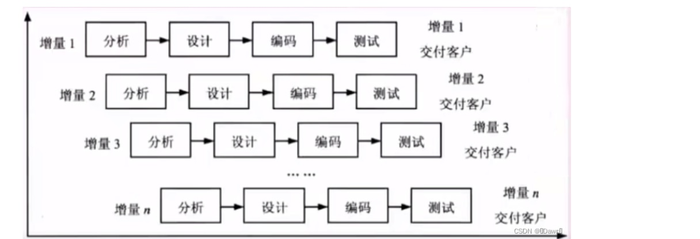

### 3.5．其他模型

- **喷泉模型**：是一种以用户需求为动力，以对象作为驱动的模型，适合于 **面向对象的开发方法**。使开发过程具有迭代性和无间隙性
- **基于构件的开发模型CBSD**：利用预先包装的 **构件** 来构造应用系统。构件可以是组织内部开发的构件，也可以是商品化成品软件构件
  - 特点是增强了复用性，在系统开发过程中，会构建一个构件库，供其他系统复用，因此可以提高可靠性，节省时间和成本
- **形式化方法模型**：建立在严格 **数学** 基础上的一种软件开发方法，主要活动是生成计算机软件形式化的数学规格说明

### 3.6．软件开发方法

- **结构化方法**：**流程固定**，针对 **需求明确** 的项目，**自顶向下**，**逐层分解**，面向 **数据流**。将数据流映射为软件系统的模块结构，数据流类型包括变换流型和事务流型，不同类型的数据流有不同的映射方法。以瀑布模型为代表，一旦开发完成，将难以修改，不利于复用及后续版本的开发，现在被面向对象法给代替了
  - 结构化方法的 **设计**：
    - **体系结构设计** 是宏观架构设计
    - **数据设计** 是数据流的设计
    - **接口设计** 关注模块间的连接设计
    - **过程设计** 是模块内的具体实现过程的数据结构和算法的设计
- **Jackson方法**：**面向数据结构** 的开发方法，**适合于小规模** 的项目
- **原型方法**：适合于 **需求不明确** 的开发，以原型模型为代表
- **面向对象方法**：**强调复用性**，构建全面合理的模型供不同项目使用，方便修改，节省开发时间和效率，增强复用性，**以构件组装模型为代表**

<!-- p85 -->
### 3.7．敏捷开发

- 针对中小型项目，主要是为了 **给程序员减负**，去掉一些不必要的会议和文档。指代一组模型（极限编程、自适应并发、水晶方法……），这些模型都具有相同的原则和价值观，具体如下图（要求对该图眼熟，并掌握重要概念）

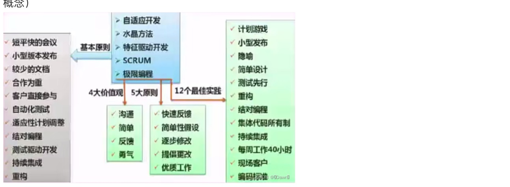

- **开发宣言**：
  - **个体和交互胜过过程和工具**
  - **可以工作的软件胜过面面俱到的文档**
  - **客户合作胜过合同谈判**
  - **响应变化胜过遵循计划**
- **结对编程**：**一个** 程序员 **开发**，**另一个** 程序 **在一旁观察审查代码**，能够有效的提高代码质量，在开发同时对代码进行初步审查，**共同对代码负责**
- **自适应开发**：强调开发方法的 **适应性(Adaptive)**。不像其他方法那样有很多具体的实践做法，它更侧重为软件的重要性提供最根本的基础，并从更高的组织和管理层次来 **阐述开发方法为什么要具备适应性**
- **水晶方法**：每一个 **不同的项目** 都需要一套 **不同的策略、约定和方法论**
- **特性驱动开发**：是一套针对 **中小型软件开发项目** 的开发模式。是一个 **模型驱动** 的快速迭代开发过程，它强调的是简化、实用、易于被开发团队接受，适用于需求经常变动的项目
- **极限编程XP**：**核心** 是 **沟通**、**简明**、**反馈** 和 **勇气**。因为知道计划永远赶不上变化，XP无需开发人员在软件开始初期做出很多的文档。XP **提倡测试先行**，为了将以后出现bug的几率降到最低
- **并列争球法SCRUM**：是一种 **迭代的增量化过程**，把每段时间(30天) 一次的迭代称为一个 **"冲刺"**，并按需求的优先级别来实现产品多个自组织和自治的小组并行地递增实现产品

## 4．软件工具与软件开发环境

### 4.1．软件工具

- **软件开发工具**：对于于软件 **开发过程的各种活动**。包括需求分析工具、设计工具、编码与排错工具、测试工具
- **软件维护工具**：辅助软件 **维护过程中活动的软件**，辅助维护人员对软件代码及其文档进行各种维护活动。包括版本控制工具、文档分析工具、开发信息库工具、逆向工程工具、再工程工具
- **软件管理和软件支持工具**：辅助管理人员和软件支持人员的 **管理活动和支持活动**，以确保软件高质量的完成。包括项目管理工具、配置管理工具、软件评价工具

<!-- p86 -->
### 4.2．软件开发环境

- **软件开发环境**：指支持软件产品开发的软件系统，由 **软件工具集** 和 **环境集成机制** 构成。工具集用于支持软件开发的相关过程、活动和任务；环境集成机制为工具集成和软件开发、维护和管理提供统一的支持
- **开发支持环境**（**环境信息库**，**过程控制和消息服务**，**用户界面规范**）

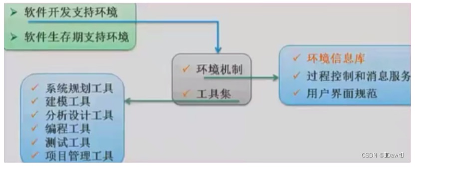

## 5．软件项目管理

有效的项目管理集中在4P上：**人员**、**产品**、**过程**、**项目**

### 5.1．软件项目估算

#### 5.1.1．成本估算方法

- 自顶向下估算：又称类比估算法，确定一个总金额，再向下分摊到每一个功能点
- 自底向上估算：从底层功能点开始估算成本，向上累加
- 差别估算法：与以前项目比较，找出不同点重新估算，相同点则直接估算
- 专家估算：聘请专家以其经验对项目整体费用进行估算

#### 5.1.2．COCOMO估算模型

- **COCOMO模型**：常见的软件规模估算方法。常用的代码行分析方法作为其中一种度量估计单位，以代码行数估算出每个程序员工作量，累加得软件成本
- 模型 **按其详细程度** 可以 **分** 为三级：
  - **基本COCOMO模型**：是一个 **静态单变量模型**，它用一个以已估算出来的原代码行数(LOC)为自变量的经验函数计算软件开发工作量
  - **中间COCOMO模型**：在基本COCOMO模型的基础上，再用涉及产品、硬件、人员、项目等方面的影响因素调整工作量的估算
  - **详细COCOMO模型**：包括中间COCOMO模型的所有特性，但更进一步考虑了软件工程中每一步骤（如分析、设计）的影响
- **COCOMO II 模型**：COCOMO的升级，也是以软件规模作为成本的主要因素，考虑多个成本驱动因子。该方法包括 **三个阶段性模型**：
  - **应用组装模型**（软件工程前期阶段使用）
  - **早期设计阶段模型**（需求已经稳定并且基本的软件体系结构已经建立时使用）
  - **体系结构阶段模型**（软件的构造过程中使用）

<!-- p87 -->
#### 5.1.3．Putnam估算模型

- **Putnam估算模型**：一种 **动态多变量** 模型，假设在软件开发的整个生存周期中工作量有特定的分布

### 5.2．进度管理

- 基本原则：划分、相互依赖、时间分配、工作量确认、确定责任、明确输出结果、确定里程碑
- **Gantt图**：又称为横道图，横轴表示时间，纵轴表示活动，以 **时间顺序表示活动**，**能反应** 活动间的 **并行关系**，但 **无法反应** 活动之间的 **依赖关系**，因此也难以清晰的确定关键任务和关键路径

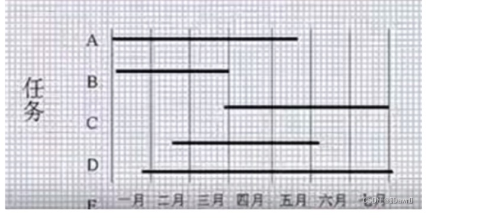

- **PERT图**：类似于前趋图，是有向图，**反应** 活动之间的 **依赖关系**，有向边上标注活动运行的时间，但 **无法反应** 活动之间的 **并行关系**

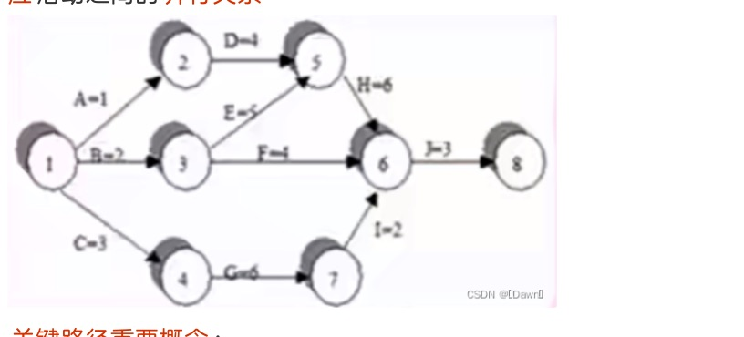

- **关键路径重要概念**：
  - 最早开始时间ES：取所有前驱活动最早完成时间EF的最大值
  - 最早完成时间EF：最早开始时间ES + 活动本身时间DU
  - 关键路径(项目总工期)：项目中耗时最长的一条线路
  - 最晚完成LF：取后续活动最晚开始时间的最小值
  - 最晚开始时间LS：最晚完成LF - 活动本身时间DU
  - 松弛时间：某活动的最晚开始时间 - 最早开始时间（或最晚完成时间 - 最早完成时间），也即该活动最多可以晚开始多少天

### 5.3．软件项目的组织

- **组织结构** 模式：**项目型**(项目经理绝对领导)、**职能型**（部门领导为主）、**矩阵型**(二者结合，既有项目经理也有部门领导，但权利分割不同)。
- 程序 **设计小组的组织方式**：
  - **主程序员制小组**：主程序员全权负责，后援工程师必要时能替代主程序员，**适合大规模项目**
  - **民主制小组**：也即无主程序员小组，**成员之间地位平等**，任何决策都是全员参与投票，适 **合于项目规模小，开发人员少，采用新技术和确定性较小的项目**
  - **层次式小组**：两个层次，一名 **组长领导** 若干个 **高级程序员**，每个 **高级程序员领导** 若干个 **程序员**

<!-- p88 -->
### 5.4．软件配置管理

- **基线**：软件开发过程中特定的点，是项目生存期各开发 **阶段末尾** 的特定点，又称为 **里程碑**，反应阶段性成果
- **软件配置项**：是软件工程中产生的 **信息项**，是 **配置管理** 的 **基本单位**
  - 软件开发过程中的所有文档、代码、工具都可作为配置项，主要包括六种类型：
    - 环境类（系统开发环境）
    - 定义类（需求分析与系统定义阶段）
    - 设计类（设计阶段）
    - 编码类（编码及单元测试阶段）
    - 测试类（系统测试完成后的工作）
    - 维护类（维护阶段）
    - 即 **产品组成部分的工作成果 ＋ 项目管理和机构支撑过程域产生的文档**
  - **版本控制**：即软件配置项的版本控制，**配置项** 有三个 **状态**：**草稿**、**正式**、**修改**。如下：

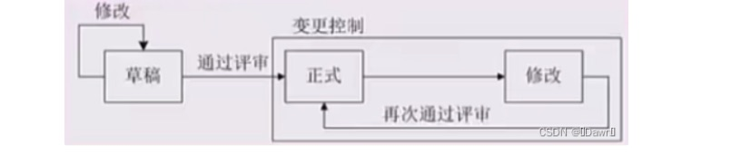

- **版本命名规则**：
  - 处于草稿状态的配置项的版本号格式为：0.YZ，其中YZ数字范围为01～99。随着草稿的不断完善，YZ的取值应递增。YZ的初值和增幅由开发者自己把握。
  - 处于正式发布状态的配置项的版本号格式为：X.Y。其中X为主版本号，取值范围为1～9；Y为次版本号，取值范围为1-9。配置项第一次正式发布时，版本号为1.0。
  - 如果配置项的版本升级幅度比较小，一般只增大Y值，X值保持不变。只有当配置项版本升级幅度比较大时，才允许增大X值。
  - 处于正在修改状态的配置项的版本号格式为：X.YZ。在修改配置项时，一般只增大Z值，X.Y值保持不变。
- 变更控制：软件开发过程中的每一次修改都要纳入变更，以防止版本混乱，需要用到基线和配置数据库的概念。配置数据库分为下面三种：
  - 开发库。专供开发人员使用，其中的信息可能做频繁修改，对其控制相当宽松
  - 受控库。在生存期某一阶段工作结束时发布的阶段产品，这些是与软件开发工作相关的计算机可读信息和人工可读信息。软件配置管理正是对受控库中的各个软件项进行管理，受控库也称为软件配置库
  - 产品库。在开发的软件产品完成系统测试后，作为最终产品存入产品库，等待交付用户或现场安装

### 5.5．风险管理

- 软件风险两个特性：不确定性（可能发生也可能不发生）、损失（发生会产生恶性后果）
- **项目风险威胁** 到 **项目计划**，如果项目风险发生，有可能拖延项目的进度和增加项目的成本。指预算、进度、人员、资源、利益相关者、需求等方面的潜在问题以及它们对软件项目的影响。项目复杂度、规模及结构不确定性也属于项目风险因素
- **技术风险威胁** 到要开发软件的 **质量** 和 **交付时间**，如果技术风险发生，开发工作就变得很困难或者不可能，指设计、实现、接口、验证和维护等方面的潜在问题。此外，规格说明的歧义性、技术的不确定性、技术陈旧以及"前沿"技术也是技术风险因素
- **商业风险威胁** 到要 **开发软件的生存能力**，包括下面五种：
  - 市场风险。开发了一个没有人真正需要的优良产品或系统

<!-- p89 -->
  - 策略风险。开发的产品不再符合公司的整体商业策略
  - 销售风险。开发了一个销售部门不知道如何去销售的产品
  - 管理风险。由于重点的转移或人员的变动而失去了高级管理层的支持预算风险。没有得到预算或人员的保证

#### 5.5.1．风险管理的过程

- **风险识别**：**识别出** 项目中 **已知** 和 **可预测的风险**，确定风险的来源、产生的条件、描述风险的特征以及哪些项目可以产生风险，**形成一个风险列表**
- **风险预测**：又称为 **风险估计**，从两个方面预测风险，即风险可能及生的概和风险发生产生的后果，因此有 **风险曝光度 = 风险发生的可能性 * 风险发生会带来的损失**
- **风险评估**：**定义风险参照水准**，将识别出来的风险 **评估分类**
- **风险控制**：**辅助** 项目组 **建立处理** 风险的 **策略**，包括 **风险避免**、**风险监控**、**RMMM计划**（风险缓解、监控和管理计划）

## 6．软件质量管理

### 6.1．软件质量特性

- ISO/IEC9126软件质量模型：质量特性和子特性

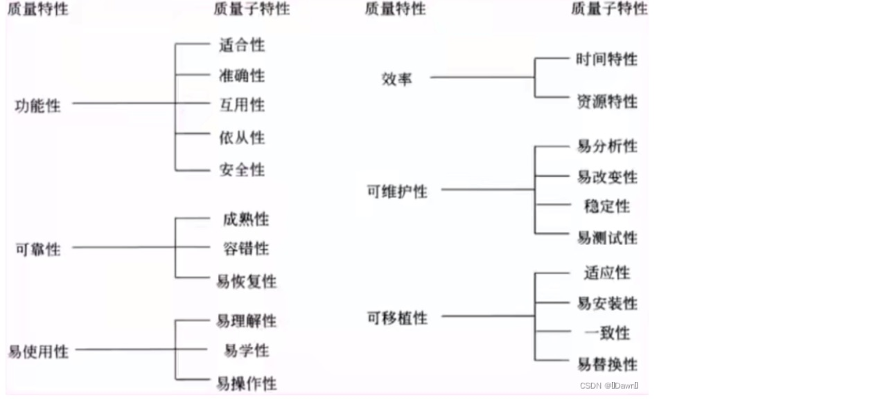

- McCall质量模型
  - 三个方面，11个质量特性
  - 给出了 **三层框架模型**：**质量特性**、**评价标准**、**度量指标**

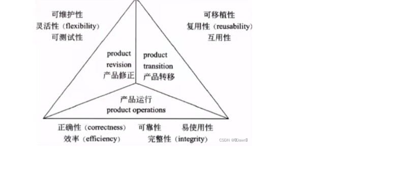

<!-- p90 -->
### 6.2．软件质量保证

- 3个要点：
  - 软件 **必须满足用户需求**，与用户需求不一致的软件无质量可言
  - 软件应 **遵循** 规定的一系列 **开发标准**，不遵循这些准则的软件，其质量难以得到保证
  - 软件还应 **满足某些隐含的需求**（如可理解性、可维护性，未明确写在用户需求中）
- 7个任务：
  - **应用技术方法**（把软件质量设计到产品中而非事后保证）
  - 正式的 **技术评审**
  - **测试** 软件
  - **标准的实施**（遵循标准）
  - **控制变更**
  - **度量**（收集软件度量）
  - **记录保存和报告**

### 6.3．软件容错技术

- 通常将 **质量** 理解为用户满意程度，为了使用户满意有 **两个必要条件**：
  - 设计的规格说明书符合用户标准，称为 **设计质量**
  - 程序按照设计规格说明书所规定的情况正确执行，称为 **程序质量**
- 设计质量评审、程序质量评审
- **容错** 就是软件遇到错误的 **处理能力**，**实现** 容错的 **手段** 主要是 **冗余**，包括下面四种冗余技术：
  - 结构冗余：
    - **静态**（通过表决和比较，**少数服从多数**）
    - **动态**（**多重模块待机备份**，故障时切换备份机）
    - **混合冗余**（**二者综合**）
  - **信息冗余**：为检错和纠错在数据中加上一段额外的信息，例如 **校验码原理**
  - **时间冗余**：遇到错误时 **重复执行**，例如回滚，重复执行还有错，则转入错误处理逻辑
  - **冗余附加技术**：冗余附加技术 **是** 指为实现结构、信息和时间冗余技术 **所需的资源和技术**，包括程序、指令、数据、存放和调动它们的空间和通道等

## 7．软件度量

- 软件的两种属性：
  - **外部属性** 指面向管理者和用户的属性，**可直接测量**，一般为性能指标
  - **内部属性** 指软件产品本身的的属性，如可靠性等，**只能间接测量**
- `McCabe`度量法：又称为 **环路复杂度**，假设有向图中有向 **边数为m**，**节点数为n**，则此有向图的环路复杂度为

$$m - n + 2$$

<!-- p91 -->
  - 注意m和n代表的含义不能混淆，可以用一个最简单的环路来做特殊值记忆此公式，另外，针对 **一个程序流程图**，**每一个分支边（连线）就是一条有向边，每一条语句（语句框）就是一个顶点**

<!-- p92 -->
# 网络与信息安全

## 1．网络概述

### 1.1．计算机网络的概念

- 计算机网络是计算机技术与通信技术相结合的产物，它实现了远程通信、远程信息处理和资源共享
- 计算机网络的功能：数据通信、资源共享、负载均衡、高可靠性。

#### 1.1.1．计算机网络的分类

| 网络分类 | 缩写 | 分布距离 | 计算机分布范围 | 传输速率范围 |
| --- | --- | --- | --- | --- |
| 局域网 | LAN | 10m左右 | 房间 | 4Mbps～1Gbps |
| 局域网 | LAN | 100m左右 | 楼宇 | 4Mbps～1Gbps |
| 局域网 | LAN | 1000m左右 | 校园 | 4Mbps～1Gbps |
| 城域网 | MAN | 10km | 城市 | 50Kbps～100Mbps |
| 广域网 | WAN | 100km以上 | 国家或全球 | 9.6Kbps～45Mbps |

#### 1.1.2．网络的拓扑结构

- 总线型（利用率低、千扰大、价格低）
- 星型(交换机形成的局域网、中央单元负荷大)
- 环型（流动方向固定、效率低扩充难）
- 树型（总线型的扩充、分级结构）
- 分布式（任意节点连接、管理难成本高）

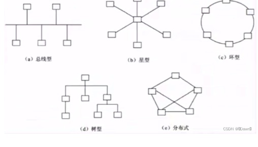

#### 1.1.3．OSI / RM 参考模型

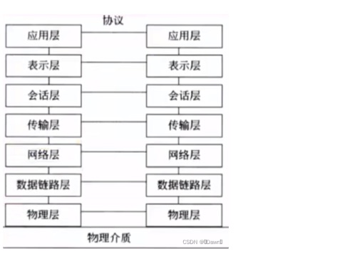

- **OSI / RM (ISO/OSI) 七层模型**（从下到上）：
  - **物理层**：**二进制数据传输**，物理链路和物理特性相关
  - **数据链路层**：将 **数据封装成帧** 进行传送，准确传送至局域网内的物理主机上

<!-- p93 -->
  - **网络层**：**数据分组传输和路由选择**，能准确的将数据传送至互联网的网络主机上
  - **传输层**：**端到端的连接**，传送数据至主机端口上
  - **会话层**：管理主机之间的会话，提供会话管理服务（建立、维护和结束会话）
  - **表示层**：提供解释所交换信息含义的服务，包括数据之间的格式转换、压缩、加密等操作，对数据进行处理
  - **应用层**：**实现具体的应用功能**。直接进程间的通信

### 1.2．网络互连硬件

- **物理层**：**中继器**（扩大信号）、集线器Hub（多路中继器）
- **数据链路层**：**网桥**（分析帧地址）、**交换机**（多口网桥，MAC地址表）
- **网络层**：**路由器**（连接多个逻辑上分开的网络，路由选择）
- **应用层**：**网关**（连接不同类型且协议差别较大的网络，协议转换）
- 传输介质：
  - 有线介质：双绞线(最大长度100m，每端需要一个RJ45插件)、同轴电缆、光纤
  - 无线介质：微波、红外线和激光、卫星通信
- 组建网络：服务器、客户端、网络设备、通信介质、网络软件

### 1.3．网络的协议

- 局域网的协议：
  - IEEE802.3标准以太网（CSMA/CD），速度为10Mbps，传输介质为同轴电缆
  - IEEE802.3u为快速以太网，速度为100Mbps，传输介质为双绞线
  - IEEE802.3z为千兆以太网，速度为1000Mbps，传输介质为光纤或双绞线
  - IEEE802.4令牌总线网
  - IEEE802.5令牌环网
- 无线局域网协议：CSMA/CA（载波侦听多路访问方法）
- 广域网的协议：
  - 点对点协议PPP（拨号上网）
  - 数字用户线xDSL（ADSL上传网速和下载网速不对等，下载网速一般很快）
  - 数字专线DDN（市内或长途的数据电路）
  - 帧中继（以帧为传输单位）

<!-- p94 -->
#### 1.3.1．TCP/IP 协议族

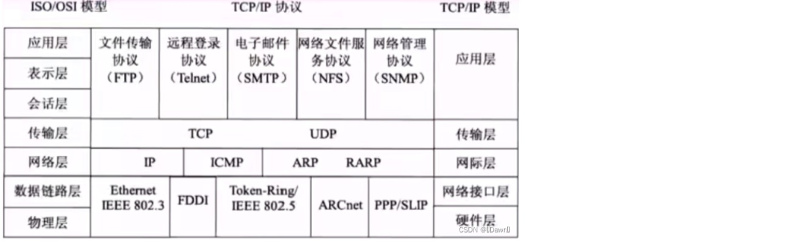

- 特性：
  - 逻辑编址（网卡-物理地址，Internet-逻辑地址）
  - 路由选择（定义路由器如何选择网络路径）
  - 域名解析（域名解析为IP地址）
  - 错误检测和流量控制（可靠性、防止拥塞）
- TCP/IP分层模型：
  - 应用层：具体应用功能
  - **传输层**：提供应用程序间 **端到端** 的通信
  - 网际层：又称IP层，处理机器间的通信，数据以分组为单位
  - **网络接口层**：又称为数据链路层，负责 **接收IP数据报**，并把数据报通过选定的网络发送出去
- 网际层协议：
  - **IP**：最重要核心的协议，**无连接、不可靠**
  - **ICMP**：因特网控制信息协议，用来 **检测网络通信是否顺畅**
  - ARP和RARP：地址解析协议
    - **ARP**：将 **IP地址转换为物理地址**
    - **RARP**：将 **物理地址转换为IP地址**
- 传输层协议：
  - **UDP协议**：**不可靠连接**，因为数据传输只管发送，不用对方确认，因此 **可能会有丢包现象**。一般用于视频、音频数据传输
  - **TCP协议**：**可靠连接**，因为有验证机制，每发送一个数据包，都要求对方回复确认；初始建立连接，有三次握手机制，即A发送连接信息给B(SEQ=X)，B收到后回复确认帧(SEQ=Y, ACK=X+1)，A收到确认帧后冉发送确认(SEQ=X+1, ACK=Y+1)，才能建立连接（上述SEQ表示本机发送的数据包序号，A和B之间的SEQ分别计数，而ACK为确认帧，ACK=X+1表示已经收到了A机发送的第X个数据包，期望下一个收到第X+1个数据包）
- 应用层协议：
  - **基于TCP** 的FTP、HTTP等都是 **可靠** 传输。**基于UDP** 的DHCP、DNS等都是 **不可靠** 传输
  - FTP：可靠的文件传输协议
  - HTTP：超文本传输协议，用于上网。使用SSL加密后的安全网页协议为HTTPS
  - SMTP和POP3：邮件传输协议，邮件报文采用ASCII格式表示

<!-- p95 -->
  - Telnet：远程连接协议
  - TFTP：不可靠的小文件传输协议
  - SNMP：简单网络管理协议，必须以管理员的身份登录才能完成配置
  - DHCP：动态分配IP地址协议，客户机/服务器模型，租约默认为8天，当租约过半时，客户机需要向DHCP服务器申请续租，当租约超过87.5%时，如果仍然没有和当初提供IP地址的DHCP服务器联系上，则开始联系其他DHCP服务器
  - DNS：域名解析协议，将域名解析为IP地址

#### 1.3.2．路由选择策略

- 静态路由选择（不能根据网络流量和拓扑结构的变化来调整自身的路由表，也就不能找出最佳路由）：
  - 固定式路由选择：每个网络节点存储一张表格，表格中每一项记录着对应某个目的节点的下一节点或链路，当一个分组到达某节点时，该节点只要根据分组上的地址信息，便可从固定的路由表中查出对应的目的节点及所应选择的下一节点
  - 洪泛式路由选择：又叫扩散法，一个分组由源站发送到与其相邻的所有节点，最先到达目的节点的一个或若干个分组肯定经过了最短的路径，其主要应用在诸如军事网络等强壮性要求很高的场合
  - 随机路由选择：一个分组只在与其相邻的节点中随机的选择一条转发
- 动态路由选择（节点的路由选择要依靠网络当前的状态信息来决定。这种策略能较好地适应网络流量、拓扑结构的变化，有利于改善网络的性能。但由于算法复杂，会增加网络的负担）：
  - 分布式路由选择：基本算法有距离向量算法（各节点周期性地向所有相邻节点发送路由刷新报文)和链路状态算法（各节点独立计算最短通路、能够快速适应网络变化、交换的路由信息少，复杂难以实现）
  - 集中式路由选择。由网络控制中心（NCC）负责全网状态信息的收集、路由计算及最佳路由的实现。最简单的方法是将最新路由定期发送到网络中各节点上去
  - 混合式动态路由选择：将分布路由选择与集中路由选择、以及其它路由选择方法混合使

### 1.4．Internet 及应用

#### 1.4.1．IP 地址

- 分类地址格式：IP地址分四段，每段八位，共32位二进制数组成
- 在逻辑上，这32位IP地址分为网络号和主机号，依据网络号位数的不同，可以将IP地址分为以下几类：

| 类别 | 点分十进制 | 最低/最高 | 二进制 |
| --- | --- | --- | --- |
| A类 | 0.0.0.0 | 最低 | **0**0000000 00000000 00000000 00000000 |
| A类 | 127.255.255.255 | 最高 | **0**1111111 11111111 11111111 11111111 |
| B类 | 128.0.0.0 | 最低 | **10**000000 00000000 00000000 00000000 |
| B类 | 191.255.255.255 | 最高 | **10**111111 11111111 11111111 11111111 |
| C类 | 192.0.0.0 | 最低 | **110**00000 00000000 00000000 00000000 |
| C类 | 223.255.255.255 | 最高 | **110**11111 11111111 11111111 11111111 |
| D类组播 | 224.0.0.0 | 最低 | **1110**0000 00000000 00000000 00000000 |
| D类组播 | 239.255.255.255 | 最高 | **1110**1111 11111111 11111111 11111111 |
| E类保留 | 240.0.0.0 | 最低 | **1111**0000 00000000 00000000 00000000 |
| E类保留 | 255.255.255.255 | 最高 | **1111**1111 11111111 11111111 11111111 |

- A类地址网络号占8位，主机号则为32-8=24位，能分配的主机个数为 $2^{24}-2$ 个（注意：**主机号为全0和全1的不能分配**，是特殊地址）
- B类地址网络号为16位

<!-- p96 -->
- C类地址网络号为24位
- 上图中红色的位数表示该位固定为该值，是每类IP地址的标识
- 子网划分：
  - 按上述划分的ABC三类，一般是最常用的，但是却并不实用，因为主机数之间相差的太大了，不利于分配，因此，我们一般采用子网划分的方法来划分网络，即自定义网络号位数，就能自定义主机号位数，就能根据主机个数来划分出最适合的方案，不会造成资源的浪费。因此就有子网的概念，一般的IP地址按标准划分为ABC类后，可以进行再一步的划分，将主机号拿出几位作为子网号，就可以划分出多个子网，此时IP地址组成为 **网络号 + 子网号 + 主机号**
  - 网络号和子网号都为1，主机号都为0，这样的地址为 **子网掩码**
  - 要注意的是：**子网号可以为全0和全1，主机号不能为全0或全1，因此，主机数需要-2，而子网数不用**
- 无分类编制：除了上述的分类编址外，还有无分类编址，即不按照ABC类规则，自动规定网络号，无分类编址格式为：IP地址/网络号，示例：128.168.0.11/20表示的IP地址为128.168.0.11，其网络号占20位，因此主机号占32-20=12位，也可以划分子网
- 特殊含义的IP地址：

| IP | 说明 |
| --- | --- |
| 127网段 | 回播地址 |
| 网络号全0地址 | 当前子网中的主机 |
| 全1地址 | 本地子网的广播 |
| 主机号全1地址 | 特定子网的广播 |
| 10.0.0.0/8 | 10.0.0.1 至10.255.255.254 |
| 172.16.0.0/12 | 172.16.0.1 至 172.31.255.254 |
| 192.168.0.0/16 | 192.168.0.1 至 192.168.255.254 |
| 169.254.0.0 | 保留地址，用于DHCP失效(Win) |
| 0.0.0.0 | 保留地址，用于DHCP失效(Linux) |

#### 1.4.2．IPv6

主要是为了解决IPv4地址数不够用的情况而提出的设计方案，IPv6具有以下特性：

- IPv6地址长度为128位，地址空间增大了 $2^{96}$ 倍
- 灵活的IP报文头部格式，使用一系列固定格式的扩展头部取代了IPv4中可变长度的选项字段。IPv6中选项部分的出现方式也有所变化，使路由器可以简单携过选项而不做任何处理，加快了报文处理速度
- IPv6简化了报文头部格式，加快报文转发，提高了吞吐量
- 提高安全性，身份认证和隐私权是IPv6的关键特性
- 支持更多的服务类型
- 允许协议继续演变，增加新的功能，使之适应未来技术的发展

#### 1.4.3．其他重要应用

- 层次化网络模型从下至上分为三层：
  - 接入层：功能单一，向本地网段提供用户接入
  - 汇聚层：功能多样，可以有多层，包括网络访问策略、数据包的处理、过滤、寻址等中间操作
  - 核心层：功能单一，只负责高速的数据交换。

<!-- p97 -->
  - 网络地址翻译NAT：公司内有很多电脑，在公司局域网内可以互联通信，但是要访问外部因特网时，只提供固定的少量IP地址能够访问因特网，将公司所有电脑这个大的地址集合映射到能够访问因特网的少量IP地址集合的过程就称为NAT
    - 很明显，使用了NAT后，一个公司只有少量固定IP地址可以上网，大大减少了IP地址的使用量
  - 默认网关：一台主机可以有多个网关。默认网关的意思是一台主机如果找不到可用的网关，就把数据包发给默认指定的网关，由这个网关来处理数据包。现在主机使用的网关，一般指的是默认网关
  - 默认网关的IP地址必须与本机IP地址在同一个网段内，即同网络号
  - 冲突域和广播域：路由器可以阻断广播域和冲突域，交换机只能阻断冲突域，因此一个路由器下可以划分多个广播域和多个冲突域；一个交换机下整体是一个广播域，但可以划分多个冲突域；而物理层设备集线器下整体作为一个冲突域和一个广播域
  - 虚拟局域网VLAN：是一组逻辑上的设备和用户，这些设备和用户并不受物理位置的限制，可以根据功能、部门及应用等因素将它们组织起来，相互之间的通信就好像它们在同一个网段中一样。VLAN工作在oSI参考模型的第2层和第3层，一个VLAN就是一个广播域，VLAN之间的通信是通过第3层的路由器来完成的。与传统的局域网技术相比较，VLAN技术更加灵活，它具有以下优点：网络设备的移动、添加和修改的管理开销减少；可以控制广播活动；可提高网络的安全性
  - 虚拟专用网VPN：是在公用网络上建立专用网络的技术。其之所以称为虚拟网，主要是因为整个VPN网络的任意两个节点之间的连接并没有传统专网所需的端到端的物理链路，而是架构在公用网络服务商所提供的网络平台，如Internet、ATM（异步传输模式）、Frame Relay（帧中继）等之上的逻辑网络，用户数据在逻辑链路中传输

## 2．网络安全

### 2.1．网络安全协议

物理层主要使用物理手段，隔离、屏蔽物理设备等，其它层都是靠协议来保证传输的安全，具体如下图所示：

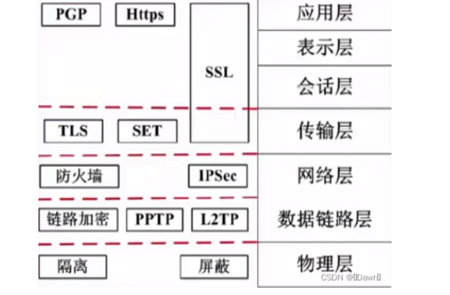

- SSL协议用于网银交易：
  - 三方面的服务：用户和服务器的合法性验证、加密数据以隐藏被传输的数据、保护数据的完整性
  - 实现过程：接通阶段 — 密码交换阶段（客户端和服务器之间交换双方认可的密码）— 会谈密码阶段（客户端和服务器之间产生彼此交谈的会谈密码）— 检验阶段 — 客户认证阶段 — 结束阶段

<!-- p98 -->
### 2.2．防火墙技术

- 防火墙是在内部网络和外部因特网之间增加的一道安全防护措施，它认为内部网络是安全的，外部网络是不安全的。分为网络级防火墙和应用级防火墙，两级之间的安全手段如下所示：
  - **网络级防火墙**，层次低，但是效率高，因为其使用包过滤和状态监测手段，一般只检验网络包外在（起始地址、状态）属性是否异常，若异常，则过滤掉，不与内网通信，因此对应用和用户是透明的。但是这样的问题是，如果遇到伪装的危险数据包就没办法过滤
  - **应用级防火墙**，层次高，效率低，因为应用级防火墙会将网络包拆开，具体检查里面的数据是否有问题，会消耗大量时间，造成效率低下，但是安全强度高。包括双宿主主机、屏蔽主机网关、被屏蔽子网等方法。
    - 被屏蔽子网方法，是在内网和外网之间增加了一个屏蔽子网，相当于多了一层网络，称为 `DMZ`（非军事区），这样，内网和外网通信必须多经过一道防火墙，屏蔽子网中一般存放的是邮件服务器、WEB服务器这些内外网数据交互的服务器，可以屏蔽掉一些来自内部的攻击，但是完全来自系统内部服务器的攻击还是无法屏蔽掉

### 2.3．计算机病毒和木马

- 病毒：编制或者在计算机程序中插入的破坏计算机功能或者破坏数据，影响计算机使用并且能够自我复制的一组计算机指令或者程序代码
  - 病毒具有：传染性、隐蔽性、潜伏性、破坏性、针对性、衍生性、寄生性、未知性
- 木马：是一种后门程序，场被黑客用作控制远程计算机的工具，隐藏在被控制电脑上的一个小程序监控电脑一切操作并盗取信息
- 病毒和木马种类：系统引导型病毒，文件外壳型病毒，目录型病毒
- 蠕虫病毒（感染EXE文件）：熊猫烧香，罗密欧与朱丽叶，恶鹰，尼姆达，冲击波
- 木马：QQ消息尾巴木马，特洛伊木马
- 宏病毒（感染word、excel等文件中的宏变量）：美丽沙，台湾1号
- CIH病毒：史上唯一破坏硬件的病毒
- 红色代码：蠕虫病毒 + 木马

## 3．多媒体基本概念

- 媒体可分为下面五类：
  - 感觉媒体：直接作用于人的感觉器官，使人产生直接感觉的媒体。如：视觉、听觉、触觉等
  - 表示媒体：指传输感觉媒体的中介媒体，即用于数据交换的编码。如：文字、图形、动画、音频和视频等
  - 表现媒体：进行信息输入和信息输出的媒体。如：键盘、鼠标和麦克风；显示器、打印机和音响等
  - 存储媒体：存储表示媒体的物理介质。如磁盘、光盘和内存等
  - 传输媒体：传输表示媒体的物理介质。如电缆、光纤、双绞线等

<!-- p99 -->
### 3.1．声音

- 以声音的带宽来衡量声音的大小，单位是HZ。声音是一种模拟信号，要对其进行处理，就必须将其转化为数字信号。转换过程有三个步骤：采样、量化、编码。
- 人耳能听到的音频信号的频率范围是20HZ~20KHZ
- 声音的采样频率一般为最高频率的两倍，才能保证不失真
- 未经压缩的数字音频数据的传输率计算公式为：数据传输率(bps) = 采样频率(HZ) X 量化位数(bit) X 声道数
- 声音波形经过数字化后所需占用的存储空间计算公式为：声音信号数据量(Byte) = 数据传输率(bps) X 持续时间(s) / 8
- 数字音乐合成方法
  - 数字调频合成法FM：使高频振荡波的频率按调制信号规律变化的一种调制方式。采用不同调制波频率和调制指数，就可以方便的合成具有不同频谱分布的波形，再现某些乐器的音色。可以采用这种方法得到真[?]独特效的"电子模拟声"，创造出丰富多彩的声音，是真实乐器所不具备的音色
  - 波表合成法Wavetable：将各种真实乐器所能发出的所有声音（包括各个音域、声调）录制下来，存贮为一个波表文件。播放时，根据MIDI文件纪录的乐曲信息向波表发出指令，从"表格"中逐一找出对应的声音信息，经过合成、加工后回放出来。合成的音质更好
- 声音特性：
  - 音量：即响度，表示声音的强弱程度，主要取决于声波振幅的大小
  - 音高：表示各种声音的高低，主要取决于声波的振动频率，振动频率越高则音越高
  - 音调：表示声音的调子的高低，由声音本身的频率决定
  - 音色：又称为音品，由声音波形的谐波频谱和包络决定
- 声音文件格式：.wav、.snd、.au、.aif、.voc、.mp3、.ra、.mid等

### 3.2．图形和图像

- 颜色三要素：
  - 亮度：彩色明暗深浅程度
  - 色调(红、绿)：颜色的类别
  - 饱和度：某一颜色的深浅程度
- 彩色空间：即设备显示图片所使用的色彩空间，普通的电脑显示器是RGB色彩空间，除了红、绿、蓝三原色外，其他颜色都是通过这三原色叠加形成的
  - 电视中使用YUV色彩空间，主要是为了兼容黑白电视，使用的是亮度原理，即调不同的亮度，显示不同的颜色
  - CMY(CMYK)，印刷书籍时采用的色彩空间，这个采用的是和RGB相反的减法原理，浅蓝、粉红、黄三原色的印刷颜料实际上是吸收除了本身色彩之外的其他颜色的，因此，印刷出来才是这些颜色
  - HSV(HSB)，艺术家彩色空间，是从艺术的角度划分的
- 图像的属性：分辨率（每英寸像素点数dpi）、像素深度（存储每个像素所使用的二进制位数）
- 图像文件格式：.bmp、.gif、.jpg、.png、.tif、.wmf等
- 图像深度是图像文件中记录一个像素点所需要的位数。显示深度表示显示缓存中记录屏幕上一个点的位数（bit），也即显示器可以显示的颜色数

<!-- p100 -->
  - 水平分辨率：显示器在横向上具有的像素点数目
  - 垂直分辨率：显示器在纵向上具有的像素点数目
  - 矢量图的基本组成单位是图元，位图的基本组成单位是像素，视频和动画的基本组成单元是帧

### 3.3．多媒体计算

**1．图像容量计算**

| 条件 | 示例 |
| --- | --- |
| 知道像素，位数 | 每个像素为16位，图像为640×480像素，求容量：$640×480×16÷8=614{,}400B$ |
| 知道像素，色数 | 640×480像素，256色的图像，求容量：$640×480×\log_2(256)÷8=307{,}200B$ |

**2．音频容量计算**

$$容量 = 采样频率(Hz) × 量化/采样位数(位) × 声道数 ÷ 8$$

**3．视频容量计算**

$$容量 = 每帧图像容量(Byte) × 每秒帧数 × 时间 + 音频容量 × 时间$$

- 上述计算中，图像中要理解色数的概念。要理解音频容量计算的原理，就是每个采样通道的采样次数 X 每次采样的位数 X 总的采用通道数
- 视频就是一帧帧图像的组合，因此本质是求图像容量，当然要加上音频容量
- 注意单位B和b的区别和换算，注意K(大写，1024，存储时才用)和k(小写，1000)的区别，注意结果单位
<!-- p101 -->
# 数据结构

## 1. 线性结构

- 线性结构：每个元素最多只有一个出度和一个入度，表现为一条线状。线性表按存储方式分为顺序表和链表
- 存储结构：
  - 顺序存储：用一组地址连续的存储单元依次存储线性表中的数据元素，使得逻辑上相邻的元素物理上也相邻
  - 链式存储：存储各数据元素的结点的地址并不要求是连续的，数据元素逻辑上相邻，物理上分开

### 1.1. 线性表

顺序存储和链式存储对比:

| 性能类别 | 具体项目 | 顺序存储 | 链式存储 |
| --- | --- | --- | --- |
| 空间性能 | 存储密度 | =1，更优 | <1 |
| 空间性能 | 容量分配 | 事先确定 | 动态改变，更优 |
| 时间性能 | 查找运算 | O(n/2) | O(n/2) |
| 时间性能 | 读运算 | O(1)，更优 | O([n+1]/2)，最好情况为1，最坏情况为n |
| 时间性能 | 插入运算 | O(n/2)，最好情况为0，最坏情况为n | O(1)，更优 |
| 时间性能 | 删除运算 | O([n-1]/2) | O(1)，更优 |

- 在空间方面，因为链表还需要存储指针，因此有空间浪费存在
- 在时间方面，由顺序表和链表的存储方式可知，当需要对元素进行破坏性操作(插入、删除)时，链表效率更高，因为其只需要修改指针指向即可，而顺序表因为地址是连续的，当删除或插入一个元素后，后面的其他节点位置都需要变动。而当需要对元素进行不改变结构操作时(读取、查找)，顺序表效率更高，因为其物理地址是连续的，如同数组一般，只需按索引号就可快速定位，而链表需要从头节点开始，一个个的查找下去

#### 1.1.1. 单链表

单链表的插入和删除:

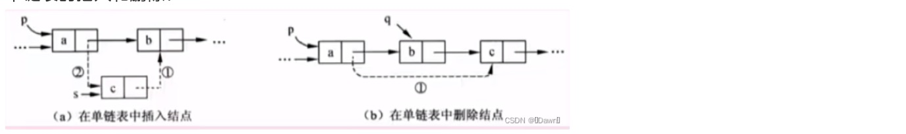

- 插入操作:

```c
s->next = p->next;
p->next = s;
```

- 删除操作:

```c
p->next = p->next->next;
free(p);
```

<!-- p102 -->

#### 1.1.2. 栈和队列

- **栈**：**先进后出**，只有栈顶能进出
- **队列**：**先进先出**，分队头和队尾

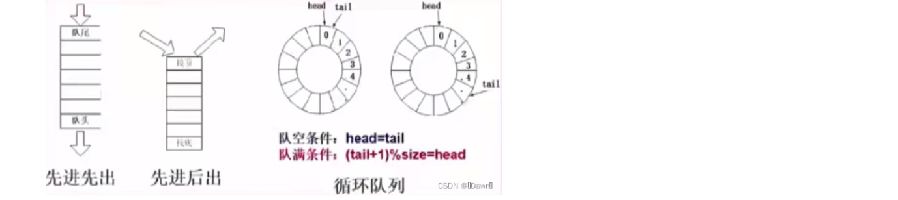

#### 1.1.3. 串

- 字符串是一种特殊的线性表，其数据元素都为字符
  - 空串：长度为0的字符串，没有任何字符
  - 空格串：由一个或多个空格组成的串，空格是空白字符，占一个字符长度
  - 子串：串中任意长度的连续字符构成的序列称为子串。含有子串的串称为主串，空串是任意串的子串
- **串的模式匹配算法**：子串的定位操作，用于查找子串在主串中第一次出现的位置的算法
  - 基本的模式匹配算法：也称为布鲁特-福斯算法，其基本思想是从主串的第1个字符起与模式串的第1个字符比较，若相等，则继续逐个字符进行后续的比较；否则从主串中的第2个字符起与模式串的第1个字符重新比较，直至模式串中每个字符依次和主串中的一个连续的字符序列相等时为止，此时称为匹配成功，否则称为匹配失败
  - KMP算法：对基本模式匹配算法的改进，其改进之处在于：每当匹配过程中出现相比较的字符不相等时，不需要回溯主串的字符位置指针，而是利用已经得到的"部分匹配"结果将模式串向右"滑动"尽可能远的距离，再继续进行比较

## 2. 数组、矩阵和广义表

### 2.1. 数组

- 数组是定长线性表在维度上的扩展，即线性表中的元素又是一个线性表。N维数组是一种"同构"的数据结构，其每个数据元素类型相同、结构一致
- 一个m行n列的数组表示如下:

$$A_{m \times n} = \begin{bmatrix} a_{11} & a_{12} & a_{13} & \cdots & a_{1n} \\ a_{21} & a_{22} & a_{23} & \cdots & a_{2n} \\ \vdots & \vdots & \vdots & \ddots & \vdots \\ a_{m1} & a_{m2} & a_{m3} & \cdots & a_{mn} \end{bmatrix}$$

- 其可以表示为行向量形式或者列向量形式线性表，单个关系最多只有一个前驱和一个后继，本质还是线性的
- 数组结构的特点：数据元素数目固定；数据元素类型相同；数据元素的下标关系具有上下界的约束且下标有序
- 数组数据元素固定，一般不做插入和删除运算，适合于采用顺序结构

<!-- p103 -->

#### 2.1.1. 数组存储地址的计算

假设每个数组元素占用内存长度为len，起始地址为a，存储地址计算如下:

| 数组类型 | 存储地址计算 |
| --- | --- |
| 一维数组a[n] | a[i]的存储地址为：a+i*len |
| 二维数组a[m][n] | a[i][j]的存储地址（按行存储）为：a+(i*n+j)*len<br>a[i][j]的存储地址（按列存储）为：a+(j*m+i)*len |

### 2.2. 矩阵

特殊矩阵：矩阵中的元素(或非0元素)的分布有一定的规律。常见的特殊矩阵有对称矩阵、三角矩阵和对角矩阵

| 矩阵 | 特点 | 存储数组B[k]与矩阵元素a<sub>ij</sub>对应公式或示意图 |
| --- | --- | --- |
| 对称矩阵 | 矩阵A<sub>n×n</sub>中的元素特点为 **aij=aji(1<=i,j<=n)** | $k = \begin{cases} \dfrac{i(i-1)}{2}+j & \text{当 } i \ge j \\ \dfrac{j(j-1)}{2}+i & \text{当 } i < j \end{cases}$ |
| 对角矩阵 | 矩阵中的非零元素都集中在以主对角线为中心的带状区域 | 三对角矩阵示意图：$A_{n \times n} = \begin{bmatrix} a_{1,1} & a_{1,2} & & & & 0 \\ a_{2,1} & a_{2,2} & a_{2,3} & & & \\ & a_{3,2} & a_{3,3} & a_{3,4} & & \\ & & \vdots & \vdots & \vdots & \\ & & & a_{i,i-1} & a_{i,i} & a_{i,i+1} \\ & & & & \vdots & \vdots \\ & & & & a_{n,n-1} & a_{n,n} \end{bmatrix}$ |
| 三角矩阵 | 矩阵中主对角线上方都为非零元素，下方都为零元素（或相反）。 | 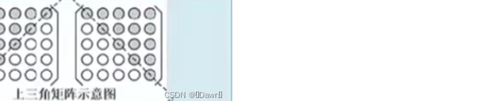 |

- 稀疏矩阵：在一个矩阵中，若非零元素的个数远远少于零元素个数，且非零元素的分布没有规律。存储方式为三元组结构，即存储每个非零元素的(行，列，值)

### 2.3. 广义表

- 广义表是线性表的推广，是由0个或多个单元素或子表组成的有限序列
- 广义表与线性表的区别：线性表的元素都是结构上不可分的单元素，而广义表的元素既可以单元素，也可以是有结构的表
- 广义表一般记为：$LS = (a_1, a_2, \ldots, \alpha_n)$
  - 其中LS是表名，a<sub>i</sub>是表元素，它可以是表（称为子表），也可以是数据元素（称为原子）。其中n是广义表的**长度**（也就是**最外层包含的元素个数**），n=0的广义表为空表；而递归定义的重数就是广义表的深度，即定义中所含括号的**重数**（**单边括号的个数**，原子的深度为0，空表的深度为1)
  - `head()`：**取表头** （广义表第一个表元素，可以是子表也可以是单元素）
  - `tail()`：**取表尾**（广义表中，除了第一个表元素之外的其他所有表元素构成的表，非空广义表的表尾必定是一个表，即使表尾是单元素）

## 3. 树

<!-- p104 -->

### 3.1. 树与二叉树的定义

#### 3.1.1. 树

树结构是一种非线性结构，树中的每一个数据元素可以有两个或两个以上的直接后继元素，用来描述层次结构关系。
树是n个结点的有限集合（n>=0），当n=0时称为空树，在任一颗非空树中有且仅有一个根节点；其余结点可分为m（m>=0）个互不相交的有限子集T1，T2,....，Tm，其中每个Ti又都是一棵树，并且成为根结点的子树

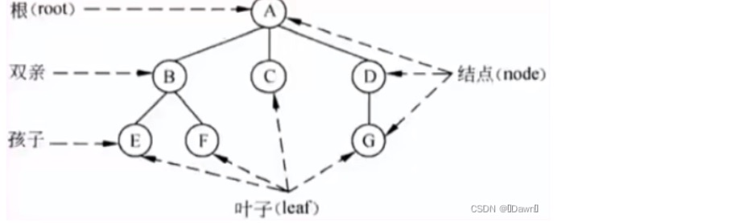

#### 3.1.2. 二叉树

二叉树是n个节点的有限集合，它或者是空树，或者是由一个根节点及两颗互不相交的且分别称为左、右子树的二叉树所组成。与树的区别在于每个根节点最多只有两个孩子结点

- 二叉树的**重要特性**：
  - 二叉树第i层（i≥1）上最多有 $2^{i-1}$ 个结点
  - 高度为k的二叉树最多有 $2^k-1$ 个结点（k≥1）
  - 对于任何一棵二叉树，若其终端结点数为 $n_0$，度为2的结点数为 $n_2$，则 $n_0 = n_2 + 1$
  - 具有n个结点的完全二叉树的深度为：$\lfloor \log_2 n \rfloor + 1$
  - 对一棵有n个结点的完全二叉树的所有结点按层次自上而下、自左至右进行编号，则对于任一结点i（1 ≤ i ≤ n）有：
    - 若 i = 1，则结点i是二叉树的根，无双亲；若 i > 1，则其双亲为：$\lfloor \frac{i}{2} \rfloor$
    - 若 2i > n，则结点 i 没有左孩子，否则其左孩子为2i
    - 若 2i + 1 > n，则结点i没有右孩子，否则其右孩子为 2i + 1

### 3.2. 二叉树的存储方式

#### 3.2.1. 二叉树的顺序存储结构

顺序存储，就是用一组连续的存储单元存储二叉树中的节点，按照从上到下、从左到右的顺序依次存储每个节点

- 对于深度为k的完全二叉树，除第k层外，其余每层中节点数都是上一层的两倍，由此，从一个节点的编号可推知其双亲、左孩子、右孩子结点的编号。假设有编号为 i 的节点，则有:
  - 若 i = 1，该结点为根结点，无双亲
  - 若 i ≥ 1，该结点的双亲为(i+1)/2(取整数)
  - 若 2i≤ n，则该结点的左孩子编号为2i，否则无左孩子。若 2i+1 ≤ n，则该结点的右孩子编号为2i+1，否则无右孩子
  - 若 i 为奇数且不为 1，则该结点左兄弟的编号为 i-1，否则无左兄弟
  - 若 i 为偶数且小于 n，则该结点右兄弟的编号为 i+1，否则无右兄弟

<!-- p105 -->

#### 3.2.2. 二叉树的链式存储结构

一般用二叉链表来存储二叉树节点，二叉链表中除了该节点本身的数据外，还存储有左孩子结点的指针、右孩子结点的指针，即 一个数据 + 两个指针。每个二叉链表节点存储一个二叉树节点，头指针则指向根节点

### 3.3. 二叉树的遍历

- 一颗非空的二叉树由根节点、左子树、右子树三部分组成，遍历这三部分也就遍历了整颗二叉树。这三部分遍历的基本顺序是先左子树后右子树，但根节点顺序可变，以根节点访问的顺序为准有下列三种遍历方式:
  - **先序**（前序）遍历：**根左右**
  - **中序**遍历：**左根右**
  - **后序**遍历：**左右根**
- 层次遍历：按层次，从上到下，从左到右

### 3.4. 线索二叉树

引入线索二叉树是为了保存二叉树遍历时某节点的前驱节点和后继节点的信息，二叉树的链式存储只能获取到某节点的左孩子和右孩子结点，无法获取其遍历时的前驱和后继节点，因此可以在链式存储中再增加两个指针域，使其分别指向前驱和后继节点，但这样太浪费存储空间，考虑下述实现方法：

- 若n个节点的二叉树使用二叉链表存储，则必然有 n+1 个空指针域，利用这些空指针域来存放节点的前驱和后继节点信息，为此，需要增加两个标志，以区分指针域存放的到底是孩子结点还是遍历节点，如下:

| ltag | lchild | data | rchild | rtag |
| --- | --- | --- | --- | --- |

$$ltag = \begin{cases} 0 & lchild域指示结点的左孩子 \\ 1 & lchild域指示结点的直接前驱 \end{cases}$$

$$rtag = \begin{cases} 0 & rchild域指示结点的右孩子 \\ 1 & rchild域指示结点的直接后继 \end{cases}$$

- 若二叉树的二叉链表采用上述结构，则称为线索链表，其中指向前驱、后继节点的指针称为线索，加上线索的二叉树称为线索二叉树

### 3.5. 最优二叉树

最优二叉树又称为哈夫曼树，是一类带权路径长度最短的树

- 路径：树中一个结点到另一个结点之间的通路
- 结点的路径长度：路径上的分支数目
- **树的路径长度**：根节点到达每一个叶子节点之间的路径长度之和
- 权：节点代表的值
- 结点的带权路径长度：该结点到根结点之间的路径长度乘以该节点的权值

<!-- p106 -->

- **树的带权路径长度**（树的代价）：树的所有叶子节点的带权路径长度之和

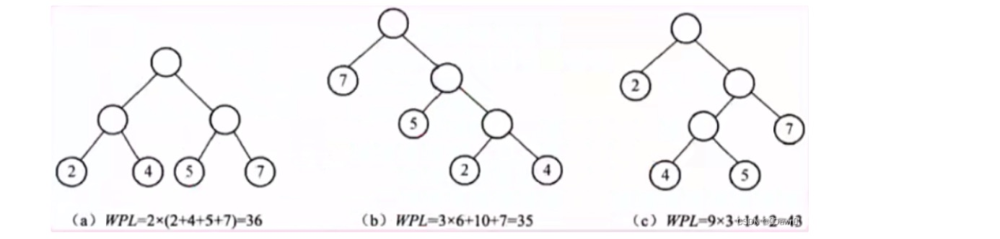

- 哈夫曼树的求法：给出一组权值，将其中两个最小的权值作为叶子节点，其和作为父节点，组成二叉树，而后删除这两个叶子节点权值，并将父节点的值添加到该组权值中。重复进行上述步骤，直至所有权值都被使用完。
  - 构造出的哈夫曼树中，所有初始给出的权值都作为了叶子节点，此时，求出每个叶子节点的带权路径长度，而后相加，就是树的带权路径长度，这个长度是最小的

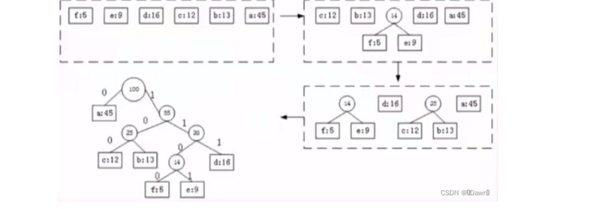

### 3.6. 树和森林

#### 3.6.1. 树的存储结构

- 双亲表示法：用一组连续的地址单元存储树的节点，并在每个节点中附带一个指示器，指出其双亲节点所在数组元素的下标
- 孩子表示法：在存储结构中用指针指示出节点的每个孩子，为树中每个节点的孩子建立一个链表
- 孩子兄弟表示法：又称为二叉链表表示法，为每个存储节点设置两个指针域，分别指向该节点的第一个孩子和下一个兄弟节点

#### 3.6.2. 树和森林的遍历

由于树中每个节点可能有多个子树，因此遍历树的方法有两种:

- 先根遍历：先访问根节点，再依次遍历根的各颗子树
- 后根遍历：先遍历根的各颗子树，再访问根节点
  森林中有很多课树，森林的遍历方法也分为两种，与树的遍历类似，就是对森林中的每棵树都依次做先根遍历或后根遍历

<!-- p107 -->

#### 3.6.3. 树二叉树的转换

规则是：树的最左边节点作为二叉树的左子树，树的其他兄弟节点作为二叉树的右子树节点
示例如下图：采用连线法，将最左边节点和其兄弟节点都连接起来，而原来的父节点和兄弟节点的连线则断开

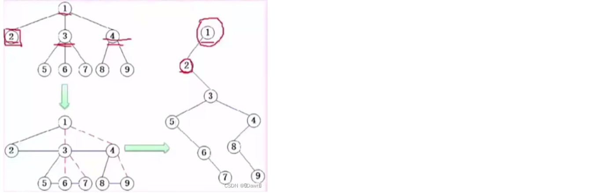

### 3.7. 查找二义树

查找二义树上的每个节点都存储一个值，且每个节点的所有左孩子结点值都小于父节点值，而所有右孩子结点值都大于父节点值，是一个有规律排列的二义树，这种数据结构可以方便查找、插入等数据操作
二义排序树的查找效率取决于二义排序树的深度，对于结点个数相同的二义排序树，平衡二义树的深度最小，而单枝树的深度是最大的，故效率最差

### 3.8. 平衡二叉树

在查找二叉树特点的基础上要求每个节点的平衡度只能为 0 或 1 或 -1
节点的左右子树深度就是其左右子树各自的层数，而后将左子树深度减去右子树深度，就得到了该节点的平衡度。
因此，平衡二叉树就是任意左右子树层次相差不超过 1

## 4. 图

### 4.1. 图的相关概念

图也是一种非线性结构，图中任意两个节点间都可能有直接关系

- 无向图：图的结点之间连接线是没有箭头的，不分方向
- 有向图：图的结点之间连接线是箭头，区分A到B，和B到A是两条线
- 完全图：无向完全图中，节点两两之间都有连线，n个结点的连线数为(n-1)+(n-2)+...+1=n(n-1)/2；有向完全图中，节点两两之间都有互通的两个箭头，n个节点的连线数为n(n-1)
- 度、出度和入度：顶点的度是关联与该顶点的边的数目。在有向图中，顶点的度为出度和入度之和。出度是以该顶点为起点的有边的数目。入度是以该顶点为终点的有向边的数目
- 路径：存在一条通路，可以从一个顶点到达另一个顶点，有向图的路径也是有方向的
- 连通图和连通分量：针对无向图。若从顶点v到顶点u之间是有路径的，则说明v和u之间是连通的，若无向图中任意两个顶点之间都是连通的，则称为连通图。无向图G的极大连通子图称为其连通分量
- 强连通图和强连通分量：针对有向图。若有向图任意两个顶点间都互相存在路
  货即存在v到u，也存在u到v的路径，则称为强连通图。有向图中的极大连通子图称连通分量
  网：边带权值的图称为网

<!-- p108 -->

### 4.2. 图的存储

- 邻接矩阵：假设一个图中有n个节点，则使用n阶矩阵来存储这个图中各节点的关系，规则是若节点i到节点j有连线，则矩阵Rij=1，否则为0。因此，如果是一个无向图，肯定是沿对角线对称的，只需要存储上三角或者下三角就可以了，而有向图则不一定对称

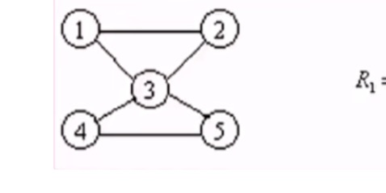

$$R_1 = \begin{bmatrix} 0 & 1 & 1 & 0 & 0 \\ 1 & 0 & 1 & 0 & 0 \\ 1 & 1 & 0 & 1 & 1 \\ 0 & 0 & 1 & 0 & 1 \\ 0 & 0 & 1 & 1 & 0 \end{bmatrix}$$

- 邻接链表：用到了两个数据结构，先用一个一维数组将图中所有顶点存储起来，而后，对此一维数组的每个顶点元素，使用链表挂上和其有连线关系的结点的编号和权值

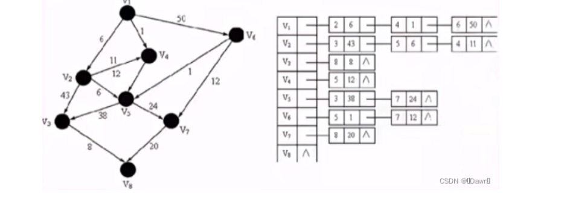

### 4.3. 图的遍历

- 图的遍历是指从图的任意节点出发，沿着某条搜索路径对图中所有节点进行访问且只访问一次，分为以下两种方式:
  - 深度优先遍历：从任一顶点出发，遍历到底，直至返回，再选取任一其他节点出发，重复这个过程直至遍历完整个图
  - 广度优先遍历：先访问完一个顶点的所有邻接顶点，而后再依次访问邻接顶点的所有邻接顶点，类似于层次遍历

| 遍历方法 | 说明 | 示例 |
| --- | --- | --- |
| 深度优先 | 1.首先访问出发顶点V<br>2.依次从V出发搜索V的任意一个邻接点W；<br>3.若W未访问过，则从该点出发继续深度优先遍历<br>它类似于树的前序遍历。 | V1，V2，V4，V8，V5，V3，V6，V7 |
| 广度优先 | 1.首先访问出发顶点V<br>2.然后访问与顶点V邻接的全部未访问顶点W、X、Y...；<br>3.然后再依次访问W、X、Y...邻接的未访问的顶点； | V1，V2，V3，V4，V5，V6，V7，V8 |

图例（对应上表深度优先/广度优先遍历所用的图）：

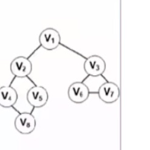

### 4.4. 图的最小生成树

- 假设有n个节点，那么这个图的最小生成树有 n-1 条边（不会形成环路，是树非图），这n-1条边会将所有顶点都连接成一个树，并且这些边的权值之和最小，因此称为最小生成树
  - 普里姆算法：从任意顶点出发，找出与其邻接的边权值最小的，此时此边的另外一个顶点自动加入树集合中，而后再从这这个树集合的所有顶点中找出与其邻接的边权值最小的，同样此边的另外一个顶点加入树集合中，依次递归，直至图中所有顶点都加入树集合中，此时此树就是该图的最小生成树

<!-- p109 -->

  - 克鲁斯卡尔算法（推荐）：这个算法是从边出发的，因为本质是选取权值最小的n-1条边，因此，就将边按权值大小排序，依次选取权值最小的边，直至囊括所有节点，要注意，每次选边后要检查不能形成环路

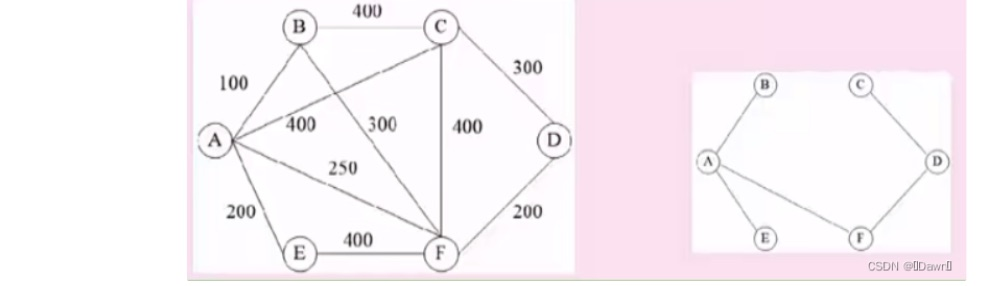

### 4.5. 图的拓扑序列

- AOV网（以顶点表示活动的网）：在有向图中，以顶点表示活动，用有向边表示活动之间的优先关系
  - AOV网用来表示大的工程项目执行计划，因此不能出现有向环，若存在，则意味着某项活动必须以自身任务的完成为先决条件，因此若要检测一个工程是否可行，首先应检查对应的AOV网是否存在回路。检测的方法是对有向图构造其顶点的拓扑有序序列
  - 构造方法：将有向图的有向边作为活动开始的顺序若图中一个节点入度为0，则应该最先执行此活动，而后删除掉此节点和其关联的有向边，再去找图中其他没有入度的结点，执行活动，依次进行，示例如下:

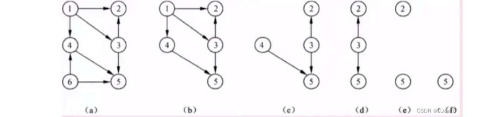

<!-- p110 -->

# 算法分析

## 1. 算法基础知识

算法是对特定问题求解步骤的一种描述，它是指令的有限序列，其中每一条指令表示一个或多个操作
5个重要特性：有穷性、确定性、可行性、输入、输出

## 2. 算法分析基础

### 2.1. 算法的复杂度

#### 2.1.1. 时间复杂度

时间复杂度是指程序运行从开始到结束所需要的时间。通常分析时间复杂度的方法是从算法中选取一种对于所研究的问题来说是基本运算的操作以该操作重复执行的次数作为算法的时间度量。一般来说，算法中原操作重复执行的次数是规模n的某个函数T(n)。由于许多情况下要精确计算T(n)是困难的，因此引入了渐进时间复杂度在数量上估计一个算法的执行时间。其定义如下:

- 如果存在两个常数c和m，对于所有的n，当 n ≥ m 时有 $f(n) \le cg(n)$，则有 $f(n) = O(g(n))$。也就是说，随着n的增大，f(n)渐进地不大于g(n)。例如，一个程序的实际执行时间为T(n) = $3n^3 + 2n^2 + n$，则T(n)=O($n^3$)
- 常见的对算法执行所需时间的度量：$O(1) < O(\log_2 n) < O(n) < O(n\log_2 n) < O(n^2) < O(n^3) < O(2^n)$

#### 2.1.2. 空间复杂度

空间复杂度是指对一个算法在运行过程中临时占用存储空间大小的度量。一个算法的空间复杂度只考虑在运行过程中为局部变量分配的存储空间的大小

## 3. 查找

### 3.1. 顺序查找

将待查找的关键字为key的元素从头到尾与表中元素进行比较，如果中间存在关键字为key的元素，则返回成功；否则，则查找失败
顺序查找的时间复杂度为：时间复杂度为O(n)

### 3.2. 折半（二分）查找

- 设查找表的元素存储在一维数组r[1..n]中，在表中元素已经按照关键字递增方式排序的情况下，进行折半查找的方法是:
  - 1、首先将待查元素的关键字（key）值与表r中间位置上（下标为mid）记录的关键字进行比较，若相等,则查找成功

<!-- p111 -->

  - 2、若key > r[mid].key，则说明待查记录只可能在后半个子表r[mid+1..n]中，下一步应在后半个子表中查找
  - 3、若key ＜ r[mid].key，说明待查记录只可能在前半个子表r[1..mid-1]中，下一步应在r的前半个子表中查找
  - 4、重复上述步骤，逐步缩小范围，直到查找成功或子表为空失败时为止
- 折半查找的时间复杂度为：$O(\log_2 n)$

### 3.3. 哈希表

- 散列（哈希）表：根据设定的哈希函数H(key)和处理冲突的方法，将一组关键字映射到一个有限的连续的地址集上，并以关键字在地址集中的"像"作为记录在表中的存储位置

例如，设关键码序列为"47，34，13，12，52，38，33，27，3"，哈希表表长为11，哈希函数为 Hash(key)=key mod 11，则

```
Hash(47) = 47 MOD 11 = 3，  Hash(34) = 34 MOD 11 = 1，
Hash(13) = 13 MOD 11 = 2，  Hash(12) = 12 MOD 11 = 1，
Hash(52) = 52 MOD 11 = 8，  Hash(38) = 38 MOD 11 = 5，
Hash(33) = 33 MOD 11 = 0，  Hash(27) = 27 MOD 11 = 5，
Hash(3)  = 3 MOD 11 = 3。
```

使用线性探测法解决冲突构造的哈希表如下：

| 哈希地址 | 0 | 1 | 2 | 3 | 4 | 5 | 6 | 7 | 8 | 9 | 10 |
| --- | --- | --- | --- | --- | --- | --- | --- | --- | --- | --- | --- |
| 关键字 | 33 | 34 | 13 | 47 | 12 | 38 | 27 | 3 | 52 | | |

- 在上图中，很明显，哈希函数产生了冲突，使用的是线性探测法解决冲突，还有其他方法如下：
  - 线性探测法：按物理地址顺序取下一个空闲的存储空间
  - 伪随机数法：将冲突的数据随机存入任意空闲的地址中
  - 再散列法：原有的散列函数冲突后，继续用此数据计算另外一个哈希函数，用以解决冲突

## 4. 排序

- 排序的分类
  - 稳定与不稳定排序：依据是两个相同的值在一个待排序序列中的顺序和排序后的顺序应该是相对不变的，即开始时21在21前，那排序结束后，若该21还在21前，则为稳定排序；不改变相同值的相对顺序
  - 内排序和外排序：依据排序是在内存中进行的还是在外部进行的
- 排序的算法:
  - 插入类排序：直接插入排序、希尔排序
  - 交换类排序：冒泡排序、快速排序
  - 选择类排序：简单选择排序、堆排序
  - 归并排序
  - 基数排序

<!-- p112 -->

### 4.1. 直接插入排序

直接插入排序是一种简单的排序方法，具体做法是：在插入第i个记录时，$R_1$、$R_2$、…、$R_{i-1}$。已经排好序，这时将$R_i$的关键字$k_i$依次与关键字$k_{i-1}$、$k_{i-2}$等进行比较，从而找到应该插入的位置并将$R_i$插入，插入位置及其后的记录依次向后移动

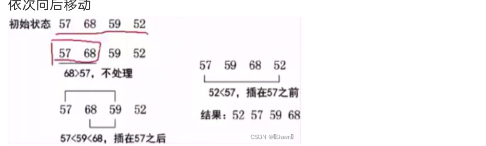

### 4.2. 希尔排序

希尔排序的基本思想是：先将整个待排记录序列分割成若干子序列，然后分别进行直接插入排序，待整个序列中的记录基本有序时，再对全体记录进行一次直接插入排序。具体做法是：先取一个小于n的整数$d_1$作为第一个增量，把文件的全部记录分成$d_1$个组，即将所有距离为$d_1$倍数序号的记录放在同一个组中，在各组内进行直接插入排序；然后取第二个增量$d_2(d_2 < d_1)$，重复上述分组和排序工作，依此类推，直到所取的增量$d_i = 1(d_i < d_{i-1} < \ldots < d_2 < d_1)$，即所有记录放在同一组进行直接插入排序为止

当增量序列为"5，3，1"时，希尔插入排序过程如下。

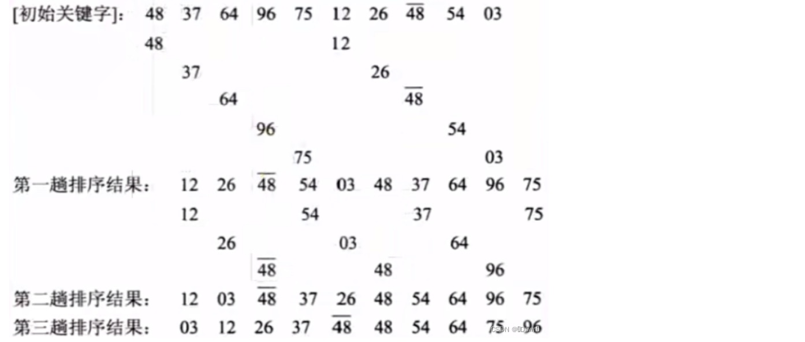

### 4.3. 简单选择排序

n个记录进行简单选择排序的基本方法是：通过 n-i （ 1 ≤ i ≤ n ）在次关键字之间的比较，从 n-i+1 个记录中选出关键字最小的记录，并和第i个记录进行交换，当i等于n时所有记录有序排列

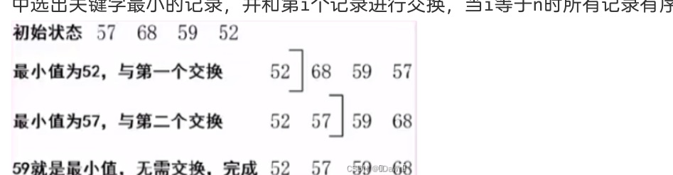

<!-- p113 -->

### 4.4. 堆排序

对于n个元素的关键字序列{$K_1$，$K_2$，…，$K_n$}，当且仅当满足下列关系时称其为堆，其中 2i 和 2i+1 需不大于 n。

$$\begin{cases} K_i \le K_{2i} \\ K_i \le K_{2i+1} \end{cases} \quad \text{或} \quad \begin{cases} K_i \ge K_{2i} \\ K_i \ge K_{2i+1} \end{cases}$$

堆排序的基本思想是：对一组待排序记录的关键字，首先按堆的定义排成一个序列（即建立初始堆），从而可以输出堆顶的最大关键字（对于大根堆而言），然后将剩余的关键字再调整成新堆，便得到次大的关键字，如此反复，直到全部关键字排成有序序列为止。

- 堆排序的方法可分为两步:
  - 1、依据给出的待排序关键字建立初始堆
  - 2、输入堆顶元素，并调整堆。重复上述步骤

初始堆的建立方法是：将待排序的关键字分放到一棵完全二叉树的各个结点中（此时完全二叉树并不一定具备堆的特性），显然，所有 $i > \lfloor n/2 \rfloor$ 的结点 $K_i$ 都没有子结点，以这样的 $K_i$ 为根的子树已经是堆，因此初始建堆可从完全二叉树的第 $i$ $(i=\lfloor n/2 \rfloor)$ 个结点 $K_i$ 开始，通过调整，逐步使以 $K_{\lfloor n/2 \rfloor}$、$K_{\lfloor n/2 \rfloor - 1}$、$K_{\lfloor n/2 \rfloor - 2}$、…、$K_2$、$K_1$ 为根的子树满足堆的定义。

### 4.5. 冒泡排序

n个记录进行冒泡排序的方法是：首先将第一个记录的关键字和第二个记录的关键字进行比较，若为逆序，则交换这两个记录的值，然后比较第二个记录和第三个记录的关键字，依此类推，直到第n-1个记录和第n个记录的关键字比较过为止。上述过程称为第一趟冒泡排序，其结果是关键字最大的记录被交换到第n个记录的位置上。然后进行第二趟冒泡排序，对前n-1个记录进行同样的操作，其结果是关键字次大的记录被交换到第n-1个记录的位置上。最多进行n-1趟，所有记录有序排列。若在某趟冒泡排序过程没有进行相邻位置的元素交换处理，则可结束排序过程

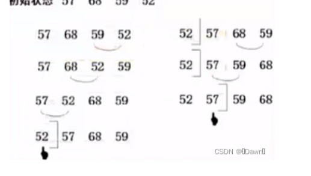

### 4.6. 快速排序

快速排序的基本思想是：通过一趟排序将待排的记录划分为独立的两个部分，其中一部分记录的关键字均不大于另一部分记录的关键字，然后再分别对这两部分记录继续进行快速排序，以达到整个序列有序

### 4.7. 归并排序

所谓"归并"，是将两个或两个以上的有序文件合并成一个新的有序文件。归并排序是把一个有n个记录的无序文件看成是由n个长度为1的有序子文件组成的文件，然后进行两两归并，得到 $\frac{n}{2}$ 个长度为 2 或 1 的有序文件，再两两归并，如此重复，直到最后形成包含n个记录的有序文件为止。这种反复将两个有序文件归并成一个个有序文件的排序方法称为两路归并排序

<!-- p114 -->

### 4.8. 基数排序

基数排序是一种借助多关键字排序思想对单逻辑关键字进行排序的方法。基数排序不是基于关键字比较的排序方法，它适合于元素很多而关键字较少的序列。基数的选择和关键字的分解是根据关键字的类型来决定的，例如关键字是十进制数，则按个位、十位来分解

### 4.9. 排序算法总结

| 类别 | 排序方法 | 时间复杂度：平均情况 | 时间复杂度：最坏情况 | 空间复杂度：辅助存储 | 稳定性 |
| --- | --- | --- | --- | --- | --- |
| 插入排序 | 直接插入 | O(n²) | O(n²) | O(1) | **稳定** |
| 插入排序 | Shell排序 | O(n^1.3) | O(n²) | O(1) | 不稳定 |
| 选择排序 | 直接选择 | O(n²) | O(n²) | O(1) | 不稳定 |
| 选择排序 | 堆排序 | O(nlog₂n) | O(nlog₂n) | O(1) | 不稳定 |
| 交换排序 | 冒泡排序 | O(n²) | O(n²) | O(1) | **稳定** |
| 交换排序 | 快速排序 | O(nlog₂n) | O(n²) | O(log₂n) | 不稳定 |
| 归并排序 | | O(nlog₂n) | O(nlog₂n) | O(n) | **稳定** |
| 基数排序 | | O(d(r+n)) | O(d(r+n)) | O(r+n) | **稳定** |

- 空间复杂度中，大部分排序都是比较交换，无需多余空间，快速排序则是需要存储每次的基准值，归并排序需要一个新表，基数排序需要新表，还需要存储关键字的空间
- 时间复杂度中，与堆、树、二分有关的算法都是 $n\log n$，直接的算法都是 $n \cdot n$

## 5. 常用算法原理

### 5.1. 分治法

- 递归：指子程序（函数）直接调用自己活通过一系列调用语句间接调用自己，是一种描述问题和解决问题的常用方法
- 递归两个基本要素:
  - 边界条件（确定递归何时终止，即递归出口）
  - 递归模式（大问题如何分解成小问题，即递归体）
- **分治法**：对于一个规模为n的问题，若该问题可以容易地解决则直接解决，否则将其分为k个规模较小的子问题，这些**子问题互相独立且与原问题形式相同**，递归地解决这些子问题，然后将各子问题的解合并得到原问题的解
  - 步骤：分解（将原问题分解成一系列子问题）—求解（递归地求解各子问题，若子问题足够小，则直接求解）—合并（将子问题的解合并成原问题的解）
  - **凡是涉及到分组解决的都是分治法**（二分查找、归并排序等）

### 5.2. 回溯法

- **回溯法**：有"通用的解题法"之称，可以系统地搜索一个问题的所有解或任一解。在包含问题的所有解的解空间树中，按照**深度优先的策略**，从根节点触发搜索解空间树。搜索至任一结点时，总是先判断该结点是否肯定不包含问题的解，如果不包含，则跳过对以该结点为根的子树的搜索，逐层向其祖先结点回溯；否则，进入该子树；继续按深度优先的策略进行搜索
  - 可以理解为先进行深度优先搜索，一直向下探测，当此路不通时，返回上一层探索另外的分支，重复此步骤，这就是回溯，意为先一直探测，当不成功时再返回上一层

<!-- p115 -->

  - 一般用于解决迷宫类的问题

### 5.3. 动态规划法

- **动态规划法**：在求解问题中，对于每一步决策，列出各种可能的局部解，再依据某种判定条件，舍弃哪些肯定不能得到最优解的局部解，在每一步都经过筛选，以每一步都是最优解来保证全局是最优解
  - 本质也是将复杂的问题划分成一个个子问题，与分治法不同的是每个子问题间不是相互独立的，并且不全都相同
  - **常用于求解具有某种最优性质的问题**
  - 此算法会将大量精力放在前期构造表格上面，其会对每一步，列出各种可能的答案，这些答案会存储起来，最终要得出某个结果时，是通过查询这张表来得到的动态规划法不但每一步最优，全局也最优

### 5.4. 贪心法

- **贪心法**：总是做出在当前来说是最好的选择，而并不从整体上加以考虑，它所做的每步选择只是当前步骤的局部最优选择，但从整体来说不一定是最优的选择。由于它不比为了寻找最优解而穷尽所有可能解，因此其耗费时间少，一般可以快速得到满意的解，但得不到最优解
  - 局部贪心，只针对当前的步骤取最优，而非整体考虑
  - **判断此类算法，就看算法是否是每一步都取最优，并且整体题意没有透露出最终结果是最优的**

### 5.5. 分支限界法

- **分支限界法**：与回溯法类似，同样是在问题的解空间树上搜索问题解的算法
  - 搜索原理：在分支限界法中，每一个活结点只有一次机会成为扩展结点。活结点一旦成为扩展结点，就一次性产生其所有儿子结点。在这些儿子结点中，导致不可行解或导致非最优解的儿子结点被舍弃，其余儿子结点被加入活结点表中。此后，从活结点表中取下一结点成为当前扩展结点，并重复上述结点扩展过程。这个过程一直持续到找到所需的解或活结点表为空时为止
  - 与回溯法的区别:
    - 1、求解目标是找出满足约束条件的一个解，或是在满足约束条件的解中找出使某一目标函数值达到极大或极小的解，即在**某种意义下的最优解**
    - 2、以**广度优先或以最小耗费(最大收益)优先**的方式搜索解空间树
  - 从活节点表中选择下一个扩展节点的类型:
    - 队列式(FIFO)分支限界法：按照队列先进先出（FIFO）原则选取下一个节点为扩展节点
    - 优先队列式分支限界法：按照优先队列中规定的优先级选取优先级最高的节点成为当前扩展节点

### 5.6. 概率算法

- 概率算法：在算法执行某些步骤时，可以随机地选择下一步该如何进行，同时**允许结果以较小的概率出现错误**，并以此为代价，**获得算法运行时间的大幅度减少**（降低算法复杂度）
  - 基本特征是对所求解问题的同一实例用同一概率算法求解两次，可能得到完全不同的效果
  - 如果一个问题没有有效的确定性算法可以在一个合理的时间内给出解，但是该问题能接受小概率错误，那么采用概率算法就可以快速找到这个问题的解
  - 四类概率算法:
    - 数值概率算法（数值问题的求解）

<!-- p116 -->

    - 蒙特卡洛算法（求问题的精确解）
    - 拉斯维加斯算法（不会得到不正确的解）
    - 舍伍德算法（总能求得问题的一个正确解）
  - 概率算法的特征:
    - 概率算法的输入包括两部分，一部分是原问题的输入，另一部分是一个供算法进行机选择的随机数序列
    - 概率算法在运行过程中，包括一处或多处随机选择，根据随机值来决定算法的运路径
    - 概率算法的结果不能保证一定是正确的，但能限制其出错概率
    - 概率算法在不同的运行过程中，对于相同的输入实例可以有不同的结果，因此，对于相同的输入实例，概率算法的执行时间可能不同

### 5.7. 近似算法

- **近似算法**：解决难解问题的一种有效策略，其基本思想是放弃求最优解，而用近似最优解代替最优解，以**换取算法设计上的简化和时间复杂度的降低**
  - 虽然它可能找不到一个最优解，但它总会给待求解的问题提供一个解
  - 为了具有实用性，近似算法必须能够给出算法所产生的解与最优解之间的差别或者比例的一个界限，它保证任意一个实例的近似最优解与最优解之间的相差成都。显然，这个差别越小，近似算法越具有实用性
  - 衡量近似算法性能两个标准:
    - 算法的时间复杂度。近似算法的时间复杂度必须是多项式阶的，这是近似算法的基本目标
    - 解的近似程度。近似最优解的近似程度也是设计近似算法的重要目标。近似程度与近似算法本身、问题规模，乃至不同的输入实例有关

### 5.8. 数据挖掘算法

- 概述：分析爆炸式增长的各类数据的技术，以发现隐含在这些数据中的有价值的信息和知识。数据挖掘利用及其学习方法对多种数据进行分析和挖掘。其核心是算法，主要功能包括分类、回归、关联规则和聚类等
- 分类：是一种有监督的学习过程，根据历史数据预测未来数据的模型
  - 分类的数据对象属性：一般属性、分类属性或目标属性
  - 分类设计的数据：训练数据集、测试数据集、未知数据
  - 数据分类的两个步骤:
    - 学习模型（基于训练数据集采用分类算法建立学习模型）
    - 应用模型（应用测试数据集的数据到学习模型中，根据输出来评估模型的好坏以及将未知数据输入到学习模型中，预测数据的类型）
  - 分类算法：决策树归纳（自顶向下的递归树算法）、朴素贝叶斯算法、后向传播BP、支持向量机SVM
- 频繁模式和关联规则挖掘：挖掘海量数据中的频繁模式和关联规则可以有效地指导企业发现交叉销售机会、进行决策分析和商务管理等。（沃尔玛-啤酒尿布故事）首先要求出数据集中的频繁模式，然后由频繁模式产生关联规则
- 关联规则挖掘算法：类Apriori算法、基于频繁模式增长的方法如FP-growthh，使用垂直数据格式的算法，如ECLAT

<!-- p117 -->

- 聚类：是一种无监督学习过程。根据数据的特征，将相似的数据对象归为一类，不相似的数据对象归到不同的类中。物以类聚，人以群分
  - 典型算法：基于划分的方法、基于层次的方法、基于密度的方法、基于网格的方法基于统计模型的方法
- 数据挖掘的应用：信用分析、定向促销顾客的分类与聚类等。

### 5.9. 智能优化算法

- 概述：优化技术是一种以数学为基础，用于求解各种工程问题优化解的应用技术
  - 人工神经网络ANN：一个以有向图为拓扑结构的动态系统，通过对连续或断续的输入作状态响应而进行信息处理。从信息处理角度对人脑神经元网络进行抽象，建立某种简单模型，按不同的连接方式组成不同的网络
  - 遗传算法：源于模拟达尔文的"优胜劣汰、适者生存"的进化论和孟德尔．摩根的遗传变异理论，在迭代过程中保持已有的结构，同时寻找更好的结构。其本意是在人工适应系统中设计一种基于自然的演化机制
  - 模拟退火算法SA：求解全局优化算法。基本思想来源于物理退火过程，包括三个阶段：加温阶段、等温阶段、冷却阶段
  - 禁忌搜索算法TS：模拟人类智力过程的一种全局搜索算法，是对局部邻域搜索的一种扩展
  - 蚁群算法：是一种用来寻找优化路径的概率型算法
  - 粒子群优化算法PSO：又称为鸟群觅食算法，在鸟群觅食飞行时，在飞行过程中经常会突然改变方向、散开、聚集，其行为不可预测，但其整体总保持一致性，个体与个体间也保持着最适宜的距离。通过对类似生物群体行为的研究，发现生物群体中存在着一种信息共享机制，为群体的进化提供了一种优势，这就是基本粒子群算法形成的基础

<!-- p118 -->

# 数据流图设计（下午试题一）

## 1. 数据流图的基本概念

- 数据流图又称数据流程图（DFD）**是一种便于用户理解、分析系统数据流程的图形工具**。它摆脱了系统的物理内容，精确地在逻辑上描述系统的功能、输入、输出和数据存储等，**是系统逻辑模型的重要组成部分**。

## 2. DFD 的基本成分及图形表示

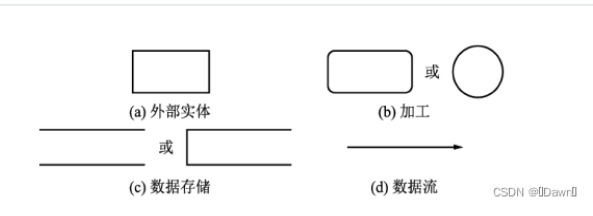

- 外部实体(External Agent)：外部实体是指存在于**软件系统之外的人员或组织**，它指出系统所需数据的发源地和系统所产生的数据的归宿地。
- 加工(Process)：加工**描述了输入数据流到输出数据流之间的变换**，也就是输入数据流经过什么处理后变成了输出数据流。每个加工都有一个名字和编号。编号能反映出该加工位于分层DFD中的哪个层次和哪张图中，也能够看出它是哪个加工分解出来的子加工。
- 数据存储(Data Store)：数据存储用来**表示存储的数据**，每个数据存储都有一个名字。
- 数据流(Data Flow)：数据流由一组固定成分的数据组成，**表示数据的流向**。**除了流向数据存储或从数据存储流出的数据流不必命名外，每个数据流都必须有一个合适的名字，以反映该数据流的含义**。

## 3. 分层数据流图的画法

- （1）**画系统的输入和输出。把整个系统**。把整个软件系统看作一个大的加工，然后根据系统从哪些外部实体接收数据流，以及系统发送数据流到哪些外部实体，就可以画出系统的输入和输出的图，这张图称为顶层图。
- （2）**画系统的内部**。将顶层图的加工分解为若干个加工，并用数据流将这些加工连接起来，使得顶层图中的输入数据经过若干个加工处理后变换成顶层图的输出数据流。这张图称为0层图。从这一加工画出一张数据流图的过程实际上就是对这个加工的分解。
  - **确定加工的方法**：在数据流的组成或值发生变化的地方画一个加工，这个加工的功能就是实现这一变化；也可以根据系统的功能确定加工。
  - **确定数据流的方法**：当用户把若干个数据看作一个单位来处理（这些数据在一起到达，一起加工）时候，可以把这些数据看成一个数据流。
- （3）**画加工的内部**。把每个加工看作一个小系统，该加工的输入/输出数据流看成小系统的输入/输出数据流。于是可以用与画0层图同样的方法画出每个加工的 DFD 子图。

## 4. 对图和加工进行编号

<!-- p119 -->

对于一个软件系统，其数据流图可能有许多层，每一层又有许多张图。为了区分不同的加工和不同的 DFD 子图，应该对每张图和每个加工进行编号，便于管理。

- 父图子图：假设分层数据流图里的某张图（记为图 A）中的某个加工可以用另一张图（记为图 B）来分解，则称 图A 是 图B 的父图，图B 是 图A 的子图。在一张图中，有些加工需要进一步分解，有些加工则不必分解。因此，**如果父图中有n个加工，那么它可以有 0 ～ n 张子图(这些子图位于同一层)，但每张子图都只对应于一张父图**。
- 编号:
  - 顶层图只有一张，图中的加工也只有一个，所以不必编号。
  - 0层图只有一张，图中的加工号可以分别是 0.1，0.2......或 1，2......。
  - 子图号就是父图中被分解的加工号。
  - 图的加工号由图号、圆点、序号组成。

## 5. 注意事项（重点）

- 应适当地为数据流、加工、数据存储、外部实体命名，且名字应反映该成分的实际含义，避免空洞的名字。
- 画数据流而不要画控制流。
- 每条数据流的输入或者输出都是加工。
- 一个加工的输出数据流不应与输入数据流同名，即使它们的组成成分相同。
- 允许一个加工有多条数据流流向另一个加工，也允许一个加工有两个相同的输出数据流流向两个不同的加工。
- 保持父图子图平衡。也就是说，父图中某加工的输入/输出数据流必须与其子图的输入/输出数据流在数量和名字上相同。值得注意的是，如果父图的一个输入（或输出）数据流对应于子图中几个输入（或输出）数据流，而子图中组成这些数据流的数据项全体正好是父图中的这一个数据流，那么它们仍然算是平衡的。
- 在自顶向下的分解过程中，若一个数据存储首次出现时只与一个加工有关，那么这个数据存储应作为这个加工的内部文件而不必画出。
- 保持数据守恒。也就是说，一个加工所输出数据流中的数据必须能从该加工的输入数据流中直接获得，或者是通过该加工产生的数据。
- 每个加工必须既有输入数据流，又有输出数据流。
- 在整套数据流图中，每个数据存储必须既有读的数据流，又有写的数据流。但在某一张子图中可能是只有读没有写，或者只有写没有读。

## 6. 题型

### 6.1. 补充和完善数据流

- 遇到这类问题，首先要想到分层数据流图的数据流平衡原则，即父图和子图的输入/输出数据流一致，这是找出遗漏数据流非常重要的技巧。
- 其次，每个加工至少有一个输入数据流和一个输出数据流，反映此加工的数据来源和结果，加工的输出数据流应该都有其对应的输入数据流。

<!-- p120 -->

- 再次，要找出遗漏的数据流，最根本的依据还是说明。因为除了图之外，题目中最重要的部分就是说明。说明部分详细介绍了系统的功能，是找出所缺数据流的基本入口。
- 有时数据流平衡原则不作为解题的直接方法，而作为排除的手段，然后根据说明或其他方法找到图中遗漏的数据流。

### 6.2. 找出错误或多余的数据流

- 要找出错误或多余的数据流，解题方法可以参考完善数据流的方法。一般可以先进行上下层图的对照和分析，然后检查是否每个加工至少有一个输入数据流和一个输出数据流，是否加工的输出数据流都有其对应的输入数据流。而最根本的判断标准仍然是题目的说明部分。

### 6.3. 找出多余的文件

- 在某层数据流图中，只画流程图各加工之间的公共数据文件时，如果一个文件仅作用于一个加工，即和该文件有关的输入/输出数据流只涉及一个加工，那么该文件可以作为局部文件出现在该加工的子图中，在父图中则可以省略。这个规则是为了使整个流程图的层次结构更为清晰、科学。当然这些文件如果画出，并不会造成理解的错误。另外，如果某层图只有一层细化图，即该层图没有子图，则不存在局部文件和外部文件之分，其中涉及的任何文件都不作为多余的文件。

### 6.4. 添加数据字典条目

- 可以根据说明部分找出答案。同时还可以结合给出的数据流图，查看有关记录需要输入给哪些加工，这些加工输出哪些字段

<!-- p121 -->

# 数据库设计（下午试题二）

## 1.1 数据库设计的基础知识

### 1.1. E-R图

- E-R图：即实体-联系图，使用**椭圆表示属性**（一般没有）、**长方形表示实体**、**菱形表示联系**，**联系两端要标注联系类型**
  - 联系类型：**一对一 1 : 1、一对多 1 : N、多对多 M : N**
  - **实体和子实体**：之间直接用直线连接，是从属关系，无联系类型
  - **多个实体一个类型**：一般是三个实体连接到一个类型上，本质也是两两对应的联系关系，根据题目说明，**若有三个实体相关，则是此种情况**
  - **主键和外键**：**主键**是**本关系内唯一**，**外键**是**其他关系的主键**，**外键可以有多个**

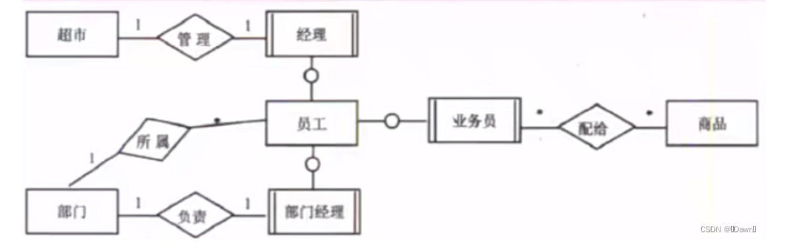

### 1.2. 关系模式

- 关系模式就是以名称和属性名表示一个联系，如下:

```
客户（客户ID、姓名、身份证号、电话、住址、账户余额）
员工（工号、姓名、性别、岗位、身份证号、电话、住址）
```

括号外为**实体名**，括号内为该实体各属性的**属性名**

- 考法
  - 根据关系模式**找属性名**

```
家电（家电条码、家电名称、价格、出厂日期、(1)）
家电厂商（厂商ID、厂商名称、电话、法人代表信息、厂址、(2)）
购买（订购单号、(3)、金额）
```

  - 根据关系模式**找主键和外键**
    - **主键**：不能为空，能**唯一标识当前关系的属性**
    - **外键**：**其他关系模式的主键或者为空**

<!-- p122 -->

### 1.3. E-R图转换为关系模式

- E-R图中，有实体和联系两个概念，实体和实体之间的联系分为三种，即1 : 1, 1 : N, M : N，这三种情况，转换为关系模式的方法也不同:
  - 每个实体都要转换为一个关系模式
  - 对于联系:
    - **一对一**：**联系**作为一个属性**随便加入**哪个实体中
    - **一对多**：**联系可以单独转换**为一个关系模式，**也可以作为**一个**属性加入到N端**中（N端实体包含1端的主键）
    - **多对多**：**联系必须单独转换**为一个关系模式（且此关系模式应该包含两端实体的主键）
  - **转换之后**要注意：**原来的两个实体之间的联系必须还存在**，能够通过查询方式查到对方
  - 在实际解题时，要注意，某个**实体的属性，还应该包括其联系属性**，具体问题具体分析

## 2. 解题技巧

- **补充E-R图**：主要是根据题目描述确认哪些实体之间有联系，联系类型是哪一种，而后进行连线即可
- **补充关系模式**：实际考察的是将E-R图转换为关系模式，补充缺失的属性
  - 首先需要审题，题目会给出每个关系模式的属性信息，先将题目中的属性信息和问题对应，将缺少的属性全部补充
  - 然后再按照规则转换，即按联系的三种对应方式决定要添加哪些字段
- **情景问答**：一般都是给出一段新的描述，要求新增一种实体-联系类型和关系模式,本质也是考察联系类型和E-R图转换为关系模式

<!-- p123 -->

# UML分析与设计(下午试题三)

## 1. UML基础知识

### 1.1. 用例图

**用例图**：**静态图**，展现了一组用例、参与者以及它们之间的关系

- 参与者：人、硬件或其他系统可以扮演的角色
- 用例：参与者完成的一系列操作
- 主要考察:
  - **参与者和用例的识别**
  - **用例**之间的**关系**（**包含 include**、**扩展 extend**、**泛化**），如图所示，登记外借信息用例**包含**用户登录用例，因为每次如果要登记外借信息，必然要先进行用户登录。而查询书籍信息的**扩展**是修改书籍信息，是因为每次查询书籍信息后，发现有错误才会修改，否则不修改，不是必要的操作。**区分用例间的关系是包含还是扩展，关键在于是不是必须操作**

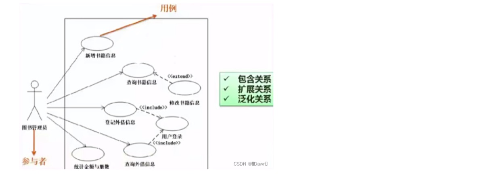

### 1.2. 类图

- 主要考察：填**类名**、**多重度**、**类之间的联系**（泛化、组合、聚合、实现、依赖）

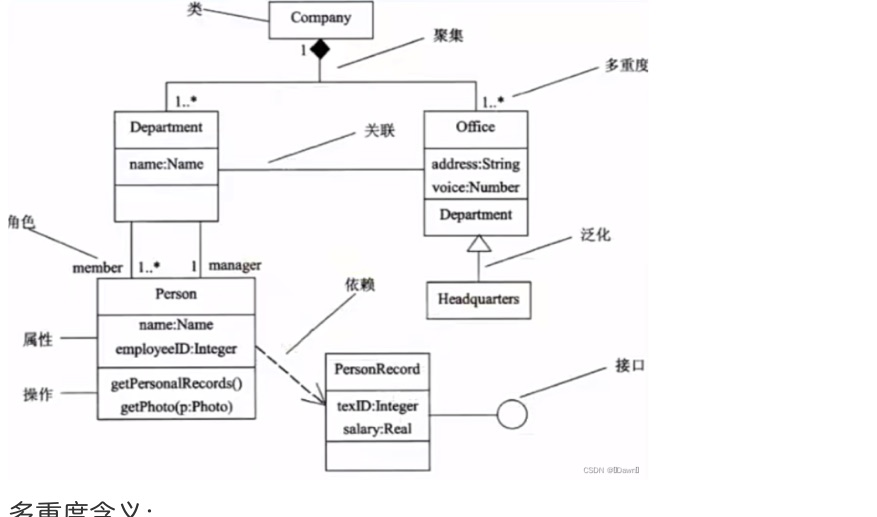

- 多重度含义:
  - 1：表示一个集合中的**一个**对象**对应**另一个集合中**1个**对象
  - o..*：表示一个集合中的**一个**对象**对应**另一个集合中的**0个或多个**对象

<!-- p124 -->

  - 1..*：表示一个集合中的**一个**对象**对应**另一个集合中的**一个或多个**对象
  - *：表示一个集合中的**一个**对象**对应**另一个集合中的**多个**对象
- 依赖：一个事物的语义依赖于另一个事物的语义的变化而变化
- 关联：是一种结构关系，描述了一组链，链是对象之间的连接。分为组合和聚合，都是部分和整体的关系，其中组合事物之间关系更强。两个类之间的关联，实际上是两个类所扮演角色的关联，因此，两个类之间可以有多个由不同角色标识的关联
- 泛化：一般 / 特殊的关系，子类和父类之间的关系
- 实现：一个类元指定了另一个类元保证执行的契约


- 理解聚合和组合都是部分和整体之间的关系，类之间大多考察这两种关系，必须记住其符号，且**菱形一端为整体**，表示其由另外的一端实体组成，可依据题意找出组成元素解题。
- **依赖关系最弱，只要有部分就是依赖。泛化关系是父子关系；组合和聚合都是部分-整体关系，组合更强**

### 1.3. 序列图

**序列图**：即顺序图，**动态图**，是场景的图形化表示，描述了**以时间顺序**组织的对象之间的交互活动

- 主要考察：填**对象名**、**消息名**
  - **消息**：就是一个**箭头上传递**的
  - **对象**：作为实体**在最上端**

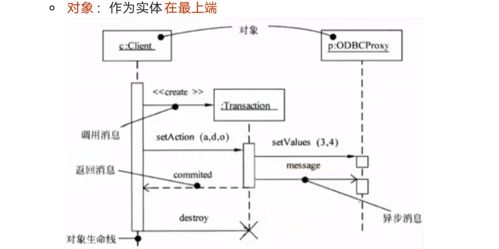

<!-- p125 -->

### 1.4. 通信图

**通信图**：是顺序图的另一种表示方法，也是由对象和消息组成的图，只不过不强调时间顺序，**只强调事件之间的通信**，而且也**没有固定的画法**规则，**和顺序图统称为交互图**

- 主要考察：填**对象名**、填**消息**

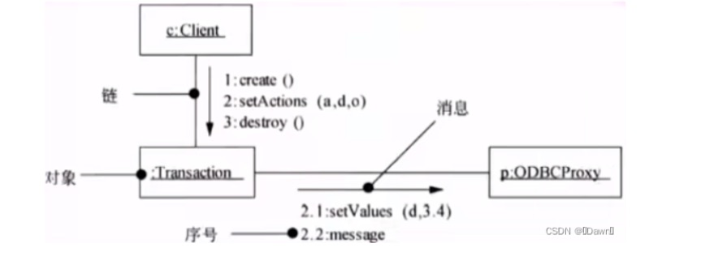

### 1.5. 活动图

**活动图**：动态图，是一种**特殊的状态图**，展现了在系统内从一个活动到另一个活动的流程

- **活动的分岔和汇合线是一条水平粗线**
- 主要考察：填**活动名称**

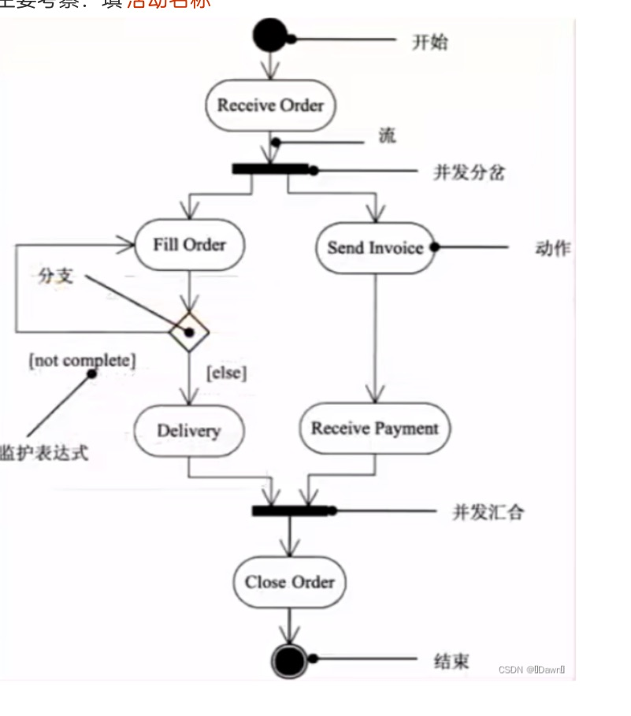

<!-- p126 -->

### 1.6. 状态图

状态图：主要描述状态之间的转换

- 主要考察：填**状态名**、填状态**转换**的**条件**

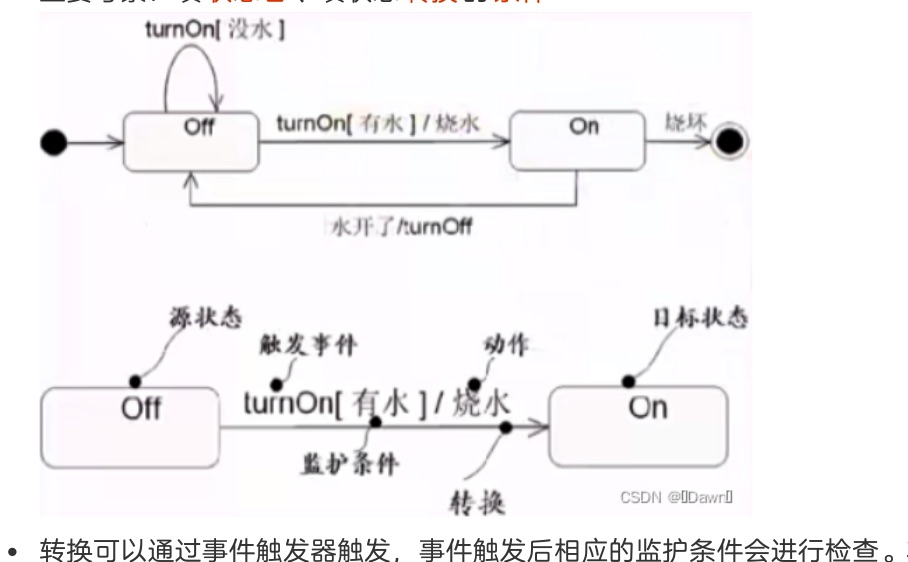

- 转换可以通过事件触发器触发，事件触发后相应的监护条件会进行检查。状态图中转换和状态是两个独立的概念，如图中**方框代表状态**，**箭头上**的**代表触发事件**，**实心圆点为起点和终点**

## 2. 解题技巧

- 要求认真审题，根据题干说明补齐类名或者对象名或者消息名等等，记住类图和对象图中的**多重度**（互相独立的分析，掌握表示方法）、类之间的**联系标识**（多边形端为整体，直线端为个体）
- 题型:
  - 补充**用例图**：主要考察补充用例名称、参与者、用例之间的关系，只要认真审题，**根据题中描述**核对，都可以轻易得出答案
  - 补充**类图**：主要考察补充类名称，需要根据类之间的关系以及**多重度**来判断，需要牢记类之间关系的图形符号，尤其是**组合、聚合和继承**的符号，并且观察符号上的多重度数字，与题目描述对应
  - 补充**状态图**：主要补充状态名称，**根据题目描述**可以轻易得出答案
  - 识别设计模式，**掌握经典设计模式特点**，并结合英文等联想

<!-- p127 -->

# 算法设计(下午试题四)

## 1. 程序设计语言

### 1.1. 程序设计语言的基本成分

- 数据成分：指一种程序设计语言的数据和数据类型。数据分为常量（程序运行时不可改变）、变量(程序运行时可以改变)、全局量（存储空间在静态数据区分配）、局部量（存储空间在堆栈区分配）。数据类型有整型、字符型、双精度、单精度浮点型、布尔型等
- 运算成分：指明允许使用的运算符号及运算规则。包括算术运算、逻辑运算、关系运算、位运算等
- 控制成分：指明语言允许表述的控制结构。包括顺序结构、选择结构、循环结构（初始化 + 循环体 + 循环条件）

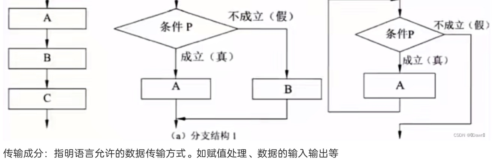

- 传输成分：指明语言允许的数据传输方式。如赋值处理、数据的输入输出等
- 函数：C程序由一个或多个函数组成，每个函数都有一个名字，其中有且仅有一个名字为main的函数作为程序运行时的起点。函数是程序模块的主要成分，是一段具有独立功能的程序。函数使用涉及三个概念：函数定义、函数声明（先声明后使用）、函数调用
- 传值调用：将实参的值传递给形参，形参的改变不会导致调用点所传的实参的值改变。实参可以是合法的变量、常量和表达式
- 传址调用：即引用调用，将实参的地址传递给形参，即相当于实参存储单元的地址引用，因此其值改变的同时就改变了实参的值。实参不能为常量，只能是合法的变量和表达式

## 2. 算法分析

### 2.1. 时间复杂度

时间复杂度是指程序运行从开始到结束所需要的时间。通常分析时间复杂度的方法是从算法中选取一种对于所研究的问题来说是基本运算的操作以该操作重复执行的次数作为算法的时间度量。一般来说，算法中原操作重复执行的次数是规模n的某个函数T(n)。由于许多情况下要精确计算T(n)是困难的，因此引入了渐进时间复杂度在数量上估计一个算法的执行时间。其定义如下:

- 如果存在两个常数c和m，对于所有的n，当 n ≥ m 时有 $f(n) \le cg(n)$，则有 $f(n) = O(g(n))$。也就是说，随着n的增大，f(n)渐进地不大于g(n)。例如，一个程序的实际执行时间为T(n) = $3n^3 + 2n^2 + n$，则T(n)=O($n^3$)
<!-- p128 -->

- 常见的对算法执行所需时间的度量：$O(1) < O(\log_2 n) < O(n) < O(n\log_2 n) < O(n^2) < O(n^3) < O(2^n)$

### 2.2. 空间复杂度

空间复杂度是指对一个算法在运行过程中临时占用存储空间大小的度量。一个算法的空间复杂度只考虑在运行过程中为局部变量分配的存储空间的大小

## 3. 算法分类

### 3.1. 分治法

- 递归：指子程序（函数）直接调用自己活通过一系列调用语句间接调用自己，是一种描述问题和解决问题的常用方法
- 递归两个基本要素:
  - 边界条件（确定递归何时终止，即递归出口）
  - 递归模式（大问题如何分解成小问题，即递归体）
- **分治法**：对于一个规模为n的问题，若该问题可以容易地解决则直接解决，否则将其分为k个规模较小的子问题，这些**子问题互相独立且与原问题形式相同**，递归地解决这些子问题，然后将各子问题的解合并得到原问题的解
  - 步骤：分解（将原问题分解成一系列子问题）—求解（递归地求解各子问题，若子问题足够小，则直接求解）—合并（将子问题的解合并成原问题的解）
  - **凡是涉及到分组解决的都是分治法**（二分查找、归并排序等）

### 3.2. 回溯法

- **回溯法**：有"通用的解题法"之称，可以系统地搜索一个问题的所有解或任一解。在包含问题的所有解的解空间树中，按照**深度优先的策略**，从根节点触发搜索解空间树。搜索至任一结点时，总是先判断该结点是否肯定不包含问题的解，如果不包含，则跳过对以该结点为根的子树的搜索，逐层向其祖先结点回溯；否则，进入该子树；继续按深度优先的策略进行搜索
  - 可以理解为先进行深度优先搜索，一直向下探测，当此路不通时，返回上一层探索另外的分支，重复此步骤，这就是回溯，意为先一直探测，当不成功时再返回上一层
  - **一般用于解决迷宫类的问题**

### 3.3. 动态规划法

- **动态规划法**：在求解问题中，对于每一步决策，列出各种可能的局部解，再依据某种判定条件，舍弃哪些肯定不能得到最优解的局部解，在每一步都经过筛选，以每一步都是最优解来保证全局是最优解
  - 本质也是将复杂的问题划分成一个个子问题，与分治法不同的是每个子问题间不是相互独立的，并且不全都相同
  - **常用于求解具有某种最优性质的问题**
  - 此算法会将大量精力放在前期构造表格上面，其会对每一步，列出各种可能的答案，这些答案会存储起来，最终要得出某个结果时，是通过查询这张表来得到的动态规划法不但每一步最优，全局也最优


<!-- p129 -->

### 3.4. 贪心法

- **贪心法**：总是做出在当前来说是最好的选择，而并不从整体上加以考虑，它所做的每步选择只是当前步骤的局部最优选择，但从整体来说不一定是最优的选择。由于它不比为了寻找最优解而穷尽所有可能解，因此其耗费时间少，一般可以快速得到满意的解，但得不到最优解
  - 局部贪心，只针对当前的步骤取最优，而非整体考虑
  - **判断此类算法，就看算法是否是每一步都取最优，并且整体题意没有透露出最终结果是最优的**

## 4. 解题技巧

- 代码填空：第一小题，最后解决，并不影响解决其他题目，要理解题目算法原理，才能得出答案。另外近几年的算法设计真题有很大的技巧，即便不理解算法原理也可以推导出答案，要结合算法描述中的公式，以及算法代码中类似的支，能够发现填空的答案在代码中其中地方已经给出，因为算法原理的相似可以通用，尤其是分治法算法
  - 要注意的是，当遇到有最小值或最大值参与比较时，若比较出来比最小值更小，接下来肯定要更新这个最小值以及其下标元素值。当遇到一些条件判断的填空时，要注意对应上下文查看哪些变量是作为控制的
- 算法、时间复杂度：第二小题，先做，考察何种算法很好分辨，涉及到分组就是分治法，局部最优就是贪心法，整体规划最优就是动态规划法，迷宫类的问题是回溯法，记住关键字很好区分；时间复杂度就是看C代码中的for循环层数和每一层的循环次数，涉及到二分必然有O(logn)
- 特殊值计算：第三小题，一般应该先做，不需要根据C代码，直接根据题目给出的算法原理，一步步推导即可得出答案，耐心推导并不难。但要注意，如果遇到算法原理十分复杂的，建议放弃，掌握问题1和2的技巧即可

<!-- p130 -->

# 面向对象程序设计与实现(下午试题六)

## 1. JAVA基本语法

### 1.1. 类和示例

类的定义格式如下:

```java
import 包;
[类修饰符] class xxxclass [extends 超类](implements 接口){
  public:
    公有数据成员或共有函数成员的定义;
  protected:
    保护数据成员或保护函数成员的定义;
  private:
    私有数据成员或私有函数成员的定义;
}
```

说明:

- `import 包`：引入包中的类
- **类修饰符**：主要有四个修饰符，**public**、**abstract**、**final**、**private**
- class为关键字，xxxclass为类名，命名遵循Java标识符的命名规则
- extends为**继承**关键字
- implements为**接口**关键字

### 1.2. 继承

```java
abstract class Shape{
  abstract public void()
}

class Rectangle extends Shape{
}
```

- 当使用extends关键字时，表明**继承**关系
- **继承的是抽象类要加abstract关键字**

### 1.3. 接口

接口：JAVA中的接口是一种特殊的类，其内部的实现方法只有定义，没有实现，这就是特殊所在，接口定义如下:

```java
interface IFactory{}
class SqlServerFactory implements IFactory
```

<!-- p131 -->

- 若类使用 `implements` 关键字，表明是**接口类**

## 2. 解题技巧

- 面向对象的程序填空分为两类:
  - 一类是**考察纯定义**，如接口类，抽象类，接口类中的函数定义等，这些根据程序代码可以快速判断出
  - 另一类，就是关于**设计**的，填写函数体，但是这个函数体并不是要写一段真正的程序实现代码，而是调用形式的
- 注意:
  - **定义了类的对象**后，必须先**初始化**（使用`new`关键字）
  - 接口（`interface`）和抽象类（`abstract class`）(子类继承关键字不同，为 `implements` 和 `extends`）
  - **抽象类**中可以有普通的方法（有函数体），也可以有**抽象方法**（**无函数体**，**方法前要加**关键字`abstract`），而**接口中的方法**都是默认为抽象方法（因为默认，**无需再加任何关键字标识**）
  - `this`的使用，**指代当前对象**，一般有**两个重名变量的赋值时会使用到**，如在构造函数中，参数名和私有变量名相同都为name，就要使用 `this.name = name`
  - **题目所给的类图很重要**，从中可以查看类之间的关系以及类中的方法
- JAVA题总结:
  - 抽象类、接口相关，继承、实现关键字，抽象类中有抽象方法和普通方法，抽象方法加abstract，接口中方法都是抽象方法，因此反而不需要加abstract
  - 类的成员变量、类的方法中参数很重要，若参数是类的对象，则一般会在实现中使用此对象调用类的方法；另外赋值中要注意this的使用，当参数名和变量名相同时使用this
  - 结合代码的上下文，明确类之间的关系，结合方法实现的功能，方法中的参数，以及类的成员变量，去解决问题。
