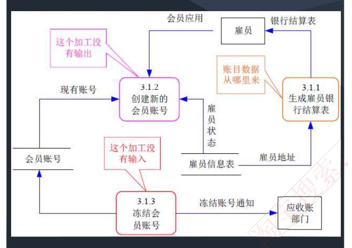
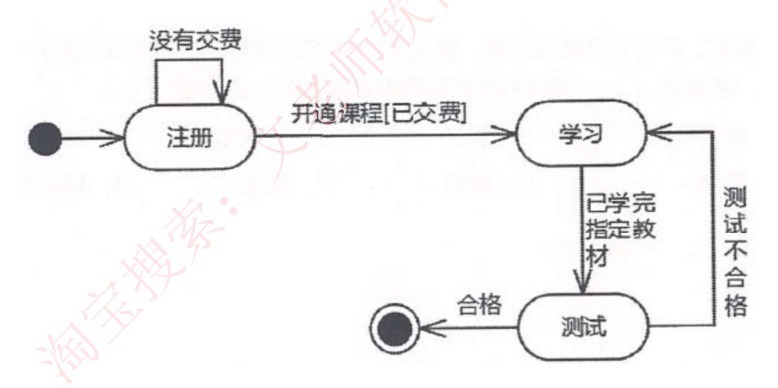
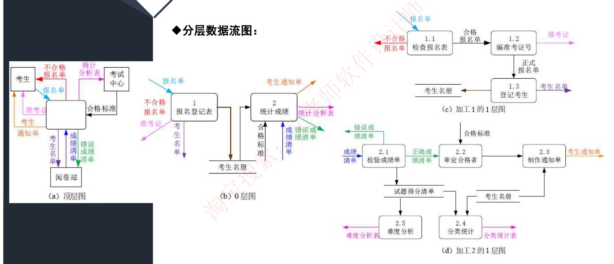

# 21 · 软件工程：结构化开发方法与数据流图 DFD

> 真题：DFD 建模与图书馆外部实体 2016上、接口设计依据 2017上、数据字典条目 2018上、结构化分析的输出 2018下、机票系统外部实体 2018下、加工逻辑叙述 2021上（六道 2026-09-08 逐题核到一手卷面，均系软件设计师卷）｜无计算，是下午题 1 的知识底座｜未讲

---

## 定位

**这一课回答**：需求问清楚之后，怎么把它画成一张谁看都是同一个意思的图，再怎么从这张图走到程序员要的模块结构。全程跟着"给公司做一套内部报销系统"这一个项目走——需求写成一段话交出去，会在四个地方翻车，前四节就是这四个坑各自的补丁：①用什么符号画（数据流图 DFD）、②图太大怎么拆（分层与父图子图平衡）、③图上的名字到底什么意思（数据字典与小说明）、④怎么从数据流走到模块调用（结构化设计）。第五节 WebApp 不在这条链上，认名字即可。符号规则、分层规则、字典条目写法在下午题 1 里要动笔画、动笔写，这一课是它们的底座。

---

## 开讲：需求都问清楚了，你打算怎么把它交给开发

拿一套内部报销系统说事：员工、主管、财务都问了一圈，谁提单、谁审批、超 5000 元要走二级、审完打款到银行。现在要把这些交给三个程序员去写，**最朴素的办法只有一个：写一段话。**

> 员工填写报销单提交，主管审批，审批通过后系统把款打给银行，银行返回结果，员工能查到进度。

这段话你自己读没问题，交出去就出事。**它在四个地方不够用，这一课的全部名词就是这四个坑各自的补丁**：

- ① 三个人读出三个系统。"系统把款打给银行"——**打之前从哪儿取的收款账号？打完的结果存哪儿？**这段话一个字没说；
- ② 就算画成图，报销系统只有三块还画得下，真实系统几十个功能挤在一张纸上就成了蜘蛛网，而且老板要看的粗细和程序员要看的粗细根本不是一回事；
- ③ 图上写着一条箭头叫"报销单"，可**"报销单"到底含哪些字段？"审批"到底按什么规则算？**图形上没地方写；
- ④ 图画的是"数据怎么流"，程序员要的是"我这个模块调谁、被谁调"，两者不是一张图。

**结构化分析与设计方法是一种面向数据流的传统软件开发方法**——"面向数据流"就是说它不问"系统里有哪些对象"，只问"数据从哪来、被谁加工、到哪去"，它以数据流为中心构建软件的分析模型和设计模型。

**结构化分析（Structured Analysis，SA）**、结构化设计（SD）和结构化程序设计（SPD，指模块内部只用顺序、选择、循环三种结构写代码）构成了完整的结构化方法：SA 把业务画清楚，SD 把它切成模块，SPD 管每个模块内部怎么写。

**SA 的分析结果由四部分组成：一套分层的数据流图、一本数据词典、一组小说明（也称加工逻辑说明）、补充材料。** 这四件正好对上前三个坑：分层的数据流图补①和②，数据词典和小说明补③，补充材料是零碎附件；第④个坑归 SD。（**数据词典**就是第三节要讲的**数据字典**，两个名字指同一样东西，考题两种写法都出现。）注意结果里**没有"结构图"**——结构图就是画模块调谁的那张图（第四节讲），是设计阶段的产物，2018 下半年就直接考了这一刀。

### 一、坑①的补丁：数据流图 DFD——只准用四种符号

**数据流图（Data Flow Diagram，DFD）描述数据在系统中如何被传送或变换，以及如何对数据流进行变换的功能或子功能，用于对功能建模。** 它治歧义的办法很硬：规定死了图上只允许出现四种东西，谁画都一样。

| 元素 | 是什么 | 画法 | 报销系统里是谁 |
|---|---|---|---|
| **外部实体**（外部主体） | 定义原文是"**存在于软件系统之外的人员或组织**"，指出系统所需数据的**发源地（源）**和系统所产生的数据的**归宿地（宿）**。**但真题考过"另一个系统"也算**（银行的网银接口、信用卡管理系统），所以判据要用这一条：**系统管不管得着它** | 方框 | 员工、主管、银行的网银接口 |
| **加工**（处理） | **描述了输入数据流到输出数据流之间的变换**，也就是输入做了什么处理后变成输出。名字是动词 | 圆角矩形 或 圆 | 登记报销单、审批、打款 |
| **数据存储**（文件） | 用来存储数据，每个文件都有名字。**流向文件的数据流表示写文件，流出的表示读文件** | 双横线，也可画成右边开口的矩形 | 报销单表、审批记录表 |
| **数据流** | **由一组固定成分的数据组成，表示数据的流向**。每个数据流通常有一个合适的名词，反映数据流的含义 | 带名字的箭头 | 报销单、付款指令 |

只有一条硬规则要现在就记住：**在 DFD 中，数据流的流向必须经过加工**。这句话等价于说，箭头两端至少有一端是加工——所以**外部实体连外部实体、外部实体连数据存储、数据存储连数据存储，一律不许直接连线**。**本课的三条硬规则就是下面这三条，考场上画图、判图全靠它们**：

1. **数据流必须经过加工**（就是上面这条）；
2. **加工不能是黑洞、奇迹或灰洞**（本节末讲）；
3. **父图与子图必须平衡**（第二节讲）。

下午题另有卷面格式与答题步骤，那是 49 的事，规则本身这里已经齐了。

**先猜一下。** 下面是一张"会员应用"系统的 DFD 片段，三个加工全有毛病。先别往下看，光看进出箭头的条数，你觉得各是什么毛病：

| 加工 | 进来的箭头 | 出去的箭头 |
|---|---|---|
| 3.1.1 生成雇员银行结算表 | 雇员地址（1 条） | 银行结算表（1 条） |
| 3.1.2 创建新的会员账号 | 会员应用、现有账号、雇员状态（3 条） | 无 |
| 3.1.3 冻结会员账号 | 无 | 冻结账号通知、回写会员账号（2 条） |

3.1.2 和 3.1.3 数箭头就能发现：**加工有输入但是没有输出，称之为"黑洞"**——数据掉进去出不来；**加工有输出但是没有输入，称之为"奇迹"**——数据凭空冒出来。

3.1.1 最容易被放过，因为它一进一出、形式上挑不出毛病。但你想想：要生成一张**银行结算表**，光有"雇员地址"够吗？账号、金额、结算周期从哪来？图上没有任何来源。这就是第三种：**加工中输入不足以产生输出，我们称之为"灰洞"**。原图上标了三处，第三处的批注正是"账目数据从哪里来"：



**黑洞和奇迹是数箭头的机械活，灰洞必须读懂业务。** 上午题给一句描述让你判是哪一种，判据就是"有没有"和"够不够"两问。

顺带说清一件 DFD 干不了的事：它只画数据的流动，画不出"报销单现在处于什么状态、什么事情发生了会跳到下一个状态"。那是同一套结构化分析里的另一张图——**状态转换图（STD）**，图上画**状态**（其中要标出**初态**和**终态**）和触发跳转的**事件**。报销单是草稿→待审→已审→已打款，事件是"提交""驳回""打款成功"。

下面这张 STD 画的是学员：注册状态下"没有交费"就转回自己，"开通课程[已交费]"跳到学习，"已学完指定教材"跳到测试，"合格"到终态，"测试不合格"退回学习：



考试对 STD 的要求只到"认得它是行为模型、要标初态终态"，三张图的分工是固定考点：**DFD 是功能模型、STD 是行为模型、E-R 图（画实体和实体之间联系的那张图，数据库板块细讲）是数据模型**。

> 考试这样问：给一个业务场景问某个东西属于四种元素的哪一类；给一句加工的进出情况问属于三种画错的哪一种；给"对功能建模／行为建模／数据建模"三句话问各是哪张图。

### 二、坑②的补丁：把一张图拆成好几层

报销系统的图长这样。**顶层图**（也叫上下文数据流图）**只含有一个加工处理表示整个管理信息系统**，描述系统的输入输出以及和外部实体的数据交互，这一层上一般不画数据存储：

```
 [员工 E1] ──报销单────▶ (            ) ──审批结果──▶ [员工 E1]
 [主管 E2] ──审批意见──▶ (  报销系统  ) ──审批请求──▶ [主管 E2]
 [银行 E3] ──付款回执──▶ (            ) ──付款指令──▶ [银行 E3]
```

⚠️ **纯文本画不出圆角**，这里用 `[ ]` 代表方框画的**外部实体**、用 `( )` 代表圆角矩形画的**加工**。动笔画的时候别弄反：**方框是外部实体，圆角框才是加工**。

三个外部实体、一个加工、六条数据流、零个数据存储。往下拆一层就是 **0 层图**，把系统拆成 P1 登记报销单、P2 审批、P3 打款三个加工，**数据存储从这一层开始出现**：D1 报销单表、D2 审批记录表。

0 层图上一共 13 条数据流，分成两组看：

- **一端连着外部实体的 6 条**：E1→P1 报销单、E2→P2 审批意见、E3→P3 付款回执（进来 3 条）；P2→E1 审批结果、P2→E2 审批请求、P3→E3 付款指令（出去 3 条）。
- **只在加工与数据存储之间跑的 7 条**：P1→D1 新报销单、D1→P2 待审报销单、P2→D2 审批记录、P2→D1 审批后状态、D1→P3 已批准报销单、D2→P3 审批记录、P3→D1 付款状态。

下面那一猜，问的正是第一组。

再往下，P2 还能拆成 2.1 校验金额、2.2 判定审批级别、2.3 记录审批意见，这就是 **1 层图**；**子图的加工编号继承父图的编号**，所以是 2.1、2.2 而不是从 1 重新编。

（**P 只是本讲义的行文记号**，方便区分加工和别的东西；卷面上加工就写 1、2、3 和 2.1、2.2，不带 P。）上一层叫**父图**，拆出来的下一层叫**子图**。

**再猜一次。** 顶层图上有 6 条箭头连着外部实体。那么 0 层图上，"一端连着外部实体"的箭头应该有几条？

答案是**必须也是 6 条，而且名字一一对得上**：入流是报销单、审批意见、付款回执，出流是审批结果、审批请求、付款指令。这就是**父图与子图的平衡原则——子图的输入输出数据流，同父图相应加工的输入输出数据流必须一致**。

道理很朴素：拆开只是把一个盒子换成三个小盒子，盒子和外界打交道的口子不该多也不该少。多出一条，说明子图里有个加工在跟外面偷偷通信，父图上没画；少一条，说明父图承诺的事子图没人干。

有一个放宽的口径必须记，考试专挑这里出错项：**父图的一条数据流，可以对应子图里的几条数据流，只要这几条的数据项合起来正好是父图那一条，仍然算平衡。**

**判平衡看的是数据项合起来对不对得上，不是数箭头。**

> 考试这样问：给几句关于分层与平衡的叙述判对错，三个判据是顶层图**几个加工**、数据存储**从哪层出现**、平衡**存在于哪两者之间**。

这条放宽口径落到一张真图上长什么样，看本节末的推演，跳过不影响后面。

#### 推演 · 考务处理系统：条数对不上为什么仍算平衡



- **(a) 顶层图**：一个加工、三个外部实体（考生、考试中心、阅卷站）、零个数据存储。
- **(b) 0 层图**：两个加工（1 报名登记表、2 统计成绩），数据存储"考生名册"这一层才出现。
- **(c) 加工 1 的 1 层图**：拆成 1.1 检查报名表、1.2 编准考证号、1.3 登记考生，对外一进四出（进：报名单；出：不合格报名单、准考证、考生名单，外加写入考生名册），和父图上加工 1 的进出**逐条同名**，标准的平衡。
- **(d) 加工 2 的 1 层图**：拆成 2.1 检验成绩单、2.2 审定合格者、2.3 制作通知单、2.4 分类统计、2.5 难度分析，对外的出流有四条（错误成绩清单、考生通知单、难度分析表、分类统计表），而父图上加工 2 只有三条（错误成绩清单、考生通知单、统计分析表）。

(d) 条数对不上，但仍然平衡：父图那条"统计分析表"，在子图里被拆成了"难度分析表"和"分类统计表"两条，数据项合起来正好是父图那一条。

### 三、坑③的补丁：数据字典与小说明

图画完了，图上只有名字。**数据流图描述了系统的分解，但没有对图中各成分进行说明。数据字典（Data Dictionary，DD）就是为数据流图中的每个数据流、文件、加工，以及组成数据流或文件的数据项做出说明。** 图是骨架，字典是图例。

**先猜一下：字典要给图上哪几种东西写说明？外部实体算不算？** 不算。**数据字典有以下 4 类条目：数据流、数据项、数据存储和基本加工**——数据项就是不可再分的最小数据单位，比如"单号""金额"；基本加工就是不再往下拆的最底层加工。2018 上半年直接考过这一刀：问"数据字典的条目不包括"，四个选项是外部实体、数据流、数据项、基本加工，答案是**外部实体**——它是 DFD 的图形元素，不是字典条目。

另有教材把条目列成六项，遇到选项换了一组词该怎么答，看本节末的深入，跳过不影响后面。

条目的写法用四个符号：

| 符号 | 含义 | 举例及说明 |
|---|---|---|
| **=** | 被定义为 | 报销单 = 单号 + 金额，左边那个名字由右边这些成分组成 |
| **+** | 与 | x=a+b，表示 x 由 a 和 b 组成 |
| **[…\|…]** | 或 | x=[a\|b]，表示 x 由 a 或 b 组成 |
| **{……}** | 重复 | x={a}，表示 x 由 **0 个或多个** a 组成 |
| **( )** | 可选 | x=(a)，表示 a 可有可无 |
| **m{…}n** | 限定次数的重复 | x=2{a}5，表示 a 至少 2 次、至多 5 次 |

前四个是必考的，**考点全在 `{}` 是"0 个或多个"而不是"至少 1 个"**；后两个认得即可。

报销系统的字典条目写出来是这样，六个成分：

```
报销单 = 单号 + 员工工号 + 报销日期 + {费用明细} + 合计金额 + [发票照片|电子发票号]
费用明细 = 费用类型 + 金额 + 发生日期
```

读法：一张报销单可以挂 0 条到多条费用明细（`{}` 是 **0 个或多个**，不是"至少 1 个"，这是错项最爱造的地方）；发票照片和电子发票号二选一。

加工那一栏怎么写？**加工逻辑也称为"小说明"**，写的是这个基本加工把输入变成输出的规则。

**常用的加工逻辑描述方法有结构化语言、判定表和判定树 3 种**：**结构化语言**就是带缩进的伪代码，中文照写不误；**判定表**是把各个条件的取值组合列成表格，每一列写出该走哪个动作；**判定树**是同一件事的树形画法，从左往右按条件逐层分叉，叶子是动作。报销系统的 P2 审批用三种写分别长这样：

```
结构化语言：  if (合计金额 > 5000) 转二级审批;
              else 转直属主管审批;

判定表：      条件：合计金额>5000 |  是   否
              动作：转二级审批    |  √
                    转直属主管    |       √

判定树：      合计金额 ─┬─ >5000 ─→ 转二级审批
                        └─ ≤5000 ─→ 转直属主管审批
```

条件多、组合密时用判定表不易漏组合，条件有明显层次时判定树更直观。**这里有个 2021 上半年考过的分寸：小说明只写"输入变成输出的规则"，不写"用什么数据结构、什么算法实现"**——那是详细设计阶段的事，需求分析阶段还轮不到。

> 考试这样问：一问 4 类条目里不包括哪个；二给四句关于加工逻辑的叙述，问哪句不正确。

#### 深入 · 数据字典条目的另一套口径

这里有个必须讲清的坑——条目的分法不止 4 类这一套。另一套口径列的是**数据元素、数据结构、数据流、数据存储、加工逻辑、外部实体**共 6 项：它把数据项叫"数据元素"，另加了数据结构和外部实体两条。两套都不是笔误，是两本教材各自的分法。

**考试用的是 4 类那套**，2018 上那道题就是按它判的。所以遇到这类题先扫一眼选项用的是哪组词：**出现"数据项""基本加工"就按 4 类判，外部实体不是条目**；整套换成"数据元素、数据结构、加工逻辑"，那就按题干给的那套答。

### 四、坑④的补丁：从数据流图走到模块结构

分析产物齐了，可它们描述的仍然是业务，不是程序。**结构化设计（Structured Design，SD）方法是一种面向数据流的设计方法，它可以与 SA 方法衔接。基本思想是将系统设计成由相对独立、功能单一的模块组成的结构。**

SD 用**结构图（Structure Chart）来描述软件系统的体系结构**，指出一个软件系统由哪些模块组成，以及模块之间的调用关系——注意它画的是"谁调用谁"，和 DFD 画的"数据往哪流"是两回事。

**结构图（全称模块结构图）由模块、调用、数据、控制和转接五种基本符号组成**：模块是方框；调用是箭头；数据和控制是挂在调用箭头旁的小箭头，分别表示传过去的是数据还是控制信息；转接是图画不下时的续接标记。

**结构化设计主要包括四项**，四句描述常被打乱了当选项，2017 上半年就是这么考的：

| 任务 | 干什么 | 报销系统里是什么 |
|---|---|---|
| **体系结构设计** | 定义软件的主要结构元素及其关系 | 定下提单、审批、打款、报表四大块和它们的层次 |
| **数据设计** | 基于实体联系图确定软件涉及的文件系统的结构及数据库的表结构 | 报销单表、审批记录表建几张、什么字段 |
| **接口设计** | 描述用户界面，软件和其他硬件设备、其他软件系统及使用人员的外部接口，以及各种构件之间的内部接口 | 提单页面长什么样、跟银行的对接接口怎么定 |
| **过程设计** | 确定软件各个组成部分内的算法及内部数据结构，并选定某种过程的表达形式来描述各种算法 | 审批状态机内部怎么写 |

其中两条的"依据什么"是固定考点：**数据设计基于实体联系图（E-R 图）**、**接口设计依据数据流图**。这两个千万别对调——道理是现成的：接口就是"谁和谁之间过数据"，而 DFD 画的正是数据在系统内外怎么流。

> 考试这样问：给四句任务描述问哪句是接口设计（或数据设计、过程设计）的任务；或直接问接口设计依据需求分析阶段的哪一样产物。

从 DFD 具体怎么长出结构图，分变换型、事务型两条路线，看本节末的深入，跳过不影响后面。

#### 深入 · 从 DFD 长出结构图：变换型与事务型

教材给的是两条路线，认得名字即可：DFD 若是一条流水线（取数据→加工→送数据），叫**变换型**，转出的结构图顶层挂输入、变换、输出三个分支；DFD 若是一个中心接到请求后按类型分发给互不相干的几条支路，叫**事务型**，转出的结构图顶层挂接收模块和调度模块，调度模块再分发。

**判别看那个中心加工是在"变"还是在"分"**；真实系统常是混合的，先按事务型切分支，再对每条分支做变换分析。

### 五、不在这条链上：WebApp 分析与设计

上面四个坑是一条链，WebApp 不在链上，它是另起的一节，考试要求只到"认得"。**WebApp 是基于 web 的系统和应用**，也就是浏览器里跑的那类系统。**大多数 WebApp 采用敏捷开发过程模型进行开发**——敏捷就是不先写厚文档，一两周交付一个能用的版本再改，比如报销系统第一周先上能提单的版本。

六个特性，抓关键词即可：

- **网络密集性**：驻留在网络上，服务不同客户群体
- **并发性**：大量用户可能同时访问
- **无法预知的负载量**：用户数每天可能有数量级变化，周一 100 人周四可能 10000 人
- **性能**：等太久用户就走了
- **可用性**：热门 WebApp 用户通常要求 **24/7/365 全天候**访问
- **数据驱动**：主要功能是用超媒体——文字里直接嵌图片、音视频和跳转链接的那种内容组织方式——提供文本图片音频视频，还常访问外部数据库

五种需求模型，靠名字对内容：

- **内容模型**：给出 WebApp 提供的全部内容（文字、图形、图像、音频、视频）
- **交互模型**：描述用户与 WebApp 采用哪种交互方式，由用例、顺序图、状态图、用户界面原型等构成
- **功能模型**：定义用于内容的操作及其他处理功能
- **导航模型**：为 WebApp 定义所有导航策略，考虑每类用户如何从一个元素导航到另一个
- **配置模型**：描述 WebApp 所在的环境和基础设施，复杂时可以使用 **UML 部署图**（画"哪个程序装在哪台机器上"的那张图）

设计分四块：

- **架构设计**：描述以什么方式管理用户交互、操作内部处理任务、实现导航及展示内容；**MVC 即模型-视图-控制器结构是 WebApp 基础结构模型之一**，把功能及信息内容分离；
- **构件设计**：构件是一包定义良好的聚合功能（为最终用户处理内容或提供计算），所以它同时包括**内容设计元素和功能设计元素**，即构件级内容设计（关注内容对象及包装后展示给用户的方式）与构件级功能设计（把 WebApp 作为一系列构件交付，与信息体系结构并行开发以保证一致性）；
- **内容设计**：着重内容对象的表现和导航的组织，采用**线性结构、网格结构、层次结构、网络结构**四种及其组合——这四种容易和网络拓扑的总线/星型/环型混，注意是两码事；
- **导航设计**：定义导航路径，使用户能访问内容和功能。

## 速记

- SA 面向数据流，产物四件：分层 DFD ＋ 数据词典 ＋ 小说明 ＋ 补充材料；**结构图是设计的产物，不是分析的**
- DFD 四元素：外部实体方框、加工圆或圆角框、数据存储双横线或右开口框、数据流箭头；数据流必过加工，等于说实体、存储两两不能直连
- 三种画错：只进不出黑洞、只出不进奇迹、进得不够灰洞；进存储是写，出存储是读
- 分层：顶层一个加工一般不画存储，存储从 0 层起，子图编号带父级前缀；平衡只在父图与子图之间，**父图一条可对子图几条，看数据项合不合得上**
- 数据字典 4 类条目：数据流、数据项、数据存储、基本加工——**外部实体不是条目**；符号 `=` 定义、`+` 与、`[a|b]` 或、`{a}` 重复 0 到多次
- 小说明三写法：结构化语言、判定表、判定树；**只写规则，不写实现的数据结构和算法**
- SD 四项：体系结构、数据、接口、过程；**接口设计依据 DFD，数据设计依据 E-R 图**；结构图五符号：模块、调用、数据、控制、转接；中心在"变"是变换型，在"分"是事务型
- WebApp：六特性（网络密集、并发、负载不可预知、性能、可用性 24/7/365、数据驱动）、五模型（内容/交互/功能/导航/配置）、MVC；内容设计四结构线性网格层次网络
