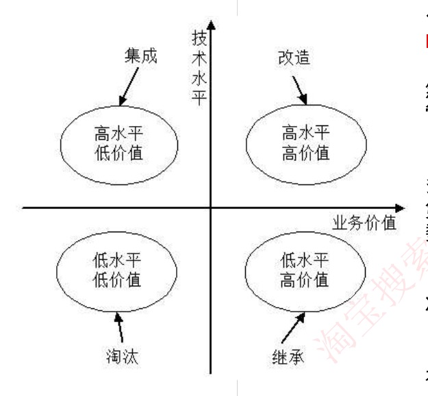

# 22 · 软件工程：软件复用、逆向工程与系统转换

## 定位

一个跑了很多年、改不动的旧系统怎么处置。全课跟着一套用了八年的内部报销系统（作者离职、文档停在第一版、没人敢动超额审批那段代码）走，"推倒重写"在五处接不住，五节依次补上：读懂它（逆向工程与四级抽象）→ 定改造深浅（设计恢复、重构、正向工程、再工程）→ 沉淀通用零件（复用与产品线）→ 判旧系统死活（遗留系统四象限）→ 平滑换上去（三种转换计划）。末节软件工具三分类不在这条链上。全课零计算。

---

## 一、逆向工程与四级抽象

**原话｜** 软件的逆向工程是**分析程序，力图在比源代码更高抽象层次上建立程序的表示过程**，逆向工程是**设计的恢复过程**。

即手上只剩代码，倒推出设计图：用 IDE 生成类的调用关系图，或从数据库表反推 **E-R 模型**（实体-联系图，画"报销单属于哪个员工、挂在哪个部门"这类业务实体及其关系）。

倒推结果按抽象程度分四级，由低到高：

| 级别 | 包含什么信息 | 例子 |
|---|---|---|
| 实现级 | 程序的抽象语法树、**符号表**（编译时记录每个变量、函数的名字和类型的表）、过程的设计表示 | AST（编译器把代码逐个符号拆开后的那棵树）、符号表 |
| 结构级 | 反映程序分量之间相互依赖关系的信息 | 调用图（谁调用谁）、**结构图**（模块间的层次调用关系图）、程序和数据结构 |
| 功能级 | 反映程序段功能及程序段之间关系的信息 | 数据和控制流模型（数据在哪几步间流动、程序按什么顺序走分支） |
| 领域级 | 反映程序分量或程序诸实体与应用领域概念之间对应关系的信息 | E-R 模型 |

**抽象就是扔细节，完备性就是保留了多少原始细节，两者成反比**：**领域级抽象最高、完备性最低；实现级抽象最低、完备性最高。** E-R 图只剩"报销单—员工—部门"几个方框，代码里的边界判断一条不剩；AST 一个符号不少，但最不像人话。

---

## 二、改造的深浅：设计恢复、重构、正向工程、再工程

按改的深浅，从只看不改到做出新版本：

| 报销系统里做的事 | 叫什么 | 原话 |
|---|---|---|
| 用工具扫源码，自动生成类图、调用图、E-R 图，一行代码没改 | **设计恢复** | 借助工具**从已有程序中抽象出有关数据设计**、总体结构设计和过程设计等方面的信息 |
| 把 3000 行的审批大函数拆成 20 个小函数，功能不变 | **重构** | 在**同一抽象级别上转换系统描述形式** |
| 恢复出设计后，拿它回头改老系统、提升质量 | **正向工程** | **不仅从现有系统中恢复设计信息，而且使用该信息去改变或重构现有系统** |
| 读懂老设计后加上"支持多币种"新需求，做出 2.0 | **再工程** | 在**逆向工程所获得信息的基础上，修改或重构已有的系统，产生系统的一个新版本** |
| 分析程序，在比源代码更高的抽象层次上建立程序的表示 | **逆向工程** | 见第一节 |

**再工程 = 逆向工程 + 新需求的考虑过程 + 正向工程**（原文，三步有先后）。再工程是最大的筐：逆向工程倒推设计 → 考虑新需求 → 正向工程把改动落回系统。中间那步是它区别于纯翻新之处，用再工程重构现有系统时一般会增加新功能、改善性能。正向工程定义里的"恢复设计信息"是它的前提（上一步逆向工程的产出），它自己真正干的是拿设计回头改系统。

**"正向工程"有两套口径**：日常说的正向开发指需求 → 设计 → 编码；再工程语境下的正向工程指"把恢复出的设计拿回去改系统"。本课按后者的原话。

**重构 vs 再工程**
判据｜抽象级别不变、不产生功能上的新版本 → 重构；加了新需求、产出新版本 → 再工程。
例子｜拆函数、改变量名 → 重构；拆完函数顺手加多币种支持出 2.0 → 再工程。

**逆向工程 vs 设计恢复**（原话"逆向工程是设计的恢复过程"已把两者绑在一起）
判据｜描述里有"转换为**更高级的抽象表现形式**/更高抽象层次" → 逆向工程；只说"借助工具从已有程序中抽象出数据设计、总体结构设计和过程设计等信息"、不提抽象层次抬升 → 设计恢复。
例子｜"从源码建立比代码更高层次的程序表示" → 逆向工程；"用工具从程序中提取数据设计和过程设计信息" → 设计恢复。

---

## 三、软件复用与软件产品线

报销、采购报账、差旅报账三套系统里，审批流、附件上传、生成财务凭证是同一套东西，却各写了一遍。

**原话｜** 软件复用：**将已有软件的各种有关知识用于建立新的软件，以缩减软件开发和维护的花费**；是**提高软件生产力和质量的一种重要技术**。

复用的"知识"：早期主要是**代码级复用**，只指程序；后来扩大到**领域知识、开发经验、设计决定、体系结构、需求、设计、代码和文档等一切有关方面**，共八样。"软件复用就是复用代码"是错的。

**原话｜** 软件产品线：一个**产品集合**，这些产品**共享一个公共的、可管理的特征集，这个特征集能满足特定领域的特定需求**。收益：**提高软件生产率和质量，缩短开发时间，降低总开发成本**。

即先造一个"报账类系统"底座，报销、差旅、采购都从底座上长出来，各自只改不同的部分。组成两块：

| 组成 | 内容 |
|---|---|
| **核心资源** | 所有产品共用的软件架构、通用的**构件**（预先做好、可直接拼装的软件单元，如通用审批流引擎）、文档等——不只是构件 |
| **产品集合** | 产品线中的各种产品 |

建立方式两个维度交叉成四格。**演化 = 边走边改**，核心资源随新产品需求逐步长出；**革命 = 一次到位**，按**超集**（所有产品可能要的需求并在一起）把核心资源做全。另一维是基于现有产品，还是全新产品线：

| | 演化方式 | 革命方式 |
|---|---|---|
| **基于现有产品** | 基于现有产品架构设计产品线的架构，经演化现有构件，开发产品线构件 | 核心资源的开发基于现有产品集的需求和可预测的、将来需求的超集 |
| **全新产品线** | 产品线核心资源随产品新成员的需求而演化 | 开发满足所有预期产品线成员的需求的核心资源 |

---

## 四、遗留系统四象限

**原话｜** 遗留系统：任何基本上**不能进行修改和演化以满足新的变化了的业务需求的信息系统**。判据是"改不动"，不是"年份老"。

四个特点：
- 完成企业中许多重要的业务管理工作，但**仍然不能完全满足要求**（一般实现业务处理电子化及部分企业管理功能，很少涉及经营决策）
- 性能上已经落后，采用的**技术已经过时**
- 通常是大型软件系统，已融入企业的业务运作和决策管理机制之中，**维护工作十分困难**
- 没有使用现代信息系统建设方法进行管理和开发，现在**基本上已经没有文档，很难理解**

两个轴**技术水平**、**业务价值**，四格即**遗留系统的演化策略**：

| | 业务价值低 | 业务价值高 |
|---|---|---|
| **技术水平高** | 集成 | 改造 |
| **技术水平低** | 淘汰 | 继承 |

**改造 vs 继承**
判据｜两者业务价值都高，看技术底子：技术还行 → 改造；技术过时到改不动 → 继承（把它承担的业务功能在新系统里重新实现）。
例子｜公文系统是十五年前 VB 写的、没有文档，但全公司发文离不开 → 继承；若它是近年的主流技术栈，只是功能不够 → 改造。

**集成 vs 继承**
判据｜技术水平高的才能被"集成"（当现成模块接进来用）；技术水平低的只能"继承"它的业务功能（重写）。
例子｜技术新但业务边缘的考勤系统 → 集成；技术过时但业务核心的系统 → 继承。

描述里"技术过时、维护困难"= 技术水平低，"核心业务离不开"= 业务价值高。

---

## 五、系统转换计划

**原话｜** 系统转换：**新系统开发完毕，投入运行，取代现有系统的过程**。

| 计划 | 做法 | 风险 | 成本 | 适用 |
|---|---|---|---|---|
| **直接转换** | 现有系统被新系统直接取代 | **很大** | **最低**（原文：优点是节省成本） | 新系统不复杂，或现有系统已经不能使用 |
| **并行转换** | 新老系统并行工作一段时间，试运行后再取代 | **极小**，试运行出问题不影响现有系统，还能比较新老系统性能 | 耗费人力和时间资源，难以控制两个系统间的数据转换 | **大型系统** |
| **分段转换** | 分期分批逐步转换，是直接和并行转换的集合（两种做法合着用）；大型系统分为多个子系统，成熟一个转换一个 | 居中（原文未直接定性） | **更耗时**，新旧系统混合使用，要协调好接口 | 大型项目 |

**直接 vs 并行**
判据｜直接转换的优点是"节省成本"不是"风险小"，它风险最大；并行风险极小但有代价，最大麻烦是两套系统间数据对齐。
例子｜报销系统不算大型，但报销数据一丢就是钱的事，不会直接拔电源：并行跑一个月、月底两边对账；或按差旅、采购、日常三类分段切，切一类稳一类。若老系统已经跑不起来 → 只能直接转换。

**数据转换与迁移**三种方法：**系统切换前通过工具迁移、系统切换前采用手工录入、系统切换后通过新系统生成**。

---

## 六、软件工具三分类

按软件过程活动分：

| 类别 | 包括 |
|---|---|
| **软件开发工具** | 需求分析工具、设计工具、编码与排错工具 |
| **软件维护工具** | 版本控制工具、文档分析工具、开发信息库工具、逆向工程工具、再工程工具 |
| **软件管理和软件支持工具** | 项目管理工具、配置管理工具、软件评价工具、软件开发工具的评价和选择 |

**版本控制 vs 配置管理**
判据｜划分依据是工具服务于软件过程的哪个活动：版本控制动的是软件本身（代码、文档的历次修改），服务长期演进 → 维护工具；配置管理管的是过程（基线、变更审批、谁能改） → 管理和支持工具。
例子｜天天用 Git 写新代码，Git 仍归维护工具不归开发工具；审批一次基线变更 → 配置管理工具。

其余认名即可：逆向工程工具、再工程工具归维护类；软件评价工具归管理和支持类。

## 速记

- 逆向工程 = 在比源代码更高抽象层次上建立程序的表示，是**设计的恢复过程**；四级由低到高**实现 → 结构 → 功能 → 领域**（AST·符号表／调用图·结构图／数据流控制流／E-R）
- **领域级抽象最高、完备性最低；实现级抽象最低、完备性最高**（反比）
- 重构=同级平移；设计恢复=借工具只提取；正向工程=恢复了还拿去改；**再工程 = 逆向工程 + 新需求的考虑过程 + 正向工程 → 新版本**
- 软件复用从代码级扩到八样（领域知识、开发经验、设计决定、体系结构、需求、设计、代码、文档）
- 产品线 = 核心资源（架构＋构件＋文档）+ 产品集合；**演化 = 渐进，革命 = 一次覆盖所有预期需求**
- 遗留系统判据是"改不动"不是"年份老"；**高水平高价值→改造，高水平低价值→集成，低水平高价值→继承，低水平低价值→淘汰**
- 转换三计划：**直接**（风险很大、省成本）／**并行**（风险极小、耗人力时间，大型系统）／**分段**（分期分批、更耗时，要协调接口）；数据迁移三法：切换前工具迁移、切换前手工录入、切换后新系统生成
- 工具三类反直觉位：**版本控制→维护工具；软件评价、配置管理→管理和支持工具**
