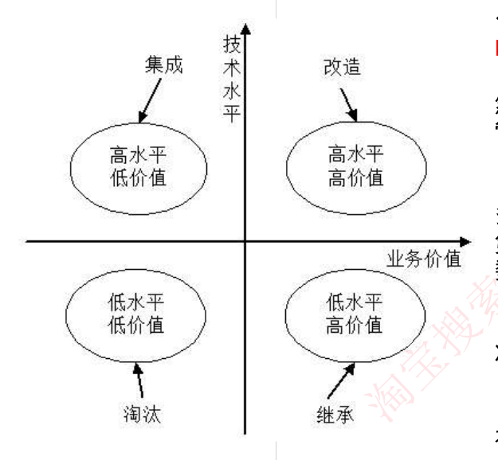

# 22 · 软件工程补充：软件复用 / 逆向工程 / 软件产品线 / WebApp / 系统转换与评价

> 真题：逆向工程/再工程、软件工具分类、遗留系统四象限（外部资料，年份待核实）｜无计算｜未讲（09-04 补缺课）

---

## 第 0 层 · 定位

**这一课回答**：软件的「下半生」：旧资产怎么复用（软件复用、构件、产品线）、旧系统怎么理解和改造（逆向工程与再工程、遗留系统四象限）、新系统怎么替换旧系统（系统转换与评价）、WebApp 分析设计。

**前后关系**：15–19 讲从无到有做出来，20 讲维护，本课讲更后面的事；与 15–20 不重复，只补它们没讲的七块。

**分值与去向**：板块 11–13 分；下午不考。全是定义辨析，零计算。

---

## 第 1 层 · 理解

### 一句话

> 这一章回答的是**"面对一个已经存在的旧系统，你能做什么"**：**读懂它（逆向工程）、改造它（再工程）、把它的零件用起来（软件复用/产品线）、用新系统替换它（系统转换）、判断它值不值得留（遗留系统演化策略）**。外加一个独立话题：**Web 应用怎么分析设计（WebApp）**。

### 痛点：接手一个没人说得清的老系统

每个程序员都遇到过：

- **"这个系统十年了，写它的人早走了，没有文档，只有代码。"** —— 你需要**从代码反推出设计**。这就是**逆向工程**。
- **"这坨代码不能重写，只能一点点改。"** —— 在逆向工程的基础上重构改造，就是**再工程**。
- **"我们公司做了 20 个类似的系统，每次都从零开始。"** —— 明明有共性却不复用。这就是**软件产品线**要解决的。
- **"新系统上线那天，老系统怎么下？直接切？还是并行跑一阵？"** —— 这是**系统转换**。
- **"这个老系统到底该留、该改、还是该扔？"** —— 这是**遗留系统演化策略**的四象限。

### 一条主线

```
面对一个已经存在的软件资产，四个动作：
   ↓
【动作①：把它的知识提取出来】
    软件复用：把已有软件的各种有关知识用于建立新软件
        早期只复用【代码】，后来扩大到【领域知识、开发经验、设计决定、
        体系结构、需求、设计、代码和文档】等一切方面
   ↓
【动作②：读懂它】—— 逆向工程
    定义：分析程序，力图在【比源代码更高抽象层次上】建立程序的表示过程
    本质 =【设计的恢复过程】
    四个级别（按抽象程度从低到高）：
        实现级 → 结构级 → 功能级 → 领域级
        【领域级抽象级别最高、完备性最低；实现级抽象级别最低、完备性最高】
   ↓
【动作③：改造它】—— 四个相关概念（最容易混，必须分清）
    重构     = 【同一抽象级别上】转换系统描述形式（横向变形，不升级）
    设计恢复 = 借助工具从已有程序中【抽象出设计信息】（只提取，不改）
    再工程   = 在逆向工程所获信息的基础上【修改或重构】已有系统，产生【新版本】
               三步骤：逆向工程 → 新需求的考虑过程 → 正向工程
    正向工程 = 不仅恢复设计信息，还【使用该信息去改变或重构现有系统】
   ↓
【动作④：判断它值不值得留】—— 遗留系统四象限
    两个轴：技术水平（高/低） × 业务价值（高/低）
        高水平 + 高价值 → 【改造】
        高水平 + 低价值 → 【集成】
        低水平 + 高价值 → 【继承】
        低水平 + 低价值 → 【淘汰】
   ↓ 决定要换新系统之后：
   ↓
【系统转换三方案】直接（风险大，省成本）/ 并行（风险极小，耗资源）/ 分段（折中，最耗时）
【系统评价三时点】立项评价 / 中期评价 / 结项评价
```

**独立话题**：**WebApp** —— Web 应用有六个特性（网络密集、并发、负载不可预知、性能、可用性、数据驱动），五种需求模型（内容/交互/功能/导航/配置），架构常用 **MVC**。

---

## 第 2 层 · 考点：考试怎么问

### 考点① 逆向工程的四个级别（高频，考"哪个抽象级别最高"）

**逆向工程定义**：软件的逆向工程是**分析程序，力图在比源代码更高抽象层次上建立程序的表示过程**，逆向工程是**设计的恢复过程**。

| 级别 | 包含的信息 | 举例 |
|---|---|---|
| **实现级** | 程序的**抽象语法树、符号表、过程的设计表示** | AST、符号表 |
| **结构级** | 反映**程序分量之间相互依赖关系**的信息 | **调用图、结构图**、程序和数据结构 |
| **功能级** | 反映**程序段功能及程序段之间关系**的信息 | **数据流和控制流模型** |
| **领域级** | 反映程序分量或程序诸实体与**应用领域概念之间对应关系**的信息 | **E-R 模型** |

**必背一句**：
> **领域级抽象级别最高，完备性最低；实现级抽象级别最低，完备性最高。**

**记忆抓手**：**实现 → 结构 → 功能 → 领域**，越往后越"像人话"，越不像代码。
- 实现级 = 编译器眼里的样子（AST）
- 结构级 = 谁调用谁
- 功能级 = 这段代码干什么
- 领域级 = 这对应业务上的什么概念

**陷阱**：⚠️ **抽象级别和完备性是反比关系**——越抽象，丢的细节越多，完备性越低。这个反比关系是考点。

---

### 考点② 重构 / 设计恢复 / 再工程 / 正向工程（最易混，必考辨析）

| 概念 | 定义（**原文表述**） | 一句话抓手 |
|---|---|---|
| **重构** | 在**同一抽象级别上**转换系统描述形式 | **平移，不升不降** |
| **设计恢复** | 借助工具**从已有程序中抽象出**有关数据设计、总体结构设计和过程设计等方面的信息 | **只提取，不改动** |
| **再工程** | 在**逆向工程所获得信息的基础上，修改或重构已有的系统，产生系统的一个新版本** | **提取 + 改造 = 新版本** |
| **正向工程** | **不仅从现有系统中恢复设计信息，而且使用该信息去改变或重构现有系统**，以改善其整体质量 | **恢复 + 使用它去改造** |

**再工程的三个步骤**（必背）：
> **逆向工程 → 新需求的考虑过程 → 正向工程**

**题目长什么样**：
> 应用系统构建中可以采用多种不同的技术，（ ）可以将软件某种形式的描述**转换为更高级的抽象表现形式**，而利用这些获取的信息，（ ）能够**对现有系统进行修改或重构，从而产生系统的一个新版本**。
> A. **逆向工程（Reverse Engineering）**　B. 系统改进　C. 设计恢复　D. **再工程（Re-engineering）**
> **答案：A　D**　【真题·年份待核实】

**怎么解**：抓题干动词
- "**转换为更高级的抽象表现形式**" → **逆向工程**（往上抽象）
- "**修改或重构，产生新版本**" → **再工程**（在逆向工程基础上改造）
- "**同一抽象级别转换**" → **重构**（不升级）
- "**只抽象出设计信息**"（没说改） → **设计恢复**

**陷阱**：
- ⚠️ **逆向工程 vs 设计恢复**：两者都是"提取信息"，区别在**逆向工程是过程的总称，设计恢复强调"借助工具"**。考试中若两个都在选项里，看题干是否强调"工具"。
- ⚠️ **再工程包含逆向工程**，不是并列关系。再工程 = 逆向工程 + 新需求 + 正向工程。

---

### 考点③ 遗留系统的四象限演化策略（高频）

**遗留系统定义**：任何基本上**不能进行修改和演化以满足新的变化了的业务需求**的信息系统。

**四个特点**：
1. 系统虽然完成许多重要业务，但**仍不能完全满足要求**（很少涉及经营决策）；
2. 系统在**性能上已经落后，采用的技术已经过时**；
3. 通常是**大型软件系统**，已融入业务运作和决策管理机制，**维护工作十分困难**；
4. 没有使用现代信息系统建设方法管理和开发，**现在基本上已经没有文档，很难理解**。

**四象限（纵轴技术水平，横轴业务价值）**：

| | **业务价值低** | **业务价值高** |
|---|---|---|
| **技术水平高** | **集成** | **改造** |
| **技术水平低** | **淘汰** | **继承** |



**题目长什么样**：
> 对于遗留系统的评价框架如下图所示，那么处于"**高水平、低价值**"区的遗留系统适合于采用的演化策略为（ ）。
> A. 淘汰　B. 继承　C. 改造　D. **集成**
> **答案：D**　【真题·年份待核实】

**记忆口诀**：
> **高水平高价值 → 改造（值得投入升级）**
> **高水平低价值 → 集成（技术还行但业务用得少，接进来当模块用）**
> **低水平高价值 → 继承（业务离不开，但技术烂，只能把功能继承到新系统）**
> **低水平低价值 → 淘汰（两头都不行，直接扔）**

**陷阱**：⚠️ **"集成"和"继承"最容易记反**。记法：**技术水平"高"的才配被"集成"（当现成模块用）；技术水平"低"的只能"继承"它的业务功能（重写）。**

---

### 考点④ 系统转换的三种方案（高频）

**系统转换**：新系统开发完毕，投入运行，**取代现有系统**的过程。

| 方案 | 做法 | 风险 | 适用 | 代价 |
|---|---|---|---|---|
| **直接转换** | **现有系统被新系统直接取代** | **很大** | 新系统不复杂，或现有系统已经不能使用 | **优点是节省成本** |
| **并行转换** | **新系统和老系统并行工作一段时间**，新系统试运行后再取代 | **极小**（试运行出问题不影响现有系统；还可比较新老性能） | **大型系统** | **耗费人力和时间资源**，难以控制两个系统间的数据转换 |
| **分段转换** | **分期分批逐步转换**，是直接和并行的结合；将大型系统分为多个子系统，成熟一个转换一个 | 中等 | 大型项目 | **更耗时**，且新旧系统混合使用，需协调接口 |

**数据转换与迁移的三种方法**：
> **系统切换前通过工具迁移 / 系统切换前采用手工录入 / 系统切换后通过新系统生成**

**陷阱**：
- ⚠️ **直接转换的优点是"节省成本"**，不是"风险小"。
- ⚠️ **并行转换适合大型系统**，因为大型系统出错代价太高，必须有兜底。

---

### 考点⑤ 软件产品线

**定义**：软件产品线是一个**产品集合**，这些产品**共享一个公共的、可管理的特征集，这个特征集能满足特定领域的特定需求**。

**两个组成部分**：
- **核心资源**：包括所有产品所共用的**软件架构、通用的构件、文档**等；
- **产品集合**：产品线中的各种产品。

**建立方式（两个维度交叉，四种组合）**：

| | **演化方式** | **革命方式** |
|---|---|---|
| **基于现有产品** | 基于现有产品架构设计产品线架构，**演化现有构件**，开发产品线构件 | 核心资源的开发基于**现有产品集的需求和可预测的将来需求的超集** |
| **全新产品线** | 产品线核心资源**随产品新成员的需求而演化** | 开发满足**所有预期产品线成员需求**的核心资源 |

**记忆抓手**：
> **演化 = 边走边改（渐进）；革命 = 一次到位（一次性覆盖所有预期需求）。**

---

### 考点⑥ 软件工具的分类（易考）

按软件过程活动，软件工具分为三类：

| 类别 | 包含的工具 |
|---|---|
| **软件开发工具** | 需求分析工具、设计工具、编码与排错工具 |
| **软件维护工具** | **版本控制工具**、文档分析工具、开发信息库工具、**逆向工程工具**、再工程工具 |
| **软件管理和软件支持工具** | 项目管理工具、配置管理工具、**软件评价工具**、软件开发工具的评价和选择 |

**题目长什么样**：
> 在软件系统工具中，**版本控制工具**属于（ ），**软件评价工具**属于（ ）。
> A. 软件开发工具　B. **软件维护工具**　C. 编码与排错工具　D. **软件管理和软件支持工具**
> **答案：B　D**　【真题·年份待核实】

**陷阱**：⚠️ **版本控制工具属于"维护工具"而不是"开发工具"**——这非常反直觉（我们天天用 Git 开发），但教材口径如此。**记住这个反直觉点。**

---

### 考点⑦ WebApp 分析与设计

**WebApp = 基于 Web 的系统和应用。大多数 WebApp 采用敏捷开发过程模型进行开发。**

**六个特性**：

| 特性 | 含义 |
|---|---|
| **网络密集性** | 驻留在网络上，服务于不同客户群体 |
| **并发性** | **大量用户可能同时访问** |
| **无法预知的负载量** | 用户数量每天都可能有**数量级**的变化 |
| **性能** | 等待时间长用户就会流失 |
| **可用性** | 热门 WebApp 用户通常要求 **24/7/365（全天候）**访问 |
| **数据驱动** | 主要功能是用超媒体向用户提供文本、图片、音频、视频内容 |

**五种需求模型**：

| 模型 | 描述什么 |
|---|---|
| **内容模型** | WebApp 提供的全部**内容**（文字、图形、图像、音频、视频） |
| **交互模型** | 用户与 WebApp **采用哪种交互方式**（用例、顺序图、状态图、界面原型） |
| **功能模型** | 定义用于 WebApp 内容的**操作**及其他处理功能 |
| **导航模型** | 定义所有**导航策略**（每类用户如何从一个元素导航到另一个） |
| **配置模型** | 描述 WebApp **所在的环境和基础设施**（复杂时可用 **UML 部署图**） |

**四项设计**：
1. **架构设计**：**MVC（模型-视图-控制器）结构是 WebApp 基础结构模型之一**，将功能及信息内容分离；
2. **构件设计**：包括**内容设计元素**和**功能设计元素**；
3. **内容设计**：通常采用**线性结构、网格结构、层次结构、网络结构**四种结构及其组合；
4. **导航设计**：定义导航路径。

**陷阱**：⚠️ **WebApp 内容设计的四种结构**（线性/网格/层次/网络）容易和**网络拓扑结构**（总线/星型/环型/树型/分布式）混，注意区分场景。

---

### 考点⑧ 系统评价的三个时点

| 评价 | 时点 | 干什么 |
|---|---|---|
| **立项评价** | 系统开发**前**的预评价 | 分析是否立项开发，做**可行性评价** |
| **中期评价** | 项目开发**中期**每个阶段的阶段评审 | 或项目遇到**重大变故**时，评价是否还要继续 |
| **结项评价** | 系统投入**正式运行后** | 了解系统是否达到预期目的和要求，做综合评价 |

---

## 完整算例

### 算例 A：四个改造概念对号入座

**题目【模拟】**：某公司接手一个十年前的老 ERP 系统，先后做了下列四件事，分别属于哪个概念？

| # | 做的事 |
|---|---|
| ① | 用工具扫描全部源码，自动生成了类图、调用关系图和数据库 E-R 图，但没改一行代码 |
| ② | 把系统里的 3000 行"上帝函数"拆成 20 个小函数，功能完全不变，也没加新特性 |
| ③ | 在读懂老系统设计的基础上，加入了"支持多币种"这个新需求，重新构建出 2.0 版本 |
| ④ | 分析老程序，在比源代码更高的抽象层次上建立了程序的表示 |

**分步解**：

**①** "**从已有程序中抽象出**数据设计、总体结构设计等信息"+"**借助工具**"+"**没改一行代码**" → **设计恢复**

**②** "拆函数"+"**功能完全不变，没加新特性**" → 这是在**同一抽象级别上转换系统描述形式** → **重构**
- ⚠️ 注意：重构**不改变抽象级别**，也不产生新版本功能。

**③** "**在读懂老系统设计的基础上**（=逆向工程）"+"**加入新需求**"+"**重新构建出新版本**" → **再工程**
- 完整对应再工程三步骤：逆向工程 → 新需求的考虑过程 → 正向工程。

**④** "分析程序，在**比源代码更高的抽象层次上**建立程序的表示" → **逆向工程**（这就是它的定义原文）

**答案**：① 设计恢复　② 重构　③ 再工程　④ 逆向工程

> 💡 **四者的关系图**：
> ```
> 逆向工程（提取，往上抽象）
>     ├─ 设计恢复（借助工具提取设计信息，是逆向工程的一种手段）
> 重构（同级平移，不提取也不升级）
> 再工程 = 逆向工程 + 新需求 + 正向工程（产生新版本）
> 正向工程（用恢复的信息去改造系统）
> ```

---

### 算例 B：遗留系统四象限决策

**题目【模拟】**：某集团有四个遗留系统，评估结果如下，分别应采取什么演化策略？

| 系统 | 技术水平 | 业务价值 | 现状描述 |
|---|---|---|---|
| A | 高 | 高 | 三年前用 Spring Boot 重写过，是核心交易系统 |
| B | 高 | 低 | 技术栈较新，但只有一个边缘部门每月用两次 |
| C | 低 | 高 | 十五年前的 VB 系统，没有文档，但全公司的工资都靠它算 |
| D | 低 | 低 | 十年前的一个内部论坛，技术老旧，已基本无人使用 |

**分步解**：

**A（高水平 + 高价值）** → **改造**
理由：技术底子好、业务重要，值得投入资源升级扩展，让它继续承载核心业务。

**B（高水平 + 低价值）** → **集成**
理由：技术还行，可以**当作现成的模块/服务集成到其他系统里**，不必单独维护一整套。

**C（低水平 + 高价值）** → **继承**
理由：业务离不开它（工资计算），但技术太烂无法改造，只能**把它的业务功能"继承"到新系统中重新实现**。

**D（低水平 + 低价值）** → **淘汰**
理由：两个维度都不行，直接停用。

**答案**：A 改造　B 集成　C 继承　D 淘汰

> 💡 **本题的记忆价值**：C 这一格最容易错。很多人凭直觉觉得"业务重要就该改造"——但**技术水平低意味着"改不动"**，只能重写（继承其功能）。**改造的前提是技术底子还行。**

---

### 算例 C：系统转换方案选型

**题目【模拟】**：三个项目分别应选哪种转换方案？说明理由。

| # | 项目 |
|---|---|
| ① | 某银行核心账务系统更换，涉及全行 500 个网点，出错会造成重大资金风险 |
| ② | 某小公司的内部考勤系统换新，功能简单，老系统已经跑不起来了 |
| ③ | 某大型制造企业 ERP 更换，包含采购、生产、销售、财务四大子系统 |

**分步解**：

**①** 关键词"**出错会造成重大资金风险**" → 必须有兜底 → **并行转换**
- 理由：新老系统并行运行一段时间，新系统出问题不影响现有业务；还能在试运行中**比较新老系统的性能**。
- 代价：耗费人力和时间资源，且**难以控制两个系统间的数据转换**。

**②** 关键词"**功能简单**"+"**老系统已经跑不起来了**" → **直接转换**
- 理由：完全符合直接转换的适用条件——"新系统不复杂，或者现有系统已经不能使用"；且**优点是节省成本**。

**③** 关键词"**大型**"+"**包含四大子系统**" → **分段转换**
- 理由：将大型系统分为多个子系统，**成熟一个转换一个**。
- 代价：**更耗时**，且新旧系统混合使用期间**需要协调好接口**。

**答案**：① 并行转换　② 直接转换　③ 分段转换

---

## 速记

**1. 逆向工程四级别**
> **实现级 → 结构级 → 功能级 → 领域级**
> **领域级抽象最高、完备性最低；实现级抽象最低、完备性最高**（反比关系）

**2. 四个改造概念**
> **重构 = 同级平移**
> **设计恢复 = 只提取不改**
> **逆向工程 = 往上抽象（设计的恢复过程）**
> **再工程 = 逆向工程 + 新需求 + 正向工程 → 新版本**

**3. 遗留系统四象限**
> **高水平高价值 → 改造；高水平低价值 → 集成**
> **低水平高价值 → 继承；低水平低价值 → 淘汰**
> 记法：**技术高才配被"集成"，技术低只能"继承"功能**

**4. 系统转换三方案**
> **直接（风险大、省成本，适合简单或老系统已废）**
> **并行（风险极小、耗资源，适合大型系统）**
> **分段（折中、最耗时，需协调接口）**

**5. 软件工具三分类（反直觉点）**
> **版本控制工具 = 维护工具（不是开发工具）**
> **软件评价工具 = 管理和支持工具**

**6. 软件产品线**
> **核心资源（架构+构件+文档）+ 产品集合**
> **演化 = 渐进；革命 = 一次覆盖所有预期需求**

**7. WebApp**
> **六特性：网络密集、并发、负载不可预知、性能、可用性（24/7/365）、数据驱动**
> **五模型：内容、交互、功能、导航、配置（复杂配置用 UML 部署图）**
> **架构常用 MVC；内容设计四结构：线性/网格/层次/网络**

**8. 系统评价三时点**
> **立项（前，可行性）→ 中期（阶段评审/重大变故）→ 结项（运行后综合评价）**

---

## 自测练习

**练习 1【模拟】** 在逆向工程的四个抽象级别中，抽象级别最高但完备性最低的是（ ）级。
A. 实现　B. 结构　C. 功能　D. 领域

**练习 2【模拟】** 在同一抽象级别上转换系统描述形式的是（ ）；在逆向工程所获信息基础上修改或重构已有系统、产生系统新版本的是（ ）。
A. 重构　B. 设计恢复　C. 再工程　D. 正向工程

**练习 3【模拟】** 某遗留系统采用的技术已严重过时、维护困难，但它承载着企业最核心的结算业务，无法停用。对该系统应采取的演化策略是（ ）。
A. 淘汰　B. 继承　C. 改造　D. 集成

**练习 4【模拟】** 某大型医院要将运行了十年的 HIS 系统更换为新系统，新系统涉及门诊、住院、药房、检验四大模块，且医院 24 小时运转不能停机。最适合的系统转换方案是（ ）；若某小型诊所的简易挂号系统更换，且老系统已经无法启动，则适合采用（ ）。
A. 直接转换　B. 并行转换　C. 分段转换　D. 试点转换

**练习 5【模拟】** 以下关于 WebApp 的叙述中，不正确的是（ ）。
A. 大多数 WebApp 采用敏捷开发过程模型进行开发
B. WebApp 的负载量通常是可以准确预测的
C. WebApp 的配置模型在复杂情况下可以使用 UML 部署图描述
D. MVC 是 WebApp 的基础结构模型之一

---

### 参考答案

**练习 1：D**
**领域级抽象级别最高，完备性最低**；实现级抽象级别最低，完备性最高。四级由低到高是：**实现级 → 结构级 → 功能级 → 领域级**。

**练习 2：A　C**
- "在**同一抽象级别上**转换系统描述形式" → **重构**（这是重构的定义原文）
- "在**逆向工程所获信息的基础上，修改或重构**已有系统，**产生新版本**" → **再工程**（定义原文）
- 排除 B：设计恢复只是"**抽象出**设计信息"，不涉及修改。
- 排除 D：正向工程是"恢复信息**并使用它**改造系统"，但题干强调的是"在逆向工程基础上产生新版本"，标准答案对应再工程。

**练习 3：B**
拆解题干两个维度：
- "技术已严重过时、维护困难" → **技术水平低**
- "承载企业最核心的结算业务，无法停用" → **业务价值高**
- **低水平 + 高价值 → 继承**

> ⚠️ 最容易误选 C（改造）。**改造的前提是技术水平高**——技术都过时到维护不动了，改造无从下手，只能把业务功能**继承**到新系统重写。

**练习 4：C　A**
- 第一空："**大型**"+"包含四大模块"+"24 小时不能停机" → **分段转换**（分期分批，成熟一个转换一个）。
  > 也有人会选并行转换（B）。但题干强调的是"**四大模块**"这个可分割结构，且分段转换本身就是"直接和并行的结合"，更贴合大型多子系统场景。若题干只强调"出错代价极高"而不强调可分割，则选并行。
- 第二空："**简易**"+"**老系统已经无法启动**" → **直接转换**（适用条件原文："新系统不复杂，或者现有系统已经不能使用"）。
- 排除 D：教材只有直接、并行、分段三种，**没有"试点转换"**。

**练习 5：B**
WebApp 的六个特性里明确有"**无法预知的负载量**"——"用户数量每天都可能有**数量级**的变化。例如，周一显示有 100 个用户使用系统，周四就有可能会有 10000 个用户"。所以 B 说"可以准确预测"是错的。
A、C、D 均为原文表述，正确。

---

## 考题回顾

| # | 出处 | 考点 | 状态 |
|---|---|---|---|
| 1 | 上午·逆向工程与再工程辨析（外部资料转录 11） | 四个改造概念 | 已作为考点②例题，**年份待核实** |
| 2 | 上午·软件工具分类（外部资料转录 11） | 版本控制=维护工具、软件评价=管理支持工具 | 已作为考点⑥例题，**年份待核实** |
| 3 | 上午·遗留系统四象限（外部资料转录 11） | 高水平低价值→集成 | 已作为考点③例题，**年份待核实** |

> ⚠️ **本课练习尚未作答**，需在课堂检验环节收题批改后回填。
> ⚠️ **考频提示**：与讲义 43 同理，本课七块内容在 `计划/00-总体计划.md` 的「近5年真题核对结果」（2021–2025 交叉检索）里**均未出现**。建议按"**扫一眼、能认出**"的强度处理。其中**逆向工程四级别**和**遗留系统四象限**这两块结论性强、易出选择题，优先记；WebApp 部分可最后看。
