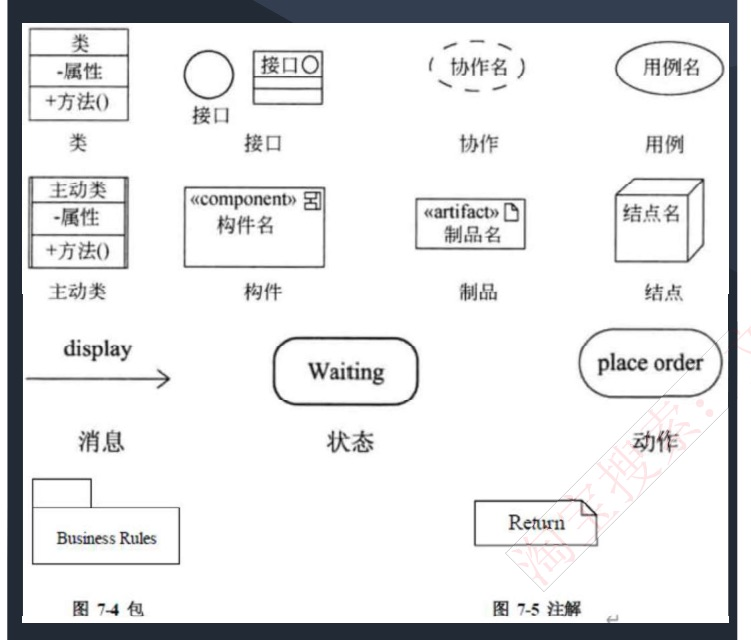
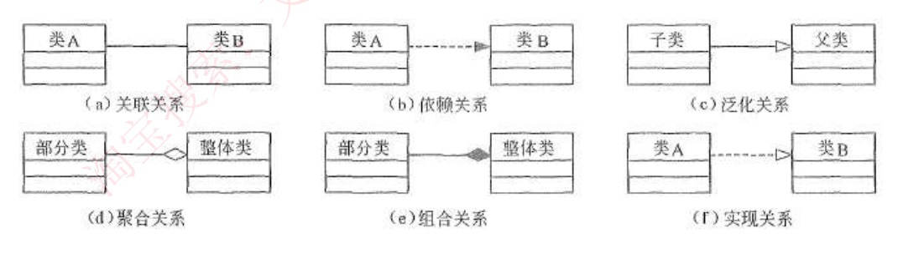
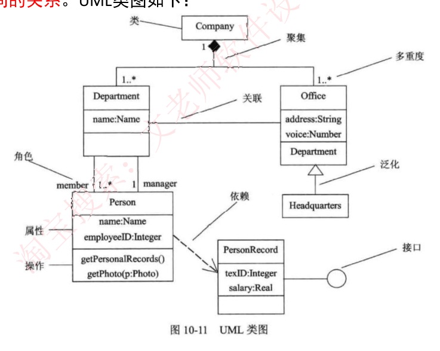
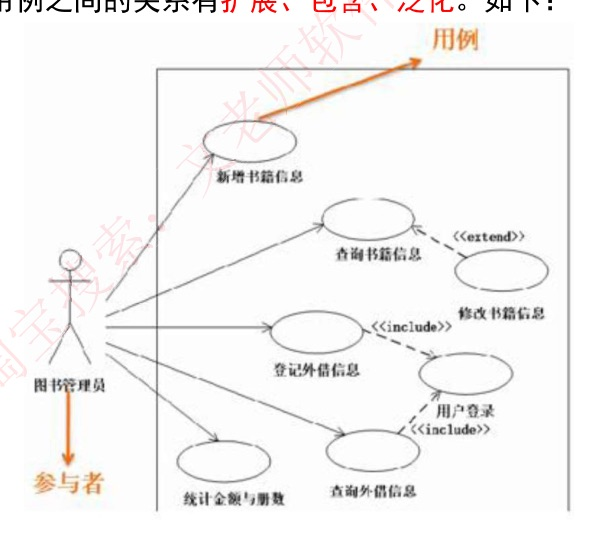
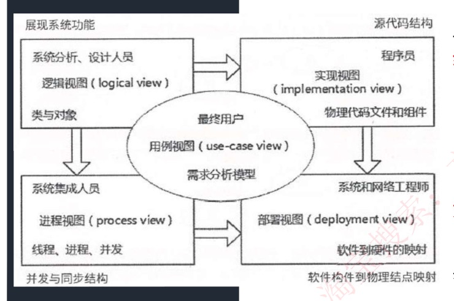

# 25 · 面向对象：UML 静态图

## 定位

一张 UML 图上允许出现哪些东西、东西之间能连哪几种关系、要画哪几张图、谁看哪一张。第一到三节回答前三问：构造块与四类事物、五大关系加实现（本课重心）、13 种图的结构图/行为图划分；第四到六节逐张过静态六图（类图、对象图、用例图、构件图、部署图、包图）；第七节按"谁看"重新分一遍（4+1 视图）。全程用"公司内部报销系统"（员工填单、主管审批、财务打款）作例子。

**UML（Unified Modeling Language，统一建模语言）**是一种**可视化的建模语言，而非程序设计语言**，支持从需求分析开始的软件开发的全过程。它只规定怎么画，不规定项目怎么走——先做需求还是先搭架子是瀑布、RUP 那类过程模型的事，"UML 是一种方法/过程"是错的。

---

## 一、构造块与四类事物

UML 的结构 = **构造块 + 规则 + 公共机制**：

| 组成 | 是什么 |
|---|---|
| 构造块 | 零件，只有三种：**事物（thing）、关系（relationship）、图（diagram）**。事物是名词；关系把事物紧密联系在一起；图是多个相互关联的事物的集合 |
| 规则 | 构造块如何放在一起的规定，如同一个包里两个类不能重名 |
| 公共机制 | 哪张图都通用的小手段：给元素贴注解、加 `«component»` 这类尖括号标签（叫**构造型**，说明"这个框其实是个构件"） |

四类事物：

| 类别 | 原话 | 例子（报销系统） |
|---|---|---|
| **结构事物** | 模型的**静态部分** | 类（报销单、员工）、接口、用例（提交报销单）、构件（`reimburse-service.jar` 这种可单独编译替换的软件块）、协作、主动类（自带一条控制线程的类）、结点 |
| **行为事物** | 模型的**动态部分** | 交互、活动、状态机（报销单从"草稿"到"已打款"）、消息、状态、动作 |
| **分组事物** | 模型的**组织部分** | 包（`com.company.reimburse` 这种代码目录） |
| **注释事物** | 模型的**解释部分**，依附于一个元素或一组元素之上对其进行约束或解释的简单符号 | 注解"金额单位为分" |

**包 vs 结构事物**
判据｜它有没有在描述系统本身：类、用例、构件说系统里有什么（结构），交互、状态机说系统怎么动（行为）；包只是文件夹、注解只是便签，都不描述系统，各自单独成类。
例子｜包装着类，但它是**分组事物**，不是结构事物。

符号：类是三格矩形；接口是小圆圈（或带 `«interface»` 的方框，同一样东西两种画法）；协作（一组类为完成某功能凑在一起的配合）是虚线椭圆；用例是实线椭圆；结点是立方体；构件带 `«component»`、制品带 `«artifact»`（打包落到磁盘上的那个文件）；包是左上角带小标签的文件夹；注解是右上角折角的纸片；状态是圆角矩形、动作是两头圆的体育场形。



---

## 二、五大关系加实现

UML 关系归成四条：依赖、关联、泛化、实现，关联下再分聚合和组合，画到图上是六种线。通常说的"五大关系"指**泛化、关联、依赖、聚合、组合**，实现单算一种。

| 关系 | 原话 | 画法 | 报销系统例子 |
|---|---|---|---|
| **关联** | 一种结构关系，描述了一组链，链是对象之间的连接 | 实线，两端可标多重度、角色名 | 报销单一直记着提单员工 |
| **聚合** | 关联的一种，部分和整体的关系 | 实线 + **空心菱形**，菱形贴整体 | 部门—员工 |
| **组合** | 关联的一种，部分和整体的关系，事物之间关系**更强** | 实线 + **实心菱形**，菱形贴整体 | 报销单—费用明细 |
| **依赖** | 一个事物的语义依赖于另一个事物的语义的变化而变化 | 虚线 + 细箭头，指向被用方 | 报销单临时调汇率服务折算外币；汇率服务改签名，报销单跟着改，反之不用 |
| **泛化** | 一般/特殊的关系，子类和父类之间的关系 | 实线 + 空心三角，三角贴父类 | 交通费报销单、招待费报销单 → 报销单 |
| **实现** | 一个类元指定了另一个类元保证执行的契约（类元：类、接口这类可被实例化或被实现的建模元素的统称） | 虚线 + 空心三角，三角贴接口 | "金额分级审批"类 → "审批策略"接口 |



图中 (b) 依赖和 (f) 实现都是虚线，区别只在箭头：(b) 填黑小箭头，(f) 空心三角。

**聚合 vs 组合**
判据｜"更强"强在两条：① 生命周期绑死（整体没了部分也没了）；② 部分只能属于一个整体、不能拆去装到别的整体上。① 分不出时看 ②。
例子｜报销单删了，"餐费 120 元"明细没有意义、也不能挪到别的单上 → 组合；部门撤了员工还在、可借调 → 聚合。汽车报废时座位、车窗、发动机实物都还在，① 判不出；但它们随这辆车配，音乐系统却能拆下装到别的车上 → 只有音乐系统不是组合。

**关联 vs 依赖**
判据｜是否长期持有：只有成员变量是关联；方法参数、局部变量、返回值、静态调用都是依赖。
例子｜

```java
class 报销单 {
    private 员工 提单人;                       // 成员变量，一直持有 → 关联
    void 换算(汇率服务 s) { s.折算(this.金额); } // 方法参数，用完就走 → 依赖
}
```

**泛化 vs 实现**
判据｜都是空心三角，看线型：实线泛化（`extends`），虚线实现（`implements`）。
例子｜交通费报销单 extends 报销单 → 泛化；金额分级审批 implements 审批策略 → 实现。

**多重度**（关联线两端的数字，"对方一个实例对应这一端多少个"）：`1` 恰好一个，`0..1` 至多一个，`*` 任意多（含 0），`1..*` 至少一个，`m..n` 从 m 到 n 个。报销单 `1` ——— `1..*` 费用明细：一张单至少一条明细，一条明细只属于一张单。

**角色名**：两个类之间的关联实际上是两个类所扮演**角色**的关联，因此两个类之间可以有多个由不同角色标识的关联。员工和部门之间两条：member（属于该部门）、manager（管理该部门）。



这张教材图上 Department 与 Person 之间两条线分别标 `member`、`manager`。图里有个**实心**菱形旁标"聚集"：聚集是"整体-部分"一族的统称（空心聚合、实心组合都在内），标签给的是族名，认关系看菱形是否填色。Office 框第三格写着 `Department`，按"第三格是操作"读不通，是原图画法。

---

## 三、图的分类

**结构图（静态图）画"系统里有什么"，行为图（动态图）画"什么时候发生什么"。** 《软件设计师教程》第 5 版的 UML 2.0 图：

| 类别 | 图 |
|---|---|
| 结构图 6 种 | 类图、对象图、包图、组合结构图、构件图、部署图 |
| 行为图 7 种 | 用例图、顺序图、通信图、交互概览图、定时图、状态图、活动图 |

共 **13 种**（教材口径）。"14 种"有两种说法：教材说有的资料把**制品图**单列凑成 14；**UML 官方规范**的第 14 种是**剖面图**（profile diagram，用构造型扩展 UML），制品图在官方规范里只是部署图上的元素。

展开讲的十张：静态六张（类图、对象图、用例图、构件图、部署图、包图）在本课；顺序图、通信图在讲义 26，状态图、活动图在讲义 27。其余认名即可：组合结构图、定时图、交互概览图、制品图、剖面图。

**用例图的静/动归属**：国内教材口径标为**静态图**（沿用"用例图对系统的**静态用例视图**建模"的说法）；UML 官方分类放在行为图里。

---

## 四、类图与对象图

| 图 | 原话 | 看图特征 |
|---|---|---|
| **类图** | 静态图，为系统的**静态设计视图**，展现一组**对象、接口、协作和它们之间的关系**（这里"对象"实指类） | 三格矩形：类名（**抽象类名斜体**）/ 属性 / 操作；可见性 `+` 公有、`-` 私有、`#` 受保护 |
| **对象图** | 静态图，展现**某一时刻一组对象及它们之间的关系**，为类图的某一快照；在没有类图的前提下，对象图就是静态设计视图 | 方框写 `Zhang : Student`（对象名 : 类名，**加下划线**），或匿名 `: Course`；格子里是 `name = "计算机导论"` 这样的**具体值**；对象间连线叫**链**（关联在此刻的实例） |

**类图 vs 对象图**
判据｜格子里是类型还是具体值；出现"某一时刻""快照""实例"即对象图。类图不用于对**对象快照**建模。
例子｜`- name : String` → 类图；`name = "计算机导论"` → 对象图。

---

## 五、用例图

**原话｜** 用例图展现了一组**用例、参与者以及它们之间的关系**。参与者是人、硬件或其他系统可以扮演的角色；用例是参与者完成的一系列操作；用例之间的关系有**扩展、包含、泛化**。

三要素：参与者画小人，用例画椭圆，系统边界画大方框。参与者的判据是"**在系统边界外**"而非"是不是人"——对接的银行打款接口、单点登录系统同样是参与者。

三种关系，问一句：**去掉它，基用例（主流程用例）还走不走得完？**

| 关系 | 判据 | 例子 | 画法 |
|---|---|---|---|
| **包含 include** | 走不完，每次都要做的公共步骤 | "提交报销单"每次都要"校验预算余额" | 虚线箭头，**基用例 → 被包含用例** |
| **扩展 extend** | 走得完，只少一个有条件的可选分支 | 金额超 5000 元才追加"二级审批" | 虚线箭头，**扩展用例 → 基用例** |
| **泛化** | 同一件事的两种做法 | "扫描发票录入""手工录入"都是"录入发票" | 实线 + 空心三角，子指父 |

**箭头方向统一记法**：箭头指向"不知道对方存在也照样成立"的那一端。对依赖、泛化、实现、include、extend 五种都成立；关联（无箭头实线）和聚合、组合（菱形）不套这句，按"菱形贴整体端"记。



图书管理系统用例图：登记外借信息 ⇢`«include»` 用户登录；修改书籍信息 ⇢`«extend»` 查询书籍信息。**用例名写在椭圆下方**，两条 `«include»` 箭头尖都落在中间椭圆"用户登录"上。

---

## 六、构件图、部署图与包图

| 图 | 原话 | 看图特征 |
|---|---|---|
| **构件图（组件图）** | 静态图，为系统**静态实现视图**，展现了一组构件之间的组织和依赖（"实现"指代码落地，不是虚线空心三角的实现关系） | 构件方框 + 供接口/需接口，**没有机器** |
| **部署图** | 静态图，为系统**静态部署视图**，描述物理模块（结点）在系统中的分布；与构件图相关，通常一个结点包含一个或多个构件；结点之间的依赖和包之间的依赖一样，**是单向的** | **立方体**＝结点（服务器、终端），内装 `«artifact»` 制品（war 包、数据库文件），立方体间连线是通信路径，可标协议端口如 `https:80` |
| **包图** | 模型本身分解成的组织单元及其依赖关系；包是分组事物 | 带标签的文件夹 |

构件：可独立替换的软件单元，如"审批服务""报销单管理"；它编译打包后落盘的 `reimburse-service.jar` 叫**制品**（artifact）。

构件图上的接口符号：

```
  ┌──────────┐                    ┌──────────┐
  │ 审批服务  │───○           ⊂───│ 打款服务  │
  └──────────┘   ↑           ↑    └──────────┘
              供接口        需接口
              （棒棒糖）    （半圆插座）

        ○ 插进 ⊂ 就是「装配」：审批服务提供的，正好是打款服务要的
```

**供接口**（对外提供）＝线顶小圆圈（棒棒糖）；**需接口**（要别人提供）＝半圆插座。两构件间的虚线箭头从需接口一端指向供接口一端。有的资料把这两个中文标注标反，以符号为准：圆圈＝供，半圆＝需。

**构件图 vs 部署图**
判据｜图上有没有立方体（机器）：构件图只画软件模块间的供需关系；部署图才回答"这个 jar 装在哪台服务器上"。
例子｜描述同时涉及软件和硬件的物理关系 → 部署图；若说的是视图 → 部署视图（4+1 里的部署视图也讲"软件到硬件的映射"）。

**包图四规则**（这里的"包"是 `com.company.reimburse` 那种源码目录，不是 jar 包）：
1. 包里可以装类、接口、构件、结点；
2. **一个元素只能被一个包拥有**；
3. 包可以嵌套包；
4. **同一个包内的元素不能重名**，不同包可重名、靠包名限定（`java.util.List` 与 `java.awt.List` 共存）。

---

## 七、4+1 视图

按"谁看"把图重新分一遍，"+1"是用例视图，其余四个围着它转。

| 视图 | 原话 | 画的是什么 | 主要给谁看 |
|---|---|---|---|
| 逻辑视图（设计视图） | 设计模型中在架构方面具有重要意义的部分，即**类、子系统、包和用例实现的子集** | 类与对象 | 系统分析、设计人员 |
| 进程视图 | **可执行线程和进程作为活动类的建模**，是**逻辑视图的一次执行实例，描述了并发与同步结构** | 线程、进程、并发 | 系统集成人员 |
| 实现视图 | 对组成基于系统的**物理代码的文件和构件**进行建模（即构件图那一层） | 源代码结构 | 程序员 |
| 部署视图 | 把**构件部署到一组物理节点上**，表示软件到硬件的映射和分布结构 | 软件到硬件的映射 | 系统和网络工程师 |
| 用例视图 | **最基本的需求分析模型** | 用例 | 最终用户 |



图中空心大箭头表示视图之间的派生先后。

---

## 速记

- UML 是**语言不是过程**；结构＝构造块＋规则＋公共机制；构造块＝事物＋关系＋图
- 事物四类：结构（类/接口/用例/构件）、行为（交互/活动/状态机）、分组（包）、注释（注解）
- 菱形贴整体，**空心聚合、实心组合**；整体亡部分亡＝组合；成员变量＝关联、临时用＝依赖；空心三角指父，**实线泛化、虚线实现**
- 多重度：`1` 恰一、`0..1` 至多一、`*` 任意多、`1..*` 至少一；同两类间多条关联用角色名区分
- 图 **13 种**（教材）＝结构 6（类/对象/包/组合结构/构件/部署）＋行为 7（用例/顺序/通信/交互概览/定时/状态/活动）；教材的第 14 种是制品图，官方规范的第 14 种是**剖面图**
- 认图：快照＝对象图，类接口协作＝类图，用例参与者＝用例图，构件组织依赖＝构件图（静态实现视图），有立方体＝部署图
- 用例三关系：每次都做＝include（基→被包含），有条件才做＝extend（扩展→基），两种做法＝泛化；包图：元素只能属一个包、包内不重名
- 4+1：进程视图＝逻辑视图的一次执行实例、并发与同步；用例视图＝最基本的需求分析模型
