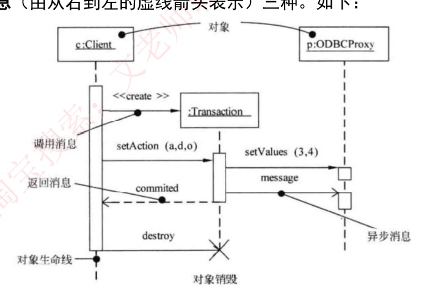
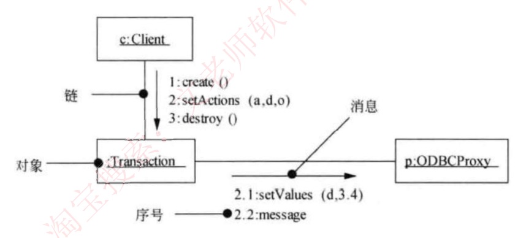

# 26 · 面向对象：UML 顺序图与通信图

## 定位

类图只画「有谁、谁认识谁」，答不出「办一件事时对象按什么次序互相调用」，这要靠动态图。贯穿例子：报销系统（报销单界面、审批服务、账务服务、银行网关），「员工提交报销单」这件事用一段话描述，有六处说不清，正好对上四节：①谁发起、谁等结果、谁发完不管 → 第一节三种消息；②对象何时在忙、何时生灭 → 第二节生命线记号；③二选一（金额超 5000 走二级审批）、④重复（一张单子 30 条明细）、⑤可有可无（附了发票才查验）→ 第三节组合片段；⑥只想看谁跟谁有连线 → 第四节通信图。第五节理清交互图这一族的名字。

## 一、顺序图与三种消息

**动态图**画过程，与画结构的静态图（类图）相对；**场景**是一次具体业务过程（如「员工提交一张 8000 元的报销单」）；对象间的调用画成横向箭头，叫**消息**。**顺序图就是序列图**（sequence diagram），教材多写「顺序图」，其他资料多写「序列图」。

| 特征 / 关键词 | 是什么 |
|---|---|
| 以时间顺序组织的对象之间的交互活动、场景的图形化表示 | 序列图（即顺序图），**动态图** |
| 横排一排对象，纵轴是时间，越靠上越早 | 顺序图 |
| 对象下面垂着的竖直虚线 | 生命线——对象在这段时间活着 |
| 对象框 `对象名:类名` 加下划线；省掉对象名写 `:AuditService` | 顺序图的对象写法；后者叫**匿名对象** |
| 实线 + **涂黑的实心三角**箭头 | **同步消息**（要等）；图注里的「调用消息」就是它 |
| 实线 + **没涂黑的线状箭头**（两根线，围不成三角） | **异步消息**（不等） |
| **虚线** + 线状箭头 | **返回消息** |
| 箭头绕个小弯回到**同一条**生命线 | **自消息**——对象调用自己的方法 |
| 某个类必须实现哪些方法 | 数**指向**它的那些消息 |

最简顺序图——两个对象、一去一回：

```
   :报销单界面              :审批服务
        ┊                      ┊
        ┊──submit(报销单)────▶┊      实线 + 涂黑实心三角 ＝ 同步（界面要等）
        ┊◀─ ─ ─ 受理结果 ─ ─ ─┊      虚线 ＝ 返回
```

| 消息 | 箭头 | 长相 |
|---|---|---|
| 同步 | `──────▶` | 实线，**涂黑的实心三角** |
| 异步 | `──────>` | 实线，箭头**只有两根线** |
| 返回 | `- - - >` | **虚线**，箭头也是线状 |

印刷扫描图上同步、异步箭头肉眼难分时，靠虚实和上下文：虚线先排除成返回；实线里「发完还等结果回来」的是同步。

**同步 vs 异步**

- 判据｜**等不等返回**。要等＝同步，发完就走＝异步；异步不是阻塞调用。
- 例子｜界面调审批服务的 `submit(报销单)`，要等受理结果才能刷新页面 → 同步；审批服务把打款指令丢进消息队列，丢完继续干自己的事 → 异步。改成「等银行回一个流水号」就翻成同步。
- 原话｜同步消息「进行阻塞调用，调用者中止执行，等待控制权返回，需要等待返回消息，用实心三角箭头表示」；异步消息「发出消息后继续执行，不引起调用者阻塞，也不等待返回消息，由空心箭头表示」。

**返回消息 vs 同步消息**

- 判据｜**先看虚实**：虚线一律是返回消息（不是带实心三角的实线），实线才去看箭头黑不黑。
- 例子｜第二节原图上 `commited` 是虚线 → 返回；`setAction (a,d,o)` 是实线加实心三角 → 同步。
- 原话｜返回消息「由从右到左的虚线箭头表示」——这是那张图的情形（调用方 `c:Client` 在左边）。规矩是**回到调用方**，调用方画在右边箭头就从左往右。**认虚线，不认方向。**

**异步的「空心箭头」vs 泛化的空心三角**

- 判据｜异步是 `>` 形两根线，围不成封闭三角；泛化（子类指向父类）是封闭的空心三角形，画在类图上，不出现在顺序图里。
- 例子｜原图那条 `message` 是异步消息；类图里「经理是一种员工」那条才是泛化。

反着读的规则：**箭头指向谁，谁所属的类就必须实现这个方法**；从它发出的消息、它回给别人的返回消息都不算，指向它的也一条不能漏——数得不多不少。

## 二、生命线上的四种记号

| 特征 / 关键词 | 是什么 |
|---|---|
| 竖直虚线 | 生命线——对象在这段时间存在 |
| 套在生命线上的**细长竖条** | **激活期**（也叫执行发生、控制焦点）——对象正在执行，上下沿是这段处理的起止，相当于调用栈上压入又弹出的一帧 |
| 箭头标 `«create»` 指向**对象框** | **创建**消息；被创建对象的框画在中间偏下，生命线**从这一刻才开始** |
| 生命线末端一个大 **✕** | **销毁**，✕ 以下没有生命线 |
| 同一个对象被调用两次 | 画两段激活期 |

**生命线 vs 激活期**

- 判据｜虚线管「活着」，竖条管「此刻正在干活」。
- 例子｜下图 `p:ODBCProxy` 一条生命线上有两根竖条（`setValues` 一根、`message` 一根）；只被调一次就只剩一根。

下面这张图比最简图多了 `«create»`、激活期竖条、异步消息、`destroy` 与 ✕，从上往下读：



1. `c:Client` 发 `«create»`（原图印作 `<<create >>`）造出 `:Transaction`——它的框就在箭头指到的高度，不在顶上
2. `c:Client` 发同步消息 `setAction (a,d,o)`，`:Transaction` 的激活期从这里开始
3. `:Transaction` 向 `p:ODBCProxy` 发同步消息 `setValues (3,4)`，再发异步消息 `message`
4. 虚线把 `commited` 回给 `c:Client`
5. `destroy` 掐断 `:Transaction` 的生命线，末端画 ✕

竖条共**四根**：`c:Client` 一根贯穿始终，`:Transaction` 一根（`setAction` 进来开始，回出 `commited` 就收），`p:ODBCProxy` 两根。`:Transaction` 被 `setAction` 和 `destroy` 各碰一次却只有一根竖条——**销毁消息不另起激活期**，只负责掐断生命线。

图注的误导：标「对象生命线」的引线落在 `c:Client` 的竖条上——它的激活期从头贯到尾盖住了生命线，引线指的其实是激活期。**真正的生命线看 `p:ODBCProxy` 两根竖条之间露出的那截虚线。**

#### 深入 · 竖条的三个名字与两套消息叫法

资料的正文和图注都没给这根竖条起名字，「激活期」是按教材补的；它也叫执行发生、控制焦点，指的都是这根竖条。消息叫法有两套：图上指着 `«create»` 箭头的引线标的是「**调用消息**」——创建消息本身也是一次同步调用，所以归进调用消息，和正文的「同步消息」是一回事；图注用「调用／返回／异步消息」，正文用「同步／异步／返回」。

## 三、组合片段 alt / loop / opt

上面的画法只能画一条道走到底，表达不了 `if`、`while`，早期 UML 只能拆成几张图。UML 2.0 的**组合片段**：图上圈一个矩形框，**左上角小五边形写操作符**（这块按什么逻辑执行），**方括号写守卫条件**（决定走不走、走哪条的判断式，如 `[金额>5000]`）。下面的文本图把五边形写成 `┌ alt ─` 框角标签，印刷图上它像折了一角的书签。

| 特征 / 关键词 | 操作符 | 等价于 |
|---|---|---|
| 「如果…否则…」「分几种情况」；框用虚线分成几块**分区**，可带 `[else]`，一次只有一块生效 | **alt** | `if / else` |
| 「重复」「逐一」「对每一个」；`loop [守卫]` 每轮开始前判一次，`loop(min, max)` 最少 min 遍、最多 max 遍 | **loop** | `while` / `for` |
| 「若…则额外做一步」「可选」；只有一块、一个守卫、无兜底，假则整块跳过 | **opt** | 无 `else` 的 `if` |

**alt**——审批分流：

```
   :审批服务                    :主管审批    :二级审批
      ┊                            ┊            ┊
  ┌ alt ────────────────────────────────────────────┐
  │ [金额 ≤ 5000]                                   │
  │   ┊──提交直属主管审批────────▶┊            ┊    │   :审批服务 → :主管审批
  ├ ─ ─ ─ ─ ─ ─ ─ ─ ─ ─ ─ ─ ─ ─ ─ ─ ─ ─ ─ ─ ─ ─ ─ ─ ┤
  │ [else]                                          │
  │   ┊──提交二级审批──────────────────────────▶┊   │   :审批服务 → :二级审批
  └─────────────────────────────────────────────────┘
```

3000 走上块，8000 走下块；5000 整不大于 5000，也走上块。写 `<` 时 5000 就掉进 `[else]`。

**loop**——逐条核对明细。`loop(min, max)` 常印成 `loop(min..max)`，如 `Loop(1..2)`＝至少 1 遍、至多 2 遍：

```
   :审批服务                        :规则引擎
      ┊                                ┊
  ┌ loop [还有未核对的费用明细] ───────────────┐
  │   ┊──校验明细(下一条)──────────────▶┊    │   框内：:审批服务 → :规则引擎
  │   ┊◀─ ─ ─ ─ ─ 校验结果 ─ ─ ─ ─ ─ ─ ─┊    │   框内：:规则引擎 回 :审批服务
  └────────────────────────────────────────────┘
      ┊──汇总审批结论──┐                              框外，只执行一次
      ┊◀───────────────┘                              （自消息：审批服务自己汇总）
```

一张单子挂 3 条明细，框内图上仍只有 **2 条**箭头（一条调用、一条返回）——**图上只画一轮，执行时按守卫条件转多轮**，实际发生 3×2 = 6 条消息。「图上几条」和「实际几条」不是一回事。

**opt**——附了发票才查验：

```
   :审批服务                        :发票查验
      ┊                                ┊
  ┌ opt [附了电子发票] ────────────────────────┐
  │   ┊──查验发票真伪───────────────────▶┊    │   框内：:审批服务 → :发票查验
  └────────────────────────────────────────────┘
      ┊──生成审批任务────────────────────▶┊        框外，一定执行：:审批服务 → :发票查验
```

没附发票时「查验发票真伪」整条跳过，「生成审批任务」在框外照做。无条件执行的消息不能圈进 opt 框，否则条件为假时会被一起跳掉。

**alt vs opt**

- 判据｜要在**几种情况里挑一种**（哪怕只有「否则」一种）→ alt，框内至少两块分区；只是「满足就多做一步，不满足什么都不做」→ opt，框内只有一块。
- 例子｜「超 5000 走二级审批、否则主管审批」是 alt；去掉「否则主管审批」、只剩「超 5000 再加一道二级审批」就成了 opt。

**求实际执行序列**：先分清哪些消息在框内、哪些在框外；框内按操作符重复或跳过，框外无论如何执行一次；再按纵向次序拼起来。

其余认名即可：**par**（各分区并行执行）、**break**（守卫成立就跳出外层片段）、**ref**（框内只写另一张交互图的名字，相当于调一个公共函数）。

## 四、通信图——把时间藏进序号

顺序图的纵轴是时间，要看**结构**（审批服务到底跟哪几个服务直接调用）就得从上到下扫一遍才数得清。通信图把同一次交互换个角度重画。

| 特征 / 关键词 | 是什么 |
|---|---|
| 「强调参加交互的对象的组织」 | **通信图**，动态图；UML 1.x 旧名**协作图** |
| 两个对象之间光秃秃的一条连线 | **链**——这俩之间有通信 |
| 消息前带 `1`、`2.1` 这种编号 | 通信图（时间信息全靠序号） |
| 带小数点的序号 | **嵌套**子消息——处理上一级消息过程中发出，处理完才轮到下一个整数 |
| 执行次序 | 按小数点分段比大小：1 → 2 → 2.1 → 2.2 → 3 |
| 某对象取某数据的是哪条消息 | 到图上找那条链，对号入座 |

通信图只有三样：**对象**（`对象名:类名`，同顺序图）、链、**消息**（贴在链旁的带箭头短线，**前面必须带序号**）。



这张图的两处排印：一是同一条链上几条消息**合画成一个箭头**挂几条标签，标准画法是每条消息各画一根短线——原话「没有固定的画法规则」说的就是这种出入，读图只认序号和链，不数箭头；二是左下那条 `2.2:message` **悬在链外**，其实是 `:Transaction`→`p:ODBCProxy` 链上的第二条消息。

它和第二节那张序列图是**同一场景的两种画法**：`c:Client`–`:Transaction` 链上挂 `1:create ()`、`2:setActions (a,d,o)`、`3:destroy ()`；`:Transaction`–`p:ODBCProxy` 链上挂 `2.1:setValues (d,3.4)`、`2.2:message`。读出的次序：create → setActions（内部先后调 setValues、message）→ destroy，与序列图从上往下一致（序列图多一条返回消息 `commited`，通信图省掉了）。再如汽车导航场景，Mapping 对象获取汽车当前位置的消息是嵌套序号 `2. 1: getCarLocation()`。

| 对比项 | 顺序图 | 通信图 |
|---|---|---|
| 关键词 | 时间、时序、次序、先后 | 组织、结构、关系、连接 |
| 图上认什么 | 对象下垂**竖直虚线**（生命线），消息**无编号** | 对象间是**光秃秃的链**，消息**必带 1、2.1 编号** |
| 擅长回答 | 这一步之后是哪一步 | 这个对象一共跟谁打交道 |

**顺序图 vs 通信图**

- 判据｜**看消息带不带编号**；顺序图强调时序，通信图强调对象的组织结构，不能互换。
- 例子｜上面两张原图是同一次交互。把通信图编号擦掉、给对象补上竖直虚线并按时间排开，就变回顺序图——**两图语义等价、可互相转换**，差的只是强调什么。
- 原话｜**通信图：是顺序图的另一种表示方法，也是由对象和消息组成的图，只不过不强调时间顺序，只强调事件之间的通信，而且也没有固定的画法规则，和顺序图统称为交互图。**

#### 深入 · 两张原图的排印出入

序列图上是 `setAction (a,d,o)`、`setValues (3,4)`，通信图上成了 `setActions`、`setValues (d,3.4)`——`3` 和 `4` 之间那一点对着序列图看应是逗号。属资料排印出入，不影响读图。

## 五、交互图这一族

| 特征 / 关键词 | 是什么 |
|---|---|
| 专画「对象之间怎么互相发消息」的一族图 | **交互图**：顺序图、通信图、**定时图**、**交互概览图** |
| 强调消息跨对象的实际时间刻度（timing diagram） | 定时图，有的资料译作「时序图」 |
| 活动图和顺序图的混合物 | 交互概览图 |
| 某一时刻的对象快照 | **对象图**——静态图，**不是交互图**，归 25 |
| 「对系统的使用方式分类」「系统对外可见的服务」 | **用例图**，不是交互图 |
| 像流程图，显示人或对象的活动一步接一步 | **活动图**，不是交互图 |

「时序图」一词两种译法：有的指定时图，有的当序列图的别名——两种读法都落在交互图里。

**顺序图 vs 状态图**

- 判据｜**顺序图展示「一个用例、多个对象」的行为**；状态图展示「单个对象跨多个用例」的行为（归 27）。两句对调就错。
- 例子｜「员工提交一张报销单」这一个用例（用户能做成的一件完整的事）里几个对象怎么配合 → 顺序图；一张报销单从草稿到已打款、跨提交/审批/打款多个用例的状态变化 → 状态图。

收口：谁调谁、谁等谁 → 生命线加三种消息；谁在忙、谁生谁灭 → 激活期、`«create»`、✕；二选一、要重复、可有可无 → alt / loop / opt；只看谁跟谁有连线 → 通信图。

## 速记

- 顺序图（＝序列图）：横排对象、竖挂生命线、纵轴是时间；对象框 `对象名:类名`；激活期是生命线上的细长竖条，被调几次画几段，销毁不另起
- 三种消息：虚线＝返回；实线＋涂黑实心三角＝同步（等）；实线＋线状箭头＝异步（不等）。调用消息＝同步消息；箭头指向谁，谁的类实现该方法
- `«create»` 指对象框、生命线从那里开始；生命线末端 ✕ 是销毁
- 组合片段：框 + 左上五边形写操作符 + 方括号写守卫。**loop 循环、alt 多选一（≥2 块，可带 `[else]`）、opt 可有可无（1 块、无 else）**；par 并行、break 跳出、ref 引用别的图
- 执行序列＝框内（按操作符重复／跳过）＋框外（各一次）；图上只画一轮；`loop(1..2)` 下界是 1，零遍不合法
- 通信图 = 协作图（UML 1.x 旧名）：对象 + 链 + 带序号的消息；序号按小数点分段排序，带点的是嵌套子消息
- 两图语义等价、可互换，差别只在强调时序还是对象的组织结构，合称交互图
- 交互图含顺序图、通信图、定时图、交互概览图；**对象图不是交互图**。顺序图管「一个用例多个对象」，状态图管「单个对象多个用例」
