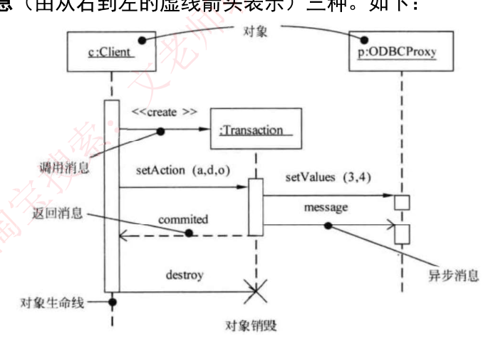
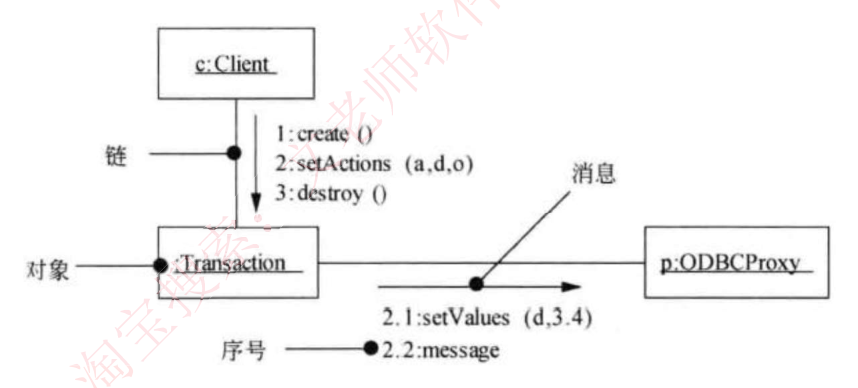

# 26 · 面向对象：UML 顺序图与通信图

> 真题：顺序图 loop 组合片段 2023上（41–42 题，答 D、C）、交互图分类 2014下、各图作用对比 2007下；序列图消息类型 2012上、序列图读图 2013下/2014上、通信图消息序号 2018上、序列图展示范围 2019上（八处的年份与科目均核到信管网软件设计师卷面，2023上 连选项、标答与配图一并核实）｜无计算｜未讲

---

## 定位

办成一件事时对象按什么次序互相调用，类图答不出来，得换动态图。第一、二节读顺序图：横排对象、纵轴是时间，三种消息加生命线上的四种记号。第三节加上组合片段 alt / loop / opt，把分支、循环、可选画进同一张图，再按框内框外算执行序列。第四节把同一次交互改画成通信图——对象 + 链 + 带序号的消息，顺带给出两图的分家判据。第五节认交互图这一族。

---

## 开讲：类图画完了，"员工提交一张报销单"到底谁先调谁

拿一个内部报销系统当例子：报销单界面、审批服务、账务服务、银行网关四个类，**类图**（画有哪些类、谁关联谁的静态图）已经画完。产品经理问一句"员工点了'提交'之后谁先干活、谁在等谁"，类图一个字答不出——它画的是"有谁、谁认识谁"，不是"这一次他们怎么配合"。

**最朴素的办法只有一个：写一段话。**"员工提交报销单，审批服务先校验金额，再逐条核对费用明细，通过就调账务服务打款，打完通知员工。"自己读没问题，交给三个程序员就出事。它在六个地方不够用，正好对上这一课的四节：

- ①谁是发起方、谁在等结果、谁发完就不管了 → 第一节，三种消息
- ②"正在忙"的那段时间没处放，对象什么时候生、什么时候灭也没处写 → 第二节，生命线上的记号
- ③**二选一**（金额超 5000 走二级审批）、④要重复（一张单子挂 30 条明细）、⑤**可有可无**（附了发票才查验）→ 第三节，组合片段
- ⑥我要看的不是先后，而是谁跟谁有连线 → 第四节，换一张通信图

第五节不在这六条里，它把这一族图的名字理一遍——卷面直接考"哪个是、哪个不是交互图"。

### 一、坑①：顺序图与三种消息

先把三个词说清。"**动态图**"是画过程的图，跟画结构的静态图（类图那种）相对；"**场景**"就是一次具体的业务过程，比如"员工提交一张 8000 元的报销单"；对象之间的调用画成横向箭头，叫**消息**。

另有一件事先交代：**顺序图就是序列图**（sequence diagram），教材多写"顺序图"，卷面和题目里多写"序列图"，同一张图的两个名字，见谁都别愣。

| 题干或图上出现 | 答 |
|---|---|
| 以时间顺序组织的对象之间的交互活动、场景的图形化表示 | 序列图（即顺序图），**动态图** |
| 横着一排对象，纵轴是时间，越靠上发生越早 | 顺序图 |
| 对象下面垂着的竖直虚线 | 生命线——这个对象在这段时间活着 |
| 对象框写 `对象名:类名` 并加下划线；省掉对象名写 `:AuditService` | 顺序图的对象写法；后者叫**匿名对象** |
| 实线 + **涂黑的实心三角**箭头 | **同步消息**（要等） |
| 实线 + **没有涂黑的线状箭头** | **异步消息**（不等） |
| **虚线** + 线状箭头 | **返回消息** |
| 图注写"调用消息" | 就是同步消息，换了个叫法 |
| 箭头绕个小弯回到**同一条**生命线 | **自消息**——对象调用自己的方法 |
| 问"某个类必须实现哪些方法" | 数**指向**它的那些消息 |

表里"涂黑的实心三角""没涂黑的线状箭头"落到图上是什么样？先看一张最简顺序图——只有两个对象、一去一回，图元只有两种：

```
   :报销单界面              :审批服务
        ┊                      ┊
        ┊──submit(报销单)────▶┊      实线 + 涂黑实心三角 ＝ 同步（界面要等）
        ┊◀─ ─ ─ 受理结果 ─ ─ ─┊      虚线 ＝ 返回
```

横排两个对象、各自垂一条生命线、纵轴从上往下是时间——这就是顺序图的全部骨架。三种箭头的长相记这三行：

| 消息 | 箭头 | 长相 |
|---|---|---|
| 同步 | `──────▶` | 实线，箭头是**涂黑的实心三角** |
| 异步 | `──────>` | 实线，箭头**只有两根线**，围不成三角 |
| 返回 | `- - - >` | **虚线**，箭头也是线状 |

真题图是印刷扫描件，同步和异步那两个箭头有时肉眼难分——**这时靠虚实和上下文**：虚线先排除成返回；实线里"发完还等着结果回来"的是同步。

**同步 vs 异步**

- 判据｜**等不等返回**。要等＝同步，发完就走＝异步。
- 例子｜界面调审批服务的 `submit(报销单)`，**要等**受理结果才能刷新页面 → 同步；审批服务把打款指令丢进消息队列，**丢完就继续干自己的事** → 异步。把"丢进队列"改成"等银行回一个流水号"，答案立刻翻成同步。
- 原话｜同步消息"进行阻塞调用，调用者中止执行，等待控制权返回，需要等待返回消息，用实心三角箭头表示"；异步消息"发出消息后继续执行，不引起调用者阻塞，也不等待返回消息，由空心箭头表示"。
- 错法｜把异步说成"阻塞调用"。

**返回消息 vs 同步消息**

- 判据｜**先看虚实**：虚线一律是返回消息，实线才去看箭头黑不黑。
- 例子｜原图上 `commited` 是虚线 → 返回；`setAction (a,d,o)` 是实线加实心三角 → 同步。
- 错法｜把返回消息说成"带实心三角箭头的实线"。
- 原话｜返回消息"由从右到左的虚线箭头表示"——这句说的是**它下面那张图里的情形**（调用方 `c:Client` 画在左边，结果自然从右往左回）。规矩是**回到调用方**，调用方画在右边，箭头就从左往右。**认虚线，不认方向。**

**异步的"空心箭头" vs 泛化的空心三角**

- 判据｜异步是普通 `>` 形的两根线状箭尾，围不成一个封闭三角；泛化（子类指向父类那种"一般/特殊"关系）是一个封闭的空心三角形，而且它画在类图上，不出现在顺序图里。
- 例子｜原图那条 `message` 是异步消息；类图里"经理是一种员工"那条才是泛化。
- 错法｜看见资料写"空心箭头"就往泛化的空心三角上认。

还有一条反着读的规则：**箭头指向谁，谁所属的类就必须实现这个方法**；从它发出去的消息、以及它回给别人的返回消息都不算。2013 下的干扰项多算（把返回消息和别的类负责的方法也塞进来），2014 上的干扰项少算（漏掉一条指向某个类的消息）——**要数得不多不少**。

### 二、坑②：生命线上的四种记号

| 图上看到 | 叫什么、什么意思 |
|---|---|
| 竖直虚线 | 生命线——对象在这段时间存在 |
| 套在生命线上的**细长的竖条** | **激活期**（也叫执行发生、控制焦点）——对象正在执行，竖条上下沿是这一段处理的起止，相当于调用栈上压进去又弹出来的一帧 |
| 箭头标 `«create»` 指向**对象框** | **创建**消息；被创建的对象框画在中间偏下，它的生命线**从这一刻才开始** |
| 生命线末端一个大 **✕** | **销毁**，✕ 以下就没有生命线了 |
| 同一个对象被调用两次 | 画两段激活期 |

**生命线 vs 激活期**

- 判据｜虚线管"活着"，竖条管"此刻正在干活"。
- 例子｜下图里 `p:ODBCProxy` 只有一条生命线，上面却有两根竖条（`setValues` 一根、`message` 一根）；把它改成只被调一次，就只剩一根竖条。
- 错法｜两者定义对调——"生命线表示对象正在执行"。

培训资料这张原图**比上面那张最简图多了四样**：`«create»`、激活期竖条、异步消息、`destroy` 与末端的 ✕。六样图元全占齐，跟着箭头从上往下读一遍：



- `c:Client` 先发 `«create»`（原图印作 `<<create >>`）造出 `:Transaction`——注意它的框不在顶上，就在箭头指到的那个高度
- `c:Client` 发同步消息 `setAction (a,d,o)`，`:Transaction` 的激活期从这里开始
- `:Transaction` 向 `p:ODBCProxy` 发同步消息 `setValues (3,4)`，再发异步消息 `message`
- 虚线把 `commited` 回给 `c:Client`
- 最后 `destroy` 把 `:Transaction` 的生命线掐断，末端画 ✕

图上的细长竖条一共**四根**：`c:Client` 一根从头贯到尾，`:Transaction` 一根（`setAction` 进来时开始，把 `commited` 回出去就收），`p:ODBCProxy` 两根。

这里要接住上面表里"被调用两次画两段"那条规则：`:Transaction` 被 `setAction` 和 `destroy` 各碰了一次，却只有一根竖条——因为**销毁消息不另起激活期**，它只负责把生命线掐断。

还要提防图注本身的一处误导：标着"对象生命线"的那根引线，落点在 `c:Client` 的竖条上。`c:Client` 的激活期从头贯到尾，把自己的生命线整段盖住了，引线看着像指生命线，指的其实是激活期。

**要看真正的生命线，看 `p:ODBCProxy` 两根竖条之间露出来的那截虚线。**这根竖条在资料里没名字，考试给它起的名字有三个，为什么，看本节末的深入，跳过不影响后面。

#### 深入 · 竖条的三个名字与两套消息叫法

**注意：资料的正文和图注都没给这根竖条起名字**，"激活期"是本讲义按教材补的；考试问到时它可能叫激活期、执行发生、控制焦点，指的都是这根竖条。消息的叫法也有两套：图上那条引线指着 `«create»` 那条箭头，标的是"**调用消息**"——创建消息本身也是一次同步调用，资料因此把它归进调用消息，和正文的"同步消息"是同一件事；图注用"调用消息／返回消息／异步消息"，正文用"同步／异步／返回"，两套名字都要认得。

### 三、坑③④⑤：组合片段

上面这套画法只能画"一条道走到底"的固定剧本。真实逻辑里有 `if`、有 `while`，早期的 UML 表达不了，只能画成好几张图。

UML 2.0 给的答案是**组合片段**：在图上**圈出一个矩形框**，**左上角一个小五边形写操作符**（说明这块按什么逻辑执行），**方括号里写守卫条件**（决定走不走、走哪条的那个判断式，比如 `[金额>5000]`）。

框里罩住的那几条消息，就按操作符说的规矩执行。下面三张图是纯文本画的，那个五边形只能写成 `┌ alt ─` 这样的框角标签；真题图上它是个小五边形，像折了一角的书签。

**alt 补坑③——多分支互斥选一，等价于 `if / else`。** 一个框用虚线横着分成几块（每一块叫一个**分区**，装着这一支要执行的消息），每块顶上一个守卫条件，最后一块可以写 `[else]` 兜底，**任何一次执行只有一块生效**。报销系统的审批分流：

```
   :审批服务                    :主管审批    :二级审批
      ┊                            ┊            ┊
  ┌ alt ────────────────────────────────────────────┐
  │ [金额 ≤ 5000]                                   │
  │   ┊──提交直属主管审批────────▶┊            ┊    │   :审批服务 → :主管审批
  ├ ─ ─ ─ ─ ─ ─ ─ ─ ─ ─ ─ ─ ─ ─ ─ ─ ─ ─ ─ ─ ─ ─ ─ ─ ┤
  │ [else]                                          │
  │   ┊──提交二级审批──────────────────────────▶┊   │   :审批服务 → :二级审批
  └─────────────────────────────────────────────────┘
```

金额 3000 走上半块，8000 走下半块，5000 整**不大于 5000**，也走上半块——边界最容易看走眼：写 `≤` 时 5000 留在上半块，写 `<` 时 5000 就掉进 `[else]` 了。

**loop 补坑④——循环，等价于 `while` 或 `for`。** 框内的消息反复执行。两种写法：`loop [守卫条件]` 每轮开始前判一次，为真就再来一遍；`loop(min, max)` 按次数限定，最少 min 遍、最多 max 遍——画图工具常把这个区间印成 `loop(min..max)`，2023 年上半年那道真题图上写的就是 `Loop(1..2)`，意思一样：至少 1 遍、至多 2 遍。报销系统逐条核对明细：

```
   :审批服务                        :规则引擎
      ┊                                ┊
  ┌ loop [还有未核对的费用明细] ───────────────┐
  │   ┊──校验明细(下一条)──────────────▶┊    │   框内：:审批服务 → :规则引擎
  │   ┊◀─ ─ ─ ─ ─ 校验结果 ─ ─ ─ ─ ─ ─ ─┊    │   框内：:规则引擎 回 :审批服务
  └────────────────────────────────────────────┘
      ┊──汇总审批结论──┐                              框外，只执行一次
      ┊◀───────────────┘                              （自消息：审批服务自己汇总）
```

**先别往下看：一张单子挂 3 条明细，上面这张图要画几条箭头？** 第一反应多半是 6 条。答案是 **2 条**——**图上只画一轮，执行时才按守卫条件转多轮**：图上永远是那 2 条箭头（一条调用、一条返回），实际发生的才是 3×2 = 6 条消息。**"图上几条"和"实际几条"不是一回事**，这正是 2023 年上半年考的那一刀。

**opt 补坑⑤——单条件可选，等价于没有 `else` 的 `if`。** 只有一块分区、一个守卫、没有兜底：条件为真执行框内，为假**整块跳过**，框外的消息照常执行。

```
   :审批服务                        :发票查验
      ┊                                ┊
  ┌ opt [附了电子发票] ────────────────────────┐
  │   ┊──查验发票真伪───────────────────▶┊    │   框内：:审批服务 → :发票查验
  └────────────────────────────────────────────┘
      ┊──生成审批任务────────────────────▶┊        框外，一定执行：:审批服务 → :发票查验
```

没附发票时，"查验发票真伪"整条跳过，但"生成审批任务"在框外，照做不误。**这里有个固定的设错点：把本该无条件执行的消息误圈进 opt 框，条件一假就被一起跳掉了。**

**alt 和 opt 一句话分家**：要在**几种情况里挑一种**（哪怕只有"否则"那一种）→ alt，框内至少两块分区；只关心"**满足条件就多做一步，不满足什么都不做**" → opt，框内只有一块。

题干里的信号词直接对应操作符：出现"如果…否则…""分几种情况" → **alt**；"重复""逐一""对每一个" → **loop**；"若…则额外做一步""可选" → **opt**。

> 考试这样问：给一张带组合片段的图，让你写出实际执行的消息序列。先分清哪些消息在框内、哪些在框外，框内按操作符重复或跳过，框外无论如何执行一次，再按纵向次序拼起来。

标准里还有 **par**（框内几块分区**并行**执行）、**break**（守卫成立就跳出外层片段），以及 **ref**（框内不画消息，只写另一张交互图的名字，相当于调一个公共函数）。历年软设上午题里没见过直接考它们的，**认得符号即可，不必展开**。

### 四、坑⑥：通信图——把时间藏进序号

前面三节的坐标都是"纵轴＝时间"。可有时候你要看的是**结构**——排查"审批服务到底跟哪几个服务有直接调用"，这信息在顺序图上被时间轴打散了，得从上到下扫一遍才数得清。补丁是把同一次交互**换个角度重画**。

| 题干或图上出现 | 答 |
|---|---|
| "强调参加交互的对象的组织" | **通信图**，动态图；UML 1.x 里的旧名叫**协作图**，两个名字考题都用 |
| 两个对象之间光秃秃的一条连线 | **链**——表示这俩之间有通信 |
| 消息前面带 `1`、`2.1` 这种编号 | 通信图（时间信息全靠序号带） |
| 带小数点的序号 | **嵌套**子消息——在处理上一级消息的过程中发出，处理完才轮到下一个整数 |
| 让你排执行次序 | 按小数点分段比大小：1 → 2 → 2.1 → 2.2 → 3 |
| "某某对象取某某数据的消息是哪条" | 到图上找那条链，对号入座 |

通信图只有三样东西：**对象**（方框，写法和顺序图一样是 `对象名:类名`）、链、**消息**（贴在链旁边的带箭头短线，**前面必须带序号**）。



读这张图前先记两件排印上的事，免得对不上正文。

一是资料把同一条链上的几条消息**合画成了一个箭头**、旁边挂几条标签；标准画法是每条消息在链的上／下方各画一根带箭头的短线。原话里"没有固定的画法规则"说的就是这种出入——做题只认序号和链，不数箭头画了几根。

二是图左下那条 `2.2:message` **悬在链外面**，它其实是 `:Transaction`→`p:ODBCProxy` 链上的第二条消息，排印时挪出去了。

这张图和上一节那张序列图是**同一个场景的两种画法**。`c:Client` 到 `:Transaction` 那条链上挂着 `1:create ()`、`2:setActions (a,d,o)`、`3:destroy ()`；`:Transaction` 到 `p:ODBCProxy` 那条链上挂着 `2.1:setValues (d,3.4)`、`2.2:message`。

读出来的次序是：先 create，再 setActions，setActions 内部先后调了 setValues 和 message，最后 destroy——**和序列图上从上往下的读法完全一致**（序列图多一条返回消息 `commited`，通信图里省掉了）。

2018 年上半年那道汽车导航题就这么考：图上四个候选序号，选"Mapping 对象获取汽车当前位置"的那条，答案是嵌套序号 `2. 1: getCarLocation()`。

**顺序图 vs 通信图**

- 判据｜**看消息带不带编号**：消息前面有 `1`、`2.1` 这种编号＝通信图；对象下面垂着竖直虚线、消息不带编号＝顺序图。

| 对比项 | 顺序图 | 通信图 |
|---|---|---|
| 题干的措辞 | 时间、时序、次序、先后 | 组织、结构、关系、连接 |
| 图上认什么 | 对象下面垂着**竖直虚线**（生命线），消息**没有编号** | 对象之间是**光秃秃的链**，消息**必须带 1、2.1 这种编号** |
| 它答得好的问题 | 这一步之后是哪一步 | 这个对象一共跟谁打交道 |

- 例子｜上面两张原图就是同一次交互的两种画法。把通信图的编号擦掉、给每个对象补上竖直虚线并按时间排开，它就变回顺序图——**两张图语义等价，可以互相转换**，差的只是强调什么。
- 错法｜"顺序图强调对象的组织结构、通信图强调时序"，两句互换就是错项。
- 原话｜**通信图：是顺序图的另一种表示方法，也是由对象和消息组成的图，只不过不强调时间顺序，只强调事件之间的通信，而且也没有固定的画法规则，和顺序图统称为交互图。**

两张原图的印刷对不齐，为什么不影响做题，看本节末的深入，跳过不影响后面。

#### 深入 · 两张原图的排印出入

序列图上是 `setAction (a,d,o)`、`setValues (3,4)`，通信图上却成了 `setActions`、`setValues (d,3.4)`——`3` 和 `4` 之间那一点，对着序列图看应该是逗号。这是资料的排印出入，不影响读图，考试也不考名字拼写。

### 五、认名即可：交互图这一族

- **交互图**是家族名——专门画"对象之间怎么互相发消息"的那一族图。成员：顺序图、通信图、**定时图**（强调消息跨对象的实际时间刻度。它的英文是 timing diagram，有的资料译作"时序图"；而另一些资料又拿"时序图"当序列图的别名——两种译法都落在交互图里，所以卷面出现"时序图"三个字时，不管按哪种读，它都不是"不是交互图"的那个答案）、**交互概览图**（活动图和顺序图的混合物）。后两个在软设真题里只当干扰项，记住名字即可。
- **对象图**不是交互图——它画的是某一时刻的一张对象快照，属于静态图，归 25。2014 年下半年直接考过"哪个不是交互图"，答案就是它。
- 还有两张常来当干扰项的图，认名字就够：题干说"**对系统的使用方式分类**""系统对外可见的服务" → **用例图**；说"像流程图那样，显示人或对象的活动、一步接一步" → **活动图**。两张都画行为，但都不算交互图。
- 分工一句话记死：**顺序图展示的是"一个用例、多个对象"的行为**（**用例**＝用户能做成的一件完整的事，比如"员工提交一张报销单"，这一件事里几个对象怎么配合就是顺序图画的）；状态图展示的是"单个对象跨多个用例"的行为，归 27。两句正好对调着设错，2019 年上半年直接考了前一句。

收口：**六条短板对四类补丁**。谁调谁、谁等谁 → 生命线加三种消息；谁在忙、谁生谁灭 → 激活期加 `«create»` 加 ✕；二选一、要重复、可有可无 → alt / loop / opt；只想看谁跟谁有连线 → 换通信图。选图题就是从题干里读出它问的是这四类里的哪一类。

## 速记

- 顺序图：横排对象、竖挂生命线、纵轴是时间；对象框写 `对象名:类名`，激活期是套在生命线上的细长竖条，被调几次就画几段
- 三种消息：虚线＝返回；实线＋涂黑实心三角＝同步（等）；实线＋没涂黑的线状箭头＝异步（不等）。图注另一套名字：调用消息＝同步消息
- `«create»` 指对象框、生命线从那里开始；生命线末端画 ✕ 是销毁
- 组合片段：框 + 左上角五边形写操作符 + 方括号写守卫。**loop 循环、alt 二选一（≥2 块分区，可带 `[else]`）、opt 可有可无（1 块、无 else）**；par 并行、break 跳出、ref 引用别的图，认得即可
- 执行序列＝框内（按操作符重复／跳过）＋框外（各一次）；`loop(1..2)` 下界是 1，零遍不合法
- 通信图 = 协作图（UML 1.x 旧名）：对象 + 链 + 带序号的消息；序号按小数点分段排序，带点的是嵌套子消息
- 两图语义等价、可互换，差别只在强调时序还是强调对象的组织结构，合称交互图
- 交互图含顺序图、通信图、定时图、交互概览图；**对象图不是交互图**。顺序图管"一个用例多个对象"，状态图管"单个对象多个用例"
