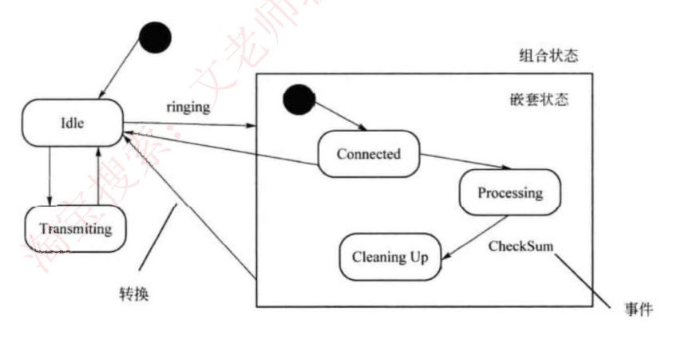
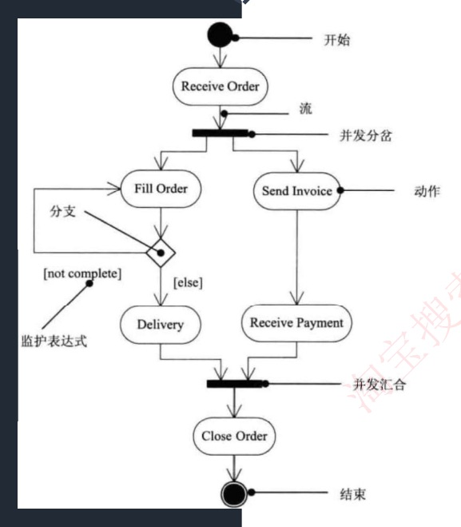

# 27 · 面向对象：状态图与活动图

## 定位

UML 的两张动态图。状态图盯住一个对象：一张报销单在草稿、待审批、已驳回、已打款之间按什么事件跳，图上画了的跳法才允许。活动图盯住一条流程：报销从填单到打款分几步、哪两步能同时做、谁负责哪一段。第一节认全状态图元素和转换标注，第二节分开活动图的菱形和粗线并数一遍执行序列，第三节给三条判据判一段描述该画哪张图。

## 一、状态图：一个对象的一辈子

| 特征 / 关键词 | 是什么 |
|---|---|
| 展现了一个状态机／描述**单个对象在多个用例中的行为** | 状态图（定义原句。状态机＝有哪些状态 + 什么事件让它从这个状态跳到那个，代码里的 `switch(status)` 就是它） |
| 对象的生命周期中某个条件或者状态 | 状态（指向状态图） |
| 通常对什么建模 | **反应型对象**：行为完全由外部事件驱动、平时静静等着（没人点提交，报销单就一直躺在草稿） |
| 方框 | **状态**，对象在某一段时间里稳定的样子；里面不再套状态的叫**简单状态** |
| 带箭头的实线 | **转换**，也叫迁移 |
| 箭头上的名字 | 触发**事件**（提交、审批驳回） |
| 实心圆点 | **初态**，同一层只有一个（组合状态内部可以再有自己的初态） |
| 圆环套实心圆点 | **终态**，可以有多个、也可以没有 |
| 方括号 `[…]` 里的布尔判断 | **监护条件**，也译守卫条件、警戒条件 |
| 斜杠 `/` 后面那句 | **动作**，转换发生的那一瞬间执行 |
| `entry/`、`do/`、`exit/` | 状态的三种**内部活动**：进入时一次、期间持续、离开时一次 |
| `after(3 天)`、`when(超时)` | **时间事件**（`when` 在严格 UML 里另有说法，本课口径按时间事件归类） |
| 里面还套着状态的大框 | **组合状态**，框里被套住的叫**嵌套状态** |
| 起点和终点是同一个状态的转换 | **自转换** |
| 转换标注 | `事件 [监护条件] / 动作`，三段都可以省略 |

几条定性结论：
- 监护条件只放行、不触发：事件没发生，条件成立也不迁移。
- 转换连接**两个**状态，源与目标一个都不能少；转换和状态是两个独立的概念。"转换包含……和一个状态"是错的。
- 事件触发一个没有监护条件的迁移时，对象**离开当前状态**，`do/` 随之终止（正确说法）。
- **动作可以在状态内执行，也可以在状态转换时执行**（正确说法）。
- 状态图是一张**白名单**：画了的跳法才允许，没画的一律禁止。组合状态的出边画在大框上，就代表框里任何一个嵌套状态都能走这条边。

原话｜**图中方框代表状态，箭头上的代表触发事件，实心圆点为起点和终点**；状态**包括简单状态和组合状态**。

下图标出转换、事件、组合状态、嵌套状态四处；左边 `Idle`、`Transmiting` 两个框图上没标名目，它们是**简单状态**（本讲义补注）。`Transmiting` 是原图把 Transmitting 少印一个 t，照录不改：



转换标注逐段加上去：

```
草稿 ──提交──► 待一级审批                          只有事件
草稿 ──提交 [金额≤5000]──► 待一级审批              加闸门：条件不满足就不走
草稿 ──提交 [金额≤5000] / 冻结额度──► 待一级审批   跳的同时干一件事
```

事件负责触发，条件负责放行，动作跟着发生。

**易混对 1：事件 ↔ 监护条件**

判据｜**先有事件，再查条件**。事件没发生，条件为真也不动；事件发生了而条件为假，同样不动。"金额大于 5000，即使没人点审批通过也会自动转到待二级审批"是错的。

例子｜`提交 [金额≤5000] / 冻结额度` 这条边，把金额改成 6000 就不走了，改走同一状态的另一条出边；同一个状态、同一个事件，全靠方括号分家。

原话｜"转换可以通过**事件触发器触发**，事件触发后相应的**监护条件**会进行检查。"

**易混对 2：状态内的动作（entry/do/exit） ↔ 转换上的动作**

判据｜写在方框里的，按"进入／期间／离开"自己触发；写在箭头上的，只在这条转换发生的那一瞬间执行一次。

例子｜"待一级审批"挂三天：`entry/ 发通知邮件` 进来时发一封，`do/ 每天发提醒` 三天天天发，`exit/ 取消提醒任务` 走时收尾；箭头上的 `审批通过 / 记审批日志` 只在跳走那一下记一次。把"每天发提醒"挪到箭头上就错了——箭头上没有"期间"。

状态框横着分两格：

```
┌─────────────────────────┐
│ 待一级审批              │   ← 上格：状态名
├─────────────────────────┤
│ entry / 发通知邮件      │   ← 下格：三种内部活动，按 entry→do→exit 顺序写，都可省略
│ do    / 每天发提醒      │
│ exit  / 取消提醒任务    │
└─────────────────────────┘
```

**易混对 3：转换 ↔ 状态**

判据｜转换是连接两个状态的那条边，不是状态的一部分；被事件触发的是**转换**，不是状态（"状态由事件触发"主谓对调了）。

例子｜"待一级审批 —审批通过／记审批日志→ 已通过"，把目标状态"已通过"去掉，这条转换就画不出来。

原话｜**"状态图中转换和状态是两个独立的概念。"**

**易混对 4：能否到达 ↔ 能否直接迁移**

判据｜"到达"看有没有一条**路径**；"直接迁移"看有没有**那一条边**。

例子｜图上没有"已驳回"指向"已打款"的箭头，但"已驳回 —修改后重交→ 待一级审批 → 已通过 → 已打款"走得通：能到达，不能直接迁移。去掉"修改后重交"那条边，两者都不能。

#### 推演 · 报销单状态机画全

按"源状态 ──事件 / 动作──► 目标状态"一条一行列出（纸上每个状态是方框、每条转换是箭头）：

```
  ● ──新建──► 草稿

  草稿         ──提交 / 冻结额度──────────────────────► 待一级审批
  待一级审批   ──审批通过 [金额≤5000] / 记审批日志──► 已通过
  待一级审批   ──审批通过 [金额>5000] / 记审批日志──► 待二级审批
  待二级审批   ──审批通过 / 记审批日志────────────────► 已通过
  待一级审批   ──审批驳回 / 释放额度──────────────────► 已驳回
  已驳回       ──修改后重交───────────────────────────► 待一级审批
  已通过       ──打款成功 / 发到账短信────────────────► 已打款

  已打款 ──► ◉
```

"待一级审批"下同一个"审批通过"事件有两条出边，靠监护条件分开。"待二级审批"自己也要有出边进"已通过"。合计**六个状态、七条转换**（两条带监护条件），外加初态进、终态出。"已打款"通向终态，是正常终点；**既没有出边、又不通终态的状态**才是画错了——进去出不来。

两个待审批状态都要支持"员工撤回"回草稿，圈成组合状态"审批中"，出边只画在大框上：

```
┌─ 审批中（组合状态）──────────────────┐
│   ● ──► 待一级审批 ──► 待二级审批     │   ← 框里这两个叫嵌套状态
└──────────────────────────────────────┘
      │ 撤回 / 释放额度    ← 出边画在大框上，顶原来的两条
      ▼
    草稿
```

框里有自己的初态 `●`——"一张图只有一个初态"说的是同一层。

#### 深入 · 来源说明

三段式格式 `事件 [监护条件] / 动作` 和 `entry/`、`do/`、`exit/` 按《软件设计师教程》第 5 版补。结构化分析里的状态转换图（STD）是 UML 状态图的前身。

## 二、活动图：一条流程怎么走

### （概念）元素与易混对

| 特征 / 关键词 | 是什么 |
|---|---|
| **在系统内从一个活动到另一个活动的流程** | 活动图（定义原句；是一种**特殊的状态图**——上一步做完自动进下一步，不需要事件触发） |
| 圆角矩形，名字是动词短语（校验金额） | **活动**，也叫动作 |
| 连接活动的带箭头实线 | **流**（控制流） |
| 菱形，多条出边各带 `[条件]`、只走一条 | **分支**；方括号里叫**监护表达式**（即监护条件） |
| 菱形，多条进、一条出 | **合并**，哪条来了都直接过 |
| 粗线段（水平或垂直），一条进、多条出 | **分岔**，出去的几条并发、每条都走（这条粗线教材叫**同步线**，培训资料也叫"合并分叉"） |
| 粗线段，多条进、一条出 | **汇合**，等全部分支到齐才放行 |
| 可同时运行的线程数 | 这个分岔下面挂的分支数 |
| 能并行的活动 | 同一条分岔粗线下的分支上的活动 |
| 竖线分栏，每栏一个角色或部门 | **泳道**（swimlane） |
| 虚线箭头把活动和对象连起来 | **对象流** |

起止画法同状态图：实心圆点起，圆环套实心圆点止。



**易混对 1：分支（菱形 ◇） ↔ 分岔（同步线 ▬）**

| | 分支（菱形 ◇） | 分岔（同步线 ▬） |
|---|---|---|
| 走几条 | 互斥，**只走一条** | 并发，**每条都走** |
| 出边写什么 | 各带监护表达式 `[条件]` | 不带条件 |
| 收口 | **合并**（菱形）：来了就过 | **汇合**（同步线）：**等全部到齐** |
| 代码里 | `if / else` | 多个线程同时跑 |

判据｜出边带 `[条件]`、只走一条是分支；不带条件、每条都走是分岔。分支配合并，分岔配汇合，不交叉。

例子｜`[金额≤5000]` 走一级审批、`[金额>5000]` 走二级，是分支；"打印凭证"和"登记台账"互不依赖，挂在同一条粗线下，是分岔。把台账改成"凭证打完才能登"，粗线就得拆成一条直线。

原话｜**"活动的分岔和汇合线是一条水平粗线"**、**"每个分岔的分支代表了可同时运行的线程数"**、**"活动图中能够并行执行的是在一个分岔粗线下的分支上的活动"**。教材：**分岔是一个进入转换、两个或多个离开转换**，**汇合是两个或多个进入转换、一个离开转换**。

**易混对 2：活动图 ↔ 程序流程图**

判据｜**活动图能表达并发**（同步线），流程图不能；有菱形分支不能说明是流程图。

例子｜"打印凭证与登记台账可同时做"只有活动图画得出来，流程图只能排成先后。

原话｜教材口径：活动图属面向对象的行为建模，流程图是面向过程的处理过程描述。

**泳道**：每个活动节点、每个分支必须只属于一个泳道；流、分岔与汇合可以跨泳道（流本来就表示活儿从一个人交到另一个人手上）。

其余认名即可：**对象流**——虚线箭头把活动和它产出／消费的对象连起来。

### （计算）数执行序列

解决什么：给一张活动图，列出所有可能的执行序列。

```
                    ┌──────────────► A2 ───────────────────┐
  ● ──► A1 ──► ◇ ───┤                                      ├──► ◉
                    └──► A3 ──►▮──┬──► A4 ──┬──►▮──────────┘
                                  └──► A5 ──┘
                             分岔（同步线）  汇合（同步线）
```

1. 读图：开始 → A1 → 菱形；上支 A2 直接到结束；下支 A3 → 同步线分岔出 A4、A5 → 汇合 → 结束。
2. 菱形互斥，只选一支。上支：`A2`，一条。
3. 下支先走 A3，粗线下 A4、A5 都要走、先后不限：`A3→A4→A5`、`A3→A5→A4`，两条。
4. A1 之后共**三条**序列；按走过的活动归类只剩**两类**："**A2 或 A3、A4 和 A5**"——"或"前后就是两条互斥分支。

规则：① 圈出所有菱形，每个只走一条；② 圈出所有同步线，粗线下每条都走；③ 按"分支选一、分岔全走"拼集合。

#### 推演 · 报销流程画成带泳道的活动图

一列一条泳道，从上往下读是时间顺序：

| 员工 | 系统 | 主管 | 财务 |
|---|---|---|---|
| ● 开始 | | | |
| 填写报销单 | | | |
| ──流──► | 校验金额 | | |
| | ──流──► | ◇ 分支：`[≤5000]` ／ `[>5000]` | |
| | | 一级审批 ／ 二级审批 | |
| | | ◇ 合并 | |
| | | ──流──► | ▬ 分岔（同步线） |
| | | | 打印凭证 ＋ 登记台账（并发，两件都做） |
| | | | ▬ 汇合（等两件都完） |
| | | | 打款 |
| | | | ◉ 结束 |

三处跨栏（员工 → 系统、系统 → 主管、主管 → 财务）跨的都是**流**。假如"登记台账"改由主管负责，分岔粗线就横跨主管与财务两栏，规则照样成立；活动节点和分支必须待在某一栏里。

#### 深入 · 来源说明

泳道和对象流按《软件设计师教程》第 5 版补。

## 三、给一段描述，选状态图还是活动图

| 特征 / 关键词 | 属于哪张图 |
|---|---|
| 生命周期、状态变迁、事件触发 | 状态图 |
| 流程、工作流、并发、可同时进行、谁负责 | 活动图 |
| 系统在它的周边环境的语境中所提供的外部可见服务 | 用例图 |
| 某一时刻一组对象以及它们之间的关系；对象快照 | 对象图 |
| 系统内从一个活动到另一个活动的流程 | 活动图 |
| 对象的生命周期中某个条件或者状态 | 状态（指向状态图） |
| 系统的词汇 | 类图 |

关键词不够用时，三条判据：

1. **方框里写的是什么。** 前面加"正处于"读得通（正处于**待审批**）→ 状态图；加"正在"读得通（正在**校验金额**）→ 活动图。
2. **主语换不换人。** 状态图全图只有**一个对象**（"描述**单个对象**在多个用例中的行为"）；活动图主语一路在换（员工 → 主管 → 财务），所以才需要泳道。
3. **有没有并发。** "可同时进行""并行""几步互不依赖"→ 活动图；分岔／汇合挂在活动图名下。（UML 状态图理论上也有并发子状态，本课不涉及。）

例子｜"报销单提交后进入待审批；主管驳回则变为已驳回，员工改完可以重新提交；审批通过后打款。"——加"正处于"通、主语只有这张单子 → **状态图**。

例子｜"员工填单后系统校验金额，5000 元以内走一级审批、超过走二级；审批完财务打印凭证并登记台账（两件事可同时做），最后打款。"——加"正在"通、主语换了三次、有并发 → **活动图**。

## 速记

- 状态图管**一个对象**，对**反应型对象**建模：方框=状态、箭头=转换、实心圆=初态、圆环套实心圆=终态；标注 **`事件 [监护条件] / 动作`**，条件自己不触发转换
- 状态框内 **entry/ 进入、do/ 期间、exit/ 离开**；状态分**简单**与**组合**，组合里的叫嵌套状态，出边画在大框上顶里面每一个
- 转换与状态是**两个独立的概念**：转换连两个状态；被事件触发的是转换不是状态
- 活动图管**一个流程**，"系统内从一个活动到另一个活动的流程"，是**特殊的状态图**
- **菱形分支互斥选一（配合并），粗线分岔并发全走（配汇合）**；同一分岔下的分支上的活动才能并行，分支数=线程数
- **泳道**：活动节点与分支只属一个泳道，流与分岔汇合可跨
- 选图：加"正处于"通/主语一个=状态图；加"正在"通/一路换人/有并发=活动图
- 定义反认：外部可见服务→用例图，某一时刻一组对象及关系→对象图，系统的词汇→类图
