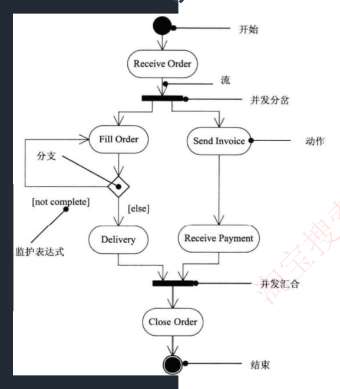

# 27 · 面向对象：状态图与活动图

> 真题：活动图定义与执行序列 **2022下·41/42**（答 C、D，逐字收录）；状态图 **2021上·41–43** 原为三空，卷面文字残缺，降级为考点重现、题库只收其中两空；培训资料另收一道状态图叙述题，年份待核实｜无计算｜未讲

---

## 定位

这一课讲 UML 的两张动态图。状态图盯住一个对象：一张报销单在草稿、待审批、已驳回、已打款之间按什么事件跳，图上画了的跳法才允许。活动图盯住一条流程：报销从填单到打款分几步、哪两步能同时做、谁负责哪一段。第一节把状态图的元素和转换标注认全，第二节把活动图的菱形和粗线分开，第三节给三条判据，当场判出一段业务描述该画哪张图。

---

## 开讲：这一课要分清四组东西

状态图里的**事件**（箭头上那个名字）、**监护条件**（方括号里那句判断）、**动作**（斜杠后面那句）各管什么；状态框里的 **entry/do/exit**（写在框内的三种内部活动）和箭头上的动作差在哪；活动图里**菱形（分支）和粗线（分岔）**哪个互斥、哪个并发；最后是给一段业务描述，该选**状态图还是活动图**。四组都是上午题反复设错的地方，下面按这个顺序过。

### 一、状态图：一个对象的一辈子

题干给哪个词，就查哪一行：

| 题干里出现 | 答 |
|---|---|
| 展现了一个状态机／描述**单个对象在多个用例中的行为** | 状态图（这是它的定义原句。状态机＝有哪些状态 + 什么事件让它从这个状态跳到那个，代码里的 `switch(status)` 就是它） |
| 对象的生命周期中某个条件或者状态 | 状态（这句指向状态图） |
| 对系统、类或用例的动态方面建模，通常是对什么建模 | **反应型对象**：行为完全由外部事件驱动、平时静静等着的对象（没人点提交，报销单就一直躺在草稿） |
| 方框 | **状态**，对象在某一段时间里稳定的样子（处于待一级审批）；里面不再套状态的叫**简单状态** |
| 带箭头的实线 | **转换**，也叫迁移 |
| 箭头上的名字 | 触发**事件**，让这条转换真的发生的那件事（提交、审批驳回） |
| 实心圆点 | **初态**，同一层只有一个（组合状态内部可以再有自己的初态） |
| 圆环套实心圆点 | **终态**，可以有多个、也可以没有 |
| 方括号 `[…]` 里那句布尔判断 | **监护条件**，有的资料译作守卫条件、警戒条件 |
| 斜杠 `/` 后面那句 | **动作**，转换发生的那一瞬间执行 |
| `entry/`、`do/`、`exit/` | 状态的三种**内部活动**：进入时一次、期间持续、离开时一次 |
| `after(3 天)`、`when(超时)` | **时间事件**（`when` 在严格 UML 里另有说法，考试一律按时间事件答） |
| 里面还套着状态的大框 | **组合状态**，框里被套住的叫**嵌套状态** |
| 起点和终点是同一个状态的那条转换 | **自转换** |
| 转换标注怎么写 | `事件 [监护条件] / 动作`，三段都可以省略 |
| "即使事件没发生，条件成立也会迁移" | **错**。监护条件只放行、不触发，必须先有事件 |
| "转换（迁移）可以包含……和一个状态" | **错**。转换连接**两个**状态，源与目标一个都不能少；转换和状态是两个独立的概念 |
| "事件触发一个没有监护条件的迁移" | 对象**离开当前状态**，`do/` 随之终止（这句是**对的**，别误伤） |
| 题干出现"**直接**迁移"／出现"**到达**" | "直接"看有没有那一条边；"到达"看有没有一条路径 |

转录本 2-10 的认图口诀原话：**图中方框代表状态，箭头上的代表触发事件，实心圆点为起点和终点**；状态**包括简单状态和组合状态**。

两句话记住它的脾气：状态图是一张**白名单**，画了的跳法才允许，没画的一律禁止；组合状态的出边画在大框上，就代表框里任何一个嵌套状态都能走这条边，不必给每个嵌套状态各画一条。

转录本 2-10 的配图把这几个词标在同一张图上，认图照这张认。**图上真正标了字的只有四处**：转换、事件、组合状态、嵌套状态；左边 `Idle`、`Transmiting` 那两个框图上没标名目，它们是**简单状态**（这是本讲义补的注，别在图上找这四个字）。另外 `Transmiting` 是原图把 Transmitting 少印了一个 t，照录不改：


先把箭头上那行字的格式认全，再看它们怎么互相区分。教材的转换标注格式是 **`事件 [监护条件] / 动作`**，三段都可以省略——最简单的一条转换只写事件：

```
草稿 ──提交──► 待一级审批
```

加上方括号，这条边就带了闸门（条件不满足就不走）：

```
草稿 ──提交 [金额≤5000]──► 待一级审批
```

再加斜杠，跳这一下的同时还要干一件事：

```
草稿 ──提交 [金额≤5000] / 冻结额度──► 待一级审批
```

三段各归各管：事件负责触发，条件负责放行，动作跟着发生。

**易混对 1：事件 ↔ 监护条件**

判据｜事件是发动机，条件只是闸门——**先有事件，再查条件**。事件没发生，条件为真也不动；事件发生了而条件为假，同样不动。

例子｜还是 `提交 [金额≤5000] / 冻结额度` 这条边。把金额改成 6000，它就不走了，改走同一个状态的另一条出边；同一个状态、同一个事件，全靠方括号分家。

错法｜"只要金额大于 5000，即使没人点审批通过，也会自动转到待二级审批"——上午题最爱设的就是这个错项。

原话｜转录本 2-10："转换可以通过**事件触发器触发**，事件触发后相应的**监护条件**会进行检查。"

**易混对 2：状态内的动作（entry/do/exit） ↔ 转换上的动作**

判据｜写在方框里的，按"进入／期间／离开"自己触发；写在箭头上的，只在这条转换发生的那一瞬间执行一次。事件一旦触发转换（且没有监护条件挡着），对象就离开当前状态，`do/` 随之终止。

例子｜"待一级审批"可能挂三天：`entry/ 发通知邮件` 只在进来时发一封，`do/ 每天发提醒` 三天里天天发，`exit/ 取消提醒任务` 走的时候收尾；箭头上的 `审批通过 / 记审批日志` 只在跳走那一下记一次。把"每天发提醒"挪到箭头上就错了——箭头上没有"期间"。

错法｜这一条卷面是反着考的："**动作可以在状态内执行，也可以在状态转换时执行**"是**正确**说法，别当错项误伤。

状态框的画法是横着分成两格：

```
┌─────────────────────────┐
│ 待一级审批              │   ← 上格：状态名
├─────────────────────────┤
│ entry / 发通知邮件      │   ← 下格：三种内部活动，一格里按 entry→do→exit 顺序写，都可省略
│ do    / 每天发提醒      │
│ exit  / 取消提醒任务    │
└─────────────────────────┘
```

**易混对 3：转换 ↔ 状态**

判据｜转换是连接**两个**状态的那条边，源状态和目标状态一个都不能少；它不是状态的一部分。

例子｜"待一级审批 —审批通过／记审批日志→ 已通过"这条边，两头都在；把目标状态"已通过"去掉，这条转换就画不出来了。

原话｜转录本 2-10：**"状态图中转换和状态是两个独立的概念。"**

错法｜"一个转换可以包含事件触发器、监护条件和一个状态"——错在"一个"，只挂一头的转换根本画不出来；"状态由事件触发"——主谓对调了，被事件触发的是**转换**，不是状态。

**易混对 4：能否到达 ↔ 能否直接迁移**

判据｜问"能否**到达**"，看有没有一条**路径**；问"能否**直接迁移**"，看有没有**那一条边**。题干里"直接"两个字是唯一的开关。

例子｜图上没有从"已驳回"指向"已打款"的箭头，但"已驳回 —修改后重交→ 待一级审批 → 已通过 → 已打款"走得通：到达答**能**，直接迁移答**不能**。把"修改后重交"那条边去掉，两问就都答"不能"。

错法｜按业务常识觉得"驳回的单子最后总能打款"，就认定图上有那条边。

想看这些元素落在一张完整的图上是什么样，看本节末的推演；跳过不影响后面。

#### 推演 · 报销单状态机画全是什么样

主干先画五个状态、五条转换，外加一条从初态进来、一条通向终态。**状态图的实质是一张转换白名单**，所以这里按"源状态 ──事件 / 动作──► 目标状态"一条一行地列出来，比画框更容易数清楚（真正落到纸上时，每个状态是一个方框、每条转换是一支箭头）：

```
  ● ──新建──► 草稿

  草稿         ──提交 / 冻结额度───────────► 待一级审批
  待一级审批   ──审批通过 / 记审批日志─────► 已通过
  待一级审批   ──审批驳回 / 释放额度───────► 已驳回
  已驳回       ──修改后重交───────────────► 待一级审批
  已通过       ──打款成功 / 发到账短信─────► 已打款

  已打款 ──► ◉
```

（图上还少了"待二级审批"。）"审批通过"这个事件在"待一级审批"下发生，金额 5000 元以内直接到"已通过"，超过 5000 元还得转"待二级审批"——同一个状态、同一个事件两条出边，靠监护条件分开：

```
  待一级审批   ──审批通过 [金额≤5000] / 记审批日志──► 已通过
  待一级审批   ──审批通过 [金额>5000] / 记审批日志──► 待二级审批
  待二级审批   ──审批通过 / 记审批日志────────────► 已通过
```

上面两行就是"同一个状态、同一个事件、两条出边"：事件名一模一样，全靠方括号里那句把它们分开。

最后那一步别漏：**"待二级审批"必须自己也有一条出边**，二审通过后同样进"已通过"（这条边和上面同名，只是不必再判金额）。补上这两支，整台状态机就是**六个状态、七条转换**（其中两条带监护条件），外加一条从初态进来、一条通向终态。

这时除"已打款"之外每个状态都有通向下一个状态的出边，而"已打款"的出边通向**终态**——它是流程的正常终点，不是漏画。**既没有出边、又不通终态的状态，才是画状态图最常见的低级错**：那等于告诉读代码的人"进去出不来"。

"待一级审批"和"待二级审批"都要支持"员工撤回"、撤回后都回"草稿"。与其画两条一模一样的箭头（将来加个"待复核"就是三条），不如圈成一个组合状态"审批中"，出边只画在大框上：

```
┌─ 审批中（组合状态）──────────────────┐
│                                      │
│   ● ──► 待一级审批 ──► 待二级审批     │   ← 框里这两个叫嵌套状态
│                                      │
└──────────────────────────────────────┘
      │ 撤回 / 释放额度    ← 出边画在大框上，顶原来的两条
      ▼
    草稿
```

注意框里还有一个自己的初态 `●`——**"一张图只有一个初态"说的是同一层**，组合状态内部可以再有一个。

#### 深入 · 三段式与 entry/do/exit 是按教材补的

转换标注的三段式格式 `事件 [监护条件] / 动作`，转录本没写出格式，只点了"事件触发器""监护条件"两个名词，格式按《软件设计师教程》第 5 版补；**转录本正文和它的配图都没有这三个词** `entry/`、`do/`、`exit/`，同样按教材第 5 版补。

转录本 2-10 的配图把 Transmitting 印成 `Transmiting`，本讲义照录不改。

再提一句来历：结构化分析里的状态转换图（STD）是 UML 状态图的前身，考试只考 UML 这一张。

### 二、活动图：一条流程怎么走

状态图上每个方框写的是单子**处于**什么状态，不是人**在做**什么。要回答"这件事该怎么办、几步、谁干"，节点得换一批，那就是活动图。同样查表认元素：

| 题干里出现 | 答 |
|---|---|
| **在系统内从一个活动到另一个活动的流程** | 活动图（定义原句；它是一种**特殊的状态图**——特殊在上一步做完就自动进下一步，不需要事件触发） |
| 圆角矩形，名字是动词短语（校验金额、打印凭证） | **活动**，也叫动作，流程里的一步 |
| 连接活动的带箭头实线 | **流**（控制流），上一步做完接着做下一步 |
| 菱形，多条出边各带 `[条件]`、只能走一条 | **分支**；方括号里那句叫**监护表达式**（就是状态图里的监护条件，活动图换了个叫法） |
| 菱形，多条进、一条出 | **合并**，哪条来了都直接过，不等 |
| 一条粗线段（水平或垂直），一条进、多条出 | **分岔**，出去的几条并发、每条都走（这条粗线教材叫**同步线**） |
| 同样一条粗线段，多条进、一条出 | **汇合**，等全部分支到齐才放行 |
| 问"可同时运行几个线程" | 数这个分岔下面挂了几条分支 |
| 问"哪些活动能并行" | 在同一条分岔粗线下的分支上的活动 |
| 竖线分栏，每栏写一个角色或部门 | **泳道**（swimlane） |
| 问某个元素能不能跨泳道 | 活动节点、分支只能属于一个泳道；流、分岔、汇合可以跨 |
| 虚线箭头把活动和一个对象连起来 | **对象流** |

起止画法和状态图一样：实心圆点起，圆环套实心圆点止。

转录本 2-11 的配图把开始、流、并发分岔、动作、分支、监护表达式、并发汇合、结束八个名词全标在一张订单处理图上，**认图就照这张认**：



**易混对 1：分支（菱形 ◇） ↔ 分岔（同步线 ▬）**

**分支的菱形和分岔的粗线是本课头号易混点**，两者都是"一条进、多条出"，区别只在语义：

| | 分支（菱形 ◇） | 分岔（同步线 ▬） |
|---|---|---|
| 走几条 | 互斥，**只走一条** | 并发，**每条都走** |
| 出边写什么 | 各带监护表达式 `[条件]` | 不带条件 |
| 收口的那一头 | **合并**（菱形）：哪条来了都直接过 | **汇合**（同步线）：**等全部到齐**才放行 |
| 代码里是什么 | `if / else` | 多个线程同时跑 |

判据｜看出边带不带 `[条件]`：带条件、只走一条是分支；不带条件、每条都走是分岔。收口那头同理——**汇合等人到齐，合并来了就走**。

例子｜`[金额≤5000]` 走一级审批、`[金额>5000]` 走二级，是分支；"打印凭证"和"登记台账"互不依赖，挂在同一条粗线下，是分岔。把台账改成"凭证打完才能登"，这条粗线立刻得拆成一条直线——例子里改一个依赖关系，画法就换一种。

错法｜"分岔配合并、分支配汇合"交叉配对；数执行序列时把两条互斥分支的活动都算进去，或者把并发的两个活动只算走一个。

原话｜转录本 2-11：**"活动的分岔和汇合线是一条水平粗线"**、**"每个分岔的分支代表了可同时运行的线程数"**、**"活动图中能够并行执行的是在一个分岔粗线下的分支上的活动"**。教材再补两句：**分岔是一个进入转换、两个或多个离开转换**，**汇合是两个或多个进入转换、一个离开转换**。

**走一遍：给一张图数执行序列。** 拿 2022 年下半年真考的这张图（题库第 1 题的原题配图，这里复制一份，方便就地跟着走）：

```
                    ┌──────────────► A2 ───────────────────┐
  ● ──► A1 ──► ◇ ───┤                                      ├──► ◉
                    └──► A3 ──►▮──┬──► A4 ──┬──►▮──────────┘
                                  └──► A5 ──┘
                             分岔（同步线）  汇合（同步线）
```

先读图：开始 → A1 → 撞上一个**菱形**，上支去 A2 直接奔结束；下支去 A3，A3 后面接一条**同步线**分岔出 A4 和 A5，两者再汇合后结束。

**先别往下看：A1 之后一共有几种可能的执行序列？**

菱形是互斥的，只能选一支走。选上支就只有 `A2` 一条。选下支要先走 A3，接着那条粗线把 A4、A5 分岔出去——并发的意思是两条都要走，但谁先落笔不管，所以下支有 `A3→A4→A5` 和 `A3→A5→A4` 两种写法。完整序列共三条。

可按"走过哪些活动"归类就只剩**两类**：要么只走 A2，要么 A3、A4、A5 都走。标准答案因此写成"**A2 或 A3、A4 和 A5**"——"或"字前后就是那两条互斥分支。

这一遍走下来，方法就是三步：① 圈出所有菱形，每个只走一条；② 圈出所有同步线，粗线下面的每条都走；③ 按"分支选一、分岔全走"把集合拼出来。

**易混对 2：活动图 ↔ 程序流程图**

判据｜**活动图能表达并发**（同步线），流程图不能。

例子｜"打印凭证与登记台账可同时做"这句话，只有活动图画得出来，流程图只能把它俩排成先后。

错法｜"活动图就是 UML 版的流程图"——漏掉并发这一条；或反过来，看见图上有菱形分支就判成流程图。

原话｜教材口径：活动图属面向对象的行为建模，流程图是面向过程的处理过程描述。

**泳道**用竖线把画布分成几栏，每栏一个负责人或部门，解决的是"图上看不出谁负责哪一段"。规则只有一条要记：**每个活动节点、每个分支必须只属于一个泳道，而流、分岔与汇合可以跨泳道**——流本来就是表示活儿从员工交到主管手上的，不跨泳道反而没法画。

其余认名即可：**对象流**——用虚线箭头把活动和它产出／消费的对象连起来，考试认得这个名字就够。

报销流程带上泳道画出来是什么样，见本节末的推演；跳过不影响后面。

#### 推演 · 报销流程画成带泳道的活动图

填单是员工干的，校验金额是系统自动做的，审批归主管，打印凭证、登记台账和打款归财务——四栏各管一段。竖线分栏的图用等宽字符画容易错位，这里用表格代替，一列就是一条泳道，**从上往下读就是时间顺序**：

| 员工 | 系统 | 主管 | 财务 |
|---|---|---|---|
| ● 开始 | | | |
| 填写报销单 | | | |
| ──流──► | 校验金额 | | |
| | ──流──► | ◇ 分支：`[≤5000]` ／ `[>5000]` | |
| | | 一级审批 ／ 二级审批 | |
| | | ◇ 合并 | |
| | | ──流──► | ▬ 分岔（同步线） |
| | | | 打印凭证 ＋ 登记台账（并发，两件都做） |
| | | | ▬ 汇合（等两件都完） |
| | | | 打款 |
| | | | ◉ 结束 |

三处跨栏在这张图上都能看见：员工 → 系统、系统 → 主管、主管 → 财务，跨的都是**流**。**分岔与汇合同样允许跨栏**——假如"登记台账"改由主管负责，那条粗线就横跨主管与财务两栏，规则照样成立；不能跨栏的只有活动节点和分支（菱形），它们必须待在某一栏里。

#### 深入 · 泳道与对象流是按教材补的

**转录本 2-11 没有收泳道**，泳道这一段按《软件设计师教程》第 5 版补；同样只在教材里的还有**对象流**。另外，培训资料 2-14 后的【考试真题】第 2 题指着图上两处问名字：(Ⅰ) 指着那条粗线、答**合并分叉**（就是并发分岔，资料对同步线的又一种叫法），(Ⅱ) 指着方括号、答**监护表达式**。那道题的原配图没有随资料转录下来，所以不当练习出，只把这两个名字记住即可。

### 三、给一段描述，选状态图还是活动图

| 题干里出现 | 答 |
|---|---|
| 生命周期、状态变迁、事件触发 | 状态图 |
| 流程、工作流、并发、可同时进行、谁负责 | 活动图 |
| 系统在它的周边环境的语境中所提供的外部可见服务 | 用例图（对系统对外可见的那些服务建模） |
| 某一时刻一组对象以及它们之间的关系 | 对象图 |
| 系统内从一个活动到另一个活动的流程 | 活动图 |
| 对象的生命周期中某个条件或者状态 | 状态（指向状态图） |
| 系统的词汇 | 类图 |
| 对象快照 | 对象图 |

信号词不够用时，三条判据当场判：

1. **看方框里写的是什么。** 前面加"正处于"读得通的是状态（正处于**待审批**）→ 状态图；加"正在"读得通的是活动（正在**校验金额**）→ 活动图。
2. **看主语换不换人。** 状态图全图只有一个主语，就是那**一个对象**（这张报销单）——转录本给它的定义就是"描述**单个对象**在多个用例中的行为"；活动图的主语一路在换（员工 → 主管 → 财务），所以它才需要泳道。
3. **看并发写在哪张图上。** 出现"可同时进行""并行""几步互不依赖"，答活动图——分岔／汇合这套东西，转录本和历年题都挂在活动图名下。（UML 的状态图理论上也有并发子状态，但考试没考过，不必纠结。）

拿两句话练手。甲："报销单提交后进入待审批；主管驳回则变为已驳回，员工改完可以重新提交；审批通过后打款。"方框加"正处于"读得通、全图主语只有这张单子，答**状态图**。

乙："员工填单后系统校验金额，5000 元以内走一级审批、超过走二级；审批完财务打印凭证并登记台账（两件事可同时做），最后打款。"加"正在"读得通、主语换了三次、还出现并发，答**活动图**。

## 速记

- 状态图管**一个对象**：方框=状态、箭头=转换、实心圆=初态、圆环套实心圆=终态；转换标注三段式 **`事件 [监护条件] / 动作`**，事件触发、条件放行、动作随行——条件自己不触发转换
- 状态框内三种内部活动：**entry/ 进入时、do/ 期间持续、exit/ 离开时**；状态分**简单状态**与**组合状态**，组合状态里面的叫嵌套状态，出边画在大框上顶里面每一个
- 转换与状态是**两个独立的概念**：说"转换包含一个状态"错；说"状态由事件触发"也错（被触发的是转换）；状态图是对**反应型对象**建模
- 活动图管**一个流程**，定义原句"系统内从一个活动到另一个活动的流程"，是一种**特殊的状态图**
- **菱形分支互斥选一（配合并），粗线段分岔并发全走（配汇合）**；粗线段=同步线，出边不带条件；一个分岔下的分支上的活动才是能并行的
- **泳道**分栏表示谁负责：活动节点与分支只能属一个泳道，流与分岔汇合可跨泳道（教材补，转录本无）
- 选图三条判据：方框加"正处于"通=状态图／加"正在"通=活动图；主语只有一个=状态图／一路换人=活动图；出现并发=活动图
- 四句定义反认：外部可见服务→用例图，某一时刻一组对象及关系→对象图，一个活动到另一个活动的流程→活动图，生命周期中某个条件或者状态→状态（指向状态图）
