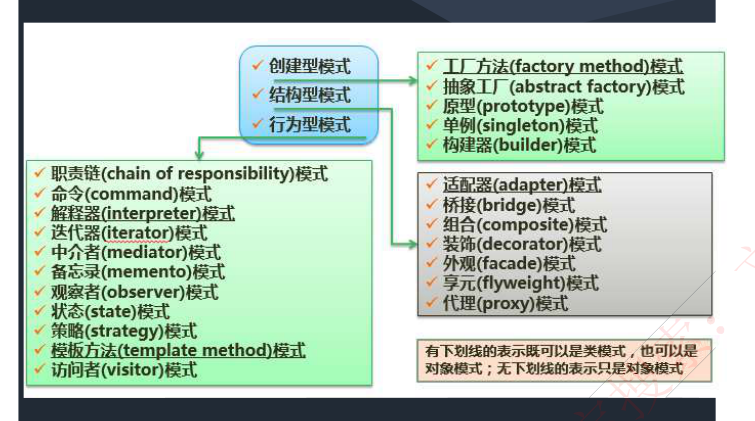

# 28 · 面向对象：设计模式（一）——创建型与结构型

> 真题：适配器 2022下；桥接四问、抽象工厂/桥接/命令三连 两题年份待核实；原型与创建型归属 2023上（考点重现）｜无计算｜未讲
> 知识点范围：对齐 `外部资源/转录md/14-面向对象技术.md` 3-1 架构模式、设计模式与惯用法，3-2 创建型，3-3 结构型，及第 3 节【考试真题】中创建型／结构型部分（3-4 行为型 11 个与行为型真题归 29）；转录本正文未收的**类模式／对象模式**取自分类总览图的图例、**内部／外部状态**按 GoF 原书补，正文逐处注明

---

## 定位

这一课过 GoF 23 个设计模式里的创建型 5 个与结构型 7 个（行为型 11 个不在本课），要练的只有一件事：题干给一句话，能从四个选项里挑出模式名，并说得出它属于哪一类。

第一节先把架构模式、设计模式、惯用法三个层次分开，再交代 23 个模式的两条分类线。第二、三节各是一张反查表，左栏是题干里会出现的词，右栏是模式名和记忆关键字。第四节收拢跨类最容易互换的两组，外加三处最容易记反的归属。

---

## 开讲：上午题只问一件事——这句话说的是哪个模式

设计模式的上午题几乎只有一种问法：把某个模式的定义原句改写成一句话，让你选模式名，有时再追问它属于哪一类、是类模式还是对象模式。

所以这一课不逐个展开讲原理，按"看到什么词答什么"来组织：先分清三个层次和两条分类线，再给创建型、结构型各一张反查表，最后用判据把最容易互换的几对分开。表里的**记忆关键字**是资料（＝本课对齐的那份培训讲义，下同）替你压缩好的题眼；资料原文定义单独列在每节的"原话"里——选项常常照抄它，要眼熟，不用背。

### 一、三个层次与 23 个模式的两条分类线

| 题干里出现 | 答 |
|---|---|
| 高层决策、基本设计决策、C/S 结构、B/S | 架构模式 |
| 不断重复发生的问题、解决方案的核心、复用成功的设计、跟用哪门语言无关 | 设计模式 |
| 最低层的模式、通过某种特定的程序设计语言描述、C++ 的引用—计数 | 惯用法 |
| 模式名称、问题、解决方案、效果 | 设计模式的四个基本要素（封闭清单，多一条少一条都是错项） |
| 23 种设计模式怎么分 | 创建型 5＋结构型 7＋行为型 11＝23 |
| 既可以是类模式，也可以是对象模式 | 只有工厂方法、适配器、解释器、模板方法四个（靠继承搭＝类模式，靠组合搭＝对象模式，判据见本节易混对） |

三个术语的大白话：**C/S** 就是 Client/Server（客户端—服务端），把系统劈成两半，一半装在用户机器上、一半跑在服务器上，报销系统选 B/S 就是拿浏览器当客户端——这是整个系统的骨架级决定，定错了要推倒重来。

**引用—计数**是给对象记一个"现在有几个人在用我"的数，减到 0 就自动释放，C++ 没有垃圾回收才要操心，换到 Java 根本用不上，所以它只能算某一门语言里的模式。

**GoF** 是 Gang of Four（四人组，《设计模式》原书的四位作者），资料和考卷上说"23 种设计模式"都指这本书，它按目的分三类：创建型管对象怎么造，结构型管类和对象怎么拼成更大的结构，行为型管对象之间怎么分工、怎么传消息（行为型整块在 29）。

原话（选项照抄这三句）：

- 架构模式｜「软件设计中的**高层决策**，例如 C/S 结构就属于架构模式，架构模式反映了开发软件系统过程中所作的基本设计决策。」
- 设计模式｜「每一个设计模式描述了一个在我们周围**不断重复发生的问题，以及该问题的解决方案的核心**。这样，你就能一次又一次地使用该方案而不必做重复劳动。」另有一句：「设计模式的核心在于提供了相关问题的解决方案，使得人们可以更加简单方便的复用成功的设计和体系结构。」
- 惯用法｜「是最低层的模式，关注**软件系统的设计与实现，实现时通过某种特定的程序设计语言**来描述构件与构件之间的关系。每种编程语言都有它自己特定的模式，即语言的惯用法。例如引用—计数就是 C++ 语言中的一种惯用法。」

**易混对：架构模式 vs 设计模式 vs 惯用法**

- 判据｜定的是整个系统的骨架＝架构模式；定的是几个类怎么摆、换一门语言照样成立＝设计模式；离开这门语言就没有意义＝惯用法。三层从高到低：架构模式定骨架（系统级）→ 设计模式定几个类怎么摆（跨语言）→ 惯用法定一门语言里怎么写（语言相关）。
- 例子｜同一套报销系统，"我们用 B/S"是架构模式，"通知那块用了工厂"（把满地的 `new` 收拢到一个专门造对象的类里，第二节讲）是设计模式，"那个 C++ 模块用的是引用计数"是惯用法。（把"C++ 用引用计数"换成"Java 那块用了单例"，答案就从惯用法变成设计模式。）
- 错法｜把 C/S 当成设计模式；把引用—计数当成设计模式。

**易混对：类模式 vs 对象模式**

- 判据｜靠继承搭起来、父子关系在编译时就定死＝类模式；靠一个对象持有另一个对象（组合）搭起来、运行时还能换人＝对象模式。
- 例子｜适配器（两边接口对不上时，中间加的那个转换头，第三节细讲）：转换头**继承**被适配的类，叫类适配器；转换头**持有**被适配的对象，叫对象适配器。（只把"继承"改成"持有"，答案就从类模式变成对象模式。）
- 错法｜两段式答案（"结构型类模式""行为型对象模式"）里，后半个词绝大多数是"对象"——23 个里只有 4 个沾"类"，见到"结构型类"先怀疑。
- 原话｜分类总览图右下角的图例：「有下划线的表示既可以是类模式，也可以是对象模式；无下划线的表示只是对象模式」。

这第二个分类维度资料正文没写，但真题拿它凑空是常事——题库练习 2 第四空问的就是"结构型对象模式"。图上带下划线的只有四个：**工厂方法、适配器、解释器、模板方法**（前两个在本课，后两个在 29）；迭代器那一条下面是一道红色波浪线，那是排版软件的拼写检查痕迹，不是下划线，别数成第五个。

### 二、创建型五个：`new` 惹出来的五件麻烦

| 题干里出现 | 答 | 记忆关键字 |
|---|---|---|
| 由子类决定实例化哪一个类、实例化过程推迟到子类 | 工厂方法 Factory Method | 「子类决定实例化」 |
| 一系列／一族相关或相互依赖的对象、整套配套一起换 | 抽象工厂 Abstract Factory | 「抽象接口」 |
| 表示与构造分离、相同的构建过程得出不同的表示 | 生成器 Builder（资料作"构建器"） | 「类和构造分离」 |
| 只有一个实例、全局访问点 | 单例 Singleton | 「唯一实例」 |
| 复制自身、克隆、通过拷贝已有对象来创建新对象 | 原型 Prototype | 「原型实例，拷贝」 |
| 一个集中的 create 方法里用一串 if 决定造哪个 | 简单工厂——**不在 GoF 23 个之内** | — |

报销系统里的五件麻烦，一件对一个（认场景用，不必背）：

- 工厂方法｜代码里到处 `new 钉钉通知()`，公司换企业微信要改几十个文件。收拢成带一串 if 的集中工厂（那就是简单工厂）还是不行——新增一种仍要回来撬开那串 if，做不到"对扩展开放、对修改关闭"（23 讲过的开闭原则）。GoF 的答案是把工厂本身做成能继承的：抽象的 `通知工厂` 下面挂钉钉工厂、企业微信工厂，各造各的那一种；换实现＝换传进来的工厂子类，已有代码一行不改。
- 抽象工厂｜两套税务口径，口径 A 有自己的发票校验器、金额计算器、报表生成器，口径 B 另有三个，而且必须成套用（拿 A 的校验器配 B 的计算器会算错）。`口径A工厂` 一个人负责交出配套的三件，客户端拿到哪一族全看给它哪个工厂。
- 生成器｜报销单打印件固定四步：抬头、明细表、合计栏、签字栏，一步都不能少；但差旅单和招待费单每一步填的内容完全不同。顺序写在**指挥者**（专门按固定步骤发号施令、自己不填内容的那个类）里，每一步填什么交给不同的生成器实现。
- 单例｜汇率表、审批规则缓存、写日志的对象多造一份就出乱子（两份汇率表各自刷新，同一张单前后能算出两个数）。做法是构造方法私有（外面 new 不出来）＋类里自己攥着唯一那一份＋一个静态方法当全世界唯一的取用入口。"只有一个实例"是结果，"全局访问点"是手段，答题时两个要件缺一不可（实现细节不用背，能从题干认出"唯一实例"就够）。
- 原型｜生成一张报销单模板要查三张表、跑一遍规则引擎，几百毫秒；员工连着提十张差旅单，抬头、部门、审批链几乎一样，只有明细不同。造一次、拷贝九份、每份改改明细。

原话（选项照抄）：

- 工厂方法｜「定义一个创建对象的接口，但由子类决定需要实例化哪一个类。使得子类实例化过程推迟」
- 抽象工厂｜「提供一个接口，可以创建一系列相关或相互依赖的对象，而无需指定它们具体工作的类」（这句有两种口径，见本节末的深入；跳过不影响答题）
- 生成器｜「将一个复杂类的表示与其构造相分离，使得相同的构建过程能够得出不同的表示」
- 单例｜「保证一个类只有一个实例，并提供一个访问它的全局访问点」
- 原型｜「用原型实例指定创建对象的类型，并且通过拷贝这个原型来创建新的对象」

**易混对：工厂方法 vs 抽象工厂**

- 判据｜一个工厂交出几种产品：交出一种是工厂方法（造哪一种由工厂子类决定），交出一族配套的是抽象工厂。
- 例子｜"把钉钉通知换成企业微信通知"→ 工厂方法；"整体切换税务口径、三件配套一起换"→ 抽象工厂。（把"三件配套一起换"改成"只换通知这一种"，答案就从抽象工厂退回工厂方法。）
- 错法｜题干出现"一系列""一族""相关或相互依赖""整套"仍答工厂方法；或把方向写反成"由父类决定实例化哪一个子类"，工厂方法是反过来的。

**其余认名即可**：生成器、单例、原型三个各只对应一句定义，照反查表的记忆关键字对号就行，不必背整句。两处补充——**生成器是创建型**，最常见的错法是被"构建过程"里的"过程"两个字带偏、误记成行为型；原型的题干只要出现"拷贝""复制自身""克隆"就是它（2023 年上半年考过一道招聘系统自动生成简历的题，题干里就是"声明一个复制自身的接口""通过复制……的对象来创建新的对象"，答原型、创建型）。

> 考试这样问：下午案例题考过一整道生成器——快餐厅的儿童套餐包括主餐、饮料和玩具，餐品种类可能不同但制作过程相同，前台服务员调度厨师制作，"过程相同、结果不同"正是那句定义的场景版。代码怎么填在 53，上午题只要能从"相同的构建过程、不同的表示"这句话把它认出来。

#### 深入 · 抽象工厂那句定义的两种口径

转录本作「而无需指定它们具体工作的类」，扫描原件与本章真题原文都作「而无需指定它们具体的类」，多出"工作"两个字。考场按后者认；无论哪一种口径，题眼都是"一系列相关或相互依赖的对象"。

### 三、结构型七个：给对象"包一层"的七种用途

| 题干里出现 | 答 | 记忆关键字 |
|---|---|---|
| 接口不相容／不符合要求、转换成用户希望得到的另一种接口；多个实现各不相同，要用一个统一接口把差异挡在后面 | 适配器 Adapter | 「转换，兼容接口」 |
| 动态地给对象添加额外的职责、比派生一个子类更灵活、能自由搭配 | 装饰 Decorator | 「附加职责」 |
| 为其他对象提供代理以控制对这个对象的访问（鉴权、打码、延迟加载） | 代理 Proxy | 「代理控制」 |
| 为子系统中的一组接口提供一致的外观、高层接口、简化子系统的使用 | 外观 Façade | 「对外统一接口」（限定词是题干里的**子系统**；只说"统一接口"而不提子系统的，先看适配器） |
| 树型结构、"整体-部分"层次、单个对象与组合对象的使用具有一致性 | 组合 Composite | 「整体-部分，树形结构」 |
| 支持大量细粒度对象共享、对象太多内存吃不消 | 享元 Flyweight | 「细粒度，共享」；内部状态＝不随场合变、存在对象里，外部状态＝随场合变、调用时传进去 |
| 抽象部分与实现部分分离、都可以独立地变化、两个维度 m×n；问"谁定义了实现类接口" | 桥接 Bridge | 「抽象和实现分离」；抽象侧＝使用者直接面对的那条继承线（报销单／Shape），实现侧＝真正干活的那条（渠道／Drawing），"定义实现类接口"问的是**实现侧的顶层** |

七件麻烦，一件对一个：

- 适配器｜要接税务局的发票查验服务：我方内部约定的接口是"查验(发票号, 金额)"，对方 SDK（Software Development Kit，第三方发的一包现成代码，只能调、改不了）给的是 "verify(一串 XML 字符串)"，两边都动不了，只能在中间加个转换头，朝我方这一侧长成我方接口的样子，调进来后翻译成对方的参数格式再转发。生活里就是出国用的电源转换插头。
- 装饰｜报销单提交后要加"写审批日志""发审批人短信"，将来可能只开一件也可能都开，还不许动 `报销单` 这个类。用继承要写"带日志的""带短信的""两个都带的"三个子类，加第三件事就要 7 个——功能一多子类个数按指数涨，行话叫**类爆炸**。装饰把每件事做成一层壳，壳对外仍是一张报销单，壳里裹着上一层，可以无限往外套：加第三件只多一个类，开哪几件是运行时决定的。
- 代理｜同样包一层，但这一层不添新职责。银行卡号只有财务能看，别人拿到打码的——功能还是"读卡号"，只是前面加了一道"你是谁"的检查；或者十兆的发票附件，列表页先不取，真点开了才去拿（**延迟加载**：先给个空壳，用到时才真去加载数据）。
- 外观｜提一张单，后台要按顺序调预算校验 → 发票查验 → 生成会计凭证 → 通知审批人，而 Web 端、App 端、批量导入三个调用方都得把这套顺序背下来，流程一改三处跟着改。外观在四个子系统前面立一扇门：外面只调 `提单服务.提交(单据)`，顺序只在门后维护一处。题干里的"子系统"三个字就是它的标记。
- 组合｜报销单下面挂费用明细，明细下面还能再挂子明细（一次差旅拆成机票和住宿，住宿再拆成三晚）。让"单条明细"和"一组明细"实现同一个接口、都有一个 `金额()`，一组的 `金额()` 就是把下面每一项加起来，省掉到处都要写的"这是一条还是一组"的判断。
- 享元｜导出全公司十万行报销明细，每行都带一个"费用类型"对象（类型名、报销比例、会计科目），实际只有十几种不同内容。这十几种各造一个、全场共用；每行都不一样的金额不塞进对象里，用的时候当参数传进去。
- 桥接｜报销单有差旅、招待、办公三种类型，审批通知有钉钉、邮件、纸质三种渠道，用继承穷举是 3×3＝9 个类，再加一种类型就要 12 个。桥接把两个维度拆成两条各自独立的继承线，再让报销单持有一个渠道对象，谁长都不影响对方，9 个类变回 3＋3＝6 个。定义里的"抽象部分"指报销单这一侧（使用者直接打交道的那层），"实现部分"指渠道这一侧（真正干活的那层）。

享元还带一对配套的词，资料表里没写，出自 GoF 原书的标准描述，考过：可共享、不随场合变的部分（费用类型的名称和比例）叫**内部状态**，存在享元对象里；随场合变的部分（这一行的金额）叫**外部状态**，调用时传进去。

原话（选项照抄）：

- 适配器｜「将一个类的接口转换成用户希望得到的另一种接口。它使原本不相容的接口得以协同工作」
- 装饰｜「动态的给对象添加一些额外的职责。它提供了用子类扩展功能的一个灵活的替代，比派生一个子类更加灵活」
- 代理｜「为其他对象提供一种代理以控制这个对象的访问」
- 外观｜「定义一个高层接口，为子系统中的一组接口提供一个一致的外观，从而简化了该子系统的使用」
- 组合｜「将对象组合成树型结构以表示"整体-部分"的层次结构，使得用户对单个对象和组合对象的使用具有一致性」
- 享元｜「提供支持大量细粒度对象共享的有效方法」
- 桥接｜「将类的抽象部分和它的实现部分分离开来，使它们可以独立地变化」

**易混对：适配器 vs 桥接**

- 判据｜事后补救还是事前设计：接口已经摆在那儿、两边都改不了、只能加个转换头＝适配器；两个维度都还会继续长，一开始就拆成两条线用组合连起来＝桥接。
- 例子｜税务局 SDK 给的 `verify(XML)` 跟我方的 `查验(发票号, 金额)` 对不上 → 适配器；报销单类型与审批渠道两个维度各自增长 → 桥接。（把"SDK 摆在那儿改不了"改成"这两类东西都还会继续加"，答案就从适配器变成桥接。）
- 错法｜两个都在摆弄"抽象一侧和实现一侧"，按这个选必错。再记一条：适配器改的是**接口长相**（类还是那些类），桥接改的是**类的搭法**（一条继承线拆成两条，中间用组合连）。

**易混对：装饰 vs 代理**

**先别往下看**：给报销单加审批日志、加短信通知，又不想改原类，这是装饰还是代理？多数人第一反应是代理，因为"包一层拦一下"听起来就很代理。正确答案是装饰。

- 判据｜你在给它加新职责（装饰），还是在管谁能用它、什么时候用它（代理）。
- 例子｜日志和短信是新加的职责，而且要能自由组合 → 装饰；打码、鉴权、延迟加载并没有添新功能，只是控制访问 → 代理。（把"读卡号时打码"改成"读卡号时顺便再发一条短信通知"，答案就从代理变成装饰。）
- 错法｜按类结构分。两者的类结构几乎一模一样——都实现使用者看到的那个接口、内部都握着一个被包住的对象——只能靠意图分。两个旁证：装饰常常一层套一层，代理通常只有一层；装饰的使用者知道自己在加料，代理的使用者往往根本不知道背后还有个真身。

**易混对：组合 vs 享元**

- 判据｜看题干在问什么：问"能不能把单个和整体一样对待"→ 组合；问"对象太多、内存吃不消、能不能共用"→ 享元。一个关心**结构长成什么样**，一个关心**实例有几个**。
- 例子｜报销单挂明细、明细挂子明细，算总额时对一条和对一组用同一个方法 → 组合；十万行共用十几个费用类型对象 → 享元。（把"明细还能再挂子明细"改成"十万行里只有十几种类型"，答案就从组合变成享元。）
- 错法｜享元自己带一个"享元工厂"，最容易被当成创建型；它是结构型。

**其余认名即可**：结构型七个在上面的易混对里已经全部出现过，不必再背整句定义——照反查表的记忆关键字对号就行。

> 考试这样问："该模式适用于（ ）的情况"和"以下叙述中不正确的是"这两种问法，四个选项通常各对应一个模式（或各是一个模式的适用场景）。做法一样：逐条用反查表认出每个选项说的是哪个模式，再看它跟题干问的是不是同一个。

### 四、跨类的两组混淆，和三处最容易记反的归属

**易混对：外观 vs 适配器**

- 判据｜外观是**简化**（子系统本来就能用，只是调起来麻烦），适配器是**转换**（接口本来就对不上，不转就没法用）。
- 例子｜四个子系统前立一扇门，外面只调 `提单服务.提交(单据)` → 外观；SDK 接口对不上，中间加转换头 → 适配器。（把"步骤太多、调起来麻烦"改成"根本调不通"，答案就从外观变成适配器。）
- 错法｜两个都是"外面只面对一个新类"，凭"包了一层"选不出来，要看原来能不能用。

**易混对：外观 vs 中介者**

- 判据｜外观是**单向**的，外面通过它进子系统，子系统不反过来找它；中介者是**双向**的，一组对象互相通信全走它。
- 例子｜提单服务这扇门只被外面调 → 外观；一组对象彼此通信都经过同一个协调者 → 中介者（属行为型，在 29）。
- 错法｜把中介者当结构型。

题库练习 3 里还会撞上一个**行为型**的空，本课没讲但要认得：**把一个请求封装成一个对象、从而支持撤销操作 → 命令 Command**（行为型，细讲在 29）。本课只要求你能把它和外观分开。

三处最容易记反的归属，分类空专挑这三个设错：**享元是结构型**（它有个"享元工厂"，最容易被当成创建型）；**生成器是创建型**（"构建过程"四个字像行为型）；**简单工厂不在 23 个之内**（它只是理解工厂方法的一级台阶，别把它当第 24 个模式）。

题目与考法见题库 28

## 速记

- 三层：架构模式定骨架（C/S）＞设计模式定几个类怎么摆＞惯用法定一门语言怎么写（C++ 引用—计数）；设计模式四要素＝模式名称、问题、解决方案、效果
- 23＝创建 5＋结构 7＋行为 11；**享元属结构型、生成器属创建型、简单工厂不在 23 内**
- 兼类模式与对象模式的只有**工厂方法、适配器、解释器、模板方法**，其余都是对象模式
- 创建型关键字：抽象工厂＝抽象接口、生成器（资料作构建器）＝类和构造分离、工厂方法＝子类决定实例化、原型＝原型实例拷贝、单例＝唯一实例
- 结构型关键字：适配器＝转换兼容接口、桥接＝抽象和实现分离、组合＝整体-部分树形结构、装饰＝附加职责、外观＝对外统一接口、享元＝细粒度共享、代理＝代理控制
- 一种产品用工厂方法、一族配套用抽象工厂；事后转接口用适配器、事前拆维度用桥接（m×n 变 m＋n）
- 加职责是装饰、控访问是代理；简化子系统是外观、转换接口是适配器；外观单向、中介者双向
- 享元：可共享不随场合变的是内部状态（存对象里），随场合变的是外部状态（调用时传）
