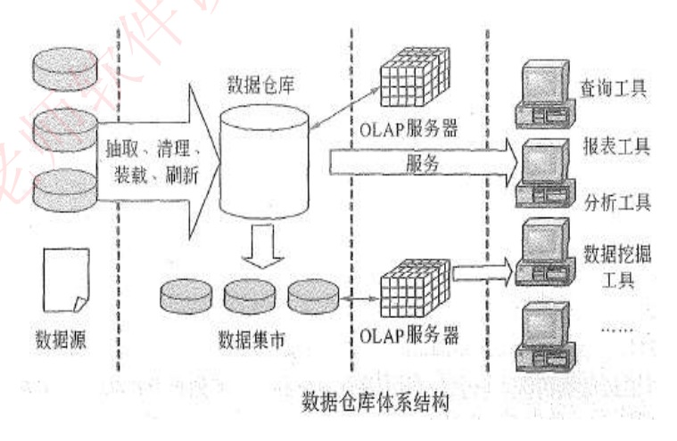
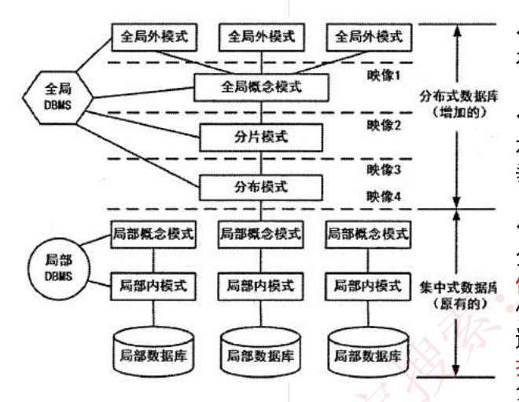

# 35 · 数据库：数据仓库、分布式与备份恢复

## 定位

数据库板块收口课。报销库用了三年冒出五个问题，各配一套技术：统计拖垮业务 → 数据仓库与 OLAP；多系统数据对不上 → ETL 与 BI；数据会丢会漏 → 故障恢复、转储备份、安全措施；一台装不下 → 分布式数据库；表拆太细读得慢 → 反规范化。末节附大数据。只有备份份数一处要动笔。

---

## 一、OLTP、OLAP 与数据仓库

| 特征 | 是什么 |
|---|---|
| 一次碰一两行、看单笔响应时间（毫秒级）、几百人同时点 | **OLTP**（联机事务处理，On-Line Transaction Processing），生产库天天干的活（教材中与 OLAP 对照的标准叫法） |
| 一次扫几百万行、看吞吐（慢十几秒无妨）、多角度切着看 | **OLAP**（联机分析处理，On-Line Analytical Processing） |
| 另建一个专做分析的库 | **数据仓库**。两者放同一库必然互相踩：大扫描吃光内存和磁盘带宽，小事务排队 |

原话｜数据仓库是一个「面向主题的、集成的、非易失的、且随时间变化」的数据集合，「用于支持管理决策」。四条修饰语是四条设计决定：

| 特性 | 原话 | 报销系统里 |
|---|---|---|
| **面向主题** | 「按照一定的主题域进行组织的」 | 生产库按业务模块建表（报销单表、审批记录表……）；仓库按分析主题建，"报销支出"把单、审批、付款、部门、时间揉进一组表。主题＝要分析的事，不是系统功能 |
| **集成的** | 「必须消除源数据中的不一致性」 | 部门在三个源里写作 `D01`／`1001`／"研发一部"，金额有元有分——进仓前统一（第二节 ETL） |
| **相对稳定的**（＝非易失，同一条特性两种译法） | 「一旦某个数据进入数据仓库以后，一般情况下将被长期保留」；「有大量的查询操作，但修改和删除操作很少，通常只需要定期的加载、刷新」 | 每天凌晨加载新数据，但不改老数据：老单被冲销是新加一行"冲销" |
| **反映历史变化** | 「系统记录了企业从过去某一时点（如开始应用数据仓库的时点）到目前的各个阶段的信息」，据此可「对企业的发展历程和未来趋势做出定量分析和预测」 | 生产库只存"张三-研发二部"当前值；仓库存"2024Q1 张三-研发一部""2025Q1 张三-研发二部"两行，才答得了三年趋势 |

**易混对：相对稳定 vs 数据不变**
- 判据｜相对稳定＝只加不改：仍在定期加载、刷新，只是老数据很少修改和删除。
- 例子｜凌晨加载昨天的新单 → 符合；原地改老单金额 → 不符合，应另加一行。

四条合起来对照生产库（OLTP）：按业务模块、尽量规范化少冗余 vs 按分析主题、允许冗余（第七节）；本系统一个源 vs 多源清洗合并；增删改随时发生 vs 只定期加载刷新；旧值被覆盖 vs 另存一行历史全留。

---

## 二、ETL、四层结构与 BI

**ETL**＝多源数据搬进仓库的工序：**抽取（Extraction）**从各源捞数据 → **转换（Transformation）**统一口径（部门映射成同一编号、金额统一成元、剔除测试单）→ **加载（Load）**写进仓库。体系结构图上写作「抽取、清理、装载、刷新」：清理＝转换里剔脏数据那一半，装载＝加载，刷新＝每天的增量加载。

图被三条竖虚线分成四栏，即**数据仓库四层结构**：

| 层（图上从左到右） | 原话 |
|---|---|
| 数据源（业务库圆柱＋文档图标） | 「是数据仓库系统的**基础**，是整个系统的数据源泉」 |
| 数据的存储与管理（数据仓库＋下排数据集市） | 「是整个数据仓库系统的**核心**」 |
| OLAP 服务器（两个立方体） | 「按多维模型组织，以便进行多角度、多层次的分析，并发现趋势」 |
| 前端工具 | 「主要包括各种报表工具、查询工具、数据分析工具、数据挖掘工具以及各种基于数据仓库或数据集市的应用开发工具」 |

**数据集市**（资料未定义）：从仓库切给某一部门专用的一小块，图上有独立箭头通向自己的 OLAP 服务器。

**商业智能（BI）**「主要包括**数据预处理、建立数据仓库、数据分析和数据展现**四个主要阶段」：数据预处理＝ETL；建立数据仓库「是处理海量数据的基础」；**数据分析「是体现系统智能的关键」**，用 OLAP 和数据挖掘；数据展现「主要保障系统分析结果的可视化」＝前端工具。

| 关键词 | 是什么 |
|---|---|
| 固定一维只看一层（只看"差旅"费用） | OLAP · **切片** |
| 固定一段范围（华东三个部门 2024 全年） | OLAP · **切块** |
| 年 → 季度 → 月，看得更细 | OLAP · **下钻** |
| 部门 → 事业部，看得更粗 | OLAP · **上卷** |
| 行列对调（行部门列季度 → 行季度列部门） | OLAP · **旋转** |
| 用带答案的历史数据训练，再判新数据（用过去被驳回／通过的单预测新单会不会被驳回） | 数据挖掘 · **分类**（有监督） |
| 事先没答案，算法自己把行为相似的员工归成几群，几群、叫什么事后才知道 | 数据挖掘 · **聚类**（无监督） |
| 找经常一起出现的组合（住宿费超 800 的单，八成同时挂市内交通费） | 数据挖掘 · **关联分析** |

**易混对① OLAP vs 数据挖掘**
- 判据｜已经知道要看什么、只是换角度看 → OLAP；不知道要看什么、让它「挖掘数据背后隐藏的知识」→ 数据挖掘。
- 例子｜把部门报销额从年钻到月 → OLAP 下钻；让系统找出哪些费用常一起报 → 数据挖掘关联分析。

**易混对② 分类 vs 聚类**
- 判据｜有没有标签：有历史答案 → 分类；没有 → 聚类。
- 例子｜拿已标"通过／驳回"的历史单训练 → 分类；去掉这些标记，只按行为相似分群 → 聚类。

---

## 三、故障分类与日志恢复

**事务**＝一组"要么全做完、要么当没发生过"的操作（"扣部门预算＋写审批记录"同生共死；ACID 见讲义 34）。资料列四行，按**三类**归：事务故障（含可预期、不可预期两小类）、系统故障、介质故障。

| 故障类型 | 出了什么事 | 硬盘上的数据 | 解决方法（原话） |
|---|---|---|---|
| 事务故障·可预期 | 事务自身判断不该继续（"预算不足"） | 完好 | 「在程序中预先设置 Rollback 语句」 |
| 事务故障·不可预期 | 算术溢出、违反存储保护，事务被强行掐断 | 完好 | 「由 DBMS 的恢复子系统通过日志，撤消事务对数据库的修改，回退到事务初始状态」 |
| 系统故障 | 系统停止运转（断电、宕机、操作系统崩） | 完好，丢的是内存缓冲区里未写回的部分 | 「通常使用检查点法」 |
| 介质故障 | 外存被破坏（盘片划伤、阵列烧毁、数据文件被删） | **没了** | 「一般使用日志重做业务」 |

**易混对：系统故障 vs 介质故障**
- 判据｜先看硬盘上的数据还在不在：不在 → 介质故障；在 → 再看是一个事务出问题（事务故障）还是整个系统停了（系统故障）。
- 例子｜机房跳闸、服务器断电重启，几笔审批只写了一半 → 系统故障（硬盘完好）；同样场景但磁盘阵列烧了 → 介质故障。

**日志文件**原话｜「在事务处理过程中，DBMS 把事务开始、事务结束以及对数据库的插入、删除和修改的每一次操作写入日志文件。一旦发生故障，DBMS 的恢复子系统利用日志文件撤销事务对数据库的改变，回退到事务的初始状态。」日志记的是**操作**；数据本身在**数据文件**里，缓冲区里的数据内容写回的就是数据文件。恢复时两样都要。

以下 UNDO／REDO 与检查点做法按教材第 5 版补：
- **UNDO（撤销）**：按日志**反向**扫，把没做完的事务已写下的改动逐笔倒回。
- **REDO（重做）**：按日志**正向**扫，把已提交但可能没落盘的改动再写一遍。

| 故障 | 恢复 |
|---|---|
| 事务故障 | 只需 UNDO |
| 系统故障 | 先 UNDO 未完成的、再 REDO 已提交的。**检查点**：DBMS 每隔一阵在日志里写一条检查点记录，同时把内存缓冲区强制写回磁盘；恢复时只从最近一个检查点往后处理，不必从日志开头重来 |
| 介质故障 | 先拿备份重装，再 REDO 从备份那一刻起所有已提交的事务（原文"重做业务"即此） |

---

## 四、转储与备份

### （概念）转储方式与备份策略

重装用的备份，学名**转储**。按"转储期间还让不让人用库"分：

| | 静态转储＝**冷备份** | 动态转储＝**热备份** |
|---|---|---|
| 转储期间 | 「不允许对数据库进行任何存取、修改操作」 | 「允许对数据库进行存取、修改操作，因此，转储和用户事务可并发执行」 |
| 优点 | 「非常快速的备份方法、容易归档（直接物理复制操作）」 | 「可在表空间或数据库文件级备份，数据库扔可使用，可达到秒级恢复」（原文"扔"当"仍"） |
| 缺点 | 「只能提供到某一时间点上的恢复，不能做其他工作，不能按表或按用户恢复」 | 「不能出错，否则后果严重，若热备份不成功，所得结果几乎全部无效」 |

热备份能秒级恢复，不等于更可靠——它恰恰不能出错。

教材另按每次转多少分（按第 5 版补）：**海量转储**（每次转全库）、**增量转储**（只转上次转储后变化的部分）。与静态／动态交叉共四种：静态海量、静态增量、动态海量、动态增量；停机最久的是**静态海量**（全程锁库＋拷全库）。

三种**备份策略**，区别只在参照点：
- **完全备份**：「备份所有数据」。
- **差量备份**：「仅备份上一次**完全备份**之后变化的数据」。
- **增量备份**：「备份上一次**备份**之后变化的数据」——上一次是完全还是增量都算。

### （计算）恢复要几份备份

例：周日 0 点完全备份，周一至周六每天 0 点各备一次；周三 0 点备完后库坏，恢复到周三 0 点。

1. 差量：周三那份已含周日→周三全部变化 → 周日完全＋周三差量＝**2 份**。
2. 增量：周三那份只含周二→周三的变化，前几天须逐份接上 → 周日完全＋周一＋周二＋周三＝**4 份**，缺一份就接不上。

| 坏在 | 差量 | 增量 |
|---|---|---|
| 周三 | 2 | 4 |
| 周五 | 2 | 6 |
| 周六 | 2 | 7 |

规律：**差量恒 2 份**（参照点钉在完全备份），**增量＝1＋天数份**。代价反过来：差量每天备的量越滚越大（费空间、恢复省事），增量每天只备一天的量（省空间、恢复要接长链）。

---

## 五、安全措施五项

从外往里排：

| 措施 | 原话 | 报销系统里 |
|---|---|---|
| **用户标识和鉴定** | 「**最外层**的安全保护措施，可以使用用户帐户、口令及随机数校验等方式」 | 工号＋口令＋短信验证码 |
| 存取控制 | 「对用户进行授权，包括操作类型（如查找、插入、删除、修改等动作）和数据对象（主要是数据范围）的权限」 | 财务能查全公司的单但不能改，主管只能查本部门 |
| 密码存储和传输 | 「对远程终端信息用密码传输」 | 外地分公司连总部，链路上跑密文 |
| 视图的保护 | 「对视图进行授权」 | 给主管开只含本部门、不含身份证号的视图，权限授在视图上（视图＝外模式，见讲义 30） |
| **审计** | 「使用一个专用文件或数据库，自动将用户对数据库的**所有操作**记录下来」 | 查谁在凌晨删了那张单 |

**易混对① 审计 vs 日志文件**
- 判据｜给谁用：日志给 **DBMS 自己恢复数据**（记每次操作的前后像）；审计给**人查谁干的**。
- 例子｜断电后回滚未完成事务 → 日志；追查谁删了单 → 审计。

**易混对② 存取控制 vs 视图的保护**
- 判据｜权限授在表上 → 存取控制；授在视图上 → 视图的保护。
- 例子｜见上表第二、四行。

---

## 六、分布式数据库

原话｜「局部数据库位于不同的物理位置，使用一个**全局 DBMS** 将所有局部数据库联网管理」。上海、北京、广州各存一部分报销单，写 `SELECT * FROM 报销单` 的人不必知道单在哪台机器——这叫**透明性**。做法是在原有模式层次上**再加几层**：

图右侧：全局外模式到分布模式标**「分布式数据库（增加的）」**（归全局 DBMS 管），局部概念模式到局部数据库标**「集中式数据库（原有的）」**（局部 DBMS 管局部概念、局部内模式）。

| 层 | 管什么 |
|---|---|
| 全局外模式（图上三个） | 各应用各看一份，即讲义 30 的"视图" |
| 全局概念模式 | 全公司报销单逻辑上就是一张表，列与类型同单机时代 |
| 分片模式 | 逻辑表切成几块。**水平分片**「将表中水平的记录分别存放在不同的地方」＝切**行**（华东一块、华北一块）；**垂直分片**「将表中的垂直的列值分别存放在不同的地方」＝切**列**（单号金额一块、发票扫描件一块） |
| 分布模式 | 每一块放到哪台机器、各留几份副本 |
| 局部概念模式／局部内模式／局部数据库 | 原集中式照搬：这台机器有哪些表、怎么存、磁盘 |

上面五层之间四条横虚线，自上而下为**映像 1～4**（映像 1：全局外模式／全局概念模式；2：全局概念／分片；3：分片／分布；4：分布／局部概念，即增加部分与原有部分的接缝）。每道缝挡住一种变化，透明性长在缝上（层次按教材口径补）：

| 缝 | 上面变了什么，下面不用管 | 透明性 | 原话 |
|---|---|---|---|
| 映像 2 | 表切成几块、怎么切 | **分片透明性** | 「不需要知道逻辑上访问的表具体是如何分块存储的」 |
| 映像 3 | 每块放哪台机器、存几份副本 | **位置透明性**（副本那一半叫**复制透明性**） | 位置：「不关心数据存储物理位置的改变」；复制：「不关心复制的数据从何而来」 |
| 映像 4 | 那台机器用哪种数据模型 | **逻辑透明性**（局部数据模型透明性） | 「无需知道局部使用的是哪种数据模型」 |

层次高低只看缝的位置：缝越靠上，盖住的下层越多，所以 **分片透明性最高 ＞ 位置透明性 ＞ 逻辑透明性**。映像 1 不属于这四种，它是讲义 30 的"改表不改应用"搬到全局层。

**易混对① 位置透明 vs 复制透明**
- 判据｜程序不用管的是"在哪台机器"还是"读的是哪份副本"。
- 例子｜分库从北京机房整体迁到天津、程序不改 → 位置透明；三地各一份副本、程序不知读了哪份 → 复制透明。

**易混对② 这里的四处映像 vs 讲义 30 的两级映像**
- 判据｜30 的两级映像（外模式—模式、模式—内模式）管一台机器内三层互不牵连；这里的四处映像管多台机器伪装成一台。两者并存：每台局部库内部仍有自己的两级映像。
- 例子｜某局部库改存储结构 → 它内部的模式—内模式映像；表的分块方式变 → 映像 2。

---

## 七、反规范化

讲义 31 把表拆到无冗余、无异常是为了**写得对**；反规范化为了**读得快**，把拆开的表按需合回一部分。原话｜「规范化设计后，数据库设计者希望**牺牲部分规范化来提高性能**」。选哪个方向看表**写多还是读多**：生产库照旧按第三范式（3NF）建，反规范化只用在读多写少处——报表库、数据仓库、列表页（第一节"允许冗余"即此）。

- **益处**原话｜「降低连接操作的需求、降低外码和索引的数目，还可能减少表的数目，能够提高查询效率。」
- **代价**原话｜「数据的**重复存储**，浪费了磁盘空间；可能出现数据的**完整性问题**，为了保障数据的一致性，增加了数据维护的复杂性，会**降低修改速度**。」
- 空间最便宜，要命的是后两项：冗余存"提单人姓名"后员工改名要改两处，漏改即不一致（完整性问题），每次改多写一处（修改变慢）。

| 方法 | 原话 | 报销系统里 | 换到了什么 |
|---|---|---|---|
| 增加冗余列 | 「在多个表中保留相同的列」 | 报销单表除工号外再存一份"提单人姓名"（本只在员工表） | 少一次连接 |
| 增加派生列 | 「增加可以由本表或其它表中数据计算生成的列」 | 报销单表加"明细合计"＝该单所有明细行金额之和 | 少一次连接，免掉 SUM |
| 重新组表 | 「把这两个表重新组成一个表来减少连接而提高性能」 | "报销单"与"审批记录"总是一起查，合成一张宽表 | 少一次连接，少一张表 |
| 水平分割表 | 「根据一列或多列数据的值，把数据放到多个独立的表中」 | 按年拆成 报销单_2024／_2025／_2026，结构相同 | 单表行数下降 |
| 垂直分割表 | 「将主键与部分列放到一个表中，主键与其它列放到另一个表中」 | 单号＋金额＋状态一张，单号＋发票扫描件＋报销说明一张 | 查列表不读大字段，「在查询时减少 I/O 次数」 |

口诀：新列抄来的是冗余列、算出来的是派生列；切行是水平、切列是垂直；两张并一张是重新组表。

**易混对：分割表 vs 分片**
- 判据｜方向一致（水平切行、垂直切列），区别在去处：分割留在同一台机器换性能，分片发到不同机器。
- 例子｜按年拆成三张表放同一库 → 水平分割；华东、华北的单分放两地机器 → 水平分片。

---

## 八、大数据

与第六节同一动机（装不下、算不动 → 往横里堆机器），其余认名即可：

- **特点四条**原话｜「大量化、多样化、价值密度低、快速化。」价值密度低：监控录 24 小时，有用的可能只有 3 秒。
- **与传统数据比**：数据量 GB 或 TB 级 → PB 级或以上；分析需求 现有数据的分析与检测 → 深度分析（关联分析、回归分析）；硬件平台 高端服务器 → 集群平台。
- **处理系统八条特征**原话｜「高度可扩展性、高性能、高度容错、支持异构环境、较短的分析延迟、易用且开放的接口、较低成本、向下兼容性。」

---

## 速记

- 数据仓库＝**面向主题、集成的、非易失（＝相对稳定）、随时间变化**；长期保留少改删→相对稳定，多源去不一致→集成，看趋势→反映历史变化
- 四层：**数据源是基础、存储与管理是核心**、OLAP 服务器、前端工具；BI＝数据预处理(ETL) → 建仓 → 数据分析(智能的关键) → 数据展现
- ETL＝抽取／转换／加载；OLAP＝切片、切块、下钻、上卷、旋转；挖掘＝分类(有标签)、聚类(无标签)、关联分析
- 故障先看**硬盘数据在不在**：没了＝介质故障（重装备份＋REDO）；在→事务故障（Rollback 或 UNDO）／系统故障（**检查点法**，先 UNDO 未完成再 REDO 已提交）；日志记操作、数据文件记数据
- 转储 **静态＝冷＝停机／动态＝热＝在线**（热备不能出错）；另分海量／增量，交叉四种，静态海量停机最久
- 备份 **差量参照上次完全备份（恒 2 份）、增量参照上次任意备份（1＋天数份）**；差量费空间省恢复，增量反之
- 安全五项由外到内：**用户标识和鉴定（最外层）** → 存取控制 → 密码存储和传输 → 视图的保护 → **审计（记谁干的）**
- 分布式：水平分片切行、垂直分片切列；**分片透明＞位置透明（含复制透明）＞逻辑透明**；反规范化五法＝冗余列(抄)、派生列(算)、重新组表(并)、水平分割(切行)、垂直分割(切列)，代价是完整性风险与修改变慢
