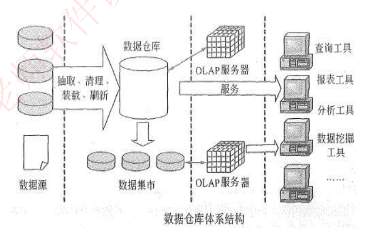
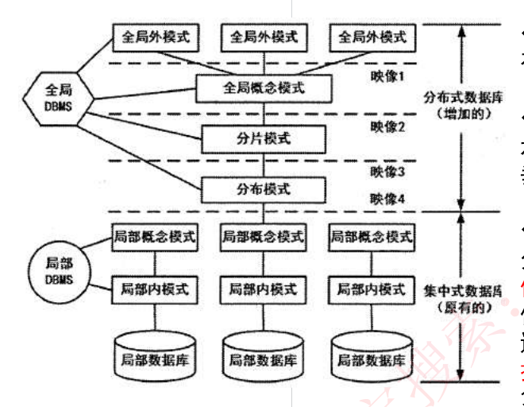

# 35 · 数据库：数据仓库、分布式与备份恢复

> 真题：数据仓库「相对稳定性」辨析、日志文件与数据文件两空题（两题均录自培训资料，年份待核实）；故障分类与恢复在 `计划/00-总体计划.md` 记作 2022下/2024下，未核到卷面原题，同标待核实｜无公式，只数备份份数｜未讲
> 知识点范围：对齐 `外部资源/转录md/04-数据库技术基础.md`「数据库新技术」1-1 转储与备份、1-2 安全措施与故障恢复及其【考试真题】、2 分布式数据库、3 数据仓库技术（含 3-1 商业智能）、4 反规范化技术、5 大数据及其【考试真题】；6 SQL 语言归讲义 33。UNDO/REDO、检查点的具体做法、海量/增量转储、透明性的层次归属转录本未收，按《软件设计师教程》（第 5 版）补并在正文注明

---

## 定位

**这一课回答**：报销库用了三年之后冒出来的五件事——统计跑不动、几个系统的数据对不上、盘会坏人会误删、一台机器装不下、表拆太细读得慢，各自该上什么技术。

**前后关系**：数据库板块收口课。30 讲库怎么建、31–32 讲表怎么拆、33 讲怎么查、34 讲多人同时改怎么不出错；讲义 34 明确把「转储备份与故障恢复」划给本课，本课把这一块收齐。

**分值与去向**：板块上午约 5–6 分；本课是板块补缺课，2021–2025 真题核对里未命中，按 0–1 分准备，培训资料给的考法集中在四特性对号、故障归类、差量增量份数、反规范化五法认领、透明性配对；下午题不考。

---

## 开讲：报销系统用了三年，老板开始问「趋势」

还是讲义 15、30、31、34 那套内部报销系统：员工提单、主管审批、审完打款。前五课里它一直是个**记账的库**——有人提单就插一行，有人审批就改一行，一次动一两行，一秒钟几十次。

第三年，库里躺着 200 万张单，老板换了一种问法："把这三年各部门的报销金额按季度拉出来，我要看趋势，顺便跟考勤数据比一比谁出差多。"

**最朴素的做法只有一句话：打开生产库，写一条 `SELECT … GROUP BY 部门, 季度` 跑一下。** 这一课的全部名词，就是这一句 SQL 会在五个地方翻车、五个坑各自的补丁：

- ① 这条 SQL 一跑二十分钟，全公司的提单页面一起转圈——**记账要的东西和分析要的东西正好相反**；
- ② 报销在 MySQL、考勤在老 Oracle、2019 年以前的单还躺在几个 Excel 里，部门编号三套口径，"比一比"这三个字压根拼不起来；
- ③ 生产库那块盘会坏、机房会断电、你自己也会把 `WHERE` 写漏——**数据会丢**；数据还会被不该看的人看去——**数据也会漏**；
- ④ 三年 8TB，一台机器已经加不动盘了；
- ⑤ 就算专门建了分析库，31 讲的范式把表拆得干干净净，一张季度报表要连十几张表，还是慢。

五个坑，六节——③ 一个坑要分两节写，因为"丢"和"漏"是两套完全不同的防法。最后附一节大数据，它只有一半挂在这条链上，到时候说清挂在哪一半。

### 一、记账和分析要的东西相反（补①）：OLTP、OLAP 与数据仓库

先把两个缩写说清。**OLTP（联机事务处理，On-Line Transaction Processing）**就是报销系统天天在干的活：一次只碰一两行，要求毫秒级返回，几百人同时点。**OLAP（联机分析处理，On-Line Analytical Processing）**是老板那个问法要的活：一次扫几百万行，慢十几秒没关系，但要能从各种角度切着看。两者放同一个库里必然互相踩——大扫描把内存和磁盘带宽吃光，提单的小事务就排队。（OLTP 这个词转录本未出现，是教材里与 OLAP 对照的标准叫法。）

答案是**另建一个库专门做分析**，它叫**数据仓库**：一个「面向主题的、集成的、非易失的、且随时间变化」的数据集合，「用于支持管理决策」。四条修饰语不是四个形容词，是四条设计决定，逐条对着报销系统看：

- **面向主题**：原文是「按照一定的主题域进行组织的」。生产库按**业务模块**建表——报销单表、审批记录表、员工表、付款表，因为系统有这几个功能。仓库按**分析主题**建——"报销支出"是一个主题，把单、审批、付款、部门、时间全揉进同一组表里，因为你要分析的是这件事。主题＝你想分析的那件事，不是系统的哪个功能。
- **集成的**：原文是「必须消除源数据中的不一致性」。MySQL 里部门写 `D01`、Oracle 里写 `1001`、Excel 里写"研发一部"，金额有的以元为单位有的以分为单位——进仓库前统一成一套。这条正是坑②，第二节展开。
- **相对稳定的**：**先别往下看：这里的"稳定"，说的是不是"仓库里的数据从此不变"？** 多数人这么理解，不对。原文说的是「一旦某个数据进入数据仓库以后，一般情况下将被长期保留」「有大量的查询操作，但修改和删除操作很少，通常只需要定期的加载、刷新」——仓库每天还在**长个儿**（凌晨批量加载昨天的新数据），只是**不回头改老数据**。2019 年 3 月那张单后来被冲销了，仓库的做法是新加一行"冲销"，而不是把老行改掉。考题里的"非易失"和"相对稳定"是同一条特性的两种译法，别当成两条。
- **反映历史变化**：原文是「系统记录了企业从过去某一时点（如开始应用数据仓库的时点）到目前的各个阶段的信息」，据此可以「对企业的发展历程和未来趋势做出定量分析和预测」。生产库里"张三属于研发二部"只存当前值，他去年在研发一部这件事被覆盖掉了；仓库存"2024Q1 张三-研发一部""2025Q1 张三-研发二部"两行，所以才答得了"研发一部这三年的支出趋势"。

把两个库摆在一起逐条比，OLTP 与 OLAP 的辨析题就是在这张表里挑一行反着写：

| 比什么 | 生产库（OLTP） | 数据仓库（OLAP） | 对应哪条特性 |
|---|---|---|---|
| 建表按什么组织 | 业务模块，尽量规范化少冗余 | 分析主题，允许冗余（第六节） | 面向主题 |
| 数据从哪来 | 就本系统一个源 | 多个源系统清洗后合并 | 集成的 |
| 写操作 | 增删改随时发生 | 只有定期加载、刷新，几乎不改不删 | 相对稳定 |
| 旧值怎么办 | 被新值覆盖，只留当前 | 另存一行，历史全留 | 反映历史变化 |
| 一次动多少行 | 一两行 | 几百万行 | — |
| 快慢看什么 | 单笔响应时间（毫秒） | 一次能扫多少数据（吞吐） | — |

### 二、三个系统的数据怎么拼到一起（补②）：ETL、四层结构与 BI

把 MySQL、Oracle、Excel 三处的数据搬进仓库，中间那道工序叫 **ETL**，三个动作：**抽取（Extraction）**，从各个源系统把数据捞出来；**转换（Transformation）**，把 `D01`／`1001`／"研发一部"映射成同一个部门编号、金额统一成元、把测试单剔掉；**加载（Load）**，写进仓库。培训资料的体系结构图上这道工序写作**「抽取、清理、装载、刷新」**四个动作，和 ETL 三动作错开一格："清理"就是转换里剔脏数据那一半，"装载"即加载，多出来的"刷新"指每天凌晨那一次增量加载。

图从左到右被三条竖虚线分成四栏，正好对应**数据仓库的四层结构**，其中两个词是考点：

| 层 | 图上画的是什么 | 原文怎么定位它 |
|---|---|---|
| 数据源 | 最左边三个叠着的圆柱（几个业务库）加一张文档图标（Excel 之类） | 「是数据仓库系统的**基础**，是整个系统的数据源泉」 |
| 数据的存储与管理 | 中间的大圆柱"数据仓库"，下面另有一排小圆柱标"数据集市" | 「是整个数据仓库系统的**核心**」 |
| OLAP 服务器 | 两个网格立方体，一个接在数据仓库后、一个接在数据集市后 | 「按多维模型组织，以便进行多角度、多层次的分析，并发现趋势」 |
| 前端工具 | 最右边一列电脑图标：查询工具、报表工具、分析工具、数据挖掘工具、…… | 「主要包括各种报表工具、查询工具、数据分析工具、数据挖掘工具以及各种基于数据仓库或数据集市的应用开发工具」 |

**数据集市**这个词，资料只在"前端工具"那一句里带过、没给定义：它是从仓库里切给某一个部门专用的一小块——仓库是全公司的，集市是财务部门自己那份。图上它有一条独立的箭头通向自己的 OLAP 服务器，意思是部门可以只在自己那一小块上做分析。

整条链有个总名字：**商业智能（BI）**，「主要包括**数据预处理、建立数据仓库、数据分析和数据展现**四个主要阶段」。四个阶段和前面的内容一一对上：数据预处理就是 ETL；建立数据仓库「是处理海量数据的基础」；**数据分析「是体现系统智能的关键」**，用 OLAP 和数据挖掘两大技术；数据展现「主要保障系统分析结果的可视化」，就是最右边那列前端工具。

数据分析这一格里的两项技术，考试专门考它们的分工：

- **OLAP**：你**已经知道要看什么**，只是换角度看。五个动作配报销的例子——**切片**是固定一维只看一层（只看"差旅"这一类费用），**切块**是固定一段范围（只看华东三个部门 2024 全年），**下钻**是从年钻到季度再钻到月（看得更细），**上卷**是从部门卷到事业部（看得更粗），**旋转**是把行列对调（原来行是部门列是季度，转成行是季度列是部门）。
- **数据挖掘**：你**不知道要看什么**，让它告诉你。「挖掘数据背后隐藏的知识」，原文点了「关联分析、聚类和分类等方法」，考试就考这三个：**分类**是拿有答案的历史数据训练模型再去判新数据（拿过去被驳回／通过的单训练，预测新提的单会不会被驳回，历史标签就是答案，所以是有监督的）；**聚类**是事先没有答案，让算法自己把报销行为相似的员工归成几群，几群、每群叫什么都是事后才知道（无监督）；**关联分析**是找经常一起出现的组合（住宿费超 800 的单，八成同时挂着市内交通费）。一句话记：**分类有标签，聚类没标签。**

### 三、盘会坏，人会写错（补③上半）：三类故障、日志与转储

**先别往下看，猜一个：周三下午三点机房跳闸，整台服务器断电重启。重启后发现有几笔审批只写了一半。这属于哪一类故障？**

多数人答"介质故障"，因为"机器坏了"。**错。** 介质故障专指**外存被破坏**——盘片划伤、阵列烧了、数据文件被删，硬盘上的东西没了。断电重启时硬盘好好的，丢的是**内存缓冲区里还没写回磁盘的那一部分**，这叫**系统故障**。是不是介质故障，判据就一条：**硬盘上的数据还在不在**；剩下那两类之间怎么再分，看下面这张表。

先补一个词：**事务**是一组"要么全做完、要么当没发生过"的操作，比如"扣部门预算 + 写审批记录"两步必须同生共死（ACID 和封锁协议在讲义 34，这里只用这一句）。培训资料把故障列成四行，考试口径按**三类**答——事务故障（含可预期与不可预期两小类）、系统故障、介质故障：

| 故障类型 | 出了什么事 | 硬盘上的数据 | 资料给的解决方法 |
|---|---|---|---|
| 事务故障·可预期 | 事务自己的逻辑判断出不该继续（"预算不足"） | 完好 | 「在程序中预先设置 Rollback 语句」 |
| 事务故障·不可预期 | 算术溢出、违反存储保护，事务被强行掐断 | 完好 | 「由 DBMS 的恢复子系统通过日志，撤消事务对数据库的修改，回退到事务初始状态」 |
| 系统故障 | 系统停止运转（断电、宕机、操作系统崩） | 完好，丢的是内存缓冲区 | 「通常使用检查点法」 |
| 介质故障 | 外存被破坏 | **没了** | 「一般使用日志重做业务」 |

三行解决方法里出现了同一个东西：**日志文件**。原文：「在事务处理过程中，DBMS 把事务开始、事务结束以及对数据库的插入、删除和修改的每一次操作写入日志文件。一旦发生故障，DBMS 的恢复子系统利用日志文件撤销事务对数据库的改变，回退到事务的初始状态。」注意它记的是**操作**，数据本身在数据文件里——这正是本课那道两空真题的全部考点。

日志能干两件相反的事，考试用两个英文词点名（转录本只说"撤销""重做"，UNDO/REDO 这两个词和下面检查点的具体做法都按《软件设计师教程》第 5 版补）：**UNDO（撤销）**是按日志**反向**扫，把没做完的事务已经写下去的改动一笔笔倒回去；**REDO（重做）**是按日志**正向**扫，把已经提交、但可能还没落盘的改动再写一遍。三类故障各用哪个，正好对应上表：事务故障只需 UNDO；系统故障要**先 UNDO 没做完的、再 REDO 已提交的**，为了不从日志开头重来，DBMS 每隔一阵在日志里打一个**检查点**（写一条检查点记录，同时把内存缓冲区强制写回磁盘），恢复时只从最近一个检查点往后处理，这就是表里"检查点法"的意思；介质故障硬盘上什么都没了，只能**先拿备份重装，再 REDO 从备份那一刻起所有已提交的事务**——所以介质故障那一格才写"重做"（原文作"重做业务"，指的就是重做已提交的事务）。

"拿备份重装"的那份备份，学名叫**转储**。资料按"转储时还让不让人用库"分两种：

| | 静态转储＝**冷备份** | 动态转储＝**热备份** |
|---|---|---|
| 转储期间 | 「不允许对数据库进行任何存取、修改操作」 | 「允许对数据库进行存取、修改操作，因此，转储和用户事务可并发执行」 |
| 优点 | 「非常快速的备份方法、容易归档（直接物理复制操作）」 | 「可在表空间或数据库文件级备份，数据库扔可使用，可达到秒级恢复」（照录原文，此处的"扔"当"仍"讲） |
| 缺点 | 「只能提供到某一时间点上的恢复，不能做其他工作，不能按表或按用户恢复」 | 「不能出错，否则后果严重，若热备份不成功，所得结果几乎全部无效」 |

教材还有一条横切的分法（转录本未收，按《软件设计师教程》第 5 版补）：按每次转多少分**海量转储**（每次转全库）与**增量转储**（只转上次转储之后变化的部分），和静态／动态交叉，一共四种组合——静态海量、静态增量、动态海量、动态增量。四种里停机最久的是**静态海量**：既全程锁库，又要把整个库从头拷一遍。

转储之外，资料另给了三种**备份策略**，区别只在**参照点**：

- **完全备份**：「备份所有数据」。
- **差量备份**：「仅备份上一次**完全备份**之后变化的数据」。
- **增量备份**：「备份上一次**备份**之后变化的数据」——那一次是完全还是增量都算。

参照点不同，代价就完全反过来。算一遍：周日 0 点做一次完全备份，周一到周六每天 0 点各备一次，周三 0 点刚备完库就坏了，要恢复到周三 0 点——

- **差量**：周三那份差量里已经装着周日到周三的全部变化，所以只要 **周日完全 + 周三差量 = 2 份**。
- **增量**：周三那份只装着周二到周三的变化，前面几天的得一份份接上，**周日完全 + 周一 + 周二 + 周三 = 4 份**，缺一份就接不上。

把日子往后推：坏在周五，差量还是 **2 份**，增量变成 **6 份**；坏在周六，差量仍是 **2 份**，增量 **7 份**。规律一眼可见：**差量恒 2 份**，**增量是"1＋天数"份**。代价反过来——差量每天备的量越滚越大，增量每天只备一天的量。

### 四、数据还会被人乱动（补③下半）：安全措施五项

盘坏了靠转储和日志救，人乱来靠权限挡。资料给了五项，天然是**从外往里**排的一串门：

| 措施 | 原文说明 | 报销系统里是什么 |
|---|---|---|
| **用户标识和鉴定** | 「**最外层**的安全保护措施，可以使用用户帐户、口令及随机数校验等方式」 | 进门先验身份：工号 + 口令 + 短信验证码 |
| 存取控制 | 「对用户进行授权，包括操作类型（如查找、插入、删除、修改等动作）和数据对象（主要是数据范围）的权限」 | 进了门也不是什么都能干：财务能查全公司的单但不能改，主管只能查本部门 |
| 密码存储和传输 | 「对远程终端信息用密码传输」 | 外地分公司连总部的库，链路上跑的是密文 |
| 视图的保护 | 「对视图进行授权」 | 给主管开一个只含本部门、且不含身份证号的视图，权限授在视图上，他连不该看的列都看不见（视图＝外模式，讲义 30 的对应关系） |
| 审计 | 「使用一个专用文件或数据库，自动将用户对数据库的**所有操作**记录下来」 | 谁在周三凌晨删了那张单，事后查审计 |

⚠️ **审计 ≠ 上一节的日志文件**：日志文件是给 **DBMS 自己恢复数据**用的（记的是每次操作的前后像），审计是给**人查谁干的**用的。两者都叫"记录操作"，用途不同，考题会把两边的定义对调。

### 五、一台机器装不下（补④）：分布式数据库

定义一句：「局部数据库位于不同的物理位置，使用一个**全局 DBMS** 将所有局部数据库联网管理」。上海、北京、广州各一台机器各存一部分报销单，外面看起来还是一个库。

要求只有一条：程序员写 `SELECT * FROM 报销单` 的时候，不必知道自己要的那张单在哪台机器上。把"不需要知道"做成真的，就是这一节的全部内容，专门有个词叫**透明性**（用户看不见底下的复杂度，像玻璃一样透明）。

怎么做到？靠**在原来的模式层次之上再加几层**。培训资料的体系结构图说得最清楚：

图上从上到下七排：前六排是实线方框（六层模式），最底下一排是三个圆柱，代表三个局部数据库；七排之间用四条横虚线隔开。左边一个六边形"全局 DBMS"连着上面四层，一个圆形"局部 DBMS"连着局部概念模式和局部内模式两层。右侧有两段上下箭头，上段标**「分布式数据库（增加的）」**，罩住全局外模式到分布模式；下段标**「集中式数据库（原有的）」**，罩住局部概念模式到局部数据库。逐层看它们各管一件事：

- **全局外模式**（图上画了三个）：各个应用各看一份，就是 30 讲的"视图"。
- **全局概念模式**：全公司报销单在逻辑上就是一张表，多少列、什么类型——跟单机时代一模一样。
- **分片模式**：这张逻辑表被切成几块。**水平分片**「将表中水平的记录分别存放在不同的地方」，切的是**行**（华东的单一块、华北的单一块）；**垂直分片**「将表中的垂直的列值分别存放在不同的地方」，切的是**列**（单号金额一块、发票扫描件一块）。
- **分布模式**：切出来的每一块**放到哪台机器上**，要不要各留一份副本。
- 下面三层是原来的集中式数据库照搬：**局部概念模式**（这台机器上有哪些表）、**局部内模式**（这台机器上怎么存）、**局部数据库**（磁盘）。

那四条横虚线，图上自上而下依次标着**映像 1～映像 4**：映像 1 在全局外模式与全局概念模式之间，映像 2 在全局概念模式与分片模式之间，映像 3 在分片模式与分布模式之间，映像 4 在分布模式与局部概念模式之间——从全局外模式数到局部概念模式共五层，相邻两层之间正好四道缝。每一道缝挡住一种变化。**上下两段箭头的分界正落在最后那条虚线上**，所以映像 4 也是"新加的分布式部分"与"原有的集中式部分"的接缝。

四种透明性就长在这些缝上（转录本只给了四种透明性的定义、没给层次，层次按教材口径补）：

| 缝 | 上面变了什么，下面不用管 | 对应透明性 | 原文定义 |
|---|---|---|---|
| 映像 2 | 这张表切成几块、怎么切 | **分片透明性** | 「不需要知道逻辑上访问的表具体是如何分块存储的」 |
| 映像 3 | 每块放在哪台机器、存了几份副本 | **位置透明性**（副本那一半叫**复制透明性**） | 位置：「不关心数据存储物理位置的改变」；复制：「不关心复制的数据从何而来」 |
| 映像 4 | 那台机器上用的是哪种数据模型 | **逻辑透明性**（也叫局部数据模型透明性） | 「无需知道局部使用的是哪种数据模型」 |

**先别往下看，猜一个：分片透明、位置透明、逻辑透明，哪一种层次最高、替用户挡掉的东西最多？** 多数人挑"逻辑透明"，因为名字听着最抽象。不对——层次高低只看缝架在哪一层：缝越靠上，被它盖住的下面几层越多。分片透明架在最上面的映像 2 上，所以**分片透明性最高**，往下依次是位置、逻辑。映像 1 那道缝不属于这四种——它就是 30 讲的"改表不改应用"，只不过搬到了全局这一层。

⚠️ **别把这四处映像和讲义 30 的两级映像当成一回事。** 30 的两级映像（外模式—模式、模式—内模式）解决的是"一台机器上分了三层，某一层变了怎么不牵连别层"；这里的四处映像解决的是"多台机器怎么伪装成一台"。两者不冲突：图的下半截每一台局部库内部，照样有它自己的那两级映像。

### 六、表拆太细，读得慢（补⑤）：反规范化

31 那一课从头到尾在做一件事：把一张什么都塞在一起的烂表，按函数依赖一层层拆开，拆到没有冗余、没有插入／删除／更新异常。那是**为了写得对**。这一节方向反过来：**为了读得快，把拆开的表按需要合回去一部分**。资料的定义就一句：「规范化设计后，数据库设计者希望**牺牲部分规范化来提高性能**」。

这不是说 31 讲错了。同一套判据，选哪个方向取决于这张表**写多还是读多**：生产库照旧按 31 讲的第三范式（3NF）建，反规范化只用在读多写少的地方——报表库、数据仓库、列表页。第一节说数据仓库"允许冗余"，讲的就是这件事。

**益处**（原文）：「降低连接操作的需求、降低外码和索引的数目，还可能减少表的数目，能够提高查询效率。」

**代价**（原文）：「数据的**重复存储**，浪费了磁盘空间；可能出现数据的**完整性问题**，为了保障数据的一致性，增加了数据维护的复杂性，会**降低修改速度**。」

**先猜：报销单表里冗余存一份"提单人姓名"，最主要的代价是哪一条？** 多数人答"浪费磁盘空间"。空间确实浪费，但空间是这三样里最便宜的。真正要命的是后两条：员工改名要改两个地方，漏改一处两边立刻对不上（完整性问题），而且每次改都要多写一处（修改速度下降）。

五种具体方法，对着报销系统认一遍：

| 方法 | 原文做法 | 报销系统里长什么样 | 换到了什么 |
|---|---|---|---|
| 增加冗余列 | 「在多个表中保留相同的列」 | 报销单表除了工号，再冗余存一份"提单人姓名"（姓名本来只在员工表里） | 少一次连接 |
| 增加派生列 | 「增加可以由本表或其它表中数据计算生成的列」 | 报销单表加"明细合计"，值＝该单所有明细行金额之和 | 少一次连接，还免掉 SUM |
| 重新组表 | 「把这两个表重新组成一个表来减少连接而提高性能」 | "报销单"和"审批记录"总是一起查，干脆合成一张宽表 | 少一次连接，表也少一张 |
| 水平分割表 | 「根据一列或多列数据的值，把数据放到多个独立的表中」 | 按年份拆成 报销单_2024／_2025／_2026，三张表结构完全相同 | 单表行数降下来 |
| 垂直分割表 | 「将主键与部分列放到一个表中，主键与其它列放到另一个表中」 | 单号+金额+状态一张表，单号+发票扫描件+报销说明另一张 | 查列表时不必读大字段，「在查询时减少 I/O 次数」 |

判别口诀：**新列从哪来——抄别人的是冗余列，算出来的是派生列；切的是什么——切行是水平，切列是垂直；两张并成一张是重新组表。**

⚠️ 水平／垂直的方向和第五节完全一致：**水平永远切行，垂直永远切列**。区别只在去处——分割是留在同一台机器上换性能，分片是发到不同机器上。

### 附：数据再往上涨——大数据（只有一半在这条链上）

它和第五节接得上的那一半是动机：还是"装不下、算不动"，答案还是往横里堆机器（对比表里"硬件平台"那一行，从高端服务器换成**集群平台**）。接不上的那一半是考法——四个特点、一张对比表、一串特征，没有可推的道理，**认得即可**。

**特点四条**（原文）：「大量化、多样化、价值密度低、快速化。」"价值密度低"用监控视频最好理解：录了 24 小时，有用的可能就是那 3 秒。

**与传统数据比三个维度**：数据量从 GB 或 TB 级到 PB 级或以上；数据分析需求从现有数据的分析与检测到深度分析（关联分析、回归分析）；硬件平台从高端服务器到集群平台。

**大数据处理系统的八条特征**（原文）：「高度可扩展性、高性能、高度容错、支持异构环境、较短的分析延迟、易用且开放的接口、较低成本、向下兼容性。」

**收口**：回到开头那条 SQL。① 记账和分析要的东西相反，所以另建**数据仓库**，配 OLAP；② 数据来自几个系统对不上，所以做**集成**，工序是 ETL，整条链的名字叫 BI；③ 数据会丢会漏，**转储加日志**对付三类故障，**五项安全措施**对付人；④ 一台装不下，上**分布式数据库**，靠新加的四层全局模式和四种透明性把多台伪装成一台；⑤ 表拆太细读得慢，**反规范化**，空间换时间。大数据是 ④ 再往上一个量级，只是它到了考场上只考背。

---

## 考试怎么考

**考点① 数据仓库四特性对号入座（培训资料收的两道真题里就有一道考它）。** 题干给一段描述让你选是哪条特性，抓关键动词：出现"长期保留、很少修改删除、定期加载刷新"选**相对稳定性**；出现"多个数据源、消除不一致"选**集成性**；出现"按主题域组织"选**面向主题**；出现"各个阶段、历史、趋势、预测"选**反映历史变化**。常见错法是把"非易失"当成第五条特性去找，它就是相对稳定性。

**考点② 四层结构谁是核心、BI 四阶段的顺序。** 只有两个词要记死：**数据源是基础，数据的存储与管理是核心**——错项就是把这两个词对调。BI 问顺序时按"数据预处理 → 建立数据仓库 → 数据分析 → 数据展现"，问"体现系统智能的关键是哪一阶段"答**数据分析**。

**考点③ OLAP 与数据挖掘、OLTP 与 OLAP 两组辨析。** 切片切块下钻上卷旋转出现，一定是 OLAP，不是数据挖掘；出现"发现隐藏的、未知的规律"才是数据挖掘。分类与聚类靠"有没有标签"分：有历史答案训练是**分类（有监督）**，事先不知道分几类是**聚类（无监督）**。OLTP 与 OLAP 的判断题按第一节那张表逐行核，最常见的错项是"数据仓库支持大量增删改以保证实时性"。

**考点④ 故障归类与恢复手段。** 先判**硬盘上的数据还在不在**：在→事务故障或系统故障，不在→介质故障。再判**一个事务出问题还是整个系统停了**：前者事务故障、后者系统故障。三种错法：把断电宕机判成介质故障（最常见）；把"检查点法"安到介质故障头上；把"程序中预设 Rollback"安到系统故障头上。

**考点⑤ 转储与备份。** 两种题型。一种给一段描述让你认转储方式，只看"转储期间还让不让人用库"这一句。另一种是份数题，题干必给"周几做完全备份、之后每天备一次、周几坏"，先在草稿纸上把参照点箭头画出来再数，不要凭印象选。三种错法：把差量的参照点记成"上一次备份"（那是增量）；问"占空间最小"却答成差量；把"热备份可达秒级恢复"误当成"热备份更可靠"——原文恰恰说它不能出错，不成功则结果几乎全部无效。

**考点⑥ 安全措施定位。** 三个句子锁死三项：说"最外层"只能是**用户标识和鉴定**；说"自动记录用户的所有操作"只能是**审计**；说"对远程终端信息用密码传输"只能是**密码存储和传输**。授权授在表上是存取控制，授在视图上是视图的保护。

**考点⑦ 分片与透明性配对。** 给一个场景判是哪种透明性：不知道表**怎么切的**→分片透明；不知道**在哪台机器**、或机器搬了家程序不用改→位置透明；不知道**读的是不是副本**→复制透明；不知道那台机器**用哪种数据模型**→逻辑透明。

**考点⑧ 反规范化五法认领与代价判断。** 认领按口诀走。代价题的正确项落在完整性风险或修改速度上，"查询速度下降""无法建主键"都是错项；益处题记住原文那一串里有"降低外码和索引的数目"，所以"索引数目增加"也是错项。

---

## 练习

**1.【真题·年份待核实】** 为了保证数据库中数据的安全可靠和正确有效，系统在进行事务处理时，对数据的插入、删除或修改的全部有关内容先写入（ ）；当系统正常运行时，按一定的时间间隔，把数据库缓冲区内容写（ ）；当发生故障时，根据现场数据内容及相关文件来恢复系统的状态。
　　第一空：A. 索引文件　B. 数据文件　C. 日志文件　D. 数据字典
　　第二空：A. 索引文件　B. 数据文件　C. 日志文件　D. 数据字典
　　（本题录自培训资料，未核到软件设计师卷面出处。）

**2.【真题·年份待核实】** 数据仓库中数据（ ）的特点是指数据一旦进入数据仓库后，将被长期保留并定期加载和刷新，可以进行各种查询操作，但很少对数据进行修改和删除操作。
　　A. 面向主题　B. 集成性　C. 相对稳定性　D. 反映历史变化
　　（本题录自培训资料，未核到软件设计师卷面出处。）

**3.【模拟】** 某数据库系统先后发生三次事故：① 一笔转账事务执行到一半因算术溢出被中止；② 机房 UPS 失效导致服务器断电，重启后部分已提交事务的修改未写回磁盘；③ 存放数据文件的磁盘阵列损坏。这三次分别属于（ ），其中②通常采用（ ）恢复。
　　第一空：A. 事务故障、系统故障、介质故障　B. 系统故障、事务故障、介质故障　C. 事务故障、介质故障、系统故障　D. 介质故障、系统故障、事务故障
　　第二空：A. 检查点法　B. 重装后备副本并重做事务　C. 在程序中预设 Rollback　D. 重建索引

**4.【模拟】** 某数据库周日 0 点做一次完全备份，周一至周六每天 0 点各做一次备份。若周六 0 点备份完成后数据库损坏，需恢复到周六 0 点的状态，则采用增量备份需用到（ ）份备份文件，采用差量备份需用到（ ）份。
　　A. 2　B. 3　C. 6　D. 7

**5.【模拟】** 某电商系统做了四项数据库改造：① 订单表原本只存商品 ID，现另存一份商品名称；② 订单表新增"订单总金额"字段，值等于该订单所有明细行金额之和；③ 用户表 40 个字段中，头像、签名、个人简介三个大字段很少查，被拆到用户扩展表；④ 订单表按年份拆成三张结构相同的表。四项分别属于反规范化的哪种方法？

**6.【模拟】** 在某分布式数据库中，运维将华北分库从北京机房整体迁至天津机房，应用程序未做任何修改；同时该库在三地各有一份副本，应用程序也不知道自己读到的是哪一份。这两件事分别体现了（ ）和（ ）。
　　A. 分片透明性　B. 位置透明性　C. 逻辑透明性　D. 复制透明性

**7.【模拟】** 以下关于数据仓库的叙述中，正确的是（ ）。
　　A. 数据仓库的数据来源单一，因此无需处理不一致性问题
　　B. 数据仓库支持大量的增删改操作，以保证数据的实时性
　　C. 数据仓库体系结构中，数据源是整个系统的核心
　　D. 数据仓库是面向主题的、集成的、非易失的、且随时间变化的数据集合

**8.【模拟】** 数据库安全措施中，属于最外层安全保护措施的是（ ），自动将用户对数据库的所有操作记录下来的是（ ）。
　　A. 存取控制　B. 审计　C. 用户标识和鉴定　D. 视图的保护

**自测**：
9.【模拟】静态转储和动态转储的分界是什么？各自最致命的缺点是什么？
10.【模拟】OLAP 的"下钻"和"上卷"分别是往哪个方向变？举一个报销数据上的例子。
11.【模拟】分布式数据库体系结构中，分片模式和分布模式各决定什么？哪一层决定了副本存几份？

### 参考答案

1. **C、B**。日志文件记的是**操作**——事务开始、结束以及每一次插入、删除、修改，所以第一空是日志文件；数据本身放在数据文件里，缓冲区里的**数据内容**要写回的地方就是数据文件，所以第二空是数据文件。恢复时两样都要：靠日志知道做过哪些操作，靠数据文件知道操作的是哪些数据。索引文件和数据字典都不承担这两件事。
2. **C**。"长期保留""定期加载和刷新""很少修改和删除"三句全指向**相对稳定性**。注意别被"定期加载和刷新"带偏去选反映历史变化——那一条的关键词是"各个阶段、历史、趋势"。
3. **A、A**。①是单个事务因算术溢出被掐断，硬盘没坏 → 事务故障（不可预期那一类）；②整个系统停转、硬盘完好、丢的是内存缓冲区 → 系统故障；③外存被破坏 → 介质故障。第二空：系统故障"通常使用检查点法"；B 是介质故障的救法，C 是可预期事务故障的救法。
4. **D、A**。增量的参照点是上一次备份，链条一份都不能少：周日完全 + 周一 + 周二 + 周三 + 周四 + 周五 + 周六 = **7 份**。差量的参照点永远是周日那次完全备份，周六的差量已含周一到周六全部变化：周日完全 + 周六差量 = **2 份**。
5. ① **增加冗余列**（商品名称是从商品表抄来的）；② **增加派生列**（总金额是算出来的，目的是免掉 SUM）；③ **垂直分割表**（主键 + 部分列拆走，切的是列，为减少 I/O）；④ **水平分割表**（三张表结构相同，切的是行）。
6. **B、D**。"机房搬家而程序不改"是对物理位置改变不敏感 → 位置透明性；"不知道读的是哪一份副本"对应"不关心复制的数据从何而来" → 复制透明性。本题没有涉及表怎么切（分片透明）和局部用什么数据模型（逻辑透明）。
7. **D**。A 错在"来源单一"——**集成的**这条特性正是说数据来自原有分散的多个数据库，必须消除源数据中的不一致性；B 错在"支持大量增删改"——**相对稳定**说的是修改和删除很少，只定期加载刷新；C 把两个词对调了，数据源是**基础**，数据的存储与管理才是**核心**；D 是原文定义，"非易失"即相对稳定的另一种译法。
8. **C、B**。"最外层"是用户标识和鉴定的固定说法（帐户、口令、随机数校验）；"自动将所有操作记录下来"是审计。存取控制管的是授权的操作类型和数据范围，视图的保护是把权限授在视图上。
9. 分界是**转储期间还允不允许对数据库存取和修改**：静态（冷）不允许，动态（热）允许，转储与用户事务可并发。静态最致命的是**只能提供到某一时间点上的恢复，期间不能做其他工作**；动态最致命的是**不能出错，热备份不成功则所得结果几乎全部无效**。
10. **下钻是往细走**（年 → 季度 → 月，看某个部门逐月的报销额），**上卷是往粗走**（部门 → 事业部 → 全公司）。两者是同一个维度上的一对反向动作，别和"切片（固定一维）""旋转（行列对调）"混。
11. **分片模式**决定这张全局表被切成哪几块（水平切行还是垂直切列）；**分布模式**决定每一块**放到哪台机器上、存几份副本**——所以副本份数由分布模式决定，复制透明性也就架在分片模式与分布模式之间那道缝（映像 3）上。

---

## 速记

- 数据仓库＝**面向主题、集成的、非易失（＝相对稳定）、随时间变化**；抓手：长期保留少修改→相对稳定，多源去不一致→集成，看趋势→反映历史变化
- 四层：**数据源是基础、存储与管理是核心**、OLAP 服务器、前端工具；BI 四阶段＝数据预处理(ETL) → 建仓 → 数据分析(智能的关键) → 数据展现
- ETL＝抽取 Extraction／转换 Transformation／加载 Load；OLAP 五动作＝切片、切块、下钻、上卷、旋转；**分类有标签、聚类没标签**
- 三类故障先看**硬盘数据在不在**（没了＝介质故障，**重装副本 + REDO**），再看是一个事务还是整个系统：事务故障（UNDO 或预设 Rollback）、系统故障（**检查点法**，先 UNDO 未完成再 REDO 已提交）；日志记操作、数据文件记数据
- 转储 **静态＝冷＝停机／动态＝热＝在线**；教材另按范围分海量／增量，交叉共四种组合
- 备份 **差量参照上次完全备份（恒 2 份）、增量参照上次任意备份（1＋天数份）**；差量费空间省恢复，增量反之
- 安全五项从外往里：**用户标识和鉴定（最外层）** → 存取控制 → 密码存储和传输 → 视图的保护 → **审计（记谁干的）**
- 分布式：水平分片切行、垂直分片切列；**分片透明（怎么切）＞位置透明（在哪台／几份副本）＞逻辑透明（什么数据模型）**；反规范化五法＝冗余列(抄)、派生列(算)、重新组表(并)、水平分割(切行)、垂直分割(切列)，代价是完整性风险与修改变慢
