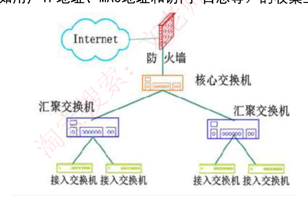
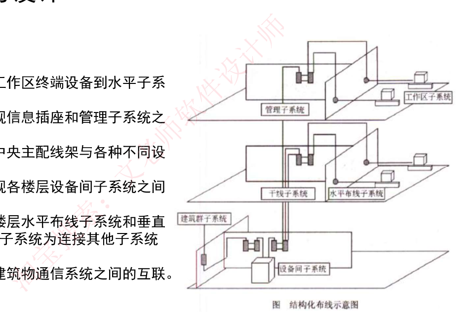
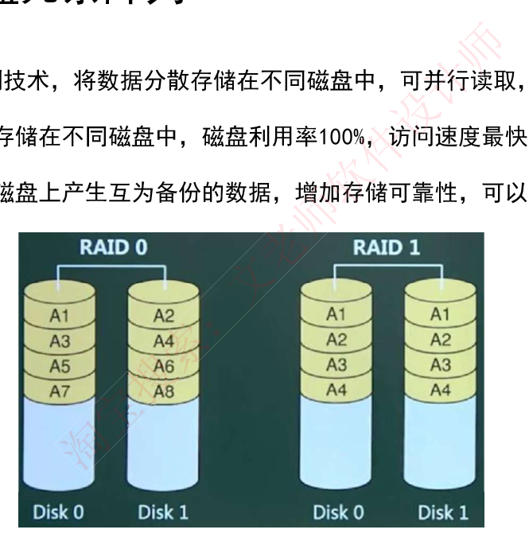
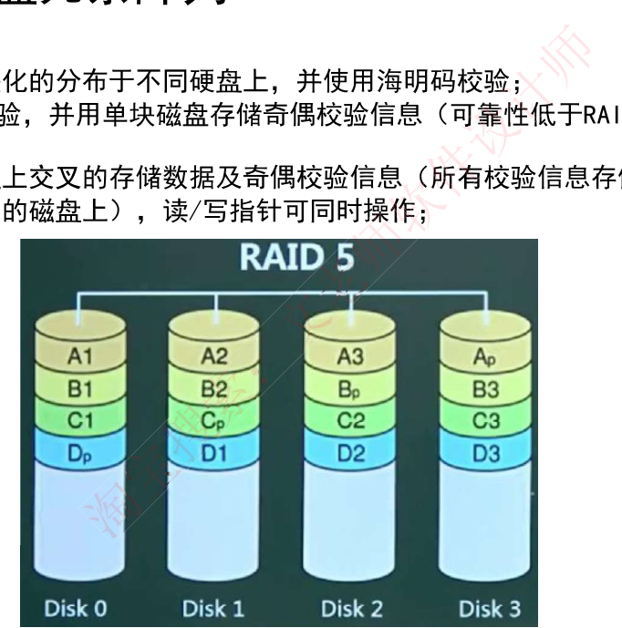
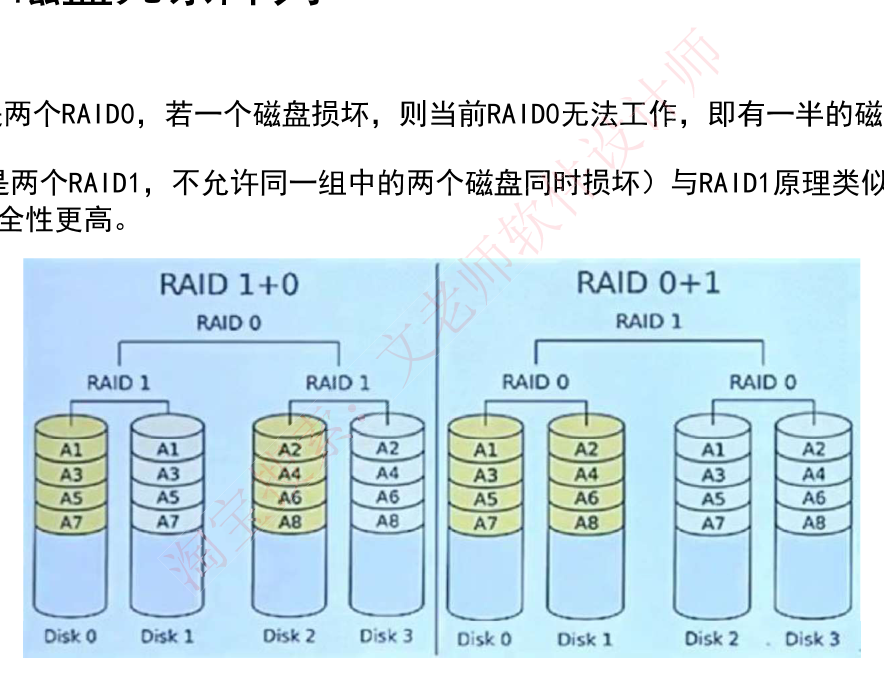
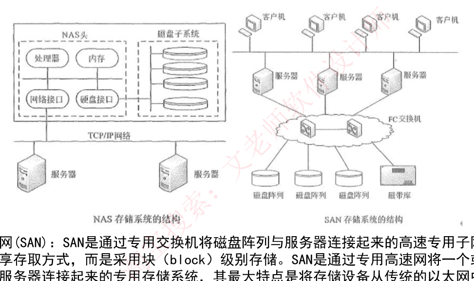

# 43 · 计算机网络补充：网络规划 / 综合布线 / RAID / 网络存储

> 真题：核心层职责、水平子系统（外部资料，年份待核实）；其余模拟｜无计算｜未讲（09-04 补缺课）

---

## 第 0 层 · 定位

**这一课回答**：设备怎么摆、盘怎么放：网络规划三层模型（核心/汇聚/接入）、综合布线子系统、RAID 级别与利用率、DAS/NAS/SAN 存储方案。

**前后关系**：41/42 讲数据怎么跑，本课讲物理组网；RAID1 镜像与 07 的并联可靠性思想呼应，但不考公式。

**分值与去向**：板块 7–9 分；下午不考。全是分类辨析，零计算。

---

## 第 1 层 · 理解

### 一句话

> 这一章讲的是**"把网络和存储真正搭起来"时的四组工程约定**：**交换机分几层摆（三层模型）、网线怎么走楼（综合布线）、硬盘怎么组阵列（RAID）、存储设备怎么接（DAS/NAS/SAN）**。它不讲协议，只讲**物理拓扑和设备选型**。

### 痛点：四个"工程现场"的问题

- **"公司要建新办公楼的网络，交换机该买几台、怎么连？"** —— 全接一起？分层接？**这是三层模型要回答的。**
- **"网线从机房到工位，中间要经过几段？每段叫什么？"** —— 施工方问你要布线方案，你说不上术语。**这是综合布线 PDS。**
- **"服务器插 4 块盘，做 RAID0 还是 RAID5？"** —— RAID0 快但没冗余，RAID1 安全但只能用一半容量，RAID5 折中——**你得说得出每种的技术和利用率。**
- **"我们的存储要直接插服务器，还是走网络？"** —— DAS / NAS / SAN 三条路，**各有各的适用场景。**

### 一条主线

```
网络工程的四个尺度，从大到小：
   ↓
【尺度①：整栋楼/整个园区的交换机怎么分层】
    全部平接 → 广播风暴、无法管理、瓶颈集中
    → 分成三层，每层职责单一：
         核心层：不同区域之间的【最佳路由和高速数据传送】—— 只管快，不做检查
         汇聚层：连接接入层到核心层，实施【安全、流量、负载、路由】策略 —— 干脏活
         接入层：让用户接进来，负责【用户信息收集和用户管理】（认证计费）
    → 记忆：【核心快、汇聚策略、接入认证】
   ↓
【尺度②：楼里的线怎么走】
    综合布线系统 PDS 分六个子系统，按"从工位往机房"的路径串一遍：
         工作区子系统   —— 终端设备 ↔ 信息插座
         水平布线子系统 —— 信息插座 ↔ 管理子系统（楼层内水平走线）
         管理子系统     —— 楼层的配线间（连接水平与垂直）
         垂直干线子系统 —— 各楼层设备间之间（楼与楼层之间竖着走）
         设备间子系统   —— 中央主配线架 ↔ 各种设备
         建筑群子系统   —— 各建筑物之间
    → 记忆：【工位→水平→管理→垂直→设备间→楼群】，由内向外
   ↓
【尺度③：一台机器里的硬盘怎么组】
    RAID：把多块盘当一块用，在【速度】和【冗余】之间取舍
         RAID0 只分散不冗余 → 利用率 100%，最快，无容错
         RAID1 互为镜像     → 利用率 50%，能纠错
         RAID2 海明码校验
         RAID3 奇偶校验，校验信息放【单块盘】
         RAID5 校验信息【分布存储在各盘】，读写指针可同时操作
         RAID0+1 / 1+0 → 利用率 50%，安全性更高
   ↓
【尺度④：存储设备怎么接到服务器/网络上】
    DAS 直接用 SCSI 线插服务器  —— 硬件堆叠，依赖服务器，扩展受限
    NAS 通过网络接口连网络     —— 独立存储系统，【文件级】共享，即插即用
    SAN 专用高速网连接         —— 【块级】存储，存储从以太网中分离出来
```

**一句话收口**：`三层模型管交换机怎么摆，PDS 管网线怎么走，RAID 管硬盘怎么组，DAS/NAS/SAN 管存储怎么接。`

---

## 第 2 层 · 考点：考试怎么问

### 考点① 层次化网络模型（三层）——高频

| 层 | 职责（**原文表述，务必背准**） |
|---|---|
| **核心层** | 提供**不同区域之间的最佳路由和高速数据传送** |
| **汇聚层** | **将网络业务连接到接入层**，并且**实施与安全、流量、负载和路由相关的策略** |
| **接入层** | 为用户提供**在本地网段访问应用系统的能力**，解决相邻用户之间的互访需要；负责**用户信息（IP 地址、MAC 地址、访问日志等）的收集工作和用户管理功能（认证和计费等）** |



**题目长什么样**：
> 以下关于层次化局域网模型中**核心层**的叙述，正确的是（ ）。
> A. 为了保障安全性，对分组要进行有效性检查
> B. **将分组从一个区域高速地转发到另一个区域**
> C. 由多台二、三层交换机组成
> D. 提供多条路径来缓解通信瓶颈
> **答案：B**　【真题·年份待核实】

**怎么解**：**核心层的唯一使命是"快"**。凡是选项里出现"**检查、安全、策略、过滤**"，那是**汇聚层**的活；出现"**用户接入、认证、计费**"，那是**接入层**的活。

**陷阱**：
- ⚠️ **A 是最强干扰项**——"对分组进行有效性检查"听起来很合理，但**核心层不做任何检查**，检查会拖慢速度。安全检查是**汇聚层**的职责。
- ⚠️ 记住这句口诀：**核心层只管快，不管对不对。**

---

### 考点② 综合布线系统 PDS（六个子系统）——高频

| 子系统 | 连接的两端（**这是判题的唯一依据**） |
|---|---|
| **工作区子系统** | **工作区终端设备 ↔ 水平子系统的信息插座** |
| **水平布线子系统** | **信息插座 ↔ 管理子系统** |
| **设备间子系统** | **中央主配线架 ↔ 各种不同设备** |
| **垂直干线子系统** | **各楼层设备间子系统之间**的互连 |
| **管理子系统** | 连接**各楼层水平布线子系统和垂直干缆线**，为连接其他子系统提供连接手段 |
| **建筑群子系统** | **各个建筑物通信系统之间**的互联 |



**题目长什么样**：
> 结构化布线系统分为六个子系统，其中**水平子系统**（ ）。
> A. 由各种交叉连接设备以及集线器和交换机等设备组成
> B. **连接了干线子系统和工作区子系统**
> C. 由终端设备到信息插座的整个区域组成
> D. 实现各楼层设备间子系统之间的互连
> **答案：B**　【真题·年份待核实】
> **解析**：水平子系统是指从**楼层管理间到信息插口**这一段，它连接了**垂直干线子系统与工作区子系统**。

**怎么解**：**每个子系统只需记住它连接的两端**。用一条"从工位到机房"的路径串起来：

```
【终端设备】—工作区子系统—【信息插座】—水平布线子系统—【管理子系统(楼层配线间)】
   —垂直干线子系统—【设备间子系统(中央主配线架)】—建筑群子系统—【其他建筑物】
```

**陷阱**：
- ⚠️ **C 是最强干扰项**——"由终端设备到信息插座的整个区域"是**工作区子系统**，不是水平子系统。
- ⚠️ **D 是垂直干线子系统**的定义。
- ⚠️ **"水平"指楼层内横着走，"垂直"指楼层间竖着走**——从字面就能记。

---

### 考点③ RAID 各级别（高频，要能说出技术 + 利用率）

| 级别 | 技术 | 磁盘利用率 | 容错 |
|---|---|---|---|
| **RAID0** | 数据**分散存储**在不同磁盘，可并行读取 | **100%** | **无冗余、无错误修复**，**访问速度最快** |
| **RAID1** | 成对独立磁盘上产生**互为备份**的数据（镜像） | **50%** | **可纠错**，增加存储可靠性 |
| **RAID2** | 数据条块化分布，使用**海明码校验** | — | 可纠错 |
| **RAID3** | 使用**奇偶校验**，用**单块磁盘**存储奇偶校验信息 | — | **可靠性低于 RAID5** |
| **RAID5** | 在**所有磁盘上交叉存储**数据及奇偶校验信息（校验总量为一个磁盘容量，但**分布式存储**），**读/写指针可同时操作** | — | 可容错 |
| **RAID0+1** | 两个 RAID0 组成。**若一个磁盘损坏，则当前 RAID0 无法工作，即有一半的磁盘无法工作** | **50%** | 安全性更高 |
| **RAID1+0** | 两个 RAID1 组成。**不允许同一组中的两个磁盘同时损坏** | **50%** | 安全性更高 |







**记忆抓手（按"校验方式"串）**：
> **0 = 只分散不校验（最快，利用率 100%）**
> **1 = 镜像（利用率 50%）**
> **2 = 海明码**
> **3 = 奇偶校验，校验放"单盘"**
> **5 = 奇偶校验，校验"分布存"（比 3 可靠）**

**陷阱**：
- ⚠️ **RAID3 和 RAID5 的唯一区别是"校验信息放哪"**：3 放单块专用盘（那块盘成为瓶颈和单点），5 分散放在所有盘上 → **RAID3 可靠性低于 RAID5**。
- ⚠️ **RAID0 没有任何容错**——名字里有 0，容错也是 0。
- ⚠️ **RAID0+1 和 1+0 都是 50% 利用率**，区别在损坏容忍：0+1 坏一块就废掉半边；1+0 只要不是同一组的两块同时坏就还能撑。

---

### 考点④ DAS / NAS / SAN 三种存储方案（高频辨析）

| 方案 | 全称 | 怎么连 | 存取级别 | 关键特征 |
|---|---|---|---|---|
| **DAS** | 直接附加存储 | 通过 **SCSI 接口直接连接到一台服务器** | — | **硬件的堆叠**，存储操作**依赖于服务器**，**不带任何存储操作系统** |
| **NAS** | 网络附加存储 | 通过**网络接口与网络直接相连** | **文件级** | **有独立的存储系统**，类似专用文件服务器；**支持即插即用**；客户机与存储设备**直接数据访问，无需文件服务器干预** |
| **SAN** | 存储区域网 | 通过**专用交换机**将磁盘阵列与服务器连接的**高速专用子网** | **块（block）级** | **将存储设备从传统以太网中分离出来**，成为独立的存储区域网络 |

**DAS 存在的问题**：
> 在**传递距离、连接数量、传输速率**等方面都受到限制；**容量难以扩展升级**；数据处理和传输能力降低；**服务器异常会波及存储器**。

**NAS 的性能特点**：
> 进行**小文件级的共享存取**；**支持即插即用**；可以很经济地解决存储容量不足的问题，**但难以获得满意的性能**。

**SAN 的技术分类**（按数据传输采用的协议）：
> **FC SAN（光纤通道）、IP SAN（IP 网络）、IB SAN（无限带宽）**



**一句话区分（最容易考的点）**：
> **DAS 直连服务器（依赖服务器）；NAS 走普通网络、文件级；SAN 走专用网络、块级。**

**陷阱**：
- ⚠️ **NAS 是文件级，SAN 是块级**——这是两者最本质的区别，也是最常考的一句。
- ⚠️ **DAS 不带存储操作系统**（它只是硬件堆叠），NAS **有独立存储系统**。

---

## 完整算例

### 算例 A：给场景选网络层次

**题目【模拟】**：某公司新建办公楼网络，下列四项需求分别应由三层模型的哪一层承担？

| # | 需求 |
|---|---|
| ① | 员工电脑接入网络，并记录每台电脑的 IP、MAC 和上网日志 |
| ② | 对研发部与财务部之间的访问设置 ACL 访问控制策略 |
| ③ | 保证不同楼栋之间的数据传输带宽最大、时延最小 |
| ④ | 对来自各楼层的流量做负载均衡后再送往上层 |

**分步解**：

**①** "员工电脑**接入**网络"+"**收集用户信息**（IP、MAC、日志）" → 接入层的标准职责（"负责用户信息的收集工作和用户管理功能"）→ **接入层**

**②** "设置**访问控制策略**" → 汇聚层职责里的"实施与**安全**……相关的策略" → **汇聚层**

**③** "不同楼栋之间"+"带宽最大、时延最小" → 核心层职责"提供不同区域之间的**最佳路由和高速数据传送**" → **核心层**

**④** "**负载均衡**" → 汇聚层职责里明确列有"**负载**" → **汇聚层**

**答案**：① 接入层　② 汇聚层　③ 核心层　④ 汇聚层

> 💡 **判别口诀**：**看到"用户/认证/计费/信息收集"→接入；看到"安全/策略/流量/负载/路由"→汇聚；看到"高速/区域之间/最佳路由"→核心。**

---

### 算例 B：RAID 选型推演

**题目【模拟】**：某服务器有 4 块 1TB 硬盘，下列三种业务分别应选哪种 RAID？说明可用容量。

| # | 业务 |
|---|---|
| ① | 视频转码的临时暂存盘，数据丢了可以重新生成，要求速度最快 |
| ② | 财务核心数据库，绝对不能丢数据，预算充足 |
| ③ | 公司文件服务器，要兼顾容量、速度和一定的容错 |

**分步解**：

**①** 关键词"**数据丢了可以重新生成**"（不需要冗余）+"**速度最快**" → **RAID0**
- 可用容量 = 4 × 1TB × 100% = **4TB**
- 理由：RAID0 磁盘利用率 100%，访问速度最快，无冗余正好符合需求。

**②** 关键词"**绝对不能丢数据**"+"**预算充足**"（能接受牺牲一半容量） → **RAID1**（或 RAID1+0）
- 可用容量 = 4 × 1TB × 50% = **2TB**
- 理由：RAID1 互为镜像，可靠性最高。若要兼顾性能可选 **RAID1+0**（两组 RAID1 再条带化），利用率同样 50%，"不允许同一组中的两个磁盘同时损坏"。

**③** 关键词"**兼顾容量、速度和一定的容错**" → **RAID5**
- 可用容量 = **3TB**（校验信息总量占一块盘的容量，但分布存储在 4 块盘上）
- 理由：RAID5 校验信息分布式存储，读写指针可同时操作，可靠性高于 RAID3，利用率高于 RAID1。

**答案**：① RAID0，4TB　② RAID1（或 1+0），2TB　③ RAID5，3TB

> 💡 **RAID5 可用容量的算法**：**n 块盘中，校验占一块的容量** → 可用 = (n−1) × 单盘容量。4 块 1TB → 3TB。

---

### 算例 C：三种存储方案对号入座

**题目【模拟】**：判断下列场景应选 DAS、NAS 还是 SAN。

| # | 场景 |
|---|---|
| ① | 小型工作室，一台服务器需要扩容，直接插一个磁盘柜就行 |
| ② | 设计部门需要一个所有人都能通过网络访问的共享文件盘，要求即插即用、成本低 |
| ③ | 数据中心的数据库集群，多台服务器要以块设备方式共享高速存储，走独立的光纤网络 |

**分步解**：

**①** "**直接插**一台服务器" → **DAS**（通过 SCSI 接口直接连接到一台服务器）
- 注意其局限：传递距离、连接数量、传输速率受限，**服务器异常会波及存储器**。

**②** "所有人**通过网络**访问的**共享文件盘**"+"**即插即用**"+"**成本低**" → **NAS**
- 特征全部命中：文件级共享、支持即插即用、"可以很经济地解决存储容量不足的问题"。
- ⚠️ 但要提醒：NAS "**难以获得满意的性能**"，不适合场景 ③。

**③** "**块设备**方式"+"**独立的光纤网络**" → **SAN**（FC SAN）
- 特征命中：块级存储、通过专用交换机连接、将存储设备从传统以太网中分离出来。

**答案**：① DAS　② NAS　③ SAN

---

## 速记

**1. 三层模型职责**
> **核心层只管快（最佳路由 + 高速传送，不做检查）**
> **汇聚层管策略（安全、流量、负载、路由）**
> **接入层管用户（本地访问 + 用户信息收集 + 认证计费）**

**2. 综合布线六子系统（从工位往机房串）**
> **工作区（终端↔插座）→ 水平（插座↔管理）→ 管理（楼层配线间）→ 垂直干线（楼层之间）→ 设备间（主配线架↔设备）→ 建筑群（楼与楼）**
> **水平=楼层内横走，垂直=楼层间竖走**

**3. RAID 按校验方式串**
> **0 不校验（100%，最快，无容错）；1 镜像（50%）；2 海明码；3 奇偶校验放单盘；5 奇偶校验分布存（比 3 可靠）**
> **0+1 和 1+0 都是 50%**
> **RAID5 可用容量 = (n−1) × 单盘**

**4. 三种存储方案**
> **DAS 直连服务器（SCSI，硬件堆叠，无存储 OS，依赖服务器）**
> **NAS 走普通网络，文件级，即插即用，性能一般**
> **SAN 走专用交换机，块级，从以太网分离出来**
> **一句话：DAS 直插、NAS 文件级、SAN 块级**

**5. 最容易考错的三处**
> **核心层不做安全检查（那是汇聚层）**
> **水平子系统连"插座↔管理"，不是"终端↔插座"（那是工作区）**
> **RAID3 校验放单盘，可靠性低于 RAID5**

---

## 自测练习

**练习 1【模拟】** 在层次化网络设计模型中，负责实施与安全、流量、负载和路由相关策略的是（ ）。
A. 核心层　B. 汇聚层　C. 接入层　D. 应用层

**练习 2【模拟】** 综合布线系统中，实现各楼层设备间子系统之间互连的是（ ）子系统；由终端设备到信息插座的整个区域组成的是（ ）子系统。
A. 工作区　B. 水平布线　C. 垂直干线　D. 管理

**练习 3【模拟】** 某服务器配置 6 块 2TB 硬盘组建 RAID5，则可用存储容量为（ ）TB；若改为 RAID1，可用容量为（ ）TB。
A. 6　B. 8　C. 10　D. 12

**练习 4【模拟】** 以下关于网络存储技术的叙述中，正确的是（ ）。
A. DAS 具有独立的存储操作系统，不依赖服务器
B. NAS 采用块级存储方式，性能优于 SAN
C. SAN 通过专用交换机连接，采用块级存储，将存储设备从传统以太网中分离
D. NAS 无法通过网络共享，只能本地访问

---

### 参考答案

**练习 1：B**
汇聚层的标准表述是"将网络业务连接到接入层，并且实施与**安全、流量、负载和路由**相关的策略"——四个关键词全部命中。
- 排除 A：核心层只提供"不同区域之间的最佳路由和高速数据传送"，**不做策略检查**。
- 排除 C：接入层负责用户接入与用户信息收集/管理（认证计费）。
- 排除 D：三层模型没有"应用层"。

**练习 2：C　A**
- "实现各楼层**设备间子系统之间**的互连" → **垂直干线子系统**
- "由**终端设备到信息插座**的整个区域" → **工作区子系统**
> ⚠️ 注意水平布线子系统连接的是"**信息插座 ↔ 管理子系统**"，不要和工作区混。

**练习 3：C　A**
- **RAID5**：校验信息总量占一块盘的容量（分布存储），可用 = (n−1) × 单盘 = (6−1) × 2TB = **10TB**
- **RAID1**：磁盘利用率 **50%**，可用 = 6 × 2TB × 50% = **6TB**

**练习 4：C**
- A 错：DAS **不带任何存储操作系统**，且存储操作**依赖于服务器**，服务器异常会波及存储器。
- B 错：**NAS 是文件级**（小文件级共享存取），**SAN 才是块级**；且 NAS "难以获得满意的性能"。
- C 正确：SAN 通过专用交换机连接，采用块级存储，最大特点是把存储设备从传统以太网中分离出来。
- D 错：NAS 正是**通过网络接口与网络直接相连、由用户通过网络访问**的。

---

## 考题回顾

| # | 出处 | 考点 | 状态 |
|---|---|---|---|
| 1 | 上午·核心层职责（外部资料转录 05） | 三层模型核心层 | 已作为考点①例题，**年份待核实** |
| 2 | 上午·水平子系统（外部资料转录 05） | 综合布线六子系统 | 已作为考点②例题，**年份待核实** |

> ⚠️ **本课练习尚未作答**，需在课堂检验环节收题批改后回填。
> ⚠️ **考频提示**：本课四块内容在 `计划/00-总体计划.md` 的「近5年真题核对结果」里**均未出现**——那份清单是 2026-08-14 交叉检索 2021–2025 真题得出的。这说明本课内容**在近 5 年真题中的出现频率可能不高**。建议按"**扫一眼、能认出**"的强度处理，不要投入过多时间；若第二轮真题轮中确实遇到，再回头精读。
