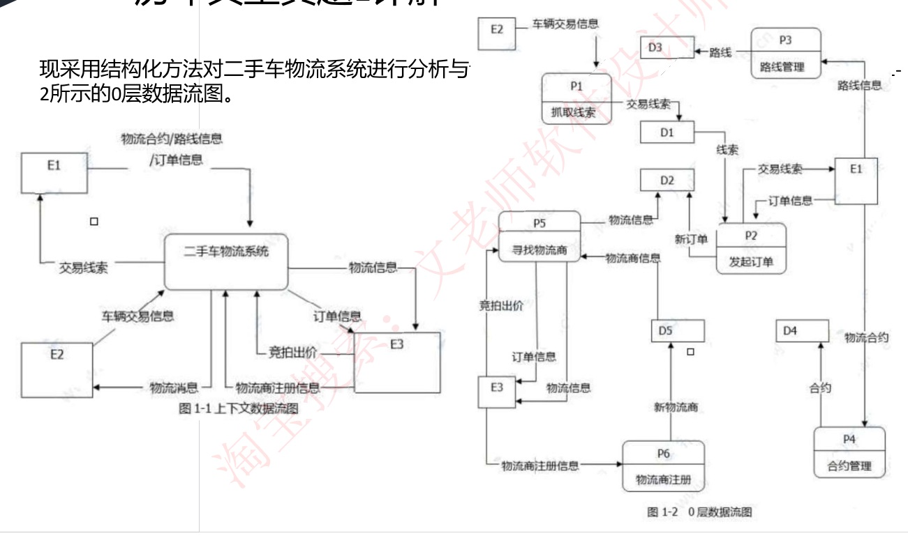
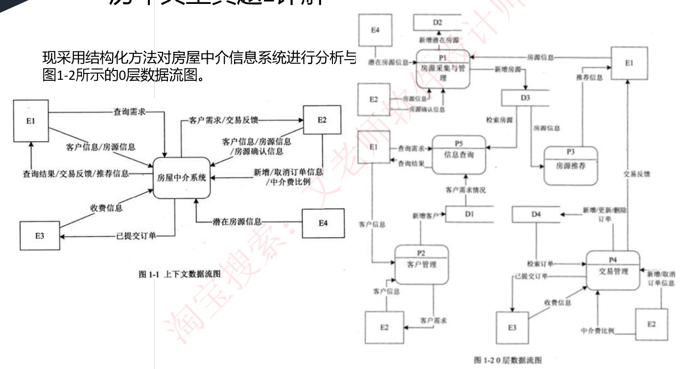

# 49 · 下午题 1：数据流图 DFD 实战

> 真题：二手车物流系统 2019 下、房屋中介信息系统 2018 下，两道完整的下午试题一，取自培训资料《案例分析专题》第一部分（年份 2026-09-06 审核核实）｜无公式，四问套路要练熟｜未讲

---

## 定位

**这一课回答**：下午题 1（DFD，15 分必答）的四问怎么答。

**前后关系**：DFD 的符号本课第一节自含，不必先看讲义 21；48 定了它排答题顺序第 3 位、用时 18 分钟、目标 12 分。

**分值与去向**：15 分，全卷套路最固定的一题，答案全在题干里；无计算，但要练到看见题就知道往哪找。

---

## 开讲：先认符号，再一起做一道真题

这道题的形态很固定：一段业务说明，加两张挖了空的数据流图，让你把空填回去。它不是设计题，是阅读理解。先花五分钟认清图上的东西，然后我带你从头到尾做一道真题，第二道你自己做。

### 一、图上有什么

数据流图描述**数据在系统中怎么被传送和变换**，用来对功能建模。图上只有四种东西，考试里靠编号前缀认，不靠形状：

- **外部实体**，编号 E1、E2……，画成方框。系统之外的人、部门、组织或另一个系统，是数据的来源（源）或去处（宿）。判据是"系统管不管得着它"，管不着的就是外部实体。
- **加工**，编号 P1、P2……，画成圆或圆角矩形。把输入数据流变成输出数据流的动作。
- **数据存储**，编号 D1、D2……。教材画法是双横线或右边开口的矩形，真题扫描件里常常就是个方框，和 E 长得一样，所以认编号。它是系统要记住的东西，一张表或一个文件。
- **数据流**，就是箭头，一组固定成分的数据在流动。一根箭头上标着 A/B/C，表示三条流共用一根线。

图是分层的。**顶层图**，真题图上叫"上下文数据流图"，就是图 1-1：只有一个加工代表整个系统，画的是系统和外部实体之间的数据流，按考试惯例这一层不画数据存储。

**0 层图**是图 1-2：把系统拆成若干加工 P1～Pn，数据存储从这一层开始出现，外部实体在这一层照样出现，为了画图不交叉同一个实体可能画好几次（房屋中介题的 0 层图里 E2 画了三次）。上一层叫父图，拆出来的下一层叫子图，子图的输入输出必须和父图对应加工的一致，这叫**父图与子图平衡**，一会儿做题会用到它。

带做时真正会用到的规则只有四条，先记这四条：**外部实体之间不能直接连线，外部实体和数据存储之间不能直接连线，数据存储之间不能直接连线**，也就是数据流必须经过加工；**每个加工既要有输入又要有输出**。

加工画错有三种典型情况：只有输入没有输出叫**黑洞**，只有输出没有输入叫**奇迹**，输入不足以产生输出叫**灰洞**。完整的八条原则放在第四节，第四问概念简答才需要。

图只画了数据流动，没说每个东西是什么，所以要配**数据字典**：为每个数据流、文件、加工和数据项做说明，写法用四个符号，`=` 被定义为，`+` 与，`[a|b]` 或，`{a}` 重复 0 到多次，例如"客户信息 = 姓名 + 手机号"。加工内部的逻辑叫**小说明**，三种写法：结构化语言、判定表、判定树。

### 二、跟我做一道真题：二手车物流系统

【真题·2019下】

**【说明】** 某公司欲开发一款二手车物流系统，以有效提升物流成交效率。该系统的主要功能是：

1. 订单管理：系统抓取线索，将车辆交易系统的交易信息抓取为线索。帮买顾问看到有买车线索后，会打电话询问买家是否需要物流，若需要，帮买顾问就将这个线索发起为订单并在系统中存储，然后系统帮助买家寻找物流商进行承运。
2. 路线管理：帮买顾问对物流商的路线进行管理，存储的路线信息包括路线类型、物流商、起止地点。路线分为三种，即固定路线、包车路线、竞拍体系，其中固定路线和包车路线是合约制。包车路线的发车时间由公司自行管理，是订单的首选途径。
3. 合约管理：帮买顾问根据公司与物流商确定的合约，对合约内容进行设置，合约信息包括物流商信息、路线起止城市、价格、有效期等。
4. 寻找物流商：系统根据订单的类型（保卖车、全国购和普通二手车）、起止城市，需要的服务模式（买家接、送到买家等）进行自动派发或以竞拍体系方式选择合适的物流商。即：有新订单时，若为保卖车或全国购，则直接分配到竞拍体系中；否则，若符合固定路线和/或包车路线，系统自动分配给合约物流商，若不符合固定路线和包车路线，系统将订单信息分配到竞拍体系中。竞拍体系接收到订单后，将订单信息推送给有相关路线的物流商，物流商对订单进行竞拍出价，最优报价的物流商中标。最后，给承运的物流商发送物流消息，更新订单的物流信息，给车辆交易系统发送物流信息。
5. 物流商注册：物流商账号的注册开通。



**【问题 1】（3 分）** 使用说明中的词语，给出图 1-1 中的实体 E1～E3 的名称。
**【问题 2】（5 分）** 使用说明中的词语，给出图 1-2 中的数据存储 D1～D5 的名称。
**【问题 3】（4 分）** 根据说明和图中术语，补充图 1-2 中缺失的数据流及其起点和终点。
**【问题 4】（3 分）** 根据说明，采用结构化语言对"P5：寻找物流商"的加工逻辑进行描述。

**我先做三件事，再读说明。** 第一，看四个问题：知道要填 3 个实体、5 个存储、若干条数据流、一段伪代码；问题 1、2 都写着"使用说明中的词语"，这是评分约束，答案必须用说明里的原词。第二，看图：图 1-2 上有 6 个加工 P1～P6，每个都带着名字。第三，把说明的 5 条功能和 6 个 P 对上号，因为一条功能可能拆成两个加工：

| 说明 | 图上的加工 |
|---|---|
| 1 订单管理 | P1 抓取线索、P2 发起订单 |
| 2 路线管理 | P3 路线管理 |
| 3 合约管理 | P4 合约管理 |
| 4 寻找物流商 | P5 寻找物流商 |
| 5 物流商注册 | P6 物流商注册 |

对上号之后读说明，每句话都知道该去图上哪个加工附近找。

**问题 1，找外部实体。** 看顶层图，E1 连着流进系统的"物流合约/路线信息/订单信息"和流出的"交易线索"。回说明里搜：路线是帮买顾问管理的，合约是帮买顾问设置的，订单是帮买顾问发起的，三件事一个人做，**E1 = 帮买顾问**。E2 流进系统的是"车辆交易信息"，说明第 1 条说"将车辆交易系统的交易信息抓取为线索"，**E2 = 车辆交易系统**。E3 流进系统的是"竞拍出价、物流商注册信息"，说明第 4、5 条说物流商竞拍出价、物流商注册，**E3 = 物流商**。

我每次都先看"流进系统"的箭头，原因是入流的名字说的是这个实体**提供什么**，说明里"谁上传了什么、谁发起了什么、谁注册"直接能搜到；出流是系统发出去的东西，名字泛，还可能被出题人标错。

这道题就标错了：说明里说"给承运的物流商发送物流**消息**、给车辆交易系统发送物流**信息**"，培训资料的图上却是系统流向 E2 标"物流消息"、流向 E3 标"物流信息"，正好反了。用入流当锚点就不受它影响。培训资料自己也提醒过，部分真题不太严谨。

**问题 2，找数据存储。** 数据存储在 0 层图上，看每个 D 的进出箭头，流进去的是它要存的，流出来的是谁要读它。命名规则：说明里给了存储的名字就直接抄，只给了内容没给名字的，用内容的原词加"表"或"信息表"：

| 存储 | 图上进出 | 说明里的依据 | 答案 |
|---|---|---|---|
| D1 | P1 抓取线索 → D1 交易线索；D1 → P2 线索 | "抓取为线索" | 交易线索信息表 |
| D2 | P2 → D2 新订单；P5 → D2 物流信息；没有出流 | "发起为订单并在系统中存储" | 订单信息表 |
| D3 | P3 → D3 路线；没有出流 | "存储的路线信息包括……" | 路线信息表 |
| D4 | P4 → D4 合约；没有出流 | "合约信息包括……" | 合约信息表 |
| D5 | P6 → D5 新物流商；D5 → P5 物流商信息 | "物流商账号的注册开通" | 物流商信息表 |

注意 D2、D3、D4 都只有入流没有出流。存进去没人读，这不合理，说明有箭头没画，正好是下一问的入口。

**问题 3，补缺失的数据流。** 方法只有一个：**拿说明逐句去图上核对**。培训资料的原话是，一开始就去考虑数据守恒、父子图平衡，最终还是要回来核对说明，不如一开始就直接核对。每读到一句"谁把什么给了谁"，去图上找那根箭头。我把五条全部走一遍，让你看到"对上了"和"没对上"各是什么样：

- 第 1 条。"将车辆交易系统的交易信息抓取为线索"，图上 E2 → P1 车辆交易信息、P1 → D1 交易线索，有。"帮买顾问看到有买车线索"，P2 → E1 交易线索，有。"发起为订单并在系统中存储"，E1 → P2 订单信息、P2 → D2 新订单，有。这一条全对上，不用记。
- 第 2 条。"帮买顾问对路线进行管理，存储路线信息"，E1 → P3 路线信息、P3 → D3 路线，有。
- 第 3 条。"帮买顾问对合约内容进行设置"，E1 → P4 物流合约、P4 → D4 合约，有。
- 第 4 条，问题都在这里。"系统根据订单的类型、起止城市"，P5 要读订单，找 D2 → P5，**没有，记一条**。"若符合固定路线和/或包车路线"，P5 要读路线，找 D3 → P5，**没有，记一条**。"自动分配给合约物流商"，P5 要查合约，找 D4 → P5，**没有，记一条**。"将订单信息推送给有相关路线的物流商"，P5 → E3 订单信息，有。"物流商对订单进行竞拍出价"，E3 → P5 竞拍出价，有。"给承运的物流商发送物流消息"，看着像缺，其实图上 P5 → E3 有一条标"物流信息"，就是它，只是标签用词和说明不一致，不算缺。"更新订单的物流信息"，P5 → D2 物流信息，有。"给车辆交易系统发送物流信息"，找 P5 → E2，**没有，记一条**。
- 第 5 条。"物流商账号的注册开通"，E3 → P6 物流商注册信息、P6 → D5 新物流商，有；D5 → P5 物流商信息也有。

记下的刚好四条，和 4 分对上：

| 起点 | 终点 | 名称 |
|---|---|---|
| D2 | P5 | 新订单信息 |
| D3 | P5 | 路线信息 |
| D4 | P5 | 合约信息 |
| P5 | E2 | 物流信息 |

方向别写反。"给 X 发送 Y"，发送方是加工，X 是终点；"根据 X"，X 是起点，X 通常是某个数据存储，因为说明前文已经说过这些数据"在系统中存储"，读的自然是存下来的那份。流进存储是写，流出存储是读。名称优先复用图上已有的同类标签。填完用第一节那四条规则扫一遍：没有实体连实体、存储连存储，P5 补上输入后不再是灰洞。

**问题 4，结构化语言写 P5。** 结构化语言就是带缩进的伪代码，中文可以。从说明第 4 条抄结构：整体是"有新订单时"的循环；里面第一层判断是不是保卖车或全国购，是就进竞拍；否则第二层判断符不符合固定或包车路线，符合给合约物流商，不符合进竞拍；最后三句收尾动作照抄。

```
while (有新订单) {
    if (订单类型 == "保卖车或全国购")
        分配到竞拍体系;
    else {
        if (订单路线 == "固定路线和/或包车路线")
            分配给合约物流商;
        else
            分配到竞拍体系;
    }
    给承运的物流商发送物流消息;
    更新订单的物流信息;
    给车辆交易系统发送物流信息;
}
```

培训资料的参考答案还写了竞拍体系这一段的循环：收到订单，推送给有相关路线的物流商，物流商出价，最优报价中标。说明第 4 条里竞拍流程确实属于"寻找物流商"，评分点可能包含它，时间允许就补上。

### 三、第二道你自己做：房屋中介信息系统

【真题·2018下】。先别看答案，按上面的顺序走：先看问题，再看图数 E、D、P 并和说明对上号，再逐句读说明。

**【说明】** 某房产中介连锁企业欲开发一个基于 Web 的房屋中介信息系统，以有效管理房源和客户，提高成交率。该系统的主要功能是：

1. 房源采集与管理：系统自动采集外部网站的潜在房源信息，保存为潜在房源。由经纪人联系确认的潜在房源变为房源，并添加出售/出租房源的客户。由经纪人或客户登记的出售/出租房源，系统将其保存为房源。房源信息包括基本情况、配套设施、交易类型、委托方式、业主等。经纪人可以对房源进行更新等管理操作。
2. 客户管理：求租/求购客户进行注册、更新，推送客户需求给经纪人，或由经纪人对求租/求购客户进行登记、更新。客户信息包括身份证号、姓名、手机号、需求情况、委托方式等。
3. 房源推荐：根据客户的需求情况（求购/求租需求情况以及出售/出租房源信息），向已登录的客户推荐房源。
4. 交易管理：经纪人对租售客户双方进行交易信息管理，包括订单提交和取消，设置收取中介费比例。财务人员收取中介费之后，表示该订单已完成，系统更新订单状态和房源状态，向客户和经纪人发送交易反馈。
5. 信息查询：客户根据自身查询需求查询房屋供需信息。



**【问题 1.1】（4 分）** 使用说明中的词语，给出图 1-1 中的实体 E1-E4 的名称。
**【问题 1.2】（4 分）** 使用说明中的词语，给出图 1-2 中的数据存储 D1-D4 的名称。
**【问题 1.3】（3 分）** 根据说明和图中术语，补充图 1-2 中缺失的数据流及其起点和终点。
**【问题 1.4】（4 分）** 根据说明中术语，给出图 1-1 中数据流"客户信息"、"房源信息"的组成。

提示两点。1.4 是数据字典题，用第一节的 `=` 和 `+` 写。图上 E1 和 P1 之间那条"房源信息"箭头方向印得不清楚，这时回顶层图查：图 1-1 上"客户信息/房源信息"是 E1 流向系统的，所以 0 层图上它是 E1 → P1，这就是父图与子图平衡的实际用处。

**参考答案**（做完再看）：

- 问题 1.1：E1 客户、E2 经纪人、E3 财务人员、E4 外部网站。外部网站不是人，但它是系统管不着的数据来源，是标准的外部实体。
- 问题 1.2：D1 客户信息表、D2 潜在房源信息表、D3 房源信息表、D4 订单表。说明明确区分了"潜在房源"和确认后的"房源"，所以是两张表。
- 问题 1.3：交易反馈 P4 → E2（"向客户和经纪人发送交易反馈"，图上只有 P4 → E1 发给客户的）；客户需求情况 D1 → P3（"根据客户的需求情况推荐"，P3 要读客户信息，名称复用图上 D1 → P5 那条的标签）；房源状态 P4 → D3（"更新订单状态和房源状态"，P4 要写房源表）。另外图上 D2 潜在房源只进不出，说明第 1 条"由经纪人联系确认的潜在房源变为房源"要求 P1 读它，可以再补 D2 → P1 潜在房源信息，有的答案版本列了这条。
- 问题 1.4：客户信息 = 身份证号 + 姓名 + 手机号 + 需求情况 + 委托方式；房源信息 = 基本情况 + 配套设施 + 交易类型 + 委托方式 + 业主。回说明找那句"××信息包括……"照抄，必须列全。

对照两道题：前三问的问法一字不差，换的只是业务的皮。

### 四、收口

四问的方法就是上面做过的：实体看它连的箭头名字回说明搜是谁在做这件事；存储看进出流反推存什么；数据流逐句核对；第四问要求什么形式就写什么形式。几点补充：

- **几分写几条，可以多写。** 按点给分，多写不扣分。多写的判据：每一条都必须能指到说明里的一句原话，指不出来的不写；同一句话只补一条。
- **第三问常有"加工 → 外部实体"这一条**，比如 P5 → E2、P4 → E2。别以为 0 层图上没有实体。
- **第四问有三种形态，3–4 分。** 结构化语言写加工逻辑，写伪代码结构，不写散文、不画判定树；数据字典问组成，照抄"包括"那句；概念简答，比如"为什么 X 不能作外部实体""图中哪条数据流多余、哪个加工是黑洞""说明父图与子图怎么平衡"，用定义和八条原则答，一两句话即可。八条原则完整版：**数据守恒原则**，加工的输出必须能从输入得到；**守恒加工原则**，同一加工的输入输出名字必须不同，即使成分相同；每个加工既有输入又有输出；外部实体之间无数据流；外部实体与数据存储之间无数据流；数据存储之间无数据流；**父图与子图平衡**；数据流必须经过加工。
- 软考下午题官方不公布标准答案，市面答案都是老师校对的，部分真题本身有二义性，不要纠结和答案的细微出入。培训资料对这道题的要求是拿到 12 分以上。

---

## 练习

**【模拟·下午题型】** 某在线教育平台欲开发课程学习系统。主要功能：（1）课程管理：由讲师上传课程，课程信息包括课程名称、章节列表、课时数、价格，系统存储为课程库。（2）选课管理：学员浏览课程后可下单购买，系统调用第三方支付平台完成支付，支付成功后生成选课记录并存储，并向学员返回选课结果。（3）学习跟踪：系统根据学员的学习行为记录其每节课的学习进度，存储为学习记录；学员可查询自己的学习进度。（4）结业管理：当某学员某课程的所有章节学习进度均达 100% 时，系统生成结业证书发送给学员，并将结业信息通知讲师，同时将结业信息保存为结业记录。

0 层图中有加工 P1 课程管理、P2 选课管理、P3 学习跟踪、P4 结业管理，外部实体 E1～E3，数据存储 D1～D4。图上已画出的数据流如下（文字版）：

```
E1 → P1  课程信息          P1 → D1  课程数据
E2 → P2  订单              P2 → E3  支付请求
E3 → P2  支付结果          P2 → E2  选课结果
E2 → P3  学习行为          P3 → D3  学习进度
E2 → P3  进度查询请求      D3 → P3  学习进度
P3 → E2  学习进度          D2 → P3  选课信息
P4 → E1  结业信息          P4 → D4  结业记录
```

1. 使用说明中的词语，给出外部实体 E1～E3 的名称（3 分）。
2. 使用说明中的词语，给出数据存储 D1～D4 的名称（4 分）。
3. 根据说明和图中术语，补充缺失的数据流及其起点和终点（4 分）。
4. 根据说明，采用结构化语言描述"P4：结业管理"的加工逻辑（4 分）。

### 参考答案

1. E1 讲师、E2 学员、E3 第三方支付平台。本题没给顶层图，从 0 层图的进出流反推即可。
2. D1 课程库、D2 选课记录、D3 学习记录、D4 结业记录，四个都是说明原词，直接抄。
3. 逐句核对得四条：D1 → P2 课程信息（"学员浏览课程后可下单"，P2 要读课程库）；P2 → D2 选课记录（"生成选课记录并存储"，图上 D2 只有出流没有入流）；D3 → P4 学习进度（"所有章节学习进度均达 100%"，P4 要读学习记录，图上 P4 没有任何入流，是"奇迹"）；P4 → E2 结业证书（"生成结业证书发送给学员"）。若再补 P2 → E2 课程信息（浏览课程要有返回）、D1 → P4 课程信息（判断"所有章节"要知道章节列表），都能指到说明原句，不扣分。
4.
```
while (学习进度更新) {
    读取该学员该课程各章节的学习记录;
    if (所有章节学习进度 == 100%) {
        生成结业证书并发送给学员;
        将结业信息通知讲师;
        将结业信息保存为结业记录;
    }
}
```
踩分点：有循环或触发；条件是"所有章节"不是"某章节"；三个动作齐全；有读取学习记录的步骤。

---

## 速记

- 先看问题，再看图数 E、D、P 并和说明对上号，最后逐句读说明
- 实体看入流回说明搜角色；存储看进出流，有名抄名、无名原词加表；数据流逐句核对，几分写几条，多写要能指到原句
- "发送给 X" 是加工 → X；"根据 X" 是 X → 加工；进存储是写，出存储是读
- 验算：实体连实体、存储连存储、加工光进不出，三个都不能有
