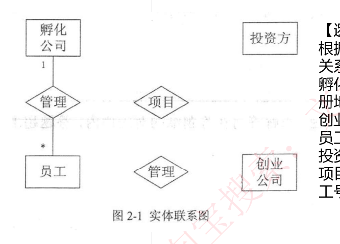
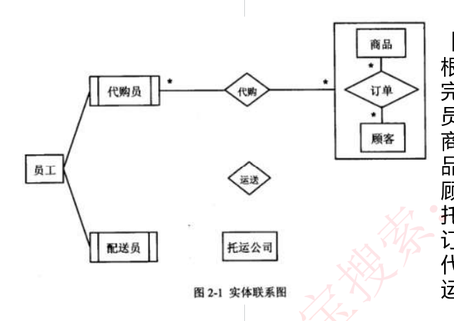

# 50 · 下午题 2：数据库设计实战

> 真题：创业孵化基地 2019 上、海外代购公司 2018 上，两道完整的下午试题二（2019 上核到信管网「软件设计师下午案例分析真题文字版」，2018 上核到希赛网题库标注的试卷归属）｜无公式，三问套路要练熟｜未讲
> 知识点范围：对齐 `外部资源/转录md/15-软件设计师-案例分析专题.md` 第二部分（1-1 E-R 图、1-2 关系模式、1-3 转换规则、解题技巧、Q&A、两道典型真题）

---

## 定位

**这一课回答**：下午题 2（数据库设计，15 分必答）的三问怎么答。

**前后关系**：卷面上那套记号（弱实体双线框、聚合大框、`1` 与 `*`）讲义 30 判为上午题不考，本课第一节自含；转换规则只用 30 的结论，候选码与范式在 31/32，SQL 在 33；48 定了它排答题顺序第 2 位、用时 18 分钟、目标 12 分。

**分值与去向**：15 分，答案几乎全写在题干和卷面已给的关系模式里；不用算，要练的是"这一空该写几个字"。

---

## 开讲：先认卷面上的零件，再一起做一道真题

你天天在建表、写 SQL，但多半没画过 E-R 图（实体联系图，专门画"业务里有哪些东西、东西之间是什么关系"的那张图，不谈字段类型也不谈索引），更没做过"给你一张挖了空的图、让你把线连回去"的题。缺的不是数据库知识，是**手感**：这一空要我写什么、写到什么粒度算得分。先花五分钟认清卷面上的零件，然后我带你从头到尾做一道真题，第二道你自己做。

### 一、卷面上有什么

这道题的形态和试题一那道数据流图题一样固定：一段业务需求，加一张残缺的实体联系图（卷面把它放在小标题【概念模型设计】下面），加一组残缺的**关系模式**（放在【逻辑结构设计】下面；关系模式就是把一张表写成一行文字：`表名(列1，列2，…)`，比如 `员工(工号，姓名)`），三问。

培训资料把三问的形态说死了：「**第一小题补充 E-R 图，第二小题补充关系模式，第三小题是简单的情景问答题**」。

图上的零件只有几种，考试靠形状认，不靠名字：

- **实体**，长方形。业务里客观存在、能相互区别的东西，比如"员工""商品"。
- **属性**，椭圆。实体或联系身上的特性，比如员工的"工号"。真题为了省地方常常**不画属性椭圆**，改在题干里用文字给属性清单，只有要你补属性时才画。
- **联系**，菱形，两端要标**联系类型**（一对一 1:1、一对多 1:N、多对多 M:N）。**注意真题卷面上写的不是 `1:N`，而是 UML 风格的 `1` 和 `*`**（`*` 就是"多个"）——本课两道真题都这样标。讲义 30 提醒过上午选择题按 `1:1／1:N／M:N` 的口径答，那是同一件事的另一种写法，两套记号都要认得。
- **弱实体**，左右各多一道竖线的**双线长方形**。它依赖别的实体才有意义，比如"顾客地址"离开顾客就是一串没主人的文字。培训资料的规则：弱实体和它依赖的强实体「**之间直接用直线连接**，是从属关系，**无联系类型**」——即那根线上不标 `1` 也不标 `*`。培训资料 1-1 的示例图 `images/fig_d15_s019.png` 上，"经理""部门经理""业务员"都是这种双线长方形，各用一根线连到"员工"这个普通长方形上，连线中间还各画了一个小圆圈；本课这两道真题的卷面上都没有那个圆圈，不必记。
- **聚合**，一个把"实体—菱形—实体"一小片图**整个框起来的大矩形**。意思是"这一小片合起来算一个东西"，别的联系连的是这个整体，不是里面的某一个框。海外代购那道题就有一个。

纯文本里画不出这些形状，本课全篇统一用下面这套记号。排法只有一条：**二元联系一行写完**，两端的标注紧挨着各自的框；**三元联系一端一行**，因为一行写不下三头。

```
[名称]      长方形 = 实体
[[名称]]    双线长方形 = 弱实体
〈名称〉     菱形 = 联系
(名称)      椭圆 = 属性（只在下面的图块里当椭圆讲；关系模式那一行里的括号还是括号）
──          连线；紧挨着哪个框写的 1 或 * ，就是那个框那一端的标注
┌名称┐      把一小片图整个框住的大矩形 = 聚合，整块当一个东西用
```

再认关系模式那一半。培训资料的说法是「**关系模式就是以名称和属性名表示一个联系**」，写成 `表名(属性1，属性2，…)`。它给的示范片段是：

```
客户(客户ID、姓名、身份证号、电话、住址、账户余额)
员工(工号、姓名、性别、岗位、身份证号、电话、住址)
家电(家电条码、家电名称、价格、出厂日期、(1))
家电厂商(厂商ID、厂商名称、电话、法人代表信息、厂址、(2))
购买(订购单号、(3)、金额)
```

看清楚 `(1)(2)(3)` 的位置——第 2 问要你填的就是这种空。资料只用这段示范写法、没有给答案，本课不去猜它。两个关键词按培训资料的原话记：**主键**「不能为空，能唯一标识当前关系的属性」；**外键**「其他关系模式的主键或者为空」，而且「**外键可以有多个**」。

真题卷面上，**主键画下划线、外键在属性名后加一个 `#`**；纯文本里画不出下划线，下面凡是原卷带下划线的主键，我写成 `_工号_` 这种形式，`#` 照原样保留。

### 二、跟我做一道真题：创业孵化基地

【真题·2019上】

**【说明】** 某创业孵化基地管理若干孵化公司和创业公司，为规范管理创业项目投资业务，需要开发一个信息系统。请根据下述需求描述完成该系统的数据库设计。

**【需求描述】**
（1）记录孵化公司和创业公司的信息。孵化公司信息包括公司代码、公司名称、法人代表名称、注册地址和一个电话；创业公司信息包括公司代码、公司名称和一个电话。孵化公司和创业公司的公司代码编码不同。
（2）统一管理孵化公司和创业公司的员工。员工信息包括工号、身份证号、姓名、性别、所属公司代码和一个手机号，工号唯一标识每位员工。
（3）记录投资方信息。投资方信息包括投资方编号、投资方名称和一个电话。
（4）投资方和创业公司之间依靠孵化公司牵线建立创业项目合作关系，具体实施由孵化公司的一位员工负责协调投资方和创业公司的一个创业项目。一个创业项目只属于一个创业公司，但可以接受若干投资方的投资。创业项目信息包括项目编号、创业公司代码、投资方编号和孵化公司员工工号。

**【概念模型设计】** 根据需求阶段收集的信息，设计的实体联系图（不完整）如图2-1所示。



```
[孵化公司] 1 ──〈管理〉── * [员工]

〈项目〉        菱形，一根线都没连
〈管理〉        第二个同名菱形，一根线都没连
[投资方]        一根线都没连
[创业公司]      一根线都没连
```

**【逻辑结构设计】** 根据概念模型设计阶段完成的实体联系图，得出如下关系模式（不完整）：

```
孵化公司（公司代码，公司名称，法人代表名称，注册地址，电话）
创业公司（公司代码，公司名称，电话）
员工（工号，身份证号，姓名，性别，（a）,手机号）
投资方（投资方编号、投资方名称，电话）
项目（项目编号，创业公司代码（b），孵化公司员工号）
```

（以上照录信管网的原卷文字版：顿号与半角逗号是它的录入体例，它也没有保留主键下划线和外键 `#`——真题 2 的来源保留了，往下就能看到；培训资料把最后一行写作"孵化公司员工工号"。）

**【问题1】（5分）** 根据问题描述，补充图2-1的实体联系图。
**【问题2】（4分）** 补充逻辑结构设计结果中的（a）、（b）两处空缺及完整性约束关系。
**【问题3】（6分）** 若创业项目的信息还需要包括投资额和投资时间，那么：（1）是否需要增加新的实体来存储投资额和投资时间？（2）如果增加新的实体，请给出新实体的关系模式，并对图2-1进行补充。如果不需要增加新的实体，请将“投资额”和“投资时间”两个属性补充连线到图2-1合适的对象上，并对变化的关系模式进行修改。

**动手之前先做三件事。** 第一，看三个问题的分值：5 分补图、4 分补两个空加完整性约束、6 分情景问答。培训资料把第 1 问叫「**重中之重**」，理由是「**E-R 图如果弄错了，后续题目都有影响**」——三问是串着的，图连错了，后面补关系模式和情景问答会跟着一起错。第二，数图上的零件：4 个长方形、3 个菱形，只有"孵化公司—管理—员工"这一串连上了，其余全是孤的。第三——**这一步最容易被跳过，却是本题最大的作弊器**——把【逻辑结构设计】那 5 行读一遍。关系模式和 E-R 图是同一件事的两种写法，图上缺什么，关系模式那边往往已经写着了；反过来也成立。

**问题 1，把线连回去。** 图上有两个菱形都叫"管理"，我第一反应是印重了、或者同一个联系被画了两遍。回说明第（2）条："**统一管理**孵化公司和创业公司的员工"——孵化公司管自己那批员工，创业公司管自己那批员工，是两件事，所以真的是两个菱形。已连上的那个接的是孵化公司，剩下那个只能接创业公司和员工。

**先别往下看：创业公司那一端和员工那一端，`1` 和 `*` 各写在哪边？** 很多人心里想的是"一家公司管多个员工"，顺手就把 `*` 写在了公司那头，写反了。判定动作是这么一句：**把联系的另一头定死一个，这一头最多能有几个，答案就写在这一头。** 走两遍——定死一家创业公司，员工可以有很多个，所以 `*` 写在**员工**那端；定死一位员工，说明第（2）条给的是"**所属公司代码**"，一个人只属一家公司，所以 `1` 写在**创业公司**那端。和图上已画好的"孵化公司 1 ── 管理 ── * 员工"完全一个样子，可以对照着验。

剩下"项目"这个菱形。为什么不是拆成几个两两联系？因为说明第（4）条**一句话里同时点了三方**："由孵化公司的一位员工负责协调投资方和创业公司的一个创业项目"，缺任何一方这件事都不成立。

培训资料给的判据就是这一条：「**若有三个实体相关，则是此种情况**」——三个实体连到同一个菱形上，叫**三元联系**（相对地，两个实体连一个菱形就是平时最常见的二元联系）。

三条边的标注，还是用刚才那句话，只是"另一头"变成了"另外两头"，绕着菱形问三遍，而说明第（4）条正好一句一条：

| 这一端 | 另外两端定死一个，这一端最多几个 | 说明里的原话 | 写什么 |
|---|---|---|---|
| 投资方 | 若干个 | "可以接受若干投资方的投资" | `*` |
| 创业公司 | 1 个 | "一个创业项目只属于一个创业公司" | `1` |
| 员工 | 1 位 | "由孵化公司的**一位**员工负责协调" | `1` |

补完的图：

```
[孵化公司] 1 ──〈管理〉── * [员工]        原图已有
[创业公司] 1 ──〈管理〉── * [员工]        ← 补
[员工]     1 ──〈项目〉                   ← 补
[投资方]   * ──〈项目〉                   ← 补
[创业公司] 1 ──〈项目〉                   ← 补
```

补上去的一共 5 条边（"创业公司 ── 管理 ── 员工"这一行算两条），正好 5 分——**画完数一遍补了几条边，和分值对不上就是漏了**。

连完扫一眼培训资料那条自查：「**原来的两个实体之间的联系必须还存在**，能够通过查询方式查到对方」——从员工能查到他的公司，从项目能查到投资方、创业公司和负责人，都通。

**问题 2，补空。** 培训资料把这一问拆成两步，顺序不能反：先**审题**，「先将题目中的属性信息和问题对应，将缺少的属性全部补充」；然后才**按转换规则**推。

（a）：员工那一行卷面已有工号、身份证号、姓名、性别、手机号，说明第（2）条列的是"工号、身份证号、姓名、性别、**所属公司代码**和一个手机号"。逐字对齐，只差一个，**（a）＝所属公司代码**。

（b）：说明第（4）条"创业项目信息包括项目编号、创业公司代码、投资方编号和孵化公司员工工号"，卷面已有项目编号、创业公司代码、孵化公司员工号，**（b）＝投资方编号**。

这里我差点绕远路：一开始想按"三元联系单独建表要放三端的码"去推，推出员工工号、创业公司代码、投资方编号三个，可空只有一个——回头一看，另外两个卷面上早印着了。**先对齐、再套规则**，顺序反了就会多写。

完整性约束——这道题里就是指"每张表的主键是哪几列、外键是哪几列"——是这 4 分里最容易整块丢掉的一半，两行都要写：

- **员工**：主键 工号（说明第 2 条明说"工号唯一标识每位员工"）；外键 所属公司代码。
- **项目**：**先别往下看，主键是什么？** 十个人有八个答"项目编号"。反例就在说明里："一个创业项目……**可以接受若干投资方**的投资"，而项目表里"投资方编号"只有一列，装不下若干个，只能一个投资方占一行：

```
项目编号  创业公司代码  投资方编号  孵化公司员工号
P1        C1            I1          S1
P1        C1            I2          S1     ← 同一个项目，换一个投资方
P2        C2            I1          S3
```

项目编号 P1 出现了两次，单独当主键当场重复。所以**主键是（项目编号，投资方编号）**，外键是创业公司代码、投资方编号、孵化公司员工号——投资方编号既是主键的一半、又是外键，两处都要写上。

> 这一空流传着两种写法：有的答案只写"主键：项目编号"，而培训资料的答案配图 `fig_d15_s027.png` 上写的是"主键:项目编号，投资方编号"。判据就是上面那三行数据——只写项目编号当场重复，按两列答。

顺手记一个互验：**项目有 3 个外键，图上"项目"菱形就该连 3 条线**。两边对不上，必有一边错了。

**问题 3，情景问答。** 先答那个"是否"：**不需要增加新的实体**。判据是问"新属性依赖谁"——投资额和投资时间依赖的是"**哪个投资方对哪个项目投的**"这一对，而这一对正好就是刚才推出来的项目表主键（项目编号，投资方编号）。现成的表已经能唯一钉住它，不必另起炉灶。

再答"连到图上哪个对象"：不是"投资方"长方形（同一个投资方投不同项目，金额不一样），也不是"创业公司"，而是**"项目"这个菱形**——**联系自己也可以带属性**。答案配图 `fig_d15_s027.png` 右半正是把两个椭圆连到菱形上：

```
(投资额)   ──〈项目〉        ← 补
(投资时间) ──〈项目〉        ← 补
```

改后的关系模式：`项目（项目编号，创业公司代码，投资方编号，孵化公司员工号，投资额，投资时间）`。

这一问 6 分的踩分点是三块：①明确写出"不需要增加新的实体"；②两个属性连到"项目"**联系**上（连到某个实体上不给分）；③写出改完的整条关系模式。

### 三、第二道你自己做：海外代购公司

【真题·2018上】。先别看答案，按上面的顺序走：看问题分值 → 数图上的零件 → **读【逻辑结构设计】** → 逐句读需求。

**【说明】** 某海外代购公司为扩展公司业务，需要开发一个信息化管理系统。请根据公司现有业务及需求完成该系统的数据库设计。

**【需求描述】**
（1）记录公司员工信息。员工信息包括工号、身份证号、姓名、性别和一个手机号，工号唯一标识每位员工，员工分为代购员和配送员。
（2）记录采购的商品信息。商品信息包括商品名称、所在超市名称、采购价格、销售价格和商品介绍，系统内部用商品条码唯一标识每种商品。一种商品只在一家超市代购。
（3）记录顾客信息。顾客信息包括顾客真实姓名、身份证号（清关缴税用）、一个手机号和一个收货地址，系统自动生成唯一的顾客编号。
（4）记录托运公司信息。托运公司信息包括托运公司名称、电话和地址，系统自动生成唯一的托运公司编号。
（5）顾客登录系统之后，可以下订单购买商品。订单支付成功后，系统记录唯一的支付凭证编号，顾客需要在订单里指定运送方式：空运或海运。
（6）代购员根据顾客的订单在超市采购对应商品，一份订单所含的多个商品可能由多名代购员从不同超市采购。
（7）采购完的商品交由配送员根据顾客订单组合装箱，然后交给托运公司运送。托运公司按顾客订单核对商品名称和数量，然后按顾客的地址进行运送。

**【概念模型设计】** 根据需求阶段收集的信息，设计的实体联系图（不完整）如图2－1所示。



```
[员工] ──── [[代购员]]        直线，两端都不标数字
[员工] ──── [[配送员]]        直线，两端都不标数字

┌订单块┐ ＝ [商品] * ──〈订单〉── * [顾客]     大矩形把这一小片整个框住
[[代购员]] * ──〈代购〉── * ┌订单块┐

〈运送〉        菱形，一根线都没连
[托运公司]      一根线都没连
```

**【逻辑结构设计】** 根据概念模型设计阶段完成的实体联系图，得出如下关系模式（不完整）：

```
员工（_工号_，身份证号，姓名，性别，手机号）
商品（_条码_，商品名称，所在超市名称，采购价格，销售价格，商品介绍）
顾客（_编号_，姓名，身份证号，手机号，收货地址）
托运公司（_托运公司编号_，托运公司名称，电话，地址）
订单（_订单ID_，_（a）_，商品数量，运送方式，支付凭证编号）
代购（代购ID，代购员工号#，_（b）_）
运送（_运送ID_，配送员工号#，托运公司编号#，订单ID#，发运时间）
```

（块里的 `_…_` 是原卷的下划线、`#` 是原卷的外键标记，都照原样保留；那个大矩形卷面上没起名字，下面为了指称方便叫它"订单块"。）

**【问题1】（3分）** 根据问题描述，补充图2-1的实体联系图。
**【问题2】（6分）** 补充逻辑结构设计结果中的（a）、（b）两处空缺。
**【问题3】（6分）** 为方便顾客，允许顾客在系统中保存多组收货地址。请根据此需求，增加“顾客地址”弱实体，对图2-1进行补充，并修改“运送”关系模式。

提示两点。其一，"运送"那一行已经写着三个带 `#` 的外键——**图上"运送"这个菱形该连几条线、连到谁，那一行替你数好了**。其二，"商品—订单—顾客"外面套的大矩形是聚合，"代购""运送"要连的是这**一整块**（上面记作 `┌订单块┐`），不是里面的某个框。

**参考答案**（做完再看）：

- **问题 1（3 分）**：把孤立的"运送"菱形连成一条**三元联系**，三条边分别接 `[[配送员]]`、`[托运公司]`、外面那个 `┌订单块┐`，依据就是需求第（7）条"配送员根据顾客订单组合装箱，然后交给托运公司运送"一句里同时出现的三方，也是"运送"关系模式里的三个外键。三端的标注按"多对多的三元联系"都写 `*`。评分点主要在**三条边连对**，标注是次要的。
  ```
  [[配送员]]  * ──〈运送〉      ← 补
  [托运公司]  * ──〈运送〉      ← 补
  ┌订单块┐    * ──〈运送〉      ← 补
  ```
  > 培训资料的答案配图 `fig_d15_s031.png` 不是这么画的：它另外新增了"装箱"（配送员—订单块）和"委托"（配送员—托运公司）两个菱形，让"运送"只连托运公司和订单块。这样一来"运送"就只剩两个外键，和卷面已经印好的 `运送（…，配送员工号#，托运公司编号#，订单ID#，…）` 对不上，而新增的那两个联系又没有任何关系模式与之对应。**以卷面给出的关系模式为准，按三元联系答**——原卷来源给出的解析也是这么判的：配送员、托运公司与"代购订单商品"三者之间是多对多的三元联系。
- **问题 2（6 分）**：（a）**商品条码#，顾客编号#**；（b）**订单ID#，商品条码#**。理由：`订单` 是"商品"与"顾客"之间那个 M:N 菱形转来的表，按转换规则必须放进两端的主键；`代购` 是"代购员"与订单那一块之间的 M:N 联系转来的，要放订单的主键订单ID，又因为第（6）条说"一份订单所含的多个商品可能由多名代购员从不同超市采购"，同一份订单里不同商品由谁买是分开记的，所以还要加商品条码。`#` 别漏——它就是"这是外键"的写法。
- **问题 3（6 分）**：新增弱实体"顾客地址"，用双线长方形；新增一个联系把它挂到"顾客"上，顾客那端 `1`、顾客地址那端 `*`（一个顾客可以有多组地址）。运送关系模式增加"顾客地址"这个外键：
  ```
  [顾客] 1 ──〈拥有〉── * [[顾客地址]]        ← 补
  运送（_运送ID_，配送员工号#，托运公司编号#，订单ID#，顾客地址#，发运时间）
  ```
  评分点：①"顾客地址"画成弱实体（双线长方形）；②挂在"顾客"上且标成 1 对多；③"运送"里补上顾客地址并标成外键。菱形起什么名字不影响给分——培训资料的答案配图上就直接写了"联系"两个字。（培训资料那份答案把"运送"改成不再连订单、去掉订单ID#；这里保留订单ID#——原卷来源给出的参考答案就是保留的，第（7）条也说托运公司仍要"按顾客订单核对商品名称和数量"。这一问的核心得分点是"运送里加进顾客地址"。）

对照两道题：第 1 问的问法一字不差，第 2 问只差真题 1 多要一句"及完整性约束关系"，第 3 问都是"给一段新需求、要你改图改模式"，换的只是业务的皮。

### 四、收口

三问的动作就是上面做过的这些，收成一条流水线：

1. **先读【逻辑结构设计】，再看图。** 关系模式和 E-R 图是同一件事的两种写法，互为答案。**联系表里有几个外键，图上那个菱形就该连几条边**——两道真题都靠这一条定住了最难的一问。
2. **补图：先定连谁，再定标注。** 连谁看说明里"一句话同时点了几方"，点了两方是二元、三方就是三元联系。标注只有一句口诀：**另一头定死一个，这一头最多有几个，就写在这一头**；二元问两遍，三元问三遍。写反 `1` 和 `*` 是这一问最常见的丢分。
3. **补关系模式：先对齐，再套规则。** 先把说明里"××信息包括……"那句和卷面逐字对齐，缺哪个补哪个；对齐之后还缺，才轮到转换规则（实体各成一表；1:1 的联系并进任意一端；1:N 把 1 端的主键放进 N 端；M:N 和三元联系单独建表、放齐各端的主键）。规则为什么长这样在讲义 30，这里只用结论。
4. **主键别急着写一个字段，先排两三行数据。** 把说明里的"若干""多个"代进表里排几行，看你打算当主键的那一列会不会重复；重复了就是组合主键——2019 上的"项目"正是这么定下来的。反过来，说明里出现"多个"不等于这张表的主键就得是组合的（"一个部门有多名员工"，员工表的主键照样只是员工号），能不能重复要靠数据说话。外键要写全，`#` 或"外键：×××"两种写法都认。
5. **情景问答先答"要不要"，再给理由和改动。** 它「一般都是给出一段新的描述，要求新增一种实体-联系类型和关系模式」，考的还是前两问那两件事。判据是"新属性依赖谁"：依赖某一对实体的，挂到它们之间的**联系**上；依赖某个实体自己却又能有多组的，才新增（弱）实体。

答题规范上还有几条：**几分写几条，可以多写**，但每一条都要能指到说明里的一句原话；补空只写要填的词，不用重抄整行；试题二第 1 问要求"补充图2-1的实体联系图"，是**必须在图上作答**的一问，机考里怎么画、能不能改图，讲义 48 已把它列为待确认事项。

小问也不总是三个，有的年份拆成四个——把"主键、外键"单拎出来问一问——但问的还是补图、补关系模式、主外键、情景问答这几件事，多一个小问不多一种考法。

培训资料的题型表给试题二列的考察内容只有"补充 E-R 图；E-R 图转换为关系模式；主键和外键、新增联系判断"，**没有 SQL**：范式判定和候选码求解归 31／32、SQL 语句归 33，这一题不写 SQL。培训资料对这道题的要求是「**要求能拿到 12 分以上**」，和 48 定的目标分一致。

---

## 练习

**【模拟】** 某连锁健身房拟开发会员管理系统，请根据下述需求描述完成该系统的数据库设计。

**【需求描述】**
（1）记录门店信息，包括门店编号、门店名称、地址和一个电话，门店编号唯一标识每家门店。
（2）记录教练信息，包括工号、姓名、一个手机号和所在门店编号，工号唯一标识每位教练。一位教练只在一家门店坐班，一家门店有多位教练。
（3）记录会员信息，包括会员卡号、姓名、一个手机号和入会日期，会员卡号唯一标识每位会员。
（4）记录团课信息，包括课程编号、课程名称和时长，课程编号唯一标识每门团课。一门团课由一位教练开设，一位教练可以开设多门团课。
（5）会员报名团课，系统记录报名时间和实付金额。一位会员可报名多门团课，一门团课可被多位会员报名。

**【概念模型设计】** 实体联系图（不完整）：

```
[门店] 1 ──〈坐班〉── * [教练]

〈开设〉        菱形，一根线都没连
〈报名〉        菱形，一根线都没连
[团课]          一根线都没连
[会员]          一根线都没连
```

**【逻辑结构设计】**

```
门店（_门店编号_，门店名称，地址，电话）
教练（_工号_，姓名，手机号，（a））
会员（_会员卡号_，姓名，手机号，入会日期）
团课（_课程编号_，课程名称，时长，（b））
报名（会员卡号#，课程编号#，报名时间，实付金额）
```

1.（4 分）根据需求描述，补充上面的实体联系图。
2.（5 分）补充（a）、（b）两处空缺，并给出"教练""团课""报名"三个关系模式的主键与外键。
3.（6 分）为便于紧急联络，允许每位会员登记多个紧急联系人，每个紧急联系人包括姓名和电话，系统为同一会员的紧急联系人自动编号。请增加"紧急联系人"弱实体补充实体联系图，并给出它的关系模式。

### 参考答案

1. 两条联系、四条边，正好 4 分。`[教练] 1 ──〈开设〉── * [团课]`：定死一位教练，团课有多门，`*` 写在团课端；定死一门团课，"由一位教练开设"，`1` 写在教练端。`[会员] * ──〈报名〉── * [团课]`：两个方向都是多个，M:N。
2. （a）＝**所在门店编号**——第一步"逐字对齐"就够了，需求（2）的"包括工号、姓名、一个手机号和所在门店编号"里原样写着。（b）＝**工号**：注意需求（4）的"团课信息包括课程编号、课程名称和时长"里**并没有**它，对齐这一步给不出答案，得走第二步——"开设"是 1:N，教练是 1 端、团课是 N 端，把 1 端的主键"工号"放进 N 端的团课表。这一空就是用来练"对齐之后还缺，才轮到转换规则"的。主外键：教练主键 工号、外键 所在门店编号；团课主键 课程编号、外键 工号；报名是 M:N 联系转来的表，主键是两端主键的组合 **（会员卡号，课程编号）**，外键 会员卡号、课程编号各一个。常见错法是给"报名"挑单边的会员卡号当主键，同一位会员报两门课当场重复。
3. `[会员] 1 ──〈登记〉── * [[紧急联系人]]`，紧急联系人画成双线长方形。关系模式 `紧急联系人（会员卡号#，联系人序号，姓名，电话）`，主键 **（会员卡号，联系人序号）**，外键 会员卡号。踩分点三块：画成弱实体、挂在会员上且是 1 对多、主键带上会员卡号（弱实体的主键必须含强实体的主键，否则两位会员的"1 号联系人"分不开）。

---

## 速记

- 顺序：看分值 → 数图上零件 → **先读关系模式** → 逐句读需求；关系模式与图互为答案
- 联系表有几个外键，菱形就连几条边；说明里一句话点了三方，就是三元联系
- 标注口诀：**另一头定死一个，这一头最多几个，写在这一头**；二元问两遍，三元问三遍
- 补空两步走：先把"××信息包括……"逐字对齐，再套转换规则（实体各成表；1:N 并进 N 端；M:N 与三元单独建表）
- 主键先排两三行数据试重复：会重复就是组合主键，不重复就单列；外键写全、别漏 `#`
- 情景问答：先答要不要新实体；依赖一对实体的属性挂到**菱形**上，能有多组的才新增弱实体
- 弱实体＝双线长方形，主键必须含强实体的主键，与强实体的连线不标数字
- 补空只写要填的词；几分写几条，多写不扣分，前提是每条都指得到说明原句
