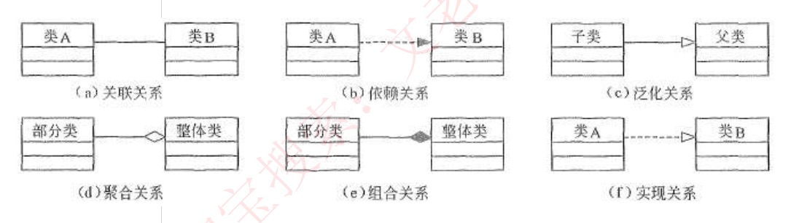
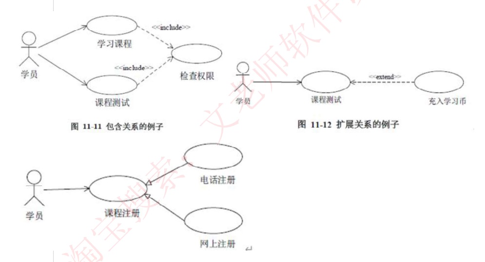

# 51 · 下午题 3：UML 建模实战

## 定位

下午题 3（UML 建模，15 分必答）：一段业务说明加一两张挖了空的 UML 图，把 `A1`、`U2`、`C3`、`X1`、`S5` 这类占位符换成真实名字；答案全在说明里，无计算。各图怎么读归 25（用例图、类图）、26（顺序图、通信图）、27（状态图、活动图），本课只管补空。第一节是符号速查，第二节是关系判据，第三节是解题步骤，第四节是技术要点。

## 一、图上有什么

**纯文本写法**（本篇统一；三角、菱形、箭头画在它该贴的那一端）：

| 写法 | 关系 | 记号贴哪端 |
|---|---|---|
| `A ── B` | 关联 | 实线，两头无记号 |
| `子 ──▷ 父` | 泛化 | 空心三角贴**父** |
| `类 ⇢▷ 接口` | 实现 | 虚线＋空心三角贴**接口** |
| `A ⇢ B` | 依赖 | 虚线细箭头指向**被用的 B** |
| `整体 ◇── 部分` | 聚合 | 空心菱形贴**整体** |
| `整体 ◆── 部分` | 组合 | 实心菱形贴**整体** |

多重度写在两端括号里，如 `读者 (1) ── (0..*) 借阅记录`；状态转换写 `源状态 —事件→ 目标状态`，`●` 起点、`◉` 终点；参与者与用例写 `A1 ── U1`。

**六种图挖的空**（参与者＝跟系统打交道的角色，人、岗位或另一套系统，画成小人；用例＝系统替他办成的一件完整的事，画成椭圆）：

| 图 | 一眼特征 | 挖的空 | 答案从说明哪里来 |
|---|---|---|---|
| 用例图 | 小人＋椭圆 | 参与者名、用例名、用例间关系 | "谁做什么"那句 |
| 类图 | 三格矩形＋菱形/三角 | 类名、属性、关系、多重度 | 名词与"××信息包括……" |
| 顺序图（序列图） | 竖直虚线（生命线）＋横向箭头 | 对象名、消息名 | 动作动词 |
| 状态图 | 圆角框＋实心圆点起终点 | 状态名、转换条件 | "标记为××状态" |
| 通信图 | 方框＋带序号的消息 | 对象名、消息名 | 同顺序图 |
| 活动图 | 圆角框＋水平粗线 | 活动名 | 流程步骤 |

原话｜顺序图主要填**对象名、消息名**，消息是箭头上传递的，**对象作为实体在最上端**；状态图**方框代表状态，箭头上的代表触发事件**，实心圆点为起点和终点；通信图是**顺序图的另一种表示方法**，由对象和消息组成，**不强调时间顺序，只强调事件之间的通信**，没有固定画法规则，和顺序图统称**交互图**；活动图是一种特殊的状态图，活动的分岔和汇合线是一条水平粗线，主要填**活动名称**。

**多重度**（关联线两端的数字，一个集合中的一个对象对应另一个集合中的几个对象）：

| 写法 | 含义 |
|---|---|
| `1` | 1 个 |
| `0..*` | 0 个或多个 |
| `1..*` | 1 个或多个 |
| `*` | 多个 |

多重度不用来算，用来**反推框是谁**：挂 `*` 的一端是"一对多"里的"多"（如订单下的商品行）。

## 二、关系判据

### 1. 类图六种关系

（上排：关联、依赖、泛化；下排：聚合、组合、实现。）

**判定有先后**：先问"是一种"（泛化/实现）→ 再问"整体—部分"（聚合/组合）→ 都不是才是关联；只在参数、局部变量里出现的是依赖。次序不能反，因为聚合、组合本身是特殊的关联，"A 里存着一个 B"它们同样满足。

| 关系 | 判定动作 | 例子 |
|---|---|---|
| 泛化 | 能说"××**是一种**××" | VIP 读者是一种读者 |
| 实现 | 一头是只写签名的接口，另一头去做 | 审批策略接口 |
| 聚合 | 整体没了，部分**还在** | 部门撤了，员工转岗 |
| 组合 | 整体没了，部分**也没了**，且不能挪给别的整体 | 报销单删了，费用明细跟着没 |
| 关联 | 以上都不沾，但 A 里**长期存着**一个 B（成员变量） | 借阅记录里一直记着读者 |
| 依赖 | 只在方法参数、局部变量里用一下 | 报销单调一次汇率服务 |

**聚合 vs 组合**
判据｜整体没了部分还在不在；在＝聚合，不在且不能转给别的整体＝组合。关系"紧不紧密"不是判据。
例子｜球队与球员：球队解散，球员照样是球员、能去别队 → 聚合，`球队 ◇── 球员`。改成"图书删除时其副本记录一并删除、副本不能转到别的图书名下" → 组合，`图书 ◆── 副本`。
口诀｜"多边形端为整体，直线端为个体"——菱形永远贴整体。

### 2. 用例间三种关系

**基用例**＝主流程本身，另一条挂上来的用例是它的配件。判据：去掉它，主流程还走不走得完。

| 关系 | 判据 | 画法 | 图中例子 |
|---|---|---|---|
| include 包含 | 走不完，每次都要做 | 虚线箭头 `«include»`，**基用例 → 被包含用例** | 学习课程、课程测试都 `⇢«include»` 检查权限 |
| extend 扩展 | 走得完，只是少一个条件分支 | 虚线箭头 `«extend»`，**扩展用例 → 基用例** | `充入学习币 ⇢«extend» 课程测试`（仅余额不足时） |
| 泛化 | 同一件事的几种做法 | 实线空心三角指向笼统用例 | `电话注册 ──▷ 课程注册`、`网上注册 ──▷ 课程注册` |

`«include»` 这种双尖括号标记叫**构造型**，说明这根线是哪种关系。

**include vs extend**
判据｜说明里"每次都要 / 必然"→ include；"仅当……才 / 可选 / 失败时"→ extend。两者箭头方向相反。
例子｜"还书时检查读者身份"→ `还书 ⇢«include» 检查身份`；改成"仅当超期时才计算罚金"→ `计算罚金 ⇢«extend» 还书`。

## 三、解题步骤

题的结构固定：说明（编号功能条目，或用例描述表）＋一两张挖空图，三问——①认人/归类（参与者与用例，或把候选类分进接口/控制/实体）②填类名/对象名 ③变化最大：填属性、填状态名，或判关系类型。

1. **数空、对号**：数说明里的功能条目（留意一条里藏的第二件事，如"还书"条末尾还写了"超期时计算罚金"），与图上用例/框数对上；已印出名字的先划掉，剩下的就是要填的。
2. **定参与者，再定用例**（顺序不反：参与者少、每人管哪几件事说明写得死，用例名要靠参与者去锁）。
   - 先看参与者连着的**已印名**用例，回说明搜"由××录入/办理"，锁定参与者。
   - 用例只用**独占线**定名：只被一个参与者连的空，去该参与者经手的剩余条目里找。
   - 两人都连的用例＝说明里两方都出现的那条（如"读者持证借书，由前台管理员办理"）。
   - 图上某根线在说明里找不到对应，是多余连线，绕开它；**图与说明冲突以说明为准**。
   - 两个空在图上条件完全对称、分不开时，按说明条目的出现顺序落位，不硬编理由。
3. **类图先找泛化**：`C1 ──▷ C3`、`C2 ──▷ C3` 两子一父，回说明找"××分为两种/分为A和B"——通常全篇只有一处，父子一次锁定。聚合/组合符号是第二个突破口。
4. **子类分家看邻居**：两个子类谁是谁，看各自**还连着谁**。如只有一个子类还连着"积分"类，而说明里只有 VIP 读者有积分 → 它就是 VIP 读者。若两子类连线也完全对称，按出现顺序写。
5. **其余类用"多重度＋邻居"定**：把 `X (1) ── (1..*) Y` 读成一句"一个 X 对多个 Y"，回说明找同构的句子。
   - `读者 (1) ── (0..*) C3` ↔ "每次借阅生成一条借阅记录" → C3＝借阅记录。
   - 两端都 `1..*` ↔ "每门课可由多位教师讲授，每位教师可讲多门课"。
   - 定完用另一条线回验（如 `C4 (1) ── (0..*) C3` ↔ "一次借阅只针对一个馆藏副本" → C4＝馆藏副本）。
   - 同一个类下挂几个一对一的框，看谁**还连着别的类**，回说明找哪个名词和那个类有业务往来；几条里唯一的 `*` 端，找说明里"可以新增/可有多个"的那个名词。
6. **填属性**：先把说明里"××信息包括……"那一句**抄全**（保底）；再看这个类有没有被另一句单独交代过一次关系，有就补一项（如"每位读者与其借书证关联" → 读者加"借书证"）。处在"多"端的类通常要存"一"端的标识（借阅记录存读者证号）。这不是硬规则：说明里带"××与××"的句子不止一处，不必逐条加。
7. **候选类归三类**（边界/控制/实体）：
   | 类别 | 教材口径 | 说明里的样子 |
   |---|---|---|
   | 实体类 | 负责持久化数据的存储 | 被存下来的名词：会员、商品清单、地址、订单表 |
   | 接口类（边界类） | 系统与**外界**的所有出入口：给人看的窗体/列表，也包括与别的系统收发数据的接口 | "以表格/列表形式显示……""调用支付系统接口" |
   | 控制类 | 不代表实物，负责业务逻辑、把流程串起来 | "自动计算总价" |
   实体类最好判，先锁；"自动发送订单信息至邮箱"这类对外发数据的自动动作两可（接口类或控制类都讲得通）。
8. **填状态名**：从转换标签反推。入边标签（如"超期未还"）→ 说明里紧跟这几个字的"标记为××状态"就是原词（"标记为逾期状态"）；入边、出边标签一起用，说明里同时提到这几个事件的只有一个状态。几条路汇到同一状态 → 找说明里几条路共同的那个动作对应的状态。
9. **顺序图/通信图/活动图**：顺序图填对象名看生命线顶端的框，填消息名找说明里对应的动词；通信图是同一批消息改成带序号的连线，填法不变；活动图对着流程步骤抄活动名。**组合片段**：图上圈一个矩形框，左上角小五边形写 `loop`/`alt`/`opt`，表示框内消息循环、二选一、可有可无；先分清哪条消息在框内、哪条在框外，框外照常填（操作符读法与执行序列见 26）。

## 四、技术要点

- **只用说明原词**："根据说明中的描述"是约束，说明叫"借阅记录"就写借阅记录，不写"借书单"这类自造词。
- **中英文随说明**：说明每条功能带英文括注时中英文任写一个；只给中文就写中文。状态名前加不加实体名（"挂起"/"订单挂起"）同样成立。
- **只写答案不写理由**；归类题写成三行、每行列编号。
- **看连线不看位置**：框在图上的位置不是依据，"连着谁＋多重度"才是。
- **按约束最强的先填**：独占线、泛化线先锁死，再排除；顺着编号从上往下猜，一处错位会连锁错。各空独立，分不清的只影响那一处。
- **三角空实拿不准时看方向**：扫描图上泛化三角可能印成实心，箭头指向的一端是父，按方向和说明定父子即可。
- **菱形贴整体**，贴反即错；include 与 extend 箭头方向相反。

## 速记

- 三步：数空并与说明条目对号 → "关系符号＋多重度＋连着谁"反推 → 回说明抄原词
- 参与者先锁独占线再排除；图与说明冲突以说明为准；对称分不开按出现顺序
- 泛化线是撬开类图的第一把钥匙：找"××分为两种"那句
- 菱形贴整体：整体亡部分存＝聚合空心；整体亡部分亡且不可转移＝组合实心
- include 每次都做、基用例→被包含；extend 有条件才做、扩展→基用例
- 多重度 `1` 恰一、`0..*` 零到多、`1..*` 至少一、`*` 多个；`*` 端是"多"
- 属性先抄全"××信息包括……"，再补被单独交代过的那项关系
- 状态名照抄"标记为××状态"；边界类含对外系统接口，控制类只管逻辑

练习：`真题/` 下各卷的下午试题三
