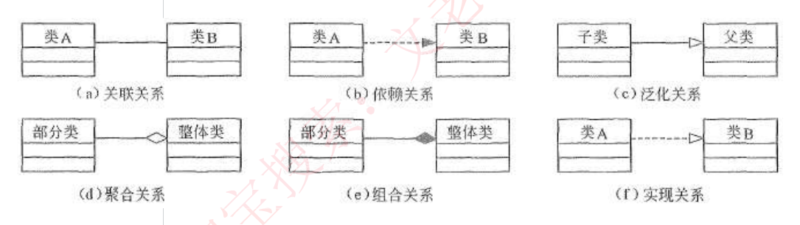
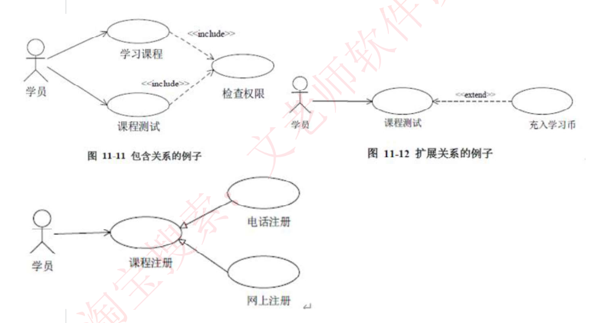
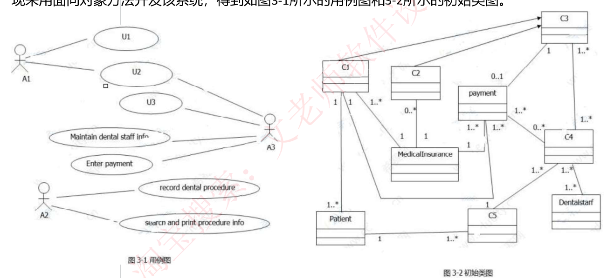
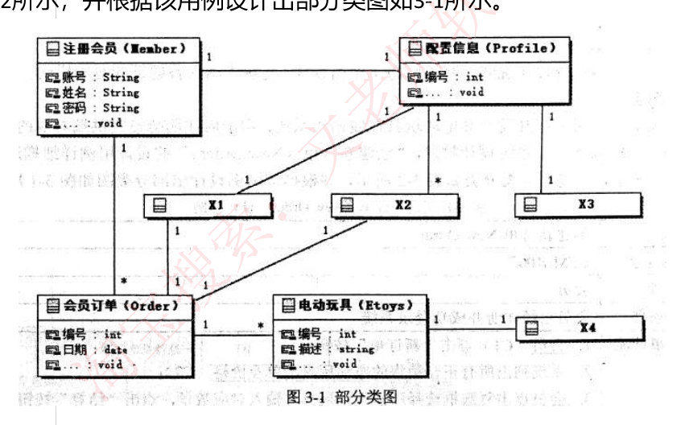
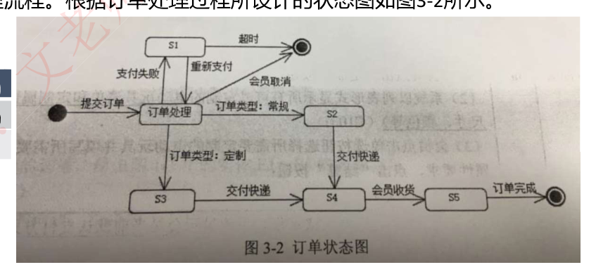

# 51 · 下午题 3：UML 建模实战

> 真题：牙科诊所信息系统 2019下·试题三、电动玩具在线销售系统 2017上·试题三，两道完整下午试题三，题干照录信管网两份「下午案例分析真题文字版」（年份与科目 2026-09-10 核实）｜无公式，三问套路要练熟｜未讲
> 知识点范围：对齐上述培训资料第三部分全部（1-1 用例图～1-6 活动图、解题技巧、Q&A、两道典型真题）

---

## 定位

**这一课回答**：下午题 3（UML 建模，15 分必答）挖空的图怎么填回去。

**前后关系**：图本身怎么读归 25（类图、用例图等静态图）、26（顺序图、通信图）、27（状态图、活动图）；本课只管"挖了空怎么补"。48 定了它排答题顺序第 4 位、用时 18 分钟。

**分值与去向**：15 分，目标 11 分（培训资料的原话是"要求能拿到 12 分以上"）；答案全在题干里，无计算。

---

## 开讲：先认清空长什么样，再一起做一道真题

这道题的形态和 DFD 那道一样固定：一段业务描述，加一两张挖了空的 UML 图，让你把 `A1`、`U2`、`C3`、`X1`、`S5` 这些占位符换成真实的名字。培训资料把它总结成一句话：**"对这些图形的考察一般都是缺失一些关键点，而后要求考生补图。"** 先花几分钟认清"空"有哪几种，然后我带你从头到尾做一道真题，第二道你自己做。

### 一、图上会挖哪些空

**先约定一套纯文本写法**，这一篇全部用它，同一个符号只有一种含义。**箭头、三角、菱形一律画在它该贴的那一端**，看写法就知道谁是谁：

- `A ── B` 关联，一条光实线，两头没记号
- `子 ──▷ 父` 泛化，空心三角贴**父**那一端
- `类 ⇢▷ 接口` 实现，虚线加空心三角，三角贴**接口**那一端
- `A ⇢ B` 依赖，虚线加细箭头，箭头指向**被用的那个 B**
- `整体 ◇── 部分` 聚合，空心菱形贴**整体**那一端
- `整体 ◆── 部分` 组合，实心菱形也贴**整体**那一端

多重度写在两端的括号里，例如 `病人 (1) ── (1..*) 就诊记录`。状态图的转换写成 `源状态 —事件→ 目标状态`，`●` 是起点、`◉` 是终点。用例图的参与者与用例之间写成 `A1 ── U1`。

六种图各挖各的空，认图靠一眼特征，填什么由图种决定。表里的**参与者**指跟系统打交道的角色（一个人、一个岗位，或者另一套系统），画成小人；**用例**指系统能替他办成的一件完整的事（"记录就诊信息""打印发票"），画成椭圆：

| 图 | 一眼特征 | 挖的空 | 答案从哪儿抄 |
|---|---|---|---|
| 用例图 | 小人 + 椭圆 | 参与者名、用例名、用例间关系 | 说明里"谁做什么"那句 |
| 类图 | 三格矩形 + 菱形/三角 | 类名、属性、关系、多重度 | 说明里的名词与"××信息包括……" |
| 序列图 | 竖直虚线（生命线）+ 横向箭头 | 对象名、消息名 | 说明里的动作动词 |
| 状态图 | 圆角框 + 实心圆点起终点 | 状态名、转换条件 | 说明里"标记为××状态" |
| 通信图 | 方框 + 带序号的消息 | 对象名、消息名 | 同序列图 |
| 活动图 | 圆角框 + 水平粗线 | 活动名 | 说明里的流程步骤 |

培训资料对每种图的考法写得很直白：序列图"主要考察**填对象名、消息名**，消息就是一个个箭头上传递的，**对象作为实体在最上端**"；状态图"**图中方框代表状态，箭头上的代表触发事件**，实心圆点为起点和终点"；通信图"是**顺序图的另一种表示方法**，也是由对象和消息组成的图，只不过**不强调时间顺序，只强调事件之间的通信**，而且也没有固定的画法规则，和顺序图统称为**交互图**"；活动图"是一种特殊的状态图……活动的分岔和汇合线是一条水平粗线"，主要考**填活动名称**。这几张图的读法本身在 26、27 讲过，本课只管补空这个动作。

**多重度**是关联线两端写的那个数字，说明对方的一个对象对应这一端几个。培训资料给了四种，逐条照录：

- **1**：表示一个集合中的一个对象对应另一个集合中 1 个对象。
- **0..\***：表示一个集合中的一个对象对应另一个集合中的 0 个或多个对象。
- **1..\***：表示一个集合中的一个对象对应另一个集合中的一个或多个对象。
- **\***：表示一个集合中的一个对象对应另一个集合中的多个对象。

做题时它不是让你算的，是让你**反推这个框是谁**——挂着 `*` 的那一端通常是"一对多"里的"多"，比如订单下面的商品行。

类图上一共可能出现**六种关系**，培训资料这张图把六种的画法一次列全（上排：关联、依赖、泛化；下排：聚合、组合、实现），菱形一律贴"整体类"那一端、三角一律贴"父类"那一端：



**怎么判**，每种给一个能当场做出来的动作，不要凭感觉。**判定有先后**：先问是不是"是一种"（泛化／实现），不是再问是不是"整体—部分"（聚合／组合），都不是才是普通关联；只在参数、局部变量里露一面的算依赖。次序反了会出错，因为聚合和组合本来就是特殊的关联，"A 里存着一个 B"这一条它们同样满足。

| 关系 | 画法 | 判定动作 | 例子 |
|---|---|---|---|
| 泛化 | `子 ──▷ 父` | 能不能说"××**是一种**××" | 给病人的发票**是一种**发票 |
| 实现 | `类 ⇢▷ 接口` | 一头是只写签名的接口、另一头去做 | 审批策略接口 |
| 聚合 | `整体 ◇── 部分` | 整体没了，部分**还在** | 部门撤了，员工转岗 |
| 组合 | `整体 ◆── 部分` | 整体没了，部分**也没了**，且不能挪给别的整体 | 报销单删了，费用明细跟着没 |
| 关联 | `A ── B` | 上面四条都不沾，但 A 里**长期存着**一个 B（成员变量） | 借阅记录里一直记着读者 |
| 依赖 | `A ⇢ B` | 只在方法参数、局部变量里用一下 | 报销单调一次汇率服务 |

**先别往下看，猜一个**：一个牙科诊所有多名医生，医生离开诊所后仍然是医生——诊所和医生之间，是聚合还是组合？

多数人第一反应挑组合，理由是"医生是诊所的一部分，关系够紧密"。**紧不紧密不是判据**。判据只有那一句"整体没了部分还在不在"：诊所关门了，那位医生照样是医生，还能去别家诊所上班，所以**是聚合**，空心菱形贴在"诊所"那一端。

把它和费用明细对照着记：明细离开报销单一文不值，那才是组合。培训资料在解题技巧里也给了同一条画法口诀——**"多边形端为整体，直线端为个体"**，即菱形永远贴整体，别贴反。

**用例之间的三种关系**同理，判据是"去掉它，主流程还走不走得完"。先认一个词：**基用例**就是那条主流程本身（比如"课程测试"），另一条挂上来的用例是它的配件。走不完、每次都要做，是 **include**（包含），虚线箭头**从基用例指向被包含用例**；走得完、只是少一个条件分支，是 **extend**（扩展），虚线箭头**从扩展用例指回基用例**；同一件事的两种做法，是**泛化**，实线空心三角指向那个笼统的用例。对着培训资料这张图看，三种关系各一个例子：



图上左边是包含：学员做"学习课程"和"课程测试"，两条都 `⇢«include»` 指向"检查权限"（`«include»` 这种双尖括号里的标记叫构造型，用来说明这根线是哪一种关系）——每次都得先验权限。

右上是扩展：`充入学习币 ⇢«extend» 课程测试`，箭头指回"课程测试"，因为只有余额不够时才多这一步。左下是泛化：`电话注册 ──▷ 课程注册`、`网上注册 ──▷ 课程注册`，两种做法归一个笼统用例。

### 二、跟我做一道真题：牙科诊所信息系统

【真题·2019下】

**【说明】** 某牙科诊所拟开发一套信息系统，用于管理病人的基本信息和就诊信息。诊所工作人员包括：医护人员 (DentalStaff)、接待员 (Receptionist) 和办公人员 (OfficeStaff) 等。系统主要功能需求描述如下：

1. **记录病人基本信息** (Maintain patient info)。初次就诊的病人，由接待员将病人基本信息录入系统。病人基本信息包括病人姓名、身份证号、出生日期、性别、首次就诊时间和最后一次就诊时间等。每位病人与其医保信息 (MedicalInsurance) 关联。
2. **记录就诊信息** (Record office visit info)。病人在诊所的每一次就诊，由接待员将就诊信息 (Office Visit) 录入系统。就诊信息包括就诊时间、就诊费用、支付代码、病人支付费用和医保支付费用等。
3. **记录治疗信息** (Record dental procedure)。病人在就诊时，可能需要接受多项治疗，每项治疗 (Procedure) 可能由多位医护人员为其服务。治疗信息包括：治疗项目名称、治疗项目描述、治疗的牙齿和费用等。治疗信息由每位参与治疗的医护人员分别向系统中录入。
4. **打印发票** (Print invoices)。发票 (Invoice) 由办公人员打印。发票分为两种：给医保机构的发票 (InsuranceInvoice) 和给病人的发票 (PatientInvoice)。两种发票内容相同，只是支付的费用不同。当收到治疗费用后，办公人员在系统中更新支付状态 (Enterpayment)。
5. **记录医护人员信息** (Maintain dental staff info)。办公人员将医护人员信息录入系统。医护人员信息包括姓名、职位、身份证号、家庭住址和联系电话等。
6. 医护人员可以查询并打印其参与的治疗项目相关信息 (Search and print procedureinfo)。

现采用面向对象方法开发该系统，得到如图 3-1 所示的用例图和 3-2 所示的初始类图。（题干照录信管网「2019 年下半年软件设计师下午案例分析真题文字版」。

培训资料的转录与原卷有四处出入：漏了首段末尾的"等"字、漏了本段这一句、把"当收到治疗费用后"印成"当收到治疗费用时"、把第 2 条的 `(Office Visit)` 印成 `(OfficeVisit)`——它自己的答案区写的却是 "Office Visit"。四处都不影响解题，照原卷读即可。）



图印得小，两张图上的连线逐条转写如下（用例名与类名照图上印的原样，`searcn`、`Dentalstarf` 是图上的讹字，题干里写的是 Search 和 DentalStaff）。**图 3-1 用例图**共 3 个参与者、7 个用例：

```
A1 ── U1        A1 ── U2        A3 ── U2        A3 ── U3
A3 ── Maintain dental staff info        A3 ── Enter payment
A2 ── record dental procedure           A2 ── searcn and print procedure info
```

**图 3-2 初始类图**共 9 个框（C1～C5 待填，payment、MedicalInsurance、Patient、Dentalstarf 已给），13 条连线：

| 连线 | 关系 | 多重度 |
|---|---|---|
| C1 ──▷ C3 | 泛化（箭头端在 C3） | — |
| C2 ──▷ C3 | 泛化（箭头端在 C3） | — |
| C1 ── Patient | 关联 | C1 端 1，Patient 端 1..* |
| C1 ── MedicalInsurance | 关联 | C1 端 1..*，MedicalInsurance 端 1 |
| C1 ── payment | 关联 | C1 端 1，payment 端 1..* |
| C2 ── MedicalInsurance | 关联 | C2 端 0..*，MedicalInsurance 端 1 |
| C3 ── payment | 关联 | C3 端 1，payment 端 0..1 |
| C3 ── C4 | 关联 | 两端各 1..* |
| payment ── MedicalInsurance | 关联 | payment 端 1..*，MedicalInsurance 端 1 |
| payment ── C4 | 关联 | payment 端 1..*，C4 端 0..* |
| C4 ── C5 | 关联 | C4 端 1..*，C5 端 1 |
| C4 ── Dentalstarf | 关联 | 两端各 1..* |
| Patient ── C5 | 关联 | Patient 端 1，C5 端 1..* |

（指向 C3 的那两个箭头，图上印的是**实心**小三角，而教材里泛化的规范画法是**空心**三角。按说明第 4 条"发票分为两种"，这两条就是一般／特殊关系无疑。**判定不受影响——看方向就够，箭头指向的那一端是父。**考场上遇到三角是空是实拿不准的，一律先按方向和说明定父子，别在填色上纠结。）

**【问题 1】（6 分）** 根据说明中的描述，给出图 3-1 中 A1~A3 所对应的参与者名称和 U1~U3 所对应的用例名称。
**【问题 2】（5 分）** 根据说明中的描述，给出图 3-2 中 C1~C5 所对应的类名。
**【问题 3】（4 分）** 根据说明中的描述，给出图 3-2 中类 C4、C5、Patient 和 DentalStaff 的必要属性。

**动笔前先做两件事。** 一，把说明里的功能和图上已有的名字对一遍：说明给了 6 条功能，其中第 4 条里还藏着一个"更新支付状态 (Enterpayment)"，一共 7 件事；图 3-1 上正好 7 个用例，已印出名字的有 4 个（Maintain dental staff info、Enter payment、record dental procedure、searcn and print procedure info），剩下 3 个是 U1、U2、U3。二，看清题干里"根据说明中的描述"这句——它和 DFD 题的"使用说明中的词语"一个意思，答案要用原文的词，不要自己造。

**问题 1，先定参与者，后定用例。** 顺序不能反：参与者只有 3 个、每人管几件事，说明里写得死；用例名反而要靠参与者去锁。

先看 A2，它连着两个已印出名字的用例：record dental procedure、searcn and print procedure info。

回说明搜，第 3 条"治疗信息由每位参与治疗的医护人员分别向系统中录入"、第 6 条"医护人员可以查询并打印其参与的治疗项目相关信息"，两条都是医护人员，**A2 = 医护人员 (DentalStaff)**。

再看 A3，它连着 Maintain dental staff info 和 Enter payment。说明第 5 条"办公人员将医护人员信息录入系统"、第 4 条"办公人员在系统中更新支付状态"，**A3 = 办公人员 (OfficeStaff)**。剩下 **A1 = 接待员 (Receptionist)**。

**这里我卡了一下。** A3 除了那两个用例，还连着 U2 和 U3；而 A1 只连着 U1 和 U2。也就是说 **U2 被两个参与者共用**。按说明找"两个人一起做的事"，找不到——第 1、2 条明写"由接待员"，第 4、5 条明写"办公人员"，没有一条是两人共办。我一度怀疑是不是 A1、A3 认反了，但反过来更说不通：Maintain dental staff info 和 Enter payment 这两条已印名字的用例只连 A3，说明第 4、5 条把它们钉死在办公人员身上，A3 不可能是接待员。

**排除的办法是绕开这根线，只用"独占"的连线定名。** A1 独占 U1，接待员经手的事只有第 1、2 条；A3 独占的两条已锁定为第 4、5 条，那么 A3 剩下的那个空 U3 只能是第 4 条里的"打印发票"。于是 **U3 = 打印发票 (Print invoices)**。

剩下 U1、U2 都归接待员，图上没有任何线索能把这两个分开——**这一步不是推出来的，是按约定填的**：说明把功能编了号，第 1 条在前、第 2 条在后，图上 U1 也画在 U2 上面，就按这个顺序对：**U1 = 记录病人基本信息 (Maintain patient info)**，**U2 = 记录就诊信息 (Record office visit info)**。

这种"分不出来只能按出现顺序写"的地方要心里有数：本题按空给分，万一写反了也只丢这两空，不会连累 A1~A3 和 U3。

至于 A3 到 U2 那根线，说明里找不到对应，属于图上的多余连线，不影响填名——**下午题的图是给你当线索用的，说明才是判分依据；线索和说明打架时以说明为准。**

**问题 2，从关系符号下手，不要从框的位置下手。** 图上唯一的非关联关系是 `C1 ──▷ C3` 和 `C2 ──▷ C3`：两个子、一个父。**先猜一下**：说明里哪一处出现了"一个笼统概念底下分两种"？

是第 4 条——"发票分为两种：给医保机构的发票 (InsuranceInvoice) 和给病人的发票 (PatientInvoice)"。全篇只有这一处。所以 **C3 = 发票 (Invoice)**，C1 和 C2 是那两种发票。

C1 和 C2 谁是谁？看它们各自还连着什么。C1 连着 Patient（`C1 (1) ── (1..*) Patient`），C2 只连着 MedicalInsurance（`C2 (0..*) ── (1) MedicalInsurance`）。

**给病人的发票必须知道是给哪位病人的，给医保机构的发票只跟医保挂钩**——**C1 = 给病人的发票 (PatientInvoice)**，**C2 = 给医保机构的发票 (InsuranceInvoice)**。

（C1 也连了一条到 MedicalInsurance，那是因为病人发票上同样要列医保支付的那部分，不妨碍分家：决定性证据是"只有 C1 连 Patient"。）

C4、C5 用多重度和邻居定。C4 连着 Dentalstarf，两端都是 `1..*`——说明第 3 条"每项治疗 (Procedure) 可能由多位医护人员为其服务"，一项治疗对多位医护人员，正好对上，**C4 = 治疗 (Procedure)**。

C5 连着 Patient，`Patient (1) ── (1..*) C5`，一位病人对多个 C5——说明第 2 条"病人在诊所的每一次就诊"，一个病人多次就诊，**C5 = 就诊信息 (Office Visit)**。再拿 `C4 (1..*) ── (1) C5` 回头验一遍："病人在就诊时，可能需要接受多项治疗"，一次就诊多项治疗，对上了。

**问题 3，属性题就是回说明抄"××信息包括……"那一句。** 说明里这样的句子有四处，一一对号：

- **C4（治疗）**：治疗项目名称、治疗项目描述、治疗的牙齿和费用，再加**参与治疗的医护人员**。
- **C5（就诊信息）**：就诊时间、就诊费用、支付代码、病人支付费用和医保支付费用，再加**病人身份证号**。
- **Patient**：病人姓名、身份证号、出生日期、性别、首次就诊时间和最后一次就诊时间，再加**医保信息**。
- **DentalStaff**：姓名、职位、身份证号、家庭住址和联系电话。

前三条各多出一项，多出来的那项不在"包括"那句里，逐个说清楚它是从哪来的：C4 多出的"参与治疗的医护人员"来自说明第 3 条另起的一句"每项治疗 (Procedure) 可能由多位医护人员为其服务"；Patient 多出的"医保信息"来自第 1 条最后单独一句"每位病人与其医保信息 (MedicalInsurance) 关联"；C5 多出的"病人身份证号"没有这样一句原话，是因为一次就诊必须认得出是谁来的——图上 `Patient (1) ── (1..*) C5`，C5 是"多"的那一端，得存住"一"那一端的身份证号才认得出人。

**别把这三条当成一条硬规则去套。** 说明里带"××与××"字样的句子不止这三处（比如第 3 条"病人在就诊时，可能需要接受多项治疗"、第 1 条"由接待员将病人基本信息录入系统"），但通行的参考答案并没有因此给 C4 加"就诊编号"、给 Patient 加"接待员"。实战口径是：**"××信息包括……"那一句抄全，是保底；再回头看这个类还被哪一句单独交代过一次关系，把那一项补上，是加分。**本问按类给分，抄全"包括"那句就已经站住，补上的这一项让答案更稳。DentalStaff 那条没有额外交代，照抄"医护人员信息包括……"即可。

**评分点。** 三问都是填空型，按点给分：问题 1 是 6 分 6 个空，问题 2 是 5 分 5 个空，各一空一点；用例名与类名写中文或写题干给的英文都算，写"记录病人基本信息"和写"Maintain patient info"等价，但**不能自造词**（把 U1 写成"病人建档"就危险）。问题 3 是 4 分 4 个类，按类给分，每个类把说明里那串属性列全；多写一两项能指回说明原句的属性，一般不影响得分。

### 三、第二道你自己做：电动玩具在线销售系统

【真题·2017上】

先别看答案，按上面的顺序走：先数图上有几个空、和说明里的东西对上号，再逐句读说明。

**【说明】** 某玩具公司正在开发一套电动玩具在线销售系统，用于向注册会员提供端对端的玩具定制和销售服务。在系统设计阶段，"创建新订单 (New Order)"的设计用例详细描述如表 3-1 所示，候选设计类分类如表 3-2 所示，并根据该用例设计出部分类图如图 3-1 所示。（题干照录信管网「2017 年上半年软件设计师下午案例分析真题文字版」；表 3-1 的表格内容在该页是图片，转写自培训资料。）

| 用例名称 | 创建新订单 New Order |
|---|---|
| **用例编号** | ETM-R002 |
| **参与者** | 会员 |
| **前提条件** | 会员已经注册并成功登录系统 |
| **典型事件流** | 1. 会员（C1）点击"新的订单"按钮；<br>2. 系统列出所有正在销售的电动玩具清单及价格（C2）；<br>3. 会员点击复选框选择所需电动玩具并输入对应数量，点击"结算"按钮；<br>4. 系统自动计算总价（C3），显示销售清单和会员预先设置个人资料的收货地址和支付方式（C4）；<br>5. 会员点击"确认支付"按钮；<br>6. 系统自动调用支付系统（C5）接口支付该笔账单；<br>7. 若支付系统返回成功标识，系统生成完整订单信息并持久存储到数据库订单表（C6）中；<br>8. 系统将以表格形式显示完整订单信息（C7），同时自动发送完整订单信息（C8）至会员预先配置的邮箱地址（C9）。 |
| **候选事件流 3a** | (1) 会员点击"定制"按钮；<br>(2) 系统以列表形式显示所有可以定制的电动玩具清单和定制属性（如尺寸、颜色等）(C10)；<br>(3) 会员点击单选按钮选择所需要定制的电动玩具并填写所需要定制的属性要求，点击"结算"按钮；<br>(4) 回到步骤 4. |
| **候选事件流 7a** | (1) 若支付系统返回失败标识，系统显示会员当前默认支付方式 (C11) 让会员确认；<br>(2) 若会员点击"修改付款"按钮，调用"修改付款"用例，可以新增并存储为默认支付方式 (C12)，回到步骤 4；<br>(3) 若会员点击"取消订单"，则该用例终止执行。 |

**【表 3-2 候选设计类分类】**

| 类型 | 编号 |
|---|---|
| **接口类**（Interface，负责系统与用户之间的交互） | (a) |
| **控制类**（Control，负责业务逻辑的处理） | (b) |
| **实体类**（Entity，负责持久化数据的存储） | (c) |

**【订单状态说明】** 在订单处理的过程中，会员可以点击"取消订单"取消该订单。如果支付失败，该订单将被标记为挂起状态，可后续重新支付，如果挂起超时 30 分钟未支付，系统将自动取消该订单。订单支付成功后，系统判断订单类型：
(1) 对于常规订单，标记为备货状态，订单信息发送到货运部，完成打包后交付快递发货；
(2) 对于定制订单，会自动进入定制状态，定制完成后交付快递发货。会员在系统中点击"收货"按钮变为收货状态，结束整个订单的处理流程。根据订单处理过程所设计的状态图如图 3-2 所示。（培训资料的转录把"货运部"印成"发货部"，并漏了末句。）



**图 3-1 部分类图**共 8 个框（X1～X4 待填），9 条连线，全是关联：

```
注册会员(Member){账号:String 姓名:String 密码:String}    配置信息(Profile){编号:int}
会员订单(Order){编号:int 日期:date}                      电动玩具(Etoys){编号:int 描述:string}

Member (1) ── (1) Profile        Member (1) ── (*) Order
Profile (1) ── (1) X1            Profile (1) ── (*) X2        Profile (1) ── (1) X3
X1 (1) ── (1) Order              X2 (1) ── (1) Order
Order (1) ── (*) Etoys           Etoys (1) ── (1) X4
```



**图 3-2 订单状态图**（`●` 起点，`◉` 终点；图上画了两个终止圆，"超时"和"会员取消"汇到右上那个，"订单完成"走右下那个，两者作用一样）：

```
● —提交订单→ 订单处理
订单处理 —支付失败→ S1        S1 —重新支付→ 订单处理        S1 —超时→ ◉
订单处理 —会员取消→ ◉
订单处理 —订单类型：常规→ S2        S2 —交付快递→ S4
订单处理 —订单类型：定制→ S3        S3 —交付快递→ S4
S4 —会员收货→ S5              S5 —订单完成→ ◉
```

**【问题 1】（6 分）** 根据表 3-1 中所标记的候选设计类，请按照其类别将编号 C1~C12 分别填入表 3-2 中的 (a)、(b) 和 (c) 处。
**【问题 2】（4 分）** 根据创建新订单的用例描述，请给出图 3-1 中 X1~X4 处对应类的名称。
**【问题 3】（5 分）** 根据订单处理过程的描述，在图 3-2 中 S1~S5 处分别填入对应的状态名称。

提示三点。问题 1 的判据表 3-2 自己写着，逐个编号问"它是在跟人打交道、在算东西、还是在被存起来"。问题 2 别去猜名字，先看**每个 X 挂在谁下面、多重度是几**——三个 X 都挂在配置信息 (Profile) 下，其中只有一个的多重度是 `*`。

问题 3 从状态图的入边标签反推：进入 S2 的标签是"订单类型：常规"，说明里紧跟"常规"两个字的那个状态名就是答案。

**参考答案**（做完再看）：

- **问题 1**：**(a) 接口类 C5、C7、C10、C11；(b) 控制类 C3、C8；(c) 实体类 C1、C2、C4、C6、C9、C12。**（培训资料印的是另一种排法，见下面第三段。）
  逐个走一遍。表 3-2 那三句话里，"实体类＝负责持久化数据的存储"最好用：C1 会员、C2 玩具清单及价格、C4 收货地址和支付方式、C6 数据库订单表、C9 邮箱地址、C12 默认支付方式——六个都是被存下来的名词，**实体类**，与资料答案完全一致，这 6 个可以放心写。
  剩下六个要小心："接口类"那句写的是"系统与**用户**之间的交互"，但按教材口径，接口类（也叫边界类）管的是**系统跟外界的所有出入口**，既包括显示给人看的窗体、列表，也包括跟别的系统收发数据的接口；控制类则不代表任何实物，只负责把流程串起来、做业务运算。照这个口径：C7"以表格形式显示完整订单信息"、C10"以列表形式显示可定制清单和定制属性"、C11"显示默认支付方式让会员确认"，三个都是给人看的界面 → **接口类**；C5"调用支付系统接口" → 跟外部系统打交道，也是**接口类**；C3"自动计算总价"是纯运算 → **控制类**。**只剩 C8 两可**："自动发送完整订单信息至邮箱"，说它是对外发数据（接口类）、说它是系统自己触发的一步业务动作（控制类），都讲得通。
  培训资料印的答案是 **(a) C3、C8；(b) C5、C7、C10、C11；(c) C1、C2、C4、C6、C9、C12**——实体类那六个和上面完全一致，前两行的内容却整体调了个位置。照它印的样子读，"自动计算总价"就成了"系统与用户之间的交互"，怎么都说不通；**把 (a)、(b) 两行对调回来，十二个编号就和上面的判读处处对得上**（C8 落在控制类那一侧，正是它两可的另一种读法）。下午题官方不公布标准答案，无从最终裁定是这两行印串了位置还是另有口径，所以考场上照判据写自己的三行就行。本题按编号给分，个别编号归错不连累其余。
- **问题 2**：X1 收货地址、X2 支付方式、X3 邮箱地址、X4 电动玩具定制属性。
  推法：三个 X 都挂在 Profile 下，用例第 4 步说的"会员预先设置个人资料的收货地址和支付方式"就是它们。`Profile (1) ── (*) X2` 是三条里唯一的一对多，而候选事件流 7a 写着"可以新增并存储为默认支付方式"——能新增就意味着可以有多个，所以 X2 = 支付方式。X1 和 X3 都是一对一，分家的证据是**这两个里只有 X1 还连着 Order**（X2 也连 Order，但它已经定了）：下单必须带收货地址，邮箱只在第 8 步发通知时用、跟订单没有结构关系，所以 X1 = 收货地址、X3 = 邮箱地址。X4 挂在 Etoys 下，候选事件流 3a 里跟玩具绑在一起的名词只有"定制属性"。
- **问题 3**：S1 订单挂起、S2 订单备货、S3 订单定制、S4 订单发货、S5 订单收货。
  五个状态名在说明里全是原词：挂起（"标记为挂起状态"）、备货（"标记为备货状态"）、定制（"自动进入定制状态"）、发货（两条路都是"交付快递发货"汇到 S4）、收货（「会员在系统中点击"收货"按钮变为收货状态」）。转换标签是最强的锚点：S1 的入边是"支付失败"、出边有"重新支付"和"超时"，说明里同时满足这三条的只有挂起态。
- **评分点**：问题 1 是 12 个编号 6 分，一个编号半点，写成三行、每行列编号即可，不要写理由；问题 2 是 4 分 4 个空，问题 3 是 5 分 5 个空，各一空一点。状态名前面加不加"订单"两字不影响得分，写"挂起""备货"同样成立。

对照两道题：换的只是业务的皮，问法结构一模一样——第一问认参与者/归类，第二问填名字，第三问填属性或状态。

### 四、收口

三步走，两道题都是这么做下来的：**先数空、把图上已印出的名字和说明里的功能条目对上号；再从"关系符号 + 多重度 + 连着谁"三个约束反推每个空；最后回说明抄原词填进去。** 几点补充：

- **答案只写答案。** 问"给出类名"就写类名，不写"因为……所以是……"。中英文按题干给的示例来：题干每条功能后面都用括号标了英文名，那就中英文任写一个；题干只给中文的（比如状态图那道），就写中文。
- **顺序图、通信图、活动图那几问的补法一样。** 顺序图填对象名要看生命线顶端的框、填消息名要找说明里对应的动词；通信图只是把同一批消息改成带序号的连线，填法不变；活动图填活动名对着流程步骤抄。近两年顺序图上可能多出一个**组合片段**——图上圈一个矩形框、左上角小五边形里写 `loop`／`alt`／`opt` 这类操作符，表示框里那几条消息要循环、要二选一、或者可有可无。补空时先分清哪条消息在框内、哪条在框外，框外的照常填；三个操作符各自的读法和算执行序列的方法在 26。
- **实在填不出时，先补最有把握的。** 培训资料的 Q&A 指的正是这条路："**类和类之间的联系，尤其是泛化联系**是非常重要的，也是解题的关键，要记住泛化联系的符号，而后去题目描述里找到**具有父子关系的实体**，基本上题目就一步步解出来了。其他如**组合、聚合联系的符号也是解题关键**。"牙科诊所那道题就是靠两条泛化线撬开的。

---

## 考试怎么考

**第一问几乎固定是"认人"**：用例图给参与者和用例编号，或者像真题 2 那样给一批候选类让你归类。做法都是先抓"独占线索"——只有一个参与者连的那个用例、只有一处出现的那种说法，先把能锁死的锁死，再用排除法填剩下的。常见错法是从上到下顺着编号猜，一个错位后面全错。

**第二问固定是填类名／对象名。** 常见错法有三种：一是只看框在图上的位置、不看它连着谁；二是造词——说明里叫"就诊信息"就写就诊信息，别写成"看病记录"；三是遇到两个框条件完全对称（像本课练习里那两个泛化子类）时硬编一个理由，其实这种地方按说明的出现顺序写就行。

**第三问是变化最大的一问**，见过的形态有三种：给属性（回说明抄"××信息包括……"，再看这个类有没有被单独交代过一次关系）、填状态名（从转换标签反推，说明里"标记为××状态"就是原词）、判关系类型（用第一节那张表的判定动作，聚合与组合的分界是"整体没了部分还在不在"）。

**错法最集中的两处。** 聚合与组合：一是拿"紧密程度"当判据，二是把菱形贴到部分那一端。include 与 extend：题干出现"每次都要／必然"是 include，出现"仅当……才／可选／失败时"是 extend；两者箭头方向相反，写反了照样丢分。

---

## 练习

**【模拟】** 阅读下列说明和图，回答问题 1 至问题 3。

**【说明】** 某社区图书馆欲开发一套图书借阅系统。读者 (Reader) 分为普通读者 (NormalReader) 和 VIP 读者 (VipReader)，两类读者的借阅上限不同。系统主要功能需求描述如下：

1. **读者注册** (Register)。由前台管理员 (Clerk) 将读者信息录入系统。读者信息包括姓名、身份证号、联系电话、注册日期。
2. **借书** (Borrow book)。读者持证借书，由前台管理员办理。每次借阅生成一条借阅记录 (BorrowRecord)，借阅记录包括借出日期、应还日期、实际归还日期。一次借阅只针对一个馆藏副本 (Copy)。
3. **还书** (Return book)。由前台管理员办理。仅当图书超期时，系统才计算罚金 (Fine) 并记入该条借阅记录。
4. **图书上架** (Add book)。由采编员 (Cataloguer) 将图书信息录入系统。图书信息包括 ISBN、书名、作者、出版社。一种图书 (Book) 有多个馆藏副本；一个副本只能属于一种图书，不能转到其他图书名下，图书从系统中删除时其全部副本记录一并删除。
5. **借阅查询** (Query records)。读者可以查询自己的借阅记录。

图 1 用例图（A1～A3、U1～U3 待填）：

```
A1 ── 读者注册(Register)      A1 ── U1      A1 ── U2
A2 ── U1                      A2 ── U3
A3 ── 图书上架(Add book)
计算罚金(Calculate fine) 与 U2 之间画有一条虚线，箭头方向与构造型标签都被挖空
```

图 2 类图（C1～C5 待填，罚金 (Fine) 已给）：

```
C1 ──▷ 读者(Reader)          C2 ──▷ 读者(Reader)
读者(Reader) (1) ── (0..*) C3          C4 (1) ── (0..*) C3
C5 (1) ── (1..*) C4          （这条线的一端画着一个菱形，是空心还是实心、贴在哪一端都被挖空了，正是问题 3(1) 要判的）
C3 (1) ── (0..1) 罚金(Fine)
```

**【问题 1】（6 分）** 根据说明中的描述，给出图 1 中 A1~A3 所对应的参与者名称和 U1~U3 所对应的用例名称。
**【问题 2】（5 分）** 根据说明中的描述，给出图 2 中 C1~C5 所对应的类名。
**【问题 3】（4 分）** (1) 图 2 中 C5 与 C4 之间的菱形应画成空心还是实心？贴在哪一端？说明依据。(2) 用例"计算罚金 (Calculate fine)"与 U2 之间应使用 include 还是 extend？箭头指向哪一方？说明依据。

### 参考答案

**问题 1**：A1 = 前台管理员 (Clerk)、A2 = 读者 (Reader)、A3 = 采编员 (Cataloguer)；U1 = 借书 (Borrow book)、U2 = 还书 (Return book)、U3 = 借阅查询 (Query records)。
推法：A3 只连"图书上架"，说明第 4 条写明由采编员办理，先锁死。A1 连着"读者注册"，第 1 条写明由前台管理员录入，也锁死。剩下 A2 只能是读者。再看用例：A1 独占的那个是"还书"（第 3 条只提前台管理员），A2 独占的那个是"借阅查询"（第 5 条只提读者），两人共有的是"借书"（第 2 条"读者持证借书，由前台管理员办理"，两方都出现）——所以 U1 = 借书、U2 = 还书、U3 = 借阅查询。

**问题 2**：C1 = 普通读者 (NormalReader)、C2 = VIP 读者 (VipReader)、C3 = 借阅记录 (BorrowRecord)、C4 = 馆藏副本 (Copy)、C5 = 图书 (Book)。
推法：两条泛化线指向"读者"，说明开头"读者 (Reader) 分为普通读者 (NormalReader) 和 VIP 读者 (VipReader)"是唯一的父子处。`读者 (1) ── (0..*) C3` 一位读者对多条什么？第 2 条"每次借阅生成一条借阅记录"，C3 = 借阅记录。`C4 (1) ── (0..*) C3` 加上"一次借阅只针对一个馆藏副本"，C4 = 馆藏副本。剩下 C5 是副本的整体，第 4 条"一种图书有多个馆藏副本"，C5 = 图书。
**C1 和 C2 这一处要特别说一句**：两个子类在图上条件完全对称，没有任何连线能把它们分开，所以按说明里"分为普通读者和 VIP 读者"的出现顺序落到 C1、C2，**两个互换写也算对**。牙科诊所那道题的 C1/C2 之所以能分，是因为出题人多给了一条"只有 C1 连 Patient"的线；这道题故意没给，就是提醒你——**分不出来的时候按出现顺序写，别硬编一个理由**。

**问题 3**：(1) 画成**实心**菱形（组合），贴在 **C5（图书）**那一端，即 `C5 ◆── C4`。依据是第 4 条"一个副本只能属于一种图书，不能转到其他图书名下，图书从系统中删除时其全部副本记录一并删除"——整体没了部分也没了、且部分不能挪给别的整体，两条都满足，是组合而不是聚合；菱形永远贴整体那一端。(2) 用 **extend**，箭头由"计算罚金"**指向 U2（还书）**。依据是第 3 条"仅当图书超期时，系统才计算罚金"——不超期就没这一步，还书照样走得完，是可选分支而不是必经步骤；extend 的箭头方向与 include 相反，由扩展用例指回基用例。

---

## 速记

- 三步：数空并与说明功能条目对号 → 用"关系符号＋多重度＋连着谁"反推 → 回说明抄原词
- 参与者先锁"独占线索"再排除；图与说明打架以说明为准
- 泛化线是撬开类图的第一把钥匙：找说明里"××分为两种"那句
- 菱形贴整体：整体亡部分存＝聚合空心，整体亡部分亡且不可共享＝组合实心
- include 每次都做、箭头基用例→被包含；extend 有条件才做、箭头扩展→基用例
- 多重度：`1` 恰一、`0..*` 零到多、`1..*` 至少一、`*` 多个；`*` 那端是"多"
- 属性题先抄全"××信息包括……"那句保底，再看这个类有没有被另一句单独交代过关系，有就补一项
- 只写答案不写理由，几分写几条；状态名照抄"标记为××状态"
