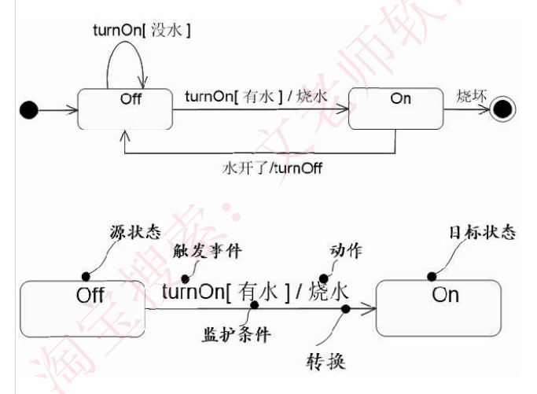
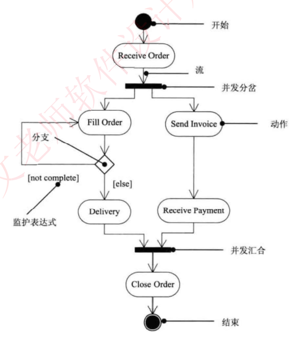
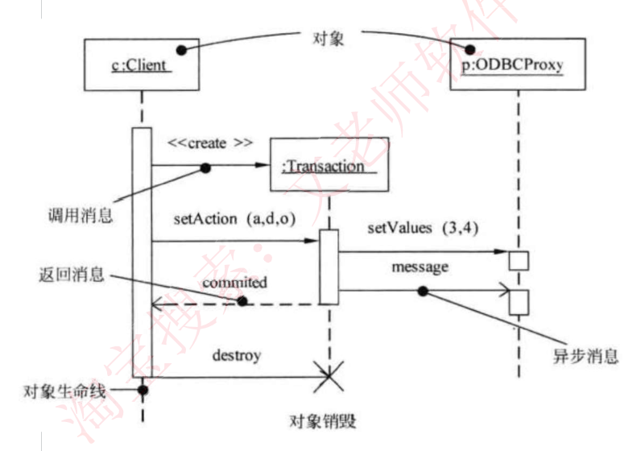
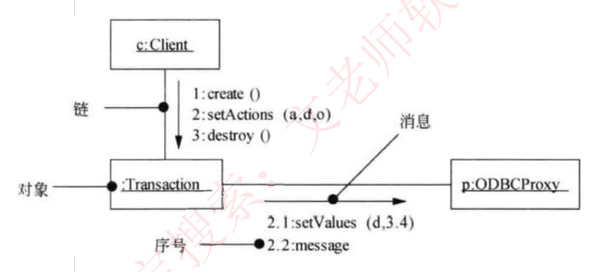

# 51 · 下午题 3：UML 建模实战

> 真题：牙科诊所、电动玩具在线销售两道完整真题（外部资料，年份待核实）｜阶段B（六种图符号）｜未讲（09-04 补缺课）

---

## 第 0 层 · 定位

**这一课回答**：下午题 3（UML 建模，15 分必答）六种图怎么补空：用例图、类图、序列图、状态图、通信图、活动图的残缺图填名字。

**前后关系**：25/26/27 是知识底座（同一批知识，上午选定义、下午补空）；48 定了它排第 4 位、目标 11 分。

**分值与去向**：15 分；比 DFD 和数据库多一层门槛，得先认出是哪种图。六种图的符号要认得出，阶段B。

---

## 第 1 层 · 理解

### 一句话

> 下午题 3 给你**一段业务描述 + 一张或两张挖了空的 UML 图**，让你**把 U1、C3、S2、X4 这些占位符换成真实的名字**。它考的是**「能不能通过图上的符号和多重度，反推出这个空里该填什么」**。

### 痛点：看到一张全是 C1、C2、C3 的类图就懵了

这是本题最典型的翻车现场：

- **"图上八个框全是 C1~C8，我从哪儿下手？"** —— 无从判断哪个框对应业务里的哪个概念。
- **"多重度 1..\* 和 0..\* 有什么区别？"** —— 知道大概意思，但用它来定位类，从没试过。
- **"这个三角箭头是继承还是实现？"** —— 空心三角实线是泛化，空心三角虚线是实现，混了就全错。

**破局点只有一个**：**别把这张图当"图"看，把它当"填字游戏"看。** 填字游戏的每个格子都有约束（横向的词、纵向的词），UML 图上的每个空也有约束——**它的符号（什么关系）+ 它的多重度（几对几）+ 它连着谁**。三个约束一叠加，答案往往唯一。

### 一条主线

```
拿到题：一段业务描述 + 挖空的 UML 图
   ↓ 第一件事：认出这是哪种图（六选一）
   ↓
   看图上的主体符号：
     小人 + 椭圆        → 【用例图】填 参与者、用例名
     矩形三格（名/属性/方法）→ 【类图】  填 类名
     竖直虚线 + 横向箭头   → 【顺序图】填 对象名、消息名
     圆角框 + 箭头 + 实心圆点 → 【状态图】填 状态名、转换条件
     圆角框 + 水平粗线     → 【活动图】填 活动名（粗线=分岔/汇合）
     矩形 + 编号消息       → 【通信图】填 对象名、消息名
   ↓ 第二件事：用三个约束定位每个空
   ↓
   约束① 【符号】：这个空和邻居是什么关系？
        空心三角实线=泛化(父子)  空心三角虚线=实现
        实心菱形=组合(强)  空心菱形=聚合(弱)  虚线箭头=依赖
   约束② 【多重度】：1 / 0..* / 1..* / *
        它决定了"一个它对应几个邻居"
   约束③ 【连着谁】：邻居里往往有已知的类名（题目不会全挖空）
   ↓ 三个约束回题干核对，答案基本唯一
   ↓ 第三件事：按分数决定写多细
```

**一句话收口**：`认图种 → 读符号和多重度 → 回题干找对应的业务概念。`

---

## 第 2 层 · 考点：考试怎么问

### 考点① 认出是哪种图（一切的前提）

| 图 | 一眼认出的特征 | 下午题填什么 |
|---|---|---|
| **用例图** | 小人 + 椭圆 | **参与者名、用例名** |
| **类图** | 三格矩形（类名/属性/操作） | **类名** |
| **对象图** | 矩形，名字带下划线 | 对象名 |
| **顺序图** | 竖直生命线（虚线）+ 横向消息箭头 + 时间从上往下 | **对象名、消息名** |
| **通信图** | 矩形对象 + 带**序号**的消息（1:、2.1:） | **对象名、消息名** |
| **状态图** | 圆角框（状态）+ 实心圆（起点）+ 圆环（终点）+ 箭头上写事件 | **状态名、转换条件** |
| **活动图** | 圆角框（活动）+ **水平粗线**（分岔/汇合）+ 菱形（分支） | **活动名** |

> 💡 **顺序图 vs 通信图的一句话区别**：两者是**同一件事的两种画法**（统称交互图）。**顺序图强调时间顺序**（上下位置就是先后），**通信图强调对象间的通信**（靠消息前的编号表示顺序）。

**六种图各自的考察要点（外部资料原文）**：

| 图 | 主要考察 |
|---|---|
| 用例图 | **参与者和用例的识别、用例之间的关系**（包含 include、扩展 extend、泛化） |
| 类图 | **填类名、多重度、类之间的联系** |
| 序列图 | **填对象名、消息名**，消息就是箭头上传递的，**对象作为实体在最上端** |
| 状态图 | **填状态名、填状态转换的条件** |
| 通信图 | **填对象名、填消息** |
| 活动图 | **填活动名称** |

---

### 考点② 类图：多重度 + 五大关系（本题最难的一问）

**多重度含义**（外部资料 §1-2）：

| 记号 | 含义 |
|---|---|
| **1** | 一个集合中的一个对象对应另一个集合中 **1 个**对象 |
| **0..\*** | 对应 **0 个或多个** |
| **1..\*** | 对应 **一个或多个** |
| **\*** | 对应 **多个** |

**类图六关系符号**（必须认得出，混了就全盘皆错）：

> 📌 讲义 25 全篇用的是「类图**六**关系」，本课沿用。计划文件与部分资料说的「**五大**关系」是**不含「实现」**的那五个（泛化/关联/依赖/聚合/组合），指的是同一套东西。

| 关系 | 符号 | 含义 |
|---|---|---|
| **关联** | 实线 | 结构关系，一组链 |
| **依赖** | **虚线 + 箭头** | 一个事物的语义依赖于另一个的变化 |
| **泛化** | **实线 + 空心三角** | 一般/特殊，父子类 |
| **聚合** | **实线 + 空心菱形** | 整体-部分（弱，部分可独立存在） |
| **组合** | **实线 + 实心菱形** | 整体-部分（**强**，部分不能独立存在） |
| **实现** | **虚线 + 空心三角** | 类元实现接口的契约 |


**怎么用它们定位类名（本题核心技巧）**：

外部资料的解题技巧原话：
> 看到一张类图都是空的怎么办？—— **类和类之间的联系，尤其是泛化联系是非常重要的，也是解题的关键**，要记住泛化联系的符号，而后去题目描述里**找到具有父子关系的实体**，基本上题目就一步步解出来了。其他如**组合、聚合联系的符号也是解题关键**。

**操作步骤**：
1. **先在图上找空心三角（泛化）**——它指向的是**父类**，从它出发的是**子类**；
2. **回题干找"××分为 A 和 B"这种句子**——那就是父子关系；
3. 定下一两个类之后，顺着关联线和多重度往外扩散。

**陷阱**：
- ⚠️ **箭头方向**：泛化的三角**指向父类**。别搞反。
- ⚠️ **多重度写在线的哪一端**：多重度标在**对端**——"一个 A 对应 n 个 B"，则 n 标在**靠近 B 的那一端**。
- ⚠️ 上午题曾考「汽车和车窗**不属于**组合关系」【真题·年份待核实】（外部资料转录 14，未标年份）——组合要求部分不能独立存在。**外部资料只给了答案未给解析**，「车窗可以单独更换、故属聚合」是本课补充的理解角度，非原文。这个辨析在下午题里同样用得上。

---

### 考点③ 用例图：三种关系

| 关系 | 表示 | 含义 |
|---|---|---|
| **包含 include** | 虚线箭头 + «include» | 基用例**必然**执行被包含用例 |
| **扩展 extend** | 虚线箭头 + «extend» | 在特定条件下**才**执行 |
| **泛化** | 空心三角 | 子用例是父用例的特例 |


**上午题也考这个辨析**：
> 用例"会员注册"和"电话注册"、"邮件注册"之间是（ ）关系。
> A. 包含　B. 扩展　C. **泛化**　D. 依赖
> **答案：C**　【真题·年份待核实】
> 解法：电话注册、邮件注册是会员注册的**两种具体方式**（特例）→ 泛化。

**陷阱**：⚠️ **别把"泛化"和"包含"混了**。"两种方式二选一"是泛化；"执行 A 时必然要执行 B"是包含。

---

### 考点④ 状态图与活动图（曾被本讲义体系低估，务必练）

> 🔴 **重要更正说明**：讲义 27 早期版本写过"状态图/活动图在下午题基本不考、不用会画"，**这是错的**。据 `进度/学习日志.md` 2026-09-03 记录，导师已独立核实信管网原文——**用例图、类图、顺序图、活动图和状态图五种并列为试题常见考查图形，形式为图形填空**，并有真题佐证（201611 = 用例图+状态图，200911 = 用例图+活动图）。**这两张图要能读图补空。**

**状态图填什么**：
- **状态名**（圆角框里）
- **转换条件**（箭头上的文字）

**判据**：
- **方框代表状态**（名词/形容词：已挂起、备货中、已发货）
- **箭头上的文字代表触发事件**（动词/条件：支付失败、超时30分钟）
- **实心圆点是起点，圆环是终点**



**活动图填什么**：**活动名称**。

**判据**：
- 圆角框 = 活动（动词短语：Receive Order、Fill Order）
- **水平粗线 = 分岔（fork）/ 汇合（join）**，表示并发
- 菱形 = 分支（decision），旁边的 [条件] 是**监护表达式**



**陷阱**：
- ⚠️ **状态名要填名词态**（"订单挂起"），不要填动词（"挂起订单"）。
- ⚠️ 活动图的**水平粗线下面的分支是可以同时运行的**——上午题考过"能够并行执行的是哪些活动"。

---

### 考点⑤ 顺序图与通信图

**顺序图填什么**：**对象名**（最上端的方框）、**消息名**（横向箭头上的文字）。

**三种消息画法**（讲义 26 已详讲，此处只列速查）：

| 消息 | 画法 |
|---|---|
| **同步消息** | **实心三角箭头**（调用者阻塞等待返回） |
| **异步消息** | **空心（线形）箭头**（发出后继续执行） |
| **返回消息** | **虚线箭头**（从右到左） |



**通信图填什么**：**对象名、消息名**。消息前有**层级编号**（1:、2:、2.1:、2.2:）表示顺序。



**陷阱**：⚠️ **对象名在顺序图最上端**，别去生命线中间找。

---

## 完整算例

### 算例 A：牙科诊所信息系统（用例图 + 类图）

【真题·年份待核实】（来源：外部培训资料"历年典型真题 1"）

#### 【说明】（节选）

某牙科诊所拟开发一套信息系统。诊所工作人员包括：**医护人员 (DentalStaff)、接待员 (Receptionist) 和办公人员 (OfficeStaff)**。系统主要功能需求：

1. **记录病人基本信息 (Maintain patient info)**。初次就诊的病人，**由接待员将病人基本信息录入系统**。病人基本信息包括病人姓名、身份证号、出生日期、性别、首次就诊时间和最后一次就诊时间等。每位病人与其**医保信息 (MedicalInsurance)** 关联。
2. **记录就诊信息 (Record office visit info)**。病人在诊所的每一次就诊，**由接待员将就诊信息 (OfficeVisit) 录入系统**。就诊信息包括就诊时间、就诊费用、支付代码、病人支付费用和医保支付费用等。
3. **记录治疗信息 (Record dental procedure)**。病人在就诊时，可能需要接受多项治疗，**每项治疗 (Procedure) 可能由多位医护人员为其服务**。治疗信息包括：治疗项目名称、治疗项目描述、治疗的牙齿和费用等。**治疗信息由每位参与治疗的医护人员分别向系统中录入**。
4. **打印发票 (Print invoices)**。**发票 (Invoice) 由办公人员打印**。发票分为两种：**给医保机构的发票 (InsuranceInvoice)** 和**给病人的发票 (PatientInvoice)**。
5. **记录医护人员信息 (Maintain dental staff info)**。**办公人员将医护人员信息录入系统**。**医护人员信息包括姓名、职位、身份证号、家庭住址和联系电话等。**
6. **医护人员可以查询并打印其参与的治疗项目相关信息** (Search and print procedure info)。当收到治疗费用时，**办公人员在系统中更新支付状态 (Enter payment)**。


#### 【问题 1】（6 分）给出 A1~A3 参与者名称、U1~U3 用例名称

**分步解**：

**第 1 步：先定参与者。** 图上三个小人 A1、A2、A3，题干明说工作人员有三类：医护人员、接待员、办公人员。**怎么对上号？看每个小人连着哪些用例。**

- **A1** 连着 U1、U2 两个用例。题干里"**由接待员**将病人基本信息录入""**由接待员**将就诊信息录入"——两件事都是接待员做的 → **A1 = 接待员 (Receptionist)**。
- **A2** 连着 "record dental procedure"（记录治疗信息）和 "search and print procedure info"（查询打印治疗信息）。题干："治疗信息由每位参与治疗的**医护人员**分别录入""**医护人员**可以查询并打印其参与的治疗项目相关信息" → **A2 = 医护人员 (DentalStaff)**。
- **A3** 连着 U3、"Maintain dental staff info"、"Enter payment"。题干："发票由**办公人员**打印""**办公人员**将医护人员信息录入系统""**办公人员**在系统中更新支付状态" → **A3 = 办公人员 (OfficeStaff)**。

**第 2 步：定用例名。** A1（接待员）连着 U1、U2 两个，题干给接待员的两件事是"记录病人基本信息""记录就诊信息"；A3（办公人员）连着 U3，题干给的是"打印发票"。

**答案**：
- A1：接待员 (Receptionist)　A2：医护人员 (DentalStaff)　A3：办公人员 (OfficeStaff)
- U1：记录病人基本信息 (Maintain patient info)
- U2：记录就诊信息 (Record office visit info)
- U3：打印发票 (Print invoices)

> 💡 **方法总结**：**参与者靠"它连着哪些用例"来定，用例靠"这个参与者在题干里干了哪几件事"来定**。两者互相印证。

#### 【问题 2】（5 分）给出 C1~C5 类名

**分步解**：

**第 1 步：找泛化（空心三角）。** 图 3-2 中，**C1 和 C2 都用空心三角指向 C3** → C3 是父类，C1、C2 是子类。

**第 2 步：回题干找"××分为两种"。** 题干（4）："**发票 (Invoice)** 分为两种：**给医保机构的发票 (InsuranceInvoice)** 和**给病人的发票 (PatientInvoice)**。"

→ **C3 = 发票 (Invoice)**，C1 和 C2 是它的两个子类。

**第 3 步：区分 C1 和 C2 哪个是哪个。** 看它们各自还连着谁：
- C1 与 Patient（病人）有 1..\* 的关联 → **C1 = 给病人的发票 (PatientInvoice)**
- C2 与 MedicalInsurance（医保信息）有 0..\* 的关联 → **C2 = 给医保机构的发票 (InsuranceInvoice)**

**第 4 步：定 C4、C5。** 图上还有 payment、MedicalInsurance、Patient、DentalStaff 是已知的。剩下 C4、C5：
- **C4** 与 DentalStaff 有 1..\* ↔ 1..\* 的关联。题干（3）："每项**治疗 (Procedure)** 可能由**多位医护人员**为其服务" → 治疗和医护人员是多对多 → **C4 = 治疗 (Procedure)**
- **C5** 与 Patient 是 1 ↔ 1..\* ，且与 C4 相连。题干（2）："病人在诊所的**每一次就诊 (OfficeVisit)**"，一个病人多次就诊 → **C5 = 就诊信息 (Office Visit)**

**答案**：C1：PatientInvoice　C2：InsuranceInvoice　C3：Invoice　C4：Procedure　C5：Office Visit

> 💡 **这一问完美演示了三个约束的用法**：泛化符号定出 C3，多重度和关联对象定出 C1/C2 的区分，业务描述定出 C4/C5。

#### 【问题 3】（4 分）给出 C4、C5、Patient、DentalStaff 的必要属性

**分步解**：这一问退化成**纯阅读理解**——回题干抄"××信息包括……"。

**答案**：
- **C4（Procedure）**：治疗项目名称、治疗项目描述、治疗的牙齿和费用、参与治疗的医护人员
- **C5（Office Visit）**：就诊时间、就诊费用、支付代码、病人支付费用和医保支付费用、病人身份证号
- **Patient**：病人姓名、身份证号、出生日期、性别、首次就诊时间和最后一次就诊时间、医保信息
- **DentalStaff**：姓名、职位、身份证号、家庭住址和联系电话

> ⚠️ **注意 C4 和 C5 各多了一项**：C4 多了"参与治疗的医护人员"，C5 多了"病人身份证号"——这是**外键性质的属性**，题干虽没在"信息包括"那句里列出，但从关联关系推得出。**这两项容易漏，属踩分点。**

---

### 算例 B：电动玩具在线销售系统（类分类 + 状态图）

【真题·年份待核实】（来源：外部培训资料"历年典型真题 2"）

#### 【说明】（节选）

某玩具公司正在开发电动玩具在线销售系统。"创建新订单 (New Order)"的用例详细描述见下表，候选设计类分为**接口类 / 控制类 / 实体类**三种。

**典型事件流**（节选，C1~C12 是候选设计类的标记）：
> 1. 会员（**C1**）点击"新的订单"按钮；
> 2. 系统列出所有正在销售的电动玩具清单及价格（**C2**）；
> 4. 系统自动计算总价（**C3**），显示销售清单和会员预先设置个人资料的收货地址和支付方式（**C4**）；
> 6. 系统自动调用支付系统（**C5**）接口支付该笔账单；
> 7. 系统生成完整订单信息并持久存储到数据库订单表（**C6**）中；
> 8. 系统将以表格形式显示完整订单信息（**C7**），同时自动发送完整订单信息（**C8**）至会员预先配置的邮箱地址（**C9**）。
>
> 候选流 3a：系统以列表形式显示所有可以定制的电动玩具清单和定制属性（**C10**）；
> 候选流 7a：系统显示会员当前默认支付方式（**C11**）让会员确认；可以新增并存储为默认支付方式（**C12**）。

**订单状态说明**：
> 会员可以点击"取消订单"取消该订单。**如果支付失败，该订单将被标记为挂起状态**，可后续重新支付，如果挂起超时 30 分钟未支付，系统将自动取消该订单。订单支付成功后，系统判断订单类型：
> (1) 对于**常规订单，标记为备货状态**，订单信息发送到发货部，完成打包后**交付快递发货**；
> (2) 对于**定制订单，会自动进入定制状态**，定制完成后交付快递发货。会员在系统中点击"收货"按钮变为**收货状态**，结束整个订单的处理流程。


#### 【问题 1】（6 分）把 C1~C12 按接口类/控制类/实体类归类

**分步解**：先明确三类的定义（题干给出）：

| 类型 | 职责 |
|---|---|
| **接口类**（Interface） | 负责系统与**用户之间的交互** |
| **控制类**（Control） | 负责**业务逻辑的处理** |
| **实体类**（Entity） | 负责**持久化数据的存储** |

逐个判断：

| 标记 | 上下文 | 判断 |
|---|---|---|
| C1 | 会员 | 是个**数据实体**（会员资料要存） → 实体 |
| C2 | 电动玩具清单及价格 | 商品数据 → 实体 |
| C3 | 系统自动**计算总价** | **计算** = 业务逻辑运算 → **控制** |
| C4 | 收货地址和支付方式（会员预设资料） | 存储的数据 → 实体 |
| C5 | **调用支付系统接口** | 与**外部系统**交互 → **接口** |
| C6 | 持久存储到**数据库订单表** | 明显是**存储** → 实体 |
| C7 | 以**表格形式显示**完整订单信息 | **面向用户的展示** → **接口** |
| C8 | 自动**发送**完整订单信息 | **发送**是处理动作（组装并投递）→ **控制** |
| C9 | 邮箱地址 | 存储的数据 → 实体 |
| C10 | 以列表形式**显示**可定制清单和定制属性 | **面向用户的展示** → **接口** |
| C11 | **显示**会员当前默认支付方式让会员确认 | **面向用户的展示 + 等确认** → **接口** |
| C12 | 新增并**存储**为默认支付方式 | 存储 → 实体 |

**答案**：
- **(a) 接口类**：**C5、C7、C10、C11**
- **(b) 控制类**：**C3、C8**
- **(c) 实体类**：C1、C2、C4、C6、C9、C12

> 🔴 **本课更正了外部资料的答案**。外部转录资料给的是「(a) 接口类：C3、C8；(b) 控制类：C5、C7、C10、C11」，**即把接口类与控制类两行写反了**。判断依据有三：
> ① **语义对不上**：C7/C10/C11 都是「**显示**……」的纯展示动作、C5 是「调用支付**系统接口**」与外部系统交互——这四个是标准的边界/接口类；而 C3「自动**计算**总价」、C8「自动**发送**订单信息」是纯处理动作，属控制类。两行对调后全部自洽。
> ② **按外部答案会推出自相矛盾的判据**：同样是「显示」，C7 要算交互、C10/C11 又要算处理逻辑——同一份表里判据打架，学生拿这套判据去做别的题必然出错。
> ③ **外部资料自己声明过答案不可靠**：「软考下午题**官方不公布标准答案**，所有答案都是老师校对的，可能会不全面；部分真题本身也不太严谨」。
>
> ⚠️ 该题原始年份与官方答案**未能核实**，标注为**待核实**。若你日后拿到原卷官方答案与本课不同，以原卷为准。
>
> **统一判据（记这一条就够）**：**面向用户或外部系统的输入输出 = 接口；计算/调度/流程编排 = 控制；被存起来的名词 = 实体。**

#### 【问题 2】（4 分）给出图 3-1 中 X1~X4 对应类的名称

**分步解**：回用例描述找被标记的名词。
- X1 = **收货地址**（步骤 4：显示……收货地址和支付方式 C4）
- X2 = **支付方式**（同上）
- X3 = **邮箱地址**（步骤 8：会员预先配置的邮箱地址 C9）
- X4 = **电动玩具定制属性**（候选流 3a：可以定制的电动玩具清单和**定制属性** C10）

> 💡 图上 X1、X2、X3 都挂在"配置信息 (Profile)"下方，X4 挂在"电动玩具 (Etoys)"下方——**位置本身就是提示**。

#### 【问题 3】（5 分）在状态图中填 S1~S5

**分步解**：状态图填的是**状态名（名词态）**。回题干"订单状态说明"逐句提取：

| 空 | 题干原句 | 状态名 |
|---|---|---|
| S1 | 「如果支付失败，该订单将被标记为**挂起状态**」 | **订单挂起** |
| S2 | 「对于常规订单，**标记为备货状态**」 | **订单备货** |
| S3 | 「对于定制订单，会自动**进入定制状态**」 | **订单定制** |
| S4 | 「完成打包后**交付快递发货**」/「定制完成后交付快递发货」 | **订单发货** |
| S5 | 「会员在系统中点击"收货"按钮变为**收货状态**」 | **订单收货** |

**答案**：S1：订单挂起　S2：订单备货　S3：订单定制　S4：订单发货　S5：订单收货

> 💡 **注意状态名的写法**：答案统一写成「订单+状态」的名词形式，而不是"挂起订单"这种动宾结构。**状态是名词，转换是动词**。

---

## 速记

**1. 六种图一眼认**
> **小人椭圆=用例图；三格矩形=类图；竖虚线横箭头=顺序图；带编号消息=通信图；圆角框加实心圆点=状态图；圆角框加水平粗线=活动图**

**2. 各图填什么**
> **用例图填参与者+用例名；类图填类名；顺序图/通信图填对象名+消息名；状态图填状态名+转换条件；活动图填活动名**

**3. 类图六关系符号（混了全盘皆错）**
> **虚线箭头=依赖；实线空心三角=泛化（指向父类）；虚线空心三角=实现；空心菱形=聚合；实心菱形=组合**

**4. 多重度**
> **1 = 一个；0..\* = 零个或多个；1..\* = 一个或多个；\* = 多个**

**5. 类图破局法**
> **先找空心三角（泛化）→ 回题干找"××分为 A 和 B" → 定下父子类 → 顺关联线扩散**

**6. 用例图三关系**
> **include = 必然执行；extend = 特定条件才执行；泛化 = 两种具体方式**

**7. 状态图填名词，活动图填动词**
> **状态名"订单挂起"（名词态），活动名"Receive Order"（动词短语）**

**8. 状态图/活动图不是冷门**
> **信管网原文把用例图、类图、顺序图、活动图、状态图五种并列为常见考查图形，务必练**

---

## 自测练习

**练习 1【模拟·下午题型】** 某图书馆自助借还系统，说明如下：

> 系统用户包括**读者**、**图书管理员**和**系统管理员**。主要功能：
> （1）**借书**：读者刷卡后选择图书借出。借书时系统必然要**校验读者资格**。
> （2）**还书**：读者将图书放入还书口完成归还。**若图书逾期，则需执行缴纳罚金**（仅在逾期时才发生）。
> （3）**图书入库**：图书管理员登记新书。
> （4）**用户管理**：系统管理员维护读者账号。
> （5）**图书**分为**纸质图书**和**电子图书**两种，二者都有书名、ISBN、分类号；纸质图书另有馆藏位置、册数，电子图书另有文件格式、下载地址。
> （6）一名读者可以有多条**借阅记录**，一条借阅记录只对应一名读者、一册图书。

**(1)** 用例"借书"与"校验读者资格"之间是什么关系？"还书"与"缴纳罚金"之间是什么关系？"图书"与"纸质图书""电子图书"之间是什么关系？（3 分）

**(2)** 类图中，若"图书"与"借阅记录"之间用实线连接，两端多重度应分别标注为什么？"读者"与"借阅记录"之间呢？（4 分）

**(3)** 借阅状态说明：图书借出后进入**在借状态**；到期未还进入**逾期状态**；逾期缴纳罚金并归还后，或在借状态下直接归还，均进入**已归还状态**。**若为「借阅」建立状态图**，请指出应有的三个状态名，以及"在借 → 逾期"的转换条件。（4 分）

---

### 参考答案

**(1)**
- 借书 ─ 校验读者资格：**包含（include）**。依据：题干说"借书时系统**必然要**校验读者资格"——必然执行 → include。
- 还书 ─ 缴纳罚金：**扩展（extend）**。依据："**若图书逾期，则需**执行缴纳罚金（**仅在逾期时才**发生）"——特定条件才执行 → extend。
- 图书 ─ 纸质图书/电子图书：**泛化**。依据："图书**分为**纸质图书和电子图书两种"，且二者共享书名/ISBN/分类号（父类属性），各有自己的属性（子类扩展）。

**(2)**
- **图书 ─ 借阅记录**：图书端标 **1**，借阅记录端标 **0..\***。
  依据：一册图书可以被借阅多次（0 次或多次），一条借阅记录只对应一册图书。
- **读者 ─ 借阅记录**：读者端标 **1**，借阅记录端标 **0..\***（或 \*）。
  依据：题干"一名读者可以有**多条**借阅记录，一条借阅记录只对应**一名**读者"。

> ⚠️ 常见错误：把多重度标反。记住**多重度标在对端**——"一名读者对多条记录"，则 `0..*` 标在**靠近借阅记录**的一端。

**(3)**
- 三个状态名：**在借**、**逾期**、**已归还**（写成"在借状态/逾期状态/已归还状态"亦可）
- "在借 → 逾期"的转换条件：**到期未还**（或写作 `[超过应还日期且未归还]`）

**评分要点**：状态名必须是**名词态**；转换条件写在箭头上，是**触发事件或监护条件**，不是动作。

---

## 考题回顾

| # | 出处 | 考点 | 状态 |
|---|---|---|---|
| 1 | 下午题 3·牙科诊所（外部资料"历年典型真题 1"） | 用例图补参与者/用例、类图靠泛化破局、属性抄题干 | 已作为算例 A 逐问拆解，**年份待核实** |
| 2 | 下午题 3·电动玩具（外部资料"历年典型真题 2"） | 三类归类、类图补名、状态图补状态名 | 已作为算例 B 拆解，**年份待核实** |
| 3 | 上午·会员注册用例关系（外部资料转录 14） | 泛化 vs 包含 vs 扩展 | 已作为考点③例题，**年份待核实** |
| 4 | `进度/学习日志.md` 2026-09-03 记载 | 201611 = 用例图+状态图；200911 = 用例图+活动图 | 已作为"状态图/活动图必考"的佐证 |

> ⚠️ **本课练习尚未作答**，需在课堂检验环节收题批改后回填。
> ✅ 图片引用已全部校验通过。
