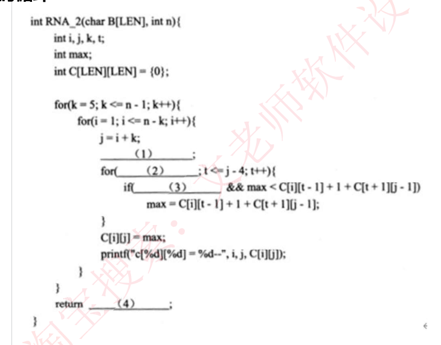
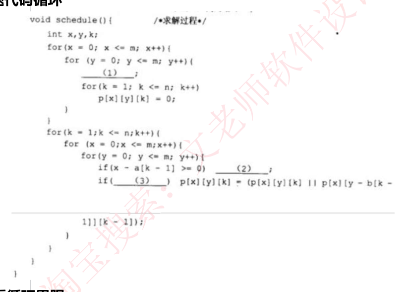
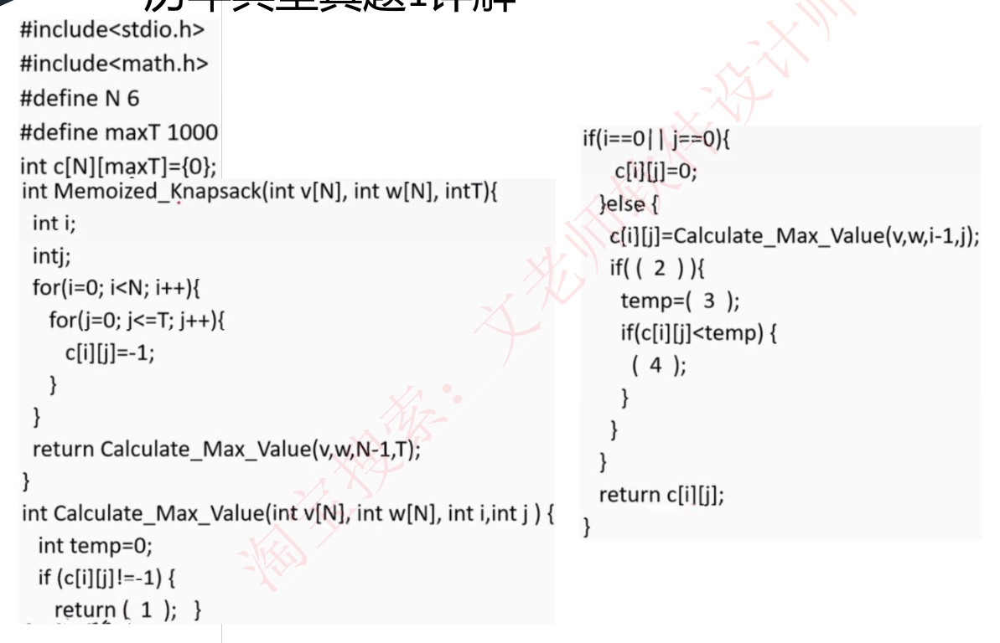
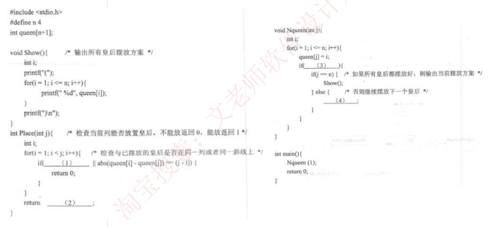

# 52 · 下午题 4：C 算法设计实战（保底策略）

> 真题：0-1 背包、n 皇后两道完整真题（外部资料，年份待核实）｜目标 8/15 分，允许丢分｜未讲（09-04 补缺课）

---

## 第 0 层 · 定位

**这一课回答**：下午题 4（C 语言算法填空，15 分必答）哪些分必须拿、哪些分可以放：C 语法够用部分、时间复杂度看循环、算法类型判断关键字。

**前后关系**：14 是知识底座（识别层面）；48 定了它排最后一位、25 分钟、目标 8 分。

**分值与去向**：15 分，全卷最难、方差最大；目标是止损不是拿高分，唯一明确允许丢分的一课。

---

## 第 1 层 · 理解

### 一句话

> 下午题 4 给你**一段算法原理描述 + 一份挖了 4 个空的 C 代码**，问三件事：**代码填空（8 分，最难）、算法类型和求解方式（4 分，最简单）、给定输入求输出（3 分，中等）**。
> **关键洞察：这三问的难度是【倒序】的——所以做题顺序必须反着来。**

### 痛点："我是程序员，这题我应该会" —— 然后拿了 4 分

这是软考中级最贵的一个错觉。原因：

- **工作里写代码是"从零构建"，考试是"在别人的残缺代码里填空"**——后者要求你先逆向理解出题人的代码风格、变量命名、递归边界，这是完全不同的技能。
- **代码里没有注释、变量名极短**（`c[i][j]`、`temp`、`Place(i)`），而且往往是**教材式的紧凑写法**，不是工程写法。
- **最致命的**：很多人**从问题 1（代码填空）开始做**，卡在第一个空上二十分钟，然后问题 2、3 那简单的 7 分也没时间拿。

### 一条主线（本课的核心是"顺序"，不是"技巧"）

```
这道题 15 分，分成三问，难度【倒序】：
    问题1 C代码填空（4 空，8 分）── 最难 ── 需要理解算法原理
    问题2 算法类型 + 求解方式（4 分）── 最简单 ── 只需认关键词
    问题3 给定输入求输出（3 分）── 中等 ── 不看代码，按原理手推
   ↓ 于是唯一正确的做题顺序是：
   ↓
   ①先做问题2（4 分）── 读题干找关键词，30 秒
        "最优子结构/递归式/公式" → 动态规划
        "分成两部分/分而治之"    → 分治
        "回溯/退回上一步"        → 回溯
        "当前情况下最优/局部最优" → 贪心
   ②再做问题3（3 分）── 【完全不看 C 代码】，直接按题干给的算法原理一步步手推
   ③最后做问题1（8 分）── 剩多少时间做多少，填不出就跳
   ↓ 光①②就锁定 7 分，已经接近目标 8 分
   ↓
   问题1 也不是无解，有两条实战捷径：
       捷径A：题干里给的【递归式公式】几乎逐行对应代码
       捷径B：代码里【别处已经出现过类似分支】，照着仿写
   ↓ 外部资料原话："即便不理解算法原理也可以推导出答案"
```

**一句话收口**：`先拿走简单的 7 分，再用剩余时间去啃 8 分的代码填空。顺序错了，这题就废了。`

---

## 第 2 层 · 考点：考试怎么问

### 考点① 问题 2：算法类型判断（4 分，必拿，30 秒解决）

**题目长什么样**：
> 根据说明和 C 代码，算法采用了 (5) 设计策略。在求解过程中，采用了 (6)（自底向上或者自顶向下）的方式。

**关键词对照表（本课最重要的一张表，背死）**：

| 题干出现的关键词 | 算法类型 |
|---|---|
| **最优子结构**、**递归式**、**公式**、`c[i][j] = max(...)` | **动态规划法** |
| **分成两部分**、**分而治之**、每次问题规模减半 | **分治法** |
| **回溯**、**退回到上一步**、**尝试→冲突→换下一列** | **回溯法** |
| **求最优，但没有最优子结构/递归式**、**当前情况下最优**、**局部最优** | **贪心法** |
| 广度优先/最小耗费优先、**活结点表** | **分支限界法** |

**外部资料归纳的六个真题案例**（直接对照记忆）：

| 真题场景 | 判断依据 | 算法 |
|---|---|---|
| **0-1 背包问题** | 「具有**最优子结构**性质」「可得到如下所示的**递归式**」 | **动态规划** |
| **RNA 二级结构最优配对** | 「C(i,j) 可以**递归**地定义为」 | **动态规划** |
| **钢条切割** | 「rn 的**递归定义**如下」「给出自顶向下和自底向上两种实现方式」 | **动态规划** |
| **n 皇后问题** | 「**回溯**到上一个皇后考虑在原来位置的下一个位置上继续尝试」 | **回溯法** |
| **假币问题** | 「将 n 枚硬币**分成相等的两部分**」 | **分治法** |
| **集装箱装载** | 「最先适宜策略 firstfit / 最优适宜策略 bestfit」，**求最优但无递归式** | **贪心法** |

**"自底向上 vs 自顶向下"怎么判**：

| 方式 | 代码特征 |
|---|---|
| **自底向上** | 用**双层 for 循环**从小规模往大规模填表（`for(i=0;i<N;i++) for(j=0;j<=T;j++)`） |
| **自顶向下** | 用**递归调用**，从大问题往下拆（`Calculate_Max_Value(v,w,i-1,j)`） |

> ⚠️ **注意一个坑，且这个坑本课存疑**：真题 1 的 C 代码里**同时出现了双层 for 循环和递归函数**，外部资料给的答案是 **自底向上**。
>
> **但本课必须如实说明：这个答案与代码事实对不上。** 经实际编译加埋点运行——那两层 for 循环做的只是 `c[i][j] = -1`（把表填成"尚未计算"的哨兵），**一个真实数值都没算**；表共 72 格，实际只结算 28 格，且是**按需展开**、最后才落定目标格。函数名 `Memoized_Knapsack` 本身就是"备忘录法"，CLRS 的标准叫法是**「带备忘的自顶向下法」**。按本课这条判据（主控是递归 → 自顶向下），这题应判**自顶向下**。
>
> **怎么办**：考试按外部答案写"自底向上"（目前唯一有出处的答案），但**要清楚判据本身没错，是这道题的答案存疑**。该题原始年份与官方答案未能核实，标注**待核实**。

**陷阱**：
- ⚠️ **贪心 vs 动态规划最容易混**。判据：**有没有给出递归式/最优子结构**。给了就是 DP，没给只说"每次选当前最好的"就是贪心。
- ⚠️ 题干说"**最优**"不代表就是 DP——贪心也求最优。**看有没有递归式**。

---

### 考点② 问题 3：给定输入求输出（3 分，不看代码，纯手推）

**题目长什么样**：
> 若 5 项物品的价值数组和重量数组分别为 v[]= {0,1,6,18,22,28} 和 w[]= {0,1,2,5,6,7}，背包容量为 T= 11，则获得的最大价值为 (7)。

**怎么解**：外部资料的建议非常明确——
> 第三小题，**一般应该先做，不需要根据 C 代码，直接根据题目给出的算法原理，一步步推导即可得出答案**，耐心推导并不难。**但要注意，如果遇到算法原理十分复杂的，建议放弃**，掌握问题 1 和 2 的技巧即可。

**操作**：
1. 把题干给的**递归式**或**算法步骤**抄到草稿纸上；
2. 代入给定的小规模数据（考试给的数据规模都很小，5 个物品、4 皇后这种）；
3. **手工列表推导**。

**陷阱**：
- ⚠️ **不要去读 C 代码来求输出**——代码有 4 个空，你连代码都不完整，怎么模拟执行？**必须用题干的原理推。**
- ⚠️ 遇到 RNA 二级结构这种原理极复杂的，**果断放弃这 3 分**，把时间给问题 1。

---

### 考点③ 问题 1：C 代码填空（8 分，最后做，有两条捷径）

**题目长什么样**：
> 根据说明和 C 代码，填充 C 代码中的空 (1) ~ (4)。（8 分）

**捷径 A：题干的递归式几乎逐行对应代码**

外部资料原话：
> 近几年的算法设计真题**有很大的技巧，即便不理解算法原理也可以推导出答案**，要**结合算法描述中的公式，以及算法代码中类似的分支**，能够发现填空的答案在代码中其他地方已经给出。

以真题 1（0-1 背包）为例，题干给的递归式：
```
c[i][T] = 0                                          若 i=0 或 T=0
        = c[i-1][T]                                  若 T < w[i]
        = max(c[i-1][T-w[i]] + v[i], c[i-1][T])      若 i>0 且 T ≥ w[i]
```
代码里的三个分支**一一对应**这三行。空 (2) 是那个 `if` 的条件，对照递归式第三行的条件 `i>0 且 T ≥ w[i]` → 答案 `j>=w[i]&&i>0`。空 (3) 是 max 里的第一项，对照 `c[i-1][T-w[i]] + v[i]` → 答案 `Calculate_Max_Value(v,w,i-1,j-w[i])+v[i]`。

**捷径 B：代码里别处已有类似写法，照抄**

以真题 1 为例，代码里已有一行 `c[i][j]=Calculate_Max_Value(v,w,i-1,j);`——空 (3) 只是它的变体（把 `j` 换成 `j-w[i]`，再加 `+v[i]`）。**你甚至不需要懂背包问题，只要看出这是同一个函数的另一种调用形式。**

**通用填空套路（按空的位置判断）**：

| 空的位置 | 大概率填什么 |
|---|---|
| `if( ___ )` 里 | **条件表达式**——对照题干递归式的分支条件 |
| `return ___;` | **返回值**——看函数名和上下文该返回什么 |
| 赋值语句右边 | **表达式**——找代码里同类赋值仿写 |
| 递归调用的参数 | **规模缩小一步**（`i-1`、`j-w[i]`、`j+1`） |
| 循环边界 | 对照题干的数据规模说明（`i<=n`、`j<=T`） |

**陷阱**：
- ⚠️ **注意 C 的数组下标从 0 还是 1 开始**。真题 2（n 皇后）题干明说 `1 ≤ queen[i] ≤ n`，代码相应写成 `for(i=1;i<j;i++)`、数组开 `queen[n+1]` 多留一格——**读循环边界和数组声明就能看出基准**。
> （注意别混：n 皇后那题的空 (2) 填 `1`，是因为它是 `Place()` 的**布尔返回值**"能放=1"，**与下标基准无关**。）
- ⚠️ **填不出就跳**，一个空最多花 3 分钟。

---

### 考点④ 时间复杂度（可能出现在问题 2 或单独一问）

**判断方法（外部资料原话）**：
> **时间复杂度就是看 C 代码中的 for 循环层数和每一层的循环次数**，涉及到二分必然有 O(log n)。
> **看代码循环重数，注意是嵌套的重数，不是个数。**

**两个真题示例**：



**O(n³)：三重循环猜测。**



**O(m²·n)：看循环界限。**

> 💡 第二个例子的要点：**别默认"两层嵌套"就是 O(mn)**。这段代码外两层写的是 `for(x=0;x<=m;x++)` 和 `for(y=0;y<=m;y++)`——**上界都是 m**，最内层才是 `for(k=1;k<=n;k++)`，所以是 m × m × n = **O(m²n)**。
> **正确做法：逐个抄下每一层循环变量的上界再相乘**，不要数层数拍脑袋。

**陷阱**：
- ⚠️ **嵌套才相乘，并列只取最大**。三个并列的单层循环是 O(n)，不是 O(n³)。
- ⚠️ **循环体内有二分/折半 → 乘一个 log n**。

---

## 完整算例

### 算例 A：0-1 背包（三问完整拆解，按正确顺序做）

【真题·年份待核实】（来源：外部培训资料"历年典型真题 1"）

#### 【说明】

0-1 背包问题定义为：给定 i 个物品的价值 v[1…i]、重量 w[1…i] 和背包容量 T，每个物品装到背包里或者不装到背包里。求最优的装包方案，使得所得到的价值最大。

**0-1 背包问题具有最优子结构性质。** 定义 c[i][T] 为最优装包方案所获得的最大价值，则可得到如下所示的**递归式**：

```
c[i][T] = 0                                          若 i=0 或 T=0
        = c[i-1][T]                                  若 T < w[i]
        = max(c[i-1][T-w[i]] + v[i], c[i-1][T])      若 i>0 且 T ≥ w[i]
```



#### 【第一步】先做问题 2（4 分，30 秒）

> 根据说明和 C 代码，算法采用了 (5) 设计策略。在求解过程中，采用了 (6)（自底向上或者自顶向下）的方式。

**分步解**：
1. 题干第二段第一句：「0-1 背包问题具有**最优子结构**性质」→ 关键词命中 → **动态规划法**。
2. 「则可得到如下所示的**递归式**」→ 再次确认动态规划。
3. 看代码主控结构：外部答案给 **自底向上**（依据是"双层 for 循环在前"）。

> ⚠️ 如考点①所述，这份代码实为**记忆化递归（带备忘的自顶向下）**，双层 for 只是把表初始化成 -1。**答案照外部写，但别拿它校准你对判据的理解。**

**答案**：(5) 动态规划法　(6) 自底向上（**存疑，见考点①**）　✅ **4 分到手**

#### 【第二步】再做问题 3（3 分，纯手推，不看代码）

> 若 v[]= {0,1,6,18,22,28}，w[]= {0,1,2,5,6,7}，T= 11，则最大价值为 (7)。

**分步解**：

物品清单（下标 0 是哨兵，实际 5 个物品）：

| 物品 i | 1 | 2 | 3 | 4 | 5 |
|---|---|---|---|---|---|
| 价值 v | 1 | 6 | 18 | 22 | 28 |
| 重量 w | 1 | 2 | 5 | 6 | 7 |

背包容量 T = 11。**穷举合理组合**（规模小，直接列）：

| 组合 | 总重量 | 是否 ≤11 | 总价值 |
|---|---|---|---|
| {5} | 7 | ✓ | 28 |
| {4} | 6 | ✓ | 22 |
| {3,4} | 5+6=11 | ✓ | 18+22 = **40** |
| {2,5} | 2+7=9 | ✓ | 6+28 = 34 |
| {1,2,5} | 1+2+7=10 | ✓ | 1+6+28 = 35 |
| {3,5} | 5+7=12 | ✗ 超重 | — |
| {4,5} | 6+7=13 | ✗ 超重 | — |
| {1,3,4} | 1+5+6=12 | ✗ 超重 | — |
| {1,2,3} | 1+2+5=8 | ✓ | 1+6+18 = 25 |
| {2,3,4} | 2+5+6=13 | ✗ 超重 | — |

**最大值 = 40**（选物品 3 和 4，重量刚好装满 11）。

**答案**：(7) **40**　✅ **累计 7 分**

> ⚠️ **上表只是"高价值候选"，不是完整穷举**（5 个物品共 31 个非空子集，上表只列了 10 个）。漏掉的可行组合里最高的是 {1,5}=29 与 {1,2,4}=29，均低于 40，**本题结论不受影响**——但换一组数据就可能漏掉最优解。
>
> 💡 **正确的手推姿势**：这一步**完全不碰 C 代码**，但要么**写全所有组合**，要么**按价值密度从高到低挑候选、再确认没有更优**。别把"随手列几行"当成穷举。

#### 【第三步】最后做问题 1（8 分，用两条捷径）

代码结构（关键部分）：
```c
int Memoized_Knapsack(int v[N], int w[N], int T){
    int i, j;
    for(i=0; i<N; i++){
        for(j=0; j<=T; j++){
            c[i][j]=-1;
        }
    }
    return Calculate_Max_Value(v,w,N-1,T);
}

int Calculate_Max_Value(int v[N], int w[N], int i, int j){
    int temp=0;
    if (c[i][j]!= -1) {
        return ( 1 );                       // ← 空(1)
    }
    if(i==0 || j==0){
        c[i][j]=0;
    } else {
        c[i][j]=Calculate_Max_Value(v,w,i-1,j);
        if( ( 2 ) ){                         // ← 空(2)
            temp=( 3 );                      // ← 空(3)
            if(c[i][j]<temp) {
                ( 4 );                       // ← 空(4)
            }
        }
    }
    return c[i][j];
}
```

**空 (1)｜捷径 B（找代码里的同类写法）**：
`if (c[i][j] != -1)` 的含义是"这个子问题**已经算过了**"（记忆化搜索的标志）。算过了就直接返回缓存值。函数末尾已经有 `return c[i][j];` → **空(1) = `c[i][j]`**

**空 (2)｜捷径 A（对照递归式）**：
递归式第三行的条件是 `若 i>0 且 T ≥ w[i]`。代码里 `else` 分支已经保证了 `i!=0 && j!=0`，这个 `if` 要判断的是"当前容量 j 装得下第 i 个物品吗" → `j >= w[i]`。标准答案连 `i>0` 一起写上 → **空(2) = `j>=w[i]&&i>0`**

**空 (3)｜捷径 A + B**：
递归式第三行 max 的第一项是 `c[i-1][T-w[i]] + v[i]`。代码里上一行已经有 `Calculate_Max_Value(v,w,i-1,j)` 这个写法 → 把 `j` 换成 `j-w[i]`，再加 `+v[i]` → **空(3) = `Calculate_Max_Value(v,w,i-1,j-w[i])+v[i]`**

**空 (4)｜逻辑推断**：
`if(c[i][j]<temp)` 说明"装第 i 个物品更划算"，那就应该**更新为更大的值** → **空(4) = `c[i][j]=temp`**

**答案**：
- (1) `c[i][j]`
- (2) `j>=w[i]&&i>0`
- (3) `Calculate_Max_Value(v,w,i-1,j-w[i])+v[i]`
- (4) `c[i][j]=temp`

> 💡 **复盘**：四个空里，**(1)(3)(4) 完全靠"在代码里找同类写法"就能填出**，只有 (2) 需要对照题干递归式。这就是外部资料说的"即便不理解算法原理也可以推导出答案"。

---

### 算例 B：n 皇后（回溯法，四空填空）

【真题·年份待核实】（来源：外部培训资料"历年典型真题 2"）

#### 【说明】

n 皇后问题描述为：在一个 n×n 的棋盘上摆放 n 个皇后，要求任意两个皇后不能冲突，即任意两个皇后不在同一行、同一列或者同一斜线上。

算法的基本思想：将第 i 个皇后摆放在第 i 行，i 从 1 开始，每个皇后都从第 1 列开始尝试。尝试时判断在该列摆放皇后是否与前面的皇后有冲突，如果没有冲突，则在该列摆放皇后，并考虑摆放下一个皇后；如果有冲突，则考虑下一列。**如果该行没有合适的位置，回溯到上一个皇后考虑在原来位置的下一个位置上继续尝试摆放皇后**，……，直到找到所有合理摆放方案。

**常量和变量说明**：n = 皇后数，棋盘规模为 n×n；**queen[] = 皇后的摆放位置数组，queen[i] 表示第 i 个皇后的位置，1 ≤ queen[i] ≤ n**



#### 【第一步】问题 2（3 分）

**分步解**：题干「**回溯**到上一个皇后考虑在原来位置的下一个位置上继续尝试」→ 关键词直接命中 → **回溯法**。

**答案**：(5) **回溯法**　✅ **3 分到手**

#### 【第二步】问题 3（4 分）

> 当 n=4 时，有 (6) 种摆放方式，分别为 (7)。

**分步解**：**手工枚举 4×4 棋盘**（不看代码）。

用 `queen[1..4]` 表示第 1~4 行的皇后各在第几列。约束：列不重复，且任意两皇后 `|i-j| != |queen[i]-queen[j]|`（不在同一斜线）。

尝试 queen[1]=1：
- queen[2] 只能是 3 或 4（2 同斜线）。
  - queen[2]=3 → queen[3] 不能是 1,3（列冲突）、不能是 2（与 queen[2]=3 差 1 行差 1 列，斜线）、不能是 4（与 queen[1]=1 差 2 行差 3 列 OK；但与 queen[2]=3 差 1 行差 1 列，斜线冲突）→ **无解**
  - queen[2]=4 → queen[3] 只能是 2 → queen[4] 只能是 3？检查 queen[4]=3 与 queen[3]=2：差 1 行差 1 列 → 斜线冲突 → **无解**

尝试 queen[1]=2：
- queen[2]=4（1、3 与 2 冲突或斜线）
- queen[3]=1（3 列已被占？未占；但 1 与 queen[2]=4 差 1 行差 3 列 OK，与 queen[1]=2 差 2 行差 1 列 OK）→ 可行
- queen[4]=3（与 queen[3]=1 差 1 行差 2 列 OK，与 queen[2]=4 差 2 行差 1 列 OK，与 queen[1]=2 差 3 行差 1 列 OK）→ ✅ **解 1：2413**

尝试 queen[1]=3：**由对称性**，得 ✅ **解 2：3142**

尝试 queen[1]=4：与 queen[1]=1 对称，无解。

**答案**：(6) **2** 种　(7) 分别为 **2413、3142**　✅ **累计 7 分**

#### 【第三步】问题 1（8 分）

```c
#define n 4
int queen[n+1];

int Place(int j){          /* 检查当前列能否放置皇后，不能放返回 0，能放返回 1 */
    int i;
    for(i = 1; i < j; i++){    /* 检查与已摆放的皇后是否在同一列或同一斜线上 */
        if( ( 1 ) || abs(queen[i] - queen[j]) == (j - i)){
            return 0;
        }
    }
    return ( 2 );
}

void Nqueen(int j){
    int i;
    for(i = 1; i <= n; i++){
        queen[j] = i;
        if( ( 3 ) ){
            if(j == n) {       /* 如果所有皇后都摆放好，则输出当前摆放方案 */
                Show();
            } else {           /* 否则继续摆放下一个皇后 */
                ( 4 );
            }
        }
    }
}
```

**空 (1)｜逻辑推断**：注释说"检查与已摆放的皇后是否在**同一列或同一斜线**上"。`||` 右边 `abs(queen[i]-queen[j]) == (j-i)` 已经是**斜线**判断，那么左边必然是**同一列**判断 → **空(1) = `queen[i]==queen[j]`**

**空 (2)｜逻辑推断**：函数注释"不能放返回 0，**能放返回 1**"。循环走完没冲突 → **空(2) = `1`**

**空 (3)｜逻辑推断**：`queen[j]=i;` 试着把第 j 行的皇后放在第 i 列，接下来必须**检查能不能放** → 调用 **`Place(j)`**。

> 🔴 **本题必须纠正外部资料的答案**。外部转录资料此处写作 `Place(i)&&j<=n`，**这不是"形参名不一致的小瑕疵"，而是会让程序算错的功能性错误**：
> - `Nqueen(int j)` 里 **`j` 是行号、`i` 是正在试的列号**；而 `Place(int j)` 的形参是**行号**（内部 `for(i=1;i<j;i++)` 拿 `queen[i]` 与 `queen[j]` 比）。传 `i` 进去 = **把列号当行号用**。
> - 经实际编译运行验证：填 `Place(i)` 会输出 `(1 1 1 1)`、`(2 1 1 1)`、`(2 1 3 3)` 等 **5 个非法解**（四个皇后挤在同一列也被当成解）；填 `Place(j)` 才得到正确的 2 个解 `2413`、`3142`。
> - 也就是说，**照抄 `Place(i)` 会让本题问题 1 的答案与问题 3 的答案自相矛盾**。
> - 另外 `j<=n` 是冗余的：`j` 是行号，`Nqueen` 只在 `j != n` 时才递归，该条件恒成立。
>
> **判断**：`i` / `j` 形近，外部资料此处极可能是转录或 OCR 讹误。**本课按 `Place(j)` 讲。**

**空 (4)｜逻辑推断 + 捷径 B**：else 分支的注释是"**继续摆放下一个皇后**"，函数名是 `Nqueen` → **空(4) = `Nqueen(j+1)`**

**答案**：
- (1) `queen[i]==queen[j]`
- (2) `1`
- (3) `Place(j)`　⚠️ 外部资料作 `Place(i)&&j<=n`，经编译验证为错，理由见上文
- (4) `Nqueen(j+1)`

> 💡 **复盘**：这四个空**全部靠代码注释 + 函数名推断**，一行算法原理都不用懂。**代码注释是出题人留给你的最大礼物，务必逐行读。**

---

### 算例 C：止损演练（如果完全看不懂代码怎么办）

**场景【模拟】**：考场上你拿到试题 4，题干是"RNA 二级结构最优配对"，递归式里有四个约束条件，代码 30 行全是下标运算。你完全看不懂。

**止损操作**：

**第 1 步（30 秒）**：扫题干找关键词。看到「C(i,j) 可以**递归**地定义为」+ 一个 max 公式 → **动态规划法**。
→ **问题 2 拿 4 分（如果还问自底向上/自顶向下，看主控是循环还是递归）**

**第 2 步（3 分钟）**：看问题 3 要推什么。如果原理复杂到推不动 → **果断放弃这 3 分**。

**第 3 步（剩余时间）**：回问题 1，用捷径扫一遍四个空：
- 有没有哪个空是 `return xxx;`？→ 看函数末尾/别处的 return 仿写
- 有没有哪个空在 `if()` 里？→ 对照题干公式的分支条件
- 有没有哪个空是递归调用？→ 照着代码里已有的调用改参数
- **哪怕只填对 1 个空也是 2 分**

**结果**：4（问题2）+ 0（放弃问题3）+ 2~4（问题1蒙对1~2空）= **6~8 分**

**对照本课目标 8 分**：即使遇到最坏情况，止损策略也能保住 6 分以上。而如果按题号顺序做、死磕问题 1，很可能是 **0~2 分**。

---

## 速记

**1. 做题顺序（本课最重要的一条）**
> **问题2（算法类型，4分）→ 问题3（求输出，3分）→ 问题1（代码填空，8分）**
> **顺序反着做，先锁 7 分**

**2. 算法类型关键词**
> **最优子结构 / 递归式 / 公式 → 动态规划**
> **分成两部分 / 分而治之 → 分治**
> **回溯 / 退回上一步 → 回溯**
> **求最优但无递归式 / 当前情况下最优 → 贪心**

**3. 自底向上 vs 自顶向下**
> **主控是双层 for 填表 → 自底向上；主控是递归调用 → 自顶向下**

**4. 问题 3 铁律**
> **不看 C 代码，只按题干原理手推。数据规模都很小，穷举最快**

**5. 代码填空两条捷径**
> **捷径A：题干递归式逐行对应代码分支**
> **捷径B：代码里别处已有同类写法，改参数照抄**
> **注释和函数名是最大提示，逐行读**

**6. 时间复杂度**
> **看嵌套重数（不是个数），嵌套相乘、并列取最大，见二分乘 log n**

**7. 做题顺序要升级成四步（重要修正）**
> **①问题2（30秒）→ ②扫一眼问题1 的四个空（30秒），凡"注释/函数名/别处已有同类写法"直给的先填掉 → ③问题3 → ④回头啃剩下的硬空**
> 理由：算例B（n皇后）四个空**全靠注释和函数名就能填**，是送分题。若死守"问题1 最后做"，碰上这种题会白丢 8 分。

**8. 止损红线**
> **一个空最多 3 分钟，填不出就跳。原理太复杂的问题 3 直接放弃**
> **目标 8 分，允许丢 7 分——这题不需要拿高分**
> **最坏情况（问题1 一空未中）只有 3~4 分，不是 6 分——所以第②步"扫送分空"不能省**

---

## 自测练习

**练习 1【模拟·下午题型】** 阅读下列说明和 C 代码，回答问题。

**【说明】**
最长公共子序列（LCS）问题定义为：给定两个序列 X = <x₁,x₂,…,xₘ> 和 Y = <y₁,y₂,…,yₙ>，求它们的最长公共子序列的长度。

该问题**具有最优子结构性质**。设 c[i][j] 表示 X 的前 i 个字符与 Y 的前 j 个字符的最长公共子序列长度，可得如下**递归式**：
```
c[i][j] = 0                            若 i=0 或 j=0
        = c[i-1][j-1] + 1              若 i,j>0 且 xᵢ = yⱼ
        = max(c[i][j-1], c[i-1][j])    若 i,j>0 且 xᵢ ≠ yⱼ
```

**【C 代码】**
```c
#define M 100
int c[M][M];

int LCS_Length(char X[], char Y[], int m, int n){
    int i, j;
    for(i = 0; i <= m; i++)  c[i][0] = 0;
    for(j = 0; j <= n; j++)  c[0][j] = 0;

    for(i = 1; i <= m; i++){
        for(j = 1; j <= n; j++){
            if( ___(1)___ ){
                c[i][j] = ___(2)___ ;
            } else {
                if(c[i][j-1] >= c[i-1][j])
                    c[i][j] = c[i][j-1];
                else
                    c[i][j] = ___(3)___ ;
            }
        }
    }
    return ___(4)___ ;
}
```

**【问题 1】（8 分）** 填充 C 代码中的空 (1) ~ (4)。
**【问题 2】（4 分）** 该算法采用了 (5) 设计策略，采用了 (6)（自底向上/自顶向下）的方式。该算法的时间复杂度为 (7)。
**【问题 3】（3 分）** 若 X = "ABCBDAB"，Y = "BDCABA"，则最长公共子序列的长度为 (8)。

---

### 参考答案

**先做问题 2**：

- **(5) 动态规划法**。依据：题干明写「**具有最优子结构性质**」「可得如下**递归式**」——两个关键词双重命中。
- **(6) 自底向上**。依据：代码主控是 `for(i=1;i<=m;i++) for(j=1;j<=n;j++)` **双层循环从小规模往大规模填表**，无递归调用。
- **(7) O(mn)**。依据：两层嵌套循环，外层 m 次、内层 n 次，**嵌套相乘** → O(m×n)。

**再做问题 3**：

X = "ABCBDAB"（m=7），Y = "BDCABA"（n=6）。

手工填表（行 = X 的前 i 个字符，列 = Y 的前 j 个字符）：

| | — | B | D | C | A | B | A |
|---|---|---|---|---|---|---|---|
| **—** | 0 | 0 | 0 | 0 | 0 | 0 | 0 |
| **A** | 0 | 0 | 0 | 0 | 1 | 1 | 1 |
| **B** | 0 | 1 | 1 | 1 | 1 | 2 | 2 |
| **C** | 0 | 1 | 1 | 2 | 2 | 2 | 2 |
| **B** | 0 | 1 | 1 | 2 | 2 | 3 | 3 |
| **D** | 0 | 1 | 2 | 2 | 2 | 3 | 3 |
| **A** | 0 | 1 | 2 | 2 | 3 | 3 | 4 |
| **B** | 0 | 1 | 2 | 2 | 3 | **4** | 4 |

**(8) = 4**（一个最长公共子序列是 "BCBA" 或 "BDAB"，长度均为 4）

**最后做问题 1**：

- **(1) = `X[i-1] == Y[j-1]`**
  依据（捷径 A）：对照递归式第二行的条件 `xᵢ = yⱼ`。注意 C 数组下标从 0 开始，第 i 个字符是 `X[i-1]`。
  > 若题目约定数组从 1 开始存字符，则写 `X[i]==Y[j]`——**看题干的常量说明**。
- **(2) = `c[i-1][j-1] + 1`**
  依据（捷径 A）：递归式第二行的值。
- **(3) = `c[i-1][j]`**
  依据（捷径 B）：`if` 分支已写 `c[i][j] = c[i][j-1];`，`else` 是 max 的另一半 → `c[i-1][j]`。
- **(4) = `c[m][n]`**
  依据：函数要返回"X 前 m 个与 Y 前 n 个的 LCS 长度"，即表格右下角。

**得分复盘**：按本课顺序作答，问题 2（4 分）+ 问题 3（3 分）= **7 分先落袋**；问题 1 的四个空里，(2)(3)(4) 靠捷径都能填出（6 分），只有 (1) 需要注意下标偏移。**总分可达 13 分，远超本课 8 分的目标。**

---

## 考题回顾

| # | 出处 | 考点 | 状态 |
|---|---|---|---|
| 1 | 下午题 4·0-1 背包（外部资料"历年典型真题 1"） | 动态规划识别、自底向上、代码填空两条捷径 | 已作为算例 A 逐问拆解，**年份待核实** |
| 2 | 下午题 4·n 皇后（外部资料"历年典型真题 2"） | 回溯法识别、手工枚举求解、靠注释填空 | 已作为算例 B 拆解，**年份待核实** |
| 3 | 外部资料"看看历年真题判断关键字"六案例 | RNA 二级结构、钢条切割、假币问题、集装箱装载 | 已归纳进考点①对照表，**年份待核实** |

> ⚠️ **本课练习尚未作答**，需在课堂检验环节收题批改后回填。
> ⚠️ **策略提醒**：按 `计划/00-总体计划.md` 的既定方针，本题**维持"保底"投入，不单独扩容**。若第二轮模拟中本题稳定在 8 分以上，**不要追加复习时间**，把时间投给试题 1/2/3/6。
