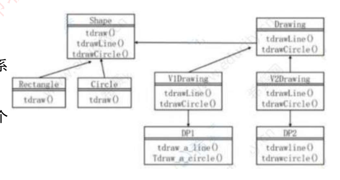

# 28 · 面向对象：设计模式（一）——创建型与结构型 · 题库

> 真题：适配器 2022下；桥接四问、抽象工厂/桥接/命令三连 两题年份待核实；原型与创建型归属 2023上（考点重现）｜无计算｜未讲
> 讲义 → 讲义/28-面向对象-设计模式一创建型与结构型（V2）.md

## 考试怎么考

**考点① 分类归属。** 直接问"XX 属于哪一类"，或者在多空题的最后一空问。三处最容易记反：**享元是结构型**（它有个"享元工厂"，最容易被当成创建型）；**生成器是创建型**（"构建过程"四个字像行为型）；**简单工厂不在 23 个之内**。第二个维度按图上的下划线判：只有**工厂方法、适配器、解释器、模板方法**四个能当类模式，其余一律是对象模式——23 个里只有这 4 个沾"类"，所以两段式答案的后半个词绝大多数是"对象"，见到"结构型类"先怀疑。

**考点② 给一句意图，选模式名。** 这是本课最主要的题型，题干往往就是定义原句的改写，考的是"记忆关键字"这一栏。下表左列一字照录资料原文，右列是它在题干里通常的说法：

| 模式 | 资料原文的「记忆关键字」 | 题干里通常长这样 |
|---|---|---|
| 抽象工厂 Abstract Factory | 抽象接口 | 一系列／一族相关或相互依赖的对象、整套配套 |
| 构建器 Builder（生成器） | 类和构造分离 | 表示与构造分离、相同的构建过程得出不同的表示 |
| 工厂方法 Factory Method | 子类决定实例化 | 由子类决定实例化哪一个类、实例化推迟到子类 |
| 原型 Prototype | 原型实例，拷贝 | 复制自身、通过拷贝已有对象来创建新对象、克隆 |
| 单例 Singleton | 唯一实例 | 只有一个实例、全局访问点 |
| 适配器 Adapter | 转换，兼容接口 | 接口不相容／不符合要求、转换成希望的接口 |
| 桥接 Bridge | 抽象和实现分离 | 抽象部分与实现部分分离、都可以独立变化 |
| 组合 Composite | 整体-部分，树形结构 | 树型结构、部分-整体层次、单个与组合使用一致 |
| 装饰 Decorator | 附加职责 | 动态添加额外职责、比派生子类更灵活 |
| 外观 Façade | 对外统一接口 | 为子系统的一组接口提供一致的外观、高层接口 |
| 享元 Flyweight | 细粒度，共享 | 支持大量细粒度对象的共享 |
| 代理 Proxy | 代理控制 | 为其他对象提供代理以控制对该对象的访问 |

**考点③ "该模式适用于（ ）的情况"和"以下叙述不正确的是"。** 这两种题的四个选项里，错项常见的造法有三种：**把另一个模式的适用场景搬来当选项**（"想表示对象的部分-整体层次结构"是组合的、"想使用一个已经存在的类，而它的接口不符合要求"是适配器的、"以动态透明的方式给单个对象添加职责"是装饰的——这三条就是练习 2 里三个错项的真实出处）；**把分类写错**（问的是结构型，给你一个行为型的名字）；**把方向写反**（"由父类决定实例化哪一个子类"，工厂方法是反过来的）。对付它的办法是先认出正确那条对应哪个模式，再回头看题干问的是不是同一个。

---

## 练习

**1.【真题·2022下】** 驱动新能源汽车的发动机时，电能和光能汽车分别采用不同驱动方法，而客户装希望使用统一的驱动方法，需定义一个统一的驱动接口屏藏不同的驱动方法，该要求适合采用（ ）模式。
A.中介者(Mediator)　B.访问者(Visitor)　C.观察者(Observer)　D.适配器(Adapter)
　　（题库把"客户端"印作"客户装"、"屏蔽"印作"屏藏"，OCR 讹字照录。）

**2.【真题·年份待核实】** 欲开发一个绘图软件，要求使用不同的绘图程序绘制不同的图形，该绘图软件的扩展性要求将不断扩充新的图形和新的绘图程序，以绘制直线和图形为例，得到下图所示的类图，该设计采用（ ）模式将抽象部分与其实现部分分离，使它们都可以独立的变化。其中（ ）定义了实现类接口，该模式适用于（ ）的情况，该模式属于（ ）模式。
第一空：A. 适配器（adapter）　B. 装饰（Decorator）　C. 桥接（Bridge）　D. 组合（composite）
第二空：A. Shape　B. Circle 和 Rectangle　C. V1Drawing 和 V2Drawing　D. Drawing
第三空：A. 不希望在抽象和它的实现部分之间有一个固定判定关系　B. 想表示对象的部分-整体层次结构　C. 想使用一个已经存在的类，而它的接口不符合要求　D. 在不影响其他对象的情况下，以动态透明的方式给单个对象添加职责
第四空：A. 创建型对象　B. 结构型对象　C. 行为型对象　D. 结构型类

> 读图提示：这是桥接的标准结构——`Shape` 那条继承线是**抽象部分**（使用者直接面对的那侧），`Drawing` 那条是**实现部分**（真正干活的那侧），`Shape` 持有一个 `Drawing`。原件是扫描件，两条线的箭头端不易分辨，按这个结构对号即可；`Tdraw_a_circle()` / `tdrawline()` 的大小写出入也是排印问题，不影响作答。

**3.【真题·年份待核实】** 设计模式描述了一个出现在特定设计语境中的设计再现问题，并为它的解决方案提供了一个经过充分验证的通用方案，不同的设计模式关注解决不同的问题。例如，抽象工厂模式提供一个接口，可以创建一系列相关或相互依赖的对象，而无需指定它们具体的类，它是一种（54）模式；（55）模式将类的抽象部分和它的实现部分分离出来，使它们可以独立变化，它属于（56）模式；（57）模式将一个请求封装为一个对象，从而可用不同的请求对客户进行参数化，将请求排队或记录请求日志，支持可撤销的操作。
（54）A. 组合型　B. 结构型　C. 行为型　D. 创建型
（55）A. Bridge　B. Proxy　C. Prototype　D. Adapter
（56）A. 组合型　B. 结构型　C. 行为型　D. 创建型
（57）A. Command　B. Facade　C. Memento　D. Visitor
　　（录自培训资料，题号 54–57；未能核到一手卷面，年份与科目均待核实。）

**4.【模拟·重现2023上考点】** 在某招聘系统中要求实现求职简历自动生成功能，简历的基本内容大体相同而工作经历各不相同，且希望尽量减少重复代码。该系统由一个已有实例指定要创建对象的种类，声明一个复制自身的接口，并通过复制 Resume 和 WorkExperience 对象来创建新对象。该设计采用的是（1）模式，它属于（2）模式。
（1）A. 单例(Singleton)　B. 抽象工厂(Abstract Factory)　C. 生成器(Builder)　D. 原型(Prototype)
（2）A. 混合型　B. 行为型　C. 结构型　D. 创建型
　　（本题按 2023 上半年 44–45 题的考点自编：原卷题干在各公开题库上都被打了码，且依赖一张未收录的类图，故不冒充原题。）

**5.【模拟】** 报销系统对接税务局发票查验服务时，对方 SDK 的接口与本系统约定的接口形式不同且双方都无法修改，于是新增一个类，朝本系统这一侧长成本系统约定的接口，把进来的调用转译后再转发给 SDK。该做法属于（1）；若改为在四个子系统前新增一个类，对外只暴露"提交报销单"一个方法、内部按固定顺序调用这四个子系统，则属于（2）。
A. 适配器／外观　B. 外观／适配器　C. 代理／外观　D. 适配器／代理

**6.【模拟】** 年终导出十万行报销明细，系统只创建十几个"费用类型"对象供全部行共享，每一行的金额在调用时传入。该设计采用（1）模式，其中"费用类型的报销比例"属于（2）。
A. 组合／内部状态　B. 享元／外部状态　C. 享元／内部状态　D. 原型／外部状态

**7.【模拟】** 下列模式中，不属于创建型的是（ ）。
A. 原型　B. 构建器　C. 享元　D. 单例

**8.【模拟】** 关于设计模式的叙述中，不正确的是（ ）。
A. 设计模式的四个基本要素是模式名称、问题、解决方案和效果
B. C/S 结构属于架构模式，反映的是开发软件系统过程中所作的基本设计决策
C. 引用—计数是 C++ 语言中的一种惯用法，惯用法是最低层的模式
D. 简单工厂模式是 GoF 23 个设计模式中的创建型模式之一

**自测**：
9.【模拟】报销单提交后要能自由搭配"写审批日志""发短信通知"两项附加动作，且不允许修改报销单类；另有一个需求是财务之外的人读取银行卡号时只能拿到打码结果。这两个需求各用哪个模式？判据是什么？
10.【模拟】报销单类型（差旅／招待／办公）与审批渠道（钉钉／邮件／纸质）两个维度都会继续增加。若用继承穷举组合需要多少个类？改用桥接后是多少？该模式的记忆关键字是什么？
11.【模拟】把下列四样归入正确的类别：①享元　②生成器　③代理　④原型。另外，23 个模式中哪四个"既可以是类模式，也可以是对象模式"？

### 参考答案

1. **D**。"两种驱动方法不同"＋"定义一个统一的驱动接口把差异挡在后面"，是把不相容的接口转换成使用者希望的那一种，正是适配器。中介者管一组对象互相通信、访问者管在不改元素类的前提下加新操作、观察者管一对多的通知，三者都不处理"接口对不上"。

2. **C、D、A、B**。第一空的题干原句就是桥接的定义。第二空考的是角色对号：桥接里"定义实现类接口"的是实现方一侧的顶层，也就是 **Drawing**（V1Drawing、V2Drawing 是它的具体实现，Shape 是抽象一侧）。⚠️ **培训资料与信管网一个聚合页把第二空印作 A（Shape），希赛题库作 D**；按桥接的角色定义只能是 Drawing，考场答 D。第三空另外三条分别是组合、适配器、装饰的适用场景。第四空：桥接是结构型，且它不在"带下划线"的四个之内，所以是结构型**对象**模式。

3. **D、A、B、A**。（54）抽象工厂造对象，创建型。（55）（56）题干里"将类的抽象部分和它的实现部分分离出来，使它们可以独立变化"就是桥接的定义原句，桥接属结构型。（57）"将一个请求封装为一个对象……支持可撤销的操作"是命令模式的定义原句，命令属行为型，细讲在 29。

4. **D、D**。"由一个已有实例指定要创建对象的种类""复制自身""通过复制……创建新对象"三句都指向原型；原型属创建型。生成器强调"相同过程不同表示"、抽象工厂强调"一族配套"、单例强调"只有一个"，都对不上。

5. **A**。第一处是"接口对不上、双方都改不了、加一层做转译"，适配器；第二处是"给一组子系统提供统一入口、简化调用"，外观。两者的分界是**转换**还是**简化**。

6. **C**。"大量细粒度对象共享"是享元；报销比例不随哪一行变化、可以被所有行共用，是内部状态；随行变化、调用时传入的金额才是外部状态。

7. **C**。享元属结构型。创建型五个是抽象工厂、构建器（生成器）、工厂方法、原型、单例。

8. **D**。简单工厂不属于 GoF 的 23 个模式，只是理解工厂方法的一级台阶；A、B、C 三条都是资料原文。

9. 前者用**装饰**（加的是新职责，而且要能自由组合、一层套一层），后者用**代理**（功能没变，只是控制谁能访问）。两者的类结构几乎相同，判据只有"加职责 vs 控访问"。
10. 继承穷举需 3×3＝**9** 个类；桥接拆成两条独立继承线后是 3＋3＝**6** 个。记忆关键字是**「抽象和实现分离」**。
11. ①结构型　②创建型　③结构型　④创建型；兼类模式与对象模式的四个是**工厂方法、适配器、解释器、模板方法**。
